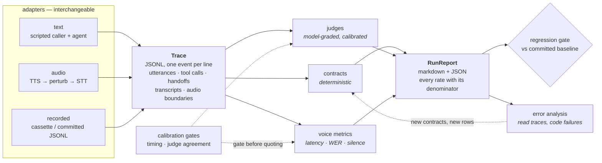

# conversation-eval-lab

An evaluation harness for conversational AI agents, voice and text, built on one
auditable trace. It is pointed at an **advisory sales-coaching platform** for
regulated financial services: an AI plays the customer, a trainee adviser
practises the call, and software grades the result — out loud, through real
speech engines, as well as in text.
**It needs no API key:** every live path has a recorded fixture that replays in
its place, so a clean clone installs and goes green offline, in under two
minutes, with no credential of any kind.

```bash
git clone https://github.com/Pinglesagar/conversation-eval-lab.git
cd conversation-eval-lab
python3.12 -m venv .venv && .venv/bin/python -m pip install -e ".[dev]"
make start          # the finding, recomputed offline
make test           # 1,343 pass
```

Python 3.12 or newer. `make install` refuses an older interpreter with the fix
rather than a stack trace. If you use [uv](https://docs.astral.sh/uv/):
`uv venv --python 3.12 && uv pip install -e ".[dev]"`.

## Sixty seconds

```bash
python3.12 -m venv .venv && source .venv/bin/activate
pip install -e ".[dev]"

pytest                 # 1,343 offline tests, 11 s, no keys
make start             # one finding, printed in a screen
```

`make start` recomputes and prints the strongest result in this repository. A
grader marked a trainee adviser down for **not asking questions, on a call where
he asked five** — because the question detector is `body.endswith("?")` and the
transcript that actually gets scored has no punctuation in it at all. It nearly
escaped: the total, the verdict and the disclosure ledger were identical either
way, and only a per-criterion comparison saw it.

Then, in the order you will want them:

| | |
| --- | --- |
| `make help` | every target, grouped — the two that spend money are marked |
| `make gate` | every offline check, cheapest first; run it before you push |
| [docs/README.md](docs/README.md) | the documentation, indexed by question |

---

Everything below is the detail, and none of it is needed to run anything.

The advisory domain is the one to read first. Retrieval comes after it, as a
different *kind* of evaluation rather than a second domain.

**On portability, plainly.** An earlier version of this repository carried a
second, unrelated system under test, and its job was to show that one engine
drives two domains. It was removed to keep the repository to one subject. So
portability is now argued by the seam rather than demonstrated by a worked second
example: `lab/` imports no domain package, and an external agent is plugged in
through a two-method protocol and a dotted path
([`docs/ADAPTER.md`](docs/ADAPTER.md)). That is a weaker claim than a second
working domain, and it is stated as one.

## The advisory domain, first

A coaching platform grades a trainee adviser's sales conversation and certifies
them as ready to sell. Four regulators are in scope — MAS (Singapore), FCA COBS
(UK), Reg BI (US) and SFC/IA (Hong Kong) — and their requirements are held as
**cited registers**, not keyword lists, so a verdict traces to a paragraph.

### The grader is the thing under test

The scorer is a judge, so it is measured before it is believed
([`make roleplay-demo`](Makefile)):

| | |
| --- | --- |
| specificity | **0.947 (36/38)** |
| recall | **0.281 (9/32)** |
| Cohen kappa | 0.241 |

It is **reluctant to fail anybody** — it catches 9 of the 32 sessions that should
fail. In a product that certifies people, that is the worst available direction to
be wrong in, and the misses concentrate in compliance and locale: the two things a
regulated-advice grader exists to check.

### Compliance is computed, not asserted

`python -m roleplay.regime_eval` reads the registers and decides. Eighteen rows,
**16 computed verdicts agree with the hand labels**, one disagreement and one
explicit `undecidable` where no field in the schema records the fact the rule turns
on. That figure is **in-sample** — the probes were written with these transcripts
in view — and the CLI says so itself on its second line.

The rows that matter are the divergences: **the same transcript, opposite verdicts
under two regimes**, because the registers differ. One row carries four verdicts on
one sentence. That is the property a single global compliance checker cannot have.

`python -m roleplay.scorecard_eval <trace.jsonl>` grades a recorded call against the
**cited** scorecard in `roleplay/scorecard.py` — twenty-eight KPIs, eight of them
gates. Both committed calls fail gate **CG-1** for the disclosure codes their own
ledgers lack (two of three recorded, then one of three), while `rubric_v1` awards
each **4/4** on the same criterion by counting keywords. Both calls were cut short —
a character cap, then a content filter — so each miss is entangled with that setting;
the gate grades the session as recorded, which is what a gate must do. Twenty-three of the
twenty-eight KPIs report *not applicable*, each with its reason printed — the
denominator is the point, and it is never silent.

### Two full spoken calls, graded end to end

[`fixtures/audio/spoken_call/`](fixtures/audio/spoken_call/) — 16 turns, 181
seconds, two voices. Every turn synthesised by ElevenLabs, heard back by Deepgram,
and graded on **what was heard**, not what was sent.

It found a failure that cannot exist in text. `classify_trainee_turn` detects a
question with `body.endswith("?")`. The scored transcript is `smart_format=false` —
which the WER rules require, because the prettified string fabricates a word error
rate — and it carries no punctuation at all. **So no spoken turn can ever end in a
question mark.** `discovery` fell 2/4 → 0/4 on a call where the adviser
demonstrably did ask the questions.

It nearly hid: `objection_handling` moved 2 → 4 the other way, so both channels
total **12/20** with identical verdicts and identical disclosure ledgers. A check on
the total, the verdict, or the register would each have reported that the audio
channel changed nothing. Only a **per-criterion** comparison surfaced it — and that
is the transferable lesson rather than the number.

The second call, [`fixtures/audio/spoken_call_pass/`](fixtures/audio/spoken_call_pass/),
is 4 turns and 54 seconds: a cooperative persona, the same adviser brief plus a
written addendum, and a stop at adviser turn 3 when the trainee model's content
filter refused the customer's *unpunctuated* transcript. Thirteen live probes,
recorded on the day: unpunctuated **5 of 6 refused**; the same sentence with its
punctuation, **0 of 5**. The channel defect that zeroed discovery in call 1 ended
call 2.

These are **n = 2**. They demonstrate that the pipeline is real; they support no rate.

### Voice, across languages

Eighteen rows: **16 runnable, 1 blocked, 1 untestable**. The untestable one is
recorded as a finding rather than hidden — no TTS vendor synthesises Cantonese, so
a market with a regional hub cannot be audio-tested on this stack, and the
remediation is named. See [`docs/SPOKEN_CALL.md`](docs/SPOKEN_CALL.md) for the
vendor capability matrix.

---

## Retrieval — a second *kind* of evaluation, not a third domain

**The worked example is the reason `ragcheck/` exists: retrieval is perfect and
the answer is still wrong.** The gold passage comes back at recall 1.000 (1/1) and
the answer invents a figure that appears nowhere in it — groundedness 0.500 (1/2),
with the unsupported sentence and the contradicting passage both printed. A single
"did RAG work" number scores that row as a success and quotes the customer a
figure 67% too high.

`make ragcheck` — a 16-chunk corpus, 18 questions, recall@k / precision@k / MRR /
nDCG@k / AP@k for retrieval, and groundedness, answer relevance and context recall
for generation. The two halves are never averaged into one score: on this corpus
they read **recall@3 0.750 (15/20)** and **groundedness 0.857 (12/14)**, and those
are two findings owned by two different teams. Averaging them would produce a
number that moves for two unrelated reasons and tells nobody what to fix.
The judged half runs on an offline lexical stand-in rather than a
model, so it needs no key — and its own calibration gate **refuses** it at
TPR 0.800 (4/5), which the report says on every line it produces.

**It is a different activity from everything above, and the import graph is the
proof rather than the assertion.** `ragcheck` imports `lab.judges`, `lab.trace`
and `lab.clock` — and nothing else. Zero of `lab.checks`, `lab.simulator`,
`lab.voice`, `lab.report` and `lab.cli`. Nothing in `lab` imports `ragcheck` at
all. Both facts are one command each:

```bash
grep -rhE '^ *from lab' ragcheck/*.py | sed 's/ import.*//' | sort -u
grep -rnE '^ *(from|import) +ragcheck' lab/ --include='*.py' ; echo "exit=$?"   # exit=1
```

That is the boundary, and it is exactly the right shape. Conversation evaluation
needs a conversation — turns, a simulated caller with gated facts, contracts
decided on position in the event stream, a `pass^k` verdict over repeats.
**A retrieval turn is one question and one answer**, so it needs none of them.
What the two genuinely share is a trace to record on, a clock to stamp it with,
and a judge that must be calibrated before anybody believes it. The claim worth
making is therefore not "a third domain" but *the same calibrated-judge machinery
grades a retrieval answer and a multi-turn conversation, nothing else transfers,
and the import graph is the receipt.*

The two halves also exist to catch different things: conversation evaluation
catches **a decision that did not match an action**, retrieval evaluation catches
**a number that was right for the wrong reason**. Neither instrument would have
found the other's bug.

There is no vector store here, and that is a decision rather than a gap — the
retrieval metrics consume a ranked list of chunk ids and are indifferent to what
produced the ranking, so swapping the lexical retriever for a dense one changes
their input and not one line of their definition. The reasoning, the
lexical-versus-semantic difference in plain terms, and the limitation it leaves
("this repository can argue about retrieval evaluation methodology and cannot
demonstrate retrieval engineering") are written down in
[docs/RAG_NOTES.md §9](docs/RAG_NOTES.md#9-the-vector-store-declined-as-a-decision-rather-than-a-gap).

---

## Beyond the first screen

Install is above. Past that, `make help` groups every target; these are the ones
that produce evidence, and each finishes in about a second:

```bash
make roleplay-demo          # all 5 rows, contracts, consistency, calibration
make cited-calls            # both recorded calls, shipped rubric vs cited scorecard
make spoken-replay          # the same call through the recorded speech
make ragcheck               # retrieval, groundedness, and the judge's own error rate
make advisory-verdicts      # the 18 advisory rows, decided from the registers
```

No keys, no network at test time, no fixture generation step. `[charts]` adds
matplotlib for the plots; `[audio]` adds the audio dependencies. Neither is needed
for the suite.

If you only run one, run `make cited-calls`. It puts the headline on screen: a
rubric awarding full marks for a disclosure the product's own ledger says was never
recorded.

Full command reference: [docs/cli.md](docs/cli.md).

---

## The gate — what to run, in what order

Every documented `make` target is on `make help`, and one procedure puts them in
order:

```bash
make gate
```

Six stages, cheapest first, stopping at the first failure. No key, no spend, no
socket:

| # | stage |
| --- | --- |
| 1 | lint — syntax errors and undefined names |
| 2 | the advisory corpus, against its schema |
| 3 | the calibration gates, then the artefacts they wrote, byte for byte |
| 4 | both recorded calls, re-graded with no agent and no key |
| 5 | the other packs and the recorded tiers, all offline |
| 6 | the offline test suite |

**Stages 1–5 are nine commands and a few seconds in total; stage 6 is most of the
wall clock.** That ratio is the argument for the ordering: running the whole
artefact surface costs less than deciding whether to.

> **The one operational fact: replay is blind to a prompt change.** Every stage above
> reads a recording made against the prompt as it was on the day. Measured — inserting
> one word into the agent's live system prompt leaves `validate`, `replay`, `run
> --replay --ci`, `roleplay.demo`, `ragcheck` and `spoken-replay` all at exit 0. Only
> the live tiers can see it. If your diff changes **what a model is told**, a green
> gate has told you that nothing else broke, and nothing at all about your change.

What each stage proves, what it **cannot** catch, and which changes require paying to
go live: **[docs/GATES.md](docs/GATES.md)**.
What to do when one of them goes red: **[docs/DEBUGGING.md](docs/DEBUGGING.md)** —
every failure on that page is a real row from `make roleplay-demo`, and the output
is what actually happened.

---

## Architecture



Two properties of that picture are the whole design. Everything downstream of the
trace consumes **only** the trace, so a verdict can be recomputed from a file on
disk months later (`evallab replay`). And everything upstream of it is an adapter,
so the same checks, judges, metrics and reports apply to a text run, an audio run
or a replayed recording without knowing which they are looking at.

The speech path is the one box in that diagram most runs do not exercise: the
default path is text, and the two committed spoken calls are what prove the box is
wired. See [Limitations](#limitations).

---

## The same things, under the names the field uses

This repository names things after what they do, which is not always the name a
reader arrives with. The mapping is below. **It adds no capability — every row
points at code, a corpus file or a committed artefact that was already here**, and
each row carries the *not* as well as the *is*, because a name that overstates its
object is worse than no name at all.

| The name you may be looking for | What it is here | What it is **not** |
| --- | --- | --- |
| **guardrails** | `lab/checks/` — `ToolContract(forbidden=…)` and `PhraseContract(forbidden=…)` declared as scenario data. 4 of the 5 rows forbid a tool, 2 forbid a phrase, 4 do at least one | a runtime enforcement layer, a content-safety or PII classifier. These are assertions over a recorded trace, offline, after the fact |
| **red-teaming, prompt injection** | `scenarios/roleplay/` — rows where the customer tries to pull the adviser across the licensing boundary, and the seeded blocklist that catches only two phrasings of it. See `roleplay/SEEDED_DEFECTS.md` | a generated attack suite, a fuzzer, or an attack-success rate. A hand-written corpus is a corpus, not coverage |
| **golden datasets** | `make roleplay-validate` over the committed YAML — 5 behavioural rows, their customer profiles, 36 cited register entries, plus the hand-labelled sets. The loader **fails the load on an assertion that could never fire** | an annotation UI, a multi-rater workflow, or agreement between two humans. Every label here is one person, one pass |
| **regression testing, drift detection** | a committed baseline diffed in both directions — a finding that *vanishes* fails the build too — and CI diffing `fixtures/` and `lab/judges/` byte for byte | production drift monitoring. Nothing samples live traffic, tracks a metric over time or alerts |
| **observability** | `lab/trace/` as the schema and `lab/report/interop.py` as the export: langfuse round-trips exactly, promptfoo is a one-way projection, neither is a dependency | a collector, an agent, a hosted backend or a dashboard. This exports *to* an observability tool |
| **LLM-as-judge, position bias** | `lab/judges/` — TPR/TNR/kappa against hand labels, every disagreement listed, and a registry that raises below threshold. Single-item binary grading against a fixed rubric has no position for a bias to attach to | a mitigation applied afterwards; it is a property of this shape of judge, and a pairwise judge would need the usual remedy |
| **TTFT vs TTFA, WER/CER, Entity Error Rate, endpointing** | two distinct event kinds rather than one derived number; `scoring_unit()` labelling character-vs-word; the 5 `digits-and-names` rows asserting values; `vad_false_silence` / `would_not_fire` | benchmark figures. The WER is harness-relative, the latencies come from an injected clock, and the entity rows are n=1 each |

Long form, with the command that reproduces every figure and a closing list of the
terms it would be dishonest to claim at all:
**[docs/VOCABULARY.md](docs/VOCABULARY.md)**.

---

## What it does, and what comparable tools do

Five capabilities, each with an honest note on what I found in the open-source
landscape when I looked. Star counts are GitHub stars, rounded, read from the GitHub API on 23 August
2026; they move, and so do the tools.

| capability | here | what I found elsewhere |
| --- | --- | --- |
| **1.** one trace schema for voice and text; every figure derives from it | JSONL events; `transcript_in` (heard) distinct from `caller_utterance` (said); first-audio-byte boundary | tracing is the mature part — langfuse (~33.6k★), Phoenix, Inspect AI — with the voice boundary events not usually first-class |
| **2.** said-versus-done checks across a handoff | promise ↔ tool call, value survives a handoff, no re-ask; vacuous ≠ pass | rich assertions per prompt/turn in promptfoo (~24.5k★), DeepEval (~17.8k★), Ragas (~15.4k★); whole-conversation agent evaluation in tau2-bench, as a benchmark rather than a library |
| **3.** a judge you are allowed to believe | TPR *and* TNR vs hand labels, required to render a verdict; CI refuses an uncalibrated judge | model-graded metrics and annotation everywhere; the *refusal* is a policy few tools default to |
| **4.** timing you are allowed to quote | a calibration gate that recovers a known delay before any p95 is published; WER, silence attribution, perturbation chains | ServiceNow's `eva` (~197★) is the closest thing to this and is ahead of it on audio: bot-to-bot, end-to-end speech, its own combined-perturbation suite. Latency in the general-purpose tools is wall-clock around a call |
| **5.** stability as a verdict, and a gate on change | pass^k where FLAKY is not a pass; baseline diff that fails when a finding *vanishes* | pass^k in tau2-bench; snapshot-baseline gating is common in general testing, less so in eval tooling |

The detail, capability by capability:

### 1. One trace schema for voice and text, and every figure derives from it

JSONL, one event per line, monotonic timestamps, engine attribution per event
(`lab/trace/`, reference in [docs/trace_schema.md](docs/trace_schema.md)).
`transcript_in` (what the agent heard) is a different event from
`caller_utterance` (what the caller said), which is what lets a failure be
attributed to speech recognition instead of to the model.

> **Elsewhere:** production tracing is the most mature part of this landscape —
> **langfuse** (~33.6k★) and **Phoenix** both give you spans, datasets and
> evaluators over real traffic, and **Inspect AI** has a first-class eval log with
> a viewer. What I did not find was a schema that treats the *voice* boundary
> events — first audio byte, transcript in versus utterance said — as first-class
> alongside tool calls and handoffs, which is the pair of facts a voice latency
> or attribution claim rests on. `lab/report/interop.py` converts to and from a
> langfuse ingestion batch, because the point is to fit into that ecosystem, not
> to replace it.

### 2. Checks that compare what was said with what was done, across a handoff

`lab/checks/` is six declarative contract types over a trace. The three that earn
their place are cross-agent: a spoken commitment must be backed by the tool call
that would make it true (`PromiseContract`), a value the caller supplied once must
survive every handoff into the tool call (`FieldPropagationContract`), and a fact
already given must never be asked for again (`NoReAskContract`). Vacuous is a
distinct result from pass, so a check that stopped applying is a reported gap
rather than a green row.

> **Elsewhere:** **promptfoo** (~24.5k★) and **DeepEval** (~17.8k★) both give you
> rich assertion vocabularies — deterministic and model-graded — and promptfoo in
> particular is excellent at declarative cases in CI; **Ragas** (~15.4k★) is
> focused on retrieval-augmented pipelines. Their natural unit is a prompt or a
> turn and its output. **tau2-bench** is the closest published thing to what this
> does, and its unit *is* a whole tool-using conversation with a simulated user
> and pass^k reporting — as a benchmark of agents in fixed domains rather than a
> library you point at your own agent. The gap I was aiming at is the
> decision-versus-action comparison inside one session: it needs the tool ledger
> and the utterances in the same object, and it is where the two most expensive
> defects in this case study live.

### 3. A judge you are allowed to believe, or a build that stops

TPR and TNR against hand labels, reported separately with their counts; a
`JudgeSummary` cannot be constructed without its calibration; the registry raises
in CI on an uncalibrated or below-threshold judge, and the only override is ugly
on purpose (`lab/judges/`).

> **Elsewhere:** LLM-as-judge is everywhere and calibration is the part usually
> left to the user. **DeepEval**, **Ragas**, **promptfoo**, **langfuse** and
> **Phoenix** all let you attach a model-graded metric and several support human
> annotation or golden datasets you *can* use to measure agreement. What I did not
> find was a gate that *refuses* an uncalibrated judge by default, which is a
> policy choice more than a feature, and cheap to add to any of them. It is here
> because the failure mode is quiet: nothing goes wrong loudly when a judge with a
> 40% miss rate starts turning builds green.

### 4. Timing you are allowed to quote, and a voice suite that is stratified

`lab/voice/` measures time to first byte from the trace, and
`lab/voice/calibration.py` proves the measurement first: it recovers injected
delays from 100 ms to 2 s and prints a deliberately naive control that charges the
harness's own compute to the agent. The control passes at 2 s (+1.5%) and fails at
100 ms (+30.3%) — a fixed additive bias vanishes in relative terms, which is why
the sweep spans a twentyfold range of delays instead of checking one. Plus WER
with normalisation accounting, silence attribution, and five audio perturbations
composed into chains.

> **Elsewhere:** voice-specific evaluation is thin on the ground, but it is not
> empty, and the honest comparison here goes against me on one axis.
> **ServiceNow's `eva`** (~197★) is the closest published project to this one and
> is further along on audio: it drives bot-to-bot conversations end to end
> through real speech, ships its own perturbation suite including combined
> perturbations, and reports scored results across a dozen systems on a
> 200-plus-scenario corpus. Its star count is small; its scope is not, and on the
> axis it leads on this repository has exactly **one** committed spoken call —
> [`fixtures/audio/spoken_call/`](fixtures/audio/spoken_call/), a whole advisory
> conversation through real synthesis and real recognition, graded on what the
> recogniser heard — against `eva`'s suite across a 200-plus-scenario corpus. One
> call is an existence proof, not a suite (see [Limitations](#limitations)).
> Latency in the general-purpose tools is wall-clock
> around a call. What I have not seen anywhere, `eva` included, is a *calibration
> gate on the stopwatch itself* — a harness proving it can recover a delay it does
> not know about before it is allowed to publish a p95 — and that is the claim in
> this row, not superiority at voice evaluation.

### 5. Stability as a verdict, and a gate that fails when a finding disappears

`pass^k` where `FLAKY` is not a pass and no aggregation can round it into one
(`lab/simulator/passk.py`), and a regression gate that diffs findings against a
committed baseline in both directions (`lab/cli.py`).

> **Elsewhere:** **tau2-bench** reports pass^k, which is the same instinct.
> Snapshot-baseline gating is standard practice in general software testing and
> less common in eval tooling, where the usual shape is a threshold on an
> aggregate score. The specific thing here is failing the build when a finding
> *vanishes*: a fixed defect and a check that quietly stopped applying are
> indistinguishable from outside, so both have to stop the build until somebody
> says which in a diff.

**A fairness note.** Every project above is bigger, older and more used than this
one, several are backed by teams, and all of them are moving — some are certainly
adding the things I have listed as gaps. This table is a statement about what I
found when I looked and about what I chose to build, not a ranking and not a
claim to be better at anything. If you are choosing tooling for a team, start with
one of those.

---

## The judge, v1 → v2

The same 24 hand-labelled calls, the same model, one prompt rewritten. Generated
by `evallab calibrate --judges`, not typed:

| metric | v1 | v2 | delta |
| --- | --- | --- | --- |
| true positive rate (recall) | 0.250 (2/8) | 1.000 (8/8) | +0.750 |
| true negative rate | 1.000 (16/16) | 1.000 (16/16) | +0.000 |
| precision | 1.000 (2/2) | 1.000 (8/8) | +0.000 |
| raw agreement | 0.750 (18/24) | 1.000 (24/24) | +0.250 |
| Cohen's kappa | 0.308 | 1.000 | +0.692 |
| false positives | 0 | 0 | +0 |
| false negatives (misses) | 6 | 0 | −6 |
| gate (TPR ≥ 0.85, TNR ≥ 0.85) | **FAILS on TPR** | **PASSES** | — |

Every verdict in that table came from `azure/gpt-4.1` at temperature 0, was
recorded, and is recomputed offline from the recording by `pytest`.

**One disclosure about this set.** These 24 calls were recorded against the second
system under test, before it was removed, so the calls themselves are from that
earlier domain. They are kept because the finding is about the *judge*, not about
the domain — and because re-recording them would mean spending at a vendor to
change the subject of a conclusion that does not depend on it. Re-theming them is
a key and about a dollar away, and it is listed here rather than quietly left.

**The interesting part is that the prediction was wrong.** An earlier revision of
this section scored the same two prompts against hand-written stand-in verdicts,
which encoded a confident guess about how v1 would fail: that it would *over-fire*,
flagging "I'll get that booked now" as a confirmation — perfect recall, six false
alarms. The live model did the exact opposite: **zero** false alarms and **six
misses**. It read "hallucinate a confirmation" as *invent a booking the caller never
asked for*, so "I've gone ahead and reserved the corner table" came back PASS with
the critique "confirmed the reservation without inventing any details not
discussed". The undefined word bound to the model's own prior instead of to the
rubric's question about tense.

Two things follow. The direction of a judge's errors cannot be guessed — and it
matters, because false alarms waste an afternoon while misses ship the defect. And
a plausible story about a prompt is not evidence about that prompt; finding out
cost about twenty cents.

There is no v3. v2 saturates the set at 1.000 on every rate, which is a fact about
24 items and not a claim about a judge: 8/8 and 16/16 are consistent with true
rates as low as 0.68 and 0.81 (95% Wilson lower bounds), and a set a judge never
fails cannot catch it regressing. The honest next step is harder labels, not a
prompt tuned against a set it already passes.

---

## What it found

Full write-ups with reproductions and controls in
[`roleplay/SEEDED_DEFECTS.md`](roleplay/SEEDED_DEFECTS.md), which is the answer key:
three of these were **planted** when the system under test was built, because a
harness demonstrated against a working agent proves nothing — green results are
equally consistent with a good agent and a blind test suite. The answer key also
promises there is no fourth planted bug. The last two are the ones nobody put there.

1. **The cohort curve moves an individual score.** The scorer steers its recent pass
   rate towards a target and applies the correction to the *next* session's total, so
   an identical transcript scores 16, 15, 14, 13, 12 across five identical
   submissions — certified three times and refused twice. Every scorecard is
   well-formed; the defect is only visible if you check a number against its own
   repeats. Caught by `roleplay.consistency`, which scores k repeats two ways at once.
2. **The written feedback is composed from the rubric, not from the session.** It
   reads as competent coaching and cites an objection the customer never raised.
   Caught by the feedback-grounded contract, which requires every claim in the
   feedback to be present in the session's own ledger: *"fee objection: claimed but
   never came up — searched 2 objection(s) in the ledger"*.
3. **Compliance is scored on vocabulary, not on the ledger.** The rubric counts
   English keywords in the transcript, so a session that said the right words and
   recorded nothing scores 4/4 for mandatory disclosure. The cited scorecard reads
   the `record_disclosure` events instead, and gate CG-1 fails the same call. Both
   recorded calls show the contradiction: `make cited-calls`.

And two that were not on anybody's list:

4. **A grader that requires a question mark reports zero questions on a voice call.**
   `classify_trainee_turn` decides "is this a question?" with `body.endswith("?")`.
   The graded transcript comes from speech recognition with `smart_format=false`, so
   it carries no punctuation. Discovery goes 2 → 0 and objection handling 2 → 4, and
   **both totals stay at 12/20** — the verdicts and the ledgers are identical, so only
   a per-criterion comparison surfaces it. `make spoken-replay` prints it.
   The sharpest part: a punctuation-independent detector already exists in
   `lab/checks/text.py`, and its docstring says exactly why. The unsafe version was
   reimplemented inline. The safe version existing somewhere was not protection.
5. **The same assumption, in a second language.** The keyword list is English, so a
   Spanish session fails a disclosure it actually gave. One root cause, two symptoms,
   found in two different tiers — which is the argument for grading a channel and a
   locale rather than asserting that they do not matter.

---

## Layout

```
lab/                    the reusable harness (destined for its own repository)
  clock.py              injectable monotonic clocks — why timing here is testable
  trace/                the schema, its JSONL codec, and the builder
  checks/               deterministic contracts over a trace
  judges/               model-graded checks, with calibration as a gate
  voice/                latency, WER, silence, perturbations, calibration gate
  simulator/            personas, goals, the driver, pass^k
  report/               markdown + JSON rendering, heatmaps, interop
  cli.py                `evallab` — calibrate and replay, the two offline entry points
examples/adapters/      three worked adapters to copy
roleplay/               the BFSI advisory pack, where the scorer is under test
  persona.py            the AI customer, and the question detector that started it
  runtime.py            one session, turn by turn — the Trainee seam is here
  scorer.py             the rubric that SHIPPED, with three seeded defects
  scorecard.py          the 28-KPI registry, each KPI carrying a paragraph citation
  spoken.py             that loop run through real TTS and STT, graded on what was heard
  regime_eval.py        the cited registers, computed into per-regime verdicts
ragcheck/               a second KIND of evaluation, not a third domain: retrieval
                        + groundedness. Imports lab.judges, lab.trace, lab.clock
                        and nothing else — that import list is the boundary
scenarios/
  roleplay/             FIVE rows, flat, numbered. Each isolates one mechanism.
                        Plus the customer profiles they are played against.
  advisory/             the cited regulatory corpus and the four regulator registers
fixtures/               the recordings: two spoken calls, the WebRTC rooms, the
                        calibration report. This folder is why nothing needs a key
docs/                   trace schema, CLI reference, how to add a scenario
                        GATES.md — the ordered gate: cost, proof, and blind spot
                                   per stage, and which changes need a live tier
                        DEBUGGING.md — what to do when a row goes red, worked
                                   through on failures induced on purpose
                        SPOKEN_CALL.md — the audio and conversation tiers, joined
                        VOCABULARY.md — this repo's names, and the field's
                        RAG_NOTES.md — the retrieval boundary, and the metrics
```

**A ten-minute guided tour: [docs/WALKTHROUGH.md](docs/WALKTHROUGH.md)**

**Full documentation: [docs/WIKI.md](docs/WIKI.md)** — the in-depth wiki, written for a
product manager and an engineer at the same time. The architecture in diagrams, the
sixteen golden rules and what enforces each, one call followed end to end, the complete
scoring model, and a file-by-file reference giving every file its job, its mechanism and
the decision or bug behind it. Enter at any level; every figure is re-derived from a
committed artefact or a named command.

Design rationale: [DESIGN.md](DESIGN.md). If you arrived looking for a particular
term — guardrails, red-teaming, golden datasets, drift detection, observability —
start at [docs/VOCABULARY.md](docs/VOCABULARY.md), which maps each one onto what
is already here and says plainly where the name would overreach.

---

## Test coverage — the number, and what it is worth

Published rather than declined, because a repository arguing that instruments
must be measured before they are trusted cannot be silent about the most
conspicuous measurement of its own tests. Reproduce with `make coverage`.

Measured at commit `e57ab39` over 1,343 offline tests, branch mode, every package:

| denominator | coverage.py reports | statements never executed |
| --- | --- | --- |
| whole tree | **79%** | 2,463 of 12,754 |
| omitting the recording scripts that need vendor keys | **80%** | 2,266 of 12,557 |

Per package: `ragcheck` **89%** (109/999), `lab` **86%** (898/6,801), `roleplay`
**86%** (566/4,064), `scripts` **0%** (889/889).

**What it excludes.** Nothing is omitted from the headline figure. The generation
and recording scripts sit at 0% because they either need vendor keys or rebuild
committed artefacts, so no offline run reaches them. `ragcheck/__main__.py` is what
`make ragcheck` runs and no test executes it — a real gap, listed here rather than
left for a reviewer to find.

**What it does not tell you, which is most of what you want to know.** Coverage
says a line ran. It says nothing about whether an assertion would have noticed
had the line been wrong, and this repository's substance is in what it *refuses*
to print — refusals whose value is in the branch that raises, not the branch that
returns. A suite that executes every line and asserts nothing scores 100%. The
measurement that would actually answer the question is mutation testing — seed a
defect, check the suite catches it — and it has not been run here; three seeded
defects in `roleplay/scorer.py` are the hand-built version of that idea, not a kill
rate. Read 78% as evidence that the code is exercised, not that it is guarded.

**Not a CI gate, deliberately.** A coverage floor fails for reasons unrelated to
the change in front of it, and adopting an uncalibrated instrument as a gate is
the thing this repository spends its length arguing against.

---

## Limitations

Read this section as part of every number above.

- **The corpus is five rows, synthetic, written by the person it tests.** It was
  seventy and was cut on purpose: seventy rows is the better coverage argument and
  the worse explanation, and this pack exists to be read. Five rows cannot support
  a rate, and nothing here quotes one from them. What they support is one worked
  instance of each mechanism, which is what they are for.
  The scripted run drives one phrasing per row, which under-samples the way people
  actually talk — exactly how findings 4 and 5 stayed invisible until somebody read
  a transcript and poked the parser by hand. A defect nobody thought to write a row
  for is invisible to the whole suite.
- **A small k bounds flakiness very loosely.** Three passes out of three put the
  95% Wilson lower bound on the pass rate at 0.44. A `STABLE_PASS` means "three
  samples agreed", not "reliable", and every report says so in its own notes.
- **WER here is harness-relative.** It compares a transcript against the
  reference text the harness itself supplied to synthesis. That is a valid
  measure of what a perturbation did to a recognition path, and it is *not* a
  benchmark number for any speech-to-text engine, because the reference is not
  independent ground truth. The degenerate case is the one to watch for: score a
  transcript against the very text that produced it and you get exactly 0.0% for
  every clip at every noise level, which is a fabricated number rather than a
  good result. The committed replay run reports no WER at all — it drives the
  text adapter, where there is no recognition step to score.
- **Silence attribution is attribution, not per-operation timing.** Given a gap
  that encloses a tool call and a handoff, `lab/voice/silence.py` reports the gap
  and what was inside it — plus the part it can measure honestly, the interval
  between a `tool_call` and its matching `tool_result`, as a union rather than a
  sum. The remainder (model think-time, prompt assembly, TTS startup) is reported
  as unaccounted rather than apportioned, because the trace does not contain the
  evidence for the split and inventing one produces a number more precise than
  the data.
- **Barge-in is constructed, not discovered.** `interruption_started` and
  `interruption_acknowledged` have an emitter and a reader, both tested —
  `lab/voice/interaction.py` writes them and `barge_in_report` scores them — but
  their timings are handed in by a scenario rather than observed by an adapter;
  nothing outside the tests calls the emitter, so no committed trace contains
  either kind; and discovering a real overlap needs a duplex streaming path this
  version does not have. So the yield latency the audio suite reports is real
  arithmetic over two real clips, and it is not evidence that the harness can
  *find* an interruption. `audio-barge-in-not-discovered` holds that gap open as
  a **blocked** row that can never pass.
- **The latency figures come from a simulated latency model on a fake clock.**
  They demonstrate the measurement path end to end, and the calibration gate is
  what makes that path trustworthy. They say nothing about how fast any real
  system is.
- **Judge verdicts are recordings of real calls, and the calibration set is
  saturated.** Every verdict quoted anywhere in this repository came from
  `azure/gpt-4.1` and was recorded; none is synthetic. But v2 scores 1.000 on
  every rate over 24 items, and a set a judge never fails cannot catch that judge
  regressing. 8/8 and 16/16 are consistent with true rates as low as 0.68 and
  0.81 (95% Wilson lower bounds), and the sessions the judge graded in the live
  run are not the sessions it was calibrated on.
- **Every hand label is one person, one pass, no second rater.** The 18 RAG claim
  labels, the 24 judge items and the 5 corpus verdicts were all written by the
  same person who wrote the system they grade. Agreement between two independent
  raters is the measurement that is missing, and nothing here substitutes for it.
- **The spoken calls are two calls.** `roleplay/spoken.py` drives a whole advisory
  conversation turn by turn through real ElevenLabs synthesis and real Deepgram
  recognition and grades what was *heard*; the 181-second and 54-second recordings,
  the per-turn manifests carrying `text_sent` beside `text_heard`, the traces and score
  cards are committed and replay with no keys. They are n=2 — two personas, one
  model, one voice pair — and the ElevenLabs free allowance is the reason there are
  two and not twenty (3,014 characters for the first call). **Nothing in them supports
  a rate.** What they support is an existence proof, and one finding that a text-only tier could not
  have produced: the scored transcript is `smart_format=false` (as
  [WER_NORMALISATION.md](lab/voice/engines/WER_NORMALISATION.md) requires) and
  therefore carries no punctuation, while `classify_trainee_turn` detects a
  question by a trailing `?`. Five of the eight adviser turns were reclassified
  from questions to statements, and the `discovery` criterion went 2/4 → 0/4 —
  on a call where the adviser did ask the questions. Both gradings still total
  12/20, because `objection_handling` moved 2 → 4 the other way, so a check on
  the total alone would have reported no effect at all.

## Make targets

The authoritative list is the one that cannot go stale:

```bash
make help
```

It groups them — Start here, Everyday, Evidence, Recording, Maintenance — and
marks the two that spend money at a vendor and refuse without keys
(`spoken-record`, `transport-record`). Everything else on that screen is offline
and free. `make gate` is the one to run before you push;
[docs/GATES.md](docs/GATES.md) says what each of its six stages proves and what
it cannot catch.

## License

MIT. See [LICENSE](LICENSE).
