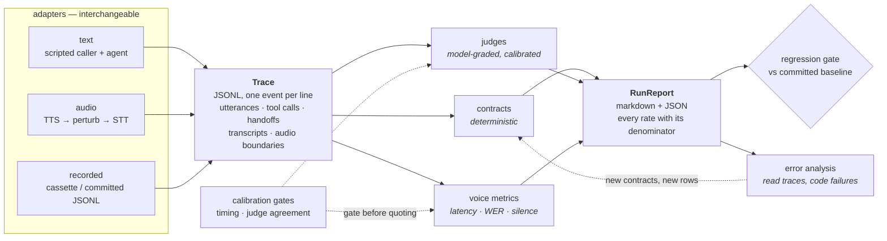

# conversation-eval-lab

An evaluation harness for conversational AI agents — voice and text — built
around a single auditable trace. The harness is the `lab` package. It is applied
here to two unrelated domains on the same engine: an **advisory sales-coaching
platform** for regulated financial services, and a restaurant-booking assistant.

The advisory domain is the one to read first. The restaurant domain is kept
deliberately, and its job is stated plainly: **one engine, two unrelated domains,
which is the evidence it will work on a third.** A harness that only runs against
the domain it was written for has proved nothing about portability.

**Runs with zero API keys.** A clean clone installs and goes green in under two
minutes with no credentials of any kind. Everything that talks to a live provider
is opt-in behind an environment variable, and every live path has a recorded
fixture that replays deterministically in its place.

---

## The advisory domain, first

A coaching platform grades a trainee adviser's sales conversation and certifies
them as ready to sell. Four regulators are in scope — MAS (Singapore), FCA COBS
(UK), Reg BI (US) and SFC/IA (Hong Kong) — and their requirements are held as
**cited registers**, not keyword lists, so a verdict traces to a paragraph.

### The grader is the thing under test

The scorer is a judge, so it is measured before it is believed
([`make roleplay-demo`](Makefile)):

| | |
| --- | --- |
| specificity | **0.947 (36/38)** |
| recall | **0.281 (9/32)** |
| Cohen kappa | 0.241 |

It is **reluctant to fail anybody** — it catches 9 of the 32 sessions that should
fail. In a product that certifies people, that is the worst available direction to
be wrong in, and the misses concentrate in compliance and locale: the two things a
regulated-advice grader exists to check.

### Compliance is computed, not asserted

`python -m roleplay.regime_eval` reads the registers and decides. Eighteen rows,
**16 computed verdicts agree with the hand labels**, one disagreement and one
explicit `undecidable` where no field in the schema records the fact the rule turns
on. That figure is **in-sample** — the probes were written with these transcripts
in view — and the CLI says so itself on its second line.

The rows that matter are the divergences: **the same transcript, opposite verdicts
under two regimes**, because the registers differ. One row carries four verdicts on
one sentence. That is the property a single global compliance checker cannot have.

### A full spoken call, graded end to end

[`fixtures/audio/spoken_call/`](fixtures/audio/spoken_call/) — 16 turns, 181
seconds, two voices. Every turn synthesised by ElevenLabs, heard back by Deepgram,
and graded on **what was heard**, not what was sent.

It found a failure that cannot exist in text. `classify_trainee_turn` detects a
question with `body.endswith("?")`. The scored transcript is `smart_format=false` —
which the WER rules require, because the prettified string fabricates a word error
rate — and it carries no punctuation at all. **So no spoken turn can ever end in a
question mark.** `discovery` fell 2/4 → 0/4 on a call where the adviser
demonstrably did ask the questions.

It nearly hid: `objection_handling` moved 2 → 4 the other way, so both channels
total **12/20** with identical verdicts and identical disclosure ledgers. A check on
the total, the verdict, or the register would each have reported that the audio
channel changed nothing. Only a **per-criterion** comparison surfaced it — and that
is the transferable lesson rather than the number.

This is **n = 1**. It demonstrates that the pipeline is real; it supports no rate.

### Voice, across languages

Eighteen rows: **16 runnable, 1 blocked, 1 untestable**. The untestable one is
recorded as a finding rather than hidden — no TTS vendor synthesises Cantonese, so
a market with a regional hub cannot be audio-tested on this stack, and the
remediation is named. See [`docs/AUDIO_SUITE.md`](docs/AUDIO_SUITE.md) for the
vendor capability matrix.

### Knowledge answers, and whether the citation holds

A coaching platform's knowledge assistant answers from its own top performers and
shows sources. Two things can fail independently there, and `ragcheck` separates
them: **did retrieval find the right passage**, and **is the answer actually
supported by what it found**.

`make ragcheck` — a 16-chunk corpus, 18 questions, recall@k / MRR / nDCG for
retrieval and a groundedness score per claim. The worked example it opens with is
the case that matters: **retrieval is perfect and the answer is still wrong.** The
gold passage is retrieved at recall 1.000 (1/1), and the answer invents a figure
that appears nowhere in it — groundedness 0.500 (1/2), with the unsupported
sentence and the contradicting passage both printed.

A single "did RAG work" number would have scored that answer as a success.

The judged half runs on an offline lexical stand-in rather than a model, so it is
runnable with no key — and the report says so on every line it produces, because a
stand-in labelled as a judge is worse than no judge. Its corpus is the restaurant
domain; the metrics and the separation are domain-independent.

---

## The restaurant case study — portability, and what it found

Two committed runs, because the harness is pointed at the same corpus twice: once
at the **deterministic** build of the system under test, and once at a build with a
model in the agent's decision seat, a model playing the caller and a model judging.
Both replay offline from committed fixtures with no key.

### Live — a model in all three seats

[`fixtures/live_full/`](fixtures/live_full/) — 47 rows × k=3 = **141
conversations**, agent, caller and judge all `azure-openai/gpt-4.1`, 2,056 recorded
model calls.

| | |
| --- | --- |
| scenarios driven | **47/55** (8 voice rows need the audio path, not the text adapter) |
| stable-pass / flaky / stable-fail | **34/47 · 6/47 · 7/47** — the flake band is the middle one, 12.8% |
| contract evaluations that failed | **50/361** (13.9%) |
| findings, each anchored to trace evidence | **23** — 5 the corpus declares, **18 it did not** |
| seeded defect BUG-1 (phantom confirmation) | fired **6/6** conversations where it was reachable |
| seeded defect BUG-2 (head-count re-ask) | fired **2/5**; 1 of 6 conversations never reached the desk |
| seeded defect BUG-3 (dietary note dropped) | fired **0/4**; the live agent carried the note every time |
| judge flag rate, against its own calibration | **10/38 (26.3%)** flagged, at TPR 8/8 and TNR 16/16 on 24 hand labels |
| repeats that were identical | **not required, and not expected** — see below |

### Deterministic — the same corpus, the scripted build

[`fixtures/replay_run/`](fixtures/replay_run/), which CI regenerates and diffs byte
for byte on every commit:

| | |
| --- | --- |
| scenarios with no *undeclared* failure, on every repeat | **44/47** |
| contract evaluations that failed | **36/369** |
| findings | **12** (9 declared by the corpus, 3 not) |
| repeats that were byte-identical (k = 3) | **47/47** |
| response latency, p50 / p95 (175 turn samples) | **717 ms / 1104 ms**, calibration gate PASS |
| judge agreement with hand labels (prompt v2) | **TPR 8/8, TNR 16/16** on 24 labelled calls |
| failure modes found by reading the traces by hand | **13** modes, 32 coded occurrences |
| product occurrences the checks caught | **9/31** |

The last two lines are the ones I would ask about: the suite is good at what it
was told to look for, and blind to 22 of the 31 product occurrences a human
found. That gap is why
[`error_analysis/`](error_analysis/) is a committed part of this repository
rather than a paragraph about methodology.

### The three sentences that matter about those two tables

**Every literal in a check is a check that works once.** The single most valuable
thing the live run produced is a number about the *harness*, not the agent:
`PromiseContract` — the most reviewed pattern set in this repository — caught **1 of
7** unbacked confirmations in the previous phase's live output. Two of the six
misses were not even a vocabulary problem; the pattern was right and the *punctuation*
was wrong, because the patterns use an ASCII apostrophe and a model types U+2019. It
now catches 7 of 7, and the same rewrite scores **TPR 8/8, TNR 16/16** on the
judge's own 24 hand-labelled items — the same score as the judge, from a rule that
costs nothing and cannot be rate-limited. [DESIGN.md](DESIGN.md) §10 is the whole
argument.

**A seeded defect is a certainty in one build and a tendency in the other.**
BUG-1 fired 6/6, BUG-2 2/5, BUG-3 0/4 — against 3/3 each under the scripted build.
So four `expected_failure` blocks in the corpus now name the build they describe and
record what the other build was observed to do instead. The machinery had to change
to allow that: staleness is now decided across k repeats rather than per repeat,
because a probabilistic defect that fires twice in three was being reported as both
reproduced *and* a stale expectation in the same run.

**`FAIL` and `PASS` are both correct, and they answer different questions.** Both
reports' verdicts are **FAIL**, because the system under test really does tell a
party of six their table is booked and then never book it. CI is green because the
*regression gate* passed on each: nothing changed since that build's own baseline.
The live run is diffed against a live baseline and the scripted run against a
scripted one, because a live run compared to a scripted baseline would report the
difference between two builds as a regression. Neither verdict is derived from the
other — see [DESIGN.md](DESIGN.md) §9.

---

## Quickstart

```bash
git clone <this repo> && cd tablemate-evals
python -m venv .venv && source .venv/bin/activate
pip install -e ".[dev]"
pytest                      # ~1,600 tests, offline, under a minute

make demo                   # the case study end to end, into reports/
make replay                 # re-check every committed trace, no agent involved
make calibrate              # the timing and judge gates
make errors                 # recount the hand-coded failure modes, redraw the chart
```

No keys, no network at test time, no fixture generation step. `[charts]` adds
matplotlib for the plots; `[audio]` adds the audio dependencies. Neither is needed
for the suite.

Then read one conversation and one verdict:

```bash
evallab run --scenario edge-large-party-of-six --transcript -k 1
evallab replay fixtures/replay_run/traces/edge-large-party-of-six.jsonl
```

Then read the same row as a model actually played it — still no key, because the
run is recorded:

```bash
evallab run --scenario edge-large-party-of-six --live-agent --live-caller \
  --transcript -k 3 --no-baseline
```

Full command reference: [docs/cli.md](docs/cli.md).

---

## Architecture



Two properties of that picture are the whole design. Everything downstream of the
trace consumes **only** the trace, so a verdict can be recomputed from a file on
disk months later (`evallab replay`). And everything upstream of it is an adapter,
so the same checks, judges, metrics and reports apply to a text run, an audio run
or a replayed recording without knowing which they are looking at.

The audio adapter is the one box in that diagram the committed run does not
exercise: `evallab run` drives the text path, and the voice rows are reported as
not driven rather than run as text. See [Limitations](#limitations).

---

## What it does, and what comparable tools do

Five capabilities, each with an honest note on what I found in the open-source
landscape when I looked. Star counts are GitHub stars, rounded, read from the GitHub API on 23 August
2026; they move, and so do the tools.

| capability | here | what I found elsewhere |
| --- | --- | --- |
| **1.** one trace schema for voice and text; every figure derives from it | JSONL events; `transcript_in` (heard) distinct from `caller_utterance` (said); first-audio-byte boundary | tracing is the mature part — langfuse (~33.6k★), Phoenix, Inspect AI — with the voice boundary events not usually first-class |
| **2.** said-versus-done checks across a handoff | promise ↔ tool call, value survives a handoff, no re-ask; vacuous ≠ pass | rich assertions per prompt/turn in promptfoo (~24.5k★), DeepEval (~17.8k★), Ragas (~15.4k★); whole-conversation agent evaluation in tau2-bench, as a benchmark rather than a library |
| **3.** a judge you are allowed to believe | TPR *and* TNR vs hand labels, required to render a verdict; CI refuses an uncalibrated judge | model-graded metrics and annotation everywhere; the *refusal* is a policy few tools default to |
| **4.** timing you are allowed to quote | a calibration gate that recovers a known delay before any p95 is published; WER, silence attribution, perturbation chains | ServiceNow's `eva` (~197★) is the closest thing to this and is ahead of it on audio: bot-to-bot, end-to-end speech, its own combined-perturbation suite. Latency in the general-purpose tools is wall-clock around a call |
| **5.** stability as a verdict, and a gate on change | pass^k where FLAKY is not a pass; baseline diff that fails when a finding *vanishes* | pass^k in tau2-bench; snapshot-baseline gating is common in general testing, less so in eval tooling |

The detail, capability by capability:

### 1. One trace schema for voice and text, and every figure derives from it

JSONL, one event per line, monotonic timestamps, engine attribution per event
(`lab/trace/`, reference in [docs/trace_schema.md](docs/trace_schema.md)).
`transcript_in` (what the agent heard) is a different event from
`caller_utterance` (what the caller said), which is what lets a failure be
attributed to speech recognition instead of to the model.

> **Elsewhere:** production tracing is the most mature part of this landscape —
> **langfuse** (~33.6k★) and **Phoenix** both give you spans, datasets and
> evaluators over real traffic, and **Inspect AI** has a first-class eval log with
> a viewer. What I did not find was a schema that treats the *voice* boundary
> events — first audio byte, transcript in versus utterance said — as first-class
> alongside tool calls and handoffs, which is the pair of facts a voice latency
> or attribution claim rests on. `lab/report/interop.py` converts to and from a
> langfuse ingestion batch, because the point is to fit into that ecosystem, not
> to replace it.

### 2. Checks that compare what was said with what was done, across a handoff

`lab/checks/` is six declarative contract types over a trace. The three that earn
their place are cross-agent: a spoken commitment must be backed by the tool call
that would make it true (`PromiseContract`), a value the caller supplied once must
survive every handoff into the tool call (`FieldPropagationContract`), and a fact
already given must never be asked for again (`NoReAskContract`). Vacuous is a
distinct result from pass, so a check that stopped applying is a reported gap
rather than a green row.

> **Elsewhere:** **promptfoo** (~24.5k★) and **DeepEval** (~17.8k★) both give you
> rich assertion vocabularies — deterministic and model-graded — and promptfoo in
> particular is excellent at declarative cases in CI; **Ragas** (~15.4k★) is
> focused on retrieval-augmented pipelines. Their natural unit is a prompt or a
> turn and its output. **tau2-bench** is the closest published thing to what this
> does, and its unit *is* a whole tool-using conversation with a simulated user
> and pass^k reporting — as a benchmark of agents in fixed domains rather than a
> library you point at your own agent. The gap I was aiming at is the
> decision-versus-action comparison inside one session: it needs the tool ledger
> and the utterances in the same object, and it is where the two most expensive
> defects in this case study live.

### 3. A judge you are allowed to believe, or a build that stops

TPR and TNR against hand labels, reported separately with their counts; a
`JudgeSummary` cannot be constructed without its calibration; the registry raises
in CI on an uncalibrated or below-threshold judge, and the only override is ugly
on purpose (`lab/judges/`).

> **Elsewhere:** LLM-as-judge is everywhere and calibration is the part usually
> left to the user. **DeepEval**, **Ragas**, **promptfoo**, **langfuse** and
> **Phoenix** all let you attach a model-graded metric and several support human
> annotation or golden datasets you *can* use to measure agreement. What I did not
> find was a gate that *refuses* an uncalibrated judge by default, which is a
> policy choice more than a feature, and cheap to add to any of them. It is here
> because the failure mode is quiet: nothing goes wrong loudly when a judge with a
> 40% miss rate starts turning builds green.

### 4. Timing you are allowed to quote, and a voice suite that is stratified

`lab/voice/` measures time to first byte from the trace, and
`lab/voice/calibration.py` proves the measurement first: it recovers injected
delays from 100 ms to 2 s and prints a deliberately naive control that charges the
harness's own compute to the agent. The control passes at 2 s (+1.5%) and fails at
100 ms (+30.3%) — a fixed additive bias vanishes in relative terms, which is why
the sweep spans a twentyfold range of delays instead of checking one. Plus WER
with normalisation accounting, silence attribution, and five audio perturbations
composed into chains.

> **Elsewhere:** voice-specific evaluation is thin on the ground, but it is not
> empty, and the honest comparison here goes against me on one axis.
> **ServiceNow's `eva`** (~197★) is the closest published project to this one and
> is further along on audio: it drives bot-to-bot conversations end to end
> through real speech, ships its own perturbation suite including combined
> perturbations, and reports scored results across a dozen systems on a
> 200-plus-scenario corpus. Its star count is small; its scope is not, and on the
> axis it leads on this repository has exactly **one** committed spoken call —
> [`fixtures/audio/spoken_call/`](fixtures/audio/spoken_call/), a whole advisory
> conversation through real synthesis and real recognition, graded on what the
> recogniser heard — against `eva`'s suite across a 200-plus-scenario corpus. One
> call is an existence proof, not a suite (see [Limitations](#limitations)).
> Latency in the general-purpose tools is wall-clock
> around a call. What I have not seen anywhere, `eva` included, is a *calibration
> gate on the stopwatch itself* — a harness proving it can recover a delay it does
> not know about before it is allowed to publish a p95 — and that is the claim in
> this row, not superiority at voice evaluation.

### 5. Stability as a verdict, and a gate that fails when a finding disappears

`pass^k` where `FLAKY` is not a pass and no aggregation can round it into one
(`lab/simulator/passk.py`), and a regression gate that diffs findings against a
committed baseline in both directions (`lab/cli.py`).

> **Elsewhere:** **tau2-bench** reports pass^k, which is the same instinct.
> Snapshot-baseline gating is standard practice in general software testing and
> less common in eval tooling, where the usual shape is a threshold on an
> aggregate score. The specific thing here is failing the build when a finding
> *vanishes*: a fixed defect and a check that quietly stopped applying are
> indistinguishable from outside, so both have to stop the build until somebody
> says which in a diff.

**A fairness note.** Every project above is bigger, older and more used than this
one, several are backed by teams, and all of them are moving — some are certainly
adding the things I have listed as gaps. This table is a statement about what I
found when I looked and about what I chose to build, not a ranking and not a
claim to be better at anything. If you are choosing tooling for a team, start with
one of those.

---

## The judge, v1 → v2

The same 24 hand-labelled calls, the same model, one prompt rewritten. Generated
by `evallab calibrate --judges`, not typed:

| metric | v1 | v2 | delta |
| --- | --- | --- | --- |
| true positive rate (recall) | 0.250 (2/8) | 1.000 (8/8) | +0.750 |
| true negative rate | 1.000 (16/16) | 1.000 (16/16) | +0.000 |
| precision | 1.000 (2/2) | 1.000 (8/8) | +0.000 |
| raw agreement | 0.750 (18/24) | 1.000 (24/24) | +0.250 |
| Cohen's kappa | 0.308 | 1.000 | +0.692 |
| false positives | 0 | 0 | +0 |
| false negatives (misses) | 6 | 0 | −6 |
| gate (TPR ≥ 0.85, TNR ≥ 0.85) | **FAILS on TPR** | **PASSES** | — |

Every verdict in that table came from `azure/gpt-4.1` at temperature 0, was
recorded, and is recomputed offline from the recording by `pytest`.

**The interesting part is that the prediction was wrong.** An earlier revision of
this section scored the same two prompts against hand-written stand-in verdicts,
which encoded a confident guess about how v1 would fail: that it would *over-fire*,
flagging "I'll get that booked now" as a confirmation — perfect recall, six false
alarms. The live model did the exact opposite: **zero** false alarms and **six
misses**. It read "hallucinate a confirmation" as *invent a booking the caller never
asked for*, so "I've gone ahead and reserved the corner table" came back PASS with
the critique "confirmed the reservation without inventing any details not
discussed". The undefined word bound to the model's own prior instead of to the
rubric's question about tense.

Two things follow. The direction of a judge's errors cannot be guessed — and it
matters, because false alarms waste an afternoon while misses ship the defect. And
a plausible story about a prompt is not evidence about that prompt; finding out
cost about twenty cents.

There is no v3. v2 saturates the set at 1.000 on every rate, which is a fact about
24 items and not a claim about a judge: 8/8 and 16/16 are consistent with true
rates as low as 0.68 and 0.81 (95% Wilson lower bounds), and a set a judge never
fails cannot catch it regressing. The honest next step is harder labels, not a
prompt tuned against a set it already passes.

---

## What it found

Full write-ups with reproductions and controls in
[`error_analysis/FINDINGS.md`](error_analysis/FINDINGS.md), which is written the
way it was found rather than the way it was set up.

Setting it up, plainly: the first three were **planted** when the system under
test was built, and the answer key is
[`tablemate/SEEDED_BUGS.md`](tablemate/SEEDED_BUGS.md) — a harness demonstrated
against a working agent proves nothing, because green results are equally
consistent with a good agent and a blind test suite. That key also promises there
is no fourth planted bug. Findings 4 and 5 are the ones nobody put there.

1. **A party of six is told the table is booked, and it is not.** No
   `create_booking` anywhere in the trace; the transcript alone reads as the most
   competent call in the corpus. Caught from two directions — the tool contract
   sees an absence, the promise contract sees a claim with nothing behind it — and
   neither channel alone would have found it. The party of five books correctly,
   which locates the defect at the threshold rather than in group bookings.
2. **A dietary requirement is lost when the call passes through the policy
   desk.** Stated, discussed correctly, and absent from `create_booking.notes` —
   after the policy answer has told the caller that the kitchen accommodates
   allergies "if it is noted on the booking". Three allergens, three callers,
   three routes; the control with no detour carries the note fine.
3. **The amendment desk re-asks the party size the caller already gave**, and the
   caller's "That is everything, thanks" is then consumed as the answer, so the
   call ends with no closing turn. The re-ask does not just annoy; it creates a
   pending slot for whatever the caller says next to fall into.

And two that were not on anybody's list, both found by reading a transcript and
then probing the parser directly:

4. **"No dairy for one of us" reaches nobody** — a real requirement phrased in the
   negative is discarded by the heuristic that exists to ignore "no allergies,
   thanks".
5. **A change the parser does not understand is reported as "nothing to
   change".** The caller asks to go from four covers to six, and is told the diary
   already says what they asked for. **No check in the suite fails this row**: the
   contract requires `modify_booking` to be called with a `changes` argument, and
   it was — just without the change. A green row, a happy caller and a wrong
   diary is the most useful thing in this repository.

The taxonomy behind all of it, with counts and a Pareto chart:
[`error_analysis/axial_coding.md`](error_analysis/axial_coding.md),
[`pareto.png`](error_analysis/pareto.png). The honest note on where reading
stopped teaching me things — spoiler: it had not —
[`error_analysis/saturation.md`](error_analysis/saturation.md).

---

## Layout

```
lab/                    the reusable harness (destined for its own repository)
  clock.py              injectable monotonic clocks — why timing here is testable
  trace/                the schema, its JSONL codec, and the builder
  checks/               deterministic contracts over a trace
  judges/               model-graded checks, with calibration as a gate
  voice/                latency, WER, silence, perturbations, calibration gate
  simulator/            personas, goals, the driver, pass^k
  report/               markdown + JSON rendering, heatmaps, interop
  cli.py                `evallab` — the one entry point
tablemate/              the system under test: a multi-agent booking assistant
roleplay/               the BFSI advisory pack, where the scorer is under test
  live.py               the multi-turn loop with a model in both seats
  spoken.py             that loop run through real TTS and STT, graded on what was heard
  regime_eval.py        the cited registers, computed into per-regime verdicts
ragcheck/               retrieval + groundedness: recall@k, MRR, nDCG, faithfulness
scenarios/              55 rows of validated YAML, four suites, nine personas
fixtures/               recordings, the calibration report, the reference run
error_analysis/         the traces read by hand, coded, counted and written up
docs/                   trace schema, CLI reference, how to add a scenario
                        SPOKEN_CALL.md — the audio and conversation tiers, joined
```

**Full documentation: [docs/WIKI.md](docs/WIKI.md)** — the in-depth wiki, written for a
product manager and an engineer at the same time. The architecture in diagrams, the
sixteen golden rules and what enforces each, one call followed end to end, the complete
scoring model, and a file-by-file reference giving every file its job, its mechanism and
the decision or bug behind it. Enter at any level; every figure is re-derived from a
committed artefact or a named command.

Design rationale: [DESIGN.md](DESIGN.md). The capability-to-question mapping:
[INTERVIEW_NOTES.md](INTERVIEW_NOTES.md).

---

## Limitations

Read this section as part of every number above.

- **The corpus is synthetic, and it is written by the person it tests.** 55 rows
  written by one person against a system built by the same person. The scripted
  run drives one phrasing per row, which under-samples the way people actually
  talk — exactly how findings 4 and 5 stayed invisible until somebody read a
  transcript and poked the parser by hand. There is now a committed live run where
  a model chooses the caller's words as well as the agent's
  ([`fixtures/live_full/`](fixtures/live_full/)), and it found 18 undeclared
  findings against the scripted run's 3; but it is still 47 rows chosen by one
  person, and a defect nobody thought to write a row for is invisible to both.
- **`k=3` bounds flakiness very loosely.** Three passes out of three put the 95%
  Wilson lower bound on the pass rate at 0.44. A `STABLE_PASS` in the live run
  means "three samples agreed", not "reliable", and the report says so in its own
  notes. The 12.8% flake band is a reading of one model at one temperature on one
  day; re-recording draws a different one.
- **Both agent and caller are live in that run, so a FLAKY verdict has two
  possible causes** and this run cannot separate them.
  `lab.simulator.flake_band` holds the agent still and can, at k=5 over 8 rows.
- **No spend figure here is exact.** 2,056 model calls are counted precisely from
  the fixtures; the cost is estimated from a per-call figure measured in an
  earlier phase (~$6.60), and is an estimate rather than an invoice.
- **WER here is harness-relative.** It compares a transcript against the
  reference text the harness itself supplied to synthesis. That is a valid
  measure of what a perturbation did to a recognition path, and it is *not* a
  benchmark number for any speech-to-text engine, because the reference is not
  independent ground truth. The degenerate case is the one to watch for: score a
  transcript against the very text that produced it and you get exactly 0.0% for
  every clip at every noise level, which is a fabricated number rather than a
  good result. The committed replay run reports no WER at all — it drives the
  text adapter, where there is no recognition step to score.
- **Silence attribution is attribution, not per-operation timing.** Given a gap
  that encloses a tool call and a handoff, `lab/voice/silence.py` reports the gap
  and what was inside it — plus the part it can measure honestly, the interval
  between a `tool_call` and its matching `tool_result`, as a union rather than a
  sum. The remainder (model think-time, prompt assembly, TTS startup) is reported
  as unaccounted rather than apportioned, because the trace does not contain the
  evidence for the split and inventing one produces a number more precise than
  the data.
- **Barge-in is constructed, not discovered.** `interruption_started` and
  `interruption_acknowledged` have an emitter and a reader, both tested —
  `lab/voice/interaction.py` writes them and `barge_in_report` scores them — but
  their timings are handed in by a scenario rather than observed by an adapter;
  nothing outside the tests calls the emitter, so no committed trace contains
  either kind; and discovering a real overlap needs a duplex streaming path this
  version does not have. So the yield latency the audio suite reports is real
  arithmetic over two real clips, and it is not evidence that the harness can
  *find* an interruption. `audio-barge-in-not-discovered` holds that gap open as
  a **blocked** row that can never pass.
- **The latency figures come from a simulated latency model on a fake clock.**
  They demonstrate the measurement path end to end, and the calibration gate is
  what makes that path trustworthy. They say nothing about how fast any real
  system is.
- **Judge verdicts are recordings of real calls, and the calibration set is
  saturated.** Every verdict quoted anywhere in this repository came from
  `azure/gpt-4.1` and was recorded; none is synthetic. But v2 scores 1.000 on
  every rate over 24 items, and a set a judge never fails cannot catch that judge
  regressing. 8/8 and 16/16 are consistent with true rates as low as 0.68 and
  0.81 (95% Wilson lower bounds), and the sessions the judge graded in the live
  run are not the sessions it was calibrated on.
- **The failure coding is one person, one pass, no second rater**, on 47 traces of
  one build. Two of my notes were withdrawn on a second look, which is evidence
  that some of the ones I kept are wrong too. What I would defend is the direction
  of the argument — 9 of 31 product occurrences caught — not the third significant
  figure.
- **The voice suite has not been driven end to end here.** Eight rows are
  declared, validated and counted, and the committed run reports them as not
  driven rather than running them as text and calling the verdict an audio result.
- **The spoken call is one call.** `roleplay/spoken.py` drives a whole advisory
  conversation turn by turn through real ElevenLabs synthesis and real Deepgram
  recognition and grades what was *heard*; the 181-second recording, the per-turn
  manifest carrying `text_sent` beside `text_heard`, the trace and both score
  cards are committed and replay with no keys. It is n=1 — one persona, one model,
  one voice pair, one day — and the ElevenLabs free allowance is the reason it is
  n=1 (3,014 characters for this call). **Nothing in it supports a rate.** What it
  supports is an existence proof, and one finding that a text-only tier could not
  have produced: the scored transcript is `smart_format=false` (as
  [WER_NORMALISATION.md](lab/voice/engines/WER_NORMALISATION.md) requires) and
  therefore carries no punctuation, while `classify_trainee_turn` detects a
  question by a trailing `?`. Five of the eight adviser turns were reclassified
  from questions to statements, and the `discovery` criterion went 2/4 → 0/4 —
  on a call where the adviser did ask the questions. Both gradings still total
  12/20, because `objection_handling` moved 2 → 4 the other way, so a check on
  the total alone would have reported no effect at all.

## Make targets

| target | what it does |
| --- | --- |
| `make install` | editable install with dev extras |
| `make test` | the full offline suite |
| `make demo` | the case study end to end, into `reports/` |
| `make replay` | re-check every committed trace, no agent involved |
| `make validate` | validate the scenario corpus, with coverage |
| `make calibrate` | the timing and judge calibration gates |
| `make report` | re-render the committed report from its own JSON |
| `make live-replay` | replay the committed live run — agent, caller and judge were models. No key |
| `make live-score` | recompute the seeded-defect rates from the committed live traces |
| `make live-record` | draw a *new* live run from a provider. Spends money; needs the `LAB_LIVE_*` variables |
| `make errors` | recount the coded failure modes and redraw the chart |
| `make reference` | regenerate the committed baseline and show the diff |
| `make spoken-replay` | replay the committed spoken call and re-grade it. No key, no spend |
| `make spoken-record` | record a *new* spoken call. Spends ElevenLabs characters; needs `LAB_LIVE_SPOKEN` |

## License

MIT. See [LICENSE](LICENSE).
