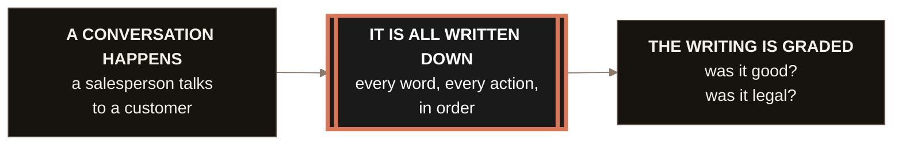
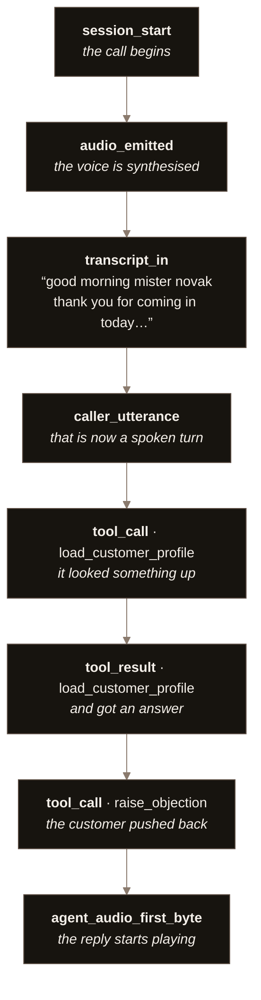
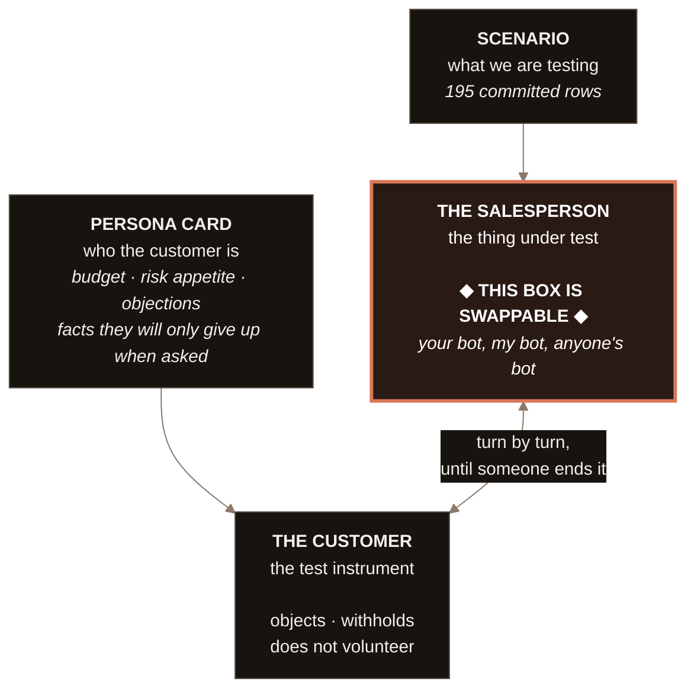
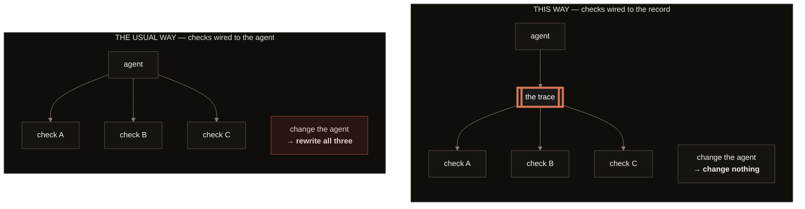
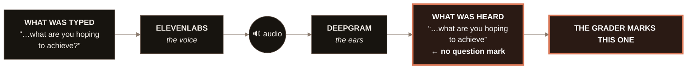
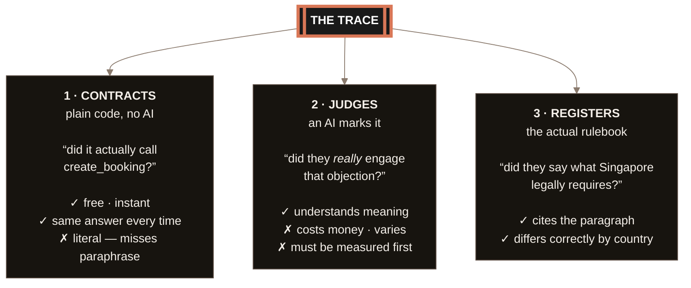
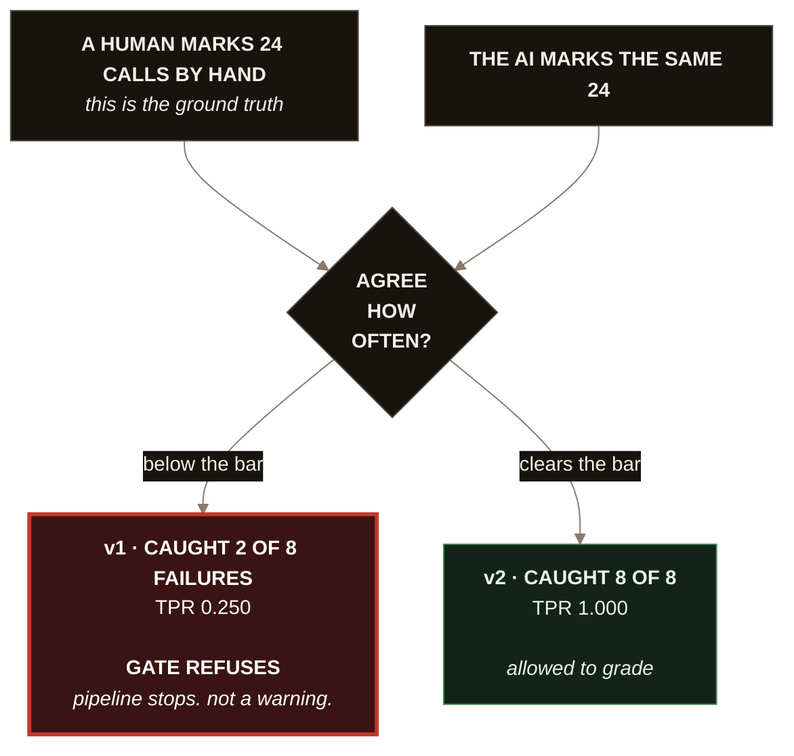
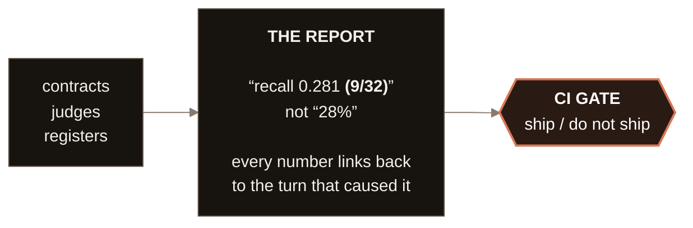
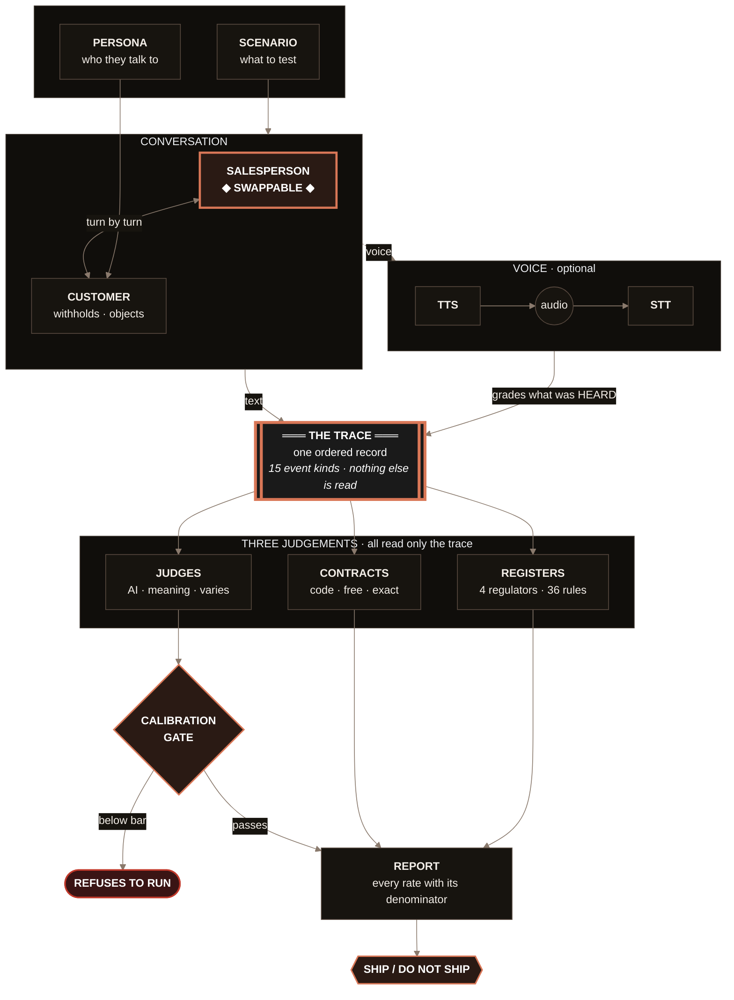

# How this system works

Nine pictures, each doing one job, building from the simplest possible version to the
whole thing. Read straight through and you can explain the repository to anyone.

Plain English first in every section. The technical detail is underneath it, in a
different voice, so you can stop reading at whichever depth you need.

---

## 1. The simplest true version

Three boxes. If you remember nothing else, remember this shape.



**In plain terms.** A trainee salesperson has a practice conversation. Everything that
happens gets written down. Then the writing gets marked.

**The one rule that makes it all work:** the marking never watches the conversation
happen. It only ever reads the written record afterwards.

That sounds like a small distinction. It is the entire architecture, and §4 shows why.

---

## 2. What "written down" actually means

The written record is called **the trace**. Here is a real one from this repository —
the opening of an actual graded call.



**In plain terms.** A numbered list of things that happened, in the order they happened.
Words *and* actions — not just what was said, but what the system actually did.

Think of it as a **flight recorder**. After the flight you do not ask the pilot what
happened. You read the box.

**The technical bit.** There are exactly fifteen kinds of event it can record:

```
session_start · caller_utterance · agent_utterance · agent_handoff
tool_call · tool_result · audio_emitted · audio_delivered
transcript_in · transcript_out · agent_audio_first_byte
agent_audio_complete · transport_connected · transport_disconnected · session_end
```

Words, actions, audio, network. That is the whole vocabulary, and it is closed — nothing
can invent a sixteenth kind without changing the schema.

---

## 3. Where the conversation comes from

Two AIs talk to each other. One is being tested. One is the test instrument.



**In plain terms.** The scenario says what we are testing. The persona card says who the
customer is — and crucially, **which facts they will only reveal if they are asked.**

**Why the customer matters more than people expect.** If the fake customer opens with
*"Hi, I'm 54, I have £80,000, I'm nervous about risk and I need it in ten years"* — then a
salesperson who asks **no questions at all** still gets a perfect discovery score. The
test would certify someone who did nothing.

So the customer holds things back. That withholding is what makes the discovery score
mean something. **The customer is a measuring instrument, not scenery.**

**The swappable box.** The salesperson can be replaced with anything — a rule-based bot, a
different model, a vendor's API, a company's internal agent. You supply one small
function: *message in, response plus tool calls out.* That is the whole contract.

---

## 4. Why "the marking never watches" is the whole design

This is the idea that pays for everything else. Two pictures, side by side.



**In plain terms.** Normally each check is plugged into the system it is checking. Change
the system and every check breaks.

Here, everything is plugged into **the written record** instead. The checks have never
heard of the agent. They only know how to read a list.

**What that actually bought, concretely:**

- **Swap the AI** — every check still works. This is why the swappable box in §3 is
  possible at all.
- **Swap text for speech** — every check still works. When a conversation was run through
  real speech synthesis and recognition, the scorer needed **no changes whatsoever**,
  because the spoken version produced the same shape of list.
- **Audit any number** — when the report says *"discovery scored 0 out of 4"*, you can
  point at the exact turns that caused it.

**The technical bit.** `session_view(trace)` at `roleplay/scorer.py:151` is a pure
function of trace events. Nothing is carried in from the object that produced them. That
purity is the property everything above depends on.

---

## 5. The optional detour: speech

The same conversation can be spoken out loud and heard back.



**In plain terms.** ElevenLabs gives the conversation a voice. Deepgram listens and turns
it back into text. **The grader marks the version that came out of the microphone** — not
the version that went in.

**Why that is the right choice.** That is what happens in production. If the speech
recogniser mishears a legally-required disclosure, then the customer never heard it
either. The grade should reflect reality, not intention.

**The finding this produced — and it is the best story in the repository.** A real
16-turn call. The salesperson asked **five questions**. The grader scored discovery
**0 out of 4.**

Why: the question detector is `body.endswith("?")`. The transcript that gets graded is
the *unformatted* one — deliberately, because the prettified version invents word errors.
And unformatted transcripts have **no punctuation at all.**

So no spoken turn can ever end in a question mark. Five questions, none counted.

**And it very nearly went unnoticed.** A different score moved the opposite way, so the
totals matched exactly — 12/20 either way, same verdict, same disclosure list. Checking
the total, the verdict, or the compliance list would each have concluded *"speech changed
nothing."* Only comparing the criteria **one by one** found it.

---

## 6. The three ways of marking

Not everything should be marked the same way. Pick the cheapest tool that can answer the
question.



**In plain terms.** Three different tools for three different kinds of question.

**A contract** is ordinary code. *Did the booking actually get created?* is a yes or no
you can check for free, instantly, with the same answer every time. Most teams reach for
an AI here when they do not need to.

**A judge** is an AI marking the work. You need one for *"was that objection genuinely
engaged, or just acknowledged and dropped?"* — a question with no keyword answer. It
costs money, it varies between runs, and **you must measure it before you believe it**
(§7).

**A register** is the actual regulation. Not a keyword list — 36 entries across four
regulators, each pointing at a real paragraph of a real rulebook.

**Why the register design matters.** Each entry has a `kind` that changes how it is
judged:

| `kind` | Meaning in plain terms |
|---|---|
| `verbatim` | only these exact words count — a paraphrase **fails** |
| `prescribed-unit` | the meaning **plus** a specific number (14 days, not 30) |
| `substance` | say it however you like, as long as the meaning lands |
| `prohibition` | saying this **at all** is the failure |
| `gate` | fail this and the whole session fails, whatever the score |
| `not-required` | **this country does not require it — leaving it out must pass** |

**That last one is doing the most work.** Without it, a global checker would invent
requirements in countries that never had them. Reclassify those carve-outs as real
requirements and **3 of 5 flip a passing country to failing** — so it is load-bearing,
not decoration.

**The demo that lands:** the same conversation, run under two countries' rules, gets
**opposite verdicts** — because the rules genuinely differ. One case produces four
different verdicts on one sentence. That is why a company operating in many markets
cannot have one compliance checker.

---

## 7. The loop that makes it trustworthy

An AI marker is itself a thing that can be wrong. So it gets marked too.



**In plain terms.** Before an AI is allowed to mark anything, a human marks the same
work, and you count how often they agree. Below the bar, **the pipeline stops.** Not a
warning in a log — a refusal.

**Why this is the most important box.** An unmeasured grader is not evidence. It is an
opinion with a number attached, and numbers are persuasive whether or not they are true.

**It refused in anger, on this repo's own work.** Prompt v1 caught **2 of the 8** real
failures — it missed three quarters of them — and the gate blocked it from the pipeline.
v2 caught 8 of 8.

**Two honest things to say about it out loud:**

**"Stable" can be a lie.** The failing prompt gave an *identical* result across three
separate runs — which looks like perfect reliability. It was not. Two individual items
were flipping in opposite directions and cancelling each other out. **Checking the total
would have declared it perfectly reproducible.**

**The passing number does not survive its own error bars.** v2 clears an 0.85 bar with
8 out of 8 — but 8 out of 8 has a 95% confidence interval of **[0.676, 1.000]**. The
bottom of that range is *below the bar it just passed.* Twenty-four examples is not many.
Saying that about your own headline number is the most credible thing you can do.

---

## 8. What comes out



**In plain terms.** Every rate is printed with the numbers underneath it. Never *"28%"* —
always *"9 out of 32."*

**Why that is not pedantry.** *"93% passed"* could be 93 of 100 or 9.3 of 10. Those mean
completely different things, and one of them is not evidence of anything. A percentage
without its denominator cannot be argued with, which makes it useless.

In this repository **a naked percentage is treated as a bug.**

---

## 9. Everything at once

Now that each piece makes sense on its own, here they all are together.



---

## If you only draw three boxes

Trace in the middle. Arrows in from the conversation. Arrows out to the three graders.

**Then say this:**

> *"Everything reads the middle box and nothing reads the agent. That's why I can point
> this at your system, and why the same suite grades text and speech unchanged."*

That sentence is the architecture.

---

## The three things worth remembering

1. **The record is the product.** Everything reads one written record, so the checks
   survive a change of agent, of model, or of medium.
2. **Measure the ruler before you measure with it.** A grader that missed three quarters
   of the real failures. A confidence interval that does not support the bar it passed. A
   result that looked perfectly stable for entirely the wrong reason.
3. **The most useful findings were against my own tools** — a compliance check that could
   pass anything at all, a metric reporting 43% error on perfect recognition, a harness
   that blamed the product for its own bug. They are written down because that is the
   part nobody writes down.

---

## Where each piece lives

| Picture | Code |
|---|---|
| the trace | `lab/trace/` — schema, builder, reader |
| contracts | `lab/checks/contracts.py` — six of them |
| judges and the gate | `lab/judges/` — `registry.py` holds the refusal |
| registers | `scenarios/advisory/registers/` + `roleplay/regime_eval.py` |
| voice | `lab/voice/` — engines, WER, silence, timing gate |
| the salesperson and customer | `roleplay/live.py`, `roleplay/spoken.py` |
| the swappable seam | `lab/cli.py` — `--agent-factory` |

Full file-by-file detail: [WIKI.md](WIKI.md).
The order to present it in: [WALKTHROUGH.md](WALKTHROUGH.md).
