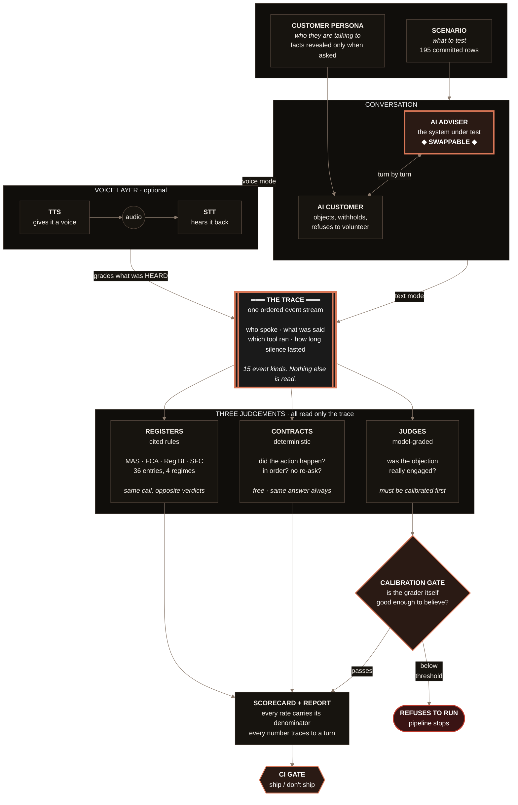

# The whole system, in one picture

One diagram, one page. If you can draw this on a whiteboard and talk through the eight
pointers underneath, you can explain the entire repository.

---

---

## The eight pointers, in plain terms

### 1. Everything flows into one place — the trace

**Plain:** every word, every action and every pause gets written to a single list, in
order. Like a flight recorder for a conversation.

**Why it matters:** nothing in the system is allowed to look at the AI directly. They all
read the list instead. That one rule is what makes the other seven possible.

---

### 2. The adviser is swappable — that's the plug-in point

**Plain:** the box marked ◆ SWAPPABLE ◆ can be your chatbot, my chatbot, a rule-based
bot, or a vendor's API. You give the runner a small Python function: message in, response
and tool calls out. That's the whole contract.

**Say this in the room:** *"Everything downstream reads the trace, so the moment your
agent produces one, all my existing checks run against it unchanged. Write the wrapper on
day one and the first honest number arrives the same day."*

---

### 3. The customer is a test instrument, not scenery

**Plain:** the simulated customer holds facts it will only give up **when asked**. It
objects. It doesn't volunteer.

**Why it matters:** a customer that opens with all its details can never catch an adviser
who never asks. The test would pass someone who did no discovery at all. Withholding is
what makes the discovery score mean anything.

---

### 4. Voice is optional, and it grades what was HEARD

**Plain:** the same conversation can be spoken aloud, recorded, and transcribed back —
and then the grader scores **what the microphone heard**, not what was originally typed.

**Why it matters:** that's what production actually does. If the recogniser mishears a
disclosure, the customer never heard it either, so the grade should reflect that.

**The finding this produced:** a call where the adviser asked five questions scored
**0 out of 4 on discovery** — because the question detector looks for a `?`, and the
graded transcript has no punctuation. Text could never have surfaced that.

---

### 5. Three kinds of judgement, and you pick the cheapest that works

**Plain:**

| | What it's good at | What it can't do |
|---|---|---|
| **Contracts** | did the action actually happen | notice paraphrasing — it's literal |
| **Judges** | did they *really* engage that objection | be trusted until you've measured it |
| **Registers** | did this country's required disclosure occur | cover a rule nobody wrote down |

**Why it matters:** most teams reach for an AI judge for everything. Judges are slow,
cost money, and vary run to run. Use a contract wherever a contract will do.

---

### 6. The gate that refuses — the most important box on the page

**Plain:** before an AI grader is allowed to grade anything, you measure how often it
agrees with a human. If it's below the bar, **the pipeline stops**. Not a warning — a
refusal.

**Why it matters:** an unmeasured grader isn't evidence, it's an opinion with a number
attached. This repo caught its own judge missing **3 out of 4** real failures
(TPR 0.250) and the gate blocked it.

**The line that lands:** *"Every eval tool I surveyed lets you write a judge and use its
verdicts immediately. Mine raises an exception."*

---

### 7. The registers are cited rules, not keyword lists

**Plain:** four regulators — Singapore, UK, US, Hong Kong — each with its own list of
what must be said, and each entry pointing at the actual paragraph of the actual rulebook.

**The killer demo:** **the same conversation gets opposite verdicts under two regimes**,
because the requirements genuinely differ. One row produces four different verdicts on
one sentence.

**Why it matters for a company in many markets:** you cannot have one global compliance
checker. This diagram is the proof of why.

---

### 8. The output is auditable, and the CI gate uses it

**Plain:** every rate printed carries its denominator — never "93%", always "93% of
2,132". Every number traces back to a specific turn in a specific call.

**Why it matters:** a percentage with no denominator is unfalsifiable. A reader can't
tell 9 out of 10 from 900 out of 1,000, and those mean very different things.

---

## If you only draw three boxes

Trace in the middle. Arrows in from the conversation. Arrows out to the three graders.

**Then say:** *"Everything reads the middle box and nothing reads the agent — that's why
I can point this at your system, and why the same suite grades text and speech
unchanged."*

That sentence is the architecture.
