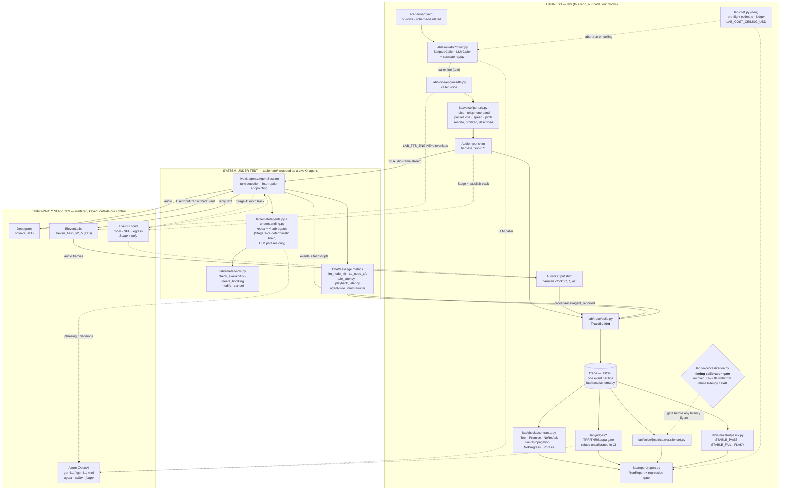

# Real-stack architecture and integration plan

**Status:** proposal, for approval before any code is written.
**Scope:** how `tablemate-evals` moves from a fully simulated harness to one that drives a real
voice stack — Azure OpenAI (the brain), Deepgram (ears), ElevenLabs (voice), LiveKit (the phone
line) — and what the harness should and should not build now that LiveKit ships testing tools of
its own.
**Audience:** the repo owner. Assumes production familiarity with LiveKit, Deepgram and
ElevenLabs; assumes nothing about the harness's internals beyond what is in `README.md` and
`DESIGN.md`.

Every factual claim about a third-party service carries a URL. Where a claim could not be
verified, it says so in the text rather than in a footnote.

---

## 1. Plain-English walkthrough: one test conversation, end to end

*Read this first. No diagram, no table, no code. If a term has to be used, it is glossed on
first appearance.*

Imagine we want to check one thing: **if a caller asks to book a table for six people on
Thursday, does the assistant actually create that booking — or does it just say it did?**

That is one row in our test set. Today the harness answers that question by typing at the
assistant and reading its replies. In the new setup, it answers the same question by *phoning*
it. Here is what happens, in order.

**Step 1 — The harness picks up the script.** Every test case is a small file that says who the
pretend caller is, what they want, what facts they will volunteer, and what must be true at the
end. There are 55 of these files. Nothing in this step touches the internet, and nothing here
changes in the new setup. *What could go wrong:* the script says something the checks cannot
verify, and we get a green result that means nothing. This is why the test files are validated
against a schema and reviewed like code.

**Step 2 — The harness decides what the caller says next.** Two options. The cheap option is a
fixed script: the caller always says the same words in the same order, so the whole test is
repeatable to the letter. The expensive option is to let a language model play the caller —
give it a personality ("hurried commuter, on a noisy street, will not volunteer their name
unless asked") and let it improvise. Improvising callers find bugs that scripted ones never
will, because they say things nobody thought to script. *What could go wrong:* an improvising
caller wanders off, never gives the information the test needs, and the test fails for a reason
that has nothing to do with the assistant. Guard: a hard turn limit, and the improvised
conversation is **recorded to a file the first time** so that later runs replay it exactly
instead of paying for a new improvisation.

**Step 3 — The caller's line becomes sound.** The words go to a speech synthesiser
(text-to-speech, or "TTS" — software that reads text aloud) which returns a few seconds of
audio. Today that is macOS's built-in `say` command or a small local model. In the new setup we
can use ElevenLabs, whose voices are far more natural — and natural matters, because a
transcriber that copes with a robot voice may not cope with a real one. *What could go wrong:*
we are now paying per character of speech, and the same sentence synthesised twice may come
back subtly different, so a test that used to be bit-for-bit repeatable no longer is. Guard:
synthesise once, save the audio file, and reuse it — the audio becomes a fixture with a
checksum, not a fresh purchase every run.

**Step 4 — The harness deliberately damages the audio.** Real calls are not clean. So the
harness adds street noise at a chosen loudness ratio, squeezes the sound into the narrow
frequency band a telephone actually carries (roughly 300 to 3,400 cycles per second), drops
packets the way a bad mobile connection does, or speeds the speaker up. Each of these is
seeded, so "the noise" is *the same noise* every time. This is the harness's own invention and
nothing in LiveKit does it. *What could go wrong:* the damage is applied in the wrong order.
Adding noise and *then* filtering the line removes the very noise the caller would have heard,
which produces a kinder channel than reality. So the damage steps are declared in the order
they are applied, and the order is part of the recorded description.

**Step 5 — The audio reaches the assistant's ears.** Deepgram (speech-to-text, or "STT" —
software that writes down what it hears) turns the damaged audio back into words. This is the
first genuinely new capability. Today the harness cheats here: it hands the assistant the
*original* text instead of a real transcription, which means our word-error measurement is
mathematically guaranteed to be zero, and the harness therefore refuses to print it. Once
Deepgram is in the loop, the assistant hears a real, imperfect transcription, and the
difference between what we said and what it heard is a real number. *What could go wrong:* the
audio gets resampled twice on the way in — once by our synthesiser, once by the transport —
and the extra distortion gets blamed on Deepgram. Guard: pick one sample rate (16,000 samples
per second), state it, and convert exactly once.

**Step 6 — The assistant thinks.** It reads the transcribed words, decides what to do, and
possibly calls one of its tools: check availability, create a booking, cancel a booking. The
tools are ordinary function calls against an in-memory restaurant diary — no real restaurant
is involved. In the new setup, Azure OpenAI does the thinking. *What could go wrong, and this
is the big one:* today the assistant's decisions are made by plain code, which means its known
bugs happen *every single time*. Hand the decisions to a language model and the bugs become
occasional. A test that used to fail reliably now fails four times out of five, and "four out
of five" is not a regression signal until we deliberately measure it as one. The harness
already has the machinery for this — it runs each test several times and reports STABLE_PASS,
STABLE_FAIL or FLAKY — and FLAKY does not count as a pass.

**Step 7 — The stopwatch starts and stops.** Immediately before the harness hands the
transcribed words over, it reads a clock. Immediately after the assistant's first audio comes
back, it reads the clock again. The gap is what we report as response time. Everything that is
*our* cost — synthesising the caller's line, damaging it, transcribing it, writing files — sits
strictly outside those two clock reads, so it cannot inflate the number. *What could go wrong:*
someone puts work between the two reads — a log line, a data conversion, a retry — and the
assistant gets charged for it. Guard: the harness has a **calibration gate**. It drives a fake
assistant that sleeps for exactly 0.1, 0.5, 1.0 and 2.0 seconds, checks that it recovers those
delays to within 5%, and *also* publishes a deliberately naive measurement that includes the
harness's own work, to show it reads about 30% high. If the gate fails, the harness refuses to
print any latency figure at all. This stays, unchanged, and it is the single most valuable
thing in the repository.

**Step 8 — The assistant speaks back.** Its reply is synthesised — again ElevenLabs in the new
setup — and the harness notes the instant the first chunk of audio arrives and the instant the
last one does. The difference between those two is how long the assistant talked for. *What
could go wrong:* charging the synthesiser's time to the assistant. If the voice belongs to the
harness rather than to the product, its cost is recorded separately and excluded, exactly as
now.

**Step 9 — Optionally, a real phone line.** Everything above can run with no network transport
at all: the harness pushes audio into the assistant and takes audio out, in the same process.
That is deliberately the default, because it is fast, cheap and repeatable. But two questions
can only be answered over a real connection. First: when the caller talks over the assistant,
how long does the assistant keep talking? (This is "barge-in", and it is the most common
complaint about voice assistants.) Second: how long does the caller *actually* wait, including
the time the audio spends travelling? For those two, the harness joins a real LiveKit room as
if it were the caller's handset. *What could go wrong:* a real room runs at real-world speed —
you cannot fast-forward it — so a suite that took two minutes takes an hour. Guard: only the
handful of tests that genuinely need transport run this way.

**Step 10 — Everything becomes one file.** Every one of those moments — what the caller said,
what the assistant heard, which tools it called and what they returned, when the first audio
byte landed — is written as one line of a plain-text log, in time order. This file is the only
thing the rest of the harness ever looks at. It can be emailed, committed, diffed, or re-checked
six months later with no assistant, no keys and no network. *What could go wrong:* someone
writes a check that reaches around the file and asks the assistant directly. That is forbidden,
and it is the rule the whole design rests on.

**Step 11 — The checks run.** Some are exact and mechanical: was `create_booking` called? Was
it called with party size 6? Did the assistant say "you're booked" without actually booking?
Did it ask for the caller's name twice? Did a detail mentioned to one part of the system
survive being passed to another? These need no model and cost nothing. Others need judgement —
"was this reply appropriate to a distressed caller?" — and for those a language model grades
the transcript. *What could go wrong:* the grader is wrong and nobody knows. Guard: the grader
is measured against a set of conversations a human has already labelled, and the harness
refuses to use an ungraded grader in continuous integration. If the grader misses more than 15%
of true problems, it does not get to vote.

**Step 12 — Two verdicts, never merged.** One says "the product has these defects" — and it can
be red while the build is green. The other says "nothing changed since the last approved run" —
and that is the one that decides whether the build passes. Conflating them is how teams end up
shipping a known-broken product because the tests were green, or blocking every commit because
the product has an old bug. Both are printed, always.

**Step 13 — The bill.** Steps 2, 3, 5, 6, 8, 9 and 11 all cost money now. So before a run
starts, the harness estimates what it will spend, refuses to start if that exceeds a ceiling
you set, keeps a running ledger as it goes, and aborts mid-run if the ledger crosses the
ceiling. *What could go wrong:* a retry loop on a rate limit turns a 20-cent run into a
20-dollar one overnight. The ceiling is the guard, and it defaults to a small number.

That is the whole system. Everything below is detail.

---

## 2. Architecture of the real-stack path



Three properties of that picture are the design:

1. **The Trace is the only interface.** Checks, judges, metrics, reports and the regression gate
   read the JSONL file and nothing else. Swapping the whole bottom-right box from "fake" to
   "Azure + Deepgram + ElevenLabs + LiveKit" changes adapters only.
2. **Timestamps that decide anything are stamped by harness code, on a harness clock**
   (`lab/clock.py`, monotonic seconds since session start). Agent-side numbers are ingested as
   *corroboration*, tagged as agent-reported, and never become the headline.
3. **The calibration gate sits between the Trace and every latency figure.** That relationship
   is unchanged by the real stack; it just gains a second job (§4).

---

## 3. Where every number comes from

`lab/clock.py` supplies monotonic seconds since session start. "Harness clock" below means a
bare `clock.now()` read in harness code with nothing between it and the boundary it marks.

| Metric | Derived from (event A → event B) | Who stamps A / B | What would corrupt it |
|---|---|---|---|
| **Response latency** (headline; caller-perceived time to first sound) | `caller_utterance` (ts=t0) → `agent_audio_first_byte` (ts=t1) | Harness clock, both. A: immediately before audio is handed to the agent. B: first frame received by the `AudioOutput` shim. | Any work placed between the two reads (logging, coercion, retry, resampling). A retried LLM call inside the window silently doubles the figure. Under Stage 4, SDK queueing on the receive side is included and cannot be separated — say so. **The calibration gate is the only defence, and a FAIL must keep refusing to print.** |
| **Response latency, decomposed** | headline latency − (`eou_delay` + `llm_node_ttft` + `tts_node_ttfb`) = **transport + playout residual** | Harness clock for the total; agent-side `ChatMessage.metrics` for the components | Join-key drift between the agent-side per-turn metrics and the harness's turn index (see §9, R7). A negative residual means the join is wrong, not that the network is fast — treat a negative residual as a hard error, not a small number. |
| **TTFB — time to first synthesised byte** | `transcript_out` (ts=t1, reply text handed to TTS) → `agent_audio_first_byte` | Harness clock, both. In Stage 3+ B is the first `capture_frame` on the output shim. | Confusing this with response latency. When the voice belongs to the *harness* (text-in/text-out SUT) this is our cost and must be excluded from the headline; when the voice belongs to the *product* (LiveKit agent with ElevenLabs inside the session) it is the product's cost and must be included. The same event name means two different things in the two configurations — so `agent_audio_first_byte` payloads must carry `tts_owner: harness|sut`. |
| **Speaking time** | `agent_audio_first_byte` → `agent_audio_complete` | Harness clock | In the current half-duplex adapter the clock is *advanced by the clip duration*, so this is exactly the audible length. In a streaming adapter it becomes wall-clock arrival time of the last frame, which includes network stalls. Two different quantities under one name — the payload must record which. |
| **WER (word error rate)** | `caller_utterance` (ground-truth text we synthesised) → `transcript_in` (what the agent's Deepgram wrote down) | Harness writes A from the scenario; B is copied verbatim out of the agent's own `UserInputTranscribedEvent` (`is_final=True`) | (a) **Provenance.** If `transcript_in` carries `provenance="reference"` the number is 0.0 by construction and must stay refused (`lab/voice/adapter.py::audio_wer_report`). (b) **Pair alignment.** `trace_wer` pairs greedily on event order; transcript-before-utterance ordering shifts every pair by one turn and produces a plausible, wrong number. (c) Double resampling. (d) Normalisation — report raw *and* normalised, never one alone. |
| **Silence gaps** | Speech spans built from `audio_emitted` / `agent_audio_complete`, with `tool_call`/`tool_result` enclosed | Harness clock for the span edges; tool events are **interpolated** | Tool events carry `ts_estimated: true` (`lab/simulator/driver.py`). **No timing figure may be derived from an estimated timestamp** — they are used only to *attribute* a gap to an enclosed operation, never to measure its duration. If a future adapter passes real `ToolInvocation.ts`, the flag disappears and attribution becomes measurement. |
| **Barge-in** (Stage 4 only) | `interruption_started` (first caller audio frame published while agent audio is still arriving) → `interruption_acknowledged` (last agent frame received, confirmed by a quiet window) | Harness clock, both — receive-side | Requires duplex. Until Stage 4 these stay declared-and-unemitted (`lab/trace/schema.py`) and nothing may claim to measure barge-in. Corruptors: the quiet-window length is a judgement call and must be a declared parameter; `rtc.AudioFrameEvent` carries **no timestamp**, so B is our receipt time and includes SDK queue latency. Corroborate with LiveKit's `InterruptionMetrics.detection_delay`, but do not substitute it — that measures when the *model decided*, not when the sound stopped. |
| **Component latency** (TTFT, TTS TTFB, end-of-utterance delay, transcription delay) | Single agent-side values, not a pair | LiveKit, inside the agent process (`ChatMessage.metrics`, `metrics/base.py`) | Nothing the harness can do — these are unbeatable from outside and unverifiable from outside. Ingest as `component_metrics` events with `provenance: agent_reported`. |

### Which timestamps are trustworthy

**Trustworthy — may carry a headline number:**
- `caller_utterance`, `agent_audio_first_byte`, `agent_audio_complete`, `transcript_out`,
  `audio_emitted` — all harness clock reads on a monotonic clock, all bracketing a single
  boundary, all validated end-to-end by the calibration gate.

**Trustworthy as content, not as time:**
- `transcript_in` — the text is authoritative (it is the agent's own STT output); its `ts` is
  the harness's receipt time, not Deepgram's.

**Not trustworthy for timing — must never produce a reported figure:**
- Anything carrying `ts_estimated: true` (interpolated `tool_call` / `tool_result`).
- LiveKit's `e2e_latency`. It is computed agent-side as
  `started_speaking_at - user_stopped_speaking_at` (`voice/agent_activity.py`), so its start
  anchor is *the agent's own voice-activity detector's opinion of when the caller stopped*, not
  ground truth, and its end anchor is when a frame was pushed onto the track.
- LiveKit's `playback_latency`. Its own docstring states it is near-zero for the default room
  output because it is self-reported when the frame is pushed to the track and **does not
  account for network delivery to the client**
  (https://docs.livekit.io/reference/python/livekit/agents/metrics/base.html).
- ElevenLabs' "~75 ms" Flash figure — explicitly excludes application and network latency
  (https://elevenlabs.io/docs/models).
- STT confidence values. Neither Deepgram's nor whisper.cpp's are calibrated to a probability;
  `confidence` stays `None` unless an engine reports a genuinely calibrated one
  (`lab/voice/engines/base.py`).

---

## 4. The LiveKit decision

**Verdict: adopt LiveKit as the runtime and the instrumentation layer; keep the harness as the
measurement and judgement layer. Do not rebuild what LiveKit measures from inside its own
pipeline, and do not trust LiveKit for anything that has to be measured from the caller's end.**

The decisive fact is LiveKit's own: its testing guide says both of its testing approaches "run
in text mode", and for full-audio-pipeline testing it points readers at third-party vendors
(Bluejay, Cekura, Coval, Hamming) — https://docs.livekit.io/agents/start/testing/. LiveKit is
not competing with this harness; by its own documentation it does not cover this ground.

### What LiveKit ships (five distinct things, not one)

1. **Test framework** — `await session.run(user_input=...)` returns a `RunResult` with a fluent
   `.expect` API: `next_event`, `contains_function_call`, `is_message`, `is_agent_handoff`,
   `mock_tools`, and an LLM `judge(...)`.
   https://docs.livekit.io/agents/start/testing/test-framework/
   It emits exactly four event types — `ChatMessageEvent`, `FunctionCallEvent`,
   `FunctionCallOutputEvent`, `AgentHandoffEvent` — and **none of them carries a timestamp**.
   Argument matching is subset-plus-exact-equality per key; there are no predicates, OR-groups
   or ranges. Timing is out of scope by design.
2. **`livekit.agents.evals`** — `JudgeGroup` plus eight built-in judges (`accuracy`,
   `coherence`, `conciseness`, `handoff`, `relevancy`, `safety`, `task_completion`, `tool_use`),
   returning `pass` / `fail` / **`maybe`**.
   https://docs.livekit.io/reference/python/livekit/agents/evals/index.html
   A source grep for `calibrat|threshold|kappa` in `evals/judge.py` returns nothing: these
   judges ship uncalibrated.
3. **Agent simulations** — `lk agent simulate -n 10 --scenarios scenarios.yaml`, an LLM-driven
   user run in parallel on LiveKit Cloud. https://docs.livekit.io/agents/start/testing/simulations/
   Text-only; audio mode documented as not yet available. `-n` runs N *scenarios*, not N
   repetitions scored for stability.
4. **Metrics and telemetry** — per-component instrumentation the harness cannot obtain from
   outside: `LLMMetrics.ttft`, `TTSMetrics.ttfb`, `STTMetrics`, `EOUMetrics.end_of_utterance_delay`
   / `.transcription_delay`, `EOTInferenceMetrics`, `InterruptionMetrics` (`num_interruptions`,
   `num_backchannels`, `detection_delay`), `VADMetrics`, plus per-turn `ChatMessage.metrics`
   (`llm_node_ttft`, `tts_node_ttfb`, `e2e_latency`, `playback_latency`, `started_speaking_at`,
   `provider_request_ids`). https://docs.livekit.io/reference/python/livekit/agents/metrics/base.html
5. **Ops tooling** — `lk load-test`, `lk perf agent-load-test`, and LiveKit Cloud Agent
   Observability (synchronised audio + transcript + trace replay, 30-day retention).
   https://docs.livekit.io/deploy/observability/insights/ ·
   https://github.com/livekit/livekit-cli

### Take from LiveKit — delete or never write the harness equivalent

| Take | Because |
|---|---|
| The agent runtime: `AgentSession`, turn detection, endpointing, interruption models, Silero VAD | This is a solved, tuned, model-backed problem. `EndpointingOptions(mode="fixed", min_delay=0.5, max_delay=3.0)` and `InterruptionOptions(min_duration=0.5, false_interruption_timeout=2.0)` are the defaults we would otherwise be reinventing badly. |
| `mock_tools(AgentClass, {...})` for fault injection | Cleaner than hand-rolled fakes, and it patches the *real* tool registry. Returning an `Error` instance simulates tool failure. |
| Per-component latency (`ChatMessage.metrics`, `AgentMetrics`) | Instrumented inside the pipeline; unobtainable from outside. Ingest, never re-derive. |
| `UserInputTranscribedEvent` (transcript, `is_final`, `created_at`) | The only way to get *the agent's own* Deepgram hypothesis. This is what makes WER real (§5). |
| `UserTranscriptionTimeoutEvent` (`speech_duration`, `vad_speech_started_at`) | Voice-activity-detected speech that produced no transcript — a first-class signal for mislabelled-silence failures. |
| `InterruptionMetrics`, `AgentFalseInterruptionEvent` | Detection counts and model decision latency. Corroborates barge-in; does not replace it. |
| Token/cost accounting (`ModelUsageCollector`, `AgentSessionUsage`) | Feeds `lab/cost.py` directly. The harness has none today. |
| `make_session_report()` → `SessionReport` | In-process, self-host-safe export: events, chat history, options, usage, audio recording path. Note `to_dict()` drops `metrics_collected` events, so read latency from `chat_history[i].metrics`. https://docs.livekit.io/deploy/observability/data/ |
| `lk load-test`, `lk perf agent-load-test`, Cloud Observability replay | Transport/SFU capacity and human triage surfaces. Never build these. |

### Keep in the harness — LiveKit has no equivalent

| Keep | Because |
|---|---|
| **The timing calibration gate** (`lab/voice/calibration.py`) | Nothing in LiveKit measures its own instrument, and LiveKit publishes no client-perceived latency at all. Known-delay recovery plus a naive control that reads ~30% high is the harness's strongest single asset. |
| **Caller-perceived end-to-end latency** | Structurally unavailable from inside the agent process (see §3). |
| **Judge calibration** (`lab/judges/calibration.py`, `registry.require_calibrated`) — TPR/TNR/kappa against human labels, refuse-uncalibrated-in-CI | LiveKit's eight judges are single-shot uncalibrated LLM calls. This is the harness's biggest differentiator. |
| **pass^k stability** (`lab/simulator/passk.py`) — STABLE_PASS / STABLE_FAIL / FLAKY | Absent from LiveKit. Becomes *mandatory*, not optional, the moment the agent is a real LLM (§6, §9 R1). |
| **The declarative contract language** (`lab/checks/contracts.py`) — OR-groups, argument predicates, ordering, promise contracts, no-re-ask, field propagation across handoffs, no-progress loop detection | LiveKit offers sequential stepping and exact-equality subset matching. Not comparable. |
| **WER, and audio perturbation** (`lab/voice/wer.py`, `perturb.py`) | `jiwer` appears only in LiveKit's internal plugin tests, not its public API. No SNR-targeted noise, no 300–3,400 Hz telephone band, no packet loss, no speed/pitch anywhere in LiveKit. |
| **Silence-gap attribution** (`lab/voice/silence.py`) | No equivalent. |
| **Refusal semantics** | Refusing to print an unproven latency or a fabricated 0% WER has no LiveKit analogue. |
| **The Trace as a portable artifact** | LiveKit's `RunEvent` has no timestamps and its own docstring steers callers away from raw media artifacts. `SessionReport` is close but agent-side only. |

### Should the harness trust LiveKit's latency numbers?

**Trust the components. Do not trust the total. Measure the total independently, and publish the
difference.**

- **Components** (`llm_node_ttft`, `tts_node_ttfb`, `EOUMetrics.transcription_delay`): trust
  them. They are measured at the only place they can be measured, and the harness has no way to
  obtain a better figure.
- **The total** (`e2e_latency`, `playback_latency`): do not trust as caller-perceived latency,
  and do not report it as such. `e2e_latency = started_speaking_at - stopped_speaking_at`
  anchors on the agent's own VAD rather than on ground truth, and `playback_latency`'s docstring
  admits it excludes network delivery to the client. Both are *agent-side by construction* —
  which is a correct engineering decision on LiveKit's part and simply not the question a test
  harness asks.

**The flagship deliverable.** Subtract LiveKit's component sum from the harness's
client-measured latency; the residual is transport plus playout — a quantity neither system can
produce alone:

```
transport_and_playout_residual
  = harness_response_latency                     (caller side, harness clock, gate-validated)
  - ( eou_delay + llm_node_ttft + tts_node_ttfb ) (agent side, LiveKit-reported)
```

Publish it only when the calibration gate passes, label it as containing everything neither
system attributed, and treat a negative value as a join-key bug (§9, R7). This extends the
calibration-gate thesis rather than replacing it: the gate's second job becomes cross-validating
harness-measured latency against LiveKit's component sum. Agreement validates both instruments;
divergence localises the fault.

### One premise to retire

`lab/voice/adapter.py` justifies half-duplex on the grounds that in a duplex design "the
boundary between what the agent spent and what we spent becomes a matter of opinion." LiveKit's
per-component metrics dissolve that argument — attribution now arrives for free from
`ChatMessage.metrics`. Half-duplex still buys determinism and a predictable bill, which are real
and worth keeping as the default. But it is the sole reason barge-in is unmeasurable, and that
trade should now be re-decided consciously rather than inherited. Recommendation: keep
half-duplex as Tier 0–2, add duplex as Tier 3 for the rows that need it, and rewrite the
docstring so it argues determinism and cost rather than attribution.

### API churn — write against these, not the deprecated forms

Verified deprecated in `livekit-agents` 1.7.0 source:

| Dead | Live |
|---|---|
| `MetricsCollectedEvent` | `ChatMessage.metrics` for per-turn latency; `session_usage_updated` for usage |
| `UsageCollector` / `UsageSummary` | `ModelUsageCollector` / `ModelUsage` / `AgentSessionUsage` |
| `AgentSession(allow_interruptions=, min_interruption_duration=, min_interruption_words=, min_endpointing_delay=, max_endpointing_delay=, false_interruption_timeout=, resume_false_interruption=, agent_false_interruption_timeout=)` | `turn_handling=TurnHandlingOptions({"endpointing": {...}, "interruption": {...}, "preemptive_generation": {...}})` |
| `docs.livekit.io/agents/build/testing` | `docs.livekit.io/agents/start/testing/` |

---

## 5. The WER decision

**Two options.**

- **(A) Read the agent's own transcript.** Take `UserInputTranscribedEvent.transcript` where
  `is_final=True`, straight out of the session the agent is actually running, and score it
  against the text the harness synthesised. This measures **the production Deepgram path** —
  the exact model, sample rate, endpointing configuration and streaming mode the product ships
  with.
- **(B) Re-transcribe with a second engine.** Keep a copy of the degraded audio, run it through
  a different STT (whisper.cpp locally, or Deepgram in batch mode), and score that. This
  measures **the harness's transcription of the harness's audio**. The product's STT is not
  involved at all.

### Recommendation: (A), as the only WER the harness reports. (B) survives, renamed, as a channel diagnostic.

**Why.** The question a voice eval exists to answer is "does the assistant mishear the caller,
and does mishearing change what it does?" Only (A) answers that, because only (A) reads the
transcript the agent actually acted on. Option (B)'s number can be excellent while the product
is failing — a different model, at a different sample rate, in batch instead of streaming, will
routinely disagree with the production path. Worse, (B) is *the same structural error the
harness already refuses*: a number computed about the harness and presented as a number about
the product.

**The trade-off, stated honestly.** (A) has three costs.

1. **It moves with the product.** Change the Deepgram model, endpointing mode, or sample rate
   and WER changes. That is correct — it is a product regression — but it means WER is no longer
   a stable property of the corpus, and the baseline must be re-recorded whenever the STT
   configuration changes deliberately.
2. **It cannot isolate the channel from the recogniser.** If WER rises, (A) alone cannot say
   whether our perturbation got harsher or Deepgram got worse. That is exactly what (B) is for
   as a *diagnostic*: run it only when (A) regresses, and the pair localises the cause.
3. **It depends on the agent emitting transcripts.** No `UserInputTranscribedEvent`, no WER —
   and the refusal must fire rather than a zero being printed.

### Labelling: how the metric must be named so the two can never be confused

Non-negotiable, enforced in code:

- `lab/voice/engines/base.py::Provenance` gains a fourth value: **`"sut_stt"`** — "the system
  under test's own recogniser produced this text, in this session, from these samples". The
  existing three (`engine`, `recorded`, `reference`) keep their meanings.
- Every `transcript_in` event carries `provenance` **and** `engine` (e.g.
  `engine: "deepgram/nova-3"`, `provenance: "sut_stt"`).
- `lab/voice/wer.py::CorpusWER` gains a required `channel` field with exactly two permitted
  values:
  - **`sut_stt`** — reported as **"WER (system under test's recogniser)"**. This is the headline
    and the only WER the report gates on.
  - **`harness_reference_stt`** — reported as **"channel WER (harness reference recogniser,
    <engine name>) — diagnostic only, not a product metric"**. Never gated, never aggregated
    with the headline, never printed without the parenthetical.
- `audio_wer_report` extends its existing refusal: it already refuses `provenance="reference"`;
  it must additionally refuse to emit a headline WER from anything other than `sut_stt`, and
  refuse to render both channels under one heading. Both refusals get tests, alongside the
  existing ones in `tests/test_voice_wer.py` and `tests/test_measurement_integrity.py`.
- The report prints the engine identity next to every WER figure. "WER 7.4%" is not a
  publishable string in this repo; "WER 7.4% (deepgram/nova-3, sut_stt, 16 kHz, raw)" is.

---

## 6. Staged implementation plan

Four stages. Each is independently shippable, independently revertable, and gated by its own
acceptance test. **Tier 0 — the current offline path — remains the default at every stage: a
clean clone with no keys must still go green in under two minutes. That is not negotiable.**

### Stage 1 — Live LLM agent and live LLM caller (text only, no audio, no transport)

**Changes in the repo**
- `tablemate/runtime.py`: `LLMBackend` already exists and already records to `PhraseCassette`.
  Point it at Azure: `LAB_AGENT_MODEL=azure/<deployment-name>`, with `AZURE_OPENAI_API_KEY`,
  `AZURE_OPENAI_ENDPOINT`, `AZURE_OPENAI_API_VERSION` in the environment (litellm's `azure/`
  prefix routes on these). Change `_DEFAULT_MODEL` from `gpt-4o-mini` to a documented Azure
  deployment string, or leave it and require the env var.
- `lab/simulator/driver.py`: `LLMCaller` exists with cassette record/replay and context-hash
  verification. Add `LAB_CALLER_MODEL` (new) so caller and agent can be different deployments;
  today the caller's model is a constructor default (`gpt-4o-mini`).
- `lab/cli.py`: `--live` already exists. Add `--live-caller` for symmetry, and make `--live`
  imply cassette recording so the first live run produces the fixtures for every later offline
  run.
- New: `lab/cost.py` — price table, pre-flight estimate, ledger, ceiling. Wired into `cmd_run`.
- Fixtures: regenerate `fixtures/caller_scripts.yaml` companions and the phrase cassette;
  regenerate `fixtures/replay_run/` (`make reference`) and review the diff.

**Env flags:** `LAB_LIVE_AGENT=1`, `LAB_AGENT_MODEL`, `LAB_LIVE_CALLER=1`, `LAB_CALLER_MODEL`
(new), `AZURE_OPENAI_API_KEY`, `AZURE_OPENAI_ENDPOINT`, `AZURE_OPENAI_API_VERSION`,
`LAB_COST_CEILING_USD` (new).

**Newly measurable**
- Whether the contracts survive natural language. Every check written against paraphrased-but-
  deterministic output now meets real variation.
- Whether an improvising caller finds failures the scripted corpus does not — the honest test of
  whether 55 hand-written rows were the right 55.
- Real stability: the same scenario, run k times, genuinely differing.

**What breaks and must be fixed**
1. **Literal required phrases fail immediately.** `PhraseContract.required` in
   `lab/checks/contracts.py:1409` (the `phrases.required` block in scenario YAML — the
   "Required_Phrases" check) matches literal substrings over whole utterances. The moment a real
   model paraphrases "I've made that booking for you" into "You're all set for Thursday", the
   contract fails on a correct agent. **Fix, in order of preference:** (a) set `regex: true` and
   write the clause as an alternation of the surface forms that actually satisfy the policy;
   (b) for clauses that are genuinely semantic ("did it disclose the cancellation policy?"),
   move them out of `PhraseContract` and into a calibrated judge; (c) keep a literal only where
   the exact wording is the requirement (a legally mandated disclosure). Every existing
   `phrases.required` entry in `scenarios/**` must be triaged into (a), (b) or (c) as part of
   this stage — not afterwards.
2. **Every fixture is stale.** `fixtures/caller_scripts.yaml`, the phrase cassette,
   `fixtures/replay_run/traces/*.jsonl` and `fixtures/replay_run/run_report.{json,md}` all
   encode deterministic output that no longer occurs. `make reference` regenerates them; the
   diff must be read line by line, because it is simultaneously the evidence that the new
   pipeline works and the new baseline for the regression gate.
3. **Judge calibration is invalidated.** `lab/judges/hallucinated_confirmation/` holds
   `labels.jsonl`, `prompt_v2.md`, `verdicts_v2.jsonl` and `calibration_v2.json`. The labels
   were assigned to *specific traces*; those traces no longer exist. Re-label a fresh sample
   (24 was the previous set; keep at least that), re-run the judge to produce `verdicts_v3.jsonl`,
   regenerate `calibration_v3.json`, and confirm TPR/TNR still clear the 0.85 thresholds in
   `CalibrationThresholds`. Until that lands, `--ci` will refuse the judge — which is the
   registry working correctly, not a bug.
4. **Seeded bugs stop being deterministic** if the model is allowed to make *decisions* rather
   than only phrase them. See §9, R1: keep the deterministic brain for Stage 1 and gate the
   "LLM decides" variant behind a separate flag and a separate baseline.
5. **`no_re_ask` and `ask_patterns` get noisier.** These match question surface forms; a real
   model asks in more ways. Expect false positives and widen `ask_patterns` per scenario.

**Cost per run** — arithmetic shown so it can be checked. Assume ~10 agent lines per scenario at
~600 prompt / ~60 completion tokens each, 55 scenarios:
- Agent paraphrase on `gpt-4.1-mini`: 330k in + 33k out ≈ **$0.19 per pass at k=1**; k=3 ≈ $0.56.
- LLM caller, similar shape ≈ **$0.15 per pass**.
- **Full corpus, k=3, agent + caller ≈ $1.10.** A 5-scenario PR slice at k=1 ≈ **$0.03.**
- Judge on `gpt-4.1` (~2k in / 200 out per verdict, ~30 verdicts) ≈ **$0.17.**
- Azure OpenAI list prices must be confirmed at signup:
  https://azure.microsoft.com/en-us/pricing/details/cognitive-services/openai-service/
  (the figures above use $0.40/$1.60 per 1M tokens for `gpt-4.1-mini` and $2/$8 for `gpt-4.1`;
  treat them as an order-of-magnitude estimate until checked).

**Acceptance test**
`make test` still green with no keys. Then, with keys:
`evallab run --live --live-caller --scenario edge-large-party-of-six -k 3` produces a trace
where (i) the agent's wording differs across the three repeats, (ii) the `tools` and
`promise-kept` contracts still report the declared expected failure, (iii) `pass^k` returns
STABLE_FAIL rather than FLAKY, and (iv) `lab/cost.py` reports a ledger under the ceiling.
Then `evallab replay` on the committed trace reproduces the identical verdict with no keys.

---

### Stage 2 — Live judge and recalibration

**Changes in the repo**
- `lab/judges/judge.py`: `LiteLLMCompletion` already refuses unless `LAB_LIVE_JUDGE` is set and
  imports `litellm` lazily. Point `LAB_JUDGE_MODEL` at an Azure deployment.
- `lab/judges/hallucinated_confirmation/`: new `labels.jsonl` sample, `prompt_v3.md` if the
  prompt needs to change for paraphrased output, `verdicts_v3.jsonl`, `calibration_v3.json`,
  and an appended `iteration.md` entry — the iteration story is part of the deliverable.
- `lab/judges/registry.py`: no code change; the gate already refuses uncalibrated judges under
  `LAB_JUDGE_CI` / `CI`. Consider adding a `maybe` verdict (see below), which *does* touch
  `Verdict`, `ConfusionMatrix` and `CalibrationReport`.
- Optional, recommended: a thin adapter wrapping LiveKit's eight `evals` judges as harness
  `Judge` objects, so they pass through `require_calibrated` before they are allowed to vote.
  LiveKit ships them uncalibrated; this is the cheapest way to gain eight judges with the
  harness's honesty properties attached.

**Env flags:** `LAB_LIVE_JUDGE=1`, `LAB_JUDGE_MODEL`, `LAB_JUDGE_CI`.

**Newly measurable**
- Judgement calls the deterministic rubric cannot make: tone, appropriateness, whether a
  read-back was actually faithful, whether a refusal was correct.
- Judge agreement *on paraphrased traces* — the previous TPR/TNR figures were measured on
  deterministic text and do not transfer.
- If the `maybe` verdict is adopted (recommended — it is strictly more honest than a forced
  binary): the rate at which the judge declines to decide, which is a quality signal about the
  rubric, not the product. Note this changes the confusion matrix from 2×2 to 2×3; decide
  explicitly whether `maybe` counts as a miss (conservative, recommended) or is excluded from
  the denominator (and if excluded, the denominator must be printed).

**What breaks and must be fixed**
- Every calibration artifact from Stage 1 is again invalidated if the judge prompt changes.
  Version the prompt (`prompt_vN.md`), keep the old one, and record both calibrations — the
  repo already does this and the pattern must be maintained.
- `--ci` fails closed until `calibration_v3.json` exists and clears thresholds. Expected.
- Cost per PR rises. Keep the judge on a *selected* subset (the existing cascade selection
  stage), never on all 55 rows × k.

**Cost per run:** ~$0.006 per verdict on `gpt-4.1`; ~30 verdicts ≈ **$0.17**; the 24-item
recalibration ≈ **$0.15 one-off** per prompt version.

**Acceptance test**
`evallab calibrate` prints a `CalibrationReport` for the live judge with TPR ≥ 0.85 and
TNR ≥ 0.85 on freshly labelled traces, and both raw agreement and Cohen's kappa are printed side
by side. `evallab run --ci --live-judge` exits zero. Deliberately corrupt one label and confirm
the gate refuses the judge with `JudgeBelowThresholdError`.

---

### Stage 3 — Real TTS and real STT (still no transport)

This is the highest-value stage and the one that retires an existing refusal.

**Changes in the repo**
- `lab/voice/engines/tts.py`: add `ElevenLabsTTS` alongside `KokoroTTS` / `SystemSayTTS` /
  `LiteLLMTTS` / `FixtureTTS`, satisfying the same protocol — `available()`, `name`,
  `describe()`, and `SynthesisResult` carrying `synthesis_s`. `name` must pin the model and
  voice, e.g. `elevenlabs/eleven_flash_v2_5/<voice_id>`, because that string lands in the
  Trace's `engine` field and is how a regression gets attributed.
- `lab/voice/engines/stt.py`: add `DeepgramSTT` (batch, pre-recorded API) as the
  `harness_reference_stt` diagnostic channel, and — more importantly — a **`SutSTT` reader**
  that does not transcribe at all: it copies `UserInputTranscribedEvent.transcript` out of the
  agent session and stamps `provenance="sut_stt"`.
- `lab/voice/engines/base.py`: add `Provenance = "sut_stt"`.
- `lab/voice/adapter.py`: this is the real work. Replace the "call the agent as a function" step
  with pushing audio into a live `AgentSession` and capturing audio out, by subclassing
  `livekit.agents.voice.io.AudioInput` (a plain async iterator of `rtc.AudioFrame`) and
  `io.AudioOutput` (an ABC with `capture_frame` plus `playback_started` / `playback_finished`),
  and assigning `session.input.audio` / `session.output.audio`. **No room, no LiveKit token, no
  Cloud account, no wall-clock pacing floor.** This is the single highest-value seam in the
  whole integration.
- New: `lab/livekit/session.py` — builds the `AgentSession` (Deepgram STT plugin, Azure OpenAI
  LLM plugin, ElevenLabs TTS plugin, `turn_handling=TurnHandlingOptions(...)`), subscribes to
  `UserInputTranscribedEvent`, `UserTranscriptionTimeoutEvent`, `AgentFalseInterruptionEvent`,
  reads per-turn `ChatMessage.metrics`, and feeds all of it to `TraceBuilder`.
- `lab/trace/schema.py`: add `component_metrics` to `EventKind` (v2 addition, `provenance:
  agent_reported`), and add `tts_owner` / `channel` to the documented payload keys.
- `lab/voice/wer.py`: add the required `channel` field and the two labels from §5.
- `scripts/setup_audio.sh` and `scripts/make_audio_fixtures.py`: teach them the ElevenLabs path
  so caller clips are synthesised **once** and committed, not re-bought every run.

**Env flags:** `LAB_LIVE_TTS=1` plus new `LAB_TTS_ENGINE=elevenlabs|kokoro|say|fixture`,
`LAB_TTS_VOICE_ID`, `LAB_TTS_MODEL=eleven_flash_v2_5`, `ELEVENLABS_API_KEY`; `LAB_LIVE_STT=1`
plus new `LAB_STT_ENGINE=sut|deepgram|whispercpp|recorded`, `LAB_STT_MODEL=nova-3`,
`DEEPGRAM_API_KEY`.

**Newly measurable**
- **Real WER, finally.** `audio_wer_report` stops refusing because `provenance` becomes
  `sut_stt` rather than `reference`. The eight `scenarios/voice/*.yaml` rows become the first
  measurements in the repo's history where the word error rate is a fact.
- **Perturbations against a real recogniser.** "6 dB SNR pink noise over a 300–3,400 Hz band
  costs us N% WER and flips party size from six to four" becomes a sentence with numbers.
- **Real component latency** from `ChatMessage.metrics`, and therefore the transport-and-playout
  residual of §4 (here the residual should be near zero, which is itself the validation that the
  decomposition arithmetic is right *before* transport is added in Stage 4).
- **`UserTranscriptionTimeoutEvent`** — voice-activity-detected speech that produced no
  transcript at all. Directly relevant to mislabelled-silence failures.

**What breaks and must be fixed**
- The 8 voice rows currently reported as "not driven" start being driven, which changes the
  headline denominators in `README.md` (47/55 → 55/55). Update the README numbers in the same
  commit or the repo starts lying about itself.
- The WER refusal test must be *inverted for the new path and retained for the old one*.
  `tests/test_voice_wer.py` and `tests/test_measurement_integrity.py` need cases proving both:
  reference provenance still refuses; `sut_stt` provenance now answers.
- `tests/audio_doubles.py` needs a fake `AgentSession` so the new adapter is testable offline.
  Without this, Stage 3 makes a large part of the suite key-dependent — which breaks the
  zero-keys promise.
- The half-duplex docstring in `lab/voice/adapter.py` must be rewritten (§4, "one premise to
  retire").
- **Unverified and worth a spike first:** the recon inferred the room-free
  `session.input.audio` / `session.output.audio` seam from the SDK's source shapes and from
  `agents.testing.fake_job_context`, but found no official doc endorsing it for testing, and did
  not run it. Risk: `AgentActivity` may assume a room-backed output on some paths, notably
  `started_forwarding_at`, which feeds `playback_latency`. **Spend half a day proving this seam
  works before committing to Stage 3's shape.** If it does not, Stage 3 collapses into Stage 4
  and the cost profile changes materially.

**Cost per run**
- ElevenLabs: ~1,800 characters per scenario (caller + agent). The 8 voice rows ≈ 14.4k
  characters ≈ **7.2k credits on Flash v2.5** (Flash is documented as half price per character:
  https://elevenlabs.io/docs/models). The free tier is 10,000 credits per month
  (https://elevenlabs.io/pricing), so **one voice pass per month fits the free tier and a second
  does not.** The full 55-row corpus ≈ 99k characters ≈ 50k credits per pass — Creator ($22,
  121k credits) buys about two full passes a month. **Recommendation: synthesise caller audio
  once with ElevenLabs, commit the clips, and let the committed fixtures serve every later run;
  spend live credits only on the agent's own replies.** Exact credits-per-character was not
  verified beyond the "50% lower price per character" wording — confirm on the dashboard's usage
  page before relying on the arithmetic.
- Deepgram: ~5.3 minutes of audio per voice pass; Nova-3 pre-recorded at $0.0043/min ≈
  **$0.023 per pass**. New accounts get $200 in credit
  (https://deepgram.com/pricing) — roughly 46,000 pre-recorded minutes. Effectively free at this
  scale.
- Azure OpenAI as Stage 1.
- **Voice pass total ≈ $0.05 plus ElevenLabs credits; full corpus with audio ≈ $1.20 plus ~50k
  credits.**

**Acceptance test**
`evallab run --suite voice --scenario voice-chain-telephone-then-noise -k 1` produces a trace in
which: `transcript_in` carries `provenance: "sut_stt"` and `engine: "deepgram/nova-3"`;
`audio_wer_report` returns a **non-zero** WER labelled "WER (system under test's recogniser)";
the timing calibration gate passes and `response_latency_report` prints percentiles; and
`component_metrics` events are present with `provenance: agent_reported`. Then the paired
control: `voice-chain-telephone-then-noise` and `edge-large-party-of-six` fail *identically*,
proving the audio channel is innocent — which is the argument that whole row exists to make.

---

### Stage 4 — LiveKit transport (the caller joins a real room)

Only for what genuinely needs it: barge-in, and transport-inclusive caller-perceived latency.

**Changes in the repo**
- New: `lab/livekit/room_caller.py`. Publish: `rtc.AudioSource(16000, 1)` →
  `LocalAudioTrack.create_audio_track(...)` → `room.local_participant.publish_track(track,
  TrackPublishOptions(source=SOURCE_MICROPHONE))`, feeding `rtc.AudioFrame` via
  `await source.capture_frame(frame)`. Subscribe: `@room.on("track_subscribed")` →
  `rtc.AudioStream(track, sample_rate=16000, num_channels=1, capacity=0)`, timestamping each
  `AudioFrameEvent` on receipt with the harness clock.
- The agent side runs through `livekit.agents.testing.fake_job_context(room=room)` — the
  officially sanctioned way to run an agent in-process against a real connected room with no
  worker or AgentServer.
- `lab/trace/schema.py`: `interruption_started` / `interruption_acknowledged` move from
  `V2_RESERVED` into `KNOWN` and get documented payload keys (including the declared
  quiet-window parameter).
- `lab/voice/metrics.py`: add `barge_in_report` — and gate it on the calibration gate exactly as
  latency is gated.
- `lab/simulator/driver.py`: barge-in injection needs `turn_detection="manual"` plus
  `session.interrupt()` for the *deterministic* case, and free-running VAD for the realistic
  case. Both, clearly separated.
- `lab/cost.py`: add LiveKit agent-session minutes to the price table.

**Env flags:** `LAB_LIVE_TRANSPORT=1` (new), `LAB_LK_MODE=inproc|room` (new), `LIVEKIT_URL`,
`LIVEKIT_API_KEY`, `LIVEKIT_API_SECRET`.

**Newly measurable**
- **Barge-in**, for the first time: caller-audio onset → last agent frame received. The two
  reserved event kinds finally get emitted.
- **Transport-inclusive caller-perceived latency**, and therefore a *non-zero, meaningful*
  transport-and-playout residual (§4). This is the flagship number.
- False-interruption behaviour, corroborated against `AgentFalseInterruptionEvent` and
  `InterruptionMetrics`.

**What breaks and must be fixed**
- **Wall-clock floor.** `AudioSource.capture_frame` is self-pacing to real time — it tracks
  queue depth against elapsed time and returns only when space exists. A room-based test cannot
  run faster than the conversation, so throughput is capped and the full corpus is off the
  table. Only a curated subset runs here.
- **No frame timestamps.** `rtc.AudioFrameEvent` carries only `.frame`. Every receive-side
  timestamp is the harness's own clock and includes SDK queueing. This must be stated next to
  every Stage 4 figure, and it is precisely what the calibration gate exists to bound.
- **Frame validity.** `AudioFrame` requires `len(data) >= num_channels * samples_per_channel *
  2` (int16 PCM) or it raises. Set `capacity=0` (unbounded) on `AudioStream` so measurement
  never silently drops frames. Use `AudioSource.clear_queue()` to implement a clean barge-in
  cut.
- **Double resampling.** `AudioStream` resamples to the requested rate; pick 16 kHz once and
  keep it, or WER regresses for reasons that have nothing to do with the product.
- **Determinism is gone.** No Stage 4 run is bit-identical twice. `pass^k` is mandatory here,
  and the regression gate must compare distributions, not bytes.
- **Concurrency ceiling.** The free Build tier allows 5 concurrent agent sessions
  (https://livekit.com/pricing), which caps the parallel runner regardless of what the machine
  can do.

**Cost per run:** ~1.5 minutes per scenario; a 10-row subset at k=3 ≈ 45 agent-session minutes.
Build (free) includes 1,000 agent-session minutes and 5,000 WebRTC minutes per month
(https://livekit.com/pricing) — roughly 20 pre-release runs a month at no cost. Overage
$0.01/agent-minute ⇒ **≈ $0.45 per run once the allowance is gone**, plus the Stage 1–3 model,
STT and TTS costs for the same rows.

**Acceptance test**
A single scenario where the caller deliberately talks over the agent produces a trace containing
both `interruption_started` and `interruption_acknowledged`, and `barge_in_report` returns a
figure that (i) is positive, (ii) is bounded by the declared quiet-window parameter, and (iii)
agrees within tolerance with LiveKit's `InterruptionMetrics.detection_delay` plus the measured
audio-stop time. Separately, the transport-and-playout residual is positive, non-trivial, and
larger than the Stage 3 in-process residual for the same scenario — which is the proof that the
decomposition is measuring transport and not noise.

---

## 7. Step-by-step setup

### 7.1 Accounts to create

| Service | Sign-up | Free tier as documented | Key needed |
|---|---|---|---|
| Azure OpenAI | already held | n/a — pay per token; quota is tier-based, see §9 R3 | API key + endpoint + deployment name |
| Deepgram | https://console.deepgram.com | **$200 credit**, no card required; PAYG concurrency 50 REST / 150 WSS (https://deepgram.com/pricing) | API key |
| ElevenLabs | https://elevenlabs.io | **10,000 credits/month**; Flash concurrency **4** on Free, 10 on Creator, 20 on Pro (https://elevenlabs.io/docs/models) | API key |
| LiveKit Cloud | https://cloud.livekit.io | **Build**: 1,000 agent-session minutes, 5 concurrent agent sessions, 5,000 WebRTC minutes, 100 concurrent connections (https://livekit.com/pricing) | URL + API key + secret |

### 7.2 `.env` shape

Never committed. `.gitignore` already excludes it — verify before the first key lands.

```dotenv
# ---- Azure OpenAI (brain: agent, caller, judge) -------------------------------
# NOTE: deliberately NOT using AZURE_OPENAI_DEPLOYMENT — that name is claimed by
# other tooling on this machine. Model choice travels in the LAB_* vars below.
AZURE_OPENAI_API_KEY=
AZURE_OPENAI_ENDPOINT=https://<resource>.openai.azure.com
AZURE_OPENAI_API_VERSION=2024-10-21

# ---- Which model plays which role -------------------------------------------
LAB_AGENT_MODEL=azure/<agent-deployment>          # e.g. gpt-4.1-mini
LAB_CALLER_MODEL=azure/<caller-deployment>        # NEW in Stage 1
LAB_JUDGE_MODEL=azure/<judge-deployment>          # e.g. gpt-4.1 — a stronger model

# ---- Deepgram (ears) --------------------------------------------------------
DEEPGRAM_API_KEY=
LAB_STT_ENGINE=sut          # sut | deepgram | whispercpp | recorded   (NEW)
LAB_STT_MODEL=nova-3

# ---- ElevenLabs (voice) -----------------------------------------------------
ELEVENLABS_API_KEY=
LAB_TTS_ENGINE=fixture      # fixture | elevenlabs | kokoro | say      (NEW)
LAB_TTS_MODEL=eleven_flash_v2_5
LAB_TTS_VOICE_ID=

# ---- LiveKit (transport, Stage 4 only) --------------------------------------
LIVEKIT_URL=wss://<project>.livekit.cloud
LIVEKIT_API_KEY=
LIVEKIT_API_SECRET=

# ---- Live seams: every one defaults OFF -------------------------------------
LAB_LIVE_AGENT=0
LAB_LIVE_CALLER=0
LAB_LIVE_JUDGE=0
LAB_LIVE_TTS=0
LAB_LIVE_STT=0
LAB_LIVE_TRANSPORT=0        # NEW
LAB_LK_MODE=inproc          # NEW: inproc | room

# ---- Cost guard -------------------------------------------------------------
LAB_COST_CEILING_USD=5.00   # NEW — hard ceiling per invocation
LAB_COST_LEDGER=reports/cost_ledger.json   # NEW
```

### 7.3 Smoke test per service — prove each key in isolation before wiring anything

**Azure OpenAI**
```bash
curl -sS "$AZURE_OPENAI_ENDPOINT/openai/deployments/<agent-deployment>/chat/completions?api-version=$AZURE_OPENAI_API_VERSION" \
  -H "api-key: $AZURE_OPENAI_API_KEY" \
  -H 'Content-Type: application/json' \
  -d '{"messages":[{"role":"user","content":"reply with the single word: ok"}],"max_tokens":5}' \
  | python3 -c 'import json,sys; print(json.load(sys.stdin)["choices"][0]["message"]["content"])'
```
Expect `ok`. A 404 means the *deployment name* is wrong (not the key); a 401 means the key.

**Deepgram** — uses a clip already committed in this repo, so no new audio is needed:
```bash
CLIP=$(ls fixtures/audio/clips/*.wav | head -1)
curl -sS --request POST \
  --header "Authorization: Token $DEEPGRAM_API_KEY" \
  --header 'Content-Type: audio/wav' \
  --data-binary @"$CLIP" \
  --url 'https://api.deepgram.com/v1/listen?model=nova-3&smart_format=true' \
  | python3 -c 'import json,sys; print(json.load(sys.stdin)["results"]["channels"][0]["alternatives"][0]["transcript"])'
```
Expect the words from that clip. (https://developers.deepgram.com/docs/pre-recorded-audio)

**ElevenLabs** — check the account first, then spend one sentence of credit:
```bash
curl -sS https://api.elevenlabs.io/v1/user/subscription \
  -H "xi-api-key: $ELEVENLABS_API_KEY" \
  | python3 -c 'import json,sys; d=json.load(sys.stdin); print(d["tier"], d["character_count"], "/", d["character_limit"])'

curl -sS -X POST "https://api.elevenlabs.io/v1/text-to-speech/$LAB_TTS_VOICE_ID" \
  -H "xi-api-key: $ELEVENLABS_API_KEY" -H 'Content-Type: application/json' \
  -d "{\"text\":\"Table for six on Thursday, please.\",\"model_id\":\"$LAB_TTS_MODEL\"}" \
  --output /tmp/el_smoke.mp3 && ls -l /tmp/el_smoke.mp3 && afplay /tmp/el_smoke.mp3
```
The subscription call is free and tells you the remaining credit before you spend any. The
`xi-api-key` header name is the documented convention but was **not** stated on the endpoint
reference page that was checked — confirm from the response, not from this document.

**LiveKit**
```bash
brew install livekit-cli   # or see https://github.com/livekit/livekit-cli
lk room list --url "$LIVEKIT_URL" --api-key "$LIVEKIT_API_KEY" --api-secret "$LIVEKIT_API_SECRET"
lk token create --identity harness-caller --room smoke --join --valid-for 10m
```
An empty room list is success. A token that mints is proof the secret pairs with the key.

**Version pinning.** Pin `livekit-agents` and `livekit` (rtc) explicitly in `pyproject.toml`
under a new `[project.optional-dependencies] livekit` extra. The recon read `livekit-agents`
1.7.0 and `livekit-rtc` 1.1.14 from source, but did not confirm those are the versions a fresh
`pip install livekit-agents` resolves — check at install time and pin what you get.

### 7.4 The cost guard

New module `lab/cost.py`, wired into `lab/cli.py::cmd_run`:

1. **Price table** — a committed dict of unit prices per engine identity (the same `engine`
   strings that land in the Trace), with the date it was last checked. Prices change; a stale
   table that silently under-estimates is worse than none.
2. **Pre-flight estimate** — from the selected scenario count, `k`, mean turns per scenario in
   the committed baseline, and mean characters per utterance. Printed *before* the run starts.
   If the estimate exceeds `LAB_COST_CEILING_USD`, **refuse to start** and print the arithmetic.
3. **Live ledger** — every provider call appends `{engine, units, unit_price, usd, scenario,
   repeat}` to `LAB_COST_LEDGER`. LiveKit's `ModelUsageCollector` / `AgentSessionUsage` feed this
   directly for the in-session LLM/STT/TTS legs.
4. **Mid-run abort** — check the running total after each scenario, not each call (cheap, and
   granular enough). On breach: stop, write the partial report, exit non-zero with the ledger
   path in the message.
5. **Retry budget** — cap retries per run (not per call). A rate-limit retry storm is the most
   likely way a 20-cent run becomes a 20-dollar one.
6. **CI** — the workflow in `.github/` sets `LAB_COST_CEILING_USD` per tier explicitly. No tier
   may inherit a ceiling from the environment; the ceiling is part of the job definition.
7. **The ledger is a report artifact**, printed in `RunReport` next to the verdicts. A run whose
   cost is unknown is a run whose cost is unbounded.

---

## 8. The cost pyramid

| Trigger | Suite | Keys | Est. cost/run | Catches | Blind to |
|---|---|---|---|---|---|
| **Every commit** | `pytest` (~1,000 tests) + `make replay` + `make demo` on committed fixtures + `make errors` | none | **$0.00** | Harness regressions, contract-logic bugs, schema violations, report-rendering breakage, any change to a committed trace's verdict | **Everything about the model.** A prompt change, a model swap, a temperature change, a system-prompt regression — all invisible. Fixtures are frozen output. |
| **Every PR** | Stage 1 slice: 5 scenarios (1 happy, 1 edge, 1 adversarial, 1 voice, 1 roleplay), k=1, live agent + live caller, live judge on the selected session | Azure | **~$0.05** | Prompt regressions on a sample; contract false positives from paraphrase; cassette staleness; the cost guard itself | Rare paths; stability (k=1 cannot see FLAKY); anything audio; anything transport |
| **Nightly** | Full corpus 55 rows, k=3, live agent + caller + judge; the 8 voice rows with real TTS/STT (Stage 3) | Azure, Deepgram, ElevenLabs | **~$1.30** + ~7k ElevenLabs credits | Real stability verdicts (STABLE_PASS / STABLE_FAIL / **FLAKY**); real WER under perturbation; latency percentiles with enough samples for p95; silence attribution | Barge-in; transport latency; concurrency and load behaviour |
| **Pre-release** | Stage 4: 10 curated transport rows, k=3, in a real LiveKit room; plus the full nightly suite | all four | **~$1.80** (free tiers absorb most; ~$0.45 LiveKit once allowances are gone) | Barge-in; transport-and-playout residual; false-interruption behaviour; anything that only appears at real-world speed | Sustained load and capacity — that is `lk load-test` / `lk perf agent-load-test`, a separate exercise, and not this harness's job |

**The honest warning about the bottom tier.** The commit tier — the one that runs on every push,
the one that keeps the repo green, the one a newcomer will believe is "the tests" — is **blind
to prompt regressions by construction**. It replays committed fixtures. Change the agent's
system prompt, swap `gpt-4.1-mini` for `gpt-4.1`, raise the temperature, or truncate the
instructions, and the commit tier stays green because it never asks a model anything. That is
the correct trade — it buys a two-minute, zero-key, deterministic gate that a hundred
contributors can run — but it means **the PR tier is not optional**. If the PR tier is ever
disabled to save money, the repository has no coverage of the thing it exists to evaluate, and
it will not say so. Say it in `README.md`, next to the headline numbers.

A second honesty note: the commit tier's green light is a *regression* verdict, not a *product*
verdict. The committed baseline in `fixtures/replay_run/` records a product that really does
tell a party of six their table is booked and then never books it. Green means "unchanged", and
the report prints both verdicts precisely so that nobody reads one as the other.

---

## 9. Risks and open questions, ranked

**R1 — Seeded bugs stop reproducing deterministically once the agent is a real LLM.**
*Impact: highest. Everything about the case study depends on it.* Today `tablemate/agents.py`
and `tablemate/understanding.py` take every branch in plain code, so all three seeded defects
fire on every run and `fixtures/replay_run/` is byte-identical at k=3. Hand decisions to a model
and the defects become probabilistic — a row that used to be STABLE_FAIL becomes FLAKY, and the
regression gate starts alarming on variance.
*Cheap resolution:* keep the split the repo already has. `LLMBackend` **phrases** lines that
deterministic code has already **decided** (`tablemate/runtime.py`), so Stage 1 keeps
deterministic bugs and real language. Introduce "the model decides" as a *separate*
configuration behind its own flag, with its own baseline and its own expected-failure
declarations, and require k≥5 there. Never let the two share a baseline. Cost: one afternoon of
plumbing; the alternative is losing the case study.

**R2 — ElevenLabs concurrency caps the parallel runner, hard.**
*Impact: high, and immediate.* Free tier allows **4** concurrent Flash requests, Creator 10, Pro
20 (https://elevenlabs.io/docs/models). A runner that fans out 20 scenarios will get throttled
or errored, and the errors will land inside measured windows.
*Cheap resolution:* a semaphore sized from a single env var (`LAB_TTS_CONCURRENCY`, default 3),
plus the standing recommendation to synthesise caller audio **once** into committed fixtures so
that steady-state runs make zero TTS calls. Verify the actual observed limit with a tiny
fan-out probe rather than trusting the table; the numbers are documented per tier but were not
tested here.

**R3 — Azure OpenAI quota is not "per key".**
*Impact: high, and commonly misunderstood.* Quota is not attached to an API key. Microsoft
documents that quota is scoped at the Azure **subscription** level, and that under
subscription-level quota management (rolled out after May 2026) deployments of the same model
and version **share one pool** — Global Standard across all regions in the subscription, Data
Zone Standard per data zone
(https://learn.microsoft.com/en-us/azure/ai-foundry/openai/quotas-limits). So creating a second
deployment of the same model does *not* buy more throughput; TPM is allocated to a deployment
out of a shared pool. Separately, tokens-per-minute and requests-per-minute are tier-based, and
429s can appear even when token metrics look under quota.
*Cheap resolution:* give the judge a **different model** from the agent (e.g. `gpt-4.1` judge,
`gpt-4.1-mini` agent) so they draw on different pools; check the subscription's assigned quota
tier via the control-plane API documented on that page; implement exponential backoff with a
**capped retry budget per run**; and treat any 429 inside a measured window as a **discarded
sample**, never as a slow response. That last point matters: a retried call inside the latency
window is a corrupted measurement, and the trace must record the discard rather than the number.

**R4 — The room-free audio seam is unverified.**
*Impact: high — it is the load-bearing assumption of Stage 3.* Driving `session.input.audio` /
`session.output.audio` with no room was inferred from the SDK's source (`io.AudioInput` is a
plain subclassable async iterator; `io.AudioOutput` is an ABC) and is consistent with
`agents.testing.fake_job_context`, but no official documentation endorses it for testing and it
was not executed. Specific risk: `AgentActivity` may assume a room-backed output on some paths,
notably `started_forwarding_at`, which feeds `playback_latency`.
*Cheap resolution:* a half-day spike — one scenario, two shim classes, assert that STT, LLM and
TTS all fire and that audio comes out — **before** Stage 3 is scheduled. If it fails, Stage 3
merges into Stage 4 and the wall-clock floor applies to everything, which changes the whole
cost pyramid.

**R5 — Literal required phrases will fail on correct behaviour.**
*Impact: certain, not probabilistic.* `PhraseContract.required` (`lab/checks/contracts.py:1409`)
matches literal substrings. A paraphrasing model breaks it on day one.
*Cheap resolution:* triage every `phrases.required` entry in `scenarios/**` into regex
alternation, a calibrated judge, or a genuinely literal compliance clause, as part of Stage 1
rather than after it. One pass over eight-ish scenario files.

**R6 — Fixtures and judge calibration are invalidated more than once.**
*Impact: medium, but it recurs at every stage and is easy to underestimate.* Traces, cassettes,
the reference run, human labels, judge verdicts and calibration reports all become stale at
Stage 1, again at Stage 2 if the prompt changes, and again at Stage 3 when transcripts become
real.
*Cheap resolution:* make regeneration a single documented command per artifact
(`make reference`, `make audio-fixtures`, plus a new `make judge-recalibrate`), version prompts
and calibrations by number as the repo already does, and require the diff to be reviewed rather
than rubber-stamped. Budget the human labelling time explicitly: 24 traces took real effort
once and will take it again.

**R7 — The two-clock join key is unproven.**
*Impact: medium, and it is the flagship metric that depends on it.* The transport-and-playout
residual requires joining harness-side turns to agent-side `ChatMessage.metrics`. The fields
exist (`speech_id`, `item_id`, `provider_request_ids`), but the recon did not confirm they line
up one-to-one per turn — especially across interruptions and multi-segment TTS.
*Cheap resolution:* in the Stage 3 spike, log both sides for a 6-turn conversation and check the
join by hand. Then encode the check: a negative residual, or an unmatched turn, is a hard error
that suppresses the metric — not a number that gets published.

**R8 — Do LiveKit's built-in judges work with Azure OpenAI, and self-hosted?**
*Impact: medium.* `JudgeGroup(llm="openai/gpt-4o-mini")` in the docs suggests provider strings
are accepted, which makes Azure routing plausible but unconfirmed. It is also unknown whether
the eight built-in judges require LiveKit Inference (and therefore LiveKit credentials), and
whether `JudgeGroup`'s auto-tagging of Cloud sessions functions off-Cloud.
*Cheap resolution:* one script, one judge, one Azure deployment. Ten minutes. Do it before
planning the wrapper in Stage 2.

**R9 — Deepgram Flux and `turn_detection="stt"` availability.**
*Impact: low-medium.* Provider-side endpointing via Deepgram Flux is named as a turn-detection
mode, but which Deepgram models and account tiers expose it was not checked.
*Cheap resolution:* it is visible in the Deepgram console; check before designing any test that
depends on STT-driven endpointing. Default to the turn-detector model, which needs nothing extra.

**R10 — No documented export API for LiveKit Cloud Agent Observability.**
*Impact: low.* No REST/export endpoint was found in the documentation, and retention is
documented as 30 days (https://docs.livekit.io/deploy/observability/insights/). Absence of
documentation is not proof of absence — Cloud surfaces are often undocumented or beta-gated.
*Cheap resolution:* do not depend on it. `make_session_report()` is the verified in-process
programmatic path, works self-hosted, and is what the harness should ingest.

**R11 — Third-party audio-testing vendors exist and LiveKit points at them.**
*Impact: strategic, not technical.* LiveKit's own testing page names Bluejay, Cekura, Coval and
Hamming for full-audio-pipeline testing (https://docs.livekit.io/agents/start/testing/). None
was evaluated here. If the objective is to *have* voice evals rather than to *build* them, at
least one should be priced before Stage 3 is funded.
*Cheap resolution:* half a day reading their docs for three specific things this harness has and
they may not: a timing calibration gate, judge calibration against human labels, and pass^k
stability. If a vendor has all three, buy. If not, the build is justified — and that comparison
is worth writing down either way.

---

## Appendix A — Env var reference

| Var | Status | Purpose |
|---|---|---|
| `LAB_LIVE_AGENT` | exists | permit live LLM phrasing of agent turns (`tablemate/runtime.py`) |
| `LAB_AGENT_MODEL` | exists | model string for the agent (litellm form, e.g. `azure/<deployment>`) |
| `LAB_LIVE_CALLER` | exists | permit live LLM caller (`lab/simulator/driver.py`) |
| `LAB_CALLER_MODEL` | **new** | model string for the caller (today a constructor default) |
| `LAB_LIVE_JUDGE` | exists | permit live judge calls (`lab/judges/judge.py`) |
| `LAB_JUDGE_MODEL` | exists | model string for the judge |
| `LAB_JUDGE_CI` | exists | force CI mode: refuse uncalibrated judges (`lab/judges/registry.py`) |
| `LAB_LIVE_TTS` | exists | permit live TTS (`lab/voice/engines/tts.py`) |
| `LAB_TTS_ENGINE` | **new** | `fixture` \| `elevenlabs` \| `kokoro` \| `say` |
| `LAB_TTS_MODEL`, `LAB_TTS_VOICE_ID` | **new** | ElevenLabs model + voice; both land in the trace `engine` string |
| `LAB_TTS_CONCURRENCY` | **new** | semaphore for the parallel runner (R2) |
| `LAB_LIVE_STT` | exists | permit live STT (`lab/voice/engines/stt.py`) |
| `LAB_STT_ENGINE` | **new** | `sut` \| `deepgram` \| `whispercpp` \| `recorded` — decides the WER channel (§5) |
| `LAB_STT_MODEL` | **new** | e.g. `nova-3` |
| `LAB_LIVE_TRANSPORT`, `LAB_LK_MODE` | **new** | Stage 4 room transport; `inproc` \| `room` |
| `LAB_COST_CEILING_USD`, `LAB_COST_LEDGER` | **new** | hard spend ceiling + ledger path (§7.4) |
| `LAB_KOKORO_VOICE`, `LAB_WHISPER_CPP_BIN`, `LAB_WHISPER_CPP_MODEL` | exists | local engine configuration |
| `AZURE_OPENAI_API_KEY`, `AZURE_OPENAI_ENDPOINT`, `AZURE_OPENAI_API_VERSION` | **new** | Azure credentials. Deliberately **not** `AZURE_OPENAI_DEPLOYMENT` — that name collides with other tooling; deployment choice travels in `LAB_*_MODEL`. |
| `DEEPGRAM_API_KEY`, `ELEVENLABS_API_KEY` | **new** | provider credentials |
| `LIVEKIT_URL`, `LIVEKIT_API_KEY`, `LIVEKIT_API_SECRET` | **new** | LiveKit Cloud credentials (Stage 4) |

## Appendix B — Sources

Verified against `livekit/agents` 1.7.0 and `livekit/python-sdks` (`livekit-rtc` 1.1.14) source,
plus:

- LiveKit testing overview (text-mode statement, third-party vendors): https://docs.livekit.io/agents/start/testing/
- LiveKit test framework: https://docs.livekit.io/agents/start/testing/test-framework/
- LiveKit simulations: https://docs.livekit.io/agents/start/testing/simulations/
- LiveKit evals module: https://docs.livekit.io/reference/python/livekit/agents/evals/index.html
- LiveKit metrics reference (`playback_latency` network-delivery caveat): https://docs.livekit.io/reference/python/livekit/agents/metrics/base.html
- LiveKit turn detection: https://docs.livekit.io/agents/build/turns/
- LiveKit session data / `make_session_report`: https://docs.livekit.io/deploy/observability/data/
- LiveKit Cloud Agent Observability (30-day retention): https://docs.livekit.io/deploy/observability/insights/
- LiveKit agent latency decomposition: https://livekit.com/blog/understand-and-improve-agent-latency
- LiveKit CLI: https://github.com/livekit/livekit-cli
- LiveKit pricing (Build tier allowances, $0.01/agent-min): https://livekit.com/pricing
- Deepgram pricing ($200 credit, Nova-3 rates, concurrency): https://deepgram.com/pricing
- Deepgram pre-recorded API (curl form): https://developers.deepgram.com/docs/pre-recorded-audio
- ElevenLabs models (Flash ~75 ms excl. app+network, per-tier concurrency, 50% lower per-character): https://elevenlabs.io/docs/models
- ElevenLabs pricing (10,000 free credits/month): https://elevenlabs.io/pricing
- ElevenLabs subscription endpoint: https://elevenlabs.io/docs/api-reference/user/subscription/get
- Azure OpenAI quotas and limits (subscription-scoped quota, shared pools, tier tables): https://learn.microsoft.com/en-us/azure/ai-foundry/openai/quotas-limits
- Azure OpenAI pricing (**confirm token prices here before trusting §6's arithmetic**): https://azure.microsoft.com/en-us/pricing/details/cognitive-services/openai-service/

**Explicitly not verified:** the room-free `session.input.audio` / `session.output.audio` seam
(R4); the per-turn join key between harness turns and `ChatMessage.metrics` (R7); whether
LiveKit's `evals` judges accept Azure deployments or require LiveKit Inference (R8);
`lk perf agent-load-test` flags and output; ElevenLabs' exact credits-per-character for Flash
v2.5; the `xi-api-key` header on the subscription endpoint; Deepgram Flux tier availability
(R9); which `livekit-agents` / `livekit-rtc` versions a fresh install resolves; and Azure
OpenAI's current per-token list prices.
