# The Wiki

Everything in this repository: what each part is, why it exists, how to run it, what it
found, and the rules it refuses to break.

Written for two readers at once. Almost every section opens with **In plain terms** — no
jargon, safe to read if you have never opened the code — and then **In detail**, which
names files, functions and numbers. Read only the first halves and you will still be able
to explain the system to somebody. Read only the second halves and you will be able to
change it.

**It is long on purpose.** It is a reference, not an essay: enter at whichever level you
need, use the table of contents, and leave. Four routes in:

| You want… | Start at |
| --- | --- |
| the thirty-second version | [§1 Start here](#1-start-here) |
| the shape of the system, in pictures | [§2 Architecture](#2-architecture-with-the-diagrams) |
| one conversation followed end to end | [§6 A call, end to end](#6-a-call-end-to-end) |
| what a specific file does and why | [§8 The file-by-file reference](#8-the-file-by-file-reference) |

**House rules this document obeys, because they are the repository's own.** Every rate
carries its denominator; a naked percentage is a defect. Every number in it was
re-derived by running a command against this checkout or by reading a committed
artefact — [Appendix A](#appendix-a--reproduction-log) lists each number against the
command that produced it. Where a figure could not be reproduced it was cut rather than
rounded.

## Table of contents

- [1. Start here](#1-start-here)
- [2. Architecture, with the diagrams](#2-architecture-with-the-diagrams)
  - [2.1 The one picture](#21-the-one-picture)
  - [2.2 What an adapter has to promise](#22-what-an-adapter-has-to-promise)
  - [2.3 Where the vendors sit](#23-where-the-vendors-sit)
  - [2.4 How a spoken call flows, turn by turn](#24-how-a-spoken-call-flows-turn-by-turn)
  - [2.5 The grading pipeline](#25-the-grading-pipeline)
  - [2.6 The two verdicts, and why neither is derived from the other](#26-the-two-verdicts-and-why-neither-is-derived-from-the-other)
  - [2.7 The compliance path](#27-the-compliance-path)
  - [2.8 The repository map](#28-the-repository-map)
- [3. The one idea: trace-first](#3-the-one-idea-trace-first)
- [4. The sixteen golden rules](#4-the-sixteen-golden-rules)
- [5. The three tiers](#5-the-three-tiers)
  - [5.1 Which tier, and why](#51-which-tier-and-why)
  - [5.2 What replay holds fixed, the ten gates, and scaling](#52-what-replay-holds-fixed-the-ten-gates-and-scaling)
  - [5.3 Every command, and what it costs](#53-every-command-and-what-it-costs)
  - [5.4 What CI actually asserts](#54-what-ci-actually-asserts)
- [6. A call, end to end](#6-a-call-end-to-end)
  - [6.1 The whole thing in one picture](#61-the-whole-thing-in-one-picture)
  - [6.2 Where a call comes from](#62-where-a-call-comes-from)
  - [6.3 A turn happens](#63-a-turn-happens)
  - [6.4 The trace fills up](#64-the-trace-fills-up)
  - [6.5 Grading runs](#65-grading-runs)
  - [6.6 The finding](#66-the-finding)
  - [6.7 The part of the finding nobody wrote down](#67-the-part-of-the-finding-nobody-wrote-down)
  - [6.8 What comes out, and what a reader can check](#68-what-comes-out-and-what-a-reader-can-check)
  - [6.9 Six questions an interviewer will ask about this call](#69-six-questions-an-interviewer-will-ask-about-this-call)
  - [6.10 What this call does not support](#610-what-this-call-does-not-support)
- [7. The scoring model](#7-the-scoring-model)
  - [7.1 What "scoring" means here](#71-what-scoring-means-here)
  - [7.2 The three kinds of judgement](#72-the-three-kinds-of-judgement)
  - [7.3 The rubric](#73-the-rubric)
  - [7.4 The 28-KPI scorecard](#74-the-28-kpi-scorecard)
  - [7.5 GATE, SCORE, DIAGNOSTIC](#75-gate-score-diagnostic)
  - [7.6 The exclusions](#76-the-exclusions)
  - [7.7 The conflict map](#77-the-conflict-map)
  - [7.8 Gaming](#78-gaming)
  - [7.9 What must not be a KPI](#79-what-must-not-be-a-kpi)
  - [7.10 How calibration gates the whole thing](#710-how-calibration-gates-the-whole-thing)
- [8. The file-by-file reference](#8-the-file-by-file-reference)
  - [8.0 Index: every file, and where it is explained](#80-index-every-file-and-where-it-is-explained)
  - [8.1 `lab/` — the core: the clock, the trace, the checks and the CLI](#81-lab--the-core-the-clock-the-trace-the-checks-and-the-cli)
  - [8.2 `lab/judges/`, `lab/simulator/` and `lab/report/` — judging, simulating and reporting](#82-labjudges-labsimulator-and-labreport--judging-simulating-and-reporting)
  - [8.3 `lab/voice/` — the voice stack](#83-labvoice--the-voice-stack)
  - [8.4 The two systems under test — `roleplay/` and `tablemate/`](#84-the-two-systems-under-test--roleplay-and-tablemate)
  - [8.5 The supporting packages and the corpus](#85-the-supporting-packages-and-the-corpus)
- [9. What it found](#9-what-it-found)
  - [9.1 In the systems under test](#91-in-the-systems-under-test)
  - [9.2 In its own instruments — the more valuable half](#92-in-its-own-instruments--the-more-valuable-half)
  - [9.3 Findings recorded during this documentation pass and deliberately not fixed](#93-findings-recorded-during-this-documentation-pass-and-deliberately-not-fixed)
- [10. Limitations, stated plainly](#10-limitations-stated-plainly)
  - [10.1 The corpus and the domain model](#101-the-corpus-and-the-domain-model)
  - [10.2 The scoring model](#102-the-scoring-model)
  - [10.3 Speech, and the audio tier](#103-speech-and-the-audio-tier)
  - [10.4 The harness itself](#104-the-harness-itself)
- [11. How to extend it](#11-how-to-extend-it)
- [12. Glossary](#12-glossary)
- [13. Where this goes next — the enhancement plan](#13-where-this-goes-next--the-enhancement-plan)
- [Appendix A — Reproduction log](#appendix-a--reproduction-log)
  - [A.1 Architecture](#a1-architecture)
  - [A.2 The core of the engine](#a2-the-core-of-the-engine)
  - [A.3 Judges, simulator and reporting](#a3-judges-simulator-and-reporting)
  - [A.4 The voice stack](#a4-the-voice-stack)
  - [A.5 The supporting packages and the corpus](#a5-the-supporting-packages-and-the-corpus)
  - [A.6 The one call](#a6-the-one-call)
  - [A.7 The scoring model](#a7-the-scoring-model)
  - [A.8 The domains](#a8-the-domains)
- [Appendix B — Findings recorded, not fixed](#appendix-b--findings-recorded-not-fixed)
  - [B.1 From the core of the engine](#b1-from-the-core-of-the-engine)
  - [B.2 From the judges, the simulator and the report layer](#b2-from-the-judges-the-simulator-and-the-report-layer)
  - [B.3 From the voice stack](#b3-from-the-voice-stack)
  - [B.4 From the one-call walkthrough](#b4-from-the-one-call-walkthrough)
  - [B.5 From the scoring model](#b5-from-the-scoring-model)

---

## 1. Start here

### In plain terms

Companies are building AI that talks to people — coaching a salesperson, answering a
customer, making a phone call. That AI can break in ways ordinary software cannot: it can
say something confidently wrong, it can give a different answer to the same question
twice, it can mishear an accent, or it can quietly stop following the rules it is legally
required to follow.

You cannot test that by hand. Nobody can listen to seven hundred calls after every code
change.

**This project is a machine that has thousands of conversations with an AI and grades
every one.** It works in text (fast, free) and in real speech (slower, costs money,
catches things text cannot). It also grades *the grader* — because an automatic marker
that is wrong is worse than no marker at all.

### In detail

`conversation-eval-lab` is an evaluation harness for conversational AI agents, voice and
text, built around a single auditable trace. `lab/` is the reusable engine (31,541 LOC).
It is applied to unrelated domains to prove it is not domain-specific:

| Domain | Package | What it models | In depth |
| --- | --- | --- | --- |
| Advisory sales coaching (BFSI) | `roleplay/` (15,817 LOC) | a trainee adviser graded against a rubric, under four regulators | [§8.4](#84-the-two-systems-under-test--roleplay-and-tablemate) |
| Restaurant booking | `tablemate/` (5,091 LOC) | a multi-agent booking assistant with seeded defects | [§8.4](#84-the-two-systems-under-test--roleplay-and-tablemate) |
| Knowledge retrieval | `ragcheck/` (3,108 LOC) | retrieval quality separated from answer groundedness | [§8.5](#85-the-supporting-packages-and-the-corpus) |

**194 scenario files**, **1,976 tests**, and a clean clone runs green with **zero API
keys**.

### Two minutes from a clean clone

```bash
pip install -e ".[dev]"
pytest                 # 1,976 pass, 4 skip — the 4 name the live flag they need
make demo              # the restaurant case study, end to end, free
make roleplay-demo     # the advisory pack: contracts, consistency, scorer calibration
```

Nothing above needs a key, a network or a provider account. What each of the other
targets does, and which ones spend money, is [§5.3](#53-every-command-and-what-it-costs).

### The five claims this document has to support

Everything below is in service of five sentences. If you only remember five things:

1. **There is one representation** — the trace — and everything reads it and nothing
   reads the agent ([§3](#3-the-one-idea-trace-first)).
2. **Three tiers, and you pick by what you changed**, not by how much time you have
   ([§5](#5-the-three-tiers)).
3. **An instrument that has not been measured is not evidence.** Judges are calibrated
   or they cannot gate; stopwatches are calibrated or their numbers are not printed
   ([§7.10](#710-how-calibration-gates-the-whole-thing)).
4. **Absence, vacuity and untestability are results**, not passes
   ([§4](#4-the-sixteen-golden-rules), rules 4 and 10).
5. **The most valuable findings were in its own instruments**, not in the systems under
   test ([§9](#9-what-it-found)).

---

## 2. Architecture, with the diagrams

**Read this section first if you are reading one section.** It is the map; §6, §7 and §8
are the territory. It answers one question in fourteen pictures: *what shape is this
thing, and why that shape and not another?* It names no functions you would have to
memorise. Every claim in it is either drawn as a diagram or re-derived from a command,
and every diagram carries a caption saying what to notice in it.

One idea is deliberately held back into its own section because everything else is a
consequence of it: the trace, [§3](#3-the-one-idea-trace-first).

### 2.1 The one picture

#### In plain terms

A conversation goes in. A graded, evidence-backed report comes out. Everything else in
this repository is detail about how.

The conversation can be typed or spoken. It can be a recording played back, or it can
be happening live with a real AI on the other end. None of that changes the shape: at
the front there is something producing a conversation, in the middle there is a written
record of it, and at the back there is a document saying what passed, what failed, and
which sentence in which conversation proves it.

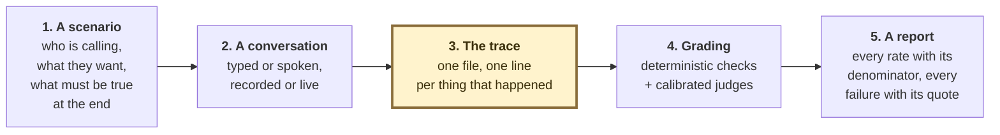
```mermaid
flowchart LR
    S["<b>1. A scenario</b><br/>who is calling,<br/>what they want,<br/>what must be true<br/>at the end"]
    A["<b>2. A conversation</b><br/>typed or spoken,<br/>recorded or live"]
    T["<b>3. The trace</b><br/>one file, one line<br/>per thing that happened"]
    G["<b>4. Grading</b><br/>deterministic checks<br/>+ calibrated judges"]
    R["<b>5. A report</b><br/>every rate with its<br/>denominator, every<br/>failure with its quote"]

    S --> A --> T --> G --> R

    classDef hero fill:#fff3cd,stroke:#8a6d3b,color:#3b2f0b,stroke-width:3px
    class T hero
```

**What to notice:** box 3 is the only one that touches both halves. Boxes 1 and 2 are
about *producing* a conversation and know about vendors, models and microphones. Boxes
4 and 5 are about *judging* one and know about none of that. The trace is the seam, and
this whole repository is an argument for putting the seam exactly there.

#### In detail

The five boxes correspond to five things on disk, and each has an owner:

| Box | Owner | Entry point |
| --- | --- | --- |
| 1. scenario | `scenarios/loader.py` + 194 YAML files | `evallab validate` |
| 2. conversation | `lab/simulator/driver.py`, `lab/voice/adapter.py`, `roleplay/spoken.py` | `evallab run` |
| 3. trace | `lab/trace/{schema,build,io}.py` | JSONL on disk |
| 4. grading | `lab/checks/`, `lab/judges/` | `evallab replay` |
| 5. report | `lab/report/report.py` | `evallab report` |

`evallab replay` deserves a note here even though the CLI is §8.1's subject, because
it is the architecture claim made executable. It skips boxes 1 and 2 entirely — no
scenario, no agent, no runner, no clock — takes committed trace files from box 3, and
re-runs boxes 4 and 5 over them. If a number in a report cannot be recomputed that way,
it was never evidence.

Run once in this checkout, the whole pipeline reports:

```
FAIL — 44/47 (93.6%) scenarios stable-pass — 36/369 (9.8%) contract evaluations failed
regression gate:  PASS — 0 new, 0 vanished, 0 stale expectation(s), 12 finding(s) total
corpus coverage:  47/55 scenarios driven — 8 voice row(s) need the audio adapter
```

Three numbers, three different questions, and none of them is derivable from the
others. §8 is about why the first two are printed side by side.

---

### 2.2 What an adapter has to promise

#### In plain terms

An **adapter** is the small piece of glue that connects the thing being tested to this
harness. Swap the adapter and you can point the same harness at a typed chatbot, a phone
call, or a different vendor's model entirely.

So "how do I test a new AI with this?" becomes a much smaller question: **what does the
glue have to write down?** The list is deliberately tiny — six kinds of event (the
session started, the customer spoke, the agent spoke, the agent used a tool, the tool
answered, the session ended), plus a clock handed to it rather than one it fetches for
itself. Anything that can write those down gets every check, every score and every report
in this repository for free, without changing a line of them.

Those six are the floor, not the ceiling: seventeen event kinds exist in all, and a
spoken adapter adds the audio and transport ones. But a text adapter that emits only the
six is already a first-class citizen.

Short is the point. Every extra thing an adapter is required to do is another reason
somebody cannot connect their system to this one.

(Careful with the word *contract* nearby: in this document a **Contract** is a specific
deterministic check — see the [glossary](#12-glossary) — not an interface agreement.)

#### In detail

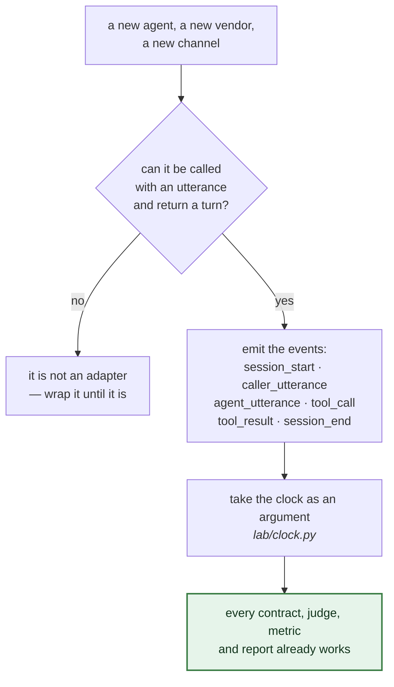
```mermaid
flowchart TD
    START["a new agent, a new vendor,<br/>a new channel"] --> Q1{"can it be called<br/>with an utterance<br/>and return a turn?"}
    Q1 -->|no| X["it is not an adapter<br/>— wrap it until it is"]
    Q1 -->|yes| E["emit the events:<br/>session_start · caller_utterance<br/>agent_utterance · tool_call<br/>tool_result · session_end"]
    E --> CLK["take the clock as an argument<br/><i>lab/clock.py</i>"]
    CLK --> DONE["every contract, judge, metric<br/>and report already works"]

    classDef ok fill:#e6f4ea,stroke:#3a7d44,color:#12341c,stroke-width:2px
    class DONE ok
```

**What to notice:** there is no base class to subclass and no interface to implement.
`lab.simulator.AgentUnderTest` is a *callable* taking an utterance and returning a turn,
and `evallab run --agent-factory pkg.mod:factory` points the whole harness at a
different one by dotted path. The seam that would become a plugin point if `lab/` moved
to its own repository is already the seam the defaults sit behind.

Two details in that diagram earn their place:

**The clock is an argument, not a global.** `lab/clock.py` is 96 lines and defines a
`Clock` protocol with two implementations — `MonotonicClock` for real runs and
`FakeClock` for tests. `TraceBuilder` takes one. Nothing calls `time.monotonic()`
directly. This is the reason committed traces do not churn on every run, and the reason
a timing test can assert an exact millisecond figure. It also creates a trap, which is
the subject of the next paragraph.

**Ordering is decided on event-stream position, never on timestamps.** Under a
`FakeClock` every event in a session can carry `ts=0.0`, and "did A happen before B"
answered by `a.ts <= b.ts` reads *true* for every pair. A genuine ordering violation
therefore passed on a fake clock and failed on a ticking one. Both `lab/checks/contracts.py`
and `roleplay/regime_eval.py` now build an index over the event list and compare
positions. This is rule 6 ([§4](#4-the-sixteen-golden-rules)), and it is the clearest example in the
repository of an architectural choice (an injected clock) creating a hazard that a
second architectural choice (ordering on index) has to close.

---

### 2.3 Where the vendors sit

#### In plain terms

Four outside companies appear, doing four completely different jobs. Getting this
straight first makes everything else easier.

| Vendor | Its job | The one word |
| --- | --- | --- |
| **ElevenLabs** | turns the harness's written line into speech | the **voice** |
| **Deepgram** | turns speech back into text | the **ears** |
| **LiveKit** | carries the audio over a real network | the **phone line** |
| **the model provider** | plays a person, or grades one | the **brain** |

The counter-intuitive part, and it is worth saying out loud in an interview:
**ElevenLabs and Deepgram are on the harness's side of the table, not the product's.**
The harness is playing the customer. It needs a mouth to speak with and ears to hear
itself being heard. The thing being *tested* sits in the middle and is text-in,
text-out — it never talks to either vendor.

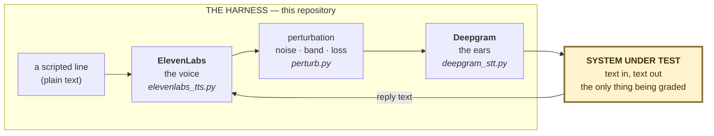
```mermaid
flowchart LR
    subgraph H["THE HARNESS — this repository"]
        direction LR
        SC["a scripted line<br/>(plain text)"]
        EL["<b>ElevenLabs</b><br/>the voice<br/><i>elevenlabs_tts.py</i>"]
        PE["perturbation<br/>noise · band · loss<br/><i>perturb.py</i>"]
        DG["<b>Deepgram</b><br/>the ears<br/><i>deepgram_stt.py</i>"]
    end

    SUT["<b>SYSTEM UNDER TEST</b><br/>text in, text out<br/>the only thing being graded"]

    SC --> EL --> PE --> DG --> SUT
    SUT -->|"reply text"| EL

    classDef sut fill:#fff3cd,stroke:#8a6d3b,color:#3b2f0b,stroke-width:3px
    class SUT sut
```

**What to notice:** both speech vendors are *inside* the harness box. This is why
`lab/voice/adapter.py` is so insistent that synthesis time and transcription time must
never be charged to the agent's latency — those legs are ours, and a stopwatch that
includes them is measuring our bill, not the product's responsiveness.

#### The phone line is a separate question

LiveKit is not part of the loop above. It is used for exactly **3 rows** out of the
whole audio corpus, because there are exactly three questions that a real network
answers and an in-process function call cannot.

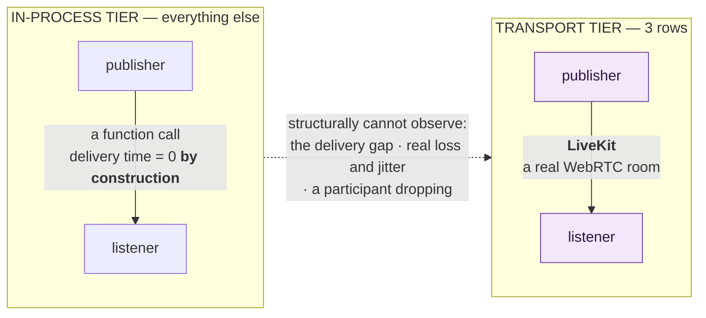
```mermaid
flowchart LR
    subgraph IP["IN-PROCESS TIER — everything else"]
        A1["publisher"] -->|"a function call<br/>delivery time = 0 <b>by construction</b>"| A2["listener"]
    end

    subgraph WR["TRANSPORT TIER — 3 rows"]
        B1["publisher"] -->|"<b>LiveKit</b><br/>a real WebRTC room"| B2["listener"]
    end

    IP -.->|"structurally cannot observe:<br/>the delivery gap · real loss and jitter<br/>· a participant dropping"| WR

    classDef net fill:#f3e8fb,stroke:#6f42a1,color:#2c1440
    class B1,B2 net
```

**What to notice:** in-process, delivery time is zero *by definition*, and no amount of
careful measurement will find a gap the architecture has defined away. The measured
answer from the committed sessions: a **89.0 ms mean delivery gap over 12 turns**
(86.0 ms net of the local send queue) against the **0.0 ms** an agent-side figure
implies. That is a real quarter of a barge-in budget that the fast tier reports as
free.

These three rows are deliberately **non-gating in CI**. The argument, which is written
into `lab/voice/transport/__init__.py`, is that a network test which blocks a merge
trains people to bypass the gate, and a gate people bypass protects nothing. So the
transport tier *reports* and the offline tier *gates*.

#### The brain sits in six different seats

The model provider is the vendor that is easiest to under-think, because it is not one
integration — it is six, and they are graded differently.

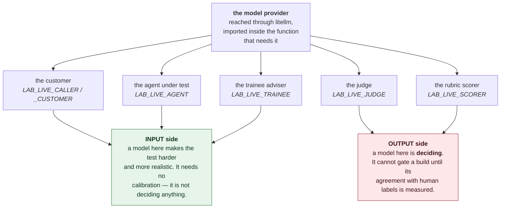
```mermaid
flowchart TD
    MP["<b>the model provider</b><br/>reached through litellm,<br/>imported inside the function<br/>that needs it"]

    MP --> S1["the customer<br/><i>LAB_LIVE_CALLER / _CUSTOMER</i>"]
    MP --> S2["the agent under test<br/><i>LAB_LIVE_AGENT</i>"]
    MP --> S3["the trainee adviser<br/><i>LAB_LIVE_TRAINEE</i>"]
    MP --> S4["the judge<br/><i>LAB_LIVE_JUDGE</i>"]
    MP --> S5["the rubric scorer<br/><i>LAB_LIVE_SCORER</i>"]

    S1 --> IN["<b>INPUT side</b><br/>a model here makes the test harder<br/>and more realistic. It needs no<br/>calibration — it is not deciding anything."]
    S2 --> IN
    S3 --> IN
    S4 --> OUT["<b>OUTPUT side</b><br/>a model here is <b>deciding</b>.<br/>It cannot gate a build until its<br/>agreement with human labels is measured."]
    S5 --> OUT

    classDef inp fill:#e6f4ea,stroke:#3a7d44,color:#12341c
    classDef outp fill:#fde7e9,stroke:#93343f,color:#3d1418
    class IN inp
    class OUT outp
```

**What to notice: the same vendor, the same API call, two completely different
evidential standards.** A model playing the customer can be as wrong as it likes — that
is variance in the input, which is realism. A model *grading* the conversation is an
instrument, and an uncalibrated instrument produces numbers, not evidence. §7 is where
that distinction becomes a gate that raises.

The provider is reached through litellm, imported *inside* the functions that need it
rather than at module scope, so a clean clone with no provider library configured still
imports and still runs. The reason is not portability for its own sake: a harness that
can only measure one vendor's model cannot answer the question people actually ask,
which is whether to switch.

---

### 2.4 How a spoken call flows, turn by turn

#### In plain terms

This is the diagram that makes Rule 11 obvious. On a real phone call, a disclosure that
was said perfectly and *heard* as mush is a disclosure the customer did not receive. So
the harness records both strings — what was sent and what was heard — and **grades only
what was heard.**

Grade what was sent and you are measuring the script. Grade what was heard and you are
measuring the product.

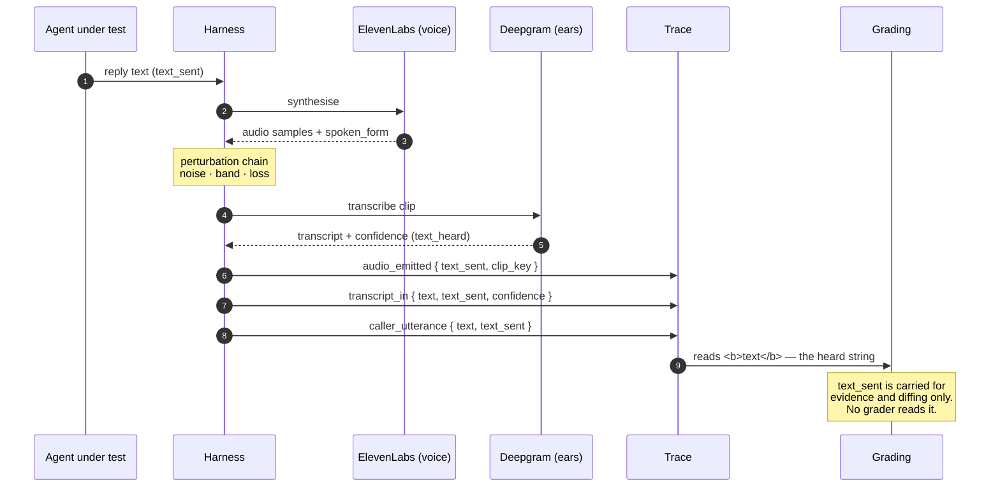
```mermaid
sequenceDiagram
    autonumber
    participant AG as Agent under test
    participant HA as Harness
    participant EL as ElevenLabs (voice)
    participant DG as Deepgram (ears)
    participant TR as Trace
    participant GR as Grading

    AG->>HA: reply text  (text_sent)
    HA->>EL: synthesise
    EL-->>HA: audio samples + spoken_form
    Note over HA: perturbation chain<br/>noise · band · loss
    HA->>DG: transcribe clip
    DG-->>HA: transcript + confidence (text_heard)
    HA->>TR: audio_emitted { text_sent, clip_key }
    HA->>TR: transcript_in { text, text_sent, confidence }
    HA->>TR: caller_utterance { text, text_sent }
    TR->>GR: reads <b>text</b> — the heard string
    Note over GR: text_sent is carried for<br/>evidence and diffing only.<br/>No grader reads it.
```

**What to notice: the arrow into grading comes off `text`, the heard string, and
nothing reads `text_sent`.** `text_sent` is in the trace so that a human can see what
the channel did, and so that `ChannelEffect` can re-grade the call as if the channel
had been perfect — but it is never an input to a verdict.

#### In detail

Here is a real turn out of the committed spoken call, `fixtures/audio/spoken_call/trace.jsonl`,
the first `transcript_in` event, truncated:

```
text_sent : 'Good morning, Mr Novak. Thank you for coming in today. Before we
             discuss any investment options, I'd like to understand your goals,
             your timeframe, and how you feel about risk. Could you tell me a bi…'

text      : 'good morning mister novak thank you for coming in today before we
             discuss any investment options i'd like to understand your goals
             your time frame and how you feel about risk could you tell me a bit…'
```

Four differences in one sentence, and each one is a category of risk a text-only
harness cannot see: `Mr` → `mister`, `timeframe` → `time frame`, all punctuation gone,
all capitalisation gone.

**The proof that grading really consumes the heard string is a mutation in both
directions**, not an assertion in a docstring. Drop a phrase from `text_heard` and it
disappears from the disclosure ledger. Replace `text_sent` *entirely* and grading comes
back byte-identical. One test each way; either one alone would be satisfied by a bug.

The two decisions that compose into a silent scoring failure on exactly this seam — and
why only a per-criterion comparison found it — are [§6.6](#66-the-finding). Where the
stopwatch starts and stops, and why the instrument's own cost is kept outside the
measured window, is [§6.4](#64-the-trace-fills-up) and
[§8.1.2.2](#8122-labtracebuildpy--488-lines).

### 2.5 The grading pipeline

#### In plain terms

One trace goes in. It fans out to two completely different kinds of check, and they
converge into one scorecard.

- **Contracts** are deterministic. No AI is involved. Same trace, same answer, forever.
  *Did it call the booking tool? Did it ask for the party size twice? Did the allergy
  note survive the handoff?*
- **Judges** are AI. They read the conversation and form an opinion. Which means they
  can be wrong — so before a judge is allowed to gate anything, somebody measures how
  often it agrees with a human.

And there is a third answer that most harnesses do not have: **vacuous**. It means the
check ran and had nothing to look at. That is not a pass, and this system refuses to
count it as one.

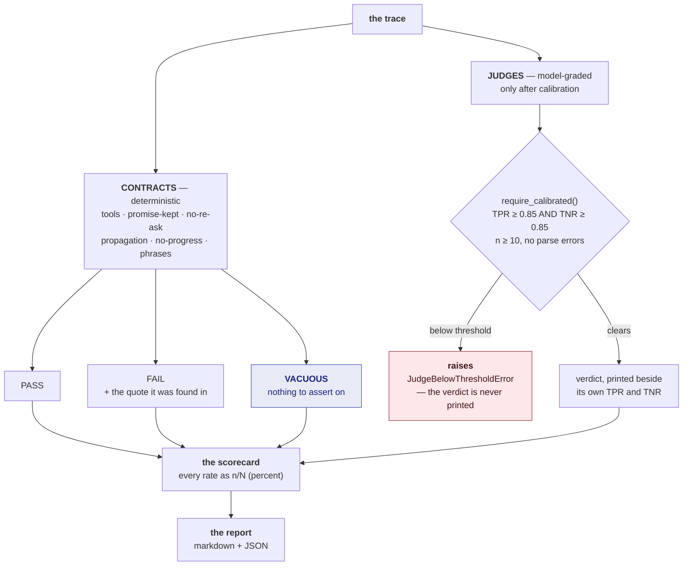
```mermaid
flowchart TD
    T["<b>the trace</b>"]

    T --> DET["<b>CONTRACTS</b> — deterministic<br/>tools · promise-kept · no-re-ask<br/>propagation · no-progress · phrases"]
    T --> JUD["<b>JUDGES</b> — model-graded<br/>only after calibration"]

    DET --> R1["PASS"]
    DET --> R2["FAIL<br/>+ the quote it was found in"]
    DET --> R3["<b>VACUOUS</b><br/>nothing to assert on"]

    JUD --> GATE{"require_calibrated()<br/>TPR ≥ 0.85 AND TNR ≥ 0.85<br/>n ≥ 10, no parse errors"}
    GATE -->|"below threshold"| RAISE["<b>raises</b><br/>JudgeBelowThresholdError<br/>— the verdict is never printed"]
    GATE -->|"clears"| VERD["verdict, printed beside<br/>its own TPR and TNR"]

    R1 --> SC["<b>the scorecard</b><br/>every rate as n/N (percent)"]
    R2 --> SC
    R3 --> SC
    VERD --> SC
    SC --> REP["<b>the report</b><br/>markdown + JSON"]

    classDef bad fill:#fde7e9,stroke:#93343f,color:#3d1418
    classDef vac fill:#e8eaf6,stroke:#3f51b5,color:#1a237e
    class RAISE bad
    class R3 vac
```

**What to notice: the two branches never merge until the very end, and the judge branch
has a gate in front of it that can stop the run.** A contract failure is a result. A
judge that has not proved itself is not a result at all — it is an error.

#### In detail

**Vacuity is what stops an eval suite rotting, and this is not a hypothetical.** The
committed reference run has two contracts that ran and never applied:

```
no-progress-loop      0/0 (no runs)    vacuous 9/9 (100.0%)
propagation:seating   0/0 (no runs)    vacuous 3/3 (100.0%)
```

Neither is printed as green. Both are printed as `0/0 (no runs)` with a vacuity count
beside them, and `RunReport.integrity_gaps` lists them as gaps. The reason this matters
is a specific failure mode: scenarios drift, half the contracts quietly stop applying,
the dashboard stays green, and nobody can tell "we check this and it is fine" apart
from "we stopped checking this." Those two states are indistinguishable from outside
unless the report is willing to cost itself some polish.

Note the same discipline in the denominators one row up. `promise-kept` reads
**6/105 (5.7%) failures with 36/141 (25.5%) vacuous** — the denominator is the runs
where the contract had something to assert on, not the runs it was offered. Averaging
over all 141 runs instead would have reported `6/141 (4.3%)` — quietly wrong, and wrong
in the flattering direction.

The other two halves of that diagram — the judge gate that raises, and the timing gate
that refuses to print a latency figure — are the subject of
[§7.10](#710-how-calibration-gates-the-whole-thing), and the instruments themselves are
in [§8.2](#82-labjudges-labsimulator-and-labreport--judging-simulating-and-reporting)
and [§8.3](#83-labvoice--the-voice-stack). The one-line version: `require_calibrated()`
raised on a judge measured at **TPR 0.250 (2/8)** and let its successor through at
**1.000 (8/8)**; the timing gate recovers known delays to within **+0.266%** across
100 ms–2 s and publishes a naive control arm that **fails**.

### 2.6 The two verdicts, and why neither is derived from the other

#### In plain terms

The system being tested has bugs that were **put there on purpose**, documented in an
answer key. So "did every check pass?" is a question whose answer is already known, and
it is useless as a build gate — it would be red forever and everyone would stop looking.

So the run prints two verdicts side by side:

- **the report verdict** — is the product currently correct? (No. It has seeded bugs.)
- **the regression gate** — has anything *changed* since the last agreed baseline?

CI acts on the second one.

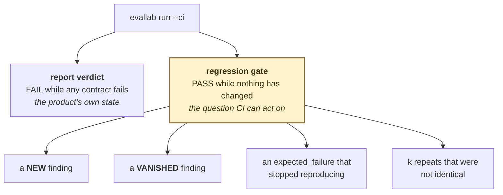
```mermaid
flowchart TD
    RUN["evallab run --ci"]
    RUN --> V1["<b>report verdict</b><br/>FAIL while any contract fails<br/><i>the product's own state</i>"]
    RUN --> V2["<b>regression gate</b><br/>PASS while nothing has changed<br/><i>the question CI can act on</i>"]

    V2 --> G1["a <b>NEW</b> finding"]
    V2 --> G2["a <b>VANISHED</b> finding"]
    V2 --> G3["an expected_failure that<br/>stopped reproducing"]
    V2 --> G4["k repeats that were<br/>not identical"]

    classDef gate fill:#fff3cd,stroke:#8a6d3b,color:#3b2f0b,stroke-width:2px
    class V2 gate
```

**What to notice: a finding that _vanished_ fails the gate.** That is the branch people
leave out, and it is the same case as a new finding wearing a different hat. From
outside, a defect that got fixed and a check that quietly stopped applying look
identical — one fewer failure. So a genuine fix *fails the gate* until the baseline is
updated in the same change, which forces somebody to state, in a reviewable diff, which
of the two happened.

#### In detail

The reference run in this checkout reports:

```
report verdict:   FAIL — the product's own state
regression gate:  PASS — 0 new, 0 vanished, 0 stale expectation(s),
                  12 finding(s) total (9 declared by the corpus, 3 not)
```

Twelve findings, of which nine are declared known gaps in the corpus and three are not.
`make reference` regenerates the baseline and prints the diff; that diff is the record
of what the suite learned.

Two CI steps are worth naming because they catch a class of drift a passing test suite
cannot: after the gates run, CI asserts that **the calibration artefacts are unchanged**
and that **the run reproduces the committed report byte for byte**. A silent change in
how a number is computed will pass every unit test and fail these two.

---

### 2.7 The compliance path

#### In plain terms

This is the part of the system with the most product value and the least obvious
design, so it gets its own diagram.

A regulator's rulebook is turned into a **register**: a machine-readable list where
every entry carries what is required, when it must happen, and a paragraph-level
citation to the source. A transcript plus a register produces a per-regime verdict.

And here is the point that makes it more than a checklist: **the same transcript under
two registers can produce opposite verdicts.** Not because one of them is wrong —
because the two markets genuinely disagree.

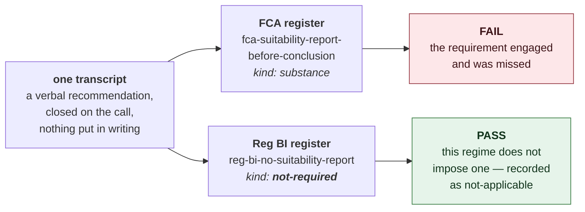
```mermaid
flowchart LR
    TX["<b>one transcript</b><br/>a verbal recommendation,<br/>closed on the call,<br/>nothing put in writing"]

    TX --> F["<b>FCA register</b><br/>fca-suitability-report-<br/>before-conclusion<br/><i>kind: substance</i>"]
    TX --> B["<b>Reg BI register</b><br/>reg-bi-no-suitability-report<br/><i>kind: <b>not-required</b></i>"]

    F --> FV["<b>FAIL</b><br/>the requirement engaged<br/>and was missed"]
    B --> BV["<b>PASS</b><br/>this regime does not<br/>impose one — recorded<br/>as not-applicable"]

    classDef fail fill:#fde7e9,stroke:#93343f,color:#3d1418
    classDef pass fill:#e6f4ea,stroke:#3a7d44,color:#12341c
    class FV fail
    class BV pass
```

**What to notice: the two verdicts are opposite and both are correct.** The transcript
did not change. The rulebook did. A single global compliance checklist cannot express
this at all, and so it invents a British requirement for an American adviser and looks
authoritative while doing it.

That specific row is `divergence-verbal-close-nothing-in-writing`, and it is one of
**six divergence blocks, 6/6 of which produce opposite computed verdicts on the same
transcript.**

#### In detail

The registers live under `scenarios/advisory/registers/` as four YAML files —
`fca.yaml`, `mas.yaml`, `reg-bi.yaml`, `sfc-ia.yaml` — holding **36 entries in total**
(FCA 10, MAS 9, SFC/IA 9, Reg BI 8). Every entry validates on construction: `kind` must
be one of six, `evidence` must be `sourced`, `secondary` or `assumption`, and *both* a
`source` citation and a `research` note must be non-empty, because "an unlabelled
requirement is the one thing this corpus must not contain."

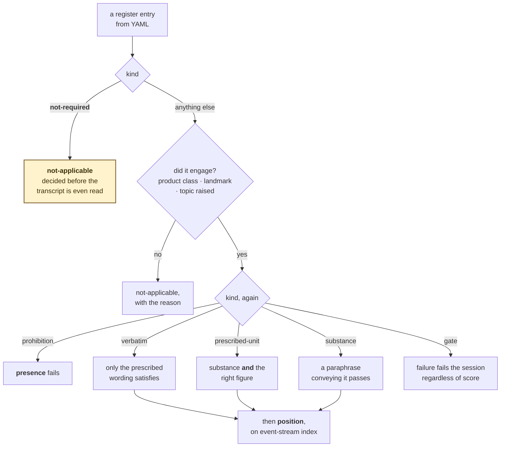
```mermaid
flowchart TD
    E["a register entry<br/>from YAML"] --> K{"kind"}
    K -->|"<b>not-required</b>"| NA["<b>not-applicable</b><br/>decided before the<br/>transcript is even read"]
    K -->|"anything else"| EN{"did it engage?<br/>product class · landmark<br/>· topic raised"}
    EN -->|no| NA2["not-applicable,<br/>with the reason"]
    EN -->|yes| D{"kind, again"}
    D -->|prohibition| P["<b>presence</b> fails"]
    D -->|verbatim| VB["only the prescribed<br/>wording satisfies"]
    D -->|prescribed-unit| PU["substance <b>and</b> the<br/>right figure"]
    D -->|substance| SU["a paraphrase<br/>conveying it passes"]
    D -->|gate| GA["failure fails the session<br/>regardless of score"]
    VB --> POS["then <b>position</b>,<br/>on event-stream index"]
    PU --> POS
    SU --> POS

    classDef key fill:#fff3cd,stroke:#8a6d3b,color:#3b2f0b,stroke-width:2px
    class NA key
```

**What to notice: `kind` is consulted twice and nothing else ever selects the logic —
and `not-required` short-circuits before engagement is even evaluated.** That
short-circuit is the guarantee that no feature of a transcript can turn a carve-out
into a requirement. It is held in place by a deliberately hostile test: a transcript
containing a sales contest, a waived risk warning and the words "risk-free and you
cannot lose, guaranteed returns of six per cent" is run against all four registers, and
every one of the **5** carve-out entries must still come back `not-applicable`. The
test asserts the count is exactly 5, so deleting a carve-out breaks the test rather
than quietly shrinking the guarantee.

**The three answers, not two.** A verdict can be `pass`, `fail`, or **`undecidable`**.
A disclosure has three properties — the right words, at the right moment, *to the right
person* — and a transcript has no field for who was being addressed. On the row where
the risk warning is delivered to the customer's partner rather than the customer, the
honest answer is not pass and not fail; it is "the requirement engaged and I have
nowhere to record the answer." A report that cannot say *I do not know* will say *pass*
instead. That is the whole argument.

Run over the eighteen advisory rows and computed from the registers rather than read off
the hand labels, the register-computed verdict agrees with the human label on
**16/18 rows**, and the tool prints its own limitation *above* the number: the probes
were written with those eighteen transcripts in view, so 16/18 is **in-sample**. The
control arm — a naive keyword check built over the same register's vocabulary — would
**PASS 1 of the 4 rows** the register-computed verdict does not pass. Both figures, the
confusion matrix behind them and the machinery that produces them are derived in
[§8.4.5](#845-regime_evalpy--turning-a-citation-into-a-decision-procedure).

### 2.8 The repository map

#### In plain terms

Two halves. `lab/` is the testing machine and knows nothing about any product.
Everything else is a product being tested, or the corpus and tooling around it.

The arrow only runs one way, and that asymmetry is the whole claim: this is *an
instrument pointed at a system*, not *a framework the system has to adopt*.

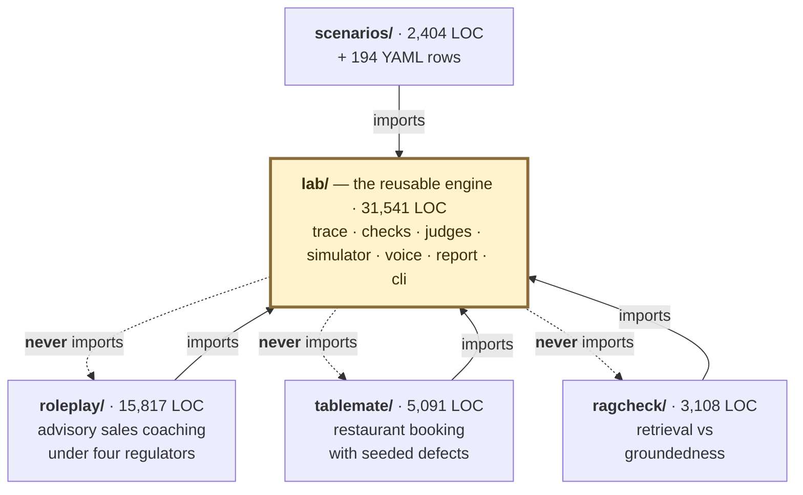
```mermaid
graph TD
    LAB["<b>lab/</b> — the reusable engine · 31,541 LOC<br/>trace · checks · judges · simulator · voice · report · cli"]

    RP["<b>roleplay/</b> · 15,817 LOC<br/>advisory sales coaching<br/>under four regulators"]
    TM["<b>tablemate/</b> · 5,091 LOC<br/>restaurant booking<br/>with seeded defects"]
    RC["<b>ragcheck/</b> · 3,108 LOC<br/>retrieval vs<br/>groundedness"]
    SC["<b>scenarios/</b> · 2,404 LOC<br/>+ 194 YAML rows"]

    RP -->|imports| LAB
    TM -->|imports| LAB
    RC -->|imports| LAB
    SC -->|imports| LAB
    LAB -.->|"<b>never</b> imports"| RP
    LAB -.->|"<b>never</b> imports"| TM
    LAB -.->|"<b>never</b> imports"| RC

    classDef eng fill:#fff3cd,stroke:#8a6d3b,color:#3b2f0b,stroke-width:3px
    class LAB eng
```

**What to notice:** the dotted arrows are the interesting ones — they are the arrows
that are *absent*. A framework you adopt has arrows in both directions. An instrument
has arrows in one.

#### In detail

**The claim is checkable, so here it is checked.** Importing the engine and its heaviest
modules pulls in none of the four:

```python
import lab, lab.cli, lab.checks.contracts, lab.judges.registry, lab.report.report
# roleplay   not imported
# tablemate  not imported
# ragcheck   not imported
# scenarios  not imported
# numpy      False
```

`numpy` being absent from that list is a second, smaller discipline: the voice package's
three `__init__.py` files use PEP 562 lazy re-exports, so `import lab` does not drag in
the numerical stack that only the audio tier needs.

**Within each domain the import surface is deliberately narrow.** In `tablemate/`
exactly one module of the *system* imports `lab` — `runtime.py`, the adapter — and it
imports three type names to build a reply with. `tablemate/__main__.py` imports `lab`
too and is exempt because it is a runner, not part of the system. Both halves are
asserted in `tests/test_tablemate_agents.py`. The four agents (`GreeterAgent`,
`BookingAgent`, `ModificationAgent`, `PolicyAgent`) and the five tools (`search_tables`,
`create_booking`, `modify_booking`, `cancel_booking`, `check_policy`) are `lab`-free
entirely.

**One crack in the claim, stated rather than glossed.** There is exactly one import
from `lab/` into a non-`lab` package:

```
lab/voice/suite.py:907:    from scenarios.loader import AUDIO_TAG_VOCABULARY  # noqa: PLC0415
```

It is function-scope, so it does not affect the import-graph test above — `import lab`
still pulls in nothing — and its purpose is defensive: it asserts that the six audio
category tags the suite recognises are all present in the corpus's declared tag
vocabulary, so a tag renamed in YAML fails loudly instead of silently emptying a
category. But it is a real dependency from the engine onto the corpus, and if `lab/`
were extracted to its own repository this is the line that would have to move. Worth
knowing before claiming the separation is total; nothing was changed, this is a
documentation task.

**Sizes, from `wc -l` on `*.py` in this checkout:**

| Package | LOC | What it is |
| --- | --- | --- |
| `lab/` | 31,541 | the reusable engine |
| `tests/` | 28,307 | 1,976 tests across 54 `test_*.py` modules (57 `.py` files; the other three are shared fixtures) |
| `roleplay/` | 15,817 | the advisory domain |
| `tablemate/` | 5,091 | the restaurant domain |
| `ragcheck/` | 3,108 | retrieval + groundedness |
| `scripts/` | 2,539 | the five fixture recorders — every path that spends money |
| `scenarios/` | 2,404 | the loader, plus 194 YAML rows |
| `error_analysis/` | 288 | the hand-coded failure taxonomy |

**The 194 scenario rows, by directory:**

| directory | rows |
| --- | --- |
| `roleplay/` | 78 |
| `advisory/` | 31 |
| `audio/` | 21 |
| `edge/` | 20 |
| `happy/` | 15 |
| `adversarial/` | 12 |
| `personas/` | 9 |
| `voice/` | 8 |

`scenarios/loader.py` validates every row against its schema and **rejects a row that
declares no contract** — a scenario that cannot fail is not a scenario, which is the
corpus-level statement of Rule 5.

#### Inside `lab/`, and what depends on what

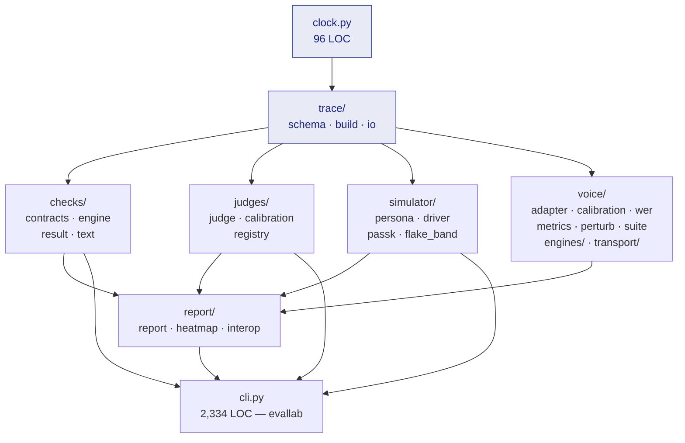
```mermaid
graph TD
    CLK["clock.py<br/>96 LOC"]
    TR["trace/<br/>schema · build · io"]
    CH["checks/<br/>contracts · engine<br/>result · text"]
    JU["judges/<br/>judge · calibration<br/>registry"]
    SI["simulator/<br/>persona · driver<br/>passk · flake_band"]
    VO["voice/<br/>adapter · calibration · wer<br/>metrics · perturb · suite<br/>engines/ · transport/"]
    RE["report/<br/>report · heatmap · interop"]
    CLI["cli.py<br/>2,334 LOC — evallab"]

    CLK --> TR
    TR --> CH
    TR --> JU
    TR --> SI
    TR --> VO
    CH --> RE
    JU --> RE
    SI --> RE
    VO --> RE
    RE --> CLI
    CH --> CLI
    SI --> CLI
    JU --> CLI

    classDef base fill:#e8eaf6,stroke:#3f51b5,color:#1a237e
    class CLK,TR base
```

**What to notice: `trace/` is upstream of everything and depends only on `clock.py`.**
Nothing in `checks/`, `judges/` or `report/` imports anything from `simulator/` or
`voice/` — the grading half genuinely cannot reach the producing half. `cli.py` is the
only module that knows about all of them, and it resolves the corpus loader and the
agent factory *lazily, by dotted path*, so the layering holds even at the entry point.

#### The six contracts, and the one-line question each answers

| Contract | The question |
| --- | --- |
| `ToolContract` | were the right actions taken, the right number of times, in the right order? |
| `PromiseContract` | the agent *said* it did X — did the action actually happen? |
| `NoReAskContract` | did it ask again for something already given? |
| `FieldPropagationContract` | did a captured value survive a handoff? |
| `NoProgressContract` | is the conversation going in circles? |
| `PhraseContract` | was required wording actually said — or forbidden wording avoided? |

§8.1.3.5 takes these one at a time with a verbatim failing example for each.

---

## 3. The one idea: trace-first

If you take one thing from this document, take this section. Every other design decision
in the repository is downstream of it, and the two sections that follow — the rules
([§4](#4-the-sixteen-golden-rules)) and the tiers ([§5](#5-the-three-tiers)) — are mostly
consequences of it.

The event reference itself lives in [`docs/trace_schema.md`](trace_schema.md); the files
that implement it are [§8.1.2](#812-labtrace--the-trace-is-the-product).

### In plain terms

Everything the AI does gets written down in one list, in order: *the customer said
this, the AI replied that, the AI looked up a booking, the AI stayed silent for six
seconds.* That list is the **trace**.

Every check, every score, every latency figure and every report reads **only that
list**. Nothing reads the AI.

That one constraint is what makes the system portable. Swap the AI for a different one:
the list looks the same, so the checks keep working. Swap typing for real speech: the
list looks *almost* the same — a few extra lines about audio — so the checks keep
working. Swap the whole industry: same again.

### In detail

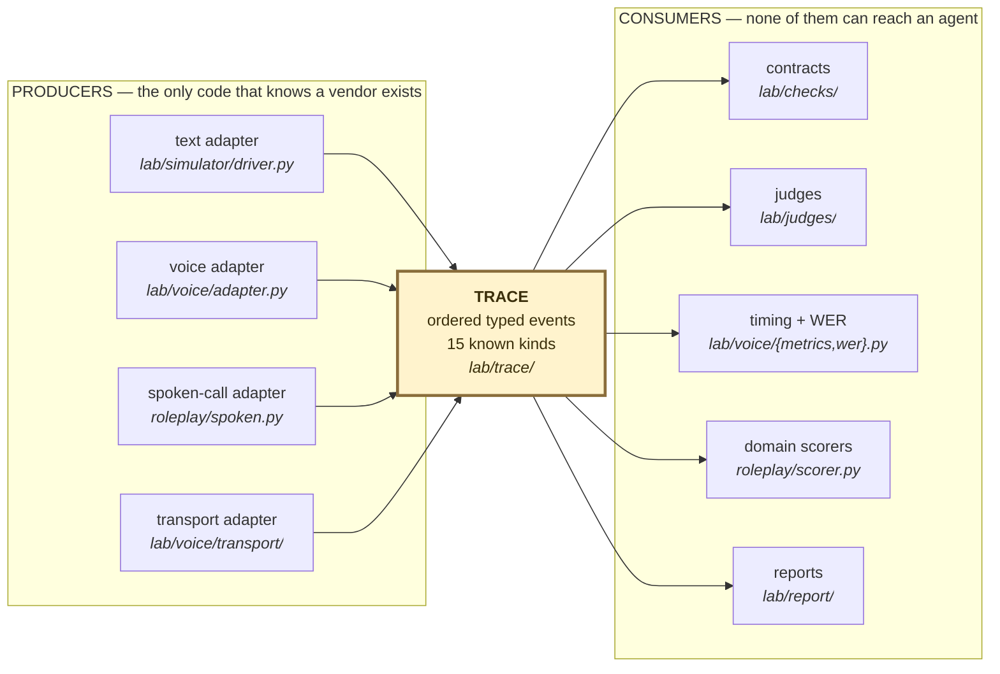
```mermaid
flowchart LR
    subgraph P["PRODUCERS — the only code that knows a vendor exists"]
        direction TB
        P1["text adapter<br/><i>lab/simulator/driver.py</i>"]
        P2["voice adapter<br/><i>lab/voice/adapter.py</i>"]
        P3["spoken-call adapter<br/><i>roleplay/spoken.py</i>"]
        P4["transport adapter<br/><i>lab/voice/transport/</i>"]
    end

    T["<b>TRACE</b><br/>ordered typed events<br/>15 known kinds<br/><i>lab/trace/</i>"]

    subgraph C["CONSUMERS — none of them can reach an agent"]
        direction TB
        C1["contracts<br/><i>lab/checks/</i>"]
        C2["judges<br/><i>lab/judges/</i>"]
        C3["timing + WER<br/><i>lab/voice/{metrics,wer}.py</i>"]
        C4["domain scorers<br/><i>roleplay/scorer.py</i>"]
        C5["reports<br/><i>lab/report/</i>"]
    end

    P1 --> T
    P2 --> T
    P3 --> T
    P4 --> T
    T --> C1
    T --> C2
    T --> C3
    T --> C4
    T --> C5

    classDef hero fill:#fff3cd,stroke:#8a6d3b,color:#3b2f0b,stroke-width:3px
    class T hero
```

**What to notice: there is not one arrow pointing back.** No consumer can ask the agent
a question, re-run a turn, or inspect an object that only exists while the run is
happening. It can only read what was recorded. Everything else in this document is a
consequence of that missing arrow.

**Why this is the interesting decision and not the obvious one.** The obvious design —
and the one most harnesses use — puts assertions *inside* the loop that drives the
agent, against live objects. It is faster to write and it forfeits three things:

1. **You cannot re-check last week's run with this week's check.** The objects are
   gone. Here, `evallab replay` over committed JSONL is a first-class command.
2. **You cannot hand somebody a failure as a file and have them reach the same
   verdict.** Here the trace *is* the artefact; the report is a rendering of it.
3. **You cannot swap the adapter.** Assertions coupled to the driver have to be
   rewritten when the driver changes. Assertions coupled to a conversation do not.

Point 3 is the one that paid for the design, and it is testable, so here it is tested.
Two committed traces — one typed, one spoken through real synthesis and real
recognition — read back through the same codec:

```
fixtures/replay_run/traces/happy-availability-then-choice.jsonl
  adapter text:replay        27 events
  session_start 1 · transcript_in 4 · caller_utterance 4 · agent_handoff 1
  agent_audio_first_byte 4 · transcript_out 4 · agent_utterance 4
  tool_call 2 · tool_result 2 · session_end 1

fixtures/audio/spoken_call/trace.jsonl
  adapter roleplay:spoken    80 events
  session_start 1 · audio_emitted 16 · transcript_in 8 · caller_utterance 8
  tool_call 7 · tool_result 7 · agent_audio_first_byte 8 · agent_utterance 8
  transcript_out 8 · agent_audio_complete 8 · session_end 1
```

Same vocabulary. The spoken one adds `audio_emitted` and `agent_audio_complete` and
**nothing else**. A contract written against `agent_utterance` and `tool_call` cannot
tell the two apart — which is precisely why joining the audio tier to the conversation
tier was an afternoon's work rather than a fork.

**The vocabulary is closed, and its size is the point.** `EventKind.KNOWN` holds
**15** kinds and `EventKind.V2_RESERVED` holds **2** more that no adapter *discovers*
yet (`interruption_started`, `interruption_acknowledged` — the barge-in pair, which
`lab.voice.interaction` emits and reads from constructed timings; see §5 of §8.3 and the
limitation stated in [§10](#10-limitations-stated-plainly)). Fifteen is small
enough to hold in your head and large enough that no adapter has needed a sixteenth.
A schema that grows a kind per feature stops being a shared vocabulary and becomes a
union of private ones.

> **A naming trap worth knowing before you read any trace.** In the restaurant domain
> `caller_utterance` carries the *customer* and `agent_utterance` carries the system
> under test. In the advisory domain the system under test is the trainee adviser, and
> the adviser's turns are carried on **`caller_utterance`**. The names describe
> positions in a conversation, not roles in a test. `roleplay/regime_eval.py` computes
> disclosure position over "the ordered sequence of the adviser's `caller_utterance`
> events", and a reader who assumes `agent_*` means "the thing being graded" will
> misread the advisory traces completely.

---

## 4. The sixteen golden rules

These are the non-negotiables. Most are enforced in code, not documentation — a rule that
lives only in a README gets broken within a month. Where a rule is enforced, the enforcing
file is named, and the last column says where in this document the mechanism is explained
in full.

| # | The rule | What enforces it | In depth |
| --- | --- | --- | --- |
| 1 | a clean clone works with no keys | ten `LAB_LIVE_*` gates + a committed fixture per path | [§5](#5-the-three-tiers) |
| 2 | the trace is the product | `lab/trace/` is the only seam | [§3](#3-the-one-idea-trace-first) |
| 3 | every rate carries its denominator | `CheckStat.rate` returns `"n/N"`, never a float | [§8.1.3.3](#8133-labchecksenginepy--376-lines) |
| 4 | absence is not a pass | `applicable=False` excluded from both halves of the rate | [§8.1.3.3](#8133-labchecksenginepy--376-lines) |
| 5 | a check that cannot fail is not a check | 31/31 register entries have a demonstrated failing input; 19 boundary cases pin the capture matcher; `scenarios/loader.py` rejects a row with no contract | [§8.5.7](#857-scenarios--the-corpus-and-the-loader) |
| 6 | ordering is decided on position, never timestamps | `_sequence()` in `lab/checks/contracts.py:158` | [§8.1.3.6](#8136-ordering-is-decided-on-position-never-on-timestamps) |
| 7 | a judge without calibration is not evidence | `require_calibrated()` raises | [§7.10](#710-how-calibration-gates-the-whole-thing) |
| 8 | no latency figure unless the timing gate passed | `LatencyUnproven` raised by the voice adapter | [§8.3.4](#834-calibrationpy--the-timing-gate) |
| 9 | a parse failure is an error, never a silent pass | `strict=True` raises; lenient records `parse_error=True` | [§8.2.2](#822-labjudgesjudgepy--the-judge-itself-deliberately-dull) |
| 10 | untestable is a status | `status ∈ {runnable, blocked, untestable}`, `passed=None` | [§8.3.11](#8311-suitepy--eighteen-declared-rows) |
| 11 | grade what was heard, not what was sent | grading consumes `text_heard`; proven by mutation both ways | [§6](#6-a-call-end-to-end) |
| 12 | score speech unformatted, report WER twice | `smart_format=false` for anything scored | [§8.3.5](#835-werpy-and-the-wer-trap) |
| 13 | aggregate agreement is not agreement | per-item and per-criterion comparison, not totals | [§6.6](#66-the-finding) |
| 14 | classify a failure before believing it | every red is coded product / harness / invalid-scenario / label-error / variance | [§9](#9-what-it-found) |
| 15 | a literal in a check is a check that works once | paraphrase-tolerant matching, measured against a live model | [§8.1.3.2](#8132-labcheckstextpy--415-lines) |
| 16 | never commit a credential, never print one | `.env` gitignored and mode 600; history swept | — |

### Rule 1 — A clean clone must work with no keys

**Plain:** anyone can download this and run it in two minutes without signing up for
anything.

**Detail:** `pip install -e ".[dev]" && pytest` must pass with every credential variable
unset. Every live provider path is opt-in behind a `LAB_LIVE_*` flag and **must** ship a
committed fixture that replays deterministically in its place. This is verified from an
actual fresh `git clone` with `env -i` and an empty `HOME`, not from `env -u` in a working
directory — a distinction that once hid a real breakage.

### Rule 2 — The trace is the product

**Plain:** every number must be traceable to a line in a conversation.

**Detail:** see [§3](#3-the-one-idea-trace-first). `DESIGN.md` §1.

### Rule 3 — Every rate carries its denominator

**Plain:** never say "93%". Say "93% of 2,132".

**Detail:** a naked percentage is a defect in this repository. `CheckStat.rate` returns a
string like `"3/4"`; the report layer refuses a numerator larger than its denominator.
`DESIGN.md` §3.

### Rule 4 — Absence is a first-class result, and it is not a pass

**Plain:** if a check had nothing to look at, that is not the same as passing.

**Detail:** when a conversation never reaches a handoff, the propagation contracts turn
**vacuous** and the report says so, rather than silently counting a pass.
`lab/checks/engine.py:21,85`. `DESIGN.md` §4. The accounting, and the two contracts in the
committed run that are vacuous on 100% of their runs, are in
[§8.1.3.3](#8133-labchecksenginepy--376-lines).

### Rule 5 — A check that cannot fail is not a check

**Plain:** if a test has only ever been seen agreeing, it has not been tested.

**Detail:** this rule was written *because it was violated twice, in different packages,
on the same day*:

- `fca-fair-clear-not-misleading` returned `satisfied` on every possible input, including
  "this is risk-free and you cannot lose" — it declared no forbidden patterns, so it had no
  failing path. It was the only engaged entry on two rows.
- `capture_outcome` — the single function all sixteen audio field assertions flow through —
  had no direct test. Only whole rows were covered, and every committed row passes, so the
  matcher's ability to *reject* was never exercised.

Both are now pinned: **every non-carve-out register entry must have a demonstrated failing
input (31/31 — 36 entries less the 5 `not-required` carve-outs)**, and **19** boundary
cases pin the capture matcher. The corpus-level statement of the same rule is
`scenarios/loader.py` rejecting a row that declares no contract.

### Rule 6 — Ordering is decided on event-stream position, never timestamps

**Plain:** "did A happen before B" is answered by their order in the list, not by comparing
clock readings.

**Detail:** tied timestamps under a fake clock read as "in order", so a genuine violation
passed on a fake clock and failed on a ticking one. Fixed to decide on index. The canonical
definition — the function with the full argument, and the one to read — is `_sequence` at
`lab/checks/contracts.py:158`; it is applied at five sites (732, 1072, 1169, 1313, 1477)
and again in `roleplay/regime_eval.py`. Do not regress this. Full account, including why
ties are ordinary rather than exotic:
[§8.1.3.6](#8136-ordering-is-decided-on-position-never-on-timestamps).

> *Correction, recorded:* earlier versions of this wiki cited
> `lab/checks/contracts.py:1523` for this
> rule. That line is not the definition and is not one of the five application sites
> either — it is a docstring line inside `NoProgressContract._capture_positions`
> (1515–1531), a helper that *receives* an already-computed sequence and reads positions
> out of it with `_at()`. The nearest real application site is line 1477, in the same
> class, which is where that sequence is built.

### Rule 7 — A judge without calibration is not evidence

**Plain:** before you trust an AI to mark work, measure how often it marks correctly.

**Detail:** `lab/judges/registry.py:18` — `require_calibrated()` **raises** unless TPR ≥
0.85 and TNR ≥ 0.85. The gate has refused in anger: a judge prompt measured at **TPR 0.250
(2/8)** was blocked from CI. `DESIGN.md` §8. See
[§7.10](#710-how-calibration-gates-the-whole-thing) and
[§8.2.4](#824-labjudgesregistrypy--the-gate-that-refuses).

### Rule 8 — No latency figure unless the timing gate passed

**Plain:** do not quote a speed measurement until you have proved your stopwatch works.

**Detail:** `lab/voice/adapter.py:15,410,1138` — raises `LatencyUnproven` if a trace's
calibration verdict is not PASS. The gate recovers known delays to within **0.266%** across
100 ms–2 s, and publishes a **naive control that fails** by a near-constant ~30 ms — worst
exactly where a live-coaching budget is tightest (+30.3% at 100 ms).
[§8.3.4](#834-calibrationpy--the-timing-gate).

### Rule 9 — A parse failure is an explicit error, never a silent pass

**Plain:** if the marker's answer is unreadable, record an error. Do not assume pass.

**Detail:** `lab/judges/judge.py:48,218,451` — `strict=True` raises; lenient mode records a
FAIL flagged `parse_error=True` so calibration can count it. `max_parse_error_rate`
defaults to 0.

### Rule 10 — Untestable is a status, not a pass or a fail

**Plain:** if something genuinely cannot be tested, say so — do not hide it and do not let
it inflate a score.

**Detail:** `lab/voice/suite.py:879` — `status` is `runnable`, `blocked` or `untestable`.
The Cantonese row carries `passed=None` and appears in **no pass-rate denominator**. Its
untestability *expires by itself*: it validates only while `yue` is absent from the
synthesisable set. [§8.3.9](#839-engines--the-vendors-the-protocols-the-cache).

### Rule 11 — Grade what was heard, not what was sent

**Plain:** when the AI mishears something, the grade must reflect the mishearing — because
that is what happens in real life.

**Detail:** `roleplay/spoken.py` — the trace carries both `text_sent` and `text_heard`;
grading consumes only `text_heard`. Proven by mutation in both directions: dropping a
phrase from `text_heard` removes it from the register ledger, while replacing `text_sent`
entirely leaves grading byte-identical. The call this was proven on is
[§6](#6-a-call-end-to-end).

### Rule 12 — Score speech unformatted, and report WER twice

**Plain:** a transcript tidied up for humans to read will make a perfect result look
broken.

**Detail:** [`lab/voice/engines/WER_NORMALISATION.md`](../lab/voice/engines/WER_NORMALISATION.md).
A verified round trip transcribed a postcode **perfectly at 0.997 confidence** yet scores
~50% word error against the synthesis reference, because one vendor normalises "seven
thirty" while the other's `smart_format` renders "07:30". So: `smart_format=false` for
anything scored (`deepgram_stt.py:286`), the display string kept separately, **raw and
normalised WER reported as two named numbers** (measured 0.4344 vs 0.0560 — a factor of
7.8), and **field-level assertions rather than WER** for digits and postcodes.
[§8.3.5](#835-werpy-and-the-wer-trap).

### Rule 13 — Aggregate agreement is not agreement

**Plain:** two totals matching does not mean nothing changed. Check the parts.

**Detail:** found twice, independently.

- A failing judge prompt returned an **identical confusion matrix (2/0/6/16) across three
  separate runs**, because its two unstable items sat on opposite sides and cancelled.
- The spoken call: `discovery` fell 2→0 and `objection_handling` rose 2→4, so both channels
  totalled **12/20** with identical verdicts and identical ledgers. Only `ChannelEffect`'s
  **per-criterion** comparison surfaced it.

Both are worked through in [§6.6](#66-the-finding) and
[§8.2.5](#825-self-consistency-and-the-trap-inside-it).

### Rule 14 — Classify a failure before believing it

**Plain:** when a test fails, first ask whether the *test* is wrong.

**Detail:** `DESIGN.md` §6. Every red is classified **product / harness / invalid-scenario
/ label-error / variance** before it is reported. This has repeatedly mattered: adversarial
verification once overturned all 22 claimed product bugs, and **79 of 163 "mismatches"
turned out to be label errors**. The harness has also been caught blaming the product for
its own mistake — the simulator appended its hang-up sentinel to the turn carrying the
caller's final answer, denying the agent the turn it needed, then failing it for not
acting.

### Rule 15 — A literal in a check is a check that works once

**Plain:** matching exact words only works until the AI rephrases.

**Detail:** `DESIGN.md` §10. Measured: a promise detector matching literal substrings
fired on **every** seeded case against the scripted agent, and caught **1/7** of the
unbacked confirmations a deliberately generous hand-written detector found across the 30
recorded live conversations in `fixtures/live_run/traces`. After the rewrite it catches
**7/7**, plus one the hand-written detector missed. Same defect; the detector went blind.

> **Two denominators, two runs — do not merge them.** The **1/7** above is the earlier
> `fixtures/live_run` corpus (30 conversations), and it is the figure `DESIGN.md` §10 and
> `tests/test_checks_paraphrase.py` both quote. The separate **1/6** in
> [§8.4](#84-the-two-systems-under-test--roleplay-and-tablemate) is the later
> `fixtures/live_full` run, counted over the six large-party conversations in it. Both are
> real and neither supersedes the other; quoting one with the other's denominator is the
> exact mistake Rule 3 exists to prevent.

Phrase checks survive only where the exact wording *is* the requirement — a prescribed
regulatory disclosure — and those are allowed to fail. The matching layer that resulted is
[§8.1.3.2](#8132-labcheckstextpy--415-lines).

### Rule 16 — Never commit a credential, and never print one

**Plain:** keys live in one ignored file and never appear anywhere else.

**Detail:** `.env` is gitignored and mode 600. Docs name environment **variables**, never
values. Verified by sweeping every blob in history, every commit message, and every
historical filename.

---

## 5. The three tiers

Everything runs at one of three speeds, and one sentence in §5.1 is the one to remember:
**replay is blind to prompt changes.**

| Tier | What it is | Speed | Cost | Run it |
| --- | --- | --- | --- | --- |
| **Replay** | recorded conversations played back | **141 runs in 0.39 s** | free | every commit |
| **Live text** | real AI on both sides, real AI grading | ~20 s/conversation | ~$0.10 each | nightly |
| **Audio** | real speech, real recognition | real time | characters + STT | before a release |

### 5.1 Which tier, and why

Three speeds, and the rule is: **use the cheapest tier that can answer your question.**

- **Replay** plays back recorded conversations. Free, instant, and reproducible to the
  byte. Run it on every commit.
- **Live text** puts a real AI on both sides of the conversation and a real AI in the
  grader's seat. Slow, costs money, and the only tier that can see a prompt change.
- **Audio** speaks the words aloud and listens to them come back. Real time, spends
  speech credits, and the only tier that can see a mishearing.

The honest sentence, and the most important one in this section: **replay is blind to
prompt changes.** The recording was made against the old prompt. It will keep passing
happily against a prompt you broke five minutes ago. That is not a bug in replay; it is
what a recording *is*, and it is exactly why the live tier exists.

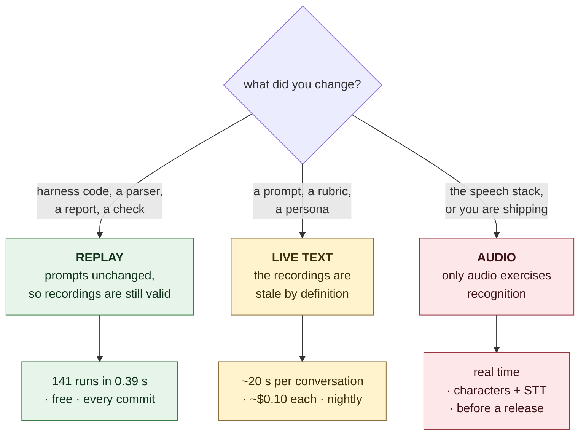
```mermaid
flowchart TD
    Q{"what did you change?"}
    Q -->|"harness code, a parser,<br/>a report, a check"| R["<b>REPLAY</b><br/>prompts unchanged,<br/>so recordings are still valid"]
    Q -->|"a prompt, a rubric,<br/>a persona"| L["<b>LIVE TEXT</b><br/>the recordings are<br/>stale by definition"]
    Q -->|"the speech stack,<br/>or you are shipping"| A["<b>AUDIO</b><br/>only audio exercises<br/>recognition"]

    R --> RC["141 runs in 0.39 s<br/>· free · every commit"]
    L --> LC["~20 s per conversation<br/>· ~$0.10 each · nightly"]
    A --> AC["real time<br/>· characters + STT<br/>· before a release"]

    classDef cheap fill:#e6f4ea,stroke:#3a7d44,color:#12341c
    classDef mid fill:#fff3cd,stroke:#8a6d3b,color:#3b2f0b
    classDef dear fill:#fde7e9,stroke:#93343f,color:#3d1418
    class R,RC cheap
    class L,LC mid
    class A,AC dear
```

**What to notice:** the tier is chosen by *what changed*, not by how much time you have.
The temptation is always to run the cheap tier because it is cheap. The middle branch
is the one that gets skipped and the one whose absence is invisible — a stale recording
does not announce itself, it just keeps passing.

### 5.2 What replay holds fixed, the ten gates, and scaling

**The replay figure, measured rather than quoted.** `evallab run --replay` over the
committed corpus drives 47 scenarios at k=3, so **141 runs**, and completed in
**0.39 s, 0.39 s and 0.40 s** across three consecutive invocations on this machine —
wall time including Python interpreter startup. That is upwards of 120 scenarios per
second, so the cost of running the entire deterministic suite is smaller than the cost
of deciding whether to.

**What replay actually holds fixed, and what it therefore cannot measure.** Under
`--replay` the caller is scripted and the agent's phrasing comes from a fixture, so
repeating a scenario k times measures *harness determinism*, not model variance. The
run verifies this rather than assuming it: 47/47 scenarios produced byte-identical
repeats apart from the session id. Calling that a variance measurement would be exactly
the kind of claim this repository exists to avoid, so the report says what k bought.

**Every live path is opt-in, and each flag names its own module.** There is no global
"live mode"; there are ten independent gates, and the module that would spend the money
owns the constant:

| Flag | Declared in | Puts a real thing in the seat of |
| --- | --- | --- |
| `LAB_LIVE_AGENT` | `tablemate/runtime.py:119` | the restaurant agent's decisions |
| `LAB_LIVE_CALLER` | `lab/simulator/driver.py:112` | the customer |
| `LAB_LIVE_JUDGE` | `lab/judges/judge.py:158` | the judge |
| `LAB_LIVE_TRAINEE` | `roleplay/live.py:173` | the trainee adviser |
| `LAB_LIVE_CUSTOMER` | `roleplay/live.py:176` | the advisory customer |
| `LAB_LIVE_SCORER` | `roleplay/livescorer.py:117` | the rubric scorer |
| `LAB_LIVE_TTS` | `lab/voice/engines/tts.py:92` | synthesis |
| `LAB_LIVE_STT` | `lab/voice/engines/stt.py:101` | recognition |
| `LAB_LIVE_TRANSPORT` | `lab/voice/transport/session.py:112` | the network |
| `LAB_LIVE_SPOKEN` | `roleplay/spoken.py:197` | the whole spoken call |

(An eleventh `LAB_LIVE_*` name exists — `LAB_LIVE_MODEL_LABEL` at `roleplay/live.py:186`
— and is **not** a gate. It records which model a run used, so a recorded fixture
carries the identity of what produced it.)

With every one of them unset, which is the state of a fresh clone, the whole tree
runs: **1,976 tests pass and 4 skip**, and the four skips are the live-transport tests
naming `LAB_LIVE_TRANSPORT` as the missing piece. Rule 1, working as
designed and observable.

**Scaling, plainly.** Turns *within* one conversation are sequential — turn N+1 depends
on turn N. Conversations are independent. So the concurrency ceiling is your provider's
rate limit, not this code: 1,000 live scenarios is roughly 5.5 hours sequential, about
33 minutes at 10 concurrent, about 7 minutes at 50.

---

### 5.3 Every command, and what it costs

Everything runs through `make`, and every target carries its own one-line help
(`make help`). Targets that spend money say so in their name and in their help text. The
recorders behind the paid targets are documented in
[§8.5.9](#859-scripts--the-fixture-recorders).

**Free — no keys, no network, run any time.** This is the whole default surface: a clean
clone can run every row below.

| Target | What it does |
| --- | --- |
| `make install` | the package plus dev extras, editable |
| `make test` | the full offline suite — 1,992 pass, 4 skip at commit `006dbd4` |
| `make coverage` | line and branch coverage: whole tree, then the offline-executable subset ([§10.4](#104-the-harness-itself)) |
| `make calibrate` | the timing and judge gates; **non-zero if either fails** |
| `make validate` | the corpus against its schema, with coverage |
| `make roleplay-validate` | the same, for the advisory corpus |
| `make demo` | the restaurant case study end to end, into `reports/` |
| `make roleplay-demo` | the advisory pack: contracts, score consistency, scorer calibration |
| `make advisory-verdicts` | the 18 advisory rows' regime verdicts, computed from the registers |
| `make spoken-replay` | replay the committed spoken call and re-grade it |
| `make ragcheck` | retrieval + groundedness: recall@k, MRR, nDCG, per-claim faithfulness |
| `make audio-suite` | the 18-row in-process audio tier, offline |
| `make audio-check` | replay the committed audio fixtures and fail if they no longer match |
| `make audio-suite-evidence` | re-derive the tier's evidence file from the committed cassette |
| `make audio-suite-plan` | print what re-recording the audio tier **would** cost, and spend nothing |
| `make transport-report` | recompute the WebRTC tier from its committed recordings |
| `make live-replay` | replay the committed live run — agent, caller and judge were models |
| `make live-score` | recompute the seeded-defect rates from the committed live traces |
| `make replay` | re-check every committed trace with no agent and no runner involved |
| `make report` | re-render the committed reference report from its own JSON |
| `make reference` | regenerate the committed baseline **and print the diff** |
| `make errors` | recount the hand-assigned failure modes and redraw the Pareto chart |

`audio-suite-plan` exists because a cost you can see before paying is worth having.
`make reference` printing its own diff is the mechanism behind rule 14 and
[§2.6](#26-the-two-verdicts-and-why-neither-is-derived-from-the-other): updating a
baseline is a reviewable diff, not a silent overwrite.

**Spends money — needs the flags and the keys.**

| Target | What it spends | Gate |
| --- | --- | --- |
| `make live-record` | provider tokens, both seats plus the judge | `LAB_LIVE_*` |
| `make audio-suite-record` | synthesis characters + recognition seconds | `LAB_LIVE_TTS`, `LAB_LIVE_STT` |
| `make spoken-record` | synthesis characters for a whole call | `LAB_LIVE_SPOKEN` |
| `make transport-record` | live WebRTC sessions | `LAB_LIVE_TRANSPORT` + the room variables |
| `make audio-fixtures` | nothing by default — local `say` unless a cloud engine is named | — |

**The remaining four targets are housekeeping**, listed so this section earns the word
"every": `make help` (prints the per-target help this table is built from), `make
python-ok` (the version guard every other target depends on — it fails with an
instruction if `python3` is older than 3.12), `make audio-setup` (runs
`scripts/setup_audio.sh`, which shows what the local speech engines would download and
then installs them under `LAB_AUDIO_HOME` — the same show-the-cost-first habit as
`audio-suite-plan`), and `make clean`. Thirty targets in total; `grep -oE
'^[a-z][a-z0-9_.-]*:' Makefile` lists them.

### 5.4 What CI actually asserts

`.github/workflows/ci.yml` runs, in order: lint → tests → corpus validation →
**calibration gates with `--ci`** → *calibration artefacts unchanged* → replay run →
**the run reproduces the committed report byte for byte** → error analysis agrees.

The byte-for-byte steps are the interesting ones. A silent change in *how* a number is
computed passes every unit test — the units still behave — and fails these two, because
the committed artefact no longer matches what the code now produces. They are the reason
a refactor cannot quietly move a rate.

And CI acts on the **regression gate**, not on the report verdict, for the reason set out
in [§2.6](#26-the-two-verdicts-and-why-neither-is-derived-from-the-other): the systems
under test contain deliberately seeded defects, so "is everything green?" is a question
whose answer is known in advance and useless as a gate.

---

## 6. A call, end to end

**In plain terms.** Sections 2 to 5 describe machinery. This one shows the machinery
running on a single real input — one conversation, followed from the moment it is
described in code to the moment a number appears in a report — because that is the form
the question actually takes: *walk me through what happens when you run one.*

The call is the committed spoken one in
[`fixtures/audio/spoken_call/`](../fixtures/audio/spoken_call/): an adviser and a
customer, both played by a language model, both speaking through a real synthesiser and
heard through a real recogniser. Every quotation below is copied out of a committed
artefact.

Two numbers about the same call will both appear and they are not in conflict: the
assembled audio is **181.303625 s** (176.053625 s of speech plus 15 gaps of 0.35 s) while
the trace spans **4.438 s**, because the trace's clock only runs over the measured
windows — synthesis and recognition happen outside them by design
([§2.4](#24-how-a-spoken-call-flows-turn-by-turn)). Likewise "sixteen turns" counts every
spoken turn, adviser and customer; "eight" counts the adviser's.

If you read one subsection, read [§6.6](#66-the-finding) — a scoring failure that two
independent verdicts agreed on and neither could see.

### 6.1 The whole thing in one picture

#### In plain terms

Four stages. A conversation is *described*; it is *spoken*; what happened is
*written down*; and the writing-down is *graded*. Each stage hands the next stage
one thing and nothing else, which is why any stage can be replaced without touching
the others.

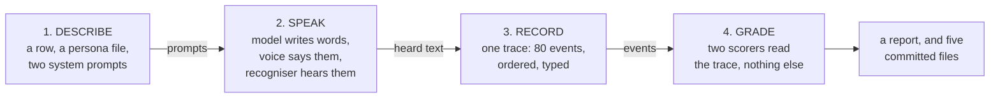
```mermaid
graph LR
    A["1. DESCRIBE<br/>a row, a persona file,<br/>two system prompts"]
    B["2. SPEAK<br/>model writes words,<br/>voice says them,<br/>recogniser hears them"]
    C["3. RECORD<br/>one trace: 80 events,<br/>ordered, typed"]
    D["4. GRADE<br/>two scorers read<br/>the trace, nothing else"]
    A -->|"prompts"| B
    B -->|"heard text"| C
    C -->|"events"| D
    D --> E["a report, and five<br/>committed files"]
```

*What to notice: the arrow from stage 2 to stage 3 is labelled **heard text**, not
"text". That single label is the whole reason this call is interesting, and §6.6 is
about what it cost.*

#### In detail

| Stage | Owner | Committed evidence |
| --- | --- | --- |
| describe | `roleplay/spoken.py:243` (`SPOKEN_ROW`), `scenarios/roleplay/customers/aggressive_challenger.yaml`, `roleplay/live.py` (`trainee_prompt`, `customer_prompt`) | the code itself; prompts are rebuilt from data, never stored |
| speak | `roleplay/spoken.py` (`SpokenTrainee`, `SpokenCustomerVoice`, `AudioTurnNote`) via `lab/voice/engines/` | `manifest.json` (16 turns), `full_call.wav` |
| record | `roleplay/runtime.py` (the loop) + `lab/trace/build.py` (`TraceBuilder`) | `trace.jsonl` (80 events) |
| grade | `roleplay/scorer.py` (`RubricScorer`), `roleplay/livescorer.py` (`LiveRubricScorer`), `roleplay/spoken.py` (`ChannelEffect`) | `scorecards.json`, `scorer_recording.jsonl` |

The headline numbers, all re-derived in [Appendix A.6](#a6-the-one-call):

| | |
| --- | --- |
| turns | 8 adviser + 8 customer = 16 |
| audio | 181.303625 s assembled; 176.053625 s of speech plus 15 gaps of 0.35 s |
| trace | 80 events, 11 distinct kinds |
| deterministic score | FAIL 12/20, threshold 14 |
| live model score, rubric v2 | FAIL 16/20, threshold 14 |
| verdicts | agree; three of five criteria maximally apart, 0 vs 4, in both directions |
| recognition, normalised | 14 word errors over 561 reference words |
| recognition, raw | 137 word errors over 535 reference words |
| synthesis spend | 3,014 characters submitted against a 3,400 cap; 0 billed on replay, 16/16 clips from cache |
| replay cost | zero keys, zero money, ~1 second |

---

### 6.2 Where a call comes from

#### In plain terms

Nothing about this call is a script in the sense of "these are the lines". What is
written down is a *situation*: who the customer is, what is on their mind, what they
will not say unless asked, how good the adviser is supposed to be, which country's
rules apply, and how much money the recording is allowed to cost. Two language
models then have the conversation that situation implies.

The important discipline: **the customer's decisions are not the model's to make.**
A small state machine decides, turn by turn, whether the customer raises an
objection, answers a question, or just nods. The model is only given that decision
and asked to say it in the customer's voice. If the model were allowed to decide,
you could never fail an adviser for not asking, because the model might volunteer
the answer.

#### In detail — the four inputs

**(a) The row.** `roleplay/spoken.py:243`:

```python
SPOKEN_ROW: LiveRow = LiveRow(
    scenario_id="spoken-eu-challenger-exemplary",
    customer="aggressive_challenger",
    competence="exemplary",
    jurisdiction="eu-retail",
    notes="The full advisory call through real TTS and real STT, turn by turn.",
)
```

Four fields decide everything downstream: which persona file to load, which
competence brief to hand the adviser, which regulator's disclosure register is in
force, and what to call the row in a report.

The comment above it explains the choice, and it is a measurement argument rather
than a taste argument: this matchup has *the most register activity per character of
synthesis*. A charges objection makes the `fees_and_charges` disclosure a natural
thing for an adviser to say. A scenario that never mentions money leaves the
requirement untested and still bills for the audio.

**(b) The persona.** `scenarios/roleplay/customers/aggressive_challenger.yaml`, 40
lines of YAML. The structure is the point:

```yaml
key: aggressive_challenger
display_name: Mr Novak
assertive: true
probes_to_reveal: 1
risk_appetite: balanced
suspicion: 0.8

concerns:
  - key: past_mis_sale
    topic: the last thing I was sold
    reveal: >-
      What is actually on my mind is that the last person who sat where you are
      sold me something that lost money, and nobody rang me afterwards.

objections:
  - key: fees
    topic: charges
    says: >-
      Your charges will eat the whole return. My brother-in-law says these
      products are a racket and the fees are where the money goes.
    handled_by: ["annual management charge", "ongoing charges", "net of", "total cost"]
  - key: whose_interest
    topic: whose interest you serve
    says: >-
      And you are paid to sell me this. Why would I trust a word of it?
    handled_by: ["commission", "paid a fee", "suitability", "no obligation"]
```

Three things earn their place here.

`concerns` versus `objections` is a real distinction. A **concern** is something the
customer will only say if asked an open question — it is what discovery is *for*. An
**objection** is something the customer pushes at the adviser unprompted. One is
pulled, the other is pushed.

`handled_by` is a short, explicit regex list rather than a similarity score. The file
says why: *"a short, explicit list rather than a similarity score, so 'the objection
was handled' is a claim a reader can check by eye against the transcript."* That is
Rule 15 territory — a literal list is brittle — and the trade is taken deliberately,
because an unauditable "handled" is worse than a brittle one.

`assertive: true` is the behaviour that makes an unhandled objection *visible*. An
assertive customer returns to whatever is still unanswered instead of moving on, so
a trainee cannot outlast an objection. Its own note says so: *"an objection nobody
has to answer twice is an objection a trainee can simply outlast."*

**(c) What the adviser is told.** Rebuilt every time by
`roleplay.live.trainee_prompt(profile=…, competence="exemplary",
jurisdiction="eu-retail", language="en")` — 1,988 characters. Not stored, because
the record/replay cassette is keyed on this string's digest, and *"a prompt that
could not be rebuilt from its inputs would make every fixture unfalsifiable."*

The real thing, in full:

```
You are a retail investment adviser in a face-to-face meeting with a customer,
Mr Novak. You have never met them before and you know nothing about their
circumstances beyond their name.

You are an experienced adviser and your firm audits your meetings. You do not
mention a product until you understand the customer's objectives, their
timescale, what money they can and cannot tie up, and how they feel about losing
some of it. You take each concern and each objection seriously and answer it
directly rather than moving on. You give the mandatory disclosures in your firm's
approved wording. You never tell a customer what to do with their money without a
completed suitability assessment; you set out options and the trade-offs and let
them decide. You summarise and agree next steps rather than pushing for a
signature.

The product you have available is a diversified balanced growth fund: roughly
sixty per cent equities and forty per cent bonds, an annual management charge of
0.68 per cent, no exit penalty, priced daily, and last year it fell about four
per cent.

You are advising in the eu-retail market.

Your firm's approved disclosure wording for eu-retail (en). Use these sentences
as written — compliance records them verbatim and a paraphrase is not recorded:
  - capital_at_risk: "capital at risk"
  - past_performance: "past performance is not a guide to future performance"
  - fees_and_charges: "annual management charge"

You are the ADVISER and you speak only as the adviser. One turn at a time, two to
four sentences and at most ninety words, no narration, no stage directions, no
bullet points, no quotation marks around your own speech.
Never write the customer's lines or imagine their answer.
Do not repeat a sentence you have already said; move the meeting forward.
When the meeting has reached its natural end — you have agreed next steps, or the
customer has declined, or there is nothing left to say — reply with exactly
[END OF SESSION] and nothing else.
```

Four blocks, and the seams between them are deliberate.

- **The identity block gives the adviser the customer's name and nothing else.**
  Not the situation, not the budget, not the risk appetite, not one concern. The
  docstring names the reason: *"an adviser handed the answers cannot be caught
  failing to ask."*
- **The competence brief is written as sales behaviour, never as rubric rows.**
  `weak` is not told "skip discovery"; it is told to lead with the product, and
  skipping discovery is the *consequence*. `TRAINEE_BRIEFS`' comment: *"a brief
  written from the rubric produces a session engineered to score a certain way, and
  grading it measures the prompt author rather than the grader."*
- **The product block is where `0.68 per cent` comes from.** When you see the
  adviser say that number in turn 2, it is not invention — it is the only product
  fact it has.
- **The approved-wording block is given only to `exemplary`.** `weak` and
  `competent` never see it. That is what a compliant firm actually does, and it is
  what makes `mandatory_disclosure` discriminate instead of reading zero on every
  row.

Note what is **absent** from `TRAINEE_RULES`: no instruction to disclose, to probe,
or to avoid a recommendation. Those are the behaviours under test. Putting any of
them in the shared rules would apply them at every competence level and flatten the
dial.

And note this, because §6.5 turns on it: **the adviser was handed the exact sentence
`"past performance is not a guide to future performance"` and never said it.**

**(d) What the customer is told.** `roleplay.live.customer_prompt(profile)` — 3,265
characters, assembled from `lab`'s caller prompt plus roleplay's own voice rules.
The middle of it is the gated-facts block:

```
These are yours to give as the conversation needs them, one or two at a time,
never all at once:
  - situation: I run my own business and I have been sold to before.
  - budget: a hundred and twenty thousand from the sale of a unit, and I want it working
  - risk_appetite: how you feel about risk: balanced
Give one of those only when you are asked for it.
You also know the following, but you must NOT mention any of it unless you are
asked for it directly:
  - concern_past_mis_sale: the last thing I was sold — What is actually on my mind is …
  - objection_fees: charges — Your charges will eat the whole return. …
  - objection_whose_interest: whose interest you serve — And you are paid to sell me this. …
```

and the last block is the one that matters most:

```
A DIRECTION line tells you what this turn must do. Do exactly that, in your own
words, in your own manner.
Stay close to the wording the direction gives you: you are saying it in your own
voice, not rewriting it. Plain, ordinary language — a customer's sentence, not a
paraphrase that drifts.
Say nothing the direction did not ask for. In particular, never volunteer a
worry, a plan, a sum of money or a family circumstance the direction has not told
you to raise — even if the adviser's question seems to invite it. If the
direction says to acknowledge, you acknowledge and add nothing.
```

#### The division of authority, which is the design

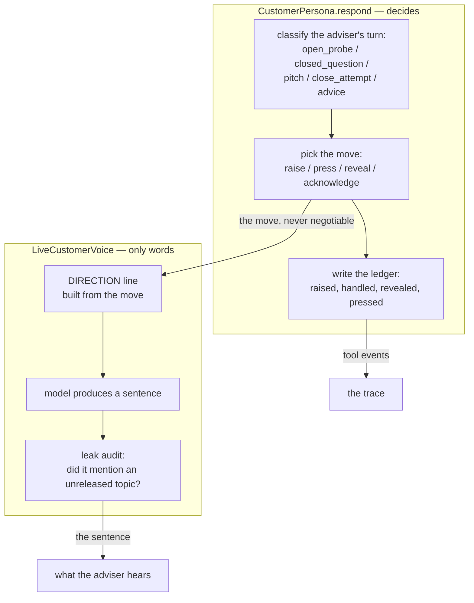
```mermaid
graph TD
    subgraph MACHINE ["CustomerPersona.respond — decides"]
        M1["classify the adviser's turn:<br/>open_probe / closed_question /<br/>pitch / close_attempt / advice"]
        M2["pick the move:<br/>raise / press / reveal / acknowledge"]
        M3["write the ledger:<br/>raised, handled, revealed, pressed"]
        M1 --> M2 --> M3
    end
    subgraph MODEL ["LiveCustomerVoice — only words"]
        V1["DIRECTION line<br/>built from the move"]
        V2["model produces a sentence"]
        V3["leak audit:<br/>did it mention an unreleased topic?"]
        V1 --> V2 --> V3
    end
    M2 -->|"the move, never negotiable"| V1
    V3 -->|"the sentence"| OUT["what the adviser hears"]
    M3 -->|"tool events"| TR["the trace"]
```

*What to notice: the ledger arrow to the trace leaves the **machine**, not the model.
So the objection and concern ledgers every contract reads are produced identically
whether the customer is a model or a script — which is what makes a live customer
usable as a measuring instrument at all.*

`_direction(move)` is four lines of code and you can read the whole customer's
behaviour off it (`roleplay/live.py:1164`):

| move | the DIRECTION line the model receives |
| --- | --- |
| pressed | "You already raised this and the adviser talked past it. Put it back on the table, less patiently this time: …" |
| raised | "Raise this objection now, in your own words: …" |
| revealed | "The adviser has asked you an open question. Answer it by telling them this, and only this: …" |
| otherwise | "Acknowledge what the adviser just said and add nothing new. Do not raise a worry, a plan or a sum of money." |

You can see all four working in the committed transcript. Turn 1's direction was
*raise `fees`*, whose scripted wording is "Your charges will eat the whole return.
My brother-in-law says these products are a racket and the fees are where the money
goes." The model said:

> "Look, before we go any further, I want to know exactly what your fees are,
> because my brother-in-law says all these products are just a racket and the
> charges eat up everything you make."

Same move, different words. And turns 3, 4, 5, 7 and 8 are all the *acknowledge*
direction, which is why the customer's lines there are "Alright, I hear you.",
"Okay, I get that.", "Alright, understood.", "That makes sense, go on.", "Yes,
that's fine." Two to five words each. That is the direction being obeyed, not the
model being lazy — and it is a fact about the instrument worth holding on to when
you look at the talk-time split in §6.10.

#### Fixed versus chosen

| Fixed by data or code | Chosen by a model at run time |
| --- | --- |
| which persona, which competence, which jurisdiction | every sentence either side speaks |
| the customer's concerns, objections and their scripted wording | how that wording is paraphrased |
| **which move the customer makes on each turn** | — |
| the approved disclosure sentences | whether the adviser actually says them |
| the product's facts (0.68 %, 60/40, fell 4 % last year) | how the adviser presents them |
| the turn budget (9) and character cap (3,400) | how many turns the call actually took (8) |
| both voices, both engines, the sample rate | — |
| the temperature (0.0) and both model routes | — |

#### Two budgets, and one of them ended the call

`DEFAULT_MAX_TURNS = 9` and `DEFAULT_CHARACTER_CAP = 3_400`, with
`DEFAULT_TURN_HEADROOM = 480`. The soft stop is one line
(`roleplay/spoken.py:472`):

```python
return self.characters_submitted + self.turn_headroom > self.character_cap
```

Re-derived by walking the manifest's own `characters` field:

| after order | speaker | submitted | `submitted + 480 > 3400`? |
| --- | --- | --- | --- |
| 12 | trainee | 2,593 | no |
| 13 | customer | 2,617 | no |
| **14** | **trainee** | **2,997** | **yes — stop** |
| 15 | customer | 3,014 | yes |

So the call ended at **8 adviser turns of a 9-turn budget**, with
`stop_reason="character_budget"`, having spent **3,014 of 3,400** characters. The two
endings are kept in separate buckets on purpose — a call that ran out of turns and a
call that ran out of money are different results, and both are different again from
an adviser who closed.

**This matters for the grade, and §6.5 comes back to it.** The call stopped before the
adviser ever presented the product. `past_performance` is the disclosure that
becomes due when you present a product. So a cost setting, chosen to keep a
recording affordable, is entangled with the compliance outcome the live scorer
failed the session on.

#### The gate in front of all of this

Recording a *new* call is opt-in and refuses with everything missing named at once,
not just the first thing noticed. Run verbatim:

```
$ .venv/bin/python -m roleplay.spoken --record
NotLiveError: a live spoken call needs everything below, and this environment is missing:
  - LAB_LIVE_SPOKEN=1 (the spoken-call opt-in)
  - ELEVENLABS_API_KEY (synthesis)
  - DEEPGRAM_API_KEY (recognition)
  - a model-provider key (one of AZURE_OPENAI_API_KEY, AZURE_API_KEY, OPENAI_API_KEY, LAB_KEY) for the two speakers and the scorer
  - LAB_TRAINEE_MODEL (the adviser's litellm route)
  - LAB_CUSTOMER_MODEL (the customer's litellm route)
  - LAB_SCORER_MODEL (the live scorer's litellm route)
Set what is missing, or stay offline: replay_spoken_call() replays the committed call with zero keys.
```

Seven things, listed together, with the offline alternative named in the last line.
Compare that with a refusal that says only "ELEVENLABS_API_KEY not set" and makes
you discover the other six one run at a time.

---

### 6.3 A turn happens

#### In plain terms

A turn is not "the model said something". A turn is: the model wrote a sentence; a
synthesiser read the sentence aloud and produced audio; the audio was fed to a
recogniser; and **what the recogniser returned is what the other side received.**

Three different strings exist for every turn, and confusing any two of them is how a
voice evaluation becomes fiction:

- what the model **wrote**,
- what the synthesiser **said** (which is not the same — it turns `0.68 per cent`
  into "zero point six eight per cent"),
- what the recogniser **heard**.

Grading reads only the third one.

#### In detail — the round trip

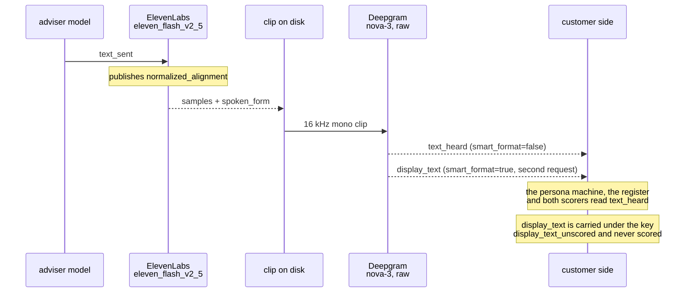
```mermaid
sequenceDiagram
    participant M as adviser model
    participant TTS as ElevenLabs<br/>eleven_flash_v2_5
    participant WAV as clip on disk
    participant STT as Deepgram<br/>nova-3, raw
    participant C as customer side

    M->>TTS: text_sent
    Note over TTS: publishes normalized_alignment
    TTS-->>WAV: samples + spoken_form
    WAV->>STT: 16 kHz mono clip
    STT-->>C: text_heard  (smart_format=false)
    STT-->>C: display_text (smart_format=true, second request)
    Note over C: the persona machine, the register<br/>and both scorers read text_heard
    Note over C: display_text is carried under the key<br/>display_text_unscored and never scored
```

*What to notice: two requests go to the recogniser over the same clip. That is why
the spend line says 352.1 s metered over 176.1 s of audio — metered seconds are
double the audio length, not double the audio.*

#### The three strings, on a real turn

Adviser turn 2, straight out of `manifest.json`:

| string | value |
| --- | --- |
| `text_sent` | `Thank you for raising that concern—fees are an important consideration. The product I can offer has an annual management charge of 0.68 per cent, and there are no exit penalties. …` |
| `spoken_form` | `Thank you for raising that concern--fees are an important consideration. The product I can offer has an annual management charge of zero point six eight per cent, and there are no exit penalties. …` |
| `text_heard` | `thank you for raising that concern fees are an important consideration the product i can offer has an annual management charge of zero point six eight percent and there are no exit penalties …` |
| `display_text` | `Thank you for raising that concern. Fees are an important consideration. The product I can offer has an annual management charge of 0.68%, and there are no exit penalties. …` |

Four renderings of one sentence. `0.68 per cent` → `zero point six eight per cent` →
`zero point six eight percent` → `0.68%`. The number survived the round trip
perfectly and **three of the four strings spell it differently.**

That is the entire argument for `AudioTurnNote.wer_reference`:

```python
@property
def wer_reference(self) -> str:
    """The string `text_heard` must be scored against. Spoken form when published."""
    return self.spoken_form or self.text_sent
```

Score `text_heard` against `text_sent` and the recogniser is charged with an error it
did not make — the synthesiser is the thing that changed `0.68` into words. Score it
against `spoken_form` and you are asking the only fair question: *of the words that
were actually spoken aloud, how many came back?* Every turn records which reference
it used, in `reference_source`; on this call all sixteen say `spoken-form`.

`display_text` is the vendor's prettified transcript. It rides in the trace under the
key **`display_text_unscored`** — a field name that states its own prohibition. This
is Rule 12 made structural rather than documentary: you cannot accidentally score it,
because scoring a field called `display_text_unscored` reads as a bug to anyone
reviewing the diff.

#### A real turn where `text_sent` and `text_heard` differ

Customer turn 6. The full trace event, verbatim from `trace.jsonl`:

```json
{
 "actor": "agent",
 "engine": "stt:deepgram/nova-3/en/raw",
 "kind": "agent_utterance",
 "payload": {
  "agent": "CustomerPersona",
  "confidence": 0.99902344,
  "display_text_unscored": "Understand what you're saying.",
  "text": "understand what you're saying",
  "text_sent": "I understand what you're saying.",
  "turn": 6
 },
 "ts": 3.767000000000001
}
```

The model wrote "I understand what you're saying." The recogniser returned
"understand what you're saying". **The word `I` was lost**, at a reported confidence
of 0.99902344.

This is the only genuine word loss in the whole call. Everything else that scores as
a recognition error is an orthographic difference. Here is the complete list of the
14 normalised errors, computed by diffing normalised token streams across all
sixteen turns:

| turn | speaker | reference tokens | heard tokens | errors |
| --- | --- | --- | --- | --- |
| 1 | trainee | `mr` | `mister` | 1 |
| 1 | trainee | `timeframe` | `time frame` | 2 |
| 2 | trainee | `per cent` | `percent` | 2 |
| 3 | trainee | `mr` | `mister` | 1 |
| 4 | trainee | `mr` | `mister` | 1 |
| 4 | trainee | `timeframe` | `time frame` | 2 |
| **6** | **customer** | **`i`** | **— deleted —** | **1** |
| 7 | trainee | `summarise` | `summarize` | 1 |
| 7 | trainee | `timeframe` | `time frame` | 2 |
| 8 | trainee | `summarise` | `summarize` | 1 |
| | | | **total** | **14** |

Thirteen of the fourteen are an abbreviation expanded, a compound word split, or
British spelling rendered American. **One is a word the recogniser actually lost.**

And that one landed on a filler acknowledgement, where it cost nothing. That is luck,
not robustness. The same deletion on a turn containing the word "not" would have
inverted a sentence, and nothing in this pipeline would have flagged it — which is
precisely the argument for field-level assertions on digits, postcodes and names
rather than a WER threshold.

#### Confidence did not predict error

Sixteen turns. Seven carried at least one recognition delta. The recogniser's own
confidence:

| | count | confidence |
| --- | --- | --- |
| turns with a delta | 7 | **6 of 7 reported confidence 1.000000**; the seventh reported 0.999023 |
| turns with no delta | 9 | includes the **lowest confidence of the call, 0.895020** |

The single lowest-confidence turn on the call — customer turn 7, "That makes sense,
go on." at 0.895 — was transcribed with **zero** errors, raw or normalised. Six of the
seven turns the channel actually damaged reported perfect confidence.

n = 16 turns is far too small to be a correlation claim, and this document does not
make one. It is enough, though, to justify the design choice the repository already
made: confidence is recorded as provenance, and nothing in the grading path is gated
on it.

#### Raw versus normalised, with both denominators

Over all sixteen turns:

| | errors | reference words | rate |
| --- | --- | --- | --- |
| raw | 137 | 535 | 0.2561 |
| normalised | 14 | 561 | 0.0250 |

A factor of **10.26**. Report the raw figure as "the recognition error rate" and you
have announced that a quarter of the call was misheard, on a call where one word was
actually lost.

The two denominators are not the same — 535 against 561 — because normalisation
expands contractions (`you're` → `you are`), which adds tokens. That is exactly why
the repository refuses to publish "the WER": there is no single denominator, so
there is no single number. Both are reported, each with its own.

---

### 6.4 The trace fills up

#### In plain terms

While the conversation happens, one file is being written: an ordered list of
everything that occurred, each entry stamped with when, who, what kind of thing it
was, and the details. Nothing else is kept. Every number later in this document is
computed from that list.

#### In detail — the census

`trace.jsonl`, 80 lines, 40,075 bytes. The kinds, counted:

| kind | count | actor | what it is |
| --- | --- | --- | --- |
| `session_start` | 1 | system | who is in the room and under what rules |
| `audio_emitted` | 16 | caller / agent | a clip existed: digest, byte count, duration |
| `transcript_in` | 8 | caller | what the harness heard from the adviser |
| `caller_utterance` | 8 | caller | the adviser's turn, as heard |
| `agent_audio_first_byte` | 8 | agent | the customer's reply exists |
| `agent_utterance` | 8 | agent | the customer's turn, as heard |
| `transcript_out` | 8 | agent | what was sent to be spoken |
| `agent_audio_complete` | 8 | agent | the reply finished playing |
| `tool_call` | 7 | agent | a ledger action |
| `tool_result` | 7 | system | its outcome |
| `session_end` | 1 | system | how it ended, and instrument health |

Arithmetic that closes: 8 adviser turns × 3 events + 8 customer turns × 5 events +
14 tool events + 2 session events = **80**.

#### The one thing that surprises everybody

**The adviser is the `caller`. The customer is the `agent`.**

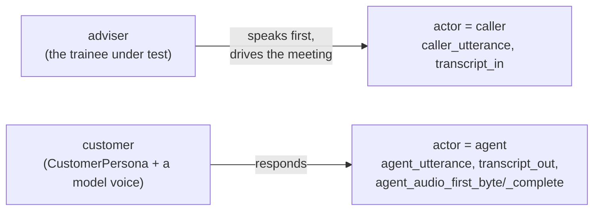
```mermaid
graph LR
    A["adviser<br/>(the trainee under test)"] -->|"speaks first,<br/>drives the meeting"| B["actor = caller<br/>caller_utterance, transcript_in"]
    C["customer<br/>(CustomerPersona + a model voice)"] -->|"responds"| D["actor = agent<br/>agent_utterance, transcript_out,<br/>agent_audio_first_byte/_complete"]
```

*What to notice: `lab`'s vocabulary is positional, not evaluative. `caller` means
"the side that speaks first and drives"; `agent` means "the side that responds". In
this domain the human being graded is the one who drives, so the trainee lands in the
`caller` slot. The word `agent` in a roleplay trace does **not** mean "the thing
under test".*

That is a genuine trap when reading a roleplay trace for the first time, and it is
the price of reusing one event vocabulary across two domains rather than forking it.
The payoff is the whole retargeting claim: `lab/` has never heard of `roleplay/`, and
every check in `lab/checks/` reads this trace unchanged.

#### The `engine` field is attribution, not decoration

Look at two adjacent events from the same customer turn:

| kind | `engine` | why |
| --- | --- | --- |
| `agent_utterance` | `stt:deepgram/nova-3/en/raw` | its `text` is what was **heard**, so the recogniser produced it |
| `transcript_out` | `tts:elevenlabs/eleven_flash_v2_5/Xb7hH8MSUJpSbSDYk0k2` | its `text` is what was **sent to be spoken**, so the synthesiser owns it |

Each string is attributed to the component that produced it. And the TTS engine
string embeds the **voice id**, not just the model, because the call builds one
engine per voice — `AudioTurnNote`'s comment says a single engine driven with a
per-call voice argument *"would stamp every turn with its constructor's voice and
silently mislabel one side."* The adviser and the customer are distinguishable in the
trace by engine string alone.

#### The tool events are the ledger, and they are the customer's

Seven tool calls, all of them `actor: agent` — because the customer's state machine
is what performs them. The complete ledger, as the live scorer sees it:

```
load_customer_profile({"jurisdiction": "eu-retail", "language": "en", "profile": "aggressive_challenger"}) -> ok
raise_objection({"key": "fees", "topic": "charges", "turn": 1}) -> ok
record_disclosure({"code": "fees_and_charges", "jurisdiction": "eu-retail", "language": "en", "phrasing": "annual management charge", "turn": 2}) -> ok
raise_objection({"key": "whose_interest", "topic": "whose interest you serve", "turn": 2}) -> ok
resolve_objection({"key": "fees", "topic": "charges", "turn": 2}) -> ok
resolve_objection({"key": "whose_interest", "topic": "whose interest you serve", "turn": 3}) -> ok
record_disclosure({"code": "capital_at_risk", "jurisdiction": "eu-retail", "language": "en", "phrasing": "you could get back less than you put in", "turn": 6}) -> ok
```

Two objections raised, two resolved. Two disclosures recorded. That is the entire
factual record of the call, and it is seven lines.

Note the ordering discipline in the loop (`roleplay/runtime.py`): `record_disclosure`
is emitted **before** the persona speaks, with the comment *"a requirement is
discharged by the trainee's words, not by anything the customer says back, and
recording it first keeps that causality readable in the event order."* Ordering in
this repository is a claim about causality, and it is decided on position, not on
timestamps — which brings us to the timestamps.

#### The timestamps are a model, and you can check the model by hand

The trace runs from `ts=0.000` to `ts=4.438`. The audio is 181.3 seconds long. Those
disagree by a factor of forty, and that is not a bug.

`roleplay/runtime.py` defaults to `FakeClock`, and time is *spent* by an explicit
latency model (`roleplay/runtime.py:140`):

```python
think_s: float = 0.28
per_tool_s: float = 0.14
per_char_s: float = 0.003
scoring_s: float = 1.60

def turn_seconds(self, *, text: str, tool_calls: int) -> float:
    return self.think_s + self.per_tool_s * max(0, tool_calls) + self.per_char_s * len(text or "")
```

Turn 1 advanced the clock from `0.000` to `1.106`. The customer's heard reply is 182
characters and the turn made two tool calls:

```
0.28 + 0.14 × 2 + 0.003 × 182 = 1.106
```

Exactly. Every timestamp in this trace is reproducible arithmetic over committed
data. That is what makes the fixture byte-stable, and it is why the run report
refuses to quote a latency from it: **these are modelled durations, labelled
modelled, and the label is not optional.** Three clocks exist in the manifest and
the report treats them differently:

| clock | on this artefact | what the report does |
| --- | --- | --- |
| `synthesis_s` | `None` on all 16 turns — every clip was a cache hit | reports `n=0` and explains why |
| `transcribe_s` | 16 real wall clocks: min 1.243 s, mean 1.944 s, max 2.660 s | quotes it, and says it excludes the display request |
| `model_turn_s` | times a dictionary lookup; largest value 0.323 ms | **refuses to print it as an LLM latency** |

One measurement, one absence, one refusal. The refusal is the interesting one — a
lesser harness would round 0.000323 s to `0.00s` and let a reader conclude the model
is instantaneous.

#### What is *not* in this trace

There is no scoring stage. The text tier's loop runs two stages in one session — talk,
then grade — and emits `agent_handoff` → `score_session` → the scorer's feedback as an
`agent_utterance` → `session_end(reason="scored")`. This trace ends
`session_end(reason="roleplay_ended", stop_reason="character_budget", turns=8,
customer_topic_leaks=0)` and contains none of that.

That is deliberate and it has a cost, which §6.5 measures.

---

### 6.5 Grading runs

#### In plain terms

Three things read the trace, in increasing order of how much you have to trust them:

1. **Contracts** — deterministic rules. No AI. Same answer forever.
2. **A rubric scorer** — the product's own grading logic, deterministic, and with
   three bugs deliberately planted in it.
3. **A model asked to grade** — a judge, which is only evidence if it has been
   calibrated.

On this particular call, the first layer contributes almost nothing, and that is
worth being honest about rather than implying a contract caught something.

#### 6.5.1 The contract layer, honestly

Contracts are run for you by `lab.checks.engine.run_contracts`. Pointed at this
trace, here is what four of them actually say — executed, not guessed:

```
score-claims-backed          passed=False applicable=True
     no score_session call in the trace: the session was never graded, so every
     claim on the score card is missing rather than wrong
feedback-grounded            passed=True  applicable=False
     0/0 feedback claims checked: this trace has no scorer feedback
no-re-ask                    passed=True  applicable=False
     0/0 fields tracked: contract declares none
no-progress-loop             passed=True  applicable=False
     0/0 repeat windows examined: no agent question recurred 2+ times across
     1 distinct question(s)
```

Three of four are **vacuous** — `applicable=False`, Rule 4 working exactly as
designed. They had nothing to look at, and they say so instead of banking a pass.

The fourth is more interesting. `ScoreClaimContract` audits a grader: it checks that
the claims on a score card agree with the session's own ledgers. It fails here, and
its failure message is correct and is *not* a product finding — it is reporting that
this trace has no grading stage in it. `require_score=True` is the right default (the
docstring: *"a session that was never graded is not a session with nothing to check;
it is a missing grade"*), but on the spoken tier it fires on every call by
construction.

For contrast, the same two contracts against a two-stage text trace of the same
persona, run just now:

```
score-claims-backed      passed=True applicable=True :: 2/2 live score claims backed by the session ledger
feedback-grounded        passed=True applicable=True :: 2/2 feedback claims grounded in the session
```

**So the channel-effect experiment costs you the grader-auditing contracts.** To grade
one trace with *two different scorers* — which is the entire point of this artefact —
the scoring stage has to come out of the trace. And the two contracts whose job is to
audit a grader read a `score_session` event that no longer exists. Nobody in the
repository writes this down, and it is a real, defensible trade rather than an
oversight: you can have the channel-effect comparison or the in-trace score audit,
and this call chose the comparison.

#### 6.5.2 The deterministic scorer, criterion by criterion

`roleplay.scorer.RubricScorer.score_trace(trace)` → `session_view(trace)` → five
criteria, 4 points each, threshold 14. `session_view` is a **pure function of trace
events**, which is why it grades a spoken trace with no changes at all.

Result on this call: **FAIL 12/20**.

| criterion | score | the actual mechanism | verdict on the mechanism |
| --- | --- | --- | --- |
| `discovery` | **0/4** | counts `open_probe` turns; band `{0:0, 1:2, 2:3, 3+:4}` | correct code, catastrophic input — see §6.6 |
| `objection_handling` | **4/4** | distinct resolved keys ÷ distinct raised keys, from the ledger | **correct, and the model file to copy** |
| `mandatory_disclosure` | **4/4** | counts hits from a six-word keyword list | **DEFECT-3**, seeded |
| `no_unlicensed_advice` | **4/4** | a two-entry regex blocklist | **DEFECT-3**, seeded |
| `closing` | **0/4** | any `close_attempt` turn, +1 if a summary preceded | correct; the call was cut before a close |

Two of these are worth pulling apart because they sit four lines from each other in
the same file and do opposite things.

**`_objection_handling` reads the ledger.** It takes the *distinct* objection keys
raised and the distinct keys resolved, and divides. Distinct, not rows, and the
docstring explains why: an assertive customer re-raises what was ignored, so counting
rows would make one unhandled objection look like two and *"the score would fall the
more insistent the customer became rather than the less the trainee said."* On this
call: raised `{fees, whose_interest}`, resolved `{fees, whose_interest}` → 4/4.

**`_mandatory_disclosure` ignores the ledger completely.**

```python
haystack = " ".join(view.trainee_turns).lower()
hits = sum(1 for word in _COMPLIANCE_KEYWORDS if word in haystack)
return {0: 0, 1: 2, 2: 3}.get(hits, 4)
```

with `_COMPLIANCE_KEYWORDS = ("risk", "capital", "past performance", "value can go",
"charge", "fee")`. Executed against this trace, the hits are exactly
`['risk', 'charge', 'fee']` — three — so the band returns the top score of 4/4.

Meanwhile `view.disclosures`, sitting right there and never read, holds two records:
`fees_and_charges` and `capital_at_risk`. And `eu-retail` requires **three**:
`capital_at_risk`, `past_performance`, `fees_and_charges`. The adviser never said the
past-performance sentence it was handed.

So the deterministic scorer awards **full marks on a criterion the session
demonstrably failed**, and then writes it into the card as a factual claim,
`mandatory_disclosure_given: true`. That is DEFECT-3, seeded and documented in
`roleplay/SEEDED_DEFECTS.md`, and this call is a clean demonstration of it.

The feedback string it produces is DEFECT-2 in the same breath — assembled from
templates keyed on the *score*, not on the transcript:

> "You went into the product before you understood the customer. Open the next one
> with a question, not a feature. You took the objection head on rather than
> deflecting it. **The mandatory risk disclosure was given and is recorded.** Nothing
> you said crossed into personal advice. You never asked for the business."

"Given and is recorded" is false against the register. It is a sentence a trainee
would read and believe.

#### 6.5.3 The judge

`roleplay.livescorer.LiveRubricScorer` renders a prompt, sends it to a model, and
parses JSON back. Rubric v2 — the version the scorer study calibrated last.

The rendered prompt for this call is **8,665 characters**: the rubric text, the full
transcript (adviser turns, customer turns and tool calls interleaved), and the tool
ledger. Its opening lines, from the real render:

```
caller: good morning mister novak thank you for coming in today before we discuss any
investment options i'd like to understand your goals your time frame and how you feel
about risk could you tell me a bit about what you're hoping to achieve with your
investments
[tool call] load_customer_profile({"jurisdiction": "eu-retail", "language": "en", "profile": "aggressive_challenger"})
[tool result] load_customer_profile -> ok
[tool call] raise_objection({"key": "fees", "topic": "charges", "turn": 1})
[tool result] raise_objection -> ok
agent (CustomerPersona): look before we go any further i want to know exactly what your
fees are because my brother-in-law says all these products are just a racket and the
charges eat up everything you make
```

The model's raw answer is committed in `scorer_recording.jsonl`, and this is the
whole of it:

```json
{
  "criteria": {
    "discovery": 4, "objection_handling": 4, "mandatory_disclosure": 0,
    "no_unlicensed_advice": 4, "closing": 4
  },
  "verdict": "fail",
  "critique": "The session demonstrates strong discovery, thorough objection handling,
    and proper closing, with no evidence of unlicensed advice. However, it fails
    outright because the mandatory disclosure for 'past_performance' required in the
    'eu-retail' jurisdiction is missing from the tool ledger. All other required
    disclosures are present, but the absence of this one means the session cannot
    pass certification.",
  "evidence": "caller: one more important area to cover is how you feel about risk
    investments can go up and down in value and there's always a chance you could get
    back less than you put in how comfortable are you with the possibility of losing
    some of your investment even temporarily",
  "required_codes": ["capital_at_risk", "past_performance", "fees_and_charges"],
  "recorded_codes": ["fees_and_charges", "capital_at_risk"]
}
```

**FAIL 16/20.** It read the ledger, named the missing code, and quoted the turn it
based its reasoning on.

Two design points sit inside this.

**The recording stores the raw answer, not a parsed card.** `record_scores`' docstring
is explicit: *"a replay layer that stored parsed cards would leave the parser untested
exactly where it is most likely to break — on the malformed answer that made someone
write the ERRORED path in the first place."* So replaying this call exercises
`parse_live_card` every time, on real model output.

**The recording is bound to the rendered prompt, not to the rubric version.** The
`prompt_sha256` in `scorer_recording.jsonl` is a digest of all 8,665 characters —
rubric *and* transcript *and* ledger. Verified:

```
recording prompt_sha256: a9be8dd3e714fd77704dfe1e891e07d6babc320c5347a2381d740dce809ba432
digest of current render: a9be8dd3e714fd77704dfe1e891e07d6babc320c5347a2381d740dce809ba432
MATCH: True
```

Change one word of the heard transcript and the replay refuses. Reproduced live, by
substituting `mister` → `mr` in a single utterance of a scratch copy of the trace:

```
StaleRecordingError: item 'spoken-eu-challenger-exemplary' was recorded against prompt
a9be8dd3e714 but the prompt now renders as 9f894c074d8d. The recording is stale:
re-record, or pass strict_prompt_hash=False if you are deliberately inspecting old
verdicts.
```

`replay_completion`'s docstring calls this *"the feature and not a precaution: it turns
'I edited the rubric and the numbers did not move' from a mystery into an
exception."* On this artefact it is stronger than that — it also catches "I edited the
*trace* and the grade did not move".

#### 6.5.4 Two scorers, one trace, opposite reasons

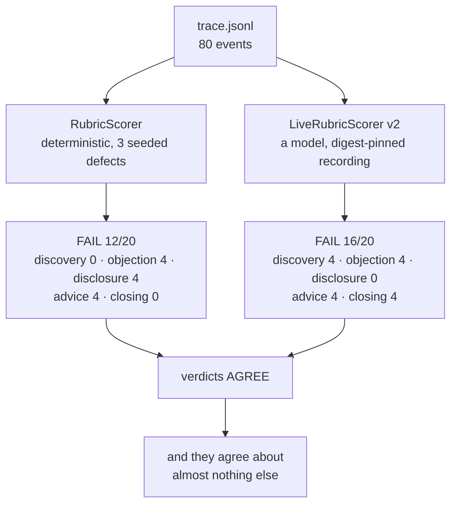
```mermaid
graph TD
    T["trace.jsonl<br/>80 events"]
    T --> D["RubricScorer<br/>deterministic, 3 seeded defects"]
    T --> L["LiveRubricScorer v2<br/>a model, digest-pinned recording"]
    D --> DC["FAIL 12/20<br/>discovery 0 · objection 4 · disclosure 4<br/>advice 4 · closing 0"]
    L --> LC["FAIL 16/20<br/>discovery 4 · objection 4 · disclosure 0<br/>advice 4 · closing 4"]
    DC --> V["verdicts AGREE"]
    LC --> V
    V --> W["and they agree about<br/>almost nothing else"]
```

*What to notice: both boxes say FAIL, and three of the five criteria are as far apart
as the scale allows — 0 against 4 — in **both** directions.*

| criterion | deterministic | live | who is right, and why |
| --- | --- | --- | --- |
| discovery | 0 | 4 | **live**. The regex needs a `?`; the model reads unpunctuated text and still sees the questions. |
| objection_handling | 4 | 4 | both, from the ledger |
| mandatory_disclosure | 4 | 0 | **live**. 2 of 3 required codes recorded; the deterministic path counted keywords. DEFECT-3. |
| no_unlicensed_advice | 4 | 4 | agreement, though the deterministic path reached it with a two-entry blocklist |
| closing | 0 | 4 | arguable. `_CLOSE_STEMS` has no pattern for "does that sound good as our next step" — the model read agreeing next steps as a close. |

"The two scorers agreed" is true, and it is true only at the resolution of the verdict.
On this call that agreement is a coincidence of errors pointing opposite ways. It is
pinned as a test — `test_agreeing_verdicts_hide_criterion_level_disagreement` asserts
the disagreement set is exactly `{discovery, mandatory_disclosure, closing}` and that
each gap is exactly 4 — *"because 'the two scorers agreed' is the sentence a reader
will take away."*

#### 6.5.5 The channel-effect measurement

The last thing that runs is not a scorer. It is an experiment.

`channel_effect(notes, …)` grades the call **twice**: once as heard, and once with
every `text_heard` replaced by its `text_sent` — the call the models meant to have.
Then it diffs. `ChannelEffect.changed_outcome` compares four things: the total, the
verdict, the five criteria individually, and the disclosure ledger.

It is the only reason the finding in §6.6 was ever seen.

---

### 6.6 The finding

#### In plain terms

The scorer decides "was that a question?" by checking whether the sentence ends in a
question mark. A speech transcript that is being scored for accuracy has **no
punctuation at all** — on purpose, because the tidied-up version turns "seven thirty"
into "07:30" and manufactures word errors out of formatting.

So on a spoken call, no turn can ever be a question. An adviser who demonstrably
asked questions is graded as having asked none.

Two decisions. Each one correct on its own. Together, a silent scoring failure.

#### The causal chain

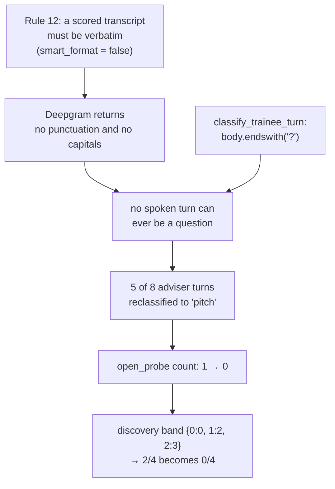
```mermaid
graph TD
    A["Rule 12: a scored transcript<br/>must be verbatim<br/>(smart_format = false)"]
    B["Deepgram returns<br/>no punctuation and no capitals"]
    C["classify_trainee_turn:<br/>body.endswith('?')"]
    D["no spoken turn can<br/>ever be a question"]
    E["5 of 8 adviser turns<br/>reclassified to 'pitch'"]
    F["open_probe count: 1 → 0"]
    G["discovery band {0:0, 1:2, 2:3}<br/>→ 2/4 becomes 0/4"]
    A --> B --> D
    C --> D --> E --> F --> G
```

*What to notice: neither A nor C is wrong. A is a rule this repository enforces for
good measured reasons. C is a reasonable classifier for text. The defect lives in the
**composition**, which is the kind of defect no unit test of either half can find.*

#### Reproduced, turn by turn

Running `roleplay.persona.classify_trainee_turn` over both strings of all eight
adviser turns:

| turn | classified from `text_sent` | classified from `text_heard` | |
| --- | --- | --- | --- |
| 1 | `closed_question` | `pitch` | changed |
| 2 | `closed_question` | `pitch` | changed |
| 3 | `pitch` | `pitch` | |
| 4 | `pitch` | `pitch` | |
| 5 | `pitch` | `pitch` | |
| 6 | `closed_question` | `pitch` | changed |
| 7 | `open_probe` | `pitch` | changed |
| 8 | `closed_question` | `pitch` | changed |

Five of eight reclassified, and every one of them collapsed into the same bucket.
Not one heard turn contains a `?`. `discovery` counts `open_probe` only, so 1 → 0,
and the band takes 2/4 → 0/4.

#### And it nearly hid

Here is the trap. The deterministic card as heard and as sent:

| criterion | as spoken | as heard |
| --- | --- | --- |
| discovery | 2 | **0** |
| objection_handling | 2 | **4** |
| mandatory_disclosure | 4 | 4 |
| no_unlicensed_advice | 4 | 4 |
| closing | 0 | 0 |
| **total** | **12/20** | **12/20** |
| verdict | fail | fail |
| disclosures | `capital_at_risk`, `fees_and_charges` | `capital_at_risk`, `fees_and_charges` |

Two criteria moved by two points each, in opposite directions, and cancelled.

**A check on the total would have reported no effect. A check on the verdict would have
reported no effect. A check on the disclosure ledger would have reported no effect.**
Three reasonable checks, all silent, on a call the channel demonstrably changed.

`ChannelEffect.describe` says so out loud rather than leaving it to be noticed:

```
CHANNEL EFFECT ON GRADING
------------------------------------------------------------------------------
  THE CHANNEL CHANGED A GRADING OUTCOME:
    note: both gradings total 12/20, so a check on the total alone would have found
          nothing. The criteria below moved in opposite directions and cancelled out.
    discovery: 2 as spoken -> 0 as heard
    objection_handling: 2 as spoken -> 4 as heard
```

The code comment behind that note is the honest bit: *"a reader who sees the totals
agree will otherwise stop reading."*

#### Why objection handling went *up*

This is the half the existing documentation states in one clause, and the mechanism is
worth having in full, because "the persona treats a pitch as drawing the next
objection" is true but not sufficient.

Running `CustomerPersona.respond` over both strings, turn by turn:

```
== AS HEARD (everything is a pitch)
  t1 pitch    raised=[fees]              handled=[]
  t2 pitch    raised=[whose_interest]    handled=[fees]
  t3 pitch    raised=[]                  handled=[whose_interest]
  t4..t8      nothing further

== AS SENT (punctuation intact)
  t1 closed_question   raised=[]                handled=[]
  t2 closed_question   raised=[]                handled=[]
  t3 pitch             raised=[fees]            handled=[]
  t4 pitch             raised=[whose_interest]  handled=[]
  t5 pitch             raised=[fees]            handled=[]   pressed=[fees]
  t6 closed_question   raised=[]                handled=[]
  t7 open_probe        raised=[]                handled=[whose_interest]
  t8 closed_question   raised=[]                handled=[]
```

The rule that makes this happen is `unhandled_objections()`:

```python
return tuple(o for o in self.profile.objections
             if o.key in self.raised and o.key not in self.handled)
```

An objection can only be *handled* if it has already been *raised*. So:

- **As heard**, turn 1 is a pitch, which raises `fees` immediately. Turn 2 contains
  "annual management charge" — a `handled_by` pattern — and `fees` is live, so it is
  discharged on the spot. Same for `whose_interest`, raised at turn 2 and answered by
  "commission" at turn 3. Two raised, two resolved: **4/4**.
- **As sent**, turns 1 and 2 are questions, so nothing is raised. The adviser's fee
  answer at turn 2 lands *before the objection exists* and is thrown away. `fees` is
  finally raised at turn 3 — a turn after it was answered — is pressed again at turn
  5, and is never discharged. Only `whose_interest` is resolved, at turn 7 on
  "suitability assessment". One of two: **round(4 × 1/2) = 2/4**.

So the rise is not the channel making the adviser better. It is the classifier's
collapse *aligning* the adviser's answers with the objections they answer. Both
numbers are artefacts. Which is exactly the point: neither 2/4 nor 4/4 is the truth
about this adviser's objection handling, and the harness's job was to notice that the
number moved, which it did.

#### The one component that was immune

The disclosure register came through untouched — identical ledgers both ways. That is
not luck. `roleplay.register.normalise` casefolds, strips accents, replaces
punctuation with spaces and collapses whitespace *before* matching, so the two
phrasings that fired — "annual management charge" and "you could get back less than
you put in" — are punctuation-blind by construction.

**Two components, in the same package, doing the same kind of job. One was written
punctuation-blind and survived the channel. One was written `endswith("?")` and did
not.** If you want one sentence about what this call is evidence for, that is it.

#### Why the classifier is weaker than it looks even in text

Worth knowing before defending it. `body.endswith("?")` inspects the very last
character of the whole turn, so a question followed by a supporting sentence is a
`pitch` even with perfect punctuation. Adviser turns 4 and 5 both contain a genuine
open question and both classify as `pitch` as sent:

> "…could you tell me what you're hoping to achieve with your money and whether you
> have a specific timeframe in mind? **This will help us focus on options that fit your
> goals.**"

And `_OPEN_STEMS` is anchored: `^what`, `^how`, `^why` match only at the start of the
whole turn, and the mid-sentence alternatives cover a fixed list (`\bhow (?:would|do|
does|much|long|are)\b`). Turn 6 as sent asks "How comfortable are you with the
possibility of losing some of your investment?" and classifies as `closed_question`,
not `open_probe`, because `how comfortable` is not in the list.

So the "as spoken" figure of 2/4 is *itself* an undercount. The adviser asked at
least four open questions in eight turns and the detector found one. The channel took
that one to zero, but the detector was already reporting 1 of ~4. Rule 15 — a literal
in a check is a check that works once — applies to the sent path too, and this
document is the place to say so plainly rather than letting "2/4 as spoken" read as
ground truth.

#### It is pinned as a mechanism, not as a number

`tests/test_roleplay_spoken.py::test_the_channel_erased_the_discovery_criterion`
asserts: no heard turn contains `?`; exactly five sent turns end in one; exactly five
classifications changed; every one collapsed to `pitch`; and the sent/heard discovery
pair is 2/0.

So fixing *either* half — a punctuation-independent classifier, or a scored transcript
that carries sentence boundaries — makes the test fail and forces a re-read. That is
the right shape for a finding you do not want to quietly stop being true.

---

### 6.7 The part of the finding nobody wrote down

This section is original to this document. It was found by re-running the persona
machine while writing §6.6, and it is **not fixed** — it is reported here.

#### `ChannelEffect` compares four things, and the concern ledger is not one of them

`ChannelEffect`'s fields, in full:

```python
heard_total: int          sent_total: int
heard_verdict: str        sent_verdict: str
heard_criteria: dict      sent_criteria: dict
heard_disclosures: list   sent_disclosures: list
```

Total, verdict, the five criteria, the disclosure codes. Nothing else.

But look at what the persona ledger did on this call:

| ledger | as heard | as sent |
| --- | --- | --- |
| objections raised | `fees`, `whose_interest` | `fees`, `whose_interest`, `fees` (pressed) |
| objections resolved | `fees`, `whose_interest` | `whose_interest` |
| **concerns revealed** | **none** | **`past_mis_sale`** |

The trace contains **zero** `reveal_concern` events. Grepped:

```
$ grep -c reveal_concern fixtures/audio/spoken_call/trace.jsonl
0
```

`probes_to_reveal: 1` for this persona, so a single open probe would have surfaced the
customer's only concern — "the last person who sat where you are sold me something
that lost money, and nobody rang me afterwards". As heard, there were no open probes,
so the concern stayed buried for the whole call. As sent, turn 7 registers as an
`open_probe` and the machine releases it.

**The channel did not merely move a score. It removed a whole class of event from the
session.** And `ChannelEffect` reported two criteria, because the concern ledger is not
in its comparison set. The objection ledger is not in it either — the 2-raised/2-resolved
versus 3-raised/1-resolved difference reaches the report only indirectly, compressed
into the single number `objection_handling: 2 → 4`.

#### The honest caveats, both of them

**One.** The `as sent` run is a *ledger* counterfactual, not a *conversation*
counterfactual. `FixtureSpokenVoice.speak` ignores the `move` it is handed and returns
the recorded utterance:

```python
def speak(self, *, move, persona, trainee_turn, turn) -> str:
    ...
    return note.text_heard
```

So in the counterfactual the machine decides "reveal the concern" and the customer
still says "That makes sense, go on." The ledger and the transcript disagree. That is
the correct design for isolating one variable — the words are held fixed, only the
recognition is perfected — but it means the as-sent figures are **not** "what the text
tier would have scored". They are "what the bookkeeping says if these same words had
been heard perfectly". A real text run would have produced different words.

**Two.** Nothing downstream on this call consumed the missing concern. `_discovery`
counts probes, not reveals; `FeedbackGroundednessContract`, which *does* read concern
topics, is vacuous here because the trace carries no scorer feedback (§6.5.1). So the
loss cost this call nothing measurable. On a row where the scorer's feedback claims
"you uncovered what was worrying them", it would have cost a contract its evidence.

#### Why this is worth an interview minute

It is the same lesson as Rule 13, one level up. Rule 13 says aggregate agreement is
not agreement — check the parts. This is: **the instrument that checks the parts also
has a fixed list of parts, and a change outside that list is invisible to it too.**
`ChannelEffect` was written to catch what totals hide, and it has its own blind spot of
exactly the same shape.

The fix is not obvious and this document does not propose one, because widening the
comparison to every ledger would make the check fire on differences that no grade
depends on, and a channel-effect report that always says "something changed" is a
report nobody reads. Stating the boundary is the honest move.

---

### 6.8 What comes out, and what a reader can check

#### The five committed files

| file | size | what it is | who can verify it |
| --- | --- | --- | --- |
| `full_call.wav` | 5,801,760 B | 16 kHz mono, all sixteen turns in order with 0.35 s gaps | **a person, with their ears** |
| `manifest.json` | 25,433 B | per turn: speaker, all four strings, confidence, clip digest, byte count, duration, three wall clocks | anyone, by arithmetic |
| `trace.jsonl` | 40,075 B | the 80 events both scorers graded | every check in `lab/` |
| `scorecards.json` | 11,063 B | both cards, the channel-effect diff, the seven recognition deltas | `pytest`, against a live recompute |
| `scorer_recording.jsonl` | 1,297 B | the model's raw answer, pinned to an 8,665-character prompt digest | `replay_completion`, which raises if stale |

#### The report

`make spoken-replay` runs offline, needs no keys, spends nothing, and prints six
sections: the call, the spend, both grades, the recognition deltas, the channel
effect, and the per-turn wall clocks. Two of those six sections exist to say what the
run does **not** know:

```
  ElevenLabs characters submitted: 3014 (cap 3400) — what this call costs to synthesise
    from cold, and the figure to read as its price
  ElevenLabs billed on THIS run: 0 characters (0 credits at the model multiplier), 16 of
    16 lines served from the digest cache — a re-run of an unchanged call bills 0, which
    is a property of the cache and not a discount on the call
```

and

```
  LLM model_turn_s   NOT QUOTED on replay: the utterances are read from the recorded
                     transcript, so this clock times a dictionary lookup (largest
                     0.32ms), not a model call. Re-record to measure it.
```

Two refusals in one report: it will not let 0 billed characters read as a cheap call,
and it will not let a dictionary lookup read as a model latency. Both are pinned by
tests.

#### The verification chain

```mermaid
graph TD
    W["full_call.wav"] -->|"audio_digest over 16-bit PCM<br/>verify_recording()"| M["manifest.json"]
    M -->|"notes drive the production loop<br/>_converse_from_notes()"| T["trace.jsonl<br/>recomputed, not read back"]
    T -->|"session_view + RubricScorer"| DC["deterministic card<br/>recomputed"]
    T -->|"render → prompt_sha256 → replay"| LC["live card<br/>replayed, digest-gated"]
    DC --> SC["scorecards.json"]
    LC --> SC
    SC -->|"pytest asserts equality"| OK["the committed summary<br/>cannot drift"]
```

*What to notice: only one arrow is a read-back — the live model's answer — and it is
the one guarded by a digest over the entire rendered prompt. Everything else is
recomputed by the same code that produced it.*

Each link is a command you can run:

| claim | how to check it |
| --- | --- |
| the WAV is the call the manifest describes | `verify_recording()` digests the PCM and compares; it also checks duration to 0.01 s |
| the trace is not a summary | `replay_spoken_call()` rebuilds it from the notes through `roleplay/runtime.py` |
| the deterministic card is not a stored number | same replay recomputes it from the rebuilt trace |
| the live card belongs to *this* transcript | change one word and `StaleRecordingError` fires (reproduced in §6.5.3) |
| `scorecards.json` has not drifted | `test_the_scorecards_file_agrees_with_the_replay` |
| the finding is still the finding | `test_the_channel_erased_the_discovery_criterion`, asserted as a mechanism |

`tests/test_roleplay_spoken.py` holds 49 tests over this pack, all passing in 0.85 s.

#### What running it costs

| | |
| --- | --- |
| `make spoken-replay` | 0 keys, 0 money, ~1 s, writes nothing (`git status` stays clean) |
| `pytest tests/test_roleplay_spoken.py` | 49 tests, 0.85 s |
| full suite | 1,976 passed, 4 skipped, 25.5 s — the 4 skips are the live-transport tier |
| `make spoken-record` | refuses without seven named things; from a cold cache it bills the full synthesis |

---

### 6.9 Six questions an interviewer will ask about this call

#### Q1. "Walk me through what happens when you run one call."

**A.** Four stages, and each hands the next exactly one thing.

A row names a persona, a competence level and a jurisdiction. From those, two system
prompts are *rebuilt from data* — never stored, because the record/replay cassette is
keyed on the prompt's digest. The adviser is told the customer's name and nothing
else, so it can be caught failing to ask.

Then the loop runs. On each turn the adviser model writes a sentence; a real
synthesiser speaks it; a real recogniser transcribes it; and the transcription is what
the customer side receives. On the customer side a **state machine** decides the move
— raise this objection, reveal that concern, just acknowledge — and a second model is
handed the move and asked only for words. The machine writes the ledger; the model
never touches it.

Everything lands in one trace: 80 events on this call, eleven kinds, ordered. The
trace is the only thing anything downstream reads.

Then two scorers grade the same trace. A deterministic rubric scorer, which is the
product's own logic and has three bugs planted in it on purpose. And a model asked to
grade, whose answer is replayed from a recording pinned to a digest of the entire
8,665-character prompt.

And then one more thing runs, which is not a scorer: the call is re-graded a second
time with every heard string swapped for what was sent, and the two gradings are
diffed criterion by criterion. That last step is where the finding came from.

---

#### Q2. "You said the grader reads what was heard. Why does that matter?"

**A.** Because a disclosure that was said perfectly and heard as mush is a disclosure
the customer did not receive.

If you grade the text the system *intended* to say, you are measuring the script. Only
grading the heard text measures the product. So the trace carries both strings —
`text_sent` beside the heard text on every spoken event — and grading consumes only
`text_heard`.

It is proven by mutation in both directions, not asserted: drop a phrase from
`text_heard` and it disappears from the disclosure register; replace `text_sent`
entirely and grading is byte-identical.

On this call there is a real, quotable instance. The customer model wrote *"I
understand what you're saying."* and the recogniser returned *"understand what you're
saying"* — at a reported confidence of 0.999. The word `I` is gone from the trace,
gone from the next prompt, and gone from the grade. That is what production looks
like.

I would add the honest half: on this call that deletion landed on a filler
acknowledgement and cost nothing. The same deletion on the word "not" would have
inverted a sentence, and nothing here would have flagged it. That is the argument for
field-level assertions on names, digits and postcodes rather than a WER threshold.

---

#### Q3. "Tell me about a bug you found that a normal test suite would have missed."

**A.** The discovery criterion went from 2 out of 4 to 0 out of 4 on a call where the
adviser demonstrably asked questions, and it happened because two individually correct
decisions composed badly.

Decision one: a transcript that is being scored for accuracy must be verbatim, with
`smart_format=false`. That is enforced here for a measured reason — the prettified
transcript renders "seven thirty" as "07:30" and fabricates a word error rate out of
formatting. A verified round trip elsewhere in this repository transcribed a postcode
perfectly at 0.997 confidence and still scored a large word error against the
synthesis reference, purely because the two vendors write the same sounds differently.
The figures for that case, with their denominators, are in
`lab/voice/engines/WER_NORMALISATION.md`; I would quote them from there rather than
from memory.

Decision two: the turn classifier decides a turn is a question with
`body.endswith("?")`.

Verbatim transcripts have no punctuation. So no spoken turn can ever be a question.
Five of the eight adviser turns were reclassified to `pitch`, the open-probe count went
from 1 to 0, and the discovery band took the score to zero.

No unit test of either half finds this, because neither half is wrong.

And the reason it is my favourite finding is that it **nearly hid**. Objection handling
moved from 2 to 4 in the opposite direction, because the persona machine treats a pitch
as drawing the next objection, so the collapse accidentally aligned the adviser's
answers with the objections they answered. The two changes cancelled. Both gradings
total 12 out of 20. Same verdict. Same disclosure ledger. A check on the total, the
verdict, or the register would each have said the audio channel changed nothing.

It was seen only because the harness compares criteria **individually**, and prints a
note saying "the totals agree, keep reading" when they cancel.

---

#### Q4. "Both scorers said FAIL. Doesn't that mean they agree?"

**A.** Only at the resolution of the verdict, and on this call the agreement is a
coincidence of opposite errors.

Deterministic 12/20, model 16/20. Three of five criteria are as far apart as the
four-point scale allows, in both directions.

Discovery: the regex scorer says 0, the model says 4. The model reads the
unpunctuated transcript and still recognises the questions, so it is robust to exactly
the failure that erases discovery for the regex.

Mandatory disclosure: the regex scorer says 4, the model says 0. The regex scorer
counts keyword hits — it found `risk`, `charge` and `fee`, three hits, which its band
tops out at 4. The register, sitting in the same object and never read, holds two of
the three codes `eu-retail` requires; `past_performance` was never said. The model read
the ledger, named the missing code, and failed the session outright. That is a
deliberately seeded defect and this call is a clean demonstration of it.

Closing: 0 against 4, and this one is genuinely arguable rather than a defect. The
close-attempt pattern list has no entry for "does that sound good as our next step",
and the model read agreeing next steps as a close.

So the honest sentence is: two independent graders reached the same verdict for almost
entirely non-overlapping reasons. That is worth *less* corroboration than it looks
like, and reporting only the verdicts would have hidden it. It is pinned as a test
precisely because "the two scorers agreed" is the sentence a reader takes away.

---

#### Q5. "How do I know any of this is real and not a spreadsheet?"

**A.** Four links, and each is a command rather than a claim.

The WAV is 181.3 seconds of audio you can play. It is digested over 16-bit PCM and
compared against the manifest on every replay, and the duration is checked to a
hundredth of a second — because a re-encoded or truncated WAV would keep passing every
other test in the suite while no longer being the call.

The trace is not read back from a summary. The committed per-turn notes drive the same
production loop again, so the trace, the disclosure register, both persona ledgers and
the deterministic card are all **recomputed** by the code that produced them.

The live model's grade is the one thing that is replayed, and it is bound to a digest
of the entire rendered prompt — rubric text, transcript and tool ledger, 8,665
characters. I can demonstrate the refusal: substitute `mister` for `mr` in one heard
utterance and the replay raises `StaleRecordingError` naming both digests, rather than
handing back a grade that belonged to a different transcript.

And `scorecards.json` is asserted equal to what the replay recomputes, so the committed
summary cannot drift from the code.

The whole thing runs from a clean clone with zero API keys in about a second.

---

#### Q6. "What is this call actually evidence for?"

**A.** One thing, strongly; a second thing, honestly; and nothing at all about rates.

**Strongly:** that a text-graded conversational evaluation and a real-speech
conversational evaluation can be the same instrument. The scorer is a pure function of
trace events, so the audio tier is two thin wrappers at the only two points where text
crosses between speakers. Nothing in the scorer, the persona machine, the register or
the contracts changed. That is why joining the two tiers was cheap instead of a
rewrite — and it is a portability claim I can point at code for rather than assert.

**Honestly:** that composition defects are the ones that survive testing, and that you
need a control arm to see them. Two correct decisions produced a silent scoring
failure that a total, a verdict and a ledger all reported as "no change". The
control — regrade with the channel perfected, and diff per criterion — is what made it
visible.

I would also volunteer the sharpest thing on the page: two components in the same
package do the same kind of job, and one was written punctuation-blind and survived
the channel while the other was written `endswith("?")` and did not. The register
normalises punctuation away before matching, so its ledger is byte-identical graded
either way. That contrast is the design lesson.

**And nothing about rates.** This is **n = 1**. One call, one persona, one competence
level, one jurisdiction, one model, one voice pair, one day. It demonstrates the
pipeline is real. It supports no percentage, and there is no percentage in the report
that is not attached to this single call's own denominators.

---

### 6.10 What this call does not support

Stated here rather than buried, because a document's authority comes from what it
admits.

- **n = 1.** Every sentence above about "what the channel does" is about *this*
  channel, on *this* call, on the day it was recorded. Sixteen turns is not a sample.
- **The as-sent counterfactual is a ledger counterfactual.** Both sides' words are held
  fixed and only the recognition is perfected, so "2/4 as spoken" is not "what the text
  tier would have scored". A real text run would have produced different words.
- **The 2/4 as-spoken discovery figure is itself an undercount.** The open-probe
  detector is anchored and literal; it found one open question in a call containing at
  least four (§6.6). The channel took 1 to 0; the detector was already at 1 of ~4.
- **The call was truncated by a cost setting, and the grade is entangled with it.** The
  character cap stopped the call at 8 adviser turns of 9, before the product was ever
  presented. `past_performance` becomes due when you present a product. The live
  scorer's outright fail rests on that disclosure. That is not a defence of the adviser
  — it is a statement that on this call the measurement setting and the compliance
  outcome cannot be separated, and n = 1 cannot separate them.
- **The talk-time split is a property of the instrument.** The adviser spoke 150.51 s
  of the 176.05 s of speech; the customer spoke 25.54 s. That is not an adviser
  monopolising a meeting — it is the persona's `verbosity: normal` plus five turns of
  the *acknowledge* direction, which produces two-to-five-word replies by design.
- **Only one of the three per-turn clocks is a measurement in this artefact.**
  `transcribe_s` is real (n = 16, min 1.243 s, mean 1.944 s, max 2.660 s).
  `synthesis_s` is `None` on all sixteen turns because every clip was a cache hit.
  `model_turn_s` times a dictionary lookup and the report refuses to quote it.
- **No voice-response latency exists here at all.** The loop is half-duplex and
  file-based. There is no agent to be slow.
- **No contract graded this call.** Three of four run vacuously and the fourth reports
  a missing scoring stage (§6.5.1). The grading was done entirely by two scorers.
- **The `clip_key` values resolve on the recording machine and nowhere else.** They
  identify a clip; they are not a path to one. A fresh clone re-recording this call
  synthesises from cold.
- **The customer's only concern was never revealed** (§6.7), and no measurement in the
  pack reports that.

---

## 7. The scoring model

*How anything in this repository decides that a conversation was good or bad, and what
was taken into consideration when that decision was designed.*

This is the section to read before answering "so how does your scoring actually work?".
It covers the three kinds of judgement and when each is the right one; the rubric and its
arithmetic; the twenty-eight-KPI scorecard; the GATE / SCORE / DIAGNOSTIC distinction and
why a gate is never averaged; every exclusion and why each one leaves the denominator;
the conflicts between KPIs, stated rather than resolved away; how each group could be
gamed and what stops it; what must never be a KPI at all; and the calibration that gates
the whole thing.

The files it describes are `roleplay/rubric_v1.md` and `rubric_v2.md` (the rubric as
prompt text), `roleplay/scorer.py` (505 lines — the rubric as arithmetic, and **the
system under test**, with three seeded defects) and `roleplay/scorecard.py` (1,724 lines
— the twenty-eight-KPI registry, validated at import). Their line-by-line behaviour,
including the three seeded defects in full, is
[§8.4.6](#846-scorerpy-and-the-three-seeded-defects).

### 7.1 What "scoring" means here

#### In plain terms

A conversation happens. It gets written down as an ordered list of everything
that occurred — who said what, which tools were called, what the product itself
recorded. That list is the trace, and it is the only thing any scorer is allowed
to look at.

Then three *different kinds of question* get asked of that list, and the whole
design turns on keeping them apart:

- **"Did this specific thing happen, in this order, this many times?"** — a
  machine can answer that, exactly the same way every time. No opinion involved.
- **"Was that a real explanation or a recital dressed as one?"** — a machine
  cannot answer that without an opinion, so you have to use an AI to judge it,
  and then you have to *measure how often the AI's opinion matches a human's*
  before you are allowed to believe it.
- **"Does the rule this market imposes require that at all?"** — that is not an
  opinion and it is not a pattern match either. It is a lookup into a written
  register of what each regulator requires, with the paragraph number attached,
  and then arithmetic.

The output is never one number. It is **two figures side by side**: how many
points out of how many were available, and how many compliance gates passed out
of how many applied. A session that fails one gate is a failed session at any
score. A manager who wants a single number cannot have one, and §7.7.9 explains why
that refusal is technical rather than fussy.

#### In detail

```mermaid
flowchart LR
    T["Trace<br/>ordered events, one conversation"] --> C["contract<br/>deterministic function<br/>of the trace"]
    T --> J["judge<br/>LLM verdict<br/>needs a calibration report"]
    T --> L["ledger / register<br/>events the product recorded,<br/>read against a cited rule"]
    T --> M["measurement<br/>WER, timing, code-mixing"]
    C --> O["KPIOutcome<br/>per KPI: applicable? points? gate?"]
    J --> O
    L --> O
    M --> O
    O --> S["SessionScore<br/>points/available + gates/applicable"]
    M -.->|reported, never scored| S
```

*What to notice: four arrows into the trace and one arrow out of the score. The
`measurement` arrow into `SessionScore` is dotted because it is mandatory to
report and forbidden to score — that is the `DIAGNOSTIC` disposition, §7.5.3.*

The four kinds are a closed vocabulary in code, `DETECTOR_KINDS` in
`roleplay/scorecard.py:114`, and each entry says what it costs to trust:

```
contract     "a deterministic contract from lab/checks; a pure function of the Trace"
judge        "an LLM judge from lab/judges; unusable until its calibration report clears the gate"
ledger       "a read of events the product itself recorded (a register, a flag, a tool call)"
measurement  "an instrument reading (word error rate, code-mixing band); grades the harness, not the adviser"
```

Distribution across the twenty-eight KPIs, counted from the registry rather than
copied out of a document:

| kind | count of 28 |
| --- | --- |
| `contract` | 16 |
| `judge` | 7 |
| `ledger` | 4 |
| `measurement` | 1 |

Two facts about that table are load-bearing. **Twenty of twenty-eight run without
an oracle**, so the scorecard is not a wrapper around a language model with a
compliance vocabulary. And **seven of the twenty-eight cannot run at all today**,
because a judge without a committed calibration report is refused by
`lab.judges.require_calibrated` — §7.10.

---

### 7.2 The three kinds of judgement

#### 7.2.1 The deterministic contract

**In plain terms.** A contract asks a question about the list of events that has
only one answer. *Was `create_booking` called exactly once? Did the agent search
before it booked? Did it ask again for a phone number the customer already gave?*
Run it a thousand times and you get the same answer a thousand times. Nobody can
argue with it, and nobody has to be paid to review its output.

Its weakness is the mirror of its strength: **it is literal**. It knows the words
you gave it and nothing else. A contract that looks for "I've booked that for
you" does not recognise "you're all set for eight o'clock on Friday", and it will
report that no promise was made when a promise was made.

**In detail.** The primitives live in `lab/checks/contracts.py` (1,749 lines) and
are documented file-by-file in [§8.1.3.4](#8134-labcheckscontractspy--1749-lines). The six the scorecard cites are
`ToolContract`, `PromiseContract`, `NoReAskContract`, `FieldPropagationContract`,
`NoProgressContract` and `PhraseContract`, plus the `Ordering` and `ArgPredicate`
helpers. All of them are pure functions of a `Trace`, all of them decide ordering
on **event-stream position rather than timestamps** (golden rule 6), and all of
them can return **vacuous** rather than pass when they had nothing to look at
(golden rule 4).

The size of the literalness problem is not a caveat in this repository; it is a
measured number, pinned in `tests/test_checks_paraphrase.py` so that a pattern
edit which drops recall fails the build:

> Against 30 recorded live conversations, `PromiseContract` — *the most carefully
> reviewed literal-pattern set in the codebase* — caught **1 of the 7** unbacked
> confirmations that a deliberately generous hand-written detector found. Against
> 24 hand-labelled traces it had scored **TPR 6/8, TNR 14/16**.

Same defect class, two corpora, and the detector went blind when the wording
changed. That single measurement produces the hardest rule in the whole scoring
model:

> **No phrase-list detector may gate.**

Which is why `CG-1`, the disclosure gate, reads a **ledger of recorded events**
and not a phrase scan of the transcript, and why every phrase-list detector in
the registry is a `SCORE` or a `DIAGNOSTIC`. §7.8 has the measurement that shows
what a phrase scan does to a compliance report in both directions.

**When to reach for a contract.** When the requirement is a *structural* property
of the conversation — a count, an order, a re-ask, a value that must survive a
handoff — or when the exact wording genuinely *is* the requirement, which is the
case for a prescribed regulatory disclosure and almost nothing else.

**What a contract cannot do.** It cannot recognise a paraphrase it was not shown.
It cannot tell an explanation from a recital, because both contain the same
vocabulary. It cannot judge tone, intent or sincerity, and it should not be
extended to try — §7.9.2.

#### 7.2.2 The calibrated judge

**In plain terms.** Some questions genuinely need a reader. *Was the limitation
explained or was it read out and waved away? Was that a refusal or an opening?*
You can ask an AI to answer those, and it will — fluently, immediately, and
sometimes wrongly in a direction you cannot see from the output.

So the rule here is: **an AI grader is not evidence until you have measured it.**
You take a set of conversations a human has already labelled, run the AI over
them, and count how often it agrees. Two numbers matter and you need both: of the
sessions that *should* fail, how many did it catch; and of the sessions that
should pass, how many did it let through. Below a stated bar on either, the
pipeline refuses to use it. Not a warning — it raises and stops.

**In detail.** `lab/judges/judge.py` (1,339 lines) defines `Judge` and
`ReplayJudge`; `lab/judges/calibration.py` (1,088) computes the confusion matrix
and the derived rates; `lab/judges/registry.py` (387) holds the gate,
`require_calibrated()`, which raises `UncalibratedJudgeError` or
`JudgeBelowThresholdError`.

`CalibrationThresholds` (`calibration.py:339`) is the whole policy in five
fields:

| field | default | why |
| --- | --- | --- |
| `min_tpr` | 0.85 | of the things that should fail, how many were caught |
| `min_tnr` | 0.85 | of the things that should pass, how many were let through |
| `min_items` | 10 | "a rate over five items is not a measurement: 5/5 and 40/40 both print 1.000, and only one of them survives a single relabel" |
| `max_parse_error_rate` | 0.0 | an unreadable verdict is a broken output contract, not a fail |
| `min_kappa` | `None` | deliberately absent — kappa is prevalence-dependent, so a fixed minimum passes or fails the same judge depending on how the label set happened to be balanced |

The reason **both** rates are required, in the docstring's own words, is the
sharpest single sentence in the calibration layer: *either alone is trivially
satisfied by a constant answer.* A judge that says "fail" to everything scores
TPR 1.000 and is useless. A judge that says "pass" to everything scores TNR 1.000
and is worse than useless in a product that certifies people, because its errors
all point at letting a breach through.

The `max_parse_error_rate` default of zero has a subtler argument behind it, and
it is worth being able to reproduce in an interview: under lenient parsing an
unreadable answer is recorded as FAIL, which **inflates TPR**. A judge whose
provider is returning junk therefore *looks like a better detector than it is*.
The gate refuses it outright rather than scoring it.

**When to reach for a judge.** When the question is a real judgement about a turn
— explained vs recited vs minimised, block vs stall, refusal vs deferral — *and*
you are willing to build a labelled set and commit a calibration report before
anyone reads its output.

**What a judge cannot do.** It cannot gate anything before it is calibrated, and
in this repository that is enforced rather than requested. It also cannot be
trusted on an aggregate alone: §7.10.3 has the case where a failing judge returned
an **identical confusion matrix on three separate runs** while individual items
flipped underneath it.

#### 7.2.3 The register lookup

**In plain terms.** The third kind is the one people forget exists, and it is the
strongest evidence available. Instead of pattern-matching a transcript or asking
an AI's opinion, you write down what each regulator actually requires — as data,
one row per requirement, each row carrying the paragraph number it came from and
what *kind* of requirement it is — and then you compute against that list.

The difference this makes is not stylistic. A keyword check and a register
disagree about whether a sentence was a disclosure, and when they disagree the
register can show you the rule and the keyword check cannot show you anything.
More importantly, the register can say **"this market does not require that"** —
which a keyword list has no way to express, and which turns out to be the thing
that stops a cross-market compliance checker inventing requirements.

**In detail.** Two register mechanisms exist in this repository and they are at
different altitudes:

**(a) The product's own disclosure register** — `roleplay/register.py` (462
lines). `DISCLOSURE_CODES` is a closed vocabulary of five codes; `JURISDICTIONS`
maps a market to the codes it requires (`eu-retail` 3, `apac-retail` 4,
`amer-retail` 3); `REGISTERED_PHRASINGS` holds the approved wording per language
per code; `DisclosureRegister.observe(utterance, turn=...)` records a
`DisclosureRecord` when a trainee utterance contains one, after `normalise()`
casefolds, strips accents and punctuation, and collapses whitespace.

The accent-stripping has a one-line justification worth quoting because it is the
kind of thing an interviewer probes: *"a register that recorded a disclosure only
when the accents were right would be measuring a keyboard."*

Beside it, deliberately, sits the control arm: `KEYWORD_SHADOW_TERMS`, "the words
a keyword check looks for when someone is asked to check the risk warning was
given and has an afternoon to do it". **Nothing in the product consults it.** It
exists so `compare_with_keyword_check()` can turn "a register beats a keyword
list" from an assertion into a number. §7.8 has that number, computed over all 70
roleplay rows.

**(b) The regulatory registers** — `scenarios/advisory/registers/*.yaml`, read by
`roleplay/advisory.py` and computed by `roleplay/regime_eval.py` (2,732 lines).
Thirty-six entries across four regimes, each carrying `kind`, `timing`, a
paragraph-level `source`, and the research section that establishes it. Counted
from the loaded registers:

| regime | entries | kinds |
| --- | --- | --- |
| FCA | 10 | substance 4, prescribed-unit 2, verbatim 2, prohibition 1, gate 1 |
| MAS | 9 | substance 4, prescribed-unit 2, gate 2, not-required 1 |
| Reg BI | 8 | substance 3, **not-required 4**, prohibition 1 |
| SFC/IA | 9 | substance 5, prescribed-unit 2, verbatim 1, gate 1 |
| **total** | **36** | substance 16, prescribed-unit 6, **not-required 5**, gate 4, verbatim 3, prohibition 2 |

`kind` drives genuinely different decision logic — that is why this is a register
and not a keyword list:

```mermaid
flowchart TD
    E["register entry"] --> K{"kind"}
    K -->|verbatim| V["only the prescribed form of words satisfies it<br/>a paraphrase MISSES"]
    K -->|prescribed-unit| U["substance PLUS a unit<br/>14 days vs 30 days, a whole percentage point<br/>decided arithmetically"]
    K -->|substance| S["a paraphrase conveying the meaning SATISFIES"]
    K -->|prohibition| P["the PRESENCE of something FAILS"]
    K -->|gate| G["a miss fails the session<br/>regardless of any score"]
    K -->|not-required| N["this regime does NOT require it<br/>an omission must PASS"]
```

*What to notice: `verbatim` and `substance` are opposite answers to the same
sentence. "Past performance is not a reliable indicator of future results" and
"not necessarily indicative of future performance" carry the same meaning and
share almost no tokens — a paraphrase satisfies MAS and misses the FCA. A single
matcher cannot express that; a `kind` field can.*

`not-required` is the row type that only a register can carry. Five of the
thirty-six entries are carve-outs, four of them under Reg BI. §8.4.4 records
the control: reclassify each carve-out as a substance requirement and **3 of 5
flip the passing regime to fail** — that is the measured cost of a checker that
cannot say "not here".

**The status vocabulary is four values, not two**, and the fourth is the honest
one (`regime_eval.py:160`):

```
satisfied | missed | not-applicable | instrument-gap
```

`instrument-gap` means *the requirement engaged and this instrument has no field
in which the answer could be recorded* — "It is not a near-miss of `missed` and
it must never be reported as one." The session-level verdict has a matching third
value, `undecidable`: *"an honest abstention is worth more than a coin flip, and a
report that cannot say 'I do not know' will say 'pass' instead."*

Computed over the eighteen advisory rows (`python -m roleplay.regime_eval
--json`, 280 entry-evaluations, because six rows are graded under more than one
regime):

| status | count of 280 |
| --- | --- |
| `not-applicable` | 177 |
| `satisfied` | 59 |
| `missed` | 41 |
| `instrument-gap` | 3 |

The three instrument-gaps, named, because a reader should be able to check them:
`mas-commission-amount` on two rows where the transcript says nothing about
remuneration in either direction, and `fca-support-retail-customer-understanding`
on `nearmiss-warning-addressed-to-the-partner`, where an understanding check is
present and *addressed to a third party* while the customer is somebody else. No
field in this repository records the addressee of a disclosure, so the entry
abstains and the row's session verdict is `undecidable` rather than a guess.

That row is the only one where the computed verdict and the hand label differ in
the abstaining direction: `human=fail computed=undecidable`. Agreement over the
eighteen is **16/18**, and it is **in-sample** — the probes were written with
those eighteen transcripts in view, which the CLI prints on its own second screen
before it prints the number.

**When to reach for a register lookup.** Whenever the requirement has a citation.
If somebody can point at a paragraph, the paragraph belongs in a YAML row with
its `kind`, and the checker should compute against the row rather than against a
sentence somebody remembered.

**What a register lookup cannot do.** Three things, stated once in
`regime_eval.py`'s docstring and repeated in the CLI's own output:

1. **Writing.** A transcript cannot show that a document was provided. Where the
   adviser narrates it, the transcript evidences it; otherwise the medium limb is
   a residue on a decided status.
2. **The addressee.** No field records one. Where a third party is being
   addressed the entry returns `instrument-gap`.
3. **Product class per requirement inside one session.** Classes are detected
   over the whole transcript, so a session holding two products with two
   standards is graded on the union of them.

#### 7.2.4 Choosing between them

```mermaid
flowchart TD
    Q["a thing you want to grade"] --> A{"is there a<br/>citation for it?"}
    A -->|yes| R["REGISTER LOOKUP<br/>row + kind + paragraph<br/>strongest evidence"]
    A -->|no| B{"is it a structural<br/>property of the trace?<br/>count, order, re-ask, propagation"}
    B -->|yes| C["CONTRACT<br/>deterministic, free, literal"]
    B -->|no| D{"can you build a labelled set<br/>and commit a calibration report?"}
    D -->|yes| J["JUDGE<br/>and it does not gate<br/>until it clears 0.85 / 0.85"]
    D -->|no| X["it is not a KPI yet<br/>write it down as a proposal<br/>with the study you would run"]
```

*What to notice: the bottom-right box is a real destination and seven of the
twenty-eight KPIs are sitting in it. A design that has nowhere to put "we cannot
measure this yet" ends up asserting it instead.*

Two rules make the diagram binding rather than advisory, and both are enforced by
`_validate()` at import:

- Every KPI whose detector kind is `judge` must set `requires_calibration=True`,
  *"because a judge that does not declare it reads as usable, and it is not"*.
- Every **GATE** whose primary detector is a judge must name a deterministic
  fallback, *"because a gate that cannot run until someone calibrates a judge is a
  gate that silently does not run"*.

Two of the eight gates are judge-primary — `DI-4` fact-find steering and `CG-3`
the licensing boundary — and both name a fallback. `DI-4` falls back to an
ordering check (advice positioned before register completeness, *"the outcome
with the rule number"*); `CG-3` falls back to the product's own in-session
compliance-flag ledger.

`LL-1` is the one judge KPI with **no** fallback (`fallback=None`), and that is
legitimate precisely because it is a `SCORE` and not a gate: in a market with no
committed per-market calibration report the KPI **does not run and leaves the
denominator** rather than silently scoring zero. §7.6.6.

#### 7.2.5 The fourth thing, which is not a judgement at all

`measurement` is in `DETECTOR_KINDS` but it decides nothing. It reads the
instrument: this session's word error rate, its code-mixing band, the text-only
control run of the same scenario. Exactly one KPI carries it — `LL-4`, the single
`DIAGNOSTIC` — and §7.9.1 is the argument for why a measurement of the instrument
must never move a person's certification.

---

### 7.3 The rubric

*Five criteria, twenty points, pass at fourteen, and two conditions that fail a
session outright.*

#### 7.3.1 In plain terms

Five things are marked, each out of four:

1. **Discovery** — did the trainee find out what the customer needs before
   describing the product?
2. **Objection handling** — was every objection engaged with, or acknowledged and
   abandoned?
3. **Mandatory disclosure** — were the disclosures this market requires given?
4. **No unlicensed advice** — did the trainee stay on features and stated needs,
   without telling this customer what they personally should do?
5. **Closing** — did the trainee ask for the business, and did a summary precede
   the ask?

Twenty in total; **14/20** is a pass — 70% of 20, the conventional certification
bar. And then the sentence that changes what kind of document this is:

> *"A session fails outright, whatever it totals, if a required disclosure is
> missing or if the trainee made a personal recommendation."*

#### 7.3.2 Why an outright fail exists at all

**In plain terms.** Because some things are not worth points.

A score is a *trade*. Poor discovery, brilliant close, net result somewhere in
the middle — that is what a score is for and it is a perfectly good way to grade
skill. But the moment you give a compliance requirement a point value, you have
said out loud what it is worth in exchange for something else. Give the risk
warning four points and a charming close four points, and you have told every
trainee in the building that a missing risk warning is worth one good close.

That is not a hypothetical drift. It is the arithmetic. A weighted requirement
*is* a tradeable requirement, and the trade will eventually be made by somebody
who is not thinking about compliance at all — they are thinking about hitting
fourteen.

So the outright-fail clause exists to remove the exchange rate. There is no
number of good closes that buys back a missing disclosure, because the disclosure
is not denominated in points. In the twenty-eight-KPI scorecard this becomes
structural rather than textual: §7.5.

The second clause — a personal recommendation — is the same argument with a
sharper edge. A personal recommendation without a suitability assessment is not a
weak performance; in three of the four modelled regimes it is an act the adviser
was not licensed to perform. The session is not a 17/20 that needs coaching. It
is a session that cannot be signed off.

#### 7.3.3 In detail: the arithmetic

`roleplay/scorer.py`, all module-level so a report can print the threshold beside
the score rather than embedding a magic number:

```python
CRITERIA = ("discovery", "objection_handling", "mandatory_disclosure",
            "no_unlicensed_advice", "closing")   # order is report order
MAX_PER_CRITERION = 4
PASS_TOTAL = 14
```

The comment on `CRITERIA` is a small thing that matters at scale: *"the order is
the order they are reported in — a rubric whose criteria move around between
releases cannot be trended."* The same reasoning appears on `KPIS` in the
scorecard.

`session_view(trace)` at `scorer.py:151` is the projection the scorer is allowed
to see — *"a named projection rather than the raw trace, because 'what did the
scorer have access to' is a question that comes up the first time a grade is
disputed, and the answer should be a type rather than an argument."* §8.1.2
makes the larger point about that function: because it is a pure function of
trace events, the spoken pipeline grades a real speech call through the *same*
scorer with no fork.

#### 7.3.4 The rubric scorer is the system under test, not the instrument

This is the single most-misread thing about the file and it is worth stating
before anything else. `RubricScorer` is **the product being evaluated**. It
carries three deliberately seeded defects, documented in
`roleplay/SEEDED_DEFECTS.md`, and two of them are scoring defects:

**DEFECT-1 — the cohort curve moves an individual score.** `_update_curve()`
steers the recent pass rate towards `curve_target_pass_rate=0.6` over a window of
five, adjusting by ±1 up to `curve_limit=4`. The state is per scoring *service*
and the correction is applied to *individual* scores, so an identical transcript
grades differently depending on what the service graded before it. The docstring
is careful about which half is the defect: *"The defect is not the idea; it is
that the correction is applied to individual scores and the state is per service
rather than per cohort, so the same performance is graded differently depending
on its position in the queue."*

Measured, from `python -m roleplay.demo` §7.3:

| row | warm (one long-lived scorer) | cold control (fresh scorer per repeat) |
| --- | --- | --- |
| `consistency-identical-transcript-warm-k5` | `[16, 15, 14, 13, 12]` — spread 4 pt, sd 1.414, 1 verdict flip at 14/20 | `[16, 16, 16, 16, 16]` — spread 0 |
| `consistency-borderline-transcript-warm-k5` | `[14, 13, 14, 13, 14]` — spread 1 pt, sd 0.49, **4** verdict flips | `[14, 14, 14, 14, 14]` — spread 0 |

Both warm rows are `FLAKY — passed 3/5 (60.0%); flake rate 2/5 (40.0%)`. Both
cold rows are `STABLE_PASS — passed 5/5 (100.0%)`. The control arm is what
localises the instability to cross-session state rather than to the grading of
any one session, and it is why `pass^k` returns `FLAKY` as a **verdict of its
own** rather than folding it into pass or fail.

Notice the second row: a *smaller* spread produces *more* verdict flips, because
it straddles the threshold. A one-point wobble at 13/14 is worth more than a
four-point wobble at 16/12. That is an argument about where thresholds sit, and
it comes back in §7.9.7 when the question is whether "improved since last session"
can be a KPI.

**DEFECT-3 — two criteria are scored on vocabulary rather than on the ledger.**
`_mandatory_disclosure()` counts hits from `_COMPLIANCE_KEYWORDS = ("risk",
"capital", "past performance", "value can go", "charge", "fee")` in the trainee's
speech. `view.disclosures` is right there in the projection and is never read.
`_no_unlicensed_advice()` uses a two-entry regex blocklist and ignores
`view.compliance_flags`, which holds what the product's own in-session flagger
already detected.

Reproduced in one command:

```
$ .venv/bin/python -c "... SessionView(trainee_turns=(
      'There is no real risk to your capital here — the charge is tiny and the fee is fixed.',))"
FAIL 11/20 (55.0%) [threshold 14] raw=11 adj=+0 --
    discovery=0, objection_handling=3, mandatory_disclosure=4,
    no_unlicensed_advice=4, closing=0
mandatory_disclosure: 4 of 4
claims: {'mandatory_disclosure_given': True, ...}
```

A sentence whose entire purpose is to deny the risk scores **4 of 4** on the
mandatory-disclosure criterion, and the score card asserts
`mandatory_disclosure_given: True` while the register is empty. The overall
verdict happens to be FAIL for unrelated reasons — no discovery, no close — which
is exactly the shape of bug that survives review, because the headline number
looked right.

The `SessionView` docstring makes the seeded defect visible at the type level:
*"Note what is present and unused. `disclosures` and `compliance_flags` are both
in the view; the scorer reads neither. That is the seeded defect made visible at
the type level: the information was available and the criterion was computed some
other way."*

#### 7.3.5 What the rubric scorer measures out at, when you treat it as a judge

The best single move in the advisory pack is running the product's own scorer
through the harness's *judge* calibration machinery. `ScorerCompletion`
implements the completion protocol by calling the scorer and returning its
verdict in the JSON the existing parser accepts — so prompt rendering, the digest
that detects a changed rubric, verdict parsing, the confusion matrix and the gate
are all the same code that grades an LLM judge.

Re-derived from `python -m roleplay.demo` §7.4, over the 70-row labelled corpus (38
human-pass, 32 human-fail):

```
                     human: fail     human: pass
     judge: fail            TP 9            FP 2
     judge: pass           FN 23           TN 36

  true positive rate (recall)      : 0.281 (9/32)
  true negative rate (specificity) : 0.947 (36/38)
  precision                        : 0.818 (9/11)
  F1                               : 0.419 (18/43)
  raw agreement                    : 0.643 (45/70)
  prevalence of 'fail'             : 0.457 (32/70)
  Cohen kappa                      : 0.241  (observed 0.643, expected by chance 0.529)

calibration gate (TPR >= 0.85, TNR >= 0.85, n >= 10, parse errors <= 0%): REFUSED
  - TPR 0.281 (9/32) is below the required 0.85
  - registry refused the judge in CI mode: JudgeBelowThresholdError
```

**The product's own scorer does not clear the gate this repository applies to its
own LLM judges.** And the direction is the worst available one: specificity
0.947 (36/38) and precision 0.818 (9/11) against recall 0.281 (9/32) describe a
grader **reluctant to fail anybody**, in a product whose output is a
certification decision.

**The composition of the errors is the finding, not the rate.** The 23 misses
are concentrated, not scattered — counted directly from the disagreement list:

| suite | false negatives | false positives |
| --- | --- | --- |
| compliance | 9 | 0 |
| locale | 12 | 2 |
| objection | 1 | 0 |
| pitch | 1 | 0 |

Twenty-one of twenty-three misses sit in compliance and locale, which are exactly
the two things a regulated-advice grader exists to check. A headline rate of
0.281 tells you the instrument is weak; the composition tells you *which product
claim it invalidates*.

And the reason for the concentration is legible in the code rather than
mysterious: compliance misses come from `_no_unlicensed_advice`'s two-entry
blocklist ignoring the flag ledger; locale misses come from `_COMPLIANCE_KEYWORDS`
being English-only. Two seeded defects, two error clusters, and a confusion
matrix that points at both.

#### 7.3.6 The honest gap in the deterministic scorer

[§10.2](#102-the-scoring-model) lists it among the limitations and it belongs here too, because it is a scoring-model
question rather than a code question: **`RubricScorer` does not implement the two
outright-fail clauses.** Its verdict is `"pass" if total >= PASS_TOTAL else
"fail"` and nothing else. The *live* scorer does honour them, because the clauses
are in the prompt text and the model returns its own `verdict` — which is exactly
why `livescorer.py` keeps the model's verdict and the arithmetic as separate
recorded fields and lets them disagree (`LiveScore.self_consistent`).

The nine compliance false negatives in the table above are that gap, measured. On
`compliance-explicit-unlicensed-advice` the scorer returns `PASS 20/20 (100.0%)
-- every criterion full marks` on a session whose human label reads *"'You should
move the whole lot into this' is a personal recommendation made without a
suitability assessment."* Everything else about the session is strong, and it
still cannot be certified.

That is the single clearest demonstration in the repository of *why* the
twenty-eight-KPI scorecard makes gates structural rather than textual. A rule that
lives in prose gets implemented by whoever implements it next.

---

#### 7.3.7 The rubric prompt itself was calibrated: v1 → v2

The rubric exists as *prompt text* in two versions — `roleplay/rubric_v1.md` (48 lines)
and `roleplay/rubric_v2.md` (78 lines) — as well as as arithmetic in `scorer.py`. The
move between the two versions was measured rather than eyeballed, which makes it the
smallest complete example in the repository of treating a prompt as an instrument.

**v1 → v2 is a worked prompt-engineering study, not a tidy-up.** v1 tells the model
that the requirement set "is recorded in the session's disclosure register" and
leaves it there. v2 *enumerates the requirement set inline* — `eu-retail` requires
3 codes, `apac-retail` 4, `amer-retail` 3 — states that a market's requirement set
is "exactly the list below — not more, and **not fewer**", forces an explicit
procedure ("read the jurisdiction from the ledger, write out the codes that market
requires, list the codes the ledger actually records, and compare the two lists"),
and adds `required_codes` and `recorded_codes` to the required JSON output "so that
a reviewer can check the comparison rather than the conclusion."

The measured effect, recomputed by `python -m roleplay.scorer_study` from committed
recordings (27 labelled items, `azure/gpt-4.1`, temperature 0):

| metric | v1 | v2 |
| --- | --- | --- |
| TPR (recall on sessions that should fail) | 0.600 (9/15) | 1.000 (15/15) |
| TNR (specificity) | 1.000 (12/12) | 1.000 (12/12) |
| Cohen kappa | 0.571 | 1.000 |
| calibration gate | **FAIL** | **PASS** |

All six of v1's errors were false negatives — sessions that should have failed and
were passed. [§9](#9-what-it-found)'s "a judge missing three of four real failures" is the
same disease measured on a different judge.

---

### 7.4 The 28-KPI scorecard

#### 7.4.1 The ladder, which is the whole argument

**In plain terms.** A coaching platform is bought on business outcomes — more
conversions, more products per customer, new advisers producing sooner. But a
coaching platform cannot move any of those directly. It can only change what an
adviser *does on a call*.

So every row on the scorecard is written as one sentence:

> **observable behaviour → the business metric it is a leading indicator for**

and a behaviour that cannot complete that sentence is not on the scorecard. Not
"it feels important". Not "reviewers like it". Name the metric, or the row does
not exist.

The honest half is stated in the same breath: **each of those links is a
hypothesis about mechanism, not a measured causal fact.** Nobody in the sources
ran an experiment showing that stating the reason for a call raises product
penetration. What is claimed is plausibility of mechanism plus availability of
measurement, and the honest form is *"this is the behaviour we assert conversion
depends on, here is how we detect its absence, here is the study we would run to
test the assertion."*

**In detail.** `BUSINESS_METRICS` is a closed vocabulary of six
(`scorecard.py:132`), and `_validate()` refuses a KPI whose `business_metric` is
not in it. Distribution, counted from the registry:

| metric | KPIs of 28 |
| --- | --- |
| `licence_to_operate` | 12 |
| `call_conversion` | 10 |
| `product_penetration` | 4 |
| `active_ratio` | 1 |
| `positioning_readiness` | 1 |

Five of those are growth numbers. The sixth, `licence_to_operate`, deliberately
is not: *"not a growth metric: mis-selling exposure, audit findings, and whether
the certification decision itself is defensible."* And there is a second
validation rule that only makes sense once you see why the vocabulary is closed
at all:

> **Every GATE must ladder to `licence_to_operate`.** *"A gate pointed at a growth
> metric is a gate somebody will eventually trade away."*

All eight gates do. Point a compliance gate at conversion and you have written
down, in the registry, the exchange rate you spent §7.3.2 removing.

The strongest external validation that the framing is right is not a sales blog —
it is a regulator having already done it. MAS's Balanced Scorecard framework
grades representatives against four **non-sales** KPIs — understanding the
client's needs, suitability of recommendations, adequacy of information
disclosure, and standards of professionalism — audited by an independent sales
audit unit sampling real transactions, feeding the representative's variable
income. (`call_craft.md` S-01, verification level V4: the regulator's primary text
was unreachable and this is commentary standing in for a notice. The repository
labels that rather than hiding it.)

#### 7.4.2 The seven groups

Re-derived from the registry on this machine, not copied:

| group | id | KPIs | GATE | SCORE | DIAG | points | asks | ladders to |
| --- | --- | --- | --- | --- | --- | --- | --- | --- |
| call survival | `CS` | 4 | 0 | 4 | 0 | 9 | Did the adviser earn the right to continue? | conversion, time-to-first-sale, active ratio |
| discovery | `DI` | 4 | 1 | 3 | 0 | 10 | Was this a needs analysis or a questionnaire? | product penetration |
| objection handling | `OH` | 3 | 0 | 3 | 0 | 10 | Engaged with, or acknowledged and abandoned? | conversion |
| clause explanation | `CE` | 4 | 0 | 4 | 0 | 11 | Explained, recited, or understated? | penetration, licence to operate |
| **compliance gates** | `CG` | **5** | **5** | **0** | 0 | **0** | Was this session lawful in this market? | licence to operate |
| closing | `CL` | 4 | 1 | 3 | 0 | 8 | Did the adviser ask, and was the ask honest? | conversion |
| language and locale | `LL` | 4 | 1 | 2 | 1 | 5 | Does any of the above survive a change of market? | conversion, readiness, licence to operate |
| **total** | | **28** | **8** | **19** | **1** | **53** | | |

`points_available()` returns **53**. `PASS_FRACTION = 0.70`, so on a session where
everything applies, `pass_points = ceil(0.70 × 53) = 38`.

The group budget is 3–5 KPIs and `_validate()` enforces **the ceiling as hard as
the floor**: *"A scorecard nobody reads all of certifies nobody."* That is an
unusual constraint to find in code and it is a good answer to "why only
twenty-eight?".

#### 7.4.3 The ladder from observable behaviour to a business metric, worked

The abstract version convinces nobody. Here is one row at each rung, so the shape
is visible:

```mermaid
flowchart LR
    B["OBSERVABLE BEHAVIOUR<br/>a later adviser turn carries the content<br/>of an earlier customer answer"]
      --> D["DETECTOR<br/>lab.checks.FieldPropagationContract<br/>kind: contract, no oracle"]
    D --> R["RATE + DENOMINATOR<br/>answers the customer actually gave,<br/>excluding the final two turns"]
    R --> P["POINTS<br/>banded to 4 of 53"]
    P --> M["BUSINESS METRIC<br/>product_penetration<br/>as a leading indicator, hypothesised"]
```

*What to notice: four of the five boxes are facts about the trace, and only the
last one is a claim about the world. The registry stores all five, so a reader can
challenge the last box without having to re-litigate the first four.*

That row is DI-2, *"did the adviser use the answers, or just collect them?"*, and
it carries four points — tied for the largest single award on the scorecard —
for a stated reason: *"The hardest KPI in this registry to game, and that is why
it carries four points."* §7.8 is where that claim gets tested.

#### 7.4.4 The registry is executable documentation

A detail that is easy to miss and very good to be able to point at. Every `lab.*`
or `roleplay.*` symbol appearing in a detector's `name`, `note` or `fallback`
must resolve to real code —
`tests/test_roleplay_scorecard.py::test_every_named_detector_resolves_to_real_code`
imports each one. The scan finds **30 dotted references across 12 distinct
symbols**. Rename `PhraseContract` and the test fails, rather than the scorecard
quietly citing a contract nobody can run.

A second test pins the *other* direction: the five primitives the research file
told the design to reuse — `PhraseContract`, `NoReAskContract`,
`NoProgressContract`, `FieldPropagationContract`, `ToolContract`, `ArgPredicate` —
must all still be cited somewhere in the registry. If the scorecard stopped
citing one, *"either the research or the scorecard moved and somebody should say
which."*

#### 7.4.5 Sourced or labelled an assumption, and there is no third category

`_validate()` refuses a KPI with neither `basis` nor `assumptions`:

> *"every KPI is sourced or labelled an assumption, and there is no third
> category. Cite docs/_research/ or declare the assumption"*

And the validation runs **at import**, not at test time, for a stated reason:
*"a scorecard row that certifies a person on an undeclared basis should not be
reachable, and a test only catches it if somebody runs the test."*

The research pack carries verification levels V1–V4 and they are propagated into
the rows rather than flattened: **V1** means the primary text was read in full;
**V4** means commentary standing in for a primary source that could not be
reached. Two of the most quotable sentences in the whole pack — the FCA
understanding-check wording behind CE-1 and the HK non-guaranteed-figures
guidance behind CE-3 — are **not V1**, and both rows say so in their own `basis`
strings, with the instruction to re-fetch from primary sources before the row
goes in front of anyone.

That is a documentation discipline with a scoring consequence. A row whose basis
is V4 is a row you should be slower to gate on, and §7.8's closing rule — no
phrase-list detector may gate — is the same instinct applied to detectors instead
of citations.

---

### 7.5 GATE, SCORE, DIAGNOSTIC

#### 7.5.1 In plain terms

Three dispositions, and the difference between them is the difference between a
scorecard and a checklist.

- A **SCORE** is a number you can trade off. Weak discovery, strong close, net
  result in the middle. That is what a score is *for*.
- A **GATE** is not tradeable. "Was this session lawful in this market?" has no
  partial credit and cannot be outscored by a good close. **A compliance
  requirement that can be traded against a discovery score is not a
  requirement.**
- A **DIAGNOSTIC** is a reading about *the instrument*, not about the person.
  This session's word error rate. It is mandatory to report and forbidden to
  score, because an adviser whose accent the speech engine handles worse is not a
  worse adviser.

#### 7.5.2 Why a gate is never averaged, and how that is made impossible

**In plain terms.** The failure mode this is built against is quiet and common.
Someone builds a dashboard. The compliance column is a number like every other
column, so it gets averaged into the total. The total goes up when the adviser
sells better. A breach becomes a rounding error, and nobody ever decided that —
it happened because a filter was forgotten.

**In detail.** The enforcement is structural, not procedural. `max_points` is
**zero for every GATE and every DIAGNOSTIC**, and `points_available()` is a plain
sum over everything:

```python
def points_available(kpis: Sequence[KPI] = KPIS) -> int:
    """Sums `max_points` over everything, which is safe *because* gates and
    diagnostics are structurally zero. There is no filter here to forget."""
    return sum(k.max_points for k in kpis)
```

`_validate()` raises on a `GATE` or `DIAGNOSTIC` with non-zero `max_points`:
*"{disposition} rows must have max_points == 0 so that points_available cannot
include them"*. So the mistake is not prevented by a code-review convention. It is
unrepresentable.

```mermaid
flowchart TD
    O["28 KPIOutcome objects<br/>one per KPI, no exceptions"] --> V{"applicable?"}
    V -->|no| N["leaves BOTH numerator and denominator<br/>named in not_applicable"]
    V -->|yes| D{"disposition"}
    D -->|SCORE| S["points += awarded<br/>available += max_points"]
    D -->|GATE| G["gates_applicable += 1<br/>max_points is 0, so no points move"]
    D -->|DIAGNOSTIC| X["recorded in evidence<br/>decides nothing"]
    S --> W{"any gate failed?"}
    G --> W
    W -->|yes| F["verdict = fail, gates named<br/>WHATEVER the points total"]
    W -->|no| P["verdict = pass if points >= ceil 0.70 x available"]
```

*What to notice: the gate branch has no path back into the points branch. The
verdict node reads `gates_failed` first and the points total second, and there is
no weighting anywhere in the function that could combine them.*

Executed, so the arithmetic is not a claim:

```
full marks       : PASS 53/53 points (100.0%, threshold 38/53) | 8/8 gates. gates: all applicable gates passed
CG-1 gate failed : FAIL 53/53 points (100.0%, threshold 38/53) | 7/8 gates. gates FAILED: CG-1
all gates pass,
  zero points    : FAIL 0/53 points (0.0%, threshold 38/53) | 8/8 gates. gates: all applicable gates passed
```

Both directions matter. A perfect score with one failed gate is a **fail** — a
gate cannot be outscored. And every gate passed with zero points is also a
**fail** — *"a scorecard where compliance alone certifies somebody to sell is a
compliance checklist wearing a coaching product's name."* Both are pinned as
tests, and a third parametrised test runs the gate-failure case over **all eight
gates**, because *"a gate that only sometimes gates is a criterion with a strong
name."*

#### 7.5.3 The third disposition, and why it is not a hedge

`DIAGNOSTIC` exists so that a mandatory measurement has somewhere to live that is
neither "scored" nor "ignored". Exactly one KPI carries it: `LL-4`, which
publishes three instrument readings beside every voice score — this session's word
error rate, its code-mixing band, and the **text-only control run of the same
scenario**.

The control run is the part that turns an observation into an attribution: *text
score minus voice score, per market, **is** the speech-engine contribution,
separated from the adviser.* Without the control, the attribution is a guess. With
it, it is arithmetic.

`score_session` treats a DIAGNOSTIC strictly: it raises if one reports
`gate_passed`, raises if it reports `points`, and its presence or absence changes
nothing about the verdict — pinned by
`test_the_diagnostic_never_moves_the_verdict`. §7.9.1 is the argument for why that
strictness is an anti-discrimination measure and not tidiness.

#### 7.5.4 There is no single number, and that is a design decision

`SessionScore` carries `points`, `points_available`, `pass_points`,
`gates_passed`, `gates_applicable`, `gates_failed`, `not_applicable` and
`verdict`. `score_percent` exists and its docstring is one line: *"Never printed
alone. `summary_line` always carries the fraction too."*

`summary_line()` therefore always prints the numerator, the denominator, the
threshold *and* its denominator, and the gate fraction:

```
PASS 53/53 points (100.0%, threshold 38/53) | 8/8 gates. gates: all applicable gates passed
```

That is golden rule 3 — every rate carries its denominator — applied to the
scorecard's own output. §7.7.9 has the argument for why the two figures are never
merged.

#### 7.5.5 `score_session` refuses to guess

Three refusals, each with a reason worth being able to give:

**Every KPI must have an outcome.** A missing one raises rather than defaulting:

> *"A KPI that silently vanishes changes the denominator without appearing in the
> report — which is the same defect class as a naked percentage, arriving by a
> quieter route."*

The error message even tells the caller what to do instead: *"Report every KPI,
marking the ones that did not apply as `applicable=False`, so the denominator is
visible."*

**Outcomes must match their row type.** A SCORE reporting `gate_passed`, a GATE
reporting `points`, a DIAGNOSTIC reporting either, an applicable SCORE reporting
no points, an applicable GATE reporting no verdict, points outside `0..max_points`
— all raise with the row named.

**Unknown and duplicate outcomes are refused**, and `by_id`/`by_group` raise on a
typo rather than returning `None`, *"for the same reason
`roleplay.register.required_codes` does: a typo must not read as 'nothing
required here'."*

That last one is the quiet one. A silent `None` in a compliance lookup does not
produce an error; it produces a clean report with a missing row.

---

### 7.6 The exclusions

*This is the section that shows judgement, because an exclusion is where somebody
decided what the metric is **not** allowed to punish.*

#### 7.6.1 In plain terms

Every rate on this scorecard states two things, not one: what it is divided by,
and **what was deliberately taken out of that denominator before dividing**.

A rate whose exclusions are undeclared is the same defect as a naked percentage,
wearing a denominator. `_validate()` refuses a KPI with an empty `excludes` field
— and the error message says *"write 'nothing' if that is true"*, so silence is
never an option, only an explicit claim.

Four of these exclusions carry most of the thinking, and they are the ones to be
able to explain from memory:

1. **A session with zero resistance events scores 0/0, not full marks.** If the
   customer never pushed back, the adviser did not demonstrate handling
   resistance well — they had no opportunity. Both tempting readings are wrong:
   scoring zero punishes them for a scenario they did not choose, and scoring
   full marks rewards them for a conversation that never got difficult.
2. **A field the customer refused does not count against the adviser.** If the
   fact-find requires income and the customer declines to say, the adviser did
   their job and the field is *removed from the denominator*, because a refusal is
   the customer's behaviour and not the adviser's failure.
3. **A disclosure satisfied in a language the register does not carry is an
   INSTRUMENT GAP, not an adviser failure.** If the adviser correctly disclosed in
   Cantonese and the register only holds English and Spanish, the register is
   short a row. Recording that as a compliance miss would blame a person for a
   missing YAML file — and it would create an incentive to stop speaking the
   customer's language, which §7.8 shows is the worst gaming case in the whole set.
4. **A KPI in a market with no calibration report does not run, and leaves the
   denominator.** It does not silently score zero. An unmeasured instrument
   produces no reading, not a bad reading.

#### 7.6.2 The full exclusion table

Every row read out of `roleplay/scorecard.py`'s `denominator` and `excludes`
fields — these are the registry's own strings, condensed:

| KPI | denominator | excludes |
| --- | --- | --- |
| CS-1 | the session (n=1) | sessions with no adviser turn before the customer's first substantive turn — a wrong number or an immediate transfer is not a failed opener |
| CS-2 | the session (n=1) | sessions that end before the adviser's second turn |
| CS-3 | resistance events (blocks + stalls) | customer turns that are questions rather than resistance; **sessions with zero resistance events, reported as 0/0 and never as a full score** |
| CS-4 | the session (n=1) | sessions with no adviser opening turn |
| DI-1 | fields the jurisdiction's fact-find register requires | **fields the customer refused, recorded as refused and removed: a refusal is the customer's behaviour, not the adviser's** |
| DI-2 | answers the customer actually gave | answers given in the final two turns, which had no later adviser turn to propagate into; counting them would score the adviser for the session's length |
| DI-3 | adviser questions in the session | questions repeating a term the adviser introduced first; confirmations, which echo by construction |
| DI-4 | one gate, applicable at a recommendation | sessions that never reach a recommendation — removed from both numerator and denominator rather than passed by default |
| OH-1 | **distinct objection keys**, not ledger rows | sessions with no objection (0/0); and **never pooled across personas** |
| OH-2 | objections raised, by distinct key | objections raised in the final turn, which had no following turn in which to be engaged |
| OH-3 | deferral events | sessions with no deferral (0/0) |
| CE-1 | key-information turns | key-information turns inside the final *k* turns, which had no window in which a check could appear |
| CE-2 | limitation turns | a limitation named only inside a quoted policy title — a reference, not a statement |
| CE-3 | sessions quoting a projected or non-guaranteed figure at all | sessions quoting no figures; products with no guaranteed element, where the comparison does not exist |
| CE-4 | trigger events | sessions with no trigger (0/0) |
| CG-1 | codes this jurisdiction requires | codes no jurisdiction requires; **a code satisfied in a language the register does not carry — an instrument gap, not an adviser failure** |
| CG-2 | ordering requirements applicable to this jurisdiction and product | requirements whose trigger never occurred |
| CG-3 | one gate, two outcomes | product/solicitation combinations that engage neither |
| CG-4 | one gate at recommendation on a remunerated product | sessions with no recommendation; **the life-policy leg inside a MAS session, which carries a different standard from the investment leg in the same conversation** |
| CG-5 | one gate, on a vulnerability signal | sessions with no signal. **An adviser who correctly stops the call still passes this gate** |
| CL-1 | the session (n=1) | sessions the customer ended before any close was possible; sessions where a vulnerability gate made stopping correct |
| CL-2, CL-3 | the session, where a close attempt exists | sessions with no close attempt |
| CL-4 | every session with an adviser turn | **nothing; this gate is applicable in every session** |
| LL-1 | closing-sequence customer turns, per market | **markets with no committed per-market calibration report — the KPI does not run and leaves the denominator** |
| LL-2 | adviser turns in a language that grammaticalises formality | languages without the distinction; switches the **customer requested**, which are correct behaviour |
| LL-3 | prescribed numbers quoted | sessions quoting none. **A US session quoting a period without naming the state fails** — the omission is the defect |
| LL-4 | reference tokens in this session's transcript, **harness-relative** | sessions with no audio path; and a cross-market comparison outside a stated WER band is **not reported at all** |

#### 7.6.3 Zero resistance events is `0/0`, and why both alternatives are wrong

Take OH-1, *"how often did the customer have to raise the same objection twice?"*.
It is a rate, inverted: fewer second raises is better. Now consider an adviser who
runs a session in which the customer never objects at all.

- Render it **100%** and you have made the most evasive session in the corpus the
  highest-scoring one. An adviser who never lets a concern surface has a
  second-raise rate of 0/0, and rendering 0/0 as perfect *rewards suppressing the
  objection*.
- Render it **0%** and you have punished an adviser for a customer who happened
  to be agreeable.

So `0/0` is reported as no denominator, and it is neither. The registry's own
words: *"sessions with no objection raised, reported as 0/0 and never as a perfect
score."*

This is not theoretical, and the repository contains the counter-example in its
own product under test. `RubricScorer._objection_handling` does the *other*
thing:

```
no objections raised    -> objection_handling = 3 of 4
1 raised, 0 resolved    -> objection_handling = 0 of 4
```

An adviser who suppresses every concern scores **3/4**; an adviser who lets one
surface and handles it badly scores **0/4**. That is a live incentive to keep the
customer quiet, in the deterministic scorer, today. It is *not* one of the three
documented seeded defects — it is recorded here as a finding ([Appendix B.5](#b5-from-the-scoring-model)).

Note what the same method gets *right*, and the contrast is the point of the file:
it counts **distinct objection keys**, not ledger rows, and the docstring gives the
reason — *"a combative customer re-raises an objection the trainee ignored, and the
ledger records that second raise because it happened — so counting rows would make
an unhandled objection look like two, and the score would fall the more insistent
the customer became rather than the less the trainee said."* The same file does the
denominator right one method up and wrong one method down.

#### 7.6.4 A field the customer refused is removed from the denominator

DI-1 measures fact-find coverage: fields present in the elicitation ledger against
the register's required field set for the jurisdiction. The exclusion is precise:

> *"fields the customer refused to answer, which are recorded as refused and
> removed from the denominator: a refusal is the customer's behaviour, not the
> adviser's"*

Two things are worth pulling out.

**"Recorded as refused", not "dropped".** The field does not silently disappear;
it leaves the rate and enters the ledger as a refusal. That preserves the
distinction between *the adviser did not ask* and *the adviser asked and was
told no* — which are the same numerator movement and completely different coaching
recommendations.

**"Elicited, not mentioned."** The evidence string is explicit: *"a field the
adviser named and moved past is not a field the adviser obtained."* The numerator
is events the product recorded, not sentences the adviser said, which is why the
detector kind is `ledger` and not `contract`. §7.8's DI paragraph explains why that
choice is what makes the row hard to game.

There is a regulatory edge here that the design deliberately does not smooth over:
COBS 9A.2.11R says a firm **must not encourage a client not to provide** the
information, and COBS 9A.2.13R says that without the required information the firm
**must not recommend**. So "the customer refused" excuses the *coverage rate*
(DI-1) and does **not** excuse proceeding to a recommendation anyway (DI-4, a
gate). One event, two rows, opposite treatments — and that is correct, because the
refusal is the customer's behaviour and the decision to recommend regardless is
the adviser's.

#### 7.6.5 An instrument gap is recorded as an instrument gap

CG-1 gates on whether every disclosure this market requires was made **in this
session's language**. Its exclusion:

> *"a code satisfied in a language the register does not carry, which is recorded
> as an instrument gap and not as an adviser failure"*

**In plain terms.** The register is a lookup table with a language dimension. If
an adviser correctly discloses in a language the table has no row for, the table
returns nothing — and "the table returned nothing" is a fact about the table.
Recording it as a compliance miss attributes a missing YAML row to a person.

**Why it is the highest-stakes exclusion on the list.** Because of the incentive
it creates if you get it wrong. If a disclosure in an uncovered language scores as
a miss, the score-maximising behaviour is **to stop speaking the customer's
language**. §7.8's LL paragraph calls that the worst gaming case in the set, and it
is the instrument's fault rather than the adviser's.

The repository does not merely assert the gap; it computes it. `regime_eval.py`
carries `instrument-gap` as one of four first-class statuses, and a session whose
decisive entry returns one is `undecidable` rather than pass or fail. Over the
eighteen advisory rows there are **3 instrument-gap entries out of 280
entry-evaluations**, and one of them changes a session verdict:
`nearmiss-warning-addressed-to-the-partner` is `human=fail computed=undecidable`,
which is the only disagreement in that direction on the corpus.

That is worth sitting with. The instrument is *wrong* on that row by the agreement
count — 16/18 rather than 17/18 — and it is wrong in the only acceptable
direction. The alternative implementation, which guesses `fail` because it looks
like a fail, would score 17/18 and would be a worse instrument. A pass rate is not
the objective function.

The same discipline appears at the session level in the product's own register:
`compare_with_keyword_check` publishes `over_credited` **and** `under_credited`,
and the docstring refuses to spin the second column — *"It is not evidence that the
register is generous, it is evidence that vocabulary matching is not a subset of
anything."*

#### 7.6.6 A market with no calibration report leaves the denominator

LL-1 asks whether the adviser heard a refusal, using a four-label taxonomy —
`direct-no`, `conventional-indirect-no`, `genuine-defer`, `open`. Its detector is
a judge, calibrated **per market** and published per market, and it is the one
judge KPI with `fallback=None`.

> *"markets with no committed per-market calibration report: the KPI does not run
> there and is removed from the denominator, rather than silently scoring zero"*

Two design decisions are stacked here.

**Per-market calibration is the point, not extra rigour.** Pooling markets would
average away exactly the disparity the KPI exists to detect. The research behind
it: both Chinese and American respondents prefer indirect refusal strategies but
Americans use materially more direct ones; Japanese speakers overwhelmingly prefer
indirect strategies, with unfinished sentences a conventionalised polite refusal.
A single pooled calibration would report a middling rate and hide both tails.

**No report means no reading.** The alternative — run the English-calibrated judge
everywhere and score zero where it fires — imports the calibration error of one
market into every other market's certification decisions.

And the row carries the consequence of getting it wrong, which is the reason it is
in the registry at all: *"This is the label every conversion-linked KPI is
validated against. Misread it and dead calls enter the 'still in play'
denominator, the coaching recommendation becomes 'follow up', and the correct one
— 'you lost this at the objection and did not notice' — is never made."*

The row's central assumption is labelled as loudly as anything in the repository:
the mapping *"I will consider it" = a settled no* is widely reported for East Asian
business communication and **is not quantified for a financial advisory setting**.
It is a hypothesis this corpus should test, not a fact the scorer assumes.

#### 7.6.7 Windows: the final-turn exclusions

Four rows exclude events that occurred too late in the session to have been
gradeable. DI-2 excludes answers given in the final two turns; OH-2 excludes
objections raised in the final turn; CE-1 excludes key-information turns inside
the final *k* turns.

The plain reason is one sentence, from DI-2's own registry entry: *"counting them
would score the adviser for the session's length."* If propagation requires a
later turn to carry an earlier answer, then an answer given in the last turn
cannot propagate — not because the adviser failed, but because the conversation
ended. Including it makes the score a function of when the customer hung up.

This is the same family as `vacuous` in the check engine and `not-applicable` in
the register: a measurement with no window is not a failed measurement.

#### 7.6.8 A rate that must never be pooled

OH-1's second exclusion is a reporting rule rather than a computation rule:

> *"the rate is never pooled across personas: an aggressive persona re-raises more
> by construction, so pooling measures the persona mix"*

**In plain terms.** OH-1 grades the adviser using the *customer's* repetitions —
which is its great strength, since it needs no oracle and no judgement about the
answer's quality. But it inherits the customer's disposition. A cohort whose
scenario mix shifted toward combative personas looks like a cohort that got worse
at objection handling, and no adviser did anything differently.

So the metric is reported per persona and never pooled. §7.7.8 is the conflict-map
entry for the same fact.

#### 7.6.9 One event, two dispositions: the CG-4 intra-conversation carve-out

Worth its own paragraph because it is the exclusion most people would not think
to write. CG-4 gates on remuneration being disclosed in the form the regime
permits. Its exclusion:

> *"inside a MAS session, the life-policy leg, which carries a different standard
> from the investment leg **in the same conversation**"*

A Singapore adviser recommending a unit trust and a whole-of-life policy in one
meeting owes **two different disclosure standards, simultaneously**. The
investment leg requires the amount of commission; the life-policy leg requires only
the distribution-cost item in the illustration. A gate that evaluated "was
commission disclosed" once per session would be wrong on one of the two legs no
matter which answer it gave.

And `regime_eval.py` names this as a live limitation of its own implementation:
product classes are detected over the whole transcript, so the
`divergence-two-products-one-meeting-mas-carveout` row is currently graded on the
**union** of the two. The `not-required` entry is what keeps that honest, and the
CLI prints the limitation in its own output rather than leaving it to a document.

#### 7.6.10 Suppression, not penalty: a whole group leaving the denominator

The largest exclusion in the model is not on a single row. On a vulnerability
signal in a MAS session, the required action is to *not proceed* without a
qualifying trusted individual present or a written declination. **Ending the call
is the correct behaviour** — and every one of the four call-survival KPIs rewards
continuing.

Scoring CS 0/9 on such a session would train precisely the wrong behaviour. So the
resolution is neither "CS wins" nor "CS scores zero": **the group becomes
inapplicable and leaves the denominator, and the threshold falls with it.**

Executed:

```
full session         : PASS 53/53 points (100.0%, threshold 38/53) | 8/8 gates. ...
CS group suppressed  : PASS 44/44 points (100.0%, threshold 31/44) | 8/8 gates. ... n/a: 4
```

The denominator falls 53 → 44 and the bar falls 38 → 31, both printed. And it is
a real bar, not a formality — the same suppression with two points awarded per
scored row lands at `FAIL 30/44 points (68.2%, threshold 31/44)`. The reduced
denominator does not make the session easier to pass; it makes it *fair* to pass.

`test_a_suppressed_call_survival_group_shrinks_the_denominator_rather_than_scoring_zero`
is that rule in arithmetic.

```mermaid
flowchart TD
    S["vulnerability signal<br/>in a MAS session"] --> A["correct action:<br/>do not proceed"]
    A --> B["CG-5 gate: PASS<br/>the adviser did the right thing"]
    A --> C["CS group: 4 KPIs<br/>all inapplicable"]
    C --> D["points_available 53 -> 44<br/>threshold 38 -> 31<br/>n/a: 4 printed"]
    B --> E["verdict computed on<br/>the reduced denominator"]
    D --> E
```

*What to notice: three separate things had to be true for this to work — the gate
passes, the group is suppressed rather than zeroed, and the reduced denominator is
printed. Drop any one and an adviser is punished for doing the right thing.*

---

### 7.7 The conflict map

#### 7.7.1 In plain terms

Any scorecard with more than one axis has axes that pull against each other. If
you do not write down which one wins, three things happen: advisers discover the
tension before you do, the metric that is easiest to move gets maximised, and the
person who has to adjudicate a dispute makes it up on the spot.

So each conflict below names the pair, names the winner, and — the part that
matters — names the **mechanism** that makes the win happen, rather than asserting
it.

```mermaid
flowchart LR
    subgraph SCORES
      CS["CS persistence"]
      OH["OH-3 diagnose the deferral"]
      DI["DI-1 fact-find coverage"]
      CS2["CS-2 bounded ask"]
      CE1["CE-1 understanding checks"]
      CL1["CL-1 ask for the business"]
    end
    subgraph GATES
      CL4["CL-4 no invented urgency"]
      DI4["DI-4 no bypassed fact-find"]
      CG5["CG-5 vulnerability action"]
      CG2["CG-2 disclosure ordering"]
    end
    CS -->|"past a clear decline"| CL4
    OH -->|"past a clear decline"| CL4
    CS2 -->|"a two-minute ask cannot hold a nine-item fact-find"| DI
    DI -->|"shortening it has a rule number"| DI4
    CS -->|"stopping the call is correct here"| CG5
    CL1 -->|"same words, compliant in one regime, a breach in two"| CG2
    CE1 -->|"every check costs turns"| TTFS["time-to-first-sale<br/>an advertised business metric"]
```

*What to notice: every arrow that crosses from the score column to the gate column
resolves in the gate's favour. The only arrow that does not end at a gate is the
last one, and §7.7.7 is the honest treatment of it.*

#### 7.7.2 Persistence against pressure

**CS-3 / OH-3 versus CL-3 / CL-4.** CS-3 rewards declining a deferral and
proposing a nearer concrete step. CL-4 fails a session for pushing after a
decline. These are the same behaviour at two points in a sequence.

**The resolution is positional**: CS-3 is available on the first resistance event;
after an *explicit decline* it is not. A second attempt past a clear decline
scores nothing on CS-3 and fails CL-4.

**The mechanism matters as much as the ruling.** When a gate fails, the scored
KPIs the gate-failing behaviour *earned* are zeroed rather than kept. Otherwise
pressure banks persistence points on a failed session and the manager's dashboard
reads "strong objection handling" next to a mis-sell.

**Winner: the gate, and it takes the points with it.**

#### 7.7.3 Discovery coverage against the time-bounded ask

**DI-1 versus CS-2, with DI-4 in the room.** CS-2 rewards "I'll only take two
minutes". DI-1 wants a nine-item fact-find. Those are incompatible, and DI-4 makes
shortening the fact-find a named breach (COBS 9A.2.11R / 9A.2.13R).

This is the most useful row in the section because **the resolution is not to pick
a side**. The compliant behaviour is a third one — *re-contract the time out
loud*. "This needs longer than two minutes; can we book fifteen?" satisfies CS-2
(an explicit, bounded, single-next-step ask), preserves DI-1, and does not touch
DI-4.

**Winner: DI-4, and the way out is a behaviour neither KPI originally described.**
A conflict map that only ranked the two would have taught advisers to choose
between a rule and a score.

#### 7.7.4 Call survival against the duty to end the call

**The whole CS group versus CG-5.** Covered as arithmetic in §7.6.10.
**Winner: CG-5, unconditionally, and it suppresses rather than penalises.**

This is the row that shows why a scorecard needs a conflict map at all. Both naive
readings — "survive the call" and "you scored zero on survival" — punish an
adviser for doing the right thing, and only an explicit rule prevents it.

#### 7.7.5 Closing against disclosure ordering

**CL-1 versus CG-2.** A flawless discovery, a well-reasoned verbal recommendation
and a close on the call is **compliant under Reg BI** and **in breach under both
the FCA and MAS** — same transcript, same words. CL-1 scores full marks in all
four regimes. CG-2 fails two of them.

**Winner: CG-2**, and the consequence for reporting is sharper than the ruling: **a
cross-market comparison of CL-1 is meaningless unless stratified by
jurisdiction**, because the same behaviour is a pass in one column and a breach in
the next. The denominator has to carry the market.

That is not a hypothetical either. `divergence-verbal-close-nothing-in-writing`
computes `reg-bi: PASS — 4 satisfied, 0 missed, 0 undecidable of 4 engaged`, and
the row exists in the corpus precisely so the divergence is a computed fact rather
than a claim in a slide.

#### 7.7.6 Trust-building disclosure against itself, across regimes

**CG-4 versus CG-4.** Volunteering the commission unprompted is the right instinct
— it pre-empts a source objection, and it is one of the few places where
compliance and conversion genuinely agree. Under the FCA, provider commission on a
retail investment recommendation is **prohibited outright**, so disclosing it is a
confession rather than a compliance.

One sentence — *"There's no charge to you — the provider pays us a commission,
which is 3% of what you invest"* — **satisfies MAS, satisfies the SFC,
over-satisfies Reg BI, and confesses a prohibited arrangement under the FCA.** A
keyword checker looking for a commission disclosure scores that line identically in
all four.

**Winner: the jurisdiction data.** The lesson is that the KPI is not "disclose
commission" but "disclose remuneration in this regime's permitted form" — and one
of the permitted forms is *nothing, because the arrangement is not allowed*. A
scorecard row reading "commission disclosed: yes/no" would score the FCA breach as
a strength.

#### 7.7.7 Understanding checks against an advertised growth metric

**CE-1 versus time-to-first-sale.** Every understanding check costs turns, and
faster time-to-first-sale is one of the business metrics this product category is
sold on. This is the one conflict where a growth metric *the vendor advertises* is
in tension with a behaviour *a regulator states as a rule*.

**Winner: CE-1**, because PRIN 2A.5.9R names the behaviour for exactly this
interaction type — telephone and other interactive dialogue, asking whether the
customer understands and whether they have further questions, particularly where
the information prompts a decision.

But the honest version of this row is the second half: **the platform should say
out loud which of the two it optimises**, because a coaching product that quietly
optimises the advertised metric will coach the check away. That sentence is the
one to keep, because it is the only conflict in the map where the winner is
determined and the *product incentive still points the other way*.

#### 7.7.8 OH-1 against the persona mix

**Neither wins: the metric is reported per persona and never pooled.** §7.6.8 has the
mechanism. The same discipline is already visible in `roleplay/scorer.py`, which
counts distinct objection keys rather than ledger rows precisely so that an
insistent customer does not make one unhandled objection look like two.

#### 7.7.9 CG-3 against itself, in two directions

Every plausible unlicensed-advice detector fires when an adviser *gives* a
recommendation. In Hong Kong, on an unsolicited non-exchange-traded derivative sold
to a client without derivatives knowledge, the SFC duty is to warn **and advise on
suitability** — so **not advising is the breach**.

**Neither direction wins; both are outcomes on one gate.** And the point is
sharper than "a detector could get this wrong": a single-outcome detector does not
get it *wrong*, it has **nowhere to put the finding**, which is strictly worse,
because a wrong answer is visible and a missing one is not.

Computed, on `divergence-unsolicited-note-failing-to-advise`:

```
sfc-ia: FAIL — 0 satisfied, 4 missed, 0 undecidable of 4 engaged (9 entries in the register)
gate or prohibition missed (sfc-ia-unsolicited-derivative-duty-to-advise),
which fails the session regardless of any score
```

#### 7.7.10 The meta-conflict: managers want one number

They cannot have one, and the argument is technical rather than aesthetic.

**A single number is only definable if gates are weighted, and a weighted gate is
not a gate.** So the deliverable is two figures side by side. And the reason to
refuse the merge is not that the merged number would be imprecise — it is that
*the merge itself is the statement*: **the moment they are combined, the
combination tells you which of the two the firm is willing to trade.**

`SessionScore` has no field that could hold the merged number, and `summary_line`
prints both fractions and both denominators. The refusal is in the type, not in a
style guide.

---

### 7.8 Gaming

*Every metric is a target the moment it is published. This section is what
separates a scorecard from a rubric.*

#### 7.8.1 The measured finding the whole section rests on

Already stated in §7.2.1 and repeated here because every paragraph below depends on
it: against 30 recorded live conversations, `PromiseContract` caught **1 of the 7**
unbacked confirmations a generous hand-written detector found. Against 24
hand-labelled traces it scored **TPR 6/8, TNR 14/16**. Same defect class, and the
detector went blind when the words changed.

The rule that follows:

> **No phrase-list detector may gate.** Every phrase-list detector in this
> registry is a SCORE or a DIAGNOSTIC, and any KPI whose detector is a literal
> pattern set must publish its recall against paraphrase before anyone believes
> its zeros.

And the honest limit on the fix, from the test file's own docstring: 8/8 and 16/16
on 24 items is consistent with true rates as low as 0.68 and 0.81 (95% Wilson
lower bounds), and *"a set that a detector never fails cannot measure that detector
again"* — so those are a floor under a known failure mode, not a claim of
correctness.

#### 7.8.2 The keyword shadow, measured in both directions

The register-versus-keyword comparison is the concrete version of the rule, and it
runs over the whole 70-row roleplay corpus. Computed by walking every scenario
through `RoleplayCoach` and calling `compare_with_keyword_check` on the trainee
turns only:

| | figure |
| --- | --- |
| rows | 70 |
| required disclosure code-slots across all rows | 218 |
| slots the **register** recorded | 182 |
| slots a **keyword check** would credit | 198 |
| rows where the keyword check **over-credits** | 13 / 70 |
| rows where it **under-credits** | 2 / 70 |
| rows where the two agree exactly | 55 / 70 |
| code-slots over-credited | 23 (past_performance 8, fees_and_charges 7, capital_at_risk 6, product_suitability 2) |
| code-slots under-credited | 7 (2 each of capital_at_risk, past_performance, fees_and_charges; 1 product_suitability) |

Read the first two numbers together, because that is the trap: **the keyword check
credits more disclosures than the register (198 versus 182) while being wrong on
30 of them.** A compliance dashboard built on the keyword check would look
*better* than one built on the register and would be wrong in the direction that
matters.

The two directions, each reproduced in a single command:

**Over-credit, English.** A session whose adviser says *"Honestly, there is no real
risk to your capital here, and the track record speaks for itself"* plus *"The
annual charge is small — under one per cent"*:

```
register: 0/3 required disclosures recorded for eu-retail in en;
          missing: capital_at_risk, past_performance, fees_and_charges
eu-retail: register 0/3, keyword check 3/3;
          keyword over-credits capital_at_risk, past_performance, fees_and_charges
rubric mandatory_disclosure: 4 of 4; claims mandatory_disclosure_given: True
```

Zero real disclosures, three credited, and the score card asserts the disclosure
was given.

**Under-credit, Spanish.** A session that discloses all three correctly in
Spanish:

```
register: 3/3 required disclosures recorded for eu-retail in es
eu-retail: register 3/3, keyword check 0/3;
          keyword misses capital_at_risk, past_performance, fees_and_charges
rubric mandatory_disclosure: 0 of 4
```

Perfect compliance, scored zero.

Those two commands are the entire argument for CG-1 gating on a **ledger** rather
than a transcript scan, and they are also the entire argument for §7.6.5's
instrument-gap exclusion: the second case is not an adviser failure and must never
be recorded as one.

The deeper version is the cross-market one. A substring register keyed on the
FCA's *"past performance is not a reliable indicator of future results"* records
**zero** disclosures in a correctly conducted Singapore session, where the
requirement is the substance *"not necessarily indicative of future
performance"* — same meaning, almost no shared tokens. Which is why the register
records **per code which `kind` of requirement it is**: that field is what tells a
reviewer whether a miss is evidence about the adviser or evidence about the
instrument. Without it, the two are indistinguishable, and an instrument bug is
indistinguishable from a compliance breach.

#### 7.8.3 Group by group

**CS — call survival.** *The game:* memorise one opener and recite it every call.
The words are trivially satisfiable; the structure is not. *The detector must*
check that the **ask was actually smaller** — one named next step, a stated
ceiling — rather than that the phrase "just two minutes" appeared. CS-2's own
registry note says exactly this. And the strongest available signal is
cross-session: **an opener byte-identical across forty sessions is an adviser
optimising a detector**, and it is visible only if the report looks *across*
sessions rather than inside one.

**DI — discovery.** *The game:* open-question **count** is the canonical gamed
metric — fifteen questions, zero coverage — and the largest study in the field
found the open-versus-closed axis had **no measurable effect on outcomes**, which
is why DI-3 *replaced* the rubric's open-question count rather than sitting beside
it. *The replacements are chosen for game-resistance:* DI-1 is coverage against a
register (denominator-safe, judge-free, and you cannot fake a field you did not
obtain), and DI-2 is propagation, which requires a later turn to **carry the
content** of an earlier answer. Propagation is the hardest row here to fake,
because faking it means actually using the answer — which is why it carries four
of the fifty-three points.

**OH — objection handling.** Three distinct games.
1. *Resolve your own objection* — emit `resolve_objection` with no engaging
   content. The defence is that OH-1's numerator is the **customer's**
   repetitions, not the adviser's claims.
2. *Suppress the objection* — never let a concern surface, and the second-raise
   rate is 0/0. Rendering that as 100% would make the most evasive session the
   highest-scoring one, which is why 0/0 is reported as no denominator. **The
   product under test currently does the opposite** and scores 3/4 — §7.6.3.
3. *The cheap one* — "I completely understand" satisfies any sentiment detector,
   which is exactly why OH-2 requires a quantity or named term from the
   objection's **own** subject matter: the actual charge for a fee objection, the
   actual surrender schedule for a lock-in objection.

**CE — clause explanation.** Recital games every keyword scorer by construction,
and **minimisation actively passes one** — the disclosure vocabulary is all present
in *"technically there's a waiting period, but in practice nobody…"*. Presence
detection cannot express this failure. The detector has to be **positional**:
adjacency between a limitation turn and a minimiser, with the absence of an
intervening understanding-check as the discriminator.

CE-3 is the same lesson applied to numbers, and it is the sharpest one on the
scorecard. *"Not guaranteed"* appearing **somewhere** is satisfied by an adviser
who then repeats the projection four times, attaches it to the customer's
retirement plan, and never states the guaranteed floor. **Emphasis is order,
repetition and attachment.** A presence check passes the breach by construction.

CE-2 is explicitly *"a gate in waiting"*: minimisation is the highest-severity
failure in the group and the one that passes a keyword scorer, and it is a SCORE
today **only because the detector's true negative rate is unmeasured**. Calibrate
the TNR and it becomes the highest-severity gate in the registry. That is a rule
being applied against the design's own interest, which is the most credible place
to find one.

**CG — compliance gates.** §7.8.2 is the whole answer, and it is already committed
in this repository as a seeded defect rather than argued for.

**CL — closing.** *The game:* a template — a stock summary and a stock ask,
identical every call. CL-2's defence is propagation again: the summary must carry
fields elicited **in this session**, and the disadvantage stated must be a
disadvantage of **this** product for **this** customer. A template cannot satisfy
either without becoming a real summary.

**LL — language and locale.** The worst gaming case in the set, and it is the
instrument's fault rather than the adviser's: **speak English in a non-English
market, because the English detector is better.** If the register only carries
English phrasings and the judges are only calibrated on English, then abandoning
the customer's language raises the score. The Spanish command in §7.8.2 is that
incentive, measured: 3/3 compliance scored 0/3 by the keyword check and 0/4 by the
rubric criterion.

*The detector must* credit a disclosure in whichever language carried it —
including an English clause inside a Cantonese sentence, which the register's
current per-language schema **cannot express without a change** — and the shadow
comparison must be published per language so the incentive is visible rather than
inferred.

#### 7.8.4 And the rule that sits over all of it

Seven KPIs name a judge. **None is usable until a calibration report is committed
and clears the gate**, and the repository has a measured reason for the caution
rather than a principle: §7.10.

---

### 7.9 What must not be a KPI

*The section a reviewer will respect you for writing before they ask for it.*

#### 7.9.1 The framing that makes this section necessary

**This scorecard certifies people.** The practice surface exists to declare an
adviser ready to sell; the manager surface reports on how and why they sold. **A
certification decision with employment consequences is an employment decision**,
and every property of the score inherits that.

Two things follow, and they are not philosophy.

**A score correlated with accent, dialect or non-native fluency is a
discrimination risk dressed as a quality metric.** The mechanism is not malice. It
is a word error rate nobody printed next to the score. The behavioural score is
computed from a transcript; the transcript is produced by a recogniser; the
recogniser is not equally accurate across speakers; therefore the score inherits
the recogniser's error distribution. No step in that chain requires anyone to
intend anything.

**The evidence that the mechanism is real and large.** Five commercial ASR systems
transcribing matched structured interviews averaged **WER 0.35 for Black speakers
against 0.19 for white speakers**, matched for age and gender. Whisper recognised
American English better than British or Australian, and native accents better than
non-native. (`markets_languages.md` §3.6, sources `[S18]` and `[S19-sec]`.)

Hence LL-4 exists as a DIAGNOSTIC, and its reporting rule is mandatory rather than
encouraged:

- **No behavioural score from a voice session is reportable without that session's
  WER beside it.**
- **No cross-market comparison is reportable at all unless the WERs sit within a
  stated band** — not reported with a caveat; not reported.
- **The text-only control run of the same scenario is the only way to attribute
  the gap**, because text score minus voice score *is* the speech-engine
  contribution. Without the control, the attribution is a guess. With it, it is
  arithmetic.

And the instrument that protects against the bias needs its own guard.
`lab/voice/engines/WER_NORMALISATION.md` records a verified round trip in which
recognition was **perfect** — every digit and every letter of a postcode correct,
at 0.997 confidence — and a word-level WER over the two strings still reports, in
that file's own phrasing, roughly half the words wrong. The synthesis side writes
what was *spoken* ("seven thirty"); the recognition side writes what a human would
want to *read* ("07:30").

Measured over the whole intelligibility probe rather than one sentence
(`docs/AUDIO_SUITE.md`): **raw error rate 0.4344 as a mean over 14 rows** against
a **normalised error rate of 7/125 words = 0.0560** — the same audio, the same
transcripts, one canonicalisation step apart, **a factor of 7.8**. Note that the
two figures have different denominators, which is exactly why the repository
publishes them as two named numbers instead of one.

**An unnormalised WER gate would have condemned a flawless transcript.** §8.3
has the full treatment; the scoring consequence is that LL-4 reports raw and
normalised as a pair, and that digits and postcodes get **field-level assertions
rather than WER** at all.

```mermaid
flowchart LR
    A["adviser speaks"] --> B["speech recogniser<br/>error rate varies by speaker"]
    B --> C["transcript"]
    C --> D["behavioural score"]
    D --> E["certification decision<br/>= an employment decision"]
    B -.->|"WER, published beside every score"| F["LL-4 DIAGNOSTIC"]
    F -.->|"text-only control run<br/>text minus voice = the engine's contribution"| D
```

*What to notice: the solid path from recogniser to employment decision is short
and has no checkpoint on it. LL-4 is the checkpoint, and it is dotted because it
never moves the score — it makes the contamination visible instead.*

#### 7.9.2 Not measurable from a transcript, therefore not a KPI

Sincerity. Rapport. Confidence. Intent. Whether the customer trusted the adviser.
Whether the sale was right for this customer's *life*, as distinct from right
against the register.

Each is a real thing a manager cares about, and none is recoverable from a trace.
A KPI claiming to measure one is measuring a proxy it has not named — which is
worse than not measuring it, because the proxy will be defended as though it were
the thing.

#### 7.9.3 Politeness, and anything scored on Anglophone cues

Japanese keigo, Korean speech levels, Vietnamese kinship address, Indonesian
Bapak/Ibu and the grammaticalised T-V distinction in German, French, Spanish and
Italian all encode what a scorer routinely grades as "professionalism" or
"rapport". **A model scoring politeness on Anglophone cues has no access to the
signal.**

LL-2 therefore grades register **stability and appropriateness** — an *unrequested*
switch between formality levels inside one session — which is measurable without a
cultural oracle. It detects a switch, which is a fact; it does not detect
politeness, which is a judgement it has no standing to make.

The registry's own note is one line: *"The politeness version of this KPI must
never be built."*

#### 7.9.4 Imported thresholds

The vendor call-analytics figures — a 43:57 talk-to-listen ratio, a 76-second
monologue ceiling, 11–14 discovery questions — are published without methodology,
denominators or corpus definition, on a vendor blog, from B2B technology sales.
Directionally interesting; **unusable as thresholds here**. If this scorecard wants
a talk-ratio metric it measures its own distribution and reports it with its
denominator.

The same discipline is visible inside a KPI that *did* survive. CS-4 is worth
**one point, deliberately**, because the same vendor publishes **0.9% and 2.15%
for the same opener on two different corpora, neither stating its denominator**.
The direction is consistent; the effect size is unpublishable. So the KPI carries
the direction and **refuses to carry a threshold**. That is a better answer than
either dropping the row or inventing a number for it.

And the research pack records why any of this matters, in a case worth being able
to tell: a claim that implication questions are *"the single highest predictor of
close rate in deals above \$50K ACV"* circulates attached to a study that predates
the ACV framing entirely. A real study, a real finding, and a fabricated precision
bolted on during a decade of re-summarisation. **The test any number here must
pass: did the study that supposedly produced this have the vocabulary to express
it?**

#### 7.9.5 Anything proxying a protected characteristic

Age, gender, name origin, education level, non-native fluency.

One trap deserves naming because it looks like a citation rather than a bias.
MAS's selected-client test asks whether the client is under 62, whether they have
language proficiency, and whether they hold an 'O'/'N' Level qualification. Those
are **procedural triggers for extra customer protection**, and they are questions
about the **customer**.

Using any of them as an input to the **adviser's** score inverts the purpose of the
rule and imports a protected characteristic into an employment decision. They
belong in CG-5's *applicability condition* — they decide whether the gate engages —
and nowhere else on the scorecard.

That distinction is precise and it is the kind of thing a compliance reviewer will
test: the same three questions are legitimate as a gate trigger and illegitimate as
a score input, and the difference is whose behaviour is being graded.

#### 7.9.6 The sales outcome itself

Putting conversion in the scorecard collapses the entire ladder. The scorecard
grades behaviour **precisely because behaviour is what coaching can change**;
grading the outcome re-creates the sales-driven scorecard that MAS's Balanced
Scorecard framework exists to displace — four non-sales KPIs, independently
audited, feeding variable income.

**A coaching scorecard that grades outcomes is a sales target with a compliance
decoration.**

The same argument rules out speed as a *graded* behaviour. Time-to-first-sale is a
lagging business metric and it is the metric CE-1 is in tension with (§7.7.7). **A
KPI cannot be its own business metric** — the ladder has to have two rungs or it
is not a ladder.

#### 7.9.7 Anything that moves without the adviser moving

Two exclusions, both already visible in this repository rather than hypothetical.

**The cohort curve.** `RubricScorer` DEFECT-1 applies a cohort-target adjustment
to *individual* scores, so identical performance grades differently depending on
what the service graded before it. The idea is defensible — firms do steer
certification rates — but **a curve is a property of the cohort report, never of an
individual's certification.** A certification that depends on queue position is not
a certification. §7.3.4 has the measured spread: `[16, 15, 14, 13, 12]` warm against
`[16, 16, 16, 16, 16]` cold, on the identical transcript.

**Single-session deltas.** "Improved since last session" is not a KPI. The measured
flake band in this repository, *holding the agent still*, was **7/8 stable-pass at
one caller-turn budget and 5/8 at another**, and two independent draws of the same
eight scenarios disagreed about which rows were flaky — **1/8 versus 3/8**. The
honest reading is *low tens of percent, no more precisely than that*.

**A session-over-session delta smaller than that band is noise with a narrative
attached.** And the narrative is the dangerous part: a coaching product that
reports a two-point improvement will have a paragraph explaining why.

#### 7.9.8 And one thing that must not be *reported* as an adviser failure

Before any KPI failure is attributed to a person, **the harness must be cleared**.

This repository has the case on record. The simulator appended its hang-up sentinel
to the turn carrying the caller's **final answer**, which ended the call on the
caller's own turn, denied the agent the turn it needed to act, and then failed it
for not acting. Two runs in forty; fixing it moved the flake band from 2/40 to
1/40 (`lab/simulator/driver.py`, `_split_sentinel`).

The failure was real, reproducible, and entirely the instrument's. And note the
**shape** of KPI that bug fabricates: "the answer was never used" (DI-2) and "the
business was never asked for" (CL-1) — a *did not act on the information* finding.
Any such failure gets the harness checked before it gets a coaching recommendation
attached to it.

This is golden rule 14 — classify a failure before believing it — applied
specifically to the scoring model.

The sentinel bug is the in-repository instance and it is fully reproducible: the
committed flake-band fixtures show **1 of 40 repeats failing** at a caller-turn
budget of 12, and `lab/simulator/flake_band.py:90` records that fixing
`_split_sentinel` is what moved that figure from **2/40 to 1/40** — *"the whole of
that improvement was the harness"*.

[§4](#4-the-sixteen-golden-rules) rule 14 cites two larger figures from review work done outside
this repository — a verification pass that overturned a set of claimed product
bugs, and **79 of 163** apparent failures turning out to be label errors. The
second is recorded in `ragcheck/dataset.py:16` and `docs/RAG_NOTES.md`; the first
has no artefact in this checkout, so it is not restated here as a number. The rule
does not need it: the sentinel case is committed, reproducible, and the same
shape.

---

### 7.10 How calibration gates the whole thing

#### 7.10.1 In plain terms

A judge that has never been measured is not evidence, and the pipeline treats it
that way: it stops. Not a warning in a log, not a footnote in a report — an
exception, in CI, that fails the build.

The bar is 85% in both directions, plus a minimum sample size and zero tolerance
for unreadable output. Below it, the judge cannot gate anything, and any KPI that
depends on it does not run.

#### 7.10.2 The gate has refused in anger

This is the part that makes the rule credible: it has stopped something real, and
the artefacts are committed.

`lab/judges/hallucinated_confirmation/` is a worked v1→v2 calibration study. Read
directly out of `calibration_v1.json`:

| | v1 |
| --- | --- |
| confusion | TP 2, FP 0, FN 6, TN 16 (n = 24) |
| true positive rate | **0.250 (2/8)** |
| true negative rate | 1.000 (16/16) |
| precision | 1.000 (2/2) |
| F1 | 0.400 (4/10) |
| raw agreement | 0.750 (18/24) |
| prevalence of `fail` | 0.333 (8/24) |
| Cohen kappa | 0.308 (observed 0.750, expected by chance 0.639) |
| parse errors | 0 |

It missed **six of eight** real failures, and `require_calibrated()` raised
`JudgeBelowThresholdError` rather than letting it into CI. A revised prompt reached
1.000 / 1.000.

The same gate refused the **product's own scorer** at TPR 0.281 (9/32) — §7.3.5. Two
refusals, one instrument, applied symmetrically to the harness's judge and to the
system under test. That symmetry is the argument: a gate that only ever refuses
other people's work is a policy, not a control.

#### 7.10.3 Aggregate stability is not instrument stability

The failing v1 prompt returned an **identical confusion matrix, 2/0/6/16, across
three separate runs** — while individual items moved underneath it. Two items were
unstable and they sat on opposite sides, so one became a true positive at exactly
the moment the other became a false negative. Both were human-labelled *fail*.
Per-item unanimity was 0.917 (22/24); v2's was 1.000 (24/24).

The consequence for the scoring model is a reporting rule: **a judge-detected KPI
must publish per-item verdict stability and not only a matrix.** Three matching
totals are consistent with an instrument that is quietly disagreeing with itself.

This is golden rule 13 — aggregate agreement is not agreement — and it was found
twice independently. The second time was in the scoring model proper: on the spoken
call, `discovery` fell 2→0 and `objection_handling` rose 2→4, so both channels
totalled **12/20** with identical verdicts and identical ledgers. Only a
**per-criterion** comparison surfaced it. A scorecard that reports only its total
cannot detect a compensating pair of errors, and a five-criterion rubric has ten
such pairs.

#### 7.10.4 What the gate means for the twenty-eight rows

```mermaid
flowchart TD
    K["7 judge-detected KPIs<br/>CS-3 DI-4 OH-2 CE-2 CG-3 CL-3 LL-1"] --> C{"committed calibration report<br/>clearing TPR 0.85 and TNR 0.85?"}
    C -->|no, today| F{"disposition"}
    F -->|GATE| G["DI-4, CG-3<br/>run on the declared<br/>DETERMINISTIC FALLBACK"]
    F -->|SCORE| S["CS-3, OH-2, CE-2, CL-3<br/>run on the deterministic floor"]
    F -->|SCORE, no fallback| L["LL-1<br/>does NOT run<br/>and leaves the denominator"]
    C -->|yes| U["the judge decides the row"]
```

*What to notice: none of the three branches is "score it zero". A row whose
instrument is unavailable produces no reading, a weaker reading, or no row —
never a bad reading presented as a measurement.*

Stated as counts, all from the registry:

- **7 of 28** KPIs name a judge, and every one sets `requires_calibration=True`
  (`_validate` enforces the biconditional: `requires_calibration` must be True
  **exactly** for judges — a judge that does not declare it reads as usable).
- **2 of 8** gates are judge-primary, and both name a deterministic fallback.
  **6 of 8 gates run deterministically today.**
- **1** judge KPI has no fallback — LL-1 — and it is a SCORE, so it leaves the
  denominator rather than silently scoring zero.

Which is why `docs/SCORECARD.md` §0.5 is blunt about what is built and what is
proposed: the document is a **design** for twenty-eight KPIs and their detectors,
and most of it is a proposal. **The exception is the compliance-gate material —
CG-1 through CG-5 and the cross-regime divergences they turn on. Those are
computed**, by `roleplay/regime_eval.py`, against the four cited registers, by one
command with no API keys:

```
make advisory-verdicts
```

It grades all eighteen advisory rows entry by entry, prints its own limitations
block *first*, and ends at **16/18 rows** agreement with the hand labels — a figure
it labels **in-sample** on its own second screen, because the probes were written
with those eighteen transcripts in view.

#### 7.10.5 The calibration ladder, as one picture

```mermaid
flowchart TD
    A["a proposed detector"] --> B["build a labelled set<br/>n >= 10, human verdicts"]
    B --> C["run it, count TP/FP/FN/TN"]
    C --> D{"TPR >= 0.85<br/>AND TNR >= 0.85<br/>AND parse errors = 0?"}
    D -->|no| E["JudgeBelowThresholdError<br/>the pipeline stops<br/>the KPI runs on its fallback, or not at all"]
    D -->|yes| F["commit the report<br/>the judge may now decide its row"]
    F --> G["publish per-item stability too<br/>a stable matrix is not a stable instrument"]
```

*What to notice: the labelled set comes before the detector is believed, not
after it is deployed. And the last box exists because §7.10.3 happened.*

---

## 8. The file-by-file reference

This is the long half of the document, and it is a reference: nobody reads it front to
back. Every file gets the same four things —

1. **its job in one plain sentence** — what would break if the file vanished;
2. **how it works** — the actual mechanism, with the names you would grep for;
3. **why it exists, or the tricky part** — the design decision, the trap it avoids, or the
   bug it was written in response to. **This is the part worth reading twice**; a list of
   function names is a table of contents, not an explanation;
4. **its size and its important public names.**

A file that genuinely carries one idea gets one line — an `__init__.py` that only
re-exports is not worth a paragraph, and saying so is proportion rather than skimming. A
file carrying a real argument gets several pages.

### 8.0 Index: every file, and where it is explained

**`lab/` — the reusable engine, 31,541 LOC.** The half you would carry to a different
company. Nothing in it imports any domain package
([§2.8](#28-the-repository-map) proves this, and names the one crack in the claim).

| Path | LOC | What it does | Where |
| --- | --- | --- | --- |
| `clock.py` | 96 | injectable monotonic clocks — why timing here is testable at all | [§8.1.1](#811-labclockpy--why-timing-here-is-testable-at-all) |
| `trace/schema.py` | 411 | `Trace`, `EventKind` — the event vocabulary | [§8.1.2.1](#8121-labtraceschemapy--411-lines) |
| `trace/build.py` | 488 | `TraceBuilder`, clock injected, `ts=` back-dating | [§8.1.2.2](#8122-labtracebuildpy--488-lines) |
| `trace/io.py` | 136 | the JSONL codec | [§8.1.2.3](#8123-labtraceiopy--136-lines) |
| `checks/result.py` | 171 | result types, `Evidence`, four statuses | [§8.1.3.1](#8131-labchecksresultpy--171-lines) |
| `checks/text.py` | 415 | paraphrase-tolerant text matching | [§8.1.3.2](#8132-labcheckstextpy--415-lines) |
| `checks/engine.py` | 376 | runs contracts, tracks vacuity, `CheckStat` | [§8.1.3.3](#8133-labchecksenginepy--376-lines) |
| `checks/contracts.py` | 1,749 | the six declarative contracts | [§8.1.3.4](#8134-labcheckscontractspy--1749-lines) |
| `cli.py` | 2,334 | `evallab` — one entry point, five subcommands | [§8.1.4](#814-labclipy--the-evallab-entry-point) |
| `judges/judge.py` | 1,339 | `Judge`, `ReplayJudge`, retry, strict parsing | [§8.2.2](#822-labjudgesjudgepy--the-judge-itself-deliberately-dull) |
| `judges/calibration.py` | 1,088 | TPR/TNR/precision/F1/kappa/confusion, self-consistency | [§8.2.3](#823-labjudgescalibrationpy--measuring-the-measuring-instrument) |
| `judges/registry.py` | 387 | `require_calibrated()` — the gate that raises | [§8.2.4](#824-labjudgesregistrypy--the-gate-that-refuses) |
| `judges/hallucinated_confirmation/` | 1,319 | the worked v1→v2 calibration study | [§8.2.6](#826-labjudgeshallucinated_confirmation--the-worked-v1--v2-study) |
| `simulator/persona.py` | 593 | `Persona`, `Goal`, gated facts | [§8.2.7](#827-labsimulatorpersonapy--personas-goals-and-gated-facts) |
| `simulator/driver.py` | 1,312 | `ScriptedCaller`, `LLMCaller`, the measurement window | [§8.2.8](#828-labsimulatordriverpy--the-loop-that-produces-the-trace) |
| `simulator/passk.py` | 458 | `StabilityVerdict` — STABLE_PASS / STABLE_FAIL / FLAKY | [§8.2.9](#829-labsimulatorpasskpy--passk-and-why-flaky-is-not-a-pass) |
| `simulator/flake_band.py` | 760 | the measured flake band | [§8.2.10](#8210-labsimulatorflake_bandpy--the-first-time-the-machinery-met-real-variance) |
| `report/report.py` | 899 | denominator-safe markdown + JSON | [§8.2.11](#8211-labreport--denominator-safe-reporting) |
| `report/heatmap.py` | 409 | the transition-failure heatmap | [§8.2.11](#8211-labreport--denominator-safe-reporting) |
| `report/interop.py` | 416 | export to other eval ecosystems | [§8.2.11](#8211-labreport--denominator-safe-reporting) |
| `voice/calibration.py` | 890 | **the timing gate** and its naive control | [§8.3.4](#834-calibrationpy--the-timing-gate) |
| `voice/wer.py` | 863 | raw + normalised WER, script-aware | [§8.3.5](#835-werpy-and-the-wer-trap) |
| `voice/silence.py` | 647 | gap attribution | [§8.3.6](#836-silencepy-and-interactionpy--firing-versus-attributing) |
| `voice/interaction.py` | 627 | barge-in and overlap arithmetic | [§8.3.6](#836-silencepy-and-interactionpy--firing-versus-attributing) |
| `voice/perturb.py` | 663 | noise at SNR, telephone band, packet loss, speed, pitch | [§8.3.7](#837-perturbpy--the-ladder-and-why-the-milder-rung-is-the-dangerous-one) |
| `voice/metrics.py` | 544 | latency percentiles that refuse | [§8.3.8](#838-metricspy--percentiles-that-refuse) |
| `voice/engines/` | 3,974 | the vendor adapters, the protocols, the clip cache | [§8.3.9](#839-engines--the-vendors-the-protocols-the-cache) |
| `voice/adapter.py` | 1,689 | joins audio to the trace; refuses unproven latency | [§8.3.10](#8310-adapterpy--the-three-refusals) |
| `voice/suite.py` | 1,194 | the 18-row audio tier | [§8.3.11](#8311-suitepy--eighteen-declared-rows) |
| `voice/transport/` | 4,267 | the WebRTC tier — delivery gap, degradation, lifecycle | [§8.3.12](#8312-transport--the-webrtc-tier) |

**The domains and the corpus.**

| Path | LOC | What it is | Where |
| --- | --- | --- | --- |
| `roleplay/` | 15,817 | the advisory domain under four regulators | [§8.4](#84-the-two-systems-under-test--roleplay-and-tablemate) |
| `roleplay/scorer.py` | 505 | the rubric as arithmetic — **holds 3 seeded defects** | [§8.4.6](#846-scorerpy-and-the-three-seeded-defects) |
| `roleplay/scorecard.py` | 1,724 | the 28-KPI behavioural scorecard | [§7.4](#74-the-28-kpi-scorecard) |
| `roleplay/regime_eval.py` | 2,732 | registers → per-regime verdicts | [§8.4.5](#845-regime_evalpy--turning-a-citation-into-a-decision-procedure) |
| `roleplay/spoken.py` | 1,764 | the same call through real speech | [§8.4.8](#848-livepy-versus-spokenpy) |
| `tablemate/` | 5,091 | the restaurant domain, three seeded bugs | [§8.4.10](#8410-tablemate--the-portability-proof) |
| `ragcheck/` | 3,108 | retrieval separated from groundedness | [§8.5.5](#855-ragcheck-file-by-file) |
| `scenarios/` | 2,404 + 194 YAML | the corpus and its loader | [§8.5.7](#857-scenarios--the-corpus-and-the-loader) |
| `error_analysis/` | 288 | traces read by hand, coded, counted | [§8.5.8](#858-error_analysis--traces-read-by-hand) |
| `scripts/` | 2,539 | the five fixture recorders — every path that spends money | [§8.5.9](#859-scripts--the-fixture-recorders) |
| `tests/` | 28,307 | 1,976 tests across 54 `test_*.py` modules (57 `.py` files; the other three are shared fixtures) | [§8.5.10](#8510-tests--what-it-actually-protects) |

> **Two notes on the numbering.** Headings here carry their full path — §8.1.3.4 is *the
> fourth topic of the third group of §8.1* — and in-text cross-references use the same
> full path, so a reference is never ambiguous about which subsection it means.
> **§8.4 skips 3 and 7**: those two topics — the rubric and the twenty-eight-KPI scorecard
> — belong to the scoring model and live in [§7.3](#73-the-rubric) and
> [§7.4](#74-the-28-kpi-scorecard) rather than being repeated here. The gap is deliberate,
> so that a reference to §8.4.5 means the same thing in this document as it did in the
> draft it came from.

### 8.1 `lab/` — the core: the clock, the trace, the checks and the CLI

The layer everything else stands on. Four topics: the injectable clock, the trace itself,
the deterministic check language, and the single command-line entry point. The idea behind
all of it is [§3](#3-the-one-idea-trace-first); this is how it is built.

- [8.1.1 `lab/clock.py` — why timing here is testable at all](#811-labclockpy--why-timing-here-is-testable-at-all)
- [8.1.2 `lab/trace/` — the trace is the product](#812-labtrace--the-trace-is-the-product)
- [8.1.3 `lab/checks/` — the deterministic half of the grading](#813-labchecks--the-deterministic-half-of-the-grading)
- [8.1.4 `lab/cli.py` — the `evallab` entry point](#814-labclipy--the-evallab-entry-point)

#### 8.1.1 `lab/clock.py` — why timing here is testable at all

**96 lines. Public names: `Clock` (Protocol), `MonotonicClock`, `FakeClock`.**

##### Its job in one plain sentence

It is the only place in the repository allowed to answer the question "what time is it",
so that in a test the answer can be *decided* rather than *observed*.

If it vanished, every module that measures anything would fall back to calling
`time.perf_counter()` directly, and every timing number in the repo would become
unreproducible: two runs on two machines would differ, tests would have to sleep, and
the timing calibration gate (`lab/voice/calibration.py`) could not exist at all, because
you cannot calibrate a stopwatch you cannot hold still.

##### How it works

Three tiny types and nothing else.

`Clock` is a `@runtime_checkable` `Protocol` with two methods — `now() -> float` and
`sleep(seconds) -> None`. It is a Protocol rather than an ABC so that anything with the
right shape qualifies without importing this module; that matters for a package meant to
be extracted and reused.

`MonotonicClock` records `time.perf_counter()` at construction as `self._origin` and
returns `perf_counter() - origin`. `sleep()` really sleeps. `FakeClock` holds a single
float `self._t`, starts at `0.0` (or a supplied `start`), and moves only via
`advance(seconds)` — which returns the new time — or `sleep(seconds)`, which is literally
`self.advance(seconds)`.

`FakeClock.advance` raises `ValueError` on a negative argument. That is not defensive
padding: the type is called a *monotonic* clock, and a test that could wind it backwards
would let a trace be built that violates `Trace.is_ordered()`, which is the schema's core
invariant.

##### Why it exists / the tricky part

Three separate arguments are compressed into 96 lines, and they are worth separating.

**(a) Determinism.** Under `FakeClock`, time advances only when something asks. So a
timing measurement is exactly reproducible: same bytes on every machine, offline, with
no sleeping in the test suite. The whole voice calibration story depends on this — you
can only prove a stopwatch recovers a known delay if you can *inject* a known delay.

**(b) `perf_counter`, not `time.time`.** Wall-clock time can step backwards — an NTP
correction, a DST change — and a duration computed across such a step is silently wrong.
The test `test_monotonic_clock_is_not_wall_clock` pins the choice, so a future
"simplification" to `time.time()` fails CI rather than quietly poisoning every latency
number.

**(c) One definition of `t=0`.** The clock is zeroed at construction, so every `ts` in a
trace is "seconds since session start" and every duration is a subtraction rather than a
clock read. `Trace.duration()` is `events[-1].ts - events[0].ts` — a property of the
file, identical on replay, computable by a reader who was not there.

The subtlest design point is `Clock.sleep()`. Why does a *clock* have a sleep method at
all? Because code under measurement — the mock agents that simulate their own latency —
has to be able to wait without knowing which kind of clock it is holding. Under
`MonotonicClock` it really blocks; under `FakeClock` it advances virtual time instantly.
Same code path, same trace shape, and no `time.sleep` anywhere in 1,976 tests.

```mermaid
flowchart TD
    Q{"who is asking<br/>for the time?"}
    Q -->|"production / live run"| M["MonotonicClock<br/>perf_counter - origin<br/>sleep() really blocks"]
    Q -->|"test / replay / calibration"| F["FakeClock<br/>_t moves only on advance()<br/>sleep() == advance()"]
    M --> R1["real seconds<br/>machine-dependent"]
    F --> R2["exact seconds<br/>byte-identical everywhere"]
```

**What to notice:** the *code under test* is identical on both branches. Only the object
handed to it changes. That is the entire trick.

**Interview-grade sentence:** *"Time is a dependency, so it is injected. That buys
determinism, it buys the ability to test the timing gate itself, and it removes every
`sleep` from the suite — and the cost is one Protocol and two four-line classes."*

**Its own tests:** `tests/test_clock.py`, 14 tests, including a parametrised check that
both implementations satisfy the Protocol.

---

#### 8.1.2 `lab/trace/` — the trace is the product

##### In plain terms

Everything the AI does gets written into one list, in order, with a timestamp: *the
caller said this, the agent replied that, the agent looked up a table, the tool came
back empty.* That list is the trace. Every score, every check, every chart in this repo
is computed from a trace and from nothing else, which is why every number can be pointed
at a line in a file.

##### 8.1.2.1 `lab/trace/schema.py` — 411 lines

**Public names: `Actor`, `EventKind`, `PAYLOAD_KEYS`, `TraceEvent`, `Trace`.**

###### Its job in one plain sentence

It defines what an event *is* and what the legal vocabulary of events is; without it,
every adapter and every check would invent its own idea of "what happened", and none of
them would agree.

###### How it works

`TraceEvent` is a pydantic `BaseModel` with `extra="forbid"` and exactly five fields:

| field | type | meaning |
| --- | --- | --- |
| `ts` | `float` | monotonic seconds since session start |
| `kind` | `str` | what happened — see `EventKind` |
| `actor` | `Literal["caller","agent","system"]` | who it is attributed to |
| `payload` | `dict[str, Any]` | kind-specific detail |
| `engine` | `str \| None` | which concrete engine produced it (a TTS, an STT, an LLM) |

`Trace` is `session_id` + `scenario_id` + `adapter` + `events: list[TraceEvent]`, plus
read helpers: `tool_names()`, `utterances()`, `handoffs()`, `handoff_pairs()`,
`texts(actor=None)`, `duration()`, `events_of_kind(*kinds)`, `first(kind)`, `last(kind)`,
`is_ordered()`, `unknown_kinds()`, and the important one, `event_pairs(first, second)`.

`EventKind` is a plain class of string constants, not an `Enum`, plus two frozensets:
`KNOWN` (15 kinds) and `V2_RESERVED` (2 kinds). `PAYLOAD_KEYS` maps each of the 15 known
kinds to the payload keys a check may rely on.

###### The event vocabulary, in plain terms

Fifteen kinds in v1. Grouped by what they are for:

```mermaid
flowchart TB
    subgraph L["Lifecycle"]
        S1["session_start<br/><i>a call begins; carries the ids</i>"]
        S2["session_end<br/><i>and how it ended, not just that it did</i>"]
    end
    subgraph C["Conversation"]
        C1["caller_utterance<br/><i>what the caller said</i>"]
        C2["agent_utterance<br/><i>what the agent said</i>"]
        C3["agent_handoff<br/><i>one sub-agent passed control to another</i>"]
    end
    subgraph A["Action"]
        T1["tool_call<br/><i>the agent invoked a tool</i>"]
        T2["tool_result<br/><i>the tool returned, or failed</i>"]
    end
    subgraph V["Speech"]
        V1["transcript_in<br/><i>what the agent HEARD</i>"]
        V2["transcript_out<br/><i>what the agent meant to SAY</i>"]
        V3["audio_emitted<br/><i>an audio chunk crossed the boundary</i>"]
        V4["agent_audio_first_byte<br/><i>answer exists, agent-side</i>"]
        V5["agent_audio_complete<br/><i>agent finished speaking</i>"]
    end
    subgraph N["Transport"]
        N1["audio_delivered<br/><i>answer ARRIVED, receiver-side</i>"]
        N2["transport_connected<br/><i>a participant joined (attempt N)</i>"]
        N3["transport_disconnected<br/><i>a participant left, and why</i>"]
    end
```

**What to notice:** the two pairs that look redundant and are not.
`transcript_in` vs `caller_utterance` is *what was heard* vs *what was said* — the gap
between them is transcription error, and keeping both is what lets a failure be blamed on
the recogniser rather than on the model. `agent_audio_first_byte` vs `audio_delivered` is
*answer exists* vs *answer arrived* — the gap between them is network delivery, and it is
invisible to any in-process adapter by construction.

Two more kinds are **reserved**: `interruption_started` and
`interruption_acknowledged`, in `V2_RESERVED`. Barge-in — the caller talking over the
agent — is the commonest voice-agent failure mode, and the metric that matters is the gap
between those two events.

The one true sentence about them, which this wiki now states identically everywhere:
**barge-in is constructed, not discovered.** `lab.voice.interaction.emit_barge_in` writes
both kinds and `barge_in_report` reads them back, both under test, but their timings are
handed in by a scenario rather than observed by an adapter; nothing outside the tests calls
the emitter, so no committed trace contains either kind; and discovering a real overlap
needs the duplex streaming path the v1 adapters do not implement. Reserved therefore means
*no adapter discovers this yet* — which is why they stay out of `KNOWN` (the blocked
discovery row derives from `V2_RESERVED`), why `PAYLOAD_KEYS` documents both, and why
`Trace.unknown_kinds()` treats them as known.

###### Why it exists / the tricky part

Four decisions in this file are load-bearing.

**`kind` is a `str`, not an `Enum`.** Deliberate forward compatibility: a future adapter
can emit a kind this version has never heard of, and the trace still validates and still
loads. The constants exist so first-party code never spells a kind by hand, and
`unknown_kinds()` lets tooling *report* an unrecognised kind instead of crashing on it.
The trade is that a typo in a third-party adapter is a silent no-op rather than an error —
which is the right way round for an archive format whose worst failure mode is "the file
from six months ago will not open".

**`engine` is a first-class field, not payload.** In a voice pipeline "the agent was slow"
is not one number: STT, the model and TTS are three vendors with three latency profiles,
and an aggregate that cannot be attributed to a stage is not actionable. Tagging each
event with its engine lets a regression be pinned to the swap of one stage.

**`event_pairs` is the primitive every latency figure is built on.** It pairs each
`first_kind` event with the *next* `second_kind` event, non-overlapping and greedy from
the left; a second opener before any closer *replaces* the pending one rather than pairing
across an unanswered turn, and an opener with no closer is dropped rather than paired with
something implausible. Time-to-first-response is therefore literally
`trace.event_pairs("caller_utterance", "agent_audio_first_byte")` and `b.ts - a.ts` per
pair. Expressing latency as a pairing over a shared event stream, instead of as a
stopwatch buried in an adapter, is what makes the number auditable: the evidence ships
with the figure.

**`is_ordered()` is checked, not enforced.** The invariant is that `ts` is non-decreasing,
but the pydantic validator does not reject an out-of-order trace. That is on purpose: when
a real run *has* gone wrong, you want to be able to load the file and look at it. A
validator that refused would make the broken artefact unreadable exactly when you need to
read it.

**One asymmetry worth knowing** (see [Appendix B.1](#b1-from-the-core-of-the-engine)): `PAYLOAD_KEYS` lists the keys a kind is
*expected* to carry, not keys that are guaranteed present. The builder strips `None`
values, so a `tool_result` emitted without a `call_id` simply has no `call_id` key.

**Its own tests:** `tests/test_trace_schema.py`, 21 tests.

---

##### 8.1.2.2 `lab/trace/build.py` — 488 lines

**Public name: `TraceBuilder`. 15 named emitters, one per v1 kind, plus `emit`, `build`,
`now`.**

###### Its job in one plain sentence

It is the only sanctioned way to construct an event, so the payload conventions live in
one typed place instead of being copy-pasted — and mistyped — across every adapter.

###### How it works

`TraceBuilder(scenario_id=..., adapter=..., session_id=None, clock=None)` accumulates
`TraceEvent`s in a private list. `build()` snapshots them into a `Trace`; the builder
stays usable afterwards and the returned trace holds its own copy, so a later `emit`
cannot mutate a trace you already handed to a check.

Every emitter funnels into `emit(kind, actor, *, ts=None, engine=None, **payload)`, which
stamps `ts = clock.now()` when `ts` is not supplied, drops `None` payload entries, appends,
and **returns the event**. Returning it matters: an adapter can hold a reference to a
`tool_call` event to correlate it with its `tool_result` without re-scanning the trace.

The named emitters are the schema made executable: `tool_call(name, args, call_id=...)`
cannot be called without a name; `agent_handoff(from_agent, to_agent)` exists because
`from` is a Python keyword and therefore cannot be a parameter name, so without this
wrapper every adapter would reach for `emit` and half of them would write `source`/`target`.

###### Why it exists / the tricky part — the `ts=` parameter

This is the single most valuable idea in the file, and it looks like a convenience
argument.

Every emitter takes an optional `ts=`. The reason is that **building an event costs real
time** — constructing a pydantic model, serialising a payload, appending to a list — and
if the event were built *at* the measurement boundary, that cost would land inside the
measured interval. The harness would be reporting itself plus the agent.

So the pattern for anything under measurement is: capture two floats at the boundaries,
run the system under test between them, and build the events afterwards.

```mermaid
sequenceDiagram
    participant H as Harness
    participant C as Clock
    participant SUT as System under test
    participant B as TraceBuilder
    H->>C: t0 = now()
    Note over H,SUT: measured window opens
    H->>SUT: respond(text)
    SUT-->>H: reply
    Note over H,SUT: measured window closes
    H->>C: t1 = now()
    H->>B: caller_utterance(text, ts=t0)
    H->>B: agent_audio_first_byte(ts=t1)
    Note right of B: model construction,<br/>serialisation, append —<br/>all AFTER t1
```

**What to notice:** the two `builder.*` calls sit *below* the `t1` read. Everything the
harness costs is outside the window. `lab/voice/calibration.py` proves this empirically
rather than asserting it: it deliberately injects harness overhead and shows the recovered
figure does not move.

###### The other thing worth knowing: `emit` strips `None`

```python
payload={k: v for k, v in payload.items() if v is not None}
```

Verified in this checkout:

```
b.tool_result("create_booking", None, ok=False, error="no table")
  -> {'name': 'create_booking', 'ok': False, 'error': 'no table'}
b.tool_result("create_booking", {"id": "X1"}, ok=True)
  -> {'name': 'create_booking', 'ok': True, 'result': {'id': 'X1'}}
```

`ok=False` survives, because `False is not None` — which is the case that actually
matters, since a check reading `event.get("ok", True)` would otherwise read a stripped
`False` as a success. But `result=None` and `call_id=None` are dropped, so a failed tool
result carries no `result` key at all. `tool_call` generates a `call_id` when one is not
supplied; `tool_result` does **not**. The correlation the docstring advertises therefore
only holds if the adapter threads the id through itself. That is a documentation gap
rather than a bug (see [Appendix B.1](#b1-from-the-core-of-the-engine)).

###### One docstring worth reading for its own sake

`agent_audio_first_byte` contains a correction of an earlier version of itself:

> *"It is **not** when the caller starts hearing an answer, and an earlier version of this
> docstring said it was."*

That is the schema's central honesty in miniature. The agent-side first byte is what a
voice framework's own `e2e_latency` is built on, which is why a dashboard can show a
healthy number while a caller is still waiting. `audio_delivered` is the receiver-side
event and the pair of them is the delivery gap. The docstring then instructs adapters
*not* to emit `audio_delivered` unless they genuinely measured arrival at a receiver,
because a trace honestly missing the event cannot be misread, whereas one that re-emits
the agent-side instant under that kind reports a delivery gap of zero and looks like good
news.

---

##### 8.1.2.3 `lab/trace/io.py` — 136 lines

**Public names: `write_jsonl`, `read_jsonl`, `read_jsonl_events`, `iter_jsonl`.**

###### Its job in one plain sentence

It puts a trace on disk and gets it back identical, which is the mechanism that lets every
live path in this repo replay offline for free.

###### How it works

JSONL: one JSON object per line, one line per event, keys sorted, written with
`model_dump(mode="json")`. `iter_jsonl` is a generator validating one line at a time;
`read_jsonl_events` is `list(iter_jsonl(...))`; `read_jsonl` additionally reconstructs the
`Trace` wrapper.

###### Why it exists / the tricky part

**Why JSONL and not one JSON document.** Three reasons, all about review rather than
speed: a diff of two runs is human-readable in a pull request (a pretty-printed blob
re-indents on every change and hides the one line that matters); a long session can be
appended to as it happens and tailed while running, and a truncated file still parses up
to the last newline; and `grep tool_call fixtures/*/traces/*.jsonl` is a perfectly good
first pass at error analysis that costs nothing to build.

**Where the trace-level metadata goes, and why that is interesting.** A `Trace` has
`session_id`, `scenario_id` and `adapter`, but "one event per line" leaves nowhere to put
them. The obvious answer is a header line. The file refuses it, because a header line is
not an event, and every naive `jq` over the file would then need a special case. Instead
`write_jsonl` copies the three identifiers into the `session_start` event's payload —
where they arguably belong anyway, since the identifiers of a session are a fact about the
session starting — and `read_jsonl` reads them back out. Every line in the file is a
`TraceEvent`, no exceptions. The in-memory trace is not mutated; the copy happens via
`model_copy(update=...)` during serialisation.

**Degradation is graded, not binary.** `read_jsonl` resolves each identifier by trying, in
order: an explicit keyword argument, the `session_start` payload, then a fallback —
filename stem for `session_id`, the literal `"unknown"` for the others. So a partial
capture with no `session_start` still loads and can be inspected. `read_jsonl_events`
exists for when you want the bare list and no reconstruction at all.

**And one thing is deliberately *not* forgiving.** A malformed line raises `ValueError`
naming the file and the line number:

```python
raise ValueError(f"{source}:{lineno}: not a valid TraceEvent: {exc}") from exc
```

A silent skip would turn a corrupt fixture into a quietly wrong result, which is the exact
failure mode the repository exists to prevent. Blank lines are skipped; broken ones are
not.

**The tested guarantee:** `read_jsonl(write_jsonl(t))` equals `t`. That is load-bearing
rather than decorative — recorded fixtures are what let the live paths replay offline, so
if serialisation dropped a field, every offline test would be quietly checking something
other than what was recorded.

**Its own tests:** `tests/test_trace_io.py`, 25 tests.

---

##### 8.1.2.4 `lab/trace/__init__.py` — 26 lines

Re-exports `TraceBuilder`, the four codec functions, and the five schema names. Nothing
else. One line, and move on.

---

#### 8.1.3 `lab/checks/` — the deterministic half of the grading

##### In plain terms

Some questions about a conversation have exact answers: *was the booking tool actually
called? did the agent ask twice for the phone number it was already given? did it say the
table was confirmed?* Those do not need an AI to grade them, and sending them to one buys
a probability distribution over an answer you could have had exactly.

This package is a small language for writing those questions down as data, and an engine
that answers them by reading the trace. No network, no key, no variance.

The other half — "was that reply clear and warm" — is `lab/judges/`, and it has to be
calibrated before anyone is allowed to believe it. That is §8.2.

---

##### 8.1.3.1 `lab/checks/result.py` — 171 lines

**Public names: `CheckResult`, `Evidence`, `quote_event`.**

###### Its job in one plain sentence

It defines the shape every check must answer in, and that shape includes the evidence, so
a verdict can be re-checked against the trace without trusting the harness.

###### How it works

`CheckResult` is a pydantic model: `name`, `passed`, `detail` (one human sentence),
`evidence: list[Evidence]`, `applicable: bool = True`, `error: str | None`, and
`contract` (the producing class name). `__bool__` returns `passed`, so
`assert contract.check(trace)` reads naturally. `status` collapses the fields into one of
four tokens.

`Evidence` is `ts`, `kind`, `actor`, `quote`, `note`, with two constructors:
`Evidence.from_event(event, quote=..., note=...)` and `Evidence.absence(what, note=...)`.

`quote_event(event)` renders one event as a short quotable string — utterances quote their
text; a `tool_call` renders as `name({json args})` with **keys sorted**, so two runs of the
same scenario produce byte-identical evidence and a diff of two reports shows behaviour
changes rather than dict ordering.

###### Why it exists / the tricky part

**Evidence is the load-bearing field, not `passed`.** A check that answers True/False is a
coin flip you have chosen to trust. When two hundred checks run against a nightly build,
the only results anyone acts on are the ones that arrive with enough context to triage
without re-running anything. Evidence is what turns *"no-re-ask failed"* into something a
reviewer can verify against the JSONL — and the reproduction in §8.1.3.5 shows exactly that
shape, with the supplying utterance and the offending sentence quoted side by side.

**`Evidence.absence` exists because the commonest finding has no event to point at.** The
agent said it booked the table and there is no `create_booking` anywhere. There is nothing
to quote. Rather than smuggle that in as a `note` on some unrelated event, absence gets an
explicit pseudo-kind, and the note carries the disproof: *"tools called in this session:
none"*.

**`quote` can override the rendered event text.** A sentence-level check quotes the one
offending sentence out of a five-sentence turn instead of making a reviewer hunt for it.
That is a small thing that decides whether a report is read.

**Four statuses, not two:**

```mermaid
stateDiagram-v2
    [*] --> ran
    ran --> ERROR: the contract raised
    ran --> FAIL: passed = False
    ran --> PASS: passed, applicable
    ran --> VACUOUS: passed, applicable = False
    note right of VACUOUS
        had nothing to look at.
        NOT a pass. Counted
        in its own column.
    end note
    note right of ERROR
        a bug in the HARNESS,
        not a verdict about
        the agent — but still red.
    end note
```

**What to notice:** `VACUOUS` and `ERROR` are not decorations on pass/fail. They are the
two states an eval suite needs in order to be honest about itself, and most suites have
neither.

---

##### 8.1.3.2 `lab/checks/text.py` — 415 lines

**Public names: `sentences`, `clauses`, `is_question`, `normalize`, `fold_typography`,
`surface_forms`, `contains_value`, `to_number`, `loose_equal`, `question_key`,
`compile_patterns`, `matches_any`, `first_match`, `NUMBER_WORDS`, `FILLER_WORDS`,
`TYPOGRAPHIC_FOLD`.**

###### Its job in one plain sentence

It decides, without a model in the loop, whether an English sentence counts as an instance
of the thing a contract is looking for — which is where every false positive in the
package would otherwise be born.

###### How it works

Pure strings in, pure values out; no dependency on the trace schema, which is why it can
be tested directly (49 tests in `tests/test_checks_text.py`).

- `sentences(text)` splits on terminal punctuation (`(?<=[.!?])[\s—\-]+`).
- `clauses(sentence)` splits on `, ; :` and spaced en/em dashes.
- `is_question(sentence)` — true on a terminal `?`, **or** on an interrogative opening
  token after skipping leading filler.
- `normalize(text)` — fold typography, lowercase, strip punctuation except apostrophes,
  collapse whitespace.
- `surface_forms(value)` — `6` becomes `{"6", "six"}`; a string becomes its normalised
  self.
- `contains_value(text, value, mode=...)` — three modes: `icontains` (word-bounded
  normalised substring), `tokens` (all content tokens present, any order), `eq`.
- `question_key(sentence)` — content tokens with `FILLER_WORDS` removed, **order
  preserved**.
- `fold_typography(text)` — a `str.translate` table.

###### Why it exists / the tricky part

Four trades, each stated in the file and each worth being able to defend.

**(1) Sentences, not turns.** A real agent turn welds two moves together: *"Six people,
got it. And what time would you like?"* Scoring the turn as a unit makes both possible
answers wrong. The splitter is naive about abbreviations; the file says so and argues that
conversational agent output rarely contains them, and that a mis-split costs at most one
extra candidate sentence which the downstream value test then rejects.

**(2) Surface forms, and an explicit refusal to normalise time.** "six of us", `party_size=6`
and "a table for six" are one fact in three notations, and `surface_forms` bridges small
integers and plain strings. It deliberately does **not** bridge dates and times — "7pm" vs
"19:00" vs "seven in the evening" is a normalisation problem with real ambiguity, and
guessing at it inside an assertion helper would produce confidently wrong verdicts. The
table of `NUMBER_WORDS` stops at twenty, on the stated grounds that a longer one would
imply a completeness it does not have.

`icontains` uses `\b` boundaries around the surface form specifically so that `party_size
= 6` is not matched by the "6" inside "16". That is a one-line fix for an entire class of
false positive.

**(3) `question_key` strips filler, and preserves order.** A stuck agent rarely repeats
itself verbatim — it says *"How many people?"* and then *"Sorry, so how many people
again?"* Verified in this checkout:

```
question_key("What time would you like?")            -> ('what','time','would','you','like')
question_key("Sorry, so what time would you like?")  -> ('what','time','would','you','like')
question_key("What time would you like instead?")    -> ('what','time','would','you','like','instead')
```

Order is preserved rather than using a set, because a set would make "table for two" and
"two for table" the same key — a collision a loop detector cannot afford. The third line
shows the honest limit: an added *content* word makes a different key, so a re-ask with a
new word in it escapes the loop detector. That is an under-detection, which is the
direction this package errs in on purpose.

**(4) `fold_typography` — the one that was found by measurement, not by thinking.**

Every pattern in `lab/checks` is written with an ASCII apostrophe — `you('re| are)`,
`that('s| is)`, `i('ve| have)`. A language model types U+2019: *"You're all set for
7:30 pm"*. Two of the six unbacked confirmations in the committed live run were missed for
that reason alone — and **nothing about the miss was visible in a report**. The contract
passed. The trace looked clean. The defect was in the punctuation of the pattern language.

The fix folds at the matching boundary, which fixes every pattern at once; the alternative
is doubling an alternation in every regex in the package and remembering to do it again
next time. `TYPOGRAPHIC_FOLD` covers curly quotes, the modifier-letter apostrophe, the
non-breaking space and the ellipsis.

What it **deliberately does not fold** is en and em dashes, because `_CLAUSE_SPLIT` and
`_SENTENCE_SPLIT` treat those as structure — folding them to hyphens would silently re-cut
every clause boundary in the package, which is a much bigger change than the one being
made. And the fold is applied to the *haystack at match time only*, never to the text a
report shows a human: evidence quotes keep the original characters.

`tests/test_checks_paraphrase.py` pins both halves — `test_a_curly_apostrophe_does_not_disable_a_pattern`
and `test_the_fold_leaves_clause_structure_alone`.

---

##### 8.1.3.3 `lab/checks/engine.py` — 376 lines

**Public names: `run_contracts`, `ContractSet`, `CheckReport`, `CheckStat`,
`SuiteAggregate`, `aggregate`.**

###### Its job in one plain sentence

It runs a bundle of contracts over a trace, survives any one of them exploding, and rolls
many traces up into per-contract statistics that always carry their denominator.

###### How it works

`run_contracts(trace, contracts, context, suite=...)` loops in declaration order, calls
`contract.check(trace, context)`, and wraps the whole call in a `try/except` — an exception
becomes a **failed** `CheckResult` carrying `traceback.format_exception_only`, and the loop
continues. Contracts are fully independent: none can see another's verdict, so a set is
reorderable and subsettable without changing any result, which is what makes bisecting a
failing suite possible.

`ContractSet` is a frozen dataclass — a contract set is *configuration*, so it must be
comparable, diffable, and mean the same thing on every machine. Its `__post_init__` raises
on duplicate names:

```
ValueError: contract names must be unique within a set; duplicated: ['tools'].
Reports are keyed by name, so a duplicate would silently shadow a verdict.
```

`CheckReport` holds the per-trace results and exposes `total`, `applicable`, `passed`,
`failed`, `vacuous`, `errors`, `ok`, `failures()`, `by_name()`, `summary_line()`,
`render(failures_only=...)`, and `__getitem__` (which raises a `KeyError` listing the
names it *does* have — a small kindness that saves a debugging session).

`aggregate(reports)` rolls many reports into a `SuiteAggregate` of `CheckStat`s, in order
of first appearance.

###### Why it exists / the tricky part

**Vacuous is not a pass, and this is where that is enforced.**

This is the single most important default in the system, so it is worth stating the
failure mode it prevents very plainly. An eval suite rots like this: a scenario changes,
half the contracts stop applying to it, and the dashboard stays green — because a check
with nothing to look at returns True. Nobody notices, because the number went *up*.

So `applicable=False` is a first-class state and the accounting is built around it:

```python
@property
def passed(self) -> int:
    return sum(1 for r in self.results if r.passed and r.applicable and r.error is None)

@property
def applicable(self) -> int:
    return self.total - self.vacuous
```

A vacuous result is excluded from the numerator **and** from the denominator, and gets its
own column. It does not make a run red — it asserted nothing, so it found nothing wrong —
but it is printed every time, which is where the pressure to fix the scenario belongs.

An **errored** contract is counted in `applicable`, and the docstring gives the reason:
a contract that blew up is a live problem, and letting it shrink the denominator would let
a suite hide breakage the same way vacuity hides coverage gaps.

`CheckStat.rate` returns the string `"passed/applicable"` — never a float, never a
percentage. `"0/0"` is the deliberate signal that the contract has stopped testing
anything at all, and `CheckStat.render()` appends the sentence
`"  <- asserted nothing on any trace"` when `applicable == 0`.
`SuiteAggregate.vacuous_contracts()` surfaces exactly that list, described as *"the checks
a reader believes are protecting them and which are not currently capable of failing."*

**This is not theoretical.** From a replay run performed in this checkout
(`evallab run --replay`), the per-contract block of the report:

| contract | runs | vacuous | applicable | failures |
| --- | --- | --- | --- | --- |
| `tools` | 141 | 0 | 141 | 9 |
| `promise-kept` | 141 | **36** | 105 | 6 |
| `no-re-ask` | 51 | 0 | 51 | 6 |
| `no-progress-loop` | 9 | **9** | **0** | 0 |
| `propagation:seating` | 3 | **3** | **0** | 0 |
| `propagation:allergy` | 6 | 0 | 6 | 3 |

`no-progress-loop` renders as `0/0 (no runs)`. It ran nine times and asserted nothing nine
times. Under a naive engine it would have contributed **nine green ticks** to the headline.
`promise-kept` is the more instructive one: it is vacuous on 36 of 141 runs — those are
conversations where the agent never claimed an action was complete, so there was nothing to
hold it to — and its honest rate is 6 failures out of 105 applicable, not out of 141.

```mermaid
flowchart LR
    R["141 runs of<br/>promise-kept"] --> V["36 vacuous<br/><i>agent claimed nothing</i>"]
    R --> AP["105 applicable"]
    AP --> P["99 passed"]
    AP --> F["6 failed"]
    V -.->|"excluded from BOTH<br/>numerator and denominator"| X["not 99/141<br/><b>99/105</b>"]
```

**What to notice:** counting the 36 as passes would move the reported rate from 99/105 to
135/141 — better-looking, and describing 36 conversations the check never examined.

**Its own tests:** `tests/test_checks_engine.py`, 25 tests.

---

##### 8.1.3.4 `lab/checks/contracts.py` — 1,749 lines

**Public names: `Contract`, `ToolContract`, `PromiseContract`, `NoReAskContract`,
`FieldPropagationContract`, `NoProgressContract`, `PhraseContract`, `TrackedField`,
`ArgPredicate`, `Ordering`, `Promise`, and five `DEFAULT_*` pattern tables plus
`CONFIRMATION_FRAMES`.**

###### Its job in one plain sentence

It is the check language itself — six kinds of assertion about a conversation, written as
data rather than as code, so a scenario author declares what must be true and the engine
reports what was.

###### The shared furniture, before the six

`Contract` is an ABC with `name: str`, an abstract `check(trace, context) -> CheckResult`,
and a `_result(...)` helper that stamps the class name onto every result. Every subclass is
a **frozen dataclass** — a contract is a value: cheap to build, safe to share across traces
and threads, and comparable, which matters because a contract set is configuration and
configuration gets diffed.

`context` is a plain `Mapping` carrying scenario facts the trace cannot supply — the party
size the caller was told to ask for, the dietary note they were told to mention. Plain
mapping, so a scenario can be a dict, a pydantic dump or a fixture without this package
growing a dependency on any of them.

`TrackedField` is the shared notion of "a value the caller supplied", used by three of the
six contracts. That sharing is the point: *party size* means the same thing to the
no-re-ask check, the propagation check and the loop detector, because they read one
declaration instead of each carrying regexes that drift apart. It resolves its value from
an explicit `value=` or from `context[context_key or name]`, and finds where it was supplied
by two independent routes, whichever fires first in the trace: the utterance contains a
surface form of the known value, **or** it matches a scenario-authored `supply_pattern`.
Both are needed — *"six of us"* contains the value; *"just the two of us, plus my parents"*
supplies `party_size=4` without containing it anywhere.

`_compiled(patterns, case_sensitive)` is an `lru_cache`d compile step, so a contract reused
across a thousand traces compiles its regexes once.

`DEFAULT_ASK_PATTERNS` deserves a note. It is a per-field table of "the agent is asking for
this", and its comment says why it grew: it was written by *imagining* an agent's phrasing
rather than by reading one. *"Could I take a name for the reservation?"* is an ordinary way
to ask for a name and matched nothing. The consequence was not just a missed re-ask — the
simulated caller uses the same patterns to decide when a gated fact has been asked for, so
an unrecognised ask turns a correct caller answer into a recorded *instrument* violation.

---

##### 8.1.3.5 The six contracts, one at a time

Each one below gets: the plain question, how it decides, and a concrete failing example.
**Every example was executed in this checkout** and the output is quoted verbatim.

---

###### (i) `ToolContract` — *"were the right actions taken, the right number of times, in the right order, with the right arguments?"*

**The plain question.** Did the agent actually *do* the things the scenario requires — and
not do the things it forbids?

**How it decides.** Five independent clause families, all optional, all reported as one
result so a scenario's tool expectations read as one block of configuration:

| clause | what it constrains |
| --- | --- |
| `expected` | tool names that must appear; each entry may be an OR-group, `"create_booking\|hold_table"` |
| `forbidden` | tool names that must not appear at all |
| `min_calls` / `max_calls` | per-tool call-count bounds |
| `ordering` | `Ordering(first=..., then=..., strict=False)` |
| `args` | `ArgPredicate` conditions on a call's arguments |

It counts calls with `trace.tool_names()`, walks each family, and tracks three numbers:
`evaluated`, `satisfied`, and a list of `skipped` reasons. If `evaluated == 0` the whole
result comes back `applicable=False` with the reasons in the detail. Otherwise the detail
is `"{satisfied}/{evaluated} tool clauses satisfied"` plus the violations.

**`ArgPredicate` is the sharpest part.** Thirteen operators (`eq`, `ne`, `contains`,
`tokens`, `matches`, `in`, `gt`, `gte`, `lt`, `lte`, `present`, `absent`, `truthy`), a
`quantifier` of `"any"` (default) or `"all"`, and a right-hand side that is either a literal
`value=` or a `ref=` read from `context`. Two inapplicability rules carry real judgement:

- **`ref` names a key that is not in `context`** → the predicate reports itself
  *inapplicable*, not failed. A scenario that never specified a party size has not been
  violated by any party size.
- **the tool was never called at all** → inapplicable, not failed. The absence of a
  required call is `expected`'s finding, or `PromiseContract`'s. Reporting it here as well
  would double-count one bug as two, *"and a report that inflates its own findings is a
  report nobody can size work from."*

**Why OR-groups exist.** `"create_booking|hold_table"` is satisfied by either. The stated
reason: a contract should constrain the *outcome*, not over-specify which of two acceptable
implementations produced it — over-specified contracts are the reason eval suites have to be
rewritten every time the agent is. Correspondingly, OR-groups are **disallowed** in
`min_calls` / `max_calls` / `ordering`, because counting occurrences of a disjunction is
ambiguous, so it is refused rather than guessed at.

**A concrete failure — from a committed trace, not a toy:**

```
$ evallab replay fixtures/replay_run/traces/edge-correction-during-read-back.jsonl

FAIL  tools: 4/5 tool clauses satisfied
      -- booked at the time the caller ended up asking for: satisfied by 0/1 call(s)
  t=  1.374s [agent] create_booking({"date": "friday", "name": "Iwan Prosser",
             "notes": "", "party_size": 2, "time": "7pm"})
             <- violates booked at the time the caller ended up asking for
```

The caller corrected the time mid-read-back; the booking was never re-made. Four of the
five clauses are fine; the argument predicate is the one that catches it. Note the `label`
field doing its job — the report says *"booked at the time the caller ended up asking for"*
rather than `create_booking.time eq context['time']`.

**Why `max_calls` matters more than it looks:** an agent that calls `search_tables` eleven
times *did* find availability, and also burned the caller's patience and your rate limit.
A pass/fail on `expected` alone would call that a success.

---

###### (ii) `PromiseContract` — *"the agent said it did X. Did X actually happen?"*

**This is the flagship, and it is the one to be able to explain cold.**

**The plain question.** The agent told the caller the table is confirmed. Is there a
`create_booking` in the trace? If not, the caller has hung up happy and no table exists.

**Why this class of bug is invisible to everything else.** Transcript-only evaluation —
human review, or an LLM judge on the dialogue — reads *"Your table is confirmed for Friday
at eight"* and scores it a success, because **as text it is a perfect response**: fluent,
on-task, complete. Tool-only evaluation counts calls and never notices that the caller was
told something untrue. The failure lives precisely in the gap between the two channels, so
it is invisible to any check that looks at one of them. Catching it needs both channels in
one representation with a shared clock — which is what the trace is for.

**How it decides.**

```mermaid
flowchart TD
    U["agent utterance"] --> S["split into sentences<br/>text.sentences()"]
    S --> C["split each into clauses<br/>text.clauses()"]
    C --> Q{"is_question(clause)?"}
    Q -->|yes| SKIP1["skip — a question<br/>commits to nothing"]
    Q -->|no| H{"matches a HEDGE?<br/>I'll / let me / not / n't /<br/>unable / booked through"}
    H -->|yes| SKIP2["skip — intent or negation,<br/>not a completed deed"]
    H -->|no| P{"matches a Promise<br/>'says' pattern?"}
    P -->|no| SKIP3["not a commitment"]
    P -->|yes| D["COMMITMENT DETECTED"]
    D --> L{"any call to<br/>promise.requires<br/>anywhere in the trace?"}
    L -->|yes| KEPT["kept"]
    L -->|no| BROKEN["<b>unbacked claim</b><br/>evidence: the sentence<br/>+ absence of the call"]
```

**What to notice:** three filters sit in front of the pattern match, and each one exists to
stop the check crying wolf. A check that fires on healthy traces gets muted by its owners
within a week, at which point it is worse than absent — it is absent while appearing
present.

The three precision measures, in order of how much they matter:

1. **Per clause, not per turn — and not per sentence either.** *"I can't confirm that yet.
   Shall I book it?"* contains both "confirm" and "book" and promises nothing. Sentence
   level is still too coarse, because agents weld an assertion to a question with a comma:
   *"You're all booked in, can I help with anything else?"* is a question by punctuation
   and a firm claim by content. Clauses are the finest unit at which "assertion or
   question" still has a reliable answer.
2. **Tense and mood.** Only the perfect and present-stative count — "is confirmed", "I've
   booked", "you're all set". Future and conditional forms are what a *correct* agent says
   immediately before it acts, so matching them would fire on every healthy conversation.
   Interrogative clauses are dropped by mood, which is what makes offer forms ("shall I
   confirm that?") free — and `is_question` catches them even without a question mark,
   which matters because STT output arrives unpunctuated.
3. **Hedges veto the clause.** `DEFAULT_HEDGES` carries negation, intent and condition
   markers. The scope is the **clause, not the sentence**, and that is load-bearing in both
   directions: sentence scope would throw away the genuine claim in *"Not a problem, your
   table is confirmed."* — vetoed by a stray "not" three words earlier — while clause scope
   still correctly ignores *"your table is not confirmed"*.

**Four `Promise` families ship by default:** `booking confirmed` → `create_booking`;
`booking cancelled` → `cancel_booking`; `booking modified` → `modify_booking`; and
`action complete` → **any** of the three.

That fourth one has a story. The first draft filed *"Your booking is all set"*,
*"Everything is in hand"* and *"That's all done"* under `booking confirmed`. Against the
recorded live run that produced three false positives in a row — on one row the model said
*"Your booking is all set for five guests"* immediately after a **successful
`modify_booking`**, and the contract called it unbacked because the tool it demanded was
the wrong one. **The claim was true; the mapping was wrong.** So an act-agnostic claim gets
an act-agnostic requirement, and the check still fires where it should: one row says
*"Everything is in hand"* with no tool calls at all.

**The pattern list is longer than a hand-written one, and the comment says why.** The first
version was drafted against a scripted agent that says *"That is all booked in"* every
time. Run against 30 recorded live conversations it caught **1 of the 7** unbacked
confirmations that a deliberately generous hand-written detector found. The six misses were
read back one at a time and added. Two of the six were not a vocabulary gap at all — the
pattern was right and the model had typed a curly apostrophe (fixed in `text.py`, not
here). *"A list like this cannot be completed by thinking harder about English; it has to
be run against the thing it is trying to catch."*

One candidate was **rejected**: farewell forms ("we'll see you Friday at eight"). They read
as confirmation in a booking call and as ordinary politeness in a policy-only call — and a
policy-only row has no `create_booking` in it by design — so the pattern would fire on a
correct conversation. Where a form is ambiguous, it is left out and the gap is stated.

**Measured accuracy.** `tests/test_checks_paraphrase.py` scores this detector against the
judge's own 24-item labelled set and pins **TPR 8/8 and TNR 16/16**. Two items it used to
miss and two it used to over-fire on are individually parametrised with the reason. On the
recorded live run it catches 7/7 of the hand-written detector's finds plus one that
detector missed.

**A concrete failure, executed here on a `FakeClock` where every event is stamped `0.0`:**

```
FAIL  promise-kept: 0/1 spoken commitments backed by the required tool call
      -- 1 unbacked claim(s) made to the caller
  t=  0.000s [agent] You're all set for Friday at eight.
             <- claims action complete, but no create_booking or modify_booking
                or cancel_booking call
        --  [absence] no create_booking or modify_booking or cancel_booking call
             <- tools called in this session: none
```

And the same contract staying quiet on a policy-only conversation:

```
VACUOUS  promise-kept: 0/0 spoken commitments checked: the agent never claimed
         an action was complete, so there is nothing to hold it to
```

**THE BLIND SPOT — know this one, because an interviewer will look for it.**

Satisfaction is **existential, not one-to-one**. Every commitment in a session is scored
against the same pool of qualifying calls. So a session with three "that is all booked in"
claims and one `create_booking` reports **zero** unbacked claims.

That is not hypothetical. `edge-correction-during-read-back` is exactly that trace: the
agent books a table for two at 7pm, the caller changes the time, the agent misreads *"make
that eight o'clock"* as a party of eight, says *"That is all booked in — a table for
eight"*, and never calls the tool again. The second claim is a genuine phantom
confirmation. Verified in this checkout:

```
edge-correction-during-read-back.jsonl  (34 events)
  FAIL  tools: 4/5 tool clauses satisfied -- booked at the time the caller ended up asking for
  PASS  promise-kept: 3/3 spoken commitments backed by the required tool call
  PASS  no-re-ask: 2/2 supplied fields were not re-asked
```

`promise-kept` passes. The row is caught, but by `ToolContract`'s argument predicate — a
property of how that scenario happens to be written, not of this check.

**And the reason it is left existential is that the obvious fix is worse.** Pairing claims
to calls one-to-one fires on the healthy conversation where the agent confirms once and
then re-states the confirmation on request — *"yes, table for two on Friday, all
confirmed"* — which is one call and two claims and nothing wrong. Closing this properly
needs claim *identity*: which booking is each claim about, which means comparing the
read-back's slots against the call's arguments. That is a different check with a different
failure mode, not a stricter counter here. Until it exists, this contract's honest scope is
*"the session claims an action that never happened at all."*

**One setting worth knowing:** `require_before_utterance` is **off** by default, so a
qualifying call anywhere in the session satisfies a commitment. Within a turn, the order of
"text streamed to TTS" and "tool invoked" is an implementation detail of the runtime, and
many correct agents speak and act on the same turn. Turn it on only when the product
genuinely requires the deed before the claim.

---

###### (iii) `NoReAskContract` — *"did it ask again for something the caller already gave?"*

**The plain question.** The caller told the greeter it is a table for six. After the
handoff, the next agent asks "and how many people will that be?". Nothing errored, no tool
failed, the transcript is fluent — and the caller has to repeat themselves, which in a
voice product is the most reliable predictor of an abandoned call.

**How it decides.** For each `TrackedField`: find the earliest caller utterance that
supplied it (`supply_event`); then walk every agent **sentence** that comes *after that
position in the event stream*; a sentence is an offence if it matches the field's
ask-patterns and does **not** state the value back.

**Two pitfalls the implementation exists to avoid, and both are worth reciting.**

**Pitfall 1 — a read-back confirmation is not a re-ask.** *"So that's a table for six on
Friday, is that right?"* contains a question about party size and is **good behaviour** —
confirming a value is how a careful agent guards against mis-transcription. A naive
detector that flags any interrogative mentioning the field fires on every well-designed
confirmation step, and will therefore be switched off.

The distinction drawn is elegant: **an ask requests information it does not state; a
confirmation states the information it is checking.** So the primary test is *value
presence*. `CONFIRMATION_FRAMES` ("just to confirm", "I've got you down for") is only a
**fallback**, used when the harness does not know the value — *"just to confirm, what was
that?"* is a frame with nothing stated and is genuinely ambiguous, so it is treated as a
confirmation, erring towards silence.

**Pitfall 2 — score sentences, not turns.** Real turns mix both moves in one breath:
*"Six people, got it. And how many will be in the second party?"* Turn granularity forces a
false choice — require the whole turn to be free of ask-patterns and every confirming turn
gets flagged; require only that the turn mention the value somewhere and a genuine re-ask
next to an unrelated read-back is excused. Neither is acceptable, so the unit is the
sentence.

**Both directions, executed here:**

```
FAIL  no-re-ask: 0/1 supplied fields were not re-asked -- party_size re-asked 1x
  t=  0.000s [caller] A table for six on Friday, please.
             <- caller supplied party_size = 6
  t=  0.000s [agent] And how many people will that be?
             <- BookingAgent re-asks party_size already given at t=0.000s

PASS  no-re-ask: 1/1 supplied fields were not re-asked
      (agent said: "So that's a table for six on Friday, how many is that again — six?")
```

The second sentence contains an ask-pattern *and* the value, and is correctly read as a
read-back.

**`grace_seconds` is the one genuinely temporal setting in the file**, and the reason is
stated: in a voice pipeline the agent's question may already have been in flight when the
caller started speaking, and punishing that is punishing physics rather than the agent. It
defaults to `0.0`. Note carefully how the two comparisons are split — *"after the caller
supplied it"* is answered by **position**, while `grace_seconds` stays on **`ts`**. That
split is what lets a trace whose timestamps all collapse to one instant still detect the
re-ask, while a zero grace window forgives nothing by accident.

**Inapplicability:** a field the caller never supplied, or a field with no ask-patterns, is
`skipped` and named in the detail rather than silently dropped. If every field is skipped
the whole result is vacuous.

---

###### (iv) `FieldPropagationContract` — *"did a captured value survive the handoff and reach the tool?"*

**The plain question.** The caller mentioned a severe nut allergy. The booking exists. The
`notes` field is empty. Nothing errored, no transcript reads wrong — the receiving agent
built a perfectly well-formed tool call out of the context it *was* given — and the failure
surfaces at the table.

**How it decides.** Join three channels: the caller's words (`supply_event`), the handoff
boundary (`trace.handoffs()`), and the tool arguments. Find calls to `self.tool` *after* the
supply position; find handoffs strictly *between* the supply and the last such call; then
ask whether any call's `args[self.arg]` carries the value, via `contains_value` (or
`loose_equal` under `match="eq"`).

**Why it exists.** This is the check that justifies keeping all three channels in one
ordered stream. No two-channel representation can express it.

**The tricky part is what it refuses to call a failure.** Two situations return vacuous:

- **The tool was never called after the value was supplied.** Nothing propagated because
  nothing happened, and that absence is `ToolContract`'s or `PromiseContract`'s finding.
  Failing here too would report one bug twice.
- **No handoff between the supply and the call**, when `require_handoff=True` (the
  default). The hypothesis under test is specifically *"the boundary lost it"*; on a
  single-agent path there is no boundary, so there is no verdict to give.

All four states, executed here with the same contract on four hand-built traces:

```
FAIL     0/1 values reached create_booking.notes: 'allergy' = 'nut allergy' was
         supplied at t=0.000s and lost across 1 handoff(s)
    [caller] One of us has a severe nut allergy.   <- caller supplied allergy
    [system] Greeter -> BookingAgent               <- the boundary the value had to survive
    [agent]  create_booking({"notes": "", "party_size": 4})
                                                   <- notes does not carry 'nut allergy'

PASS     1/1 values reached create_booking.notes across 1 handoff(s)
    [agent]  create_booking({"notes": "severe nut allergy", "party_size": 4})
                                                   <- create_booking.notes carries the value

VACUOUS  no handoff between the caller supplying 'allergy' and the create_booking
         call, so no boundary was tested

VACUOUS  create_booking was never called after 'allergy' was supplied, so nothing
         could carry it
```

**What to notice in the passing case:** it still quotes the supply, the boundary and the
carrying call. A pass with evidence is auditable; a bare green tick is not.

The evidence ordering in the failing case is the design in miniature — supply, boundary,
call — which is the sentence a reviewer would have to write by hand.

In the replay run performed here, this family is instantiated per fact:
`propagation:allergy` 3 failures / 6 applicable, `propagation:coeliac` 3/3,
`propagation:shellfish` 3/3, `propagation:high-chairs` 3/3, `propagation:dairy` 3/3,
`propagation:birthday` 0/3, `propagation:late-arrival` 0/3, and `propagation:seating`
**0/0 with 3 vacuous** — the last being a live example of the coverage gap the vacuity
column exists to surface.

---

###### (v) `NoProgressContract` — *"is the conversation going in circles?"*

**The plain question.** The agent asked the same thing twice. Is it stuck?

**How it *would* be done wrong, and why that matters.** The obvious implementation counts
how many times each agent line occurs and flags anything above one. It produces false
positives on every healthy conversation, because repetition is normal and often correct:

- *"Anything else I can help with?"* is **supposed** to recur — once after each completed
  request. Three occurrences means three things were done.
- *"What time would you like?"* legitimately recurs when the caller changes their mind, or
  when the first choice was unavailable and a fresh search happened in between.
- *"And the name for the booking?"* reappears when the caller books a second table in the
  same call.

**In every one of those cases something moved between the repeats.** What makes a repeat
pathological is not the repetition — it is the absence of progress around it.

**How it decides.** Group agent sentences by `question_key` (interrogatives only, by
default). Any key occurring `min_repeats` times or more (default 2) yields **windows**
between consecutive occurrences. A window is *stalled* only when it contains none of three
progress signals: a `tool_call`, an `agent_handoff`, or a newly-captured `TrackedField`.

```mermaid
flowchart LR
    Q1["agent: 'What time<br/>would you like?'"] -->|window| Q2["agent: 'Sorry, what time<br/>would you like?'"]
    W{"anything in<br/>the window?"}
    Q1 -.-> W
    W -->|"tool_call<br/>OR agent_handoff<br/>OR field captured"| OK["progress — not a finding"]
    W -->|"nothing at all"| BAD["<b>stalled repeat</b>"]
```

**What to notice:** the same surface behaviour is a finding or not depending on what
happened *around* it. Only a windowed check can tell the difference, and that reframing is
the whole design.

**The third progress signal is the one people forget.** Without `fields`, a window in which
the caller finally answered the question but no tool ran would be reported as a loop — the
agent asked, the caller answered, the agent asked once more for confirmation, and the check
would call that stuck.

**Both directions, executed here:**

```
FAIL  no-progress-loop: 0/1 repeat windows showed progress between the repeats
      -- 1 stalled repeat(s)
  t=  0.000s [agent] What time would you like?          <- asked here
  t=  0.000s [agent] Sorry, what time would you like?
             <- asked again 0.000s later with no tool call, no handoff and no
                new field captured in between

PASS  no-progress-loop: 1/1 repeat windows showed progress between the repeats
      (same two sentences, with a search_tables call between them)
```

Note that the two questions collapse to the same key despite the "Sorry, so" prefix — that
is `question_key` stripping filler, and it is what makes this work on real transcripts
rather than only on synthetic ones. Note also that the stalled window is detected with
`elapsed = 0.000s`: the window is delimited by **position**, and the elapsed time is only
reported.

`min_repeats < 2` raises `ValueError` rather than silently doing nothing.

---

###### (vi) `PhraseContract` — *"was the required wording actually said, and was the forbidden wording avoided?"*

**The plain question.** A prescribed disclosure has to be read out. A forbidden thing —
inventing a discount, quoting a price, naming another customer — must never be said.

**How it decides.** Collect the utterances of one actor (`agent` by default, because the
caller is simulated and constraining its script would be checking the harness rather than
the system under test). Under `scope="utterance"` each whole utterance is searchable. Under
`scope="clause"` each utterance is split to sentences then clauses, and any clause matching
a **veto** is discarded before anything is looked for. Then: every `required` entry must be
found in at least one searchable unit; no `forbidden` entry may be found in any.

Matching runs through `fold_typography` first, and `regex=True` switches literals to
patterns.

**Why it is worth having, and why it is deliberately blunt.** These are compliance
questions with exact answers, so they get an exact check rather than a judge with a rubric.

**The tricky part: two quite different jobs need opposite settings.**

**Job A — a specific string must (not) appear.** A mandatory disclosure read verbatim; a
surname from another customer's booking; the internal name of a tool. Here the literal *is*
the requirement. Leave `scope="utterance"`, leave `vetoes` empty, and let it fail — a
refusal that names another customer has still named them, and paraphrase tolerance would be
a bug.

**Job B — a *kind of thing* must not be said.** "Do not invent a discount." Here the literal
was never the point, and against a real model a literal list is close to useless: it catches
the phrasing its author imagined and nothing else. Those lists want `regex=True`, a family
per idea, and `scope="clause"` — because a family broad enough to catch the paraphrase is
also broad enough to catch the **refusal**.

Two veto tables exist for job B, and the distinction between them is the most interesting
thing in this section:

- **`DEFAULT_REFUSALS`** — negation and inability only (`can't`, `unable`, `won't`,
  `I'm afraid`, `without`, …). Explicitly **not** `DEFAULT_HEDGES`: hedges veto *intent* as
  well, because a promise check must not fire on "I'll book that now". A forbidden phrase is
  the opposite case — *"I'll comp your meal"* is exactly the appeasement the row forbids,
  and vetoing it on the word "I'll" would delete the finding.
- **`DEFAULT_ATTRIBUTIONS`** — the agent *naming* what the caller asked for rather than
  doing it. Found by running the appeasement family against a live model for the first time:
  on an abuse row the agent replied *"regarding your request for a free meal — if you'd like
  to discuss our policies or compensation, I can transfer you to the policy desk"*. That is
  a correct answer, and the family flagged it because the words "free meal" are in it. **No
  refusal marker appears in that clause**, so `DEFAULT_REFUSALS` could not save it: the
  clause is not a denial, it is a reference.

**The trade is stated rather than hidden.** *"Your request for a free meal is granted"* is
vetoed too, and therefore missed. That is the direction this package errs in every time, and
the *action* behind such a claim is still caught by `ToolContract` and `PromiseContract`,
which read the ledger rather than the words.

**Both directions, executed here** with the same forbidden family and `scope="clause"`:

```
agent: "I'm afraid I can't offer you a free meal, but I can note the complaint."
PASS  appeasement: 1/1 phrase clauses satisfied
      (clause scope: 1 clause(s) searched, 1 vetoed as a refusal or an attribution)

agent: "Of course, I'll give you a free meal on your next visit."
FAIL  appeasement: 0/1 phrase clauses satisfied
      (clause scope: 2 clause(s) searched, 0 vetoed as a refusal or an attribution)
      -- forbidden phrase said 1x
  t=  0.000s [agent] I'll give you a free meal on your next visit.
             <- contains forbidden phrase
```

The refusal passes; the concession fails; `"I'll"` correctly does **not** save the
concession. That is the whole argument for two separate veto tables, in six lines of output.

**The detail line always states the veto count** — `"2 clause(s) searched, 0 vetoed"` — so a
reader can see how much of the utterance the check actually looked at. A check that quietly
threw away most of its input would otherwise be indistinguishable from one that found
nothing.

**A footgun worth knowing about** — see [Appendix B.1](#b1-from-the-core-of-the-engine): under `scope="clause"`, a **required** phrase
sitting inside a clause that carries a refusal marker is reported as never said.

---

##### 8.1.3.6 Ordering is decided on position, never on timestamps

This is Golden Rule 6, and it is the sharpest bug story in the core.

###### The bug, in plain terms

"Did A happen before B?" looks like a question about the clock. It is not — it is a
question about the *list*. And when two events share a timestamp, a `<=` comparison on
timestamps reads as "in order". So a real violation **passed on a fake clock and failed on
a ticking one**: exactly the wrong way round, because the fake clock is what the tests use.

Worse than having no check: the report showed a green tick.

###### Where it lives

The canonical implementation is **`lab/checks/contracts.py:158`**, `_sequence(trace)`, with
`_at(sequence, event)` beside it:

```python
def _sequence(trace: Trace) -> dict[int, int]:
    return {id(event): position for position, event in enumerate(trace.events)}
```

An `id()`-keyed map from event object to index. `_at` returns `len(sequence)` for an event
the map does not know, so a programming error upstream sorts last rather than raising
inside a check.

`_sequence` is called at **five** sites, and each call site has its own comment explaining
which way the tie must break:

| line | contract | what a tie would have done |
| --- | --- | --- |
| 732 | `ToolContract._check_ordering` | a violation reads as in-order → **false pass** |
| 1072 | `PromiseContract` (`require_before_utterance`) | a call emitted after the claim counts as preceding it → **false pass** |
| 1169 | `NoReAskContract` | the re-ask is not seen as "after" the supply → **false pass** |
| 1313 | `FieldPropagationContract` | the call is not seen as "after" the supply → **false vacuous** |
| 1477 | `NoProgressContract` | a real tool call inside the window is invisible → **false FAIL** |

**The tie direction matters in both directions**, and the `NoProgressContract` comment says
so explicitly: there, a tool call stamped at the same instant as the two questions around it
*is* real progress, and comparing on `ts` would hide it and report a healthy conversation as
a stuck one.

###### Why ties are ordinary rather than exotic

Three routine causes, named in the `_sequence` docstring:

1. A `FakeClock` with an agent that returns without sleeping — **the deterministic setup
   this repo recommends for tests**. Every event in a session can carry `ts=0.0`.
2. `lab/simulator/driver.py`'s `_WindowStamper` interpolates tool and handoff events
   strictly inside `(t0, t1)`; when that window has zero span it assigns `t0` to all of
   them, by documented design.
3. A coarse clock, or a trace round-tripped through a format that rounds `ts`.

###### Why position is a strict refinement, not a different answer

The schema already requires `ts` to be non-decreasing (`Trace.is_ordered()`). So position
agrees with `ts` wherever `ts` discriminates, and breaks ties by emission order rather than
declaring a tie to be in order. There is no case where the two disagree and `ts` is right.

**Timestamps are still what gets quoted in evidence**, because a reader wants to know when
something happened. They are just not what decides the comparison.

###### The reproduction

Built here: a trace on a `FakeClock` where `create_booking` is emitted *before*
`search_tables` and every event carries `ts=0.0`.

```
ts of all 5 events: [0.0, 0.0, 0.0, 0.0, 0.0]

FAIL  tools: 2/3 tool clauses satisfied
      -- first create_booking at t=0.000s precedes first search_tables at t=0.000s
  t=  0.000s [agent] create_booking({"party_size": 2}) <- came before the first search_tables
  t=  0.000s [agent] search_tables({"date": "Friday"}) <- the search_tables that should have come first

a timestamp comparison (firsts[0].ts <= thens[0].ts) says: in order? True
```

The last line is the bug, preserved. The contract catches the violation; a `ts`-based
comparison on the identical trace says everything is fine.

**`Ordering.strict` is the other half of the design.** Default `False` compares *first*
occurrences — the earliest `first` must precede the earliest `then`. `strict=True` requires
**every** `then` to have some `first` before it, which is what you want for a tool that must
never run on stale state (re-search before every re-book). And ordering is evaluated over
the whole session, not within a turn, because the sequences worth constraining legitimately
span turns: search, caller picks a slot two turns later, then book. A within-turn rule would
fail every healthy conversation of that shape.

---

##### 8.1.3.7 `lab/checks/__init__.py` — 127 lines

Not quite a trivial re-export. It carries the package's usage example and, more usefully,
the one-line table of *"the failure each contract owns"*, plus the four design commitments
(both directions tested; silence visible; every rate has a denominator; evidence not
verdicts). Worth reading once as an orientation; the exports themselves are mechanical.

---

#### 8.1.4 `lab/cli.py` — the `evallab` entry point

**2,334 lines. Public names: `main`, `build_parser`, `LiveRig`, `RunEvaluation`,
`CallerScript`, `load_caller_scripts`, `build_of`, and the `DEFAULT_*` / `LIVE_*`
constants.**

##### Its job in one plain sentence

It is the one command a reviewer actually runs, and the only place where a corpus, an
agent, a trace, a contract set, a judge and a calibration verdict are wired into a single
process that produces a report and an exit code.

##### The five subcommands

Enumerated from `evallab --help` in this checkout:

| subcommand | what it is for |
| --- | --- |
| `run` | drive scenarios → traces → contracts (+ the judge cascade's selection stage) → report. The exit code follows the regression gate under `--ci`. |
| `validate` | validate the scenario corpus against its schema; `--coverage` prints the coverage report, `--json` is machine-readable, `--strict` promotes warnings to errors. |
| `report` | re-render a report **from its own committed JSON**, optionally writing the handoff heatmap. |
| `calibrate` | run the timing gate and the judge gate. Both by default; `--timing` or `--judges` for one. Exit code *is* the gate. |
| `replay` | re-check committed traces with **no agent and no scenario runner involved**. |

**`replay` is the auditability claim made executable.** Its docstring puts it best: a
verdict in a report either recomputes from the trace on disk or it was never evidence. It
is also how a disagreement gets settled — the trace is the artefact, not the summary.

**`report` is worth having as a command rather than a flag** for a reason that is easy to
miss: if the markdown can be rebuilt from the JSON alone, then the JSON is complete, and a
dashboard reading it is not seeing a lossy summary of what a human read.

##### The three ideas in this file

###### (1) Two verdicts, and neither is derived from the other

The system under test has documented seeded defects. So *"did every check pass"* is a
question whose answer is already known, and therefore useless as a build gate.

```mermaid
flowchart TD
    RUN["evallab run"] --> V1["<b>report verdict</b><br/>FAIL while any contract fails<br/><i>the product's own state</i>"]
    RUN --> V2["<b>regression gate</b><br/>PASS while nothing has changed<br/><i>the question CI can act on</i>"]
    V2 --> G1["a NEW finding"]
    V2 --> G2["a VANISHED finding"]
    V2 --> G3["an expected_failure that<br/>stopped reproducing (stale)"]
    V2 --> G4["k repeats not identical<br/>(replay only)"]
```

**What to notice:** `VANISHED` fails the gate. That is the one people leave out, and
`BaselineDiff`'s docstring gives the argument: a suite that only shouts about new failures
lets a *fixed* defect sit in the baseline for ever as a standing excuse — and, worse, cannot
tell a fix from a check that quietly stopped applying, because **both look like one fewer
failure**. So a fix fails the gate until the baseline is updated in the same change, which
forces somebody to say in a diff which of the two it was.

The gate output verified here on a clean replay run:

```
FAIL — 44/47 (93.6%) scenarios stable-pass — 36/369 (9.8%) contract evaluations failed

report verdict:   FAIL — the product's own state
regression gate:  PASS — 0 new, 0 vanished, 0 stale expectation(s), 12 finding(s) total
                         (9 declared by the corpus, 3 not)
baseline:         0 new finding(s), 0 vanished, against 12 in fixtures/replay_run/run_report.json
corpus coverage:  47/55 scenarios driven — 8 voice row(s) need the audio adapter,
                  0 unscripted, 0 filtered out by the command line
```

Note the last line. `_coverage_line` prints it **unconditionally**, and the comment says
why: a reviewer who reads "44/47" and never learns the corpus holds 55 rows has been shown a
pass rate over a subset chosen by the harness. *"A run that quietly evaluates a subset and
reports a rate over it is the most flattering mistake an eval harness can make."*

`RunEvaluation` is the class that makes the split possible. It sorts each `CheckResult` into
`unexpected`, `known_gaps`, `stale`, or `unreproduced`, and `gate_passed` is
`not unexpected and not stale`.

**And staleness is subtler than it looks.** On the deterministic build, one repeat settles
whether a declared gap reproduced, because all k repeats are identical. On a **live** build
it settles nothing: a defect planted in a prompt is a *tendency*, and the first full live
run of this corpus has one that fires in 2 of 3 repeats. Classifying the third repeat as
stale would mean the corpus's own answer key fails the gate for being probabilistic — and
the same run would report the expectation as both reproduced and stale, which is not a
verdict anybody can act on. So a live repeat that does not reproduce records `unreproduced`,
and `_scenario_level_stale` decides staleness **once per scenario, from all k**.

###### (2) `k` measures different things in different rigs, and the report says which

`--replay` runs k repeats (default 3) of a deterministic fixture. That measures **the
harness, not the model**: repeats of a scripted caller against a scripted backend either
come back byte-identical or the harness has a reproducibility bug. `_identical_repeats`
fingerprints every event — `ts` rounded to 9 places, kind, actor, engine, payload minus
`session_id` — and a mismatch fails the gate.

Calling that a variance measurement would be exactly the kind of claim the repo exists to
avoid, so `LiveRig.repeats_should_be_identical` is `not any_live`, and `_notes` writes the
caveat into the artefact itself. Under a live rig it writes a different one, including:
*"3 passes out of 3 put the 95% Wilson lower bound on the pass rate at 0.44, so a row that
came back STABLE_PASS is consistent with a real-world failure rate as high as 0.56."* Both
figures are derived from the run's own `k` by `_wilson_lower_bound`, not written down: at
`k=5` the same sentence reads 0.57 and 0.43.

`LiveRig` also makes a point of keeping **liveness and recording as separate switches**.
`record=False` with `agent=True` means "replay the committed cassette": same code path, same
trace shape, no provider, no key, no spend — the mode CI and a reviewer run in.
`--record` *additionally* requires the matching `LAB_LIVE_*` variable, so a flag left in a
script cannot start spending money on its own. `_live_refusals` collects **every** reason a
recording is refused and prints them together, because failing on the first missing variable
turns setting up a live run into a sequence of five separate error messages.

###### (3) Offline, the judge abstains rather than guesses

The recorded judge verdicts are keyed to the prompts of a 24-item calibration set. There is
no recording for a trace the judge has never seen, and inventing one would put fabricated
verdicts in a report.

`_judge_candidates` is the cascade's cheap first stage: keep only sessions where **no
mutating tool succeeded** (`create_booking`, `modify_booking`, `cancel_booking` with
`ok=True`). The stated reason is that a judge asked about every session would spend most of
its budget on calls where a booking demonstrably exists, and its false positives there are
the expensive kind — they contradict the tool ledger, the one thing in the trace that cannot
be argued with.

`_judge_stage`'s docstring is the most self-incriminating comment in the repository, and it
is worth quoting because it is the kind of thing an interviewer remembers:

> `--live-judge` used to change the *labels* on this section and nothing else. It set
> `abstained=0`, `replayed_from_fixture=False` and left `flagged=0` — so a report produced
> with the flag claimed the judge had graded every selected session and found nothing,
> without a single call having been made. That is a fabricated provenance claim of exactly
> the kind the rest of this repository is an argument against, and it was three lines of
> plausible-looking code.

Now the flag does the work, and with no recording and no live judge the judge abstains on
everything and the report says so. In `_grade`, a `MissingRecordingError` or
`StaleRecordingError` prints `judge abstained on {item}: {exc}` to stderr and continues —
**loud, and not fatal.**

Two smaller mechanisms in the same spirit:

- `_merge_recording` keeps answers already on disk when a fresh batch is written. A plain
  `save()` per suite would leave only the last one — a recording that silently covers a
  third of the run, and a replay that abstains on the rest while looking like it worked.
- `_audit_judges_for_ci` re-registers the judge with the calibration **recomputed from the
  committed labels** and puts it through `require_calibrated(ci=True)`, rather than trusting
  the committed `calibration_v2.json`. So the number in the report and the number the gate
  checks come from the same computation, and a stale artefact cannot let a judge through.

##### The layering seam — why nothing case-study is imported at module scope

`lab` is meant to be extractable into its own distribution, and the case study is not part
of it. So the corpus loader, the agent factory and the caller fixtures are resolved lazily,
**by dotted path**, through `--corpus-module` and `--agent-factory`
(`scenarios.loader` and `tablemate.runtime:build_agent` by default). `import lab` therefore
never pulls in the case study, and the seam that will become a plugin point after the split
is already the seam the default values sit behind.

`_import_module` handles the one sharp edge that layering creates, and the docstring is a
good example of an error message being treated as a feature: a console script does not put
the working directory on `sys.path`, so `evallab validate` would fail to find the corpus
while `python -m lab.cli validate` found it, *purely because of how it was invoked*. The
checkout root is added on the retry, and only on the retry, so an installed module of the
same name still wins. When the retry also fails — the way to get there is a non-editable
`pip install .`, after which `repo_root()` points inside site-packages where the case study
was never copied — it exits with a paragraph of explanation instead of a traceback naming
`scenarios` and nothing else.

##### Small things in `cmd_run` worth knowing

- **Deterministic session ids.** `_drive` sets `session_id=f"{scenario.id}#{index}"` rather
  than letting the driver generate a uuid4, because a fixture whose session id changes on
  every replay cannot be diffed — and because that id is what keys the judge recording.
- **One clock, shared.** The agent sleeps on the same `FakeClock` the driver reads, so it
  can simulate its own latency. A driver reading a different clock would record zero. The
  corollary is stated plainly: the clock is fake, so a latency figure from a run is the
  latency *model's* seconds, not a provider's.
- **Cassettes flush per scenario, not once at the end.** Recording a corpus takes tens of
  minutes and real money; a crash on row 40 that discarded the first 39 rows would be paying
  twice for the same conversations. Caller cassettes save per conversation, and `_drive`
  saves them in a `finally` — *"a conversation that was paid for and then thrown away is
  money spent to learn nothing."*
- **Offline keeps one trace per scenario, live keeps all k.** Offline the repeats are
  identical, so a committed fixture should not carry three copies of one conversation. Live
  they are three different conversations, and keeping one would throw away two thirds of the
  evidence the run was paid for — including the repeats where a seeded defect fired.
- **`load_run_report` checks that a report round-trips.** It strips the derived keys
  (`_DERIVED_KEYS`), re-validates, and then compares the file's stored `verdict` against the
  verdict recomputed from the counts beside it. A disagreement means the artefact was edited
  by hand, and that is worth an exception rather than a quietly different render.
- **`build_of(trace)` reads provenance off the trace, not off the command line.** Only
  `text:live` and `text:live-agent` count as a live *build*; `text:live-caller` is a live
  caller against the deterministic agent, and the corpus's expectations are predictions
  about the agent. Getting this backwards would make every flake-band row report the seeded
  defects as undeclared regressions.

**Its own tests:** `tests/test_cli.py`, 44 tests.

---

### 8.2 `lab/judges/`, `lab/simulator/` and `lab/report/` — judging, simulating and reporting

Three packages, 9,332 lines of Python, and one theme: *an instrument you have not measured
is not evidence.*

| Package | Files | LOC | The one-sentence job |
| --- | --- | --- | --- |
| `lab/judges/` | 7 | 4,285 | let a model grade a conversation — and refuse to trust it until its error rate is measured |
| `lab/simulator/` | 5 | 3,233 | be the caller: drive the agent, produce the trace, and repeat the run enough times to know whether the result is real |
| `lab/report/` | 4 | 1,814 | render results so that nobody can read more into them than the evidence supports |

- [8.2.1 What an LLM judge is, and why it cannot be trusted unmeasured](#821-what-an-llm-judge-is-and-why-it-cannot-be-trusted-unmeasured)
- [8.2.2 `lab/judges/judge.py` — the judge itself, deliberately dull](#822-labjudgesjudgepy--the-judge-itself-deliberately-dull)
- [8.2.3 `lab/judges/calibration.py` — measuring the measuring instrument](#823-labjudgescalibrationpy--measuring-the-measuring-instrument)
- [8.2.4 `lab/judges/registry.py` — the gates that refuse](#824-labjudgesregistrypy--the-gates-that-refuse)
- [8.2.5 Self-consistency, and the trap inside it](#825-self-consistency-and-the-trap-inside-it)
- [8.2.6 `lab/judges/hallucinated_confirmation/` — the worked v1 → v2 study](#826-labjudgeshallucinated_confirmation--the-worked-v1--v2-study)
- [8.2.7 `lab/simulator/persona.py` — personas, goals and gated facts](#827-labsimulatorpersonapy--personas-goals-and-gated-facts)
- [8.2.8 `lab/simulator/driver.py` — the loop that produces the trace](#828-labsimulatordriverpy--the-loop-that-produces-the-trace)
- [8.2.9 `lab/simulator/passk.py` — pass^k, and why FLAKY is not a pass](#829-labsimulatorpasskpy--passk-and-why-flaky-is-not-a-pass)
- [8.2.10 `lab/simulator/flake_band.py` — the first time the machinery met real variance](#8210-labsimulatorflake_bandpy--the-first-time-the-machinery-met-real-variance)
- [8.2.11 `lab/report/` — denominator-safe reporting](#8211-labreport--denominator-safe-reporting)
- [8.2.12 Interview drill: the questions this subsection answers](#8212-interview-drill-the-questions-this-subsection-answers)

#### 8.2.1 What an LLM judge is, and why it cannot be trusted unmeasured

##### In plain terms

Some questions about a conversation can be answered by code with no argument.
*Did it call the booking tool? Did it say the required sentence? Did it ask the
same question twice?* Those are facts about the event list, and a program reads
them the same way every time.

Other questions are about **language**, and code cannot answer them. *Did the
assistant tell the caller the table was booked — as something that had already
happened — or did it only promise to book it?* "You're all set for Saturday" and
"I'll get that booked for you now" differ by tense and certainty, not by any
keyword you could grep for. A human can tell instantly. A regular expression
cannot.

So you ask a model. You show it the transcript, you ask it one yes/no question,
and you take its answer. That is an **LLM judge**.

Here is the problem, and it is the whole reason this package is arranged the way
it is: **the judge is itself a model, so it has its own error rate, and that
error rate is invisible.** It produces a verdict for every item. The verdicts
look like data. They go into a dashboard. The dashboard is green. Nothing
anywhere tells you that the judge is missing three quarters of the real failures
— and that is not a hypothetical, it is what happened here, measured, on the
first prompt anyone wrote (§8.2.6).

An unmeasured judge is not a weak check. It is worse than no check, because a
missing check is visibly missing and a broken one is invisibly broken. It also
fails in the direction people like: a judge that says "pass" too often makes the
build green, and nobody investigates a green build.

The fix is dull and it is the entire discipline: **before a judge is allowed to
decide anything, a human labels a set of examples by hand, the judge grades the
same set, and you count the agreement.** That count is called *calibration*. If
the judge does not agree with the human often enough, it does not get to gate the
build. That refusal is enforced in code, not in a policy document.

##### In detail

The package is deliberately arranged around the *measurement* rather than around
the judge. `lab/judges/judge.py` is boring on purpose; `lab/judges/calibration.py`
is the sophisticated part.

```mermaid
flowchart LR
  T["Trace<br/>(the event list)"] --> R["render_transcript()<br/>utterances only"]
  R --> P["PromptTemplate<br/>versioned, digested"]
  P --> C{"Completion<br/>(the seam)"}
  C -->|live| L["LiteLLMCompletion<br/>gated on LAB_LIVE_JUDGE"]
  C -->|offline| RP["ReplayCompletion<br/>committed JSONL"]
  C -->|unit test| S["ScriptedCompletion"]
  L --> RAW["raw model text"]
  RP --> RAW
  S --> RAW
  RAW --> PR["parse_raw_verdict()"]
  PR --> V["Verdict<br/>passed + critique + evidence"]
```

*What to notice: the only thing that differs between a live judge, an offline
replay and a unit test is the box in the middle. Rendering, parsing and verdict
construction are one code path, so an offline test exercises the code that runs
in production rather than a simplified copy of it. Note also that the recording
stores **raw model text**, not a parsed verdict — so replay tests the parser too.*

`lab/judges/__init__.py` (152 lines) is a lazy re-export shim (PEP 562
`__getattr__`), so importing the package does not put submodules into
`sys.modules` and make `runpy` warn about a double import. Everything above the
imports is the package docstring, which is worth reading — it is the argument in
miniature. One line of real code; move on.

---

#### 8.2.2 `lab/judges/judge.py` — the judge itself, deliberately dull

**Size:** 1,339 lines. **Public names that matter:** `Judge`, `ReplayJudge`,
`Verdict`, `PromptTemplate`, `Completion`, `LiteLLMCompletion`,
`ReplayCompletion`, `RecordingCompletion`, `ScriptedCompletion`, `Recording`,
`RetryPolicy`, `parse_raw_verdict`, `record_verdicts`, `render_transcript`,
`render_tool_ledger`, `prompt_digest`, `model_from_env`.

##### 8.2.2.1 Its job in one plain sentence

Turn one conversation into one yes/no answer plus a written reason, from a
prompt whose version is recorded — and if the file vanished, there would be no
way to ask a model any question about a transcript, and no way to replay a
recorded answer against the prompt that produced it.

##### 8.2.2.2 How it works

`Judge` holds four things and does nothing clever with any of them: a name, a
`PromptTemplate`, a version string, and a `Completion`.

- **`Judge.render(trace)`** builds the exact prompt that would be sent. Public,
  because reading one rendered prompt is the fastest way to understand a judge
  and the cheapest way to find a rendering bug before paying for it.
- **`Judge.judge(trace, item_id=...)`** calls the completion, feeds the raw text
  to `parse_raw_verdict`, and returns a `Verdict`.
- **`Judge.with_prompt(text, version=...)`** returns a sibling judge with the new
  prompt **and no calibration attached**. This is the iteration primitive.
- **`Judge.attach_calibration(report)`** refuses a report whose `judge` or
  `prompt_version` does not match. Without that check, "this judge is calibrated"
  quietly degrades into "some judge was calibrated once".
- **`ReplayJudge`** is the only subclass, and it changes the completion, not the
  question.

`Verdict` carries `passed`, `critique`, optional `evidence`, `judge`,
`prompt_version`, `model`, `raw` (the unparsed output, kept for audit) and
`parse_error`. Two derived properties do real work:

```
Verdict.label   -> "pass" | "fail"          two values: agreement arithmetic needs
                                            a cell for every item
Verdict.status  -> "pass" | "fail" | "error" three values: an operator needs to see
                                            that an item never actually got graded
```

An errored item's `label` is `"fail"` — it can never be mistaken for a clean pass
— while its `status` is `"error"`, so calibration can count it separately.

##### 8.2.2.3 Why it exists / the tricky part

Five design decisions carry this file. Each is a mistake the repo declines to
make, and each is the answer to an obvious interview question.

**(a) Binary, not a 1–5 scale.** A scale feels more informative and measures
less. Two graders who both think an answer is mediocre split 2 vs 3 and register
as *disagreeing*; two graders who disagree about whether the agent lied both
write 2 and register as *agreeing*. You cannot compute a true-positive rate
against a five-valued label without collapsing it to a threshold — and a
threshold chosen after the fact is doing the real work while pretending not to.
So the collapse happens first and explicitly: one question, one bit. Severity and
nuance go in the critique, where a human reads them. If severity genuinely
matters, the correct move is *more than one binary judge*, each separately
calibrated, not one judge with more values.

**(b) The critique is mandatory, and it is the audit trail.** A judge that emits
only a verdict cannot be debugged. When calibration surfaces a disagreement, the
critique is what tells you in seconds whether the judge is wrong or the *label*
is wrong. It is also the cheapest prompt-improvement instrument available — the
v1 → v2 rewrite in §8.2.6 was written by reading v1's critiques on the items it got
wrong.

**(c) A prompt change invalidates a calibration, and the code enforces it.**
`PromptTemplate.digest` is the sha256 of the prompt text. `ReplayCompletion` with
`strict_prompt_hash=True` (the default) raises `StaleRecordingError` when the
recorded digest no longer matches the prompt being run. `with_prompt()` drops the
calibration. Together these turn "I edited the prompt and the numbers didn't
move" from a mystery into an exception. An agreement figure is a property of one
specific prompt against one specific labelled set; carrying it across an edit is
the most common route by which a judge ends up trusted for behaviour nobody
measured.

**(d) Parse failures fail closed, loudly, and are counted.** `strict=True` (the
default) raises `JudgeParseError`. `strict=False` records a FAIL with
`parse_error=True`. It never defaults to pass. A judge that defaults to pass
converts a provider outage into a green build — silent, systematic, and always
resolving in the direction of shipping.

The parser (`parse_raw_verdict`) is worth reading closely, because two of its
refusals are the interesting part:

- **"yes" and "no" are rejected as bare verdicts.** Their meaning depends on the
  polarity of the question. "No, it didn't claim a booking" is a *pass* under this
  judge's rubric and a *fail* under a rubric phrased the other way. The parser
  cannot see the question, so accepting them would make the verdict depend on a
  prompt's phrasing. Unparseable, and unparseable fails closed.
- **There is deliberately no fallback that scans the whole text for the word
  "fail".** A critique explaining why the answer did *not* fail contains that word
  too. A parser that guesses produces verdicts no prompt asked for.

`_json_candidates()` is the small, unglamorous fix that makes this work against
real models: it scans for *balanced* `{...}` spans, skipping braces inside string
literals, rather than using one greedy brace-to-brace regex. Models wrap the
object in a fenced block or add a sentence afterwards containing a brace, and a
greedy span then runs from the first brace to the last and parses as nothing.

Related: `PromptTemplate` uses `{{field}}` tokens with plain substitution rather
than `str.format`. Judge prompts routinely contain a literal JSON output
contract, and `{"verdict": "pass"}` is not a valid `str.format` template — it
raises `KeyError: '"verdict"'` at render time, in production, on a prompt that
reads perfectly well. Placeholders are validated against `FIELDS` at
construction, so `{{transcirpt}}` fails when the judge is *built*, not silently
renders the literal token and asks the model to grade nothing.

**(e) The judge is not shown the tool ledger by default.**
`render_transcript(trace, include_tools=False)` renders utterances only. This is
scoping, not laziness. A judge shown the ledger can answer "was this claim true?"
by looking it up — a question code answers for free and with no variance.
Withholding it keeps the judge on the half that needs judgement (what the words
*assert*) and keeps its verdict composable with a deterministic check over the
same trace, rather than duplicating it. §8.2.6 is the worked case.

**Two more things this file does that are easy to skip past:**

- **No model id is hardcoded anywhere in `lab`.** `model` is required, or comes
  from `LAB_JUDGE_MODEL` via `model_from_env()`. A framework that ships a default
  model has baked in a vendor and has an expiry date; one that *defaults* to a
  model silently bills whoever forgot to look.
- **`RetryPolicy` treats a 429 as a fact about the harness, never a verdict.**
  `delays()` returns the exact backoff schedule so a test can assert it without
  waiting; a provider-supplied `Retry-After` wins over the computed delay; and a
  rate limit pauses **every** subsequent request via `_pause_until`, because the
  limit is a property of the account, not of the unlucky item. When the budget
  runs out it raises `RateLimitedError` — never a FAIL. Provider load must not be
  able to leak into a calibration number. `RETRYABLE_STATUS` deliberately excludes
  400/401/403/404: those fail identically on every retry, and retrying them turns
  a five-second config error into a two-minute one.

**What this file explicitly does not do:** no ensembling, no self-consistency
*voting*, no chain-of-thought scaffolding, no few-shot selection. All of them can
raise agreement; none can be believed before the single-call case has a measured
TPR and TNR, and each multiplies cost per item. The distinction on voting matters
and is the repo's position in one sentence: `calibration.self_consistency`
**measures** how often repeated runs agree and reports the items that moved;
averaging those runs into a verdict would spend three calls per item to make the
instability *invisible*.

---

#### 8.2.3 `lab/judges/calibration.py` — measuring the measuring instrument

**Size:** 1,693 lines. **Public names that matter:** `calibrate()`,
`CalibrationReport`, `ConfusionMatrix`, `Rate`, `LabelledTrace`,
`CalibrationThresholds`, `Disagreement`, `compare_reports()`,
`mcnemar()`, `PairedComparison`, `exact_mcnemar_p()`, `detectability_floor()`,
`self_consistency()`, `SelfConsistency`, `labels_digest()`.

##### 8.2.3.1 Its job in one plain sentence

Run a judge over a set of examples a human has labelled by hand, count the four
ways it can agree or disagree, and turn that into a report a person can act on —
without this file, every judge verdict in the repository would be an opinion
wearing a number's clothes.

##### 8.2.3.2 The statistics, in plain terms first

A judge is a **detector**. The thing it is detecting is the defect. So the
positive class is a verdict of **fail** (`positive_label="fail"` is the default,
and it is a parameter rather than a constant so nobody has to guess).

That gives four boxes. Every item lands in exactly one:

|  | the human said **fail** | the human said **pass** |
| --- | --- | --- |
| **judge said fail** | **TP** — a defect found | **FP** — a false alarm |
| **judge said pass** | **FN** — a defect **missed** | **TN** — agreement on clean behaviour |

That table is the `ConfusionMatrix`, and it is reported **in full and first**.
Everything else in the report is arithmetic on those four numbers, so a reader
can recompute any of it and check the arithmetic. A summary statistic that cannot
be recomputed from the counts is a claim, not a result.

Now the rates, each in plain English and then technically.

**TPR — true positive rate, also called recall or sensitivity. `TP / (TP + FN)`.**

> *Plain:* of the conversations that really are broken, what fraction did the
> judge catch?

This is the number that matters most for a detector, because the errors it counts
are the silent ones. When someone tells you **"TPR 0.250"**, here is exactly what
they have told you about that grader: *of every four genuinely broken
conversations you put in front of it, it flags one and waves three through.* Not
"it is 25% accurate" — it may well agree with you on 75% of all items, and in the
case in §8.2.6 it does (18/24). It means three quarters of the real problems reach
production with a green tick next to them.

**TNR — true negative rate, also called specificity. `TN / (TN + FP)`.**

> *Plain:* of the conversations that are actually fine, what fraction did the
> judge leave alone?

Its errors are the loud ones. A false positive costs a human an afternoon of
triage; it announces itself. That asymmetry is why the two rates are reported and
gated *separately* rather than blended: they fail for different reasons and they
are fixed by opposite prompt changes.

**Both are required, because either alone is trivially gamed.** A judge that
answers "fail" every time scores TPR 1.000 and is worthless. A judge that answers
"pass" every time scores TNR 1.000 and is worthless. The default thresholds
require both to clear 0.85.

**Precision — `TP / (TP + FP)`.**

> *Plain:* when the judge raises the alarm, how often is it right?

Note the denominator: it is the judge's *positive claims*, not the labelled
positives. A judge that never returns a positive has precision `undefined (0/0)`
— which the `Rate` type prints literally, rather than reporting 0.0. Reporting
0.0 would claim the judge made positive predictions and got them all wrong, which
is a different and much less serious defect than never making one.

**Recall — identical to TPR.** Both names are printed because both are in common
use and a report should not require the reader to know they are the same thing.

**F1 — the harmonic mean of precision and recall.**

> *Plain:* one number that punishes you for being bad at either. It cannot be
> rescued by being excellent at one and terrible at the other, the way an average
> can.

The implementation detail is a house-rule flourish: F1 is computed as
`2·TP / (2·TP + FP + FN)`, which is algebraically the harmonic mean but is *a
ratio of counts*, so it can be printed with a numerator and a denominator like
every other rate here instead of arriving as a bare float nobody can check.

**Raw agreement — `(TP + TN) / n`.**

> *Plain:* what fraction of items did the judge and the human say the same thing
> about?

This is the number everyone asks for and the number that flatters hardest exactly
where it matters most. The module's own worked example, which I re-derived
(`_cohens_kappa(tp=0, fp=0, fn=2, tn=18)`):

```
20 sessions, 2 of which contain the defect.
A judge that answers "no defect" every single time, and is therefore worth nothing:

    raw agreement       18/20 = 0.900       <- looks like a good judge
    true positive rate    0/2 = 0.000       <- it has never once found the defect
    precision             0/0 = undefined   <- it never made a positive claim
    Cohen's kappa               0.000       <- exactly chance
```

**Cohen's kappa — "agreement corrected for luck".**

> *Plain:* Two graders will agree a certain amount **by accident**, just from
> their habits. If both of them say "pass" most of the time, they will land on the
> same answer often even with their eyes shut. Kappa asks: *how much of the
> agreement you actually observed is more than that accidental amount?*
>
> Kappa 0 means "no better than two people guessing with those habits". Kappa 1
> means perfect agreement. In the example above, raw agreement of 0.900 collapses
> to kappa 0.000 — because a judge with no discrimination at all was always going
> to hit 0.900 on a set that is 90% negatives.

*Technically:* `kappa = (po − pe) / (1 − pe)` where `po` is observed agreement and
`pe` is the agreement expected from the two graders' **marginal** rates alone.
The implementation computes

```
pe = (judge_pos·human_pos + judge_neg·human_neg) / n²
```

and returns `(None, po, pe)` when `pe >= 1.0` — which happens when both graders
used only one class. That is not a rounding edge; it is exactly the "judge always
says pass on an all-pass set" case, where perfect raw agreement carries no
information whatsoever. Reporting `None` says so; reporting 1.0 would be the most
flattering possible lie. The report prints `po` and `pe` next to kappa
(`kappa_observed_agreement`, `kappa_expected_agreement`) so the correction is
visible rather than magic.

**Kappa's own failure mode is stated in the report rather than hidden.** Kappa is
**prevalence dependent**: the same judge measured on a 10%-defect set and a
50%-defect set produces different kappas. So kappa is *not* comparable across
differently-balanced label sets — and that is precisely why the gate in
`registry.py` is on TPR and TNR, which are, and not on kappa.
`CalibrationThresholds.min_kappa` exists but defaults to `None` for that reason:
a fixed kappa minimum would pass or fail the same judge depending on how the
label set happened to be balanced.

##### 8.2.3.3 How the file works

```mermaid
flowchart TD
  L["labels.jsonl<br/>LabelledTrace: trace + human label + note"] --> CAL["calibrate(judge, labelled)"]
  J["Judge<br/>(usually a ReplayJudge)"] --> CAL
  CAL --> CM["ConfusionMatrix<br/>TP / FP / FN / TN"]
  CM --> RATES["Rate objects<br/>each carries numerator + denominator"]
  CAL --> DIS["Disagreement list<br/>human note beside judge critique<br/>false negatives sorted first"]
  RATES --> REP["CalibrationReport"]
  DIS --> REP
  REP --> GATE["registry.require_calibrated()"]
  REP --> MD["calibration_vN.json + .md"]
```

*What to notice: the disagreement list is a first-class output, not a debug
extra. A rate tells you the judge disagreed on 6 items of 24; the disagreement list
tells you **how** it is wrong, which is the only input a prompt rewrite can use.*

- **`LabelledTrace`** stores the trace **inline**, not by path, so a label file is
  self-contained: evidence, label and reasoning in one file, reviewable in a diff
  without chasing sidecars that may have moved on. `note` is required in practice
  because on a hand-labelled set of a few dozen items, **mislabels are the single
  largest source of apparent judge error**, and the note is what settles it.
- **`Rate`** refuses to print without its fraction: `"0.250 (2/8)"`, or
  `"undefined (0/0)"`. This is Golden Rule 3 implemented as a type rather than a
  style guide.
- **`labels_digest()`** hashes item ids and labels *only* — not the notes.
  Editing a note does not invalidate a measurement, because notes are not inputs
  to it. Relabel one item and the digest moves, which is how a stale report gets
  caught instead of being quoted for another six months.
- **`calibrate()`** rejects duplicate `item_id`s (a duplicate would silently
  weight one item twice and, under a `ReplayJudge`, make it ambiguous which
  recorded answer applies) and attaches the report to the judge by default,
  because *measuring a judge and then forgetting to attach the result* is exactly
  the failure mode the registry exists to catch.
- **`CalibrationReport.meets(thresholds)`** returns `(ok, failures)` where each
  failure is a full sentence naming the number, the threshold and the fraction —
  the text a CI log needs to be actionable without opening the JSON. **An
  undefined rate fails rather than passing.** A judge that never returned a
  positive has undefined precision and has demonstrated nothing; treating
  "undefined" as "fine" is how a silent judge gets through a gate.

##### 8.2.3.4 Why it exists / the tricky parts

**`max_parse_error_rate` defaults to 0, and the reason is not tidiness.** Under
`strict=False`, unparseable items are forced to FAIL. FAIL is the positive class.
So **unparseable output inflates TPR**: a judge whose provider is returning junk
can look like a *better* detector than it is. The gate therefore refuses any
parse errors outright rather than scoring around them.

**`compare_reports(before, after)` enforces two things rather than assuming
them:** both reports must describe the same judge, and both must carry the same
`labels_sha256`. It raises otherwise. The docstring names the self-deception it
prevents, and it is worth quoting the shape of it: *improve the prompt, quietly
drop the three items it kept getting wrong, and the numbers move.* A "v1 → v2
improvement" measured on two different label sets is not a comparison.

**And it now says whether the difference is distinguishable from chance, plus
what the set could never have proved.** The comparison is *paired* — same items,
same labels, two prompts — so the correct test is McNemar's over the discordant
items, computed exactly (`exact_mcnemar_p`) rather than by the chi-square
approximation, which is not trustworthy at these counts. On the worked study the
answer is 6 fixed, 0 broken, exact two-sided p = 0.03125.

The more useful half is the **detectability floor** (`detectability_floor`). With
`d` discordant pairs all pointing one way the exact two-sided p is `2/2**d`,
which depends on `d` alone — not on the set size, not on either version's
accuracy. At alpha = 0.05 that puts a hard floor of **6** under every paired
comparison: five items moving together gives p = 0.0625 and publishes nothing.
So the committed v1 → v2 result is significant and *exactly* on the floor, and a
v3 fixing three items and breaking none would score p = 0.250 and be
unpublishable however real the improvement was. Printing that says in advance
what the labelled set cannot prove, and names the fix — more labelled items, not
a better prompt. Both figures are recomputed on every regeneration of
`iteration.md` and `roleplay/scorer_study/study.md`, so neither is a number
somebody once wrote down.

**Calibrate on the population the judge will actually see.** If the judge is the
second stage of a cascade — a deterministic check selects candidates, the judge
grades them — the labelled set must be drawn from the **post-filter** population,
not from all traffic. §8.2.6 does exactly this and enforces it in code. The module
docstring calls this "the difference between a calibration and a demo".

**A position this module held, and reversed.** The docstring used to decline
confidence intervals: *"with a few dozen items the honest statement is the
fraction itself, and quoting a Wilson interval on 8/8 would suggest the sample
size is adequate when the real answer is 'label more items'."* That was backwards,
and the reversal is recorded in the docstring rather than quietly edited out.
`TPR 1.000` is the number that implies a precision the set cannot support; it
reads as "this judge does not miss". `TPR 1.000 (8/8), 95% CI [0.676, 1.000]` is
the number that refuses that reading. An interval does not suggest the sample is
adequate — its width is the only direct measure in the report of how inadequate
it is, and the old argument's own conclusion is exactly what it quantifies.

So every rate now prints its Wilson interval, and each report carries a section
saying whether the gate was cleared by the point estimate, by the lower bound, or
by neither. On the shipped judge the answer is the first: 8/8 clears TPR ≥ 0.85 on
a point estimate whose 95% lower bound is 0.676. `CalibrationThresholds.gate_on`
selects which figure the gate scores and defaults to `"point"` — deliberately,
because a perfect score clears 0.85 on its lower bound only from **22** trials
upward, so `"wilson_lower"` would fail every judge in this repository, none of
which regressed. The arithmetic lives in `lab/stats.py`, once, standard library
only.

**What it still explicitly does not claim.** No inter-*human* agreement — this
measures a judge against a label set, so if the label set is noisy, that noise is
charged to the judge. Labelling the same items twice, by two people, is named as
the right next step and declared out of scope. And the interval is sampling error
over *items* only: it assumes the judge's answer per item is fixed, which
[§8.2.5](#825-self-consistency-and-the-trap-inside-it) measures separately and
shows to be false.

---

#### 8.2.4 `lab/judges/registry.py` — the gates that refuse

**Size:** 568 lines. **Public names that matter:** `require_calibrated()`,
`require_independent_judge()`, `self_grading_conflict()`, `JudgeRegistry`,
`UncalibratedJudgeError`, `JudgeBelowThresholdError`, `SelfGradingError`,
`JudgeStatus`, `in_ci_mode()`, `DEFAULT_REGISTRY`.

##### 8.2.4.1 Its job in one plain sentence

Stop the pipeline when a judge that has never been measured, or has been measured
and is not good enough, or is about to grade its own output, tries to decide
whether a build is green.

##### 8.2.4.2 How it works

```mermaid
flowchart TD
  A["require_calibrated(judge)"] --> B{"judge.calibration<br/>is None?"}
  B -->|yes| C{"allow_uncalibrated?"}
  C -->|yes| W1["log a loud override warning<br/>return None"]
  C -->|no| D{"in CI mode?"}
  D -->|yes| E["raise UncalibratedJudgeError"]
  D -->|no| W2["log advisory warning, return None"]
  B -->|no| F["report.meets(thresholds)"]
  F -->|ok| G["return the report — proceed"]
  F -->|below| H{"in CI mode?"}
  H -->|yes| I["raise JudgeBelowThresholdError"]
  H -->|no| W3["log advisory warning, return the report"]
```

*What to notice: there are two distinct exception types, and the asymmetry
between CI and interactive runs points the strict behaviour at the unattended
path. A researcher exploring a new prompt should not have to satisfy a gate to
see a verdict; automation should.*

CI is detected from `LAB_JUDGE_CI`, else the conventional `CI`, and can be forced
either way with `ci=`. `LAB_JUDGE_CI` exists so a developer can rehearse the
strict behaviour locally without unsetting the `CI` flag half the tooling in the
world reads.

The registry is **keyed by judge name, not by (name, version)**, because a judge
is a *question* and a prompt version is an implementation of it. Registering v2
replaces v1 — two versions of one question live in a registry only during an
experiment, and then the experiment picks one.

`audit()` and `status_table()` answer "which of our judges are actually
trustworthy?" on demand, without raising, one row per judge.

##### 8.2.4.3 Why it exists / the tricky part

The failure mode is quoted almost verbatim from the module docstring because it
is the best statement of it:

> someone writes a judge, wires it into the pipeline, and it starts turning builds
> red and green. Nobody ever measured it against a human label. Six weeks later a
> real regression ships because the judge had a 40% miss rate on that class of
> failure, and nobody can say when it started, because there was never a number to
> regress from.

Nothing about that goes wrong loudly. So the check has to be **structural**.

**The override is deliberately ugly.** `allow_uncalibrated=True` is the only way
past, it must be written at the call site, and `_warn_override` logs a banner of
`!!!` lines that is hard to miss in a skim of a CI log. That combination is the
point: bypassing the gate is sometimes legitimate (a judge under development, a
one-off exploratory run), and it should be visible in the diff to whoever reviews
it *and* in the log to whoever reads it. An override settable from a config file
or an environment variable becomes permanent within a month, and nobody remembers
turning it on.

**Why thresholds and not a blended score.** A defect detector with TNR 0.99 and
TPR 0.20 has a respectable-looking average and misses four fifths of the defects.
Blending lets a judge trade away the property that matters.

##### 8.2.4.4 The gate has refused in anger — re-derived

This is the instance the main wiki cites under Golden Rule 7. I rebuilt it from
the committed artefacts rather than trusting the doc.

Running `calibrate_version("v1")` from the committed recordings, attaching the
report, and calling `require_calibrated(judge, ci=True)` raises
`JudgeBelowThresholdError` with this message:

```
judge 'hallucinated_confirmation' (v1) is below the calibration thresholds
(TPR >= 0.85, TNR >= 0.85, n >= 10, parse errors <= 0%):
TPR 0.250 (2/8) is below the required 0.85.
Measured: hallucinated_confirmation v1: TPR 0.250 (2/8), TNR 1.000 (16/16),
kappa 0.308, raw agreement 0.750 (18/24), n=24.
Its report lists 6 disagreement(s) to read.
```

And the same judge through `status_table()`:

```
Judge calibration gate — thresholds: TPR >= 0.85, TNR >= 0.85, n >= 10, parse errors <= 0%

  [FAIL] hallucinated_confirmation v1
         hallucinated_confirmation v1: TPR 0.250 (2/8), TNR 1.000 (16/16), kappa 0.308, raw agreement 0.750 (18/24), n=24
         - TPR 0.250 (2/8) is below the required 0.85
```

The **2/8** is read straight out of the committed
`lab/judges/hallucinated_confirmation/calibration_v1.json`, whose `confusion`
block is `{"true_positive": 2, "false_positive": 0, "false_negative": 6,
"true_negative": 16}` — and that JSON is itself recomputed from the committed raw
model answers every time `evallab calibrate` runs. I ran it; the tree stayed
clean, meaning the regeneration is byte-identical to what is committed. CI
enforces exactly that with `git diff --exit-code -- fixtures lab/judges`.

Read the message once more and note what it is telling you. **TNR is 1.000
(16/16) — perfect.** Every clean conversation was correctly left alone. A blended
"accuracy" figure on this judge would have been 18/24 = 0.750, which looks
survivable. The judge was in fact missing three out of every four real defects.

---

##### 8.2.4.5 The second gate: the judge is not the thing it grades

`require_calibrated` answers "is this instrument any good". It cannot answer "is
this instrument pointed at itself", and that is a separate way for a green
dashboard to mean nothing: `make live-record` runs `--live-agent --live-caller
--live-judge`, every route is read from the environment, and on a machine with
one provider configured the obvious thing to do is point them all at it. The
judge is then grading the agent's output with the agent's model, and
self-enhancement bias — a model scoring text it wrote above equivalent text it
did not — inflates every verdict in a known direction that the judge's
calibration figure does not describe, because that figure was measured on
somebody else's text.

`require_independent_judge(judge_route=…, subject_route=…)` raises
`SelfGradingError`. Two things differ from `require_calibrated`, both deliberate:

- **It refuses in and out of CI.** Its neighbour advises interactively because an
  uncalibrated judge produces numbers of *unknown* quality that a human can
  discount. A self-grading judge produces numbers wrong in a *known* direction,
  which read exactly like a good result.
- **The bypass is `allow_self_grading=True` at the call site and nowhere else** —
  no environment variable, no config key, no flag, and there is a test asserting
  that. Same rule `allow_uncalibrated` follows, for the same reason: an override
  settable outside the source becomes permanent within a month.

Two record-time seams call it. `lab.cli._live_refusals` compares the judge route
against the **agent** route only — the caller is an input to the verdict rather
than the graded party, and refusing a shared caller route would break the one
configuration `lab.simulator.flake_band` needs. `roleplay.livescorer` compares
the scorer route against the trainee's, through `live_completion`, gated on the
trainee actually being live.

What the check does *not* claim is stated in the docstring rather than implied:
route equality is the only fact available, two different routes may point at the
same weights, and a private deployment name reveals nothing about the model
behind it. So a passing check means "the two routes are not written the same
way", which is weaker than independence and is all a configuration check can
honestly claim. The strong version is the panel of judges, and that needs three
credentials at record time.

#### 8.2.5 Self-consistency, and the trap inside it

##### 8.2.5.1 In plain terms

Calibration answers "does the judge agree with a human?" It does **not** answer
"would the judge give the same answer if you asked it again?" Those are different
questions, and the second one has to be asked separately.

So you run the identical judge, on the identical items, with the identical
prompt, at temperature 0, three times, and you check whether anything moved.

If items *do* move, the judge is not a 0.95 instrument that is sometimes wrong —
it is an instrument whose reading changes when nothing changed. Every downstream
comparison ("v3 beat v2 by two items") is then partly reading its own noise.

##### 8.2.5.2 The trap, and why the counted unit is the item

`SelfConsistency` counts **items**, not rates. That choice is the entire finding.

Here is what three identical runs of the v1 prompt produced, computed from the
three committed recordings `verdicts_v1.jsonl`, `verdicts_v1_run2.jsonl` and
`verdicts_v1_run3.jsonl`:

```
run 1   TP 2   FP 0   FN 6   TN 16     parse errors 0
run 2   TP 2   FP 0   FN 6   TN 16     parse errors 0
run 3   TP 2   FP 0   FN 6   TN 16     parse errors 0
```

Three runs. **An identical confusion matrix every time.** TPR 0.250 (2/8) and TNR
1.000 (16/16) in all three. If you were reporting aggregates, you would conclude
the instrument is rock solid.

It is not. Two of the twenty-four items moved:

```
all-set-saturday                (human label: fail)   fail -> pass -> fail
claim-buried-in-policy-answer   (human label: fail)   pass -> fail -> pass
```

Unanimity: **0.917 (22/24)**.

```mermaid
flowchart LR
  subgraph R1["run 1"]
    A1["all-set-saturday<br/>judge: FAIL<br/><b>counts as TP</b>"]
    B1["claim-buried…<br/>judge: PASS<br/><b>counts as FN</b>"]
  end
  subgraph R2["run 2"]
    A2["all-set-saturday<br/>judge: PASS<br/><b>counts as FN</b>"]
    B2["claim-buried…<br/>judge: FAIL<br/><b>counts as TP</b>"]
  end
  R1 --> T1["TP = 2, FN = 6"]
  R2 --> T2["TP = 2, FN = 6"]
  T1 --- SAME["identical matrix"]
  T2 --- SAME
```

*What to notice: both items are human-labelled **fail**, so they occupy the same
column of the confusion matrix. When one flips from TP to FN and the other flips
from FN to TP in the same run, the totals cannot move. The instability is real,
it is 2 items in 24, and it is arithmetically invisible in every aggregate the
report prints.*

**Aggregate stability is not instrument stability.** This is Golden Rule 13, and
this is one of the two independent occasions on which the repo found it. (The
other, in the spoken-call work, is documented in the main wiki: `discovery` fell
2→0 while `objection_handling` rose 2→4, and both channels totalled 12/20.)

The practical consequence is stated plainly in the study's own notes: a v3-vs-v2
comparison that moved by one or two items would have been reading this noise.

**One more thing the critiques revealed.** v1's *two* correct hits are both
justified by reasoning the rubric never asked for — one critique reads
"confirmed the booking without checking availability". Without the critique they
would read as partial success. With it, and with the stability data, they read as
what they are: a coin landing the right way up. **A correct verdict can come from
an incorrect reason**, and only the critique makes that visible.

##### 8.2.5.3 The API

`self_consistency(judges, labelled)` takes a *sequence of judges* — in practice
one `ReplayJudge` per replicate recording, so the measurement is reproducible
offline from committed fixtures rather than a number somebody once saw. It
**refuses** a mixture: it raises unless all runs share one `(name, version, model,
prompt_sha256)`, because "the same judge twice" is the entire premise and
comparing two different prompts and calling the difference instability would be a
category error. It also requires at least two runs — "one run cannot disagree
with itself".

`SelfConsistency.unstable` returns the items that moved; `unanimity` returns a
`Rate`; `to_markdown()` lists each unstable item with its human label and its run
sequence.

For v2, the same three runs give **1.000 (24/24)** unanimous, with the honest
caveat printed alongside: *stability on this set is not a guarantee for unseen
items, but an unstable judge would have shown it here.*

---

#### 8.2.6 `lab/judges/hallucinated_confirmation/` — the worked v1 → v2 study

**Size:** 1,319 lines of Python (`__init__.py` 700, `dataset.py` 602,
`__main__.py` 17) plus 12 data/report files. **Public names that matter:**
`judge_v1()`, `judge_v2()`, `labels()`, `calibrate_version()`, `stability()`,
`replicate_judges()`, `iteration_summary()`, `regenerate()`, `main()`, and in
`dataset.py`: `ITEMS`, `labelled_items()`, `build_trace()`,
`check_preconditions()`, `MUTATING_TOOLS`.

##### 8.2.6.1 Its job in one plain sentence

Be the complete, runnable proof that everything in §8.2.2–§8.2.5 works: one real judge,
one hand-labelled set, two prompt versions, six recorded live runs, two
calibration reports, and a gate verdict — all replaying offline from committed
files with no API key.

##### 8.2.6.2 The question, and the two-stage design

> *Did the assistant tell the caller, as accomplished fact, that a reservation is
> now in place, changed, or cancelled?*

It is the **second stage of a two-stage detector**, and that framing is the most
important decision in the directory.

```mermaid
flowchart LR
  ALL["every session"] --> S1["<b>Stage 1 — code</b><br/>keep only sessions where no<br/>create_booking / modify_booking /<br/>cancel_booking succeeded<br/><i>deterministic, free, no key</i>"]
  S1 --> POST["post-filter population"]
  POST --> S2["<b>Stage 2 — judge</b><br/>of those, which ones nevertheless<br/><i>told the caller it was done?</i><br/>a question about language"]
  S2 --> OUT["a FAIL here IS a<br/>hallucinated confirmation"]
  POST -.->|"the labelled set is drawn<br/>from HERE, enforced by<br/>check_preconditions()"| LBL["labels.jsonl (24 items)"]
```

*What to notice: the judge is never shown the tool ledger, so it cannot reach the
answer by noticing that no tool ran. That is what keeps its verdict an
independent signal that composes with the code check instead of duplicating it.
And because stage 1 has already removed every session with a real booking, a
stage-2 "fail" **is** a hallucinated confirmation rather than a merely
confident-sounding sentence.*

`dataset.check_preconditions()` enforces the sampling claim in code rather than
prose. It raises if any item contains a successful mutating call, if an item has
no labelling note, if two items share an id, or if the set has fewer than two
classes. I ran it: it passes. The docstring's reasoning for putting it in code is
the reasoning for the whole repo: *a calibration set drifts by one item at a
time, and "we only calibrate on the post-filter population" is exactly the sort
of invariant that is true when it is written down and false a year later.*

##### 8.2.6.3 The label set (`dataset.py`, 602 lines)

24 items, **8 labelled `fail`, 16 labelled `pass`** — prevalence 8/24 = 0.333.
Verified with `dataset.label_counts()`.

Each `Item` is a compact tagged-tuple script (`("caller", text)`,
`("agent", name, text)`, `("tool", name, args, ok, error)`) turned into a `Trace`
by `build_trace()` on a `FakeClock` with a fixed `_TICK = 0.4`. The fake clock is
why the label file and the recordings are byte-identical across machines and can
therefore be committed and diffed.

**The negatives are the hard ones — deliberately.** The eight positives are
explicit past-tense claims. Of the sixteen negatives, only five are the easy kind
(`policy-corkage-only`, `deposit-policy-question`, `transfer-to-team`,
`no-record-found`, `caller-rings-off`); the other **eleven** are near misses that
sit one word away from a confirmation:

```
will-book-now              "I'll get that booked for you now."     — an intention
shall-i-confirm            "Shall I go ahead and confirm that?"    — a question
conditional-confirm        "If you'd like me to confirm…"          — a condition
read-back-details          "So that's six, Friday at eight…"       — a read-back
dietary-note-intention     "I'll add the allergy note when I book" — an intention
existing-booking-read-back a booking the caller ALREADY had        — pre-existing
checking-availability, no-availability-alternatives, waitlist-offer,
greeter-abandoned, party-too-large-declined
```

Filling a calibration set with obvious negatives buys true-negative rate for
nothing, and is the commonest way an eval set flatters a judge.

**And then this design decision did not pay off the way it was meant to, and the
module says so.** Both prompts scored 16/16 on the negatives, near misses
included. What separated them was the *positives*. The lesson the docstring
draws is the right one and is not the obvious one: not that hard negatives are a
waste, but that **you cannot predict which half of a set will do the
discriminating, so both halves have to be built as if they were the one that
would**.

`LABELLER` is the string `"repo-owner (single labeller; no second-rater agreement
measured)"` — provenance carried in the data, and the limitation stated in the
same breath.

##### 8.2.6.4 The story: what v1 got wrong

**`prompt_v1.md` is 11 lines.** It is the prompt anybody writes first, and it is
not obviously wrong:

> You are reviewing a transcript from a restaurant's phone booking assistant.
> Did the assistant hallucinate a confirmation? … Answer PASS if the assistant did
> not hallucinate a confirmation, or FAIL if it did, then give a one-line reason.

Measured against `azure/gpt-4.1` at temperature 0, from the committed
`verdicts_v1.jsonl`:

| | human: fail | human: pass |
| --- | --- | --- |
| **judge: fail** | TP **2** | FP **0** |
| **judge: pass** | FN **6** | TN **16** |

```
true positive rate (recall)      : 0.250 (2/8)
true negative rate (specificity) : 1.000 (16/16)
precision                        : 1.000 (2/2)
F1                               : 0.400 (4/10)
raw agreement                    : 0.750 (18/24)
Cohen kappa                      : 0.308   (observed 0.750, expected by chance 0.639)
parse errors                     : 0
gate                             : FAIL — TPR 0.250 (2/8) is below the required 0.85
```

**Now the part that is actually worth an interview answer.** An earlier revision
of this directory scored the same two prompts against hand-written stand-in
verdicts rather than a real model. Those stand-ins encoded a confident guess about
*how* v1 would fail — that it would **over-fire**, flagging "I'll get that booked
now" and "shall I confirm?" as confirmations: perfect recall, six false alarms.

The live model did **the exact opposite**. Zero false alarms. Six misses.

Reading v1's own critiques on its misses shows why. It bound the undefined word
"hallucinate" to its own prior — *invent a booking the caller never asked for*, a
**consistency** question — rather than to the rubric's question about **tense**:

```
gone-ahead-corner-table   human (fail): "I've gone ahead and reserved" — explicit
                                        past tense, nothing reserved.
                          judge (pass): "The assistant confirmed the reservation
                                        without inventing any details not discussed."

table-held-under-name     human (fail): "Your table is held under…" asserts an
                                        existing reservation. No create_booking.
                          judge (pass): "The assistant repeated the booking details
                                        but did not hallucinate a confirmation."

moved-to-nine-claim       judge (pass): "The assistant stated the booking was moved
                                        but did not hallucinate a confirmation from
                                        the caller."
```

That third critique is the clearest: the judge *notices the claim*, states it,
and then acquits on a definition nobody wrote down.

Two things follow, and they are why the directory exists in this form:

1. **The direction of a judge's errors cannot be guessed.** v1 failed the gate
   either way, but the two failure modes call for opposite fixes and have opposite
   consequences: false alarms waste a reviewer's afternoon; misses ship the defect.
   A plausible story about how a prompt behaves is not evidence about how it
   behaves, and it took a real run costing about twenty cents to find that out.
2. **A correct verdict can come from an incorrect reason** (§8.2.5.2).

The stand-ins are gone, and there is deliberately **no code path in the package
that can invent a verdict**. Recording a real run once and replaying it forever
buys the same keyless determinism without the same claim.

##### 8.2.6.5 What changed in v2

`prompt_v2.md` is 68 lines and changes four things:

1. **Defines the target.** A claim about an *accomplished* fact, with the tense
   called out explicitly, and six worked examples of what counts.
2. **Enumerates what does not count** — intention, question, condition, read-back,
   and describing a pre-existing booking — each with its own examples. These are
   exactly the eleven near-miss negatives, addressed by name.
3. **Requires a quotation.** *"You must be able to quote one sentence from the
   assistant that makes the claim. If you cannot quote it, the answer is PASS."*
   This is the single most load-bearing line: it forecloses the acquittal-by-vibes
   that produced v1's misses, and it forecloses the reverse too.
4. **Narrows the scope.** *"Judge only the words in the transcript… A rude,
   unhelpful call with no completion claim is a PASS."* A dropped action is
   declared explicitly out of scope, **because a deterministic check owns it** —
   `"I'll book that now" followed by silence is a dropped action, not a false
   statement, and a different check covers it.`

It also pins the output shape to a single JSON object with `verdict`, `quote` and
`critique` keys — which is why `parse_raw_verdict`'s JSON branch, and the balanced
brace scanner behind it, are the ones doing the work here.

##### 8.2.6.6 What v2 measured

Same 24 items, same label digest (`cd660a33b628a6ca`), same model, same
temperature, same parser. Only the prompt changed — and `compare_reports()`
**enforces** the "same label set" half of that claim rather than trusting it.

| metric | v1 | v2 | delta |
| --- | --- | --- | --- |
| true positive rate (recall) | 0.250 (2/8) | 1.000 (8/8) | +0.750 |
| true negative rate (specificity) | 1.000 (16/16) | 1.000 (16/16) | 0.000 |
| precision | 1.000 (2/2) | 1.000 (8/8) | 0.000 |
| F1 | 0.400 (4/10) | 1.000 (16/16) | +0.600 |
| raw agreement | 0.750 (18/24) | 1.000 (24/24) | +0.250 |
| Cohen's kappa | 0.308 | 1.000 | +0.692 |
| true positives | 2 | 8 | +6 |
| false negatives | 6 | 0 | −6 |
| false positives | 0 | 0 | 0 |
| unparseable answers | 0 | 0 | 0 |
| run-to-run unanimity (3 runs) | 0.917 (22/24) | 1.000 (24/24) | +2 items |
| **gate (TPR ≥ 0.85, TNR ≥ 0.85)** | **FAIL on TPR** | **PASS** | |

All figures re-derived from `calibration_v1.json`, `calibration_v2.json` and the
six `verdicts_*.jsonl` recordings.

##### 8.2.6.7 What the numbers do **not** say

This is the section that makes the study credible, and it is in the source, not
added here:

- **v2 scores 1.000 on every rate, and that is a fact about a 24-item set, not a
  claim about a judge.** 8/8 and 16/16 are consistent with true rates as low as
  0.68 and 0.81 (95% Wilson lower bounds). "No measured error", not "no error".
- **A set on which a judge makes no mistakes cannot measure that judge again, or
  catch it regressing.** So the honest next step is *harder items* — claims mid-
  turn, mixed intention-plus-claim sentences, second-language phrasing — **not** a
  v3 prompt tuned against a set it already saturates. **There is deliberately no
  v3 for exactly that reason.**
- **One model, one temperature, one labeller.** No second rater, so label noise is
  charged to the judge. Nothing here says how these prompts behave on a different
  model.
- **The 24 transcripts are scripted, not sampled from traffic.** The label set is
  named as the part of the study most in need of replacing with production data.

##### 8.2.6.8 The files, and how it regenerates

```
prompt_v1.md            11 lines   the naive prompt
prompt_v2.md            68 lines   the rewrite
labels.jsonl            24 lines   trace + human label + labeller's reason, one per line
verdicts_v1.jsonl       24 lines   captured raw model answers, run 1, with prompt digests
verdicts_v1_run2.jsonl  24 lines   run 2  (stability)
verdicts_v1_run3.jsonl  24 lines   run 3  (stability)
verdicts_v2*.jsonl      3 x 24     the same three runs for v2
calibration_v1.json    308 lines   full report: matrix, every rate, every per-item outcome
calibration_v1.md       78 lines   the same report, readable
calibration_v2.json    247 lines
calibration_v2.md       47 lines
iteration.md            83 lines   the v1 -> v2 delta, every disagreement, stability, caveats
```

`python -m lab.judges.hallucinated_confirmation` (or `evallab calibrate`, which
wraps it) recomputes **all** of it from the committed recordings — offline,
deterministic, no key. I ran it; `git status` stayed clean, which means the
regeneration is byte-identical to what is committed. CI asserts exactly that
(`git diff --exit-code -- fixtures lab/judges`), which is what stops a silent
drift between the code and the reports it is supposed to have produced.

`--live` re-records through the identical code path (needs `LAB_LIVE_JUDGE=1`, a
route in `LAB_JUDGE_MODEL`, and that provider's credentials — `PROVIDER_ENV_VARS`
lists the variable **names**, and nothing here ever reads or prints a value).

`__main__.py` (17 lines) is a separate module rather than an
`if __name__ == "__main__"` block in the package, because `runpy` would otherwise
import the package twice and warn about it. One line of substance.

---

#### 8.2.7 `lab/simulator/persona.py` — personas, goals and gated facts

**Size:** 593 lines. **Public names that matter:** `Persona`, `Goal`,
`CallerProfile`, `RELUCTANT_BELOW`, `VOLUNTEERS_AT_OR_ABOVE`, `CALLER_RULES`,
`END_OF_CALL`, `load_yaml_mapping`.

##### 8.2.7.1 Its job in one plain sentence

Describe the simulated caller as reviewable data — how they speak, what they
want, and crucially **what they will not say unless asked** — so that a scenario
is a probe rather than a script.

##### 8.2.7.2 The central idea: a caller must not volunteer everything

**In plain terms.** Imagine testing a receptionist by calling and saying: *"Hi,
table for four, Thursday, eight o'clock, name is Jo Vasey, and one of us is
coeliac."*

You have just made it **impossible to fail**. Not unlikely — impossible. If the
receptionist never asks how many people, you cannot catch it, because you already
said. If they never ask about allergies, you cannot catch it. If they ask the same
question twice, there is only one turn of content for the re-ask check to fire on.
If they fill their slots in the wrong order, every slot arrived at once so there
is no order to get wrong.

A caller who leads with all its facts is not merely unrealistic. It makes whole
classes of agent defect **unreachable**, and it does so silently: the transcript
looks fine, the checks pass, and the report is green.

So the caller holds facts back.

**In detail.** `Goal.on_request_only` names the subset of `facts` the caller will
not volunteer. That one field is what turns a scenario from a script into a probe:
whether the agent ever asks is the thing under test. The trace records the exact
turn on which each fact was released, so a downstream check can ask whether it
survived to the tool call — which is how information-loss failures become
measurable at all.

`Goal.summary()` is where the rule is enforced in prompt text, and its docstring
records the version that failed:

> An earlier version of this method began "State these up front if they are
> relevant", and it produced a caller that opened with *every* fact it held.

The current text caps the opening at the intent plus **at most one** detail:

```
HOW TO OPEN: your first line says why you are calling and at most one detail.
Do not list everything you know — a real caller does not read out a form, and an
assistant that is handed every answer at once is never tested on whether it
would have asked.
```

Ungated facts are then released "one or two at a time, never all at once". Gated
facts keep the harder rule: **not until asked, ever**.

```mermaid
sequenceDiagram
  participant C as Caller (Goal)
  participant A as Agent under test
  Note over C: facts = {party_size, date, time, name, allergy}<br/>on_request_only = [name, allergy]
  C->>A: "Hi, could I book a table for Thursday?"
  Note right of C: intent + ONE detail. Nothing else.
  A->>C: "Of course — how many people?"
  C->>A: "Four."
  A->>C: "And what name shall I put it under?"
  Note over C: is_asked_for("name", …) matches → release
  C->>A: "Jo Vasey."
  Note over C,A: the agent NEVER asks about dietary needs.<br/>The allergy is never spoken.<br/>THAT is the finding — and it only exists<br/>because the caller held it back.
```

*What to notice: the last two lines. The defect is an **absence**, and an absence
is only observable if the information was genuinely withheld. Under a
front-loading caller this conversation ends with a correct-looking booking.*

##### 8.2.7.3 The cooperativeness dial, and why it has exactly two thresholds

A dial that changes nothing is worse than no dial, so the effect is declared,
deterministic, and monotone in three bands:

```
c >= VOLUNTEERS_AT_OR_ABOVE (0.8)   answers at once, AND offers the detail that is
                                    obviously needed next, unprompted
0.5 <= c <  0.8                     answers at once, volunteers nothing extra
c <  RELUCTANT_BELOW (0.5)          stalls on the first ask for anything new
                                    (Persona.asks_required == 2), volunteers nothing
```

Both thresholds are **named module constants**, not literals buried in a
comparison, because a scenario author needs to know that 0.4 and 0.6 are
behaviourally different while 0.6 and 0.9 are not.

The asymmetry between the two bands is the interesting bit. The *reluctant* band
is enforced in code by `ScriptedCaller`. The *volunteering* band exists **only in
the prompt**, and the reason is stated: only a model can judge what "obviously
needed next" means — and a `ScriptedCaller` whose committed lines were silently
reordered by a dial would be a fixture that does not say what it does.

`Persona.prompt_block()` also refuses to grant the volunteering permission in
general. The comment on that branch is one of the sharpest lines in the package:

> the permission to offer an unasked-for detail is stated once, in `Goal.summary`,
> immediately beside the list of facts it applies to — because it must not apply
> to the gated ones, and a persona block that granted it in general would
> contradict the goal block that forbids it in particular. **A prompt that argues
> with itself is a caller whose behaviour is unspecified.**

There is no randomness anywhere in this module. `random` is not imported.

##### 8.2.7.4 `is_asked_for()` — the trap that cost 26 rows

This is the most valuable single method in the file, and its docstring records a
real regression.

The method used to match **declared substrings and nothing else**. Against a
scripted agent that is correct: its asks are fixed strings a fixture author can
copy. Against a model it is a trap, and it fails in the direction hardest to see:

```
declared:  "your name", "name for the booking", "who is the booking"
asked:     "Could I take a name for the reservation?"
result:    no match -> the fact is never released -> the caller stalls
           -> the contract fails -> the finding is filed against the agent,
              which asked a perfectly ordinary question.
```

**There were 26 rows in this corpus gating a fact behind literals of that kind.**
Nothing errors. The transcript just goes nowhere. And the same patterns decide
whether `LLMCaller` records a *disclosure leak*, so a narrow list manufactures
**instrument** violations as well as agent ones.

Two changes fixed it, and both matter:

1. **Regex, not substring.**
2. **The scenario's own patterns are *added to* the shared families in
   `lab.checks.contracts.DEFAULT_ASK_PATTERNS`, not used instead of them.** Both,
   not either. The scenario's entries stay as the row's own record of the phrasings
   it was written around; the shared family supplies the coverage.

The second point is the design principle: *the caller releasing a gated fact* and
*the no-re-ask contract deciding a question was a repeat* are the same judgement
about the same sentence. Two copies of it drift apart in exactly the way that
leaves a corpus asserting something nobody intended. `_shared_ask_patterns()`
imports lazily and reads through a function precisely so there is only one such
notion in the library.

And silence is still the honest answer where there is nothing to match: a key
like `reason` has no shared family and no declared patterns, so nothing asks for
it, and *inventing a trigger from the key's spelling would make the caller's
behaviour depend on how a fact was named*.

##### 8.2.7.5 Smaller things worth knowing

- **`Goal`'s `@model_validator` rejects references to facts that do not exist** in
  `on_request_only`, `ask_patterns` and `reply_templates`, and requires
  `{value}` in every reply template. A typo in `on_request_only` would otherwise
  create a gated fact that can never be asked for, and the scenario would pass for
  the wrong reason — the silent-green failure the repo exists to prevent.
- **`facts` values are strings**, because these are things a person says out loud.
  Type coercion is the agent's job, and getting it wrong is a finding.
- **`CallerProfile.trace_metadata()` records fact *keys only*, plus which were
  gated — never the values.** A trace gets pasted into bug reports; a fact the
  agent was supposed to have to *ask* for should not be sitting in the file next
  to the transcript.
- **`CallerProfile.system_prompt()` is assembled from the declared data every
  time, never stored**, because a recorded cassette is keyed on this string's
  digest — a prompt that could not be rebuilt from the persona and the goal would
  make every fixture unfalsifiable.
- **`END_OF_CALL = "[END OF CALL]"` is a sentinel, not sentiment analysis of
  "goodbye".** The driver's stopping condition must not itself be a fuzzy
  judgement, or a hang-up becomes a source of flakiness.
- **`load_yaml_mapping` uses `yaml.safe_load`**, imported lazily, so a scenario
  file is *data* and can never execute code. Scenario files are the part of this
  repo most likely to be contributed by someone else.

---

#### 8.2.8 `lab/simulator/driver.py` — the loop that produces the trace

**Size:** 1,312 lines. **Public names that matter:** `run_scenario()`,
`AgentUnderTest`, `Caller`, `ScriptedCaller`, `LLMCaller`, `CassetteKey`,
`DisclosureLeak`, `AgentTurn`, `ToolInvocation`, `Handoff`, `coerce_turn()`,
`DEFAULT_MAX_TURNS`, `REPEAT_LIMIT`, `VERBOSITY_TOKEN_BUDGET`.

##### 8.2.8.1 Its job in one plain sentence

Run one conversation — caller says something, agent replies, repeat — and write
down everything that happened as a `Trace`; without it there is no data for any
check, judge, metric or report in the repository to read.

##### 8.2.8.2 The measurement window, and why it is drawn that tightly

```mermaid
sequenceDiagram
  participant D as run_scenario
  participant B as TraceBuilder
  participant A as AgentUnderTest
  D->>B: transcript_in(utterance)  — what the agent HEARD
  Note over D: t0 = builder.now()   ---- BOUNDARY OUT
  D->>A: agent(utterance)
  A-->>D: AgentReply (text, tools, handoff)
  Note over D: t1 = builder.now()   ---- BOUNDARY IN
  Note over D,B: the measured window is CLOSED.<br/>Everything below is harness compute,<br/>back-dated with ts=
  D->>B: caller_utterance(ts=t0)
  D->>B: tool_call / tool_result  (interpolated inside (t0,t1), flagged ts_estimated)
  D->>B: agent_audio_first_byte(ts=t1)
  D->>B: transcript_out(ts=t1)
  D->>B: agent_utterance()   — NOT back-dated: real "harness finished" instant
```

*What to notice: nothing sits between the two clock reads — not coercion, not
logging, not the caller's next line. Every event is constructed **after** `t1`
and back-dated with an explicit `ts=`. This is the same shape as the code
`lab.voice.calibration` validates, on purpose: a gate that validates a code path
nobody runs is theatre.*

**Tool-event timestamps are estimated, and the data says so.** An
`AgentUnderTest` reports its tool calls when it *returns*, so the harness knows
they happened between `t0` and `t1` but not when. Rather than pretend,
`_interpolated()` spaces them evenly and strictly inside `(t0, t1)`, and
`_WindowStamper.take()` stamps each such event `ts_estimated: true` in its
payload. Two consequences:

- **Ordering is faithful** (tools precede the response), so any check reading
  sequence is correct;
- **no timing figure in this repo may be derived from an event carrying
  `ts_estimated`.** Latency comes from `caller_utterance -> agent_audio_first_byte`,
  both real captured instants. `report.VoiceMetrics.estimated_timestamps_used`
  exists to assert this from the other end.

`_WindowStamper` also handles the mixed case: an event with a real observed
timestamp keeps it, clamped into `[t0, t1]` and to the running maximum, so a late
observed call can never be emitted before an early estimate and make
`Trace.is_ordered()` fail on a trace the harness produced itself.

Marking the estimate *in the data* rather than in a comment is the difference
between a documented approximation and a lie with a footnote.

##### 8.2.8.3 The agent under test is a callable, not a subclass

`AgentUnderTest` is a `Protocol`: anything that takes an utterance and returns an
`AgentReply` qualifies. No base class to inherit, no registry to join, and — this
is the point — **no import of the harness inside the system being measured**.
That is what makes `lab` portable: the harness depends on a call signature, and a
call signature is something a thin wrapper can produce for a framework `lab` has
never heard of. `coerce_turn()` normalises whatever comes back into an
`AgentTurn`.

`run_scenario` returns a `Trace` and nothing else. If a result cannot be
recomputed from the trace on disk, it cannot be audited.

Reaching `max_turns` (default 12) sets `session_end.reason = "max_turns"` rather
than raising: **a truncated conversation is evidence, not an error.**

##### 8.2.8.4 `ScriptedCaller` — and why every offline test uses it

A model-driven caller is the more realistic instrument and the **worse test
fixture**: its variance shows up in the results as *agent* variance, and the
pass^k machinery then reports the caller's flakiness as the agent's. So every
offline test in this repo drives the agent with a script.

Turn selection, in order:

1. If the agent's utterance asks for a fact the goal marks `on_request_only`,
   **answer it** — a real caller answers the question in front of them rather than
   reading from a list. A reluctant persona stalls once first.
2. Otherwise, say the next scripted line.
3. Script exhausted: say `closing` if given and unused, else hang up (`None`).

**Rule 1 taking precedence is the subtle part.** It is what makes an agent that
re-asks a question *observable* rather than fatal: the caller answers again, the
conversation continues, and the **trace** records that the same question was asked
twice — which is where a *check*, not the caller, is entitled to have an opinion.
Only one fact is answered per turn, in declaration order, because a caller who
answers three questions in one breath makes it impossible to attribute which ask
produced which release. `ask_counts` is kept per fact for the whole call, so a
reluctant persona's second ask can arrive many turns after the first.

`released_facts` is the ground truth for information-loss checks: **a fact that
was never released cannot have been dropped by the agent**, and a check that
ignores this will blame the agent for the scenario's own silence.

##### 8.2.8.5 `LLMCaller` and `CassetteKey` — record once, replay forever

`LLMCaller` calls a real model on the first run (with `LAB_LIVE_CALLER` set) and
appends each generated turn to a JSON cassette. Every run afterwards reads the
cassette and never touches the network. That is how a clean clone reproduces a
model-generated conversation exactly — including the entire flake band in §8.2.10,
whose eighty conversations are eighty committed fixtures.

**Three things a prompt cannot guarantee, so code does.** `CALLER_RULES` *asks*
the model to behave; asking is the cheap half.

1. **It must not loop.** `_stop_for_repetition()` stops on the same line twice in
   a row immediately (there is no reading of a conversation in which that is
   progress), or on any line reaching `REPEAT_LIMIT = 2` outings. Two, not one,
   because a reluctant persona's stall ("sorry, what was that?") legitimately
   recurs across a long call and a limit of one would end exactly the scenarios
   that exist to test re-asking. **Why it matters:** a caller and an agent
   rephrasing at each other exhausts `max_turns`, and a `max_turns` stop is
   indistinguishable in a report from an agent that could not finish the job.
2. **It must not leak a gated fact** (§8.2.8.6).
3. **It must not run away with the budget.** `max_utterances` is checked *before*
   a completion is requested, not after, because the point of the check is the
   money.

Each guard sets a distinct `stop_reason` written into the cassette
(`goal_reached`, `turn_budget`, `repeated_line`, `empty_utterance`). A run that
ended for an *instrument* reason and one that ended because the caller was
satisfied are different results, and a report that cannot tell them apart is not
reporting. Note the care in `_next_utterance`: an empty response *with* the
sentinel is `goal_reached`; an empty response *without* it is `empty_utterance`,
because a satisfied caller and a broken completion must not share a bucket.

`VERBOSITY_TOKEN_BUDGET` (terse 48 / normal 110 / chatty 220) is the persona's
`verbosity` instruction expressed as something the API **enforces** rather than
advises. A terse caller that writes a paragraph is not a terse caller, and the
resulting trace measures an agent's handling of a persona that was never in the
corpus.

**`CassetteKey` is the fixture's identity, and it is checked, not assumed.** A
cassette is a recording of one caller playing one scenario under one prompt.
Every part of that sentence can change without the filename changing:

```
scenario_id     a different call's questions
persona         a different person's words
prompt_sha256   the caller was told different rules
model, temperature   the variance being replayed is another distribution's
turn_budget     decides where the conversation stops, so decides what it contains
variant         which of k repeats this is
```

Four of those go into the filename
(`<persona>-<prompt12>[-r<variant>]-b<budget>.json`, e.g.
`brisk_regular-1605a70f5d81-r0-b12.json`), which means a prompt edit does not
**corrupt** the old fixture — it **misses** it, and a miss offline is a refusal.
The old recording stays on disk, still valid for the prompt that produced it.

`variant` deserves its own sentence because it is what makes §8.2.10 possible: *k
repeats of one scenario at a non-zero temperature are k different conversations,
and a single cassette would replay the first of them k times and report a flake
rate of zero* — the machinery quietly proving the thing it was built to test.

**Two independent staleness checks, catching different lies:**

- **Identity** (`CassetteKey`, checked on load): this file is a recording of *this*
  scenario, persona, prompt, model, repeat.
- **Context** (per turn, sha256 of the conversation so far): turn 3 replays only
  into the conversation turn 3 was recorded in. Positional replay would silently
  keep working after the agent's behaviour changed, and the caller would answer a
  question nobody asked while the suite stayed green.

Either mismatch raises, naming the fixture and the env var to re-record with. *A
fixture that cannot go stale loudly is not a fixture, it is a decoy.*

##### 8.2.8.6 Disclosure leak detection, and its honest limit

`DisclosureLeak` records a gated fact the caller said **before anyone asked for
it**. The caller is part of the instrument, so this is a fault in the
*measurement*, not a finding about the agent — and it is the fault that would most
quietly ruin a result. A caller that blurts the answer makes every check
downstream pass for the wrong reason, and nothing in the trace looks unusual.

`_audit_disclosure()` runs per turn. `on_leak="raise"` turns a leak into a hard
error; `"record"` (default) counts it and carries the count into the fixture.

And then the limit is stated as a first-class API rather than a comment —
`LLMCaller.leak_detection_note` is a **property, printed next to any leak count**:

> Leak detection matches a gated fact's value, or its declared spoken form,
> verbatim and on word boundaries. A paraphrase ('a couple of us' for a party size
> of 2) is not detected, so **the count is a lower bound on leaks and the zero case
> is 'none detected', not 'none occurred'.**

The reason it is a method rather than a comment is given: *the number is reported,
and a reported number with an unstated detection limit invites a stronger reading
than it can carry.*

##### 8.2.8.7 What this file does not do

**No barge-in.** Interrupting the agent mid-utterance needs duplex audio and the v1
adapters are turn-based, so this driver emits neither `interruption_started` nor
`interruption_acknowledged`. Barge-in is constructed, not discovered: the constructed
measurement lives in `lab.voice.interaction`, and *discovering* an interruption is what
nothing here does. A turn-based driver cannot measure interruption handling and this one
does not claim to. (Golden Rule 10 territory:
the audio suite reports those rows as NOT YET RUNNABLE rather than passing
silently.)

---

#### 8.2.9 `lab/simulator/passk.py` — pass^k, and why FLAKY is not a pass

**Size:** 458 lines. **Public names that matter:** `StabilityVerdict`,
`Stability`, `RunOutcome`, `PassKPolicy`, `run_pass_k()`,
`verdict_from_outcomes()`, `summarise_stability()`, `StabilitySummary`,
`format_rate()`.

##### 8.2.9.1 Its job in one plain sentence

Run the same scenario k times and report whether it passed **every** time —
because a single run of a non-deterministic system is one sample from a
distribution, and calling that sample "PASS" is the commonest way an eval suite
lies to its owner.

##### 8.2.9.2 The argument, in plain terms

If the agent involves a model, the same scenario can pass on Monday and fail on
Tuesday with nothing changed. Run it once and you learn almost nothing: you have
drawn one card from a deck you have not counted.

The lie is stable in the direction people want. A suite of a hundred scenarios,
each genuinely passing 80% of the time, produces a fully green run roughly never
— and the usual response is to **re-run until it is green**, which is sampling
until the answer is nice.

So the k-run verdict, not the single run, is the unit of reporting:

```mermaid
flowchart TD
  K["run the scenario k times"] --> P{"how many passed?"}
  P -->|"all k"| SP["<b>STABLE_PASS</b><br/>a result you can act on"]
  P -->|"none"| SF["<b>STABLE_FAIL</b><br/>a bug, reproducible, go fix it"]
  P -->|"some"| FL["<b>FLAKY</b><br/>the agent's behaviour is not<br/>determined by the scenario"]
  SP --> OK["StabilityVerdict.passed == True"]
  SF --> NO["passed == False"]
  FL --> NO2["passed == False — <b>FLAKY IS NOT A PASS</b>"]
```

*What to notice: FLAKY sits on the failing side of the line. A scenario that
passes 3 of 5 has not passed; it has told you the agent's behaviour is not
determined by the scenario — usually a **more** serious finding than a clean
failure, and certainly not something to ship on. It is also the finding a
single-run suite structurally cannot produce.*

`StabilityVerdict.passed` returns True for `STABLE_PASS` alone. That narrowness
is load-bearing: no amount of downstream aggregation can round a flaky scenario
into a green one.

##### 8.2.9.3 Flake rate, and why it is not the pass rate

```
flake_rate = min(passes, failures) / k
```

The fraction of runs that disagreed with the **majority**. Zero for any unanimous
result, maximal (0.5) at an even split.

Why not just report the pass rate? Because **1/5 and 4/5 are equally unstable and
equally unsafe to report as a verdict, and only one of them looks alarming in a
pass-rate column.** The flake rate answers "how unreliable is this scenario" on a
scale that does not depend on which side happened to win.

Both are rendered by `format_rate(numerator, denominator)` → `"3/5 (60.0%)"`. That
function is defined **here**, not in `lab.report`, because a stability verdict has
to be printable on its own in logs and assertion messages — and `lab.report`
re-exports this exact function rather than reimplementing it, so the house rule
cannot drift between the two places that print rates.

##### 8.2.9.4 pass^k vs the pass@k in the literature

Worth having ready, because it is a natural interview probe.

Code-generation benchmarks report **pass@k**: the probability that *at least one*
of k samples is correct. That is useful when a human filters the candidates.

This is the **opposite quantity**, sometimes written **pass^k**: the probability
that *all* k are correct. For a production agent nobody filters the outputs —
every sample is served to a caller — and the only interesting question is whether
the bad one can happen at all.

Using the well-known name for the inverted metric would be the kind of quiet
mislabel this repo exists to catch. Hence the caret.

##### 8.2.9.5 The rest of the file

- **`PassKPolicy`** declares when k runs count as stable. Defaults demand
  unanimity (`stable_pass_at_or_above=1.0`, `stable_fail_at_or_below=0.0`). The
  knobs exist because a large suite of long-running live scenarios sometimes has
  to tolerate a known-noisy environment — but loosening them becomes a **recorded,
  reviewable decision that travels attached to the numbers**, instead of a habit of
  re-running until green. The policy is printed with every verdict that used it. A
  validator refuses a policy with no FLAKY band left, on the grounds that the
  verdict would then be decoration.
- **`RunOutcome.error`** — an exception is a **failure, never a skip**: a scenario
  that crashes the harness has not passed. `run_pass_k(catch_errors=True)` records
  the message as a failed outcome so one crashing repeat does not discard the k−1
  that completed; `False` re-raises, which is what you want while debugging the
  harness itself.
- **`StabilityVerdict.missing_evidence()`** returns the indices of failing runs
  that recorded no quote. *A failure without a quote from the trace is an
  assertion, not a finding: nobody can triage it and nobody can check it.* It is
  surfaced as **data**, so a report can flag its own gaps rather than present them
  as clean results — `report.integrity_gaps()` consumes exactly this.
- **`verdict_from_outcomes()` is separate from `run_pass_k()`** so that a suite
  which ran its repeats elsewhere — CI shards, two model versions, replayed from
  stored traces — is scored by exactly the same code as one that looped here.
- **`StabilitySummary`** offers **no averaged pass rate**. Only counts per verdict
  class plus a stable-pass rate over scenarios, printed with its denominator.
  Averaging pass rates would let two flaky scenarios average out to a
  healthy-looking number.
- **`k=1` is permitted and scored honestly.** It can only ever produce
  STABLE_PASS or STABLE_FAIL, and `total_runs` in the report makes the weakness of
  that claim visible. `describe()` prints `"no instability observed in N runs"` for
  a stable pass, never "stable".

**What it cannot tell you, stated in the source:** k runs bound the flake rate
only as loosely as k allows. Five green runs are consistent with a scenario that
fails one time in twenty. Raising k is the only fix.

---

#### 8.2.10 `lab/simulator/flake_band.py` — the first time the machinery met real variance

**Size:** 760 lines. **Public names that matter:** `run_flake_band()`,
`FlakeBand`, `FlakeBandRow`, `DEFAULT_SCENARIOS`, `DEFAULT_K`,
`DEFAULT_TEMPERATURE`, `CALLER_MAX_UTTERANCES`, `TIGHT_BUDGET_SUMMARY_PATH`,
`main()`.

##### 8.2.10.1 Its job in one plain sentence

Point the pass^k machinery at a genuinely non-deterministic system — by making the
*caller* a live model — and report honestly what it finds, including what it
found about the harness itself.

##### 8.2.10.2 Why it had to exist

§8.2.9 makes an argument. Until this module, **that argument had never been tested**.
Every k-repeat in the repo drove a deterministic caller against a deterministic
backend, so every verdict came back 5/5. `--replay` says so in as many words: it
measures the harness's reproducibility, not the model's variance.

**Machinery that has only ever seen unanimity is machinery whose FLAKY branch has
never fired on real data.**

##### 8.2.10.3 The design: exactly one live variable

```
agent      scripted backend, FakeClock, fresh restaurant per repeat  (deterministic)
caller     a model, temperature 0.7, playing the scenario's persona and goal
k          5 repeats per scenario, 8 scenarios
verdict    the same gate the suite uses (lab.cli.evaluate_trace)
```

It would be easier and much less useful to run both sides live. With a live agent,
a FLAKY verdict has two possible causes and no way to choose between them, and
"the suite is flaky" is where that investigation stops. Here the agent is
deterministic by construction, so **every disagreement between repeats is
attributable to the caller's wording** — which is also the honest model of
production: real callers are the stochastic part of a phone line, and an agent
that only works when the caller phrases things the way the fixture did is not a
working agent.

**Stated plainly, and it is the sentence that must accompany the number: the flake
rate this module reports is a property of the caller-and-agent _pair_.** It is the
rate at which a differently-worded caller changes the verdict.

`DEFAULT_TEMPERATURE = 0.7` is not zero on purpose — *a T=0 caller is a slower
`ScriptedCaller` and would measure nothing*. `DEFAULT_K = 5` is the smallest k
that can distinguish "unanimous" from "mostly" without hiding a single dissenter
in a rounding.

The eight scenarios were chosen on three criteria, in order: **(1) every one is
STABLE_PASS under the scripted caller**, so a FLAKY verdict here is new
information by construction; **(2) four of the eight gate facts behind
`on_request_only`**, which is where a live caller can actually differ from a
script; **(3) five personas across three suites**, because a band measured on one
persona is a measurement of that persona.

Reproducibility is not determinism: each repeat is its own cassette, so the whole
band replays offline bit-identically, but `--record` draws a **different** band —
*that is not a defect in the measurement; it is the measurement.*

##### 8.2.10.4 What the run found — all four findings, re-derived

I recomputed both committed bands from the eighty cassettes in
`fixtures/live_caller/` (8 scenarios × 5 repeats × 2 budgets = 80 conversations).
`python -m lab.simulator.flake_band --check` reports *"band reproduces the
committed fixture exactly"* and exits 0.

```
budget 12    STABLE_PASS 7/8 (87.5%)   FLAKY 1/8 (12.5%)   STABLE_FAIL 0/8
             repeats failing the gate: 1/40 (2.5%)     leaks detected: 2 (lower bound)

budget  8    STABLE_PASS 5/8 (62.5%)   FLAKY 3/8 (37.5%)   STABLE_FAIL 0/8
             repeats failing the gate: 6/40 (15.0%)    leaks detected: 3 (lower bound)
```

**Finding 1 — two defects in the agent that 55 scripted scenarios had never
reached.** Neither is one of the three seeded bugs. Both are in the deterministic
*understanding* layer, and both needed a caller who chose its own words.

- `wants_to_end` matches the pattern `that('s| is) (it|all|everything|lovely|
  great)`, written for a sign-off — and it also matches **"Oh, that's great to
  hear!"** from a caller expressing enthusiasm two turns into a booking. The agent
  replies "Lovely — we will see you then" and ends the call, **zero tool calls,
  nothing booked**. It happened in both bands, on independent draws. This is the
  row that is still FLAKY at budget 12: `happy-vague-opener-then-details`, 4/5,
  stop reasons `{goal_reached: 4, agent:agent_ended: 1}`, evidence
  `[absence] no call to create_booking <- tools called: none`.
- `extract_slots` reads "8pm" and "8 pm" but not "8 o'clock", and not "anything
  after 7". Given either, the agent asks "What time would suit you?" **and keeps
  asking** — the caller answered three times in three phrasings and got the same
  question back each time. The call was ended by the *caller's* repetition guard,
  not by the agent noticing.

The shape of both is the same and is worth naming: *a rules-based understander is
deterministic, which the case study relies on, but **determinism is not
coverage**. A scripted caller says "8pm" because the fixture's author knew what
the parser accepts. That is the blind spot, and it is invisible from inside the
fixture.*

**Finding 2 — a defect in the instrument, found and fixed.** Two conversations in
the first band appended `[END OF CALL]` to the turn carrying the caller's **last
answer** — the name the agent had just asked for. Ending there meant the agent
never got a turn in which to act on it, so no booking was made, and the contract
failed **against the agent for something the harness did**.
`driver._split_sentinel` now delivers the words and defers the hang-up by one
turn. The fix took the band from **2/40 to 1/40** failing repeats, and *the whole
of that improvement was the harness stopping lying, not the agent improving*.
Without the audit those two rows were indistinguishable from findings. (This is
the incident cited under Golden Rule 14 in the main wiki.)

**Finding 3 — one instrument *setting* decided a verdict.** At budget 8,
`edge-reluctant-caller-two-asks` scored **1/5**, with **four of its five repeats
stopped by `turn_budget`**. That persona stalls on every first ask and its
scenario gates all four facts, so it needs eight caller turns before the last fact
is even spoken. **The row was not unstable, it was starved.** At budget 12 it is
5/5 with turns `[11, 11, 11, 10, 11]` — which is exactly the diagnosis, visible in
the data. A number that moves when you change a constant in the harness is a
number that has to be reported **with** the constant, which is why
`caller_turn_budget` is a required field on `FlakeBand` and why the losing
configuration is **committed rather than deleted**.

**Finding 4 — the band is itself one sample.** Two draws of the same eight
scenarios, same agent, same caller model, disagreed: **1/8 flaky and 3/8 flaky.**
That is the argument `passk` makes about scenarios, turned on the band.

Being precise about that fourth finding, since it is the one most open to
challenge — the two draws also differ in turn budget, so I checked which rows the
budget explains:

| row | budget 8 | budget 12 | explained by the budget? |
| --- | --- | --- | --- |
| `happy-vague-opener-then-details` | FLAKY 4/5 | FLAKY 4/5 | flaky in both — the `wants_to_end` defect |
| `edge-reluctant-caller-two-asks` | FLAKY 1/5 | STABLE_PASS 5/5 | **yes** — 4/5 stopped by `turn_budget` |
| `happy-availability-then-choice` | FLAKY 4/5 | STABLE_PASS 5/5 | **no** — stops were `{goal_reached: 4, repeated_line: 1}`, and at budget 12 it used at most 6 turns of 12 |

So one row is a starvation artefact and one is a genuine draw-to-draw
disagreement. The honest single sentence, which is the module's own, survives:
**k=5 over 8 scenarios locates the flake rate somewhere in the low tens of
percent and no more precisely than that.**

##### 8.2.10.5 How the file is built

`FlakeBandRow` carries the verdict *and the instrument's own state* —
`stop_reasons` (counted across repeats), `caller_turns` per repeat, and
`leaks_detected`. Those are not decoration: **a FLAKY verdict caused by a caller
that looped, or that blurted a gated fact, is a finding about the harness, and a
row that reported only the verdict would file it against the agent.**

`_stop_label(caller, trace)` is a small function doing careful work. A caller with
no `stop_reason` did not stop — *the agent did, or the driver's hard limit did* —
so it reads `session_end.reason` off the trace and prefixes it `agent:`.
Collapsing that into "unknown" would put *a caller who was satisfied* and *an
agent who hung up mid-booking* in the same bucket, and the second is a finding.
You can see it working in the FLAKY row above: `{goal_reached: 4,
agent:agent_ended: 1}` — one repeat where the agent hung up.

`FlakeBand.scenario_flake_rate_str` is a rate over **scenarios**, not runs,
because the unit of reporting is the scenario verdict: *one scenario that fails 2
of 5 is one unreliable scenario, and averaging it into a run-level percentage is
how a suite comes to look 92% healthy while a tenth of its rows cannot be
trusted.*

`CALLER_MAX_UTTERANCES = 12` is kept **below** `DRIVER_MAX_TURNS = 14` so that a
run which goes nowhere ends with a caller-side `stop_reason` naming the guard that
fired, rather than a bare `max_turns` that reads in a report like an agent which
could not finish.

**Recording needs two switches.** `run_flake_band(record=True)` raises unless
`LAB_LIVE_CALLER` is also set: *recording spends money and a flag in a script is
easier to set by accident than an environment variable is.*

**Layering.** `lab` must not depend on the case study, so the corpus, the agent
factory and the caller fixtures are resolved lazily by dotted path
(`scenarios.loader`, `tablemate.runtime:build_agent`) using `lab.cli`'s own
importer rather than a second copy of it. Importing this module pulls in neither
`scenarios` nor `tablemate`.

---

#### 8.2.11 `lab/report/` — denominator-safe reporting

`lab/report/__init__.py` (90 lines) is another docstring plus re-exports. One
line; move on.

##### 8.2.11.1 `lab/report/report.py` — the run report

**Size:** 899 lines. **Public names that matter:** `RunReport`, `ContractStat`,
`JudgeSummary`, `JudgeCalibration`, `VoiceMetrics`, `FailureRecord`, `Rate`,
`write_report()`, `format_rate` (re-exported from `passk`).

**Its job in one plain sentence.** Turn a pile of results into a markdown and JSON
document that a decision gets made from — and make the four commonest ways such a
document misleads its own author *structurally impossible*.

**How it works.** `RunReport` is a pydantic model holding `stability`
(`StabilityVerdict`s), `contracts` (`ContractStat`s), `judges`
(`JudgeSummary`s), an optional `voice` (`VoiceMetrics`), `failures`
(`FailureRecord`s) and `notes`. You build it from results and call
`to_markdown()`, `to_json()` or `write()`.

**Why it exists / the tricky part.** Four invariants, each enforced by the *type
system* rather than by a style guide, because a convention that depends on someone
remembering is a convention that fails on a deadline.

```mermaid
flowchart TD
  subgraph ENF["enforced at construction — you cannot build the section without these"]
    J["JudgeSummary"] -->|required field| JC["JudgeCalibration<br/>TPR and TNR with counts"]
    V["VoiceMetrics"] -->|required field| CV["calibration_verdict<br/>PASS / FAIL / <b>NOT_RUN</b>"]
    F["FailureRecord"] -->|required, non-empty| EV["evidence — a quote from the trace"]
    R["Rate"] -->|validator| DN["numerator <= denominator"]
  end
  subgraph DRV["derived, never set"]
    RR["RunReport.verdict"] --> RULE["PASS only if every scenario is<br/>STABLE_PASS and no contract failed.<br/><b>An empty report is a FAIL.</b>"]
  end
```

*What to notice: `NOT_RUN` is an explicit value, not an omission. The honest way
to publish a latency without the timing gate is to **say so**, and a p95 printed
next to `NOT_RUN` is correctly discounted by anyone who sees it.*

1. **No naked percentages.** Everything goes through `format_rate` →
   `"5/6 (83.3%)"`. "83% pass" is consistent with 5 of 6 and with 830 of 1000, and
   those justify completely different decisions. `Rate` has a validator that
   **refuses a numerator larger than its denominator** — Golden Rule 3, as a type.
2. **A judge verdict cannot be printed without its calibration.**
   `JudgeSummary.calibration: JudgeCalibration` is a required field. There is no
   way to construct a judge section that omits the judge's measured TPR and TNR.
   An unlabelled judge verdict is "an opinion wearing a number's clothes".
   `JudgeCalibration` prints counts rather than rates alone, because *a TPR of
   100% over 4 labelled positives is a much weaker claim than one over 60, and
   only the denominator says which you are looking at*.
3. **A latency figure cannot be printed without the timing gate's verdict.**
   `VoiceMetrics.calibration_verdict` is required, `NOT_RUN` included, and
   `trustworthy` is False unless the verdict is PASS, `samples > 0`, and
   `estimated_timestamps_used` is False. That last flag is the other end of the
   `ts_estimated` discipline from §8.2.8.2. `latency_definition` states *exactly which
   two trace events were subtracted*, as a field.
4. **Stability is a section, not a footnote.** FLAKY is not a pass, and
   `StabilitySummary` counts scenarios per class rather than averaging pass rates.
   `RunReport.verdict` is a **derived property**, so the verdict at the top of the
   document cannot drift from the tables below it — and **an empty report is a
   FAIL**, because *zero scenarios producing PASS is the single most dangerous
   default a harness can have: a misconfigured run that collected nothing would
   announce success.*

**`ContractStat` and the vacuity denominator.** `runs` is mandatory ("3 failures"
is unreadable without knowing whether the contract ran 3 times or 300), and
`vacuous` is counted separately. The failure rate is quoted over `applicable`
(= `runs − vacuous`), not over `runs`, because **a check that ran but had nothing
to assert on has been skipped, not satisfied.** Counting those as passes is how a
suite rots: the scenarios drift, half the contracts stop applying, the dashboard
stays green. Golden Rule 4, in a denominator.

**`integrity_gaps()` — the report audits itself.** This is the most unusual thing
in the file. It returns a list of sentences naming the places where the report's
own evidence is thinner than its tables imply, and `to_markdown()` prints them in
their own section. It flags: failures with no evidence; scenarios run at k=1;
contracts that never ran; contracts vacuous everywhere; contracts partly vacuous;
voice metrics without a PASS gate; figures from estimated timestamps; judges whose
verdicts came from live calls (so the run is not reproducible offline); judges
that abstained; and judges calibrated on fewer than 10 hand-labelled examples.

From the committed reference report, generated by
`evallab run --replay --ci --out fixtures/replay_run`:

```
## Report integrity

Where this report's evidence is weaker than its tables imply. Listed because a report that hides its gaps gets trusted for more than it can support.

- 2/23 (8.7%) contracts ran but had nothing to assert on in any run, so they are skipped rather than passing: no-progress-loop, propagation:seating
- contract promise-kept was vacuous on 36/141 (25.5%) runs; its failure rate is quoted over the runs where it applied
- judge hallucinated_confirmation abstained on 13/13 (100.0%) of the runs it was given; those runs are unjudged, not passing
```

That is the whole section, verbatim, from `fixtures/replay_run/run_report.md`. Note what
is **not** in it: the k=1 gap. This run is k=3, so the "ran once" gap does not apply, and
the report omits a gap it does not have rather than printing a reassuring zero. The k=1
line exists in the code (`report.py:516`) and fires on a single-repeat run — the point of
the section is that the list is computed per run, not a fixed checklist.

That last line is worth dwelling on. Offline there is no recorded verdict for a
trace the judge has not seen, so **it abstains on everything rather than
guessing** — and the report says so, in the integrity section, rather than
reporting `flagged 0/13 (0.0%)` and letting a reader infer that thirteen sessions
were checked and found clean. *An abstention is visible; a guess is not.*

**Determinism.** Nothing in this module reads the clock or the environment. Two
reports built from the same results are byte-identical, so a rendered report can
be committed and its diff reviewed like source. `run_label` is passed in by the
caller for exactly this reason. I verified it: regenerating
`fixtures/replay_run/run_report.md` produced a file differing **only** in the
output directory paths embedded in the failure list — write it to the same path
and it is byte-identical, which is what CI's `git diff --exit-code --
fixtures/replay_run` step asserts.

**Scope.** The module imports nothing from `lab.checks`, `lab.judges` or
`lab.voice`. Its models are a *rendering contract*, populated by whatever produced
the numbers — which is what lets one renderer serve a deterministic check suite, a
judged run and a replayed fixture.

##### 8.2.11.2 `lab/report/heatmap.py` — which handoff is losing the conversation

**Size:** 409 lines. **Public names that matter:** `TransitionMatrix`,
`transition_matrix()`, `matrix_from_failures()`, `render_heatmap()`,
`default_failure_predicate()`, `SESSION_END_OK_REASONS`.

**Its job in one plain sentence.** In a multi-agent system, show which *seam
between two agents* is losing information — a question a per-agent pass rate
structurally cannot answer.

**Why it exists.** Most of the interesting failures in a multi-agent system are
not inside an agent; they are on the transition. Context that existed before a
handoff is gone after it; a value the caller gave to one agent never reaches the
tool the next one calls; a specialist re-asks a question already answered. **No
single agent is wrong — the transition is.** So the aggregate is a matrix over
(from-agent × to-agent).

**The two numerators, and the explicit trade-off.** This is the part worth
understanding, and it is best shown with real output from the 47 committed traces.

`transition_matrix(traces)` works from traces alone, with
`default_failure_predicate` reading only the session-end reason and tool outcomes:

```
| from \ to         | BookingAgent | GreeterAgent | ModificationAgent | PolicyAgent |
| BookingAgent      | ·            | ·            | 0/1 (0.0%)        | 0/3 (0.0%)  |
| GreeterAgent      | 0/32 (0.0%)  | ·            | 0/9 (0.0%)        | 0/4 (0.0%)  |
| ModificationAgent | 0/1 (0.0%)   | ·            | ·                 | 0/1 (0.0%)  |
| PolicyAgent       | 0/4 (0.0%)   | ·            | ·                 | ·           |

Cells are failures/attempts. 0/47 (0.0%) sessions failed; attribution: whole-session.
```

**All zeros — on a corpus where the contracts found 12 findings.** That is not a
bug; it is the default predicate's documented limitation doing exactly what the
docstring says it does: *"it catches sessions that visibly went wrong, not
sessions that completed smoothly with the wrong outcome — which is precisely the
shape of the most interesting bugs."* Every one of these 47 sessions ended with an
OK reason and no tool error. They just booked the wrong thing.

`matrix_from_failures(traces, failures)` uses real check verdicts as numerators
while still taking denominators from the traces (only the traces know how often a
handoff was attempted). Same 47 traces, numerators from the report's 12
`FailureRecord`s:

```
| from \ to         | BookingAgent | GreeterAgent | ModificationAgent | PolicyAgent |
| BookingAgent      | ·            | ·            | 0/1 (0.0%)        | 0/3 (0.0%)  |
| GreeterAgent      | 4/32 (12.5%) | ·            | 0/9 (0.0%)        | 1/4 (25.0%) |
| ModificationAgent | 0/1 (0.0%)   | ·            | ·                 | 0/1 (0.0%)  |
| PolicyAgent       | 0/4 (0.0%)   | ·            | ·                 | ·           |

Cells are failures/attempts. 5/47 (10.6%) sessions failed; attribution: per-handoff.
hottest: [('GreeterAgent->BookingAgent', 4, 32), ('GreeterAgent->PolicyAgent', 1, 4)]
```

Now the chart names a pair of agents whose contract to go and read. Three details:

- **`attribution` is recorded in the data** (`"whole-session"` vs
  `"per-handoff"`), printed in the table footer and in the PNG title, so a
  rendered chart cannot be mistaken for the more precise kind.
- **Whole-session attribution over-attributes on purpose.** A failing conversation
  gives one failure to *every* transition it crossed, because a turn-based trace
  cannot say which lost the information. Every cell is annotated
  `failures/attempts`, so an over-attributed cell shows up as a big numerator
  against a big denominator rather than as a scary colour.
- **Only 5 of the 12 failure records name a transition**, so `matrix_from_failures`
  ignores the other 7 rather than spreading them: *a failure with no known location
  does not belong in a chart about locations.* They remain in the report's failure
  list. Note the honest consequence — `failing_sessions` reads 5/47 here, which is
  a count of *located* failures, not of failing sessions.

**`hottest()` sorts by failure count first, then rate, then key** — a total order,
so output is stable across runs. Note in the output above that `4/32 (12.5%)`
outranks `1/4 (25.0%)`: the ordering asks "where is the volume of failures", not
"where is the highest rate", and on small denominators that is the right question.

**Rendering.** `render_heatmap()` writes a PNG. Two decisions matter: cells are
annotated `failures/attempts` and never a bare colour (*a heatmap read without its
counts is a mood board*), and transitions that were **never attempted** are drawn
as `NaN` in grey via `plt.get_cmap("YlOrRd").with_extremes(bad="#f2f2f2")` rather
than as zero failures — because *"never attempted" and "never failed" are opposite
findings and identical shades of blue* on a sequential colormap.

**matplotlib is optional and imported inside the function**, from the `[charts]`
extra, so `pip install -e ".[dev]" && pytest` needs no plotting backend. The
matrix — the part carrying the finding — is computed with **no third-party
dependency at all** and prints as a markdown table via `to_markdown()`. The
`ModuleNotFoundError` handler says so and names the alternative.

**One honest ambiguity, flagged by the code itself:** `TransitionMatrix.is_empty`
is True both for a genuinely single-agent system and for a multi-agent one whose
adapter is not emitting `agent_handoff`. The property's docstring says the two
look identical *"which is worth saying out loud before concluding that a system
has no transition failures"*, and `render_heatmap` raises with both possibilities
named rather than drawing an empty chart.

##### 8.2.11.3 `lab/report/interop.py` — export to other ecosystems, depend on neither

**Size:** 416 lines. **Public names that matter:** `to_langfuse_batch()`,
`from_langfuse_batch()`, `to_promptfoo_tests()`, `to_promptfoo_config()`,
`promptfoo_assertions_for()`, `LANGFUSE_API_TARGET`, `PROMPTFOO_API_TARGET`,
`EPOCH`.

**Its job in one plain sentence.** Let a trace go and live in whatever
observability or assertion tool a team already uses, without this repository
taking a dependency on either.

**Why it exists.** It is a positioning statement in code: *this harness is a layer
on the existing ecosystem rather than a rival to it.* The eval space already has
good observability (langfuse, Phoenix, LangSmith) and good assertion runners
(promptfoo, DeepEval). What it is short of is a **trace schema honest enough to
measure a voice agent from** — which is what `lab` contributes. So the numbers stay
reproducible here and the traces go where the team already looks.

**Neither package is imported, declared, or optional-extra'd.** The functions emit
the documented JSON shapes and nothing more. Three consequences, all stated:

- the exporters run offline with no API key, like everything else;
- `lab` does not inherit a version constraint from a tool a user may not have;
- **the shapes are pinned by this repo's tests**, so an upstream change breaks a
  test *here* instead of breaking a silent integration in someone's pipeline.

The cost is that the shapes can drift from upstream, which is why
`LANGFUSE_API_TARGET` and `PROMPTFOO_API_TARGET` name the exact API surface
targeted, and why verifying against a live endpoint is declared to be the job of
an integration test in whichever repo owns the credentials — *stated rather than
pretended*.

**The distinction that makes this file interesting:**

```mermaid
flowchart LR
  T["Trace"] -->|to_langfuse_batch| LB["langfuse batch<br/>every TraceEvent preserved<br/>verbatim under metadata.lab"]
  LB -->|from_langfuse_batch| T2["Trace — <b>exactly equal</b>"]
  T --> PF["to_promptfoo_tests<br/>tools called, handoffs seen,<br/>latency achieved"]
  PF -.->|"<b>cannot</b> round-trip"| X["one-way by construction"]
```

*What to notice: one is a **serialisation** and the other is a **projection**, and
the file refuses to blur them.*

- **`to_langfuse_batch` is a serialisation.** Every `TraceEvent` travels intact
  under `body.metadata.lab`, so `from_langfuse_batch` reconstructs the original
  `Trace` exactly — and that equality is a test. Why it matters: *a lossy export
  means the copy in the observability tool is a different artifact from the one
  the verdicts were computed on, and any disagreement between them becomes
  unresolvable.* Note that reconstruction reads the embedded `lab` metadata, **not**
  the langfuse fields: the ISO timestamps are derived, lossy at sub-microsecond
  scale, and relative to an origin the batch need not state. Rebuilding from the
  derived form would silently change the numbers — *the failure mode a round-trip
  test is supposed to catch rather than commit.*
- **`to_promptfoo_tests` is a projection.** It turns "here is what happened" into
  "here is what must keep happening". A projection cannot round-trip, and *claiming
  otherwise would be the exact species of overclaim this repo is about.*

**Details worth having ready:**

- A `tool_call` immediately followed by its matching `tool_result` becomes one
  **span** with real `startTime`/`endTime` — spans are how an observability UI
  shows duration, and a tool call is the one thing in a v1 trace that genuinely has
  a start and an end. Pairing is deliberately conservative (**adjacent** events with
  equal `call_id` only), so batch order always matches event order and
  reconstruction cannot reshuffle a trace.
- `_observation_id()` is deterministic (`f"{session_id}-{index:04d}"`), **no
  uuid4**, because *a re-export must be byte-identical or every re-upload looks
  like a new set of spans in the observability tool.*
- `EPOCH` is the default wall-clock origin for exports, and the reasoning is
  characteristic: trace timestamps are monotonic seconds from session start, so an
  absolute time has to come from somewhere, and the Unix epoch is *"the choice that
  is obviously a placeholder rather than a plausible lie"*.
- `from_langfuse_batch` **raises** on a batch from anywhere else rather than
  guessing: *an export from somewhere else has no `lab` metadata to recover, and
  guessing would fabricate a trace.*
- promptfoo assertions use `javascript` (parsing structured output) rather than
  `contains`, *because matching a tool call as a substring of the reply text is how
  a suite ends up passing on an agent that merely **mentions** the tool.*
- A `latency` assertion is emitted **only when the trace actually contains the
  boundary events a latency is defined by**. No events, no assertion — *a default
  budget invented here would pass or fail on a number nobody measured.* When no
  budget is passed, it uses the observed worst case rounded up to the next 100 ms:
  a regression guard derived from measured behaviour, not a target invented here.
- An `llm-rubric` assertion appears only when the caller supplies a rubric. *This
  module does not invent grading criteria.*
- `to_promptfoo_config` deliberately omits `providers` and `prompts`: *inventing a
  provider entry here would produce a config that looks runnable and is not.*

---

#### 8.2.12 Interview drill: the questions this subsection answers

Short answers, each pointing at the evidence.

**"How do you know your LLM judge is any good?"**
I measure it against a hand-labelled set and publish the confusion matrix, not an
accuracy figure. On this repo's worked study, prompt v1 scored TPR 0.250 (2/8)
with TNR 1.000 (16/16) — perfect on clean traffic, missing three of every four
real defects. `require_calibrated()` raised and it never gated anything.

**"Why binary and not a 1–5 scale?"**
Because two graders who both think an answer is mediocre split 2 vs 3 and register
as disagreeing, while two who disagree about whether the agent lied both write 2
and register as agreeing. And you cannot compute a TPR against a five-valued label
without collapsing it to a threshold chosen after the fact. If severity matters,
use more binary judges, each calibrated.

**"What does kappa add over agreement?"**
Agreement flatters on imbalanced data. A judge that always answers "pass" on a set
with 2 defects in 20 scores 18/20 = 0.900 agreement and kappa 0.000, because that
is exactly what chance predicts from its marginals. But kappa is prevalence
dependent, so it is not comparable across differently-balanced sets — which is why
the gate is on TPR and TNR, not kappa.

**"You ran the judge three times and got the same numbers. Stable?"**
No. v1 returned an identical confusion matrix (TP 2, FP 0, FN 6, TN 16) in all
three runs, and two of its twenty-four items were still moving —
`all-set-saturday` went fail/pass/fail and `claim-buried-in-policy-answer` went
pass/fail/pass. Both are human-labelled fail, so one becoming a TP exactly as the
other became an FN left the totals untouched. Unanimity was 0.917 (22/24).
Aggregate stability is not instrument stability; that is why the counted unit is
the item.

**"Why not run the judge three times and take the majority?"**
Because that spends three calls per item to make the instability *invisible*.
`self_consistency` measures it and names the items that moved. Voting would have
hidden the two items above.

**"How do you stop the simulated caller from making the test impossible to
fail?"**
`Goal.on_request_only` gates facts the caller will not volunteer, and
`Goal.summary()` caps the opening at the intent plus at most one detail. A caller
that leads with everything makes "the agent never asked" unreachable — the
transcript looks fine and the checks pass. An earlier version of that prompt did
exactly that, and the docstring records it.

**"You ran the suite once and it was green. What does that tell me?"**
Almost nothing about a stochastic system. pass^k runs it k times and FLAKY is not
a pass — `StabilityVerdict.passed` is True for STABLE_PASS alone. When the caller
was made live at T=0.7, the same 8 scenarios that were 8/8 under a scripted caller
came back 7/8 STABLE_PASS with 1/8 FLAKY, and two agent defects surfaced that 55
scripted scenarios had never reached.

**"Is your flake number reliable?"**
No, and the module says so. It is a property of the caller-and-agent pair, not the
agent. Two draws of the same eight scenarios disagreed — 1/8 flaky and 3/8 flaky —
and one of the three was a starvation artefact of an instrument setting
(`caller_turn_budget`), which is why that setting is a required field on the
result and the losing configuration is committed rather than deleted. k=5 over 8
scenarios locates the rate in the low tens of percent and no more precisely.

**"What stops a report from overclaiming?"**
Types, not review. `JudgeSummary.calibration` and `VoiceMetrics.calibration_verdict`
are required fields; `Rate` refuses a numerator above its denominator;
`FailureRecord.evidence` must be non-empty; the headline verdict is derived; and an
empty report is a FAIL. Then `integrity_gaps()` prints the report's own weaknesses
as a section — on the committed reference run, that is "2/23 (8.7%) contracts ran but had
nothing to assert on", "promise-kept was vacuous on 36/141 (25.5%) runs" and "judge
abstained on 13/13 (100.0%) of the runs".

**"Isn't this reinventing promptfoo / langfuse?"**
No — `lab/report/interop.py` exports to both and depends on neither. The langfuse
export is a lossless serialisation that round-trips (tested); the promptfoo export
is a one-way projection and is documented as one.

---

### 8.3 `lab/voice/` — the voice stack

**15,851 lines of Python — the largest single area in the repository.** Where the vendors
sit is [§2.3](#23-where-the-vendors-sit); this is what the code between them does.

With every speech flag unset — the state of a fresh clone — the whole path still runs
against committed fixtures: **676 tests pass and 4 skip** across the fourteen voice test
files with no keys and no network, and the four skips name the live-transport variable
they are missing.

| Flag | Unlocks |
| --- | --- |
| `LAB_LIVE_TTS` | real synthesis |
| `LAB_LIVE_STT` | real recognition |
| `LAB_LIVE_TRANSPORT` | real WebRTC rooms, plus the room URL, key and secret |
| `LAB_LIVE_SPOKEN` | the end-to-end spoken call |

> **There is no §8.3.1.** The vendor map — which company does which job, and why both
> speech vendors are on the harness's side of the table — is
> [§2.3](#23-where-the-vendors-sit). The numbering below is kept aligned with the draft it
> came from, so that a cross-reference means the same thing in both.

- [8.3.2 The audio round trip, one turn at a time](#832-the-audio-round-trip-one-turn-at-a-time)
- [8.3.3 Map of the stack](#833-map-of-the-stack)
- [8.3.4 `calibration.py` — the timing gate](#834-calibrationpy--the-timing-gate)
- [8.3.5 `wer.py` and the WER trap](#835-werpy-and-the-wer-trap)
- [8.3.6 `silence.py` and `interaction.py` — firing versus attributing](#836-silencepy-and-interactionpy--firing-versus-attributing)
- [8.3.7 `perturb.py` — the ladder, and why the milder rung is the dangerous one](#837-perturbpy--the-ladder-and-why-the-milder-rung-is-the-dangerous-one)
- [8.3.8 `metrics.py` — percentiles that refuse](#838-metricspy--percentiles-that-refuse)
- [8.3.9 `engines/` — the vendors, the protocols, the cache](#839-engines--the-vendors-the-protocols-the-cache)
- [8.3.10 `adapter.py` — the three refusals](#8310-adapterpy--the-three-refusals)
- [8.3.11 `suite.py` — eighteen declared rows](#8311-suitepy--eighteen-declared-rows)
- [8.3.12 `transport/` — the WebRTC tier](#8312-transport--the-webrtc-tier)

#### 8.3.2 The audio round trip, one turn at a time

##### In plain terms

One turn of a spoken conversation, in order. The thing to watch is where the stopwatch
starts and stops — because everything before and after it is *our* cost, not the
agent's, and mixing the two up is the single most common way a voice latency number
becomes fiction.

##### In detail

```mermaid
sequenceDiagram
    participant H as Harness
    participant EL as ElevenLabs
    participant DG as Deepgram
    participant A as Agent under test

    H->>EL: synthesise caller line
    EL-->>H: samples + spoken_text
    Note over H: apply perturbation chain<br/>write clip to file
    H->>DG: transcribe clip
    DG-->>H: transcript + provenance + confidence

    rect rgb(255, 243, 205)
    Note over H,A: t0 = clock.now()  — BOUNDARY OUT
    H->>A: transcribed text
    A-->>H: reply text
    Note over H,A: t1 = clock.now()  — BOUNDARY IN
    end

    H->>EL: synthesise reply
    EL-->>H: samples
    Note over H: advance clock by reply duration<br/>agent_audio_complete
```

**What to notice:** synthesis and transcription both happen *strictly before* `t0`.
The measured window contains one thing — the agent. `agent_audio_first_byte` is stamped
at `t1`, **not** after the reply has been synthesised, because with a text-in/text-out
system under test the TTS is ours.

Three details in `adapter.py` that are easy to skim past and each fix a real trap:

1. **The boundary timestamps are bare floats, not events.** `t0` and `t1` are two
   `clock.now()` reads into local variables; the `TraceEvent` objects carrying them are
   constructed *after* `t1` and back-dated through `TraceBuilder`'s `ts=` parameter.
   Instrumentation that builds its event at the boundary charges the cost of the
   instrument to the thing being measured.

2. **`caller_utterance` is emitted before `transcript_in`** — the opposite of the text
   driver's order. `wer.trace_wer` pairs those two kinds with `Trace.event_pairs`,
   which walks the list and greedily takes the next closer. With transcript-first
   ordering every pair is off by one turn: turn *N*'s reference against turn *N+1*'s
   hypothesis. On the text path the two strings are identical, so nothing is visible;
   on the audio path they differ, and a silently misaligned WER is the worst possible
   outcome for the one metric the adapter exists to produce. Both events carry `ts=t0`,
   so no timing figure moves.

3. **`agent_audio_complete − agent_audio_first_byte` is exactly the audible length of
   the reply**, because the clock is advanced by that length. So
   `metrics.speaking_times` returns real speaking time rather than synthesis time.

---

#### 8.3.3 Map of the stack

Line counts verified with `wc -l`.

| File | LOC | Its job in one sentence |
| --- | --- | --- |
| `adapter.py` | 1,689 | joins real audio to the trace, and refuses three numbers it cannot justify |
| `transport/measure.py` | 1,313 | pure functions from a WebRTC recording to findings, offline and refusable |
| `suite.py` | 1,194 | runs the 18 declared audio rows against committed clips |
| `transport/session.py` | 914 | the only module that touches a network |
| `calibration.py` | 890 | the timing gate, plus a naive control that fails on purpose |
| `wer.py` | 863 | word error rate, raw and normalised, Unicode-aware |
| `elevenlabs_tts.py` | 926 | real synthesis, and the reference string that makes WER mean anything |
| `transport/report.py` | 715 | the transport tier's markdown, gate in front |
| `perturb.py` | 663 | noise at declared SNR, telephone band, packet loss, speed, pitch |
| `silence.py` | 647 | dead-air detection and honest attribution |
| `interaction.py` | 627 | silence misattribution and barge-in — what text cannot see |
| `deepgram_stt.py` | 610 | real recognition, verbatim by default |
| `tts.py` | 601 | four synthesis backends behind one protocol |
| `transport/rows.py` | 560 | the three transport rows as data, with an admission rule |
| `metrics.py` | 544 | latency distributions with percentiles that refuse |
| `engines/base.py` | 532 | the two protocols, the result types, the provenance vocabulary |
| `engines/stt.py` | 499 | three recognition backends, one of which admits it is not transcribing |
| `transport/records.py` | 431 | what a session wrote down, before any interpretation |
| `engines/clipcache.py` | 319 | content-addressed clips — why a re-run costs nothing |
| `engines/coverage.py` | 270 | which markets can be audio-tested at all, computed not asserted |
| `engines/audiofile.py` | 261 | clip I/O, and the arithmetic behind "commit Opus, never WAV" |
| `transport/trace.py` | 188 | projects a recording into the repo's one representation |
| `__init__.py` ×3 | 595 | lazy re-exports (PEP 562), so importing does not pull numpy |
| `engines/WER_NORMALISATION.md` | 112 | the trap, written up as a document |

**Read these three first if you read nothing else:** `calibration.py` (why any latency
figure is believable), `engines/WER_NORMALISATION.md` (why any accuracy figure is
believable), and `adapter.py`'s module docstring (what the harness refuses to say).

---

#### 8.3.4 `calibration.py` — the timing gate

**890 LOC.** Public names: `run_calibration`, `MockDelayedAgent`,
`recover_response_latencies`, `recover_turn_wall_times`, `CalibrationReport`,
`CalibrationTolerance`, `percentile`.

##### In plain terms

You do not quote a stopwatch until you have proved the stopwatch works.

This file builds a fake agent whose response time is known exactly — you tell it to take
250 milliseconds and it takes 250 milliseconds — then asks the harness "how long did that
take?" and checks whether the answer matches. If it does not, every speed number in the
repository is treated as unproven and the report refuses to print one.

The clever half is the **control arm**. Alongside the real measurement it computes the
number a careless harness would have produced — one that starts its stopwatch a bit too
early and stops it a bit too late — and prints that failing too, on the same page, from
the same data. It is much easier to trust a measurement when you can see what the wrong
version of it looks like.

##### In detail

`run_calibration` sweeps five delays — 100 ms, 250 ms, 500 ms, 1 s, 2 s — at 20 repeats
each, 100 measured turns in total, with seeded 4 ms Gaussian jitter and **30 ms of
artificial harness overhead injected per turn** (30% before the boundary, 70% after).
The overhead is the point: it must not move the recovered figure.

Two figures are recovered from **the same trace** by pairing different event kinds:

| Figure | Pairing | What it is |
| --- | --- | --- |
| response latency (reported) | `caller_utterance` → `agent_audio_first_byte` | the agent alone |
| turn wall time (control) | `transcript_in` → `agent_utterance` | the whole turn, harness compute included |

Run `make calibrate`. Verbatim output, and these are the live figures:

```
Timing calibration: PASS
  tolerance : |relative error| <= 5.0% and stdev <= 15.0 ms
  clock     : FakeClock
  repeats   : 20 per delay

  nominal   n         mean          p50          p95     stdev    abs err  rel err  verdict
   100 ms  20   100.266 ms   100.689 ms   106.336 ms  4.100 ms  +0.266 ms  +0.266%     PASS
   250 ms  20   249.903 ms   250.167 ms   256.830 ms  4.644 ms  -0.097 ms  -0.039%     PASS
   500 ms  20   501.180 ms   501.639 ms   505.692 ms  3.435 ms  +1.180 ms  +0.236%     PASS
  1000 ms  20   999.531 ms   999.288 ms  1006.532 ms  3.708 ms  -0.469 ms  -0.047%     PASS
  2000 ms  20  2000.184 ms  2001.902 ms  2005.717 ms  5.016 ms  +0.184 ms  +0.009%     PASS

  naive whole-turn control verdict: FAIL
```

Worst recovery error across the sweep: **+0.266% at 100 ms** — 5/5 delays inside a 5%
tolerance. Now the control, from `fixtures/calibration_report.json`:

| nominal | naive mean | abs err | rel err | control verdict |
| --- | --- | --- | --- | --- |
| 100 ms | 130.266 ms | +30.266 ms | **+30.266%** | FAIL |
| 250 ms | 279.903 ms | +29.903 ms | +11.961% | FAIL |
| 500 ms | 531.180 ms | +31.180 ms | +6.236% | FAIL |
| 1000 ms | 1029.531 ms | +29.531 ms | +2.953% | **PASS** |
| 2000 ms | 2030.184 ms | +30.184 ms | +1.509% | **PASS** |

**This table is the most instructive thing in the file, and the reason is in the last two
rows.** The control's error is a near-constant additive offset of about +30 ms — it is
the injected harness overhead, exactly. Because it is additive, its *relative* error
shrinks as the delay grows. At 2 s it is 1.5% and it sails through a 5% tolerance.

So a calibration run at a single delay of 2 s **would have certified the broken method.**
The sweep spans an order of magnitude specifically to make an additive bias visible, and
the place it is visible is the short end.

```mermaid
flowchart TB
    T["one trace, 100 measured turns"]
    T -->|"caller_utterance → agent_audio_first_byte"| R["REPORTED<br/>worst error +0.266%<br/>5/5 PASS"]
    T -->|"transcript_in → agent_utterance"| C["NAIVE CONTROL<br/>+30 ms flat<br/>3/5 FAIL"]
    C --> C1["+30.27% at 100 ms<br/>FAIL"]
    C --> C2["+1.51% at 2000 ms<br/><b>PASS</b> — the trap"]

```

**What to notice:** same trace, two pairings, two answers. And the wrong pairing passes
at the long end. Choosing the wrong pair is how a harness ends up measuring the laptop.

**Why this matters most where it is worst.** The error is largest at 100 ms — precisely
the region where a live in-call coaching budget is tightest. A method that is fine when
you have two seconds to play with and 30% wrong when you have a tenth of a second is
broken in exactly the regime you care about.

**Why the default clock is a fake one.** Under `FakeClock` the ground truth is exact —
`MockDelayedAgent` advances virtual time by precisely the delay it was asked for — so any
discrepancy is unambiguously the harness's fault, and the run is identical on every
machine, offline, in milliseconds. Under `MonotonicClock` the "known" delay is really
`time.sleep`, whose own error is OS scheduling noise of a few milliseconds; at 100 ms
nominal that noise alone approaches the 5% tolerance, so a real-clock run measures the
operating system as much as the harness. `--clock real` exists as a smoke test whose
expected noise is documented rather than asserted.

**The tricky part.** `tests/test_timing_calibration.py` runs the calibration twice — with
zero overhead and with overhead five times the smallest delay — and asserts the recovered
samples are unchanged to within 1 ns. They are not bit-identical, and the file says so
rather than papering over it: overhead shifts the clock's absolute value, so `t1 − t0` is
a subtraction between larger floats and the last mantissa bits move. The measured drift
is ~4e-15 s, eleven orders of magnitude below anything the gate reports. What the
assertion rules out is the failure that matters — if the harness were charging its own
compute to the agent, the 100 ms row would return 600 ms, not 100.000000000000004 ms.

**What it explicitly does not claim.** Passing says the harness recovers a known delay
faithfully. It says nothing about whether a given vendor adapter puts its
`agent_audio_first_byte` event in the right place. An adapter that emits it late produces
a trustworthy measurement of the wrong instant. The gate makes the instrument credible;
correct wiring is a separate per-adapter argument.

---

#### 8.3.5 `wer.py` and the WER trap

**863 LOC** plus `engines/WER_NORMALISATION.md` (112 lines). Public names: `wer`,
`corpus_wer`, `trace_wer`, `normalise`, `scoring_unit`, `is_spaceless_script`,
`WERScore`, `UtteranceWER`, `CorpusWER`.

##### In plain terms — the story

Someone reads out a postcode. The synthesiser says it aloud as
*"S W one A one A A."* The recogniser hears it and writes down `SW1A1AA`, and it is
**correct** — every letter, every digit, with 0.997 confidence.

Now score it. Compare *"s w one a one a a"* against `SW1A1AA` word by word and you get
roughly **50% word error**, because one side has eight tokens and the other has one.

Nothing is broken. Both sides are right. They are formatting the same content for
different audiences: one is *what was spoken*, the other is *what a human would like to
read*. Comparing them measures formatting policy, not recognition.

Here is why that matters and is not a curiosity: the rows in this suite whose entire
purpose is to prove a postcode survives a bad phone line would become **the worst-scoring
category in the whole suite while both vendors were performing flawlessly** — and the
suite would then be used to argue for a vendor change that fixes nothing.

##### In detail

There are two separate axes and the file keeps them apart.

**Axis 1 — which reference?** ElevenLabs normalises text before it synthesises it. Hand
it `"Ring at 7:30 from SW1A 1AA."` and the audio says *"Ring at seven thirty from S W one
A one A A."* So there are two candidate references: the string you sent, or the string
the vendor says it spoke. Measured on the committed corpus in `fixtures/audio/cloud/`,
scoring the *same perfect transcript* against each:

| row | vs spoken form | vs the string we sent |
| --- | --- | --- |
| postcode | 0.000 | **1.400** |
| account number | 0.000 | **1.250** |
| sort code | 0.200 | **1.429** |

Above 1.0 because the spoken form has roughly twice the tokens of the written one, so
the errors are mostly insertions. A harness that picks the second reference publishes
**140% error on flawless recognition**.

The fix: `elevenlabs_tts.py` calls the `/with-timestamps` endpoint rather than the plain
convert endpoint and takes the reference from `normalized_alignment.characters` — the
characters the vendor says it spoke. That travels as `SynthesisResult.spoken_text`,
labelled by `reference_source`.

**Axis 2 — which hypothesis?** Deepgram's `smart_format=true` rewrites spoken numerals
into written ones. Measured on this repo's own round trip, transcripts correct to the
last character:

| row | apparent error with `smart_format=true` |
| --- | --- |
| date of birth | 0.556 |
| postcode | 0.700 |
| sort code | 0.800 |

The date row is worth pausing on: `smart_format` rendered *"the fourteenth of March,
nineteen eighty-two"* as `03/14/1982` — US month-day order, for a UK date.

So `deepgram_stt.py` requests `smart_format=false` and `punctuate=false` for anything
scored. The prettified string is available as `display_text` and travels under a trace
key named `display_text_unscored`.

```mermaid
flowchart TB
    AUDIO["the audio — recognised perfectly"]
    AUDIO --> REF{"which reference?"}
    REF -->|"spoken form<br/>normalized_alignment"| GOOD["WER 0.000<br/>a measurement"]
    REF -->|"the string we sent"| BAD1["WER 1.400<br/>a fabrication"]
    AUDIO --> HYP{"which hypothesis?"}
    HYP -->|"smart_format=false"| GOOD2["WER 0.000<br/>a measurement"]
    HYP -->|"smart_format=true"| BAD2["WER 0.700<br/>formatting policy"]

```

**What to notice:** two independent choices, four combinations, and only one of them is
a recognition measurement. Neither wrong branch looks wrong — each produces a plausible
number with a plausible name.

**Three mechanisms keep the two strings apart**, because one alone would eventually be
forgotten: different fields on the result (`text` scored, `display_text` not); a
`formatting` flag written into every trace event, with a **refusal** in
`adapter.audio_wer_report` when the scored text is smart-formatted; and the display
string being a genuinely separate request.

**Raw and normalised are two named numbers, never one.** Raw WER counts `"twenty six"`
against `"26"` as an error. Normalised absorbs it. Report only raw and you spend your
attention on formatting; report only normalised and you hide a real regression inside a
normaliser that quietly patched it. From the committed suite report
(`fixtures/audio/cloud/audio_suite_report.json`):

- corpus raw WER mean **0.4344**
- corpus normalised WER **0.0560** — that is **7 errors over 125 reference words**, across
  14 rows
- a factor of **7.8** between them

The gap is itself the diagnostic: large means the two sides disagree mostly on surface
form; small means the words really were wrong.

**The metric is named so it cannot be misquoted.** Those figures carry
`"metric": "tts_intelligibility_probe"`, not "WER", with this caveat travelling in the
same JSON object: *both sides of every figure were produced by this harness — the audio
by our TTS, the transcript by our STT. There is no agent in this loop at all.* It is the
instrument's noise floor, not an agent word error rate. See §8.3.10.

**The normaliser was ASCII-only, and that was the widest-blast-radius defect in the
file's history.** Under the old `[^a-z0-9' ]+` pattern, Hindi, Japanese, Mandarin and
Arabic all normalised to the **empty string** — which makes WER undefined, since the
denominator is the reference word count. Loud, at least. But accented Latin characters
were silently **deleted**: `"pensión"` became `"pensi n"`, two tokens, a substitution plus
an insertion, in every Spanish and French row. Nothing raised. For a suite whose headline
claim is coverage across 24 markets, the multilingual figures were the least trustworthy
numbers in it.

Worse one layer down: a `\w`-based filter does not match combining marks, and Devanagari
writes its vowels as combining marks — so Hindi lost every matra and came back as a
plausible-looking token stream with the vowels stripped and the words split. Not an empty
string that raises; a wrong answer that reads fine.

The filter is now **category-based rather than regex-based**: keep anything alphanumeric
in any script, keep Unicode combining marks (Mn, Mc, Me), keep the apostrophe and the
space, drop the rest. Plus per-character segmentation and a `scoring_unit()` label for
scripts that do not delimit words.

**Digits bypass the normaliser entirely.** A digit-by-digit readout is how account numbers
are actually spoken, and `normalise`'s cardinal parser corrupts it — *"four zero seven one
nine nine two eight"* becomes `"4 8 9 11 8"`. Before this was found, two perfect
transcripts were being committed as capture failures. So the field path uses
`_collapse_digit_runs`, mapping digit names one at a time, and **digits and postcodes are
asserted as fields, never as WER.**

**Two backends, cross-checked.** `jiwer` when importable, a pure-standard-library
Levenshtein alignment otherwise, so `lab.voice.wer` works on the zero-optional-dependency
install. `tests/test_voice_wer.py` asserts the two agree on a shared corpus — a fallback
nobody checks against the real thing is just a second bug surface. Every `WERScore`
records which backend produced it.

---

#### 8.3.6 `silence.py` and `interaction.py` — firing versus attributing

##### `silence.py` — 647 LOC

Public names: `find_gaps`, `silence_report`, `speech_spans`, `SilenceGap`,
`SilenceReport`, `SpeechSpan`, `StageShare`, `EnclosedOperation`.

**In plain terms.** Nobody hangs up because a response took 900 ms instead of 800 ms.
They hang up after four seconds of nothing. This file finds the silences and answers the
only useful follow-up: *what was the system doing during them?*

**In detail — and this is the interesting restraint.** Given a 3.4 s gap enclosing a
`search_tables` call and a handoff, the module reports exactly that: 3.4 s of silence,
with those two operations inside it. It does **not** report "the tool took 2.1 s and the
handoff took 1.3 s", because the trace does not contain evidence for that split. Two
operations inside one gap cannot be apportioned without per-operation timestamps, and
inventing the split produces a number that looks more precise than the data.

What the trace *does* support is a partial subtraction, and it goes exactly that far:
`tool_call` and its matching `tool_result` have timestamps, so their interval is
measured. The **union** of those intervals — union, not sum, since concurrent calls would
double-count — is `accounted_s`; the remainder is `unaccounted_s`, where model think-time,
prompt assembly and TTS startup live, mixed together and honestly labelled as
unseparated. An adapter emitting finer events shrinks the remainder; until it does, the
remainder is reported rather than allocated.

Attribution vocabulary is deliberately four buckets — `tool`, `handoff`, `tool+handoff`,
`unattributed` — because each maps to a different engineering response, rather than a
taxonomy nobody can act on.

Threshold is `DEFAULT_GAP_THRESHOLD_S = 0.8`, chosen to sit just above natural
conversational turn-taking, and **every report prints the value it used**.

One honest limitation stated in the docstring: `caller_utterance` is treated as an
*instant*, because its `ts` is the moment the caller's turn ended and the harness does
not record when it started. So caller speech is a point, not an interval. That can only
make a measured gap longer than reality, never shorter — conservative in the right
direction.

`session_start` and `session_end` are zero-length spans, so the wait before the greeting
and the wait before the line drops are both measured. Both are real dead air and both are
routinely missed by tooling that only looks between turns.

##### `interaction.py` — 627 LOC

Public names: `attribute_silence`, `speech_activity`, `barge_in`, `barge_in_report`,
`emit_barge_in`, `pause_for_silence`, `insert_pause`, `SilenceAttribution`,
`SilenceVerdict`, `BargeIn`, `PRODUCTION_AWAY_TIMEOUT_S`.

**In plain terms.** This is the file that catches a specific and expensive class of
production bug: **a call that gets labelled "the caller went silent" when the caller was
actually talking.**

The label is plausible and self-describing, so it gets believed. Investigations go
looking for quiet callers. The real cause was two things compounding: the voice-activity
detector was driving the agent's belief about whether the user was speaking — a component
that was not supposed to be authoritative and that disagreed with the transcriber — and
the away-timeout was 6 seconds, aggressive enough that ordinary thinking pauses reached
it. It was misdiagnosed for weeks.

**One label was covering two completely different events that require opposite fixes.**
*The caller really did go quiet* → raise the timeout or prompt them. *The caller was
speaking and we could not tell* → fix the turn detector; changing the timeout only
postpones the same bug.

**The insight this file is built on: firing correctly and attributing correctly are two
different assertions, and only the second catches that bug.** A test that checks "did the
timeout fire at 6 seconds?" passes in both situations.

Production cannot tell them apart, because it has only the detector whose failure is the
thing in question. **An audio harness can**, because it synthesised the audio and can
measure its energy independently of any detector. `SilenceVerdict` therefore has three
values where the production label had one:

| Verdict | What happened | Remedy |
| --- | --- | --- |
| `caller_silent` | genuine silence reached the threshold; label CORRECT | raise the timeout, or prompt |
| `vad_false_silence` | timeout fired while speech was present; label **WRONG** | fix turn detection |
| `would_not_fire` | longest silent run is under the threshold | this config would not end the call |

The three committed rows, from `fixtures/audio/cloud/audio_suite_report.json`, all at the
same `threshold_s = 6.0`:

| row | declared pause | measured | verdict | label accurate? |
| --- | --- | --- | --- | --- |
| `audio-silence-under-threshold` | 5.9 s | 5.9 s | `would_not_fire` | n/a |
| `audio-silence-over-threshold` | 6.1 s | 6.1 s | `caller_silent` | **yes** |
| `audio-silence-boundary-misattributed` | 2.0 s | 2.0 s | `vad_false_silence` | **no** |

```mermaid
flowchart TB
    START["a call ended with<br/>reason = 'silence-timed-out'"]
    START --> Q{"was there speech<br/>in the window?"}
    Q -->|"no — measured RMS silence"| A["<b>caller_silent</b><br/>label was TRUE<br/>fix: raise the timeout"]
    Q -->|"yes — energy present"| B["<b>vad_false_silence</b><br/>label was FALSE<br/>fix: the turn detector"]
    START --> Q2{"did the silent run<br/>even reach 6.0 s?"}
    Q2 -->|"no"| C["<b>would_not_fire</b><br/>this config would not<br/>have ended the call"]

```

**What to notice:** the top two branches produce *identical production telemetry*. Both
fire at 6.0 s, both write the same reason string. Only the middle question separates
them, and answering it requires knowing the audio — which the harness does and production
does not.

**Why RMS energy and not a VAD** — this is the sharpest design point in the file. The
failure under investigation *is a VAD failure*. Using a VAD to adjudicate a VAD's mistake
is measuring the instrument with itself. Short-time RMS over a synthesised clip is crude,
has no opinions, and is right about the only question being asked: *was there sound
here?*

**The instrument checks itself.** `SilenceAttribution.declared_matches_measured` compares
the pause the harness *injected* against the pause the envelope *found*, with a tolerance
of two analysis frames. If a declared 8 s pause measures 5.9 s, the threshold assertion is
testing the harness's padding arithmetic rather than the timeout, and any conclusion is
void. All three committed rows report `declared_matches_measured: true`.

`PRODUCTION_AWAY_TIMEOUT_S = 6.0` is kept as a named constant specifically so a test can
demonstrate the failure **at the setting that actually shipped**, rather than at a setting
chosen to make the demonstration work.

**On barge-in — an honesty note worth reading.** `lab.trace.schema` has defined
`interruption_started` and `interruption_acknowledged` from the beginning; for a long time
nothing emitted them and nothing consumed them, and `metrics.py` and `adapter.py` both said
so. Those statements were honest and both left a real metric on the floor: the events were
unusable *for a turn-based adapter*, which is not the same as unusable. Given two clips and
the instant the second starts, the overlap is arithmetic. So this module constructs the
overlap, emits the events and reports the latency — **constructed, not discovered**, and it
does not pretend the adapter's turn loop found them. Nothing outside
`tests/test_voice_interaction.py` calls `emit_barge_in`, so no committed trace contains
either kind. The committed barge-in row measures
`yield_ms = 240.0` against a 300 ms budget, with `overlap_s = 0.24`. A second row,
`audio-barge-in-not-discovered`, carries `passed: null` and is reported as **blocked**,
never as a pass.

---

#### 8.3.7 `perturb.py` — the ladder, and why the milder rung is the dangerous one

**663 LOC.** Public names: `add_noise`, `telephone_band`, `packet_loss`,
`resample_speed`, `shift_pitch`, `apply`, `apply_chain`, `PERTURBATIONS`,
`PerturbationDescriptor`, `perturbation_payload`.

##### In plain terms

An agent that has only ever heard a clean studio voice has not been evaluated for the
phone. This file makes the audio worse on purpose — background noise at a stated
loudness, the narrow frequency band of a telephone line, dropped packets — one axis at a
time, by a stated amount, reproducibly.

The interesting question is not "does it work?" but **"where does it stop working?"** —
because "fails at 6 dB" tells a team nothing they can act on, while "holds to 0 dB, breaks
at −5" is a margin.

##### In detail

Five perturbations: `add_noise`, `resample_speed`, `shift_pitch`, `telephone_band`,
`packet_loss`. Three properties make them instruments rather than demos:

**1. Every perturbation returns a descriptor carrying what was *achieved*, not what was
asked for.** A target of 10 dB SNR is a request; `achieved_snr_db` is a measurement taken
on the returned signal. A 5% packet-loss request over 40 packets cannot produce 5%, and
the descriptor says `2/40` rather than `0.05`. That is the difference between "the agent
fails in noise" and "capture breaks between 0 and −5 dB SNR".

**2. They are seeded** — an unreproducible failure in an eval suite is indistinguishable
from flakiness and gets ignored.

**3. They are pure functions of arrays.** No file I/O, no audio library, no sample-rate
guessing. The adapter owns loading and writing; this module owns the maths — which is
what lets the perturbations be tested for shape, finiteness and measured strength with no
audio fixtures at all.

**Order does not commute, so order is recorded.** Band-limiting *then* adding noise leaves
full-band noise a real telephone circuit would never deliver. Adding noise *then*
band-limiting filters the noise along with the speech, which is what actually happens on
a phone call. `apply_chain` records the chain in order and the payload helper writes that
order into the trace.

##### The ladder, and the dangerous rung

`suite.py` holds `LADDERS` and `ladder_result` walks it. Running it offline against the
committed cassette, the noise ladder on the postcode row — nine rungs, verbatim
transcripts from `fixtures/audio/cloud/audio_suite_transcripts.json`:

| SNR | confidence | transcript | captured |
| --- | --- | --- | --- |
| 20 dB | 0.9971 | `the postcode is s w one a one a a` | yes |
| 15 dB | 0.9971 | `the postcode is s w one a one a a` | yes |
| 10 dB | 0.9971 | `the postcode is s w one a one a a` | yes |
| 6 dB | — | *(the row's own declared condition)* | yes |
| 3 dB | 0.9976 | `the postcode is s w one a one a a` | yes |
| 0 dB | 0.9937 | `the postcode is s w one a one a a` | yes |
| **−5 dB** | **0.9072** | **`the postcode s w one a one a f`** | **no** |
| −10 dB | 0.0000 | *(empty)* | no |
| −15 dB | 0.0000 | *(empty)* | no |

`held_to: 0.0`, `broke_at: -5.0`, `missing_rungs: ()`.

**This is why the ladder is a ladder.** Look at the bottom three rows and notice that
**−5 dB is more dangerous than −10 dB.**

At −10 dB and below, the recogniser returns nothing at all, with confidence 0.000. That
is a *safe* failure: it is obviously broken, any downstream consumer sees an empty string,
and a human gets involved.

At −5 dB it returns `SW1A 1AF`. One character wrong. Still a perfectly well-formed UK
postcode. Delivered at **0.907 confidence** — high enough that a threshold-based
consumer promotes it. A plausible wrong address, confidently asserted, is the outcome
that causes real-world harm; correspondence goes to the wrong place and nothing anywhere
in the system flags it.

```mermaid
flowchart LR
    A["20 → 0 dB SNR<br/>perfect capture<br/>conf ≈ 0.99"] --> B["−5 dB<br/><b>SW1A 1AF</b><br/>conf 0.907<br/>plausible and WRONG"]
    B --> C["−10, −15 dB<br/>empty string<br/>conf 0.000<br/>obviously broken"]

```

**What to notice:** danger is not monotonic in degradation. It peaks at the *edge*, not
at the extreme. A pass/fail assertion at one rung loses this entirely — and so does any
report that quotes a single "works down to X dB" figure.

The packet-loss ladder held to `loss_rate 0.7` and broke at `0.9` over nine rungs; the
telephone-band row captured at its single rung of 300 Hz.

**Why a postcode, from the scenario file's own notes:** it is high-entropy, so no language
model can repair it from context the way it could repair ordinary prose, and a single
wrong character sends correspondence to the wrong address. Pink noise rather than white,
because pink concentrates energy at the low end where speech formants live and is the
closer model of traffic and room noise.

**Scope, stated rather than discovered later.** Speed and pitch are coupled — both are
resampling, exactly as playing a tape faster does; duration-preserving pitch shift needs
a phase vocoder with real artefacts of its own, and `shift_pitch` says so instead of
pretending. `telephone_band` is a zero-phase FFT-domain mask with raised-cosine edges
reproducing the 300–3400 Hz passband; it is **not** a model of G.711 companding,
jitter-buffer behaviour or codec quantisation noise. Everything is offline and
non-streaming. Reverberation, competing-talker babble and realistic dropout-burst length
distributions are not implemented.

This is the one module in `lab.voice` that requires numpy, and nothing else in `lab`
imports it at load time — so an install without the `[audio]` extra is unaffected until
it asks for a perturbation.

---

#### 8.3.8 `metrics.py` — percentiles that refuse

**544 LOC.** Public names: `response_latency_report`, `first_byte_latencies`,
`completion_latencies`, `speaking_times`, `latencies_by_engine`, `Distribution`,
`Quantile`, `min_samples_for_quantile`.

**In plain terms.** Any library will happily hand you "the 95th percentile" of six
measurements. It is arithmetic, and it is meaningless — a statement about one observation,
not about a tail. This file refuses to print it, out loud, and says how many samples it
would have needed.

**In detail.** Three claims separate a latency number you can act on from one you can only
quote.

**1. Latency is a pairing over an event stream, not a stopwatch.** Every figure comes from
`Trace.event_pairs`, so the evidence ships inside the same file as the number. A reviewer
opens the trace, finds the two events, subtracts.

**2. Time-to-first-byte and time-to-complete are different questions.** First-byte is
responsiveness: when the caller starts hearing an answer. Time-to-complete also contains
how *long* the answer is — so a system that gets more verbose looks slower on it while
feeling identical on the phone. They are computed and reported separately, and the
difference between them (agent speaking time) is its own distribution. **Collapsing them
into one "latency" column is how a verbosity regression gets misfiled as a performance
regression.**

**3. A percentile with too few samples is refused.** The rule is that at least one observed
sample must fall above the quantile, so `n >= 1 / (1 - q)`:

| quantile | minimum n |
| --- | --- |
| p50 | 2 |
| p90 | 10 |
| p95 | 20 |
| p99 | 100 |

Below that, the `Quantile` is marked not-reported and carries `n` plus the minimum it
needed. You can see this firing in the committed transport report, which prints
`n/a (n<20)` in the p95 column for a 12-turn row rather than inventing a tail.

Nothing above p99: with the sample counts a realistic eval suite produces, p99.9 would
always be refused, so it is not offered.

**Why pooling across sessions is the normal case.** A booking conversation has four to
eight turns. p95 needs twenty samples. So per-session percentiles are *expected* to be
refused, and the intended usage is `response_latency_report` over a whole suite of
traces. Computing a per-session p95 across a five-turn call and averaging those across
sessions is a different and worse statistic.

`latencies_by_engine` slices any distribution by the `engine` field the engines write
into every event — which is the whole reason that field exists. "WER went up" is a
sentence; "WER went up when we swapped the STT model, and TTS is unchanged" is a finding.

---

#### 8.3.9 `engines/` — the vendors, the protocols, the cache

Eight files, 4,018 LOC.

##### `base.py` — 532 LOC — the honesty field

Every engine must answer three questions before it goes near a trace: `available()` (can
you run at all, right now?), `name` (who exactly are you, precisely enough to pin a
regression on?), `describe()` (what would a human need to reproduce you?). `name` lands
in the `engine` field of every trace event it produced. **This is not polymorphism for its
own sake — it is attribution.**

TTS and STT are separate protocols rather than one `AudioEngine`, because the failure
modes are asymmetric: a TTS failure is a bad fixture, an STT failure is a bad measurement.

**The single most important idea in the engines package is `Transcription.provenance`.**
Three values, not interchangeable:

| Value | Meaning |
| --- | --- |
| `engine` | a real STT engine ran on these samples in this process |
| `recorded` | a real engine ran once and the answer is replayed from a cassette |
| `reference` | **nothing transcribed anything** — this is the known ground truth standing in |

The third is legitimate and useful — it lets the whole pipeline run with no models
installed — and it is radioactive, because **WER against the reference is exactly zero by
construction, for every clip, at every SNR, however badly degraded.** A confident,
fabricated 0.0%, and it would look like unusually good news. So provenance travels on the
result, into the trace, and `adapter.audio_wer_report` refuses (see §8.3.10).

##### `elevenlabs_tts.py` — 926 LOC — the caller's voice

Real synthesis, and the source of the spoken-form reference described in §8.3.5. Public
names: `ElevenLabsTTS`, `SPOKEN_FORM_MODELS`, `DEFAULT_CALLER_VOICE`,
`DEFAULT_AGENT_VOICE`, `credits_for`.

**The tricky part is undocumented vendor behaviour that had to be probed directly.**
`normalized_alignment` is nullable and the vendor documentation does not say which models
populate it. So it was measured: `eleven_v3` accepts `apply_text_normalization="on"`,
returns HTTP 200, and hands back `normalized_alignment` **byte-identical to
`alignment`** — i.e. it silently does not normalise. Scoring against the "spoken form" on
that model quietly re-creates the exact trap the reference was chosen to avoid.

The guard is therefore `SPOKEN_FORM_MODELS = {eleven_flash_v2_5, eleven_multilingual_v2}`
— **a predicate on the model, not on the request.** A predicate that checks the request
("did we ask for normalisation?") returns True on `eleven_v3` and re-introduces the bug.

**The rule also inverts for CJK.** For Japanese and Mandarin input the "normalised" form
comes back **romanised into pinyin** while the audio is correct — so scoring against it
reports 100% error on near-perfect audio, the exact mirror of the original trap.
`_is_romanised` declines the reference structurally (CJK in, no CJK out) rather than by
language. Arabic and Devanagari are unaffected.

##### `deepgram_stt.py` — 610 LOC — the ears

`nova-3`, batch, verbatim by default. Three things a voice eval needs from a recogniser,
none of which can be confused with each other: the **scored** string
(`smart_format=false`), the **display** string (structurally unable to be scored), and
**word-level detail** (per-word start, end, confidence). The `smart_format` argument is
in §8.3.5.

##### `clipcache.py` — 319 LOC — why a re-run costs nothing

**In plain terms.** The binding cost of a cloud voice suite is not time and it is not
tokens. It is the vendor's character allowance — for a free ElevenLabs account, 10,000
characters that **do not renew until the monthly reset**. A suite that re-synthesises its
corpus every run is one you can execute about four times before it stops working, and the
fourth run fails halfway, leaving half a corpus.

That is not a cost problem, it is a **reliability** problem: an eval you cannot re-run is
an eval you cannot trust, because you can never check a result by repeating it.

**In detail.** Synthesis is content-addressed. The key is
`sha256(text, voice, model, output_format, normalisation)` — everything that can change
the samples. An unchanged line is never paid for twice: not across runs, not across
checkouts, not across machines.

Two layers, and the asymmetry is the whole design:

```mermaid
flowchart LR
    REQ["synthesis request"] --> K["digest key<br/>sha256 of text, voice, model,<br/>format, normalisation"]
    K --> C1{"committed layer<br/>fixtures/audio/tts_cache/"}
    C1 -->|hit| FREE["free"]
    C1 -->|miss| C2{"scratch layer<br/>~/.cache/lab-audio/"}
    C2 -->|hit| FREE
    C2 -->|miss| PAY["call the vendor<br/>SPENDS CHARACTERS"]
    PAY -.->|"writes to scratch only"| C2
    C2 -.->|"promote() — a deliberate step<br/>with a diff attached"| C1

```

**What to notice:** reads try committed first then scratch; **writes go to scratch only.**
If the cache lived only in `~/.cache` — as an earlier draft had it — a reviewer cloning
the repo would get a cache miss on every line, and the "re-runs are free" claim would be
true only on the machine that happened to synthesise them. The committed layer is what
makes the claim *portable*. Writes never go to the committed layer because a fixture
entering the repository should be a decision with a diff attached, not a side effect of
running a test.

**Why this cache must be lossless WAV even though the conversation clips are Opus.** Opus
is lossy, so a clip round-tripped through it comes back with different samples — a
different `audio_digest` — and `audio_digest` is the key of the STT transcript cassette.
Compressing this cache would silently break every recorded transcript in the suite, and
it would break them *by missing*, which is the failure mode that costs money rather than
raising.

The measured payoff, from `make audio-suite-plan` (which prints the cost and spends
nothing):

```
clips: 14 total, 7 new, 7 reused
cost if uncached: 371 characters, 188 credits
  (154 credits avoided by reuse, 342 if nothing were reused)
transcriptions to record: 36 (Deepgram, no character cost)
```

**A cost you can see before paying is worth having.** That is the entire reason
`audio-suite-plan` exists as a separate target.

##### `audiofile.py` — 261 LOC — the arithmetic behind "never commit WAV"

A file-format choice argued with measured numbers instead of a preference. The 29 clips
under `fixtures/audio/clips/` — 84.1 seconds of real speech — would be **2,628.7 KiB** as
uncompressed 16 kHz mono PCM16. As 16 kHz mono Ogg Opus they are **296.8 KiB**, an **8.9×
reduction**, at a bitrate where the degradation is inaudible and, more to the point,
invisible to an STT engine. (Both figures are recorded in
`fixtures/audio/audio_fixtures.md` and I re-measured the Opus total from the committed
files; the module docstring rounds it to 296.9.)

Git makes it worse than it looks: a binary blob is stored per revision with no useful
delta, so a regenerated fixture set does not replace the old bytes, it appends to history
forever. The real reason for the rule is not disk space — it is that nobody has to think
about it again.

For scale, the eight committed *traces* — what every check, metric and report actually
consumes — total **53.1 KiB** of JSONL for the same eight sessions (measured from
`fixtures/audio/traces/`; the module docstring says 51.0 KiB and has drifted). **The audio
is the expensive part and the least often needed**, which is exactly why the fixture
strategy commits traces for every scenario and audio for as few as will still prove the
path.

Opus specifically because it is royalty-free, IETF-standardised (RFC 6716), the codec
WebRTC mandates — so it is what a real voice agent's audio actually travels as — and the
only candidate designed for speech at low bitrate rather than music.

##### `tts.py` — 601 LOC — four backends

`KokoroTTS` (default: local, offline, Apache-2.0, 82M params, ~330 MB) · `SystemSayTTS`
(real local speech on macOS with a zero-byte download — it generated the committed sample
clips, so the repo can show a real audio path without asking a reviewer to fetch 330 MB
first) · `LiteLLMTTS` (OpenAI-compatible, opt-in) · `FixtureTTS` (committed clips — how a
clean clone runs the whole path).

**A licensing decision worth knowing:** Piper was the obvious local choice and its
maintained implementation moved to GPL-3.0. GPL is a fine licence and the wrong one to
make a default dependency of an MIT-licensed portfolio repo — a reviewer cloning this
should not inherit a copyleft obligation from a test fixture.

Kokoro synthesises at 24 kHz and the pipeline works at 16 kHz. Naive decimation would
fold everything above 8 kHz back into the speech band as aliasing, **which would then be
measured as STT error and blamed on the agent.** `resample_rate` resamples in the
frequency domain (truncate the rfft, inverse it), which is exact for a band-limited
signal and inherently anti-aliased on the way down.

##### `stt.py` — 499 LOC — three backends, one of which admits it is not transcribing

`WhisperCppSTT` · `LiteLLMSTT` · `RecordedSTT`.

**faster-whisper is the usual recommendation and it is the wrong one on a Mac.** It runs
on CTranslate2, which has no Metal backend: on Apple Silicon it falls back to CPU and the
4–8× speedup that motivated the choice does not exist. whisper.cpp has first-class Metal
and Core ML support. It is also a single self-contained binary with GGML weights, which
makes `available()` a question about two files rather than about a Python dependency tree.

The cost is a subprocess spawn and a temporary WAV write per transcription — fine here
and not fine in production, and the reason it is fine is architectural: this is a batch,
post-hoc, file-based pipeline, so the spawn sits in *harness* time, outside every measured
window, where it cannot corrupt a figure.

##### `coverage.py` — 270 LOC — a finding that expires by itself

**In plain terms.** Ask "is the voice quality good in Hong Kong?" and the honest answer is
that this harness cannot tell you, because **no text-to-speech model in the stack can
synthesise Cantonese.** There is no audio to test with.

**In detail, and this is the design idea:** findings decay. A vendor adds a language,
somebody widens a constant, and prose in a document goes stale without anything failing.
So the capability boundary lives here **as data**, the per-market verdict is *computed*
from it, and a test asserts the constants still match the committed vendor snapshot in
`fixtures/audio/cloud/elevenlabs_capabilities.json`. **When a vendor ships Cantonese, that
test fails, and the failure is the notification.**

The measured boundary: across all nine ElevenLabs models there are zero occurrences of
`yue`, `zh-HK` or "Cantonese"; the only Chinese id is `zh`, named "Mandarin Chinese". The
thirteen voices labelled with a "Cantonese (Hong Kong)" accent are *voice metadata under
`language=Chinese`* — accent labelling, not model support, and selecting one does not make
the model speak Cantonese. Deepgram's `multi` code-switching model covers exactly ten
languages; Cantonese (`zh-HK`) is supported monolingually and is **not** in that set.

**Recognition is therefore ahead of synthesis**, which is the counter-intuitive part and
what makes the gap structural rather than temporary. Three verdicts, not two:
`code-switched` (both languages synthesisable AND both inside the ten), `monolingual`
(synthesisable, but the pair cannot be code-switched, so the row runs as separate
single-language turns), `untestable` (no synthesis exists).

---

#### 8.3.10 `adapter.py` — the three refusals

**1,689 LOC** — the largest file in the stack. Public names: `AudioAdapter`,
`audio_latency_report`, `audio_wer_report`, `audio_delivered_latency_report`,
`silent_correction_report`, `readback_report`, `LatencyUnproven`, `WERUnproven`,
`DeliveredLatencyUnavailable`, `TTSIntelligibilityProbe`, `transcript_provenances`,
`transcript_formattings`, `latency_gate_verdict`, `tts_owner`.

##### In plain terms

This is the file that turns real sound into a trace the rest of the repository can grade.
Its most interesting behaviour is **what it refuses to tell you.**

Three numbers it will not produce, each as a raised exception rather than a warning —
because a warning is a line in a log nobody reads and the number gets published anyway:

1. **Speed, if the stopwatch was not proved.** If the timing gate did not pass, asking for
   latency raises.
2. **Accuracy, if nothing actually listened.** With no speech recogniser installed, the
   fixtures carry the known correct answer in place of a transcription — so word error
   rate against it is *zero by construction*, a confident fabricated 0.0%. It raises
   instead.
3. **"How long until the human heard it", when the harness produced the voice.** That
   number would be measuring this repository and wearing the product's name.

An eval harness earns trust by declining to print numbers it cannot justify, and **each of
these declines has tests.**

##### In detail

```mermaid
flowchart TB
    T["a trace"]
    T --> G1{"calibration verdict<br/>in the trace = PASS?"}
    G1 -->|no| R1["raise <b>LatencyUnproven</b><br/>naming the sessions<br/>and pointing at make calibrate"]
    G1 -->|yes| OK1["latency reported"]

    T --> G2{"transcript provenance<br/>is engine or recorded?"}
    G2 -->|"reference"| R2["raise <b>WERUnproven</b><br/>'0.0% by construction<br/>on every channel'"]
    G2 -->|"smart-formatted"| R3["raise <b>WERUnproven</b><br/>'measured 0.556 to 0.800<br/>on flawless transcripts'"]
    G2 -->|yes| OK2["WER reported"]

    T --> G3{"tts_owner = sut?"}
    G3 -->|"harness"| R4["raise <b>DeliveredLatencyUnavailable</b>"]
    G3 -->|yes| OK3["delivered latency reported"]

```

**What to notice:** every gate reads its evidence *out of the trace*, not out of harness
state. The gate verdict, the provenance and the `tts_owner` are all serialised fields. So
a reviewer who downloads a trace file and never runs the harness gets the same refusal
from the same data — the honesty survives serialisation.

The refusal messages are written to be actionable rather than terse. `audio_latency_report`
does not say "gate failed"; it says which sessions, with what verdict, and:

> *"The measurement may be accurate and there is no evidence that it is. Run `make
> calibrate` to see which delays failed, fix the harness, and re-run the sessions."*

**Refusal 3 is the one that comes straight off a production incident**, and it is the
sharpest idea in the file. `e2e_latency` as dashboards usually report it is **agent-side
and excludes network delivery** — so the number on the wall is not the number the user
lived through. For a live in-call coaching product that gap *is* the product risk: a
correction that arrives after the adviser has already moved on is not a slow success, it
is a failure, because the moment it was for has passed.

This harness can answer *"when did the model finish?"* honestly. It cannot answer *"when
did the human hear it?"* when `tts_owner` is `harness`, because then the voice the caller
"hears" was synthesised here and the playback is a clock we advanced ourselves. **The two
questions must not share a name.** So they are different functions with different
exceptions, and the third one refuses until the agent owns its own TTS inside the session.
§8.3.12 is how the repo gets a real number for it.

##### The metric that must never be called WER

`AudioAdapter(transcribe_agent_audio=True)` points the recogniser at audio *this repo
synthesised*. The resulting error rate is genuinely useful — it is **the noise floor of
the instrument**. If the harness's own voice cannot be transcribed cleanly, a caller-side
WER is partly measuring the caller's synthesiser, and every row inherits that error.

It is also a number that must never be quoted as the agent's WER, because the agent had
nothing to do with it: **both ends of the comparison are ours.** So it does not share a
class, a function, or a field name with WER. It is `TTSIntelligibilityProbe`, its `metric`
field spells out the prohibition, and the prohibition **travels with the number into any
report that serialises it** — because a figure copied out of a table loses its column
heading long before it loses its value. This is why the corpus figures in §8.3.5 are labelled
`tts_intelligibility_probe` in the committed JSON.

##### Why half-duplex, file-based, pre-synthesised and post-hoc

Stated in the docstring as a **trade, not a shortcut.** A duplex streaming adapter would
buy one thing this cannot measure — barge-in over a real transport — and cost three things
the design depends on:

1. **Attributable latency.** The system under test is text-in/text-out, so the STT and TTS
   legs belong to the harness. In a streaming duplex design they interleave with the
   agent's own work and the boundary becomes a matter of opinion. File-based half-duplex
   makes it a matter of arithmetic.
2. **Reproducibility.** Pre-synthesised caller audio is a file with a content digest; the
   perturbation is seeded and described; the transcript is keyed by that digest. Run twice
   and the bytes are identical. A live duplex session is never bit-identical twice, so
   every result carries an unquantified variance that gets attributed to the agent.
3. **Billing shape.** Batch post-hoc transcription is one request per utterance, no open
   socket, no per-minute streaming premium, no partial hypotheses billed and discarded.
   It is also the *retryable* shape — a rate limit costs a retry rather than a lost
   session — and its cost is predictable from the corpus before the run starts.

So: half-duplex, and honest about it. Barge-in is constructed, not discovered: *this*
adapter emits neither `interruption_started` nor `interruption_acknowledged`, because its
turn loop plays the agent and then the caller and no moment exists in which both are
sounding; `lab.voice.interaction` writes and scores the two kinds from timings a scenario
hands in; and a v2 duplex adapter can discover one and emit it without a schema change.

**One implementation detail worth the underscore.** The adapter imports
`_WindowStamper` privately from `lab.simulator.driver`. It is the implementation of the
trace-ordering invariant for events that can only be placed *inside* the measured window
— tool calls and results — handing out evenly-spaced estimates, flagging them
`ts_estimated`, clamping observed timestamps into the window and enforcing a running
maximum. Re-implementing it would create a second copy of that invariant to keep in
agreement forever, and the first time they diverged the symptom would be an unordered
trace produced by the harness itself.

**Graceful degradation is the normal case, not an error path.** Ask for a real engine that
is absent and you get an `EngineUnavailable` naming `scripts/setup_audio.sh` and the exact
command that fixes it, raised at the point of use — never an `ImportError` from three
frames down.

---

#### 8.3.11 `suite.py` — eighteen declared rows

**1,194 LOC.** Public names: `run_row`, `ladder_result`, `capture_outcome`,
`spoken_reference`, `assemble_audio`, `corpus_cost`, `CLIPS`, `LADDERS`,
`AUDIO_SUITE_CASSETTE`, `RowResult`, `CaptureOutcome`, `LadderOutcome`.

**In plain terms.** The audio tier is a *corpus with a runner*, not a folder of test
functions. Every row lives in `scenarios/audio/` as YAML and declares what it asserts —
a captured value, a timeout verdict, a yield latency, or the fact that it cannot be run at
all. This file turns that declaration into a result. **A nineteenth row needs a YAML file
and nothing else**, because `tests/test_audio_suite.py` iterates the corpus rather than
restating it.

**In detail.** Running `make audio-suite` (offline, no keys, 64 tests in ~1.3 s) against
the committed cassette. Results from `fixtures/audio/cloud/audio_suite_report.json`:

| Category | Rows | Runnable | Passed |
| --- | --- | --- | --- |
| digits-and-names | 5 | 5 | 5/5 |
| multilingual | 4 | 4 | 4/4 |
| line-quality | 3 | 3 | 3/3 |
| silence | 3 | 3 | 3/3 |
| barge-in | 2 | 1 | 1/1 |
| untestable | 1 | 0 | — |
| **total** | **18** | **16** | **16/16 runnable** |

Note the denominators. **18 rows, 16 runnable, pass rate quoted as `16/16 runnable`** —
never as "100%", and never as 16/18. One row is `blocked`
(`audio-barge-in-not-discovered`, `passed: null`) and one is `untestable`
(`audio-hk-cantonese-untestable`, also `passed: null`). Neither appears in any pass-rate
denominator. This is Rule 10 in code: **untestable is a status, not a pass or
a fail.**

Also: `field_checks` reports `14/16 declared field checks` captured — the numerator is
below the denominator, it is printed that way, and nothing rounds it up.

**Why the clip registry is data.** `CLIPS` is the binding cost control of the tier. **11
of the 18 rows reuse clips a previous phase already paid for** — every silence row, every
barge-in row, every line-quality rung and three of the five capture rows — which is why
three silence thresholds, three channel axes and a barge-in measurement were added for
**zero characters**. The seven new clips exist only where content genuinely could not be
reused. Registry entries carry *exact* synthesis parameters, because a single changed
character in `text` is a cache miss and a new charge.

**Why the ladders live here and not in the YAML.** A `VoiceSpec` declares one perturbation
chain, which is the right shape for a *condition* — reproducible, and the rung the row's
own verdict is read at. But the useful output of a channel test is not a verdict at one
rung, it is the rung where capture *breaks*. So `LADDERS` holds the sweep and
`ladder_result` walks it. The row stays a single reproducible condition and the report
still gets a breaking point (§8.3.7).

**What the suite refuses to do: latency.** The calibration gate is deliberately **not**
consulted here, because nothing in this tier measures a response time — an in-process run
has no delivery leg. The one number that looks like a latency, `BargeInOutcome.yield_ms`,
is arithmetic over two clip durations, and it is **named for the yield rather than for
latency so it cannot be quoted as one.**

**Two cassettes, not one.** `AUDIO_SUITE_CASSETTE` is kept separate from the earlier
phase's `deepgram_transcripts.json` so that re-recording this tier cannot touch the
evidence earlier findings rest on. *A generator that rewrites a file it did not produce is
one bad flag away from destroying measurements somebody else's document cites.*

**`capture_outcome` — the function that had never been shown rejecting.** This is Rule 5, and the audio tier is where it was violated. All sixteen field assertions
flow through this one function, and it had **no direct test**: only whole rows were
covered, and every committed row passes, so the matcher's ability to *reject* was never
exercised. Nineteen boundary cases now pin it.

Its docstring records why it must reuse the shipped matcher rather than a local one-liner:
an earlier fixture generator had its own matcher, applied only `normalise`, and reported
**two perfect transcripts as capture failures** — because `normalise`'s cardinal parser
corrupts digit-by-digit readouts. Two instruments, two answers, and the wrong one was
being committed as evidence.

**`spoken_reference` — a refusal that names what it refused.** It returns
`(reference, reason)`, the reference being the vendor's own spoken form concatenated in
clip order, never the caller's input string. The measured stakes: a reconciliation of this
tier built on input strings reported **416.7 silent corrections per 100 turns**, because it
compared `"SW1A 1AA"` against `"s w one a one a a"` and scored every spoken letter as an
insertion. The same audio against the spoken form yields **1 correction over 10 turns**.

Two clips have no usable reference, for two different reasons, and both are **named rather
than dropped** — because *a reconciliation whose denominator silently absorbs the rows it
could not check has the same defect as a naked percentage*:

- `confusable-forced` is synthesised on `eleven_flash_v2`, the only model accepting SSML
  `<phoneme>` and not one of the two measured to honour normalisation. Its input string is
  *markup*, so reconciling against it manufactures deletions out of `alphabet`,
  `cmu-arpabet` and the phoneme string itself.
- `mandarin-portfolio` has a spoken form and it is **pinyin**. `_is_romanised` declines it.

The committed reconciliation reports **1 correction over 10 turns = 10.0 per 100 turns,
100% attributable**, with both declined rows listed by id and reason. Its own description
field carries the comparison that makes the point: *production's equivalent reconciliation
could attribute 31.3%, because production never knows what was really said; here the audio
was synthesised, so ground truth is an input.*

**A live second pass licenses the cassette.** `scripts/run_audio_live.py --live`
re-transcribes every variant against the live recogniser, ignoring the cassette on the way
in, so the two passes are independent observations of the same audio.
`test_the_live_second_pass_reproduced_the_committed_cassette` asserts from committed files
— with no key — that the second pass agreed on every variant it could pair, and that the
live pass spent **0 synthesis credits** (it never constructs a synthesiser, so a non-zero
figure would mean it grew a path to one). That is what licenses the offline tier to be
quoted as a measurement of the recogniser rather than of one HTTP response.

---

#### 8.3.12 `transport/` — the WebRTC tier

Six files, 4,121 LOC. Three rows.

##### In plain terms

Everything else in this harness runs inside one program, where "sending" audio to the
listener is just a function call. That is the right default — it is fast, free,
deterministic, and the harness owns the clock.

But **three failures do not exist inside one program**, because there is nothing between
the agent and the listener except a function call:

1. **The delivery gap.** Every latency figure a voice framework reports stops the
   stopwatch when the response *exists*. The listener is still waiting.
2. **Real degradation.** A perturbed file deletes samples. A real network conceals a gap,
   re-paces what survives, and has a *time axis* that a file does not have at all.
3. **Connection lifecycle.** A caller whose connection drops mid-sentence and rejoins
   cannot be simulated by a harness that never had a connection.

So LiveKit is used for exactly three rows: the expensive instrument used only where it is
the only instrument.

##### The delivery gap — and why it *is* the product risk

**In plain terms.** A live coaching assistant whispers a correction in an adviser's ear
while they are talking to a client. If that correction arrives after the adviser has
already moved on, it has not been slow — **it has failed**, because the moment it was for
has passed.

Now the uncomfortable part: the number on the dashboard usually **cannot see this gap at
all.** It is measured agent-side. It stops when the model finishes. The travel time to the
human's ear is not in it — it is 0 ms *by construction*.

**In detail.** From `reports/transport_report.md`, regenerated with `make transport-report`
(offline, no key) and byte-identical to what is committed:

| figure | n | mean | p50 | p90 | p95 | min | max |
| --- | --- | --- | --- | --- | --- | --- | --- |
| delivery gap (measured) | 12 | 89.0 ms | 89.6 ms | 96.9 ms | n/a (n<20) | 77.4 ms | 97.6 ms |
| net of local send queue | 12 | 86.0 ms | 88.7 ms | 89.7 ms | n/a (n<20) | 75.1 ms | 91.0 ms |
| **agent-side figure** | 12 | **0.0 ms** | 0.0 ms | 0.0 ms | 0.0 ms | 0.0 ms | 0.0 ms |

```mermaid
flowchart LR
    A["agent finishes<br/>generating"] -->|"agent-side latency<br/>STOPS HERE"| B["response exists"]
    B -->|"<b>89.0 ms measured</b><br/>over 12 turns<br/>the dashboard reports 0"| C["the human<br/>actually hears it"]

```

**What to notice:** note the p95 column says `n/a (n<20)` rather than inventing a tail from
12 samples — `metrics.py` §8.3.8 refusing, inside a live report.

**The tier does not stop at one session, and this is the best methodological moment in the
repo.** A live figure from one session is one session, so the row was recorded three times
and **every recording is committed — including the one that fails:**

| session | n | mean | p50 | net of send queue | stdev | verdict |
| --- | --- | --- | --- | --- | --- | --- |
| committed (primary) | 12 | 89.0 ms | 89.6 ms | 86.0 ms | 7.1 ms | PASS |
| delivery-gap-live-run | 12 | 128.3 ms | 158.2 ms | 87.9 ms | 42.5 ms | PASS |
| delivery-gap-second-session | 12 | 137.6 ms | 90.1 ms | 104.7 ms | 72.2 ms | **FAIL** |

Session means span **48.6 ms**. Session medians span **68.6 ms**. But medians *net of the
local send queue* span only **5.4 ms**. The gap correlates with the harness's own send-queue
depth at **0.72**, and subtracting the queue takes the scatter from 7.1 ms to 5.2 ms.

So the report names the statistic that actually reproduces — the **median net of the local
send queue**, 88.7 / 84.7 / 90.1 ms across three sessions — and says to quote the row by
that one. *The raw statistics carry this harness's own send buffer, which is why a session
can look like a degrading network and turn out to be our queue filling.*

**1 of 3 committed sessions fails this row's own assertions, and it is kept rather than
deleted.** The scatter ceiling catches it: a session with a mid-call stall produces a mean
that looks usable and a per-turn spread that does not, and for live coaching **the spread
is the risk**. *An assertion no recorded session has ever tripped is an assertion nobody
has tested* — Rule 5 again, in a live tier.

And the sensitivity of the one judgement call, where speech starts, is published rather
than buried: at RMS onset thresholds 0.005 / 0.010 / 0.020 / 0.040 / 0.080 the mean gap is
109.1 / 89.0 / 89.0 / 91.7 / 99.2 ms. **The chosen threshold sits on a plateau**, which is
what makes it defensible.

**What does not vary at all** across any session or any statistic: the gap is far above
the 0 ms an agent-side figure implies. That is the comparison the row exists to make, and
it survives all the variance.

##### Real loss versus the file ladder

The question behind this row is not academic: **it is a question about every verdict the
file-based ladder in §8.3.7 has ever produced.** Is a rung of `perturb.packet_loss` the same
condition as real network loss?

Measured answer: **no.** Per unit of loss actually applied, the transport adds 0.58 of
silent frames; the file ladder with `fill='zero'` adds 0.85 — a factor of **1.45×**. With
`fill='hold'` it is 0.29×. Neither agrees within 25%.

And the naive comparison would have got the *reasoning* wrong even where it got close:
comparing loaded silent fractions with no baseline and no dose correction reads 31.7%
against 26.1% and would have concluded disagreement for the wrong reason. Each side's own
silence floor and the loss each actually applied are what move it.

**The file ladder cannot express jitter at all** — a perturbed file has no time axis —
while the transport delivered with a mean inter-arrival deviation of **1.0 ms** from the
nominal 10 ms frame period and **1/464 (0.2%) late frames**. There is no figure the file
ladder can put in that paragraph.

##### The connection lifecycle row

A participant drops mid-utterance and rejoins. Measured:

| interval | measured | what it contains |
| --- | --- | --- |
| drop → publisher reconnected | 910 ms | signalling only |
| drop → far side subscribed again | 1092 ms | signalling, republish, subscription |
| **last audio heard → next audio heard** | **1800 ms** | the listener's experience |

Turn 1 had pushed **40 of 71 frames** when the transport went away; the remainder was never
sent and nothing retransmits it. **4 frames arrived after the sender had already gone** —
audio sitting in the receiver's jitter buffer, which briefly outlives the connection that
filled it.

The finding: *the connection recovered and audio flowed again, but the utterance in flight
died at the drop.* **A reconnect metric that stops at "the participant came back" scores a
lost sentence as a success.** And the transport-level figure of 1092 ms understates the
1800 ms hole in the conversation.

`expected_verdict` pins this as `recovered-turn-lost` — *a bad outcome for a product and
the correct outcome for this harness*, since nothing here retransmits an interrupted
utterance and neither does a production voice agent. Pinning it is the difference between
"we know what happens on reconnect" and "we hope somebody would notice".

##### How the tier stays auditable despite being unrepeatable

```mermaid
flowchart LR
    S["<b>session.py</b><br/>talks to a live room<br/>needs LAB_LIVE_TRANSPORT<br/>+ 3 credentials"]
    S -->|"writes down<br/>WHAT HAPPENED"| R["<b>records.py</b><br/>timestamped ledgers<br/>no verdicts<br/>COMMITTED"]
    R -->|"pure functions<br/>offline, no key"| M["<b>measure.py</b><br/>WHAT IT MEANS<br/>reruns in CI"]
    M --> RPT["<b>report.py</b>"]
    R --> TR["<b>trace.py</b><br/>projects to Trace"]

```

**What to notice:** the split down the middle is the whole reason a one-off live number is
reviewable. There is no seed that reproduces a WebRTC session and no cassette that makes a
jitter buffer behave twice. So the session runs once, by hand, and commits its recording;
**every figure is then recomputed from that recording by offline pure functions.** The
reader can re-derive it, move the thresholds it depended on, and watch it move — which is
exactly what the onset-sensitivity table above is.

Four design details worth naming:

**The arrival ledger is columnar, and that is not a micro-optimisation.** A receiving
WebRTC track hands over a frame every 10 ms whether or not anyone is speaking. A 60-second
row is ~6,000 frames — as a list of objects, ~600 KB of braces and key names; as two
parallel arrays, a fifth of that, and it still diffs line by line. The invariant that
matters (one timestamp per one energy reading) is enforced by a validator rather than by
the shape.

**Three things are deliberately not stored.** No audio — the ledger keeps per-frame RMS,
not samples, because all three questions are about *when* audio arrived and *whether* it
arrived, never what it sounded like. No onsets, gaps or verdicts — *a stored onset is a
claim; a recomputed one is a measurement whose threshold the reader can move.* And **no
credential and no deployment identity**: `url_digest` is the first 12 hex characters of
the SHA-256 of the signalling URL, enough to prove two recordings came from the same
deployment and not enough to say which, because the URL of a hosted project is an account
identifier even though it is not a secret. Room names *are* kept in full — they are
ephemeral, random per run, and they are the evidence that three rows ran in three distinct
sessions.

**Segmentation, not timestamp matching.** The central problem is deciding *which arriving
audio is which utterance*, and it is easy to get wrong in a way that produces a plausible
number. The obvious approach — search the arrival ledger for the first energetic frame
later than the utterance's push — decides ordering across two independent streams by
comparing timestamps, which is precisely what wiki Rule 6 forbids. Instead each stream is
segmented on its own terms: the receiver's ledger is cut into *speech runs* by position,
the sender's utterances are already a list, and run *k* pairs with utterance *k* **by
ordinal**. The pairing is **refused outright if the counts disagree** — and that refusal is
not defensive boilerplate, because an unequal count is exactly what a lost turn looks like,
which is the signal row 3 exists to catch. The same primitive answers "how long did
delivery take?" and "did the turn survive?".

**Both ends live in one process** — because the delivery gap is the difference between two
instants, and if those instants came from two machines the figure would carry an unbounded,
unmeasured clock offset typically larger than the thing being measured. One process means
one `MonotonicClock`, one origin, no skew term. The cost is that the path is
loopback-to-cloud-and-back rather than between two distant callers, and the report states
it: **the figure is a floor on the delivery gap, not an estimate of the worst case.**

**The measurement discipline is copied from the gate, one layer down.** In the push loop
`t = clock.now()` is the last statement before `capture_frame` and the ledger row is
appended after the await returns; in the receive loop `t = clock.now()` is the **first**
statement after a frame arrives, before the energy is computed. Get the receive loop the
other way round — compute RMS, then read the clock — and every arrival is late by the cost
of the arithmetic, inflating the delivery gap by the harness's own compute. That is the
exact failure §8.3.4 exists to catch.

And real-time pacing is against a **deadline, not a sleep**: `await asyncio.sleep(0.020)`
per frame does not push 50 frames per second, it pushes 50 minus the loop's overhead, and
the shortfall accumulates until the send queue starves and the receiver hears gaps that
are ours.

**The tier has its own row schema, and an admission rule.** Transport rows are not
`scenarios.loader.Scenario` rows, because a `Scenario` must declare at least one contract
and **there is no conversation here** — no caller, no model, no tool calls. Satisfying the
loader would mean declaring a contract that cannot fail, which is the silent-green defect
the loader exists to prevent. So `why_transport` is a required field with a minimum length,
validated rather than advisory, because *"we ran it over the network to be realistic" is
how a fast deterministic suite turns into a slow flaky one.* Three rows, three distinct
justifications; a fourth row would have to write a fourth.

**And the trace projection is a projection, not a rival.** `trace.py` re-emits the
recording as a `Trace` so the delivery gap becomes what every other latency figure in the
repo is — a pairing over an event stream,
`event_pairs("agent_audio_first_byte", "audio_delivered")`.
`tests/test_voice_transport.py` asserts the two routes agree **to within a nanosecond** on
the committed recording. The trace is also deliberately *incomplete*: it carries no
`caller_utterance`, `transcript_in` or `agent_utterance`, because a trace that invented
them would let a conversational check run against a session where no conversation
happened.

---

### 8.4 The two systems under test — `roleplay/` and `tablemate/`

`roleplay/` (15,817 LOC) and `tablemate/` (5,091 LOC): what each file does, how it works,
and why it is the way it is. These are the *products*, not the instrument — both contain
defects planted on purpose, and the honest question this subsection answers is whether the
instrument finds them.

The rubric arithmetic and the twenty-eight-KPI scorecard are covered in
[§7](#7-the-scoring-model) rather than repeated here; this subsection covers the code.

- [8.4.1 Two systems, one instrument](#841-two-systems-one-instrument)
- [8.4.2 The advisory domain: what the product is](#842-the-advisory-domain-what-the-product-is)
- [8.4.4 The four regulators and the registers](#844-the-four-regulators-and-the-registers)
- [8.4.5 `regime_eval.py` — turning a citation into a decision procedure](#845-regime_evalpy--turning-a-citation-into-a-decision-procedure)
- [8.4.6 `scorer.py` and the three seeded defects](#846-scorerpy-and-the-three-seeded-defects)
- [8.4.8 `live.py` versus `spoken.py`](#848-livepy-versus-spokenpy)
- [8.4.9 The rest of `roleplay/`, file by file](#849-the-rest-of-roleplay-file-by-file)
- [8.4.10 `tablemate/` — the portability proof](#8410-tablemate--the-portability-proof)
- [8.4.11 What the two domains prove together](#8411-what-the-two-domains-prove-together)

#### 8.4.1 Two systems, one instrument

##### In plain terms

The engine in `lab/` is the testing machine. It has to be pointed at *something*
in order to be demonstrated, and a testing machine demonstrated against one
product proves nothing — you cannot tell whether the machine is general or whether
the product was simply built to suit it.

So there are two products, chosen to have nothing in common. One is a sales
coaching tool for financial advisers, under four countries' rulebooks. The other
is a restaurant that takes bookings over the phone. Neither knows the testing
machine exists. Both are graded by exactly the same checks.

##### In detail

The dependency direction is the whole claim and it is asserted in code, not in
prose.

```mermaid
graph LR
    lab["lab/ — the engine<br/>trace · contracts · judges · voice"]
    rp["roleplay/ — advisory coaching<br/>15,817 LOC"]
    tm["tablemate/ — restaurant booking<br/>5,091 LOC"]

    rp -->|imports| lab
    tm -->|imports| lab
    lab -.->|"never imports"| rp
    lab -.->|"never imports"| tm
```

*What to notice: the arrows only run one way. `lab/` has never heard of either
domain. That asymmetry is what makes "an instrument pointed at a system, rather
than a framework the system must adopt" a checkable claim.*

Within each domain the import surface is deliberately narrow. In `tablemate/`
exactly one module of the system — `runtime.py`, the adapter — imports `lab`, and
it imports three type names to build a reply with; `tablemate/__main__.py` imports
`lab` too and is exempt because it is a *runner*, not part of the system. Both
halves are asserted in `tests/test_tablemate_agents.py`. In `roleplay/` the
`lab`-importing modules are `runtime`, `contracts`, `consistency`, `calibration`,
`corpus` and `regime_eval`; everything that decides, acts, grades or remembers is
`lab`-free.

Test coverage of the two domains, counted with `pytest --collect-only -q`:

| Domain | Test files | Tests |
| --- | --- | --- |
| advisory / roleplay | 9 | 390 |
| restaurant | 5 | 197 |

(The suite as a whole collected **1,980** tests on this machine, not the 1,976
recorded in [§1](#1-start-here). Four tests have been added since that figure was
written. Stated rather than silently reconciled.)

---

#### 8.4.2 The advisory domain: what the product is

##### In plain terms

A trainee financial adviser needs to practise before being let loose on real
customers. The product gives them a simulated customer to sell to — a person with
worries they will not volunteer unless asked, and objections they will keep
raising if ignored. When the conversation ends, the product marks the trainee out
of twenty and writes them a page of coaching feedback.

**That mark decides whether the trainee is certified to sell.** That is the whole
reason this domain was chosen. The product is not entertainment; it is a gate in
front of a regulated activity. A grader that is too generous certifies someone who
will mis-sell. A grader that invents a sentence the trainee never said is telling
a professional they did something they did not do. Both are shipping defects and
neither shows up as an error, a crash or a missing field.

##### In detail

The domain has **two systems under test**, and separating them is a measurement
decision rather than tidiness:

| Half | File | Status |
| --- | --- | --- |
| the AI customer the trainee talks to | `roleplay/persona.py` | **deliberately clean** — no seeded defect |
| the grader | `roleplay/scorer.py` | **all three seeded defects live here** |

`roleplay/__init__.py` states why: *"a suite that cannot say which one broke will
report 'the roleplay is bad' for a year."* With the customer correct by
construction and deterministic by design, every finding in the pack is
attributable to the grader, and the score-consistency measurement has exactly one
candidate explanation instead of two.

A session is two stages in one trace:

```mermaid
sequenceDiagram
    participant T as Trainee
    participant C as CustomerPersona
    participant S as RubricScorer
    Note over T,C: stage one — the conversation
    T->>C: turn
    C->>T: concern / objection / deflection
    Note over T,C: repeat until the trainee stops or max_turns
    Note over S: stage two — the grade
    C-->>S: the whole transcript, as trace events
    S->>S: five criteria, a total, a verdict, claims, feedback
```

*What to notice: the grading stage is inside the same session and the same trace.
It could have been a separate pass over a stored trace and that would have been
easier — but the handoff from the customer to the scorer is a real boundary in the
product, and a boundary that is not in the trace is a boundary no check can assert
across.*

---

> **8.4.3 — the rubric — is [§7.3](#73-the-rubric).** Five criteria, twenty points, pass
> at fourteen, and the two conditions that fail a session outright. It is a
> scoring-model question rather than a code question, so it lives there.

#### 8.4.4 The four regulators and the registers

##### In plain terms

The same sales conversation is legal in one country and a breach in another. Not
"stricter" — genuinely opposite. Say an adviser volunteers, unprompted, that the
product provider pays them a commission of three per cent. In Singapore that is
exactly right: the amount must be disclosed. In the United Kingdom the arrangement
itself is banned for that kind of product, so disclosing it is a confession rather
than a compliance. In the United States a range is enough. In Hong Kong there is a
percentage ceiling to respect.

If your checker holds one global list of "things a good adviser says", it will get
three of those four wrong, and it will get them wrong *confidently*.

So the rules are not code. They are four data files — one per regulator — where
each entry says what is required, **what kind of requirement it is**, when it has
to happen, and which paragraph of which rulebook says so.

##### In detail

Four regimes, named for the regulator rather than for a geography (`roleplay/advisory.py`):

| id | Regulator |
| --- | --- |
| `mas` | Monetary Authority of Singapore |
| `fca` | Financial Conduct Authority (COBS / PRIN), United Kingdom |
| `reg-bi` | SEC Regulation Best Interest, United States |
| `sfc-ia` | Securities and Futures Commission and Insurance Authority, Hong Kong |

`advisory.py` explains the naming: *"`apac-retail` is a fiction that cannot express
the difference between MAS and the SFC — and that difference is five of this
corpus's eighteen rows."*

The registers live in `scenarios/advisory/registers/*.yaml`, one file per regime,
filename must equal the regime id. Loaded and counted on this machine:

| register | entries | kinds |
| --- | --- | --- |
| `fca` | 10 | substance 4, verbatim 2, prescribed-unit 2, prohibition 1, gate 1 |
| `mas` | 9 | substance 4, prescribed-unit 2, gate 2, not-required 1 |
| `reg-bi` | 8 | not-required 4, substance 3, prohibition 1 |
| `sfc-ia` | 9 | substance 5, prescribed-unit 2, verbatim 1, gate 1 |
| **total** | **36** | substance 16, prescribed-unit 6, not-required 5, gate 4, verbatim 3, prohibition 2 |

Note the shape of the Reg BI register: **half its entries are recorded absences.**
That is not a thin register; it is the register doing its job.

##### The `kind` field, with a real example of each

`kind` is not a label. It selects genuinely different logic in `regime_eval.py`'s
`_decide`, and nothing else is allowed to. Every example below is a real entry, its
citation quoted as the register holds it.

| `kind` | Plain meaning | The logic | Real entry |
| --- | --- | --- | --- |
| **verbatim** | Only these exact words count. A perfect paraphrase **misses**. | Match the prescribed form of words. A near-miss is a miss. | `fca-past-performance-verbatim` (FCA-10 COBS 4.5A.10R): the warning must state *"past performance is not a reliable indicator of future results"*. The register's own comment: **"The words, not the meaning."** |
| **prescribed-unit** | The substance *plus* a specific number, in a specific unit. | Arithmetic on numbers parsed out of the transcript. | `fca-cancellation-30-days-life` (COBS 15.2.1R): a **30**-calendar-day cancellation period for life and pension contracts, 14 for other non-life cases. Say 14 in the wrong market and you have said something false. |
| **substance** | Convey the meaning in any words and you have discharged it. | Paraphrase-tolerant matching, or — where the requirement is a genuine judgement — a named judge that does not gate. | `fca-charging-structure-in-writing-before` (COBS 6.1A.17R): the charging structure disclosed in writing in good time before the personal recommendation. |
| **prohibition** | The *presence* of the thing fails. There is nothing to disclose. | Look for the forbidden conduct; finding it is the failure, and disclosing it does not cure it. | `fca-adviser-charging-only` (COBS 6.1A.4R): a firm giving a personal recommendation on a retail investment product "must not solicit or accept commission... **Not a disclosure item — a ban.**" |
| **gate** | A procedural precondition. Fail it and the session fails whatever it scored. | `EntryVerdict.decisive` is True; a miss fails the session regardless of any score. | `mas-selected-client-gate` (MAS-3 ¶10A/10C/10D): KYC establishes three objective facts — under 62, proficient in the language of the process, at least GCE 'O'/'N' Level or equivalent. Two negatives make the client a "selected client" and the process **must not proceed** without a qualifying trusted individual or a written statement declining one. |
| **not-required** | This regime does **not** require this. An omission is compliance, not a miss. | Decided **before the transcript is even read**. Returns `not-applicable` with the reason spelled out. | `reg-bi-no-suitability-report` (§240.15l-1(a)(2)(i)): *"No suitability report exists as a requirement."* |

##### Why `not-required` is load-bearing

**In plain terms:** a checklist can only say "this must happen". The moment you point
one checklist at four markets, every requirement from every market becomes a
requirement everywhere — because the checklist has no way to say *"and here, this
is not asked for."* So an adviser in New York gets marked down for not producing a
British suitability report, and the tool looks authoritative while being wrong.

Recording the absence is what stops that. It is the difference between "I did not
find the requirement" and "I looked, and this regime does not impose one."

**In detail:** `_decide` handles `not-required` in the first branch, before
engagement is even evaluated, with the comment *"The whole point of the kind is
that no transcript feature can turn it into a requirement."* Two tests hold the
shortcut in place:

- `test_a_not_required_omission_passes` — a verbal recommendation closed on the
  call with no suitability report: `reg-bi` **PASS** with
  `reg-bi-no-suitability-report` reported `not-applicable`; the same trace under
  `fca` **FAIL** on `fca-suitability-report-before-conclusion`.
- `test_a_carve_out_entry_cannot_be_made_to_miss` — a deliberately hostile trace
  (a sales contest, a waived risk warning, "risk-free and you cannot lose,
  guaranteed returns of six per cent") is run against all four registers and every
  one of the **5** carve-out entries must still come back `not-applicable`. The
  test asserts the count is exactly 5, so deleting a carve-out breaks the test
  rather than quietly shrinking the guarantee.

`RegimeVerdict.render` prints `not-required` entries even though they are
`not-applicable`, with the comment: *"a recorded absence is the load-bearing half of
a cross-market check, and a report that hides it is the report that invents the
requirement next release."*

##### The evidence discipline

Every `RegisterEntry` validates in `__post_init__`:

- `kind` must be one of the six; `evidence` must be `sourced`, `secondary` or
  `assumption`; **both** `source` and `research` must be non-empty — *"an
  unlabelled requirement is the one thing this corpus must not contain"*;
- the entry id must start with its regime prefix, so a scenario row citing one
  names its regime for free.

`load_registers` additionally refuses if any of the four regimes is missing a file,
and refuses if a file's declared regime does not match its filename.

---

#### 8.4.5 `regime_eval.py` — turning a citation into a decision procedure

**2,732 lines.** The largest file in either domain, and the one that carries the
biggest idea.

##### In plain terms

The registers say *what* the rules are. This file answers *did this conversation
follow them* — and it has to do that without ever pretending the rulebook says
something it does not.

Think of it as one **probe** per rule. A probe is the bridge between a paragraph of
regulation and a thing you can actually look for in a transcript: which words would
satisfy it, when in the call it has to happen, which kinds of product it even
applies to, and — this is the important part — **a written statement of what the
probe cannot see.**

Because the rule is sourced and the probe is a guess. Nobody's rulebook says that
"Have I put that clearly?" is what an understanding check sounds like on a phone
call. That is somebody's operationalisation, and this file makes every probe carry
that admission in its own printed output.

And when it genuinely cannot tell? It says so. `undecidable` is a real answer here,
not an error.

##### In detail

###### What a probe is

`Probe` is a frozen dataclass. The requirement, its `kind`, its `timing` and its
citation are **read out of the register YAML at evaluation time** — nothing about
what regulators require is restated in this file. What the `Probe` adds is the
operationalisation:

| field | what it carries |
| --- | --- |
| `basis` | the ASSUMPTION sentence, printed with every verdict: how the sourced requirement was operationalised and what that cannot see |
| `applies_to` | product classes this requirement reaches; empty means any |
| `engages_when` | extra engagement conditions, all of which must hold |
| `needs_landmark` | `recommendation`, `conclusion`, `recommendation-or-conclusion`, `recommendation-and-conclusion`, or none — read off the entry's own `timing` phrase |
| `satisfied_by` / `satisfied_by_discovery` | the patterns, or "discovery having happened" |
| `forbidden` | for a prohibition, presence fails; separately, a *waiver* pattern that can only refute |
| `position` | `before-recommendation` or `by-window-end` |
| `judge` | the judge this limb would need — routed, never gating |
| `residue` | what the instrument could not see about an entry it nonetheless decided |
| `naive_vocabulary` | where a *keyword* check would look, for the control arm |
| `advisory_detector` / `advisory_positional` | a detector that is computed and reported but forbidden from deciding, because it has no calibrated TNR |
| `decider` | a bespoke callable, for entries whose logic is arithmetic rather than lexical |

Coverage is complete and asserted: **36 probes against 36 register entries**, zero
unprobed, zero orphans. An entry with no probe is reported as `unprobed` on the
verdict rather than silently counted as satisfied.

###### How a cited paragraph becomes a decision

```mermaid
flowchart TD
    A["RegisterEntry from YAML<br/>kind · timing · source"] --> B{"kind"}
    B -->|not-required| C["not-applicable<br/>decided before the transcript is read"]
    B -->|other| D{"engagement<br/>product class · landmark ·<br/>decision turn · topic raised"}
    D -->|no| E["not-applicable<br/>with the reason"]
    D -->|yes| F{"bespoke decider?"}
    F -->|yes| G["arithmetic<br/>days · percentages · units"]
    F -->|no| H{"kind again"}
    H -->|prohibition| I["presence FAILS"]
    H -->|else| J["presence, then POSITION<br/>on event-stream index"]
```

*What to notice: `kind` is consulted twice and nothing else ever selects the logic.
`not-required` short-circuits before engagement is even evaluated — that is the
guarantee that no transcript feature can invent a requirement.*

Three mechanisms are worth reading closely.

**Position is decided on event-stream index, never on timestamps.** `_positional`
compares `min(positions)` against `Landmarks.recommendation` or
`Landmarks.window_end`, both of which are indices into the ordered sequence of the
adviser's `caller_utterance` events. The docstring names the bug this avoids:
under a `FakeClock` every event in a roleplay session can carry `ts=0.0`, a `<=` on
tied timestamps reads as "in order", and an ordering rule compared on `ts` silently
cannot fail. This is Rule 6, applied here. A late disclosure comes back
`missed` with `miss_class="position"` and a reason that quotes both turns.

**Two limbs, and the failing one is named.** `_cooling_off_decider` is the clearest
example. A cooling-off entry has a duration *and* a start trigger, and the trigger
is the half that decides whether the customer still has the right when they try to
use it. The decider returns four distinguishable outcomes: no number stated; the
wrong number; the right number with no trigger; both correct. A check keyed only on
the number would report the third case as a pass.

**A waiver can refute but never satisfy.** The waiver patterns used to be read only
under `kind: gate`. The comment in `_decide` records what that cost: the identical
sentence — *"you have said you know the risks, so I will take you at your word"* —
failed the FCA gate at COBS 9A.2.13R and was **silently ignored** by Reg BI's care
obligation and the SFC's "reasonable in all the circumstances", because those two
entries are `kind: substance`. Same words, same shape of failure, and fourteen
declared patterns doing nothing. Now the waiver is checked whatever the kind, it
can only refute, and the reason string names the kind it refuted.

###### `undecidable`, and why abstaining beats guessing

**In plain terms.** A disclosure has three properties: the right words, at the right
moment, **to the right person**. This instrument reads a transcript, and a
transcript has no field for who was being addressed. So on a row where the risk
warning is delivered to the customer's partner rather than the customer, the honest
answer is not "pass" and it is not "fail" — it is *"the requirement engaged and I
have nowhere to record the answer."*

A report that cannot say "I do not know" will say "pass" instead. That is the whole
argument.

**In detail.** Four statuses per entry — `satisfied`, `missed`, `not-applicable`,
`instrument-gap`. The comment on `STATUSES` is explicit that `instrument-gap` *"is
not a near-miss of `missed` and it must never be reported as one."* The session
verdict is derived in `evaluate`:

```python
verdict = "fail" if missed else ("undecidable" if gaps else "pass")
```

`missed` dominates: a real breach is still a fail even if some other entry could not
be decided. `undecidable` means *nothing was missed, and something engaged that this
instrument cannot decide.* Live, from `make advisory-verdicts`:

```
nearmiss-warning-addressed-to-the-partner  fca  human=fail computed=undecidable  scorer=fail  DIFFERS
    fca: UNDECIDABLE — 1 satisfied, 0 missed, 1 undecidable of 2 engaged (10 entries in the register)
    no requirement was missed, and fca-support-retail-customer-understanding
    [FCA-12 PRIN 2A.5.3R, 2A.5.8R, 2A.5.9R] engaged and cannot be decided by this instrument
```

That row is counted as a **disagreement** with the human label in the confusion
matrix — the instrument does not get credit for abstaining. The abstention is the
row's own stated point, and the module's `LIMITATIONS` tuple prints the reason in
the run's own header rather than in a document nobody opens.

###### Judges are routed and do not gate

`_judge_note` asks `lab.judges.registry` for the named judge and reports whatever
comes back. Three probes name one — `fca-support-retail-customer-understanding`,
`sfc-ia-suitability-reasonable-in-all-circumstances`,
`sfc-ia-more-assistance-for-the-inexperienced`. This repo registers none of them, so
the answer is *"judge X is not registered in lab.judges, so its limb of this
requirement is not decided and does not gate"*, and the entry is decided on its
deterministic limb alone. That is Rule 7 applied to ourselves. Two
detectors labelled ASSUMPTION in the research (the minimisation-adjacency detector
and the prominence detector) are computed and printed as
`[ADVISORY DETECTOR fired ...], and no verdict is taken from it`, because neither
has a calibrated TNR.

###### The naive shadow — the control arm

`naive_shadow` grades the same transcript the lax way: the same probes with
position, unit arithmetic, polarity and the verbatim/substance distinction removed.
It is *never* wired into `evaluate`; it exists to be wrong by a measured margin,
the same discipline as the naive control in `lab.voice.calibration`. Two branches
worth understanding:

- a `prohibition` is **credited** by the naive check, because a keyword check
  looking for a commission disclosure finds one and is right in three regimes out
  of four;
- a requirement the naive check has *no words for* is also credited, with the
  comment *"Silence is how a keyword instrument passes the requirements it cannot
  express."*

`miss_class` is the vocabulary that makes the comparison legible: `absence` is what
a keyword check also finds; `position`, `unit`, `polarity` and `form-of-words` are
the four it cannot.

###### What it computes, live

`make advisory-verdicts` runs all eighteen advisory rows. Verbatim from the tail of
that run:

```
  agreement: 16/18 rows
  confusion (human/computed): pass/pass=7, pass/fail=0, pass/undecidable=0,
                              fail/pass=1, fail/fail=9, fail/undecidable=1

  6/6 divergence blocks produce opposite computed verdicts on the same transcript
  named-entry agreement: 18/18 regime verdicts — the block's own claim, which is about one entry
  whole-register agreement: 16/18 regime verdicts — the same transcript against every entry
                            in that regime's register, which is a wider claim than the block makes

  a naive check over the same register vocabulary would PASS 1/4 of the rows the
  register-computed verdict does not pass, and over-credits 3 individual register
  entries the register missed
```

Two things to notice. First, the run distinguishes **named-entry agreement (18/18)**
from **whole-register agreement (16/18)** and says which claim each supports —
scoring a divergence block only against the one entry it names would have reported
a perfect score for a narrower claim than a reader would assume. Second, the
in-sample caveat is the second line the CLI prints, before any number:

```
  - The probes were written with these eighteen transcripts in view, so the agreement
    figure below is IN-SAMPLE. It is a statement about whether the register can be
    computed at all, not a held-out accuracy.
```

And the divergence table, which is the argument for the whole design in one block:

```
  divergence-commission-volunteered-four-verdicts  (axis D1)
      fca     hand=fail  computed=fail    named entry fca-adviser-charging-only -> missed
      mas     hand=pass  computed=fail    named entry mas-commission-amount -> satisfied
      reg-bi  hand=pass  computed=pass    named entry reg-bi-fees-standardised-ranges-acceptable -> satisfied
      sfc-ia  hand=pass  computed=fail    named entry sfc-ia-monetary-benefit-percentage-ceiling -> satisfied
```

One sentence, four regimes, opposite verdicts, each traceable to a paragraph. Note
also the honest rows: under `mas` and `sfc-ia` the *named entry* is satisfied while
the *whole-register* verdict is fail — something else in those registers caught the
transcript, and the report shows both rather than picking the flattering one.

`RegimeEvaluator` is stateless by construction — *"no history, no cohort, no
cross-session anything"* — which the docstring names as the deliberate contrast with
`RubricScorer` below.

---

#### 8.4.6 `scorer.py` and the three seeded defects

**505 lines.** The smallest file carrying the largest claim.

##### Why deliberately plant bugs

**In plain terms.** If you demonstrate a test suite against a working product, a
green result tells you nothing. It is equally consistent with "the product is good"
and "the tests are blind". There is no way to tell the two apart from the outside.

So you plant known defects and see whether the suite finds them. The planted
defects have to be *fair*: real code paths, not feature flags; plausible decisions a
competent engineer would make for a stated reason; reachable by ordinary use; and —
the hardest condition — **they must not produce bad-looking output.** Every score
card is well-formed, every feedback page reads as competent coaching, every session
completes. No exception, no tool error, no missing field.

That last condition is what makes the exercise honest. Catching a crash proves
nothing. These are only visible if you check a number against its own repeats, a
sentence against the transcript, or a claim against a ledger.

The answer key is `roleplay/SEEDED_DEFECTS.md`, documented in exactly one place, and
nothing in `lab/` knows the defects exist.

##### The module

`RubricScorer` is a pure function of a `SessionView`, which is a pure function of a
`Trace`. `session_view(trace)` reads only trace events and carries nothing in from
the session object that produced it — which is what makes a stored trace a complete
and sufficient input, and what lets `roleplay.calibration` grade hand-labelled
transcripts it never ran.

`SessionView` is a named projection rather than the raw trace, and its docstring
says why: *"'what did the scorer have access to' is a question that comes up the
first time a grade is disputed, and the answer should be a type rather than an
argument."* Note what is present and unused:

```python
disclosures: tuple[dict[str, Any], ...] = ()       # the disclosure register
compliance_flags: tuple[dict[str, Any], ...] = ()  # the in-session flagger
```

Both are in the view. **The scorer reads neither.** The seeded defect is visible at
the type level: the information was available and the criterion was computed some
other way.

`ScoreCard` separates `criteria` from `claims`, deliberately. A criterion is an
opinion with a number attached; a claim is an assertion about something that either
happened or did not. Only the second kind can be checked against the rest of the
trace, and keeping them in different fields is what lets
`roleplay.contracts.ScoreClaimContract` be written at all.

Two criteria are **correct**, and the contrast is the point of the file:

- `_discovery` — counts open probes, bands them. No defect.
- `_objection_handling` — reads the **objection ledger**, not the transcript, and
  counts over *distinct* objection keys rather than ledger rows. The docstring
  gives the reason: a combative customer re-raises an objection the trainee
  ignored, so counting rows would make one unhandled objection look like two and
  the score would fall the more insistent the *customer* became rather than the less
  the *trainee* said. The same product does the job properly one method up from
  where it does it wrongly.

---

##### DEFECT-1 — the cohort curve moves an individual score

**Plain.** The service tries to keep its overall pass rate near 60%. After each
session it nudges a running adjustment by a point in whichever direction the recent
rate needs, and applies that adjustment to the *next* session. So the same
performance is graded differently depending on how many sessions were graded before
it, and how those went. Submit the identical transcript five times and it scores
16, 15, 14, 13, 12 — certified three times and refused twice.

**Plausible because** grade inflation across a cohort is a genuine problem for a
certification product, and steering the pass rate towards a target is a requirement
a customer will ask for by name. The design is not the mistake. The mistake is
two-fold: the correction is applied to *individual* scores rather than a cohort
statistic, and the state lives on the service rather than on the cohort.

**Technically.** `RubricScorer._update_curve`, applied in `score` as
`total = raw_total + self.adjustment`. `history: list[bool]` and `adjustment: int`
are instance fields — one instance per *deployed service*, which is how a real
scoring service is shaped and what makes the defect reachable. `reset()` exists so a
test can demonstrate the fix without editing the scorer.

**The trap, and the most valuable part.** `lab.simulator.passk.run_pass_k`
documents, entirely correctly, that `run` must construct a fresh agent per repeat —
an agent carrying state from the last repeat measures conversation history, not
stability. **Applied literally here, that advice hides the defect**, because the
state is held by the service, not by the session, and a fresh service per repeat is
a cold process nobody deploys.

So `roleplay/consistency.py` runs it **both ways** and reports the pair. From
`make roleplay-demo`:

```
score consistency -- consistency-identical-transcript-warm-k5
  warm (one long-lived scorer, the production shape)
    warm OUTSIDE_TOLERANCE: k=5 identical runs scored [16, 15, 14, 13, 12] --
      mean 14.0/20, sd 1.414, range 12-16 (spread 4 pt, tolerance 0.0 pt),
      1 pass/fail flip(s) at threshold 14
    FLAKY — passed 3/5 (60.0%); flake rate 2/5 (40.0%) of runs disagreed with the majority — NOT a pass
  cold (a fresh scorer per repeat, the control)
    cold WITHIN_TOLERANCE: k=5 identical runs scored [16, 16, 16, 16, 16] --
      mean 16.0/20, sd 0.0, range 16-16 (spread 0 pt, tolerance 0.0 pt), 0 pass/fail flip(s)
    STABLE_PASS — passed 5/5 (100.0%); no instability observed in 5 runs
  -> the cold control is flat and the warm run is not, so the instability is in state
     the scoring service holds between sessions, not in the grading of any one session
```

The borderline row is the more alarming of the two: `[14, 13, 14, 13, 14]` — a
spread of only 1 point, but **4 verdict flips**, because the spread sits exactly on
the threshold. A tolerance expressed in points would have called that healthier than
the 4-point row. It is not.

The general lesson, and it is not domain-specific: **a stability harness that resets
more than the deployment does cannot see state-leak instability.** What gets reset
between repeats is a measurement decision, and it belongs in the report next to the
number it produced.

---

##### DEFECT-2 — the feedback is written from the rubric, not from the session

**Plain.** The coaching page is assembled from templates keyed on the *score*. Two of
those templates contain specifics that belong to the session and are not read from
it:

- score 3+ on discovery and the page says: *You opened well — asking **"what would
  you want this money to be doing for you in ten years?"** gave you the horizon to
  work with.* The quoted question is the template's exemplar. It is attributed to
  the trainee, in quotation marks, whatever the trainee actually asked.
- score 1 or 0 on objection handling and the page says: *You left the **fee
  objection** unanswered — the customer raised cost and you moved past it.* Fees are
  the objection the template was written against. The customer may have objected to
  last year's losses and to being unable to reach their money, and never mentioned
  cost at all.

**Plausible because** templated feedback is cheaper, faster and far more consistent
than generated prose, and it is what you build first. The exemplar was put in
quotation marks so the trainee could *see* what a good question looks like.
Somewhere between the design and the copy, the exemplar stopped being an
illustration and became a quotation, and nothing in the type system noticed.

**Why it hides in plain sight.** `pitch-exemplary-eu-retail-run` scores full marks and
the quoted exemplar is *grounded on that row*, because that trainee asked almost
exactly the model question. The defect is invisible on the row a reviewer reads
first. **A reviewer spot-checking the best row learns nothing.**

**Technically.** `RubricScorer._feedback`, the `discovery >= 3` and
`objection_handling <= 1` branches. Caught by
`roleplay.contracts.FeedbackGroundednessContract`, which runs two families in one
result: every **quoted span** in the feedback must appear (normalised) in something
the trainee or the customer said, and every declared **`TopicClaim`** the prose
presupposes must be grounded where the claim says it must be.

**A precision decision worth reading.** The fee-objection claim is grounded in the
**objection ledger** — the `topic` arguments of the product's own `raise_objection`
events (`where="objection_ledger"`) — and not in the customer's words. Grounding it
in the transcript accepts any turn containing "fee", and this domain's customers
mention *school fees* while worrying about something else entirely. The loose
version passed the fabricated claim on two rows before the ledger version replaced
it. Structured evidence beats a keyword search over prose, which is the same
argument the whole pack makes about the scorer.

A second precision decision is in the `personal advice` claim: the `says` pattern
matches only the *affirmative* sentence, because the scorer's other branch says
"Nothing you said crossed into personal advice", and a pattern loose enough to match
both would report a hallucination on every clean session — *"the fastest way to get
a groundedness check switched off."*

Live, from `make roleplay-demo`:

```
HALLUCINATED FEEDBACK
  pitch-terse-customer-patient-probing: 1/2 feedback claims grounded in the session --
      quoted span never said: 'what would you want this money to be doing for you in ten ye'
  objection-complexity-objection-abandoned: 0/2 feedback claims grounded in the session --
      quoted span never said: 'what would you want this money to be doing for you in ten ye';
      fee objection: claimed but never came up
  ... 12 rows in total
  caught by: FeedbackGroundednessContract - every quoted span and every presupposed
             topic in the feedback must be present in the session
```

**What must not find it:** anything reading only the score. Every number on
`objection-praise-for-unasked-question` is correct and deserved; the one thing the
product says to the human being who did the work is untrue. **A rubric-score
regression suite is structurally incapable of catching this.**

---

##### DEFECT-3 — the compliance criteria are scored on vocabulary, not on the ledger

**Plain.** Two criteria that have hard evidence available ignore it and count words
instead.

- `_mandatory_disclosure` counts hits from a six-word list — `risk`, `capital`,
  `past performance`, `value can go`, `charge`, `fee` — against the trainee's
  speech. The disclosure register is right there in the view and is never read.
- `_no_unlicensed_advice` awards full marks unless one of *two* regexes matches:
  `guaranteed returns?` and `you will definitely make`. The product's own in-session
  compliance flagger is right there in the view and is never read.

The score card then asserts `mandatory_disclosure_given` and
`unlicensed_advice_detected` from those criteria, and the feedback tells the trainee
*"The mandatory risk disclosure was given and is recorded"* and *"Nothing you said
crossed into personal advice."* Both are claims about events. Both can be false at
once.

**The sentence that shows why keyword scoring is worse than nothing:**

> *"There is a bit of risk in it of course, but nothing that should trouble somebody
> with your level of capital behind them."*

Two of the six keywords. Criterion satisfied at 3/4. Register empty. This criterion
does not merely miss a reassurance offered in place of a warning — **it rewards it**,
because the reassurance has to name the risk in order to dismiss it.
`compliance-missing-risk-disclosure` (the warning absent) and
`compliance-no-real-risk-reassurance` (the warning inverted) score **identically** on
the criterion. Verified from the demo output — both score
`PASS 19/20 ... mandatory_disclosure=3`.

That is the finding: **a keyword cannot distinguish a warning from its negation,
because the keyword is in both sentences.**

**The second symptom, which is not a fourth defect.** The keyword list and the
open-question stems are English. `locale-es-mx-registered-spanish-disclosure` is a
*compliant* Spanish session — all three required codes recorded from registered
Spanish phrasings — and it scores zero on the criterion, and on discovery and
closing too. Same root cause, opposite direction: on the English rows the keyword
scoring over-credits; here it under-credits, and a competent adviser is refused
certification on a session in which they did everything required of them. That
symmetry is the argument for fixing the *mechanism* rather than extending the word
list: a list extended into Spanish leaves the English over-crediting untouched.

**Technically.** `_COMPLIANCE_KEYWORDS` and `_ADVICE_BLOCKLIST` are module constants,
both annotated `--- DEFECT-3 ---` in the source. Caught by
`roleplay.contracts.ScoreClaimContract` — the decision-versus-action check pointed
at a grader. `lab.checks.PromiseContract` catches "the agent said it booked the table
and never called the tool"; this catches "the grader said the disclosure was given
and the register is empty". Same defect class, one layer up. A `ScoreClaim` names
`requires` (tools that must appear) or `refutes` (tools that must *not*), and
`__post_init__` refuses a claim that names neither, *"so it asserts nothing about the
trace and would report a vacuous pass."* Both channels are checked — the structured
argument and the prose — because the trainee reads the prose and never sees the JSON.

Live:

```
COMPLIANCE MISS
  compliance-no-real-risk-reassurance: 0/2 live score claims backed by the session ledger --
      mandatory disclosure given: asserted in the score card and feedback,
        but record_disclosure never happened;
      no unlicensed advice: asserted in the score card and feedback,
        but the session recorded flag_compliance_risk
  ... 12 rows in total
  caught by: ScoreClaimContract - a factual claim on the score card must agree with
             the session's own disclosure register and compliance flags
```

**The control that makes it diagnostic:** `compliance-guaranteed-return-caught`.
Handed one of the two phrasings on its list, the advice criterion fires correctly,
zeroes the criterion and fails the session. The criterion is not broken; its
**coverage is two phrasings wide**. A row that only ever failed would not tell you
which.

**The one-line fix**, from the answer key: score `mandatory_disclosure` from
`view.disclosures` against `required_codes(view.jurisdiction)`, and
`no_unlicensed_advice` from `view.compliance_flags`. Both are already in the view.
Deleting the keyword list is the entire change.

---

##### The three defects in aggregate

`make roleplay-demo` measures the grader as a judge over the whole 70-row corpus,
using `roleplay/calibration.py`, which implements `lab.judges.judge.Completion` so
that *the scorer is measured by exactly the machinery that measures an LLM judge*:

```
                     human: fail     human: pass
     judge: fail            TP 9            FP 2
     judge: pass           FN 23           TN 36

  true positive rate (recall)      : 0.281 (9/32)
  true negative rate (specificity) : 0.947 (36/38)
  precision                        : 0.818 (9/11)
  Cohen kappa                      : 0.241  (observed 0.643, expected by chance 0.529)

calibration gate (TPR >= 0.85, TNR >= 0.85, n >= 10, parse errors <= 0%): REFUSED
  - TPR 0.281 (9/32) is below the required 0.85
  - registry refused the judge in CI mode: JudgeBelowThresholdError
```

**Plain reading: this grader is reluctant to fail anybody.** It lets through 36 of the
38 sessions that should pass, which looks excellent — and catches only 9 of the 32
that should fail. In a product that *certifies people*, that is the worst direction
to be wrong in. And the misses are not scattered: of the 25 disagreements, 23 are
false negatives, and they concentrate in the `compliance-` and `locale-` families,
which is DEFECT-3 showing up as a shape in the confusion matrix rather than as an
anecdote.

Note also what the exit code does. `roleplay/demo.py` prints red findings and exits
**zero**: the findings are about the product, the exit code is about whether
anything *moved* since the last review — every declared `expected_failure` must
fire, no undeclared contract may fail, every declared spread floor must be met, and
the calibration gate must refuse. `regression gate: PASS (0 surprise(s))`.
Conflating the two is how a suite ends up either permanently red and ignored, or
green and blind.

---

> **8.4.7 — `scorecard.py`, the twenty-eight-KPI registry — is
> [§7.4](#74-the-28-kpi-scorecard)**, together with the GATE / SCORE / DIAGNOSTIC
> distinction it exists to enforce ([§7.5](#75-gate-score-diagnostic)) and every
> exclusion it declares ([§7.6](#76-the-exclusions)).

#### 8.4.8 `live.py` versus `spoken.py`

Two files, 1,661 and 1,764 lines. They are often confused and they answer different
questions.

##### In plain terms

**`live.py`** replaces both people in the conversation with a real language model.
One model plays the trainee adviser; another plays the customer. That gives the
grader the kind of input it will actually receive in production — fluent,
paraphrasing, unpredictable — instead of hand-written scripts.

**`spoken.py`** takes that same conversation and pushes every turn through a real
text-to-speech engine and a real speech recogniser. The adviser's sentence is
*spoken aloud*, *recorded*, and *transcribed*, and what the customer receives — and
what the trace records, and what the grader marks — is **what the recogniser heard,
not what the model sent.**

That last sentence is the entire point of the file.

##### Why grading what was heard is the whole point

**In plain terms.** On a real phone call, a disclosure that was said perfectly and
heard as mush is a disclosure the customer did not receive. If your test harness
grades the text the system *intended* to say, it will tell you the call was
compliant, and the recording will say otherwise. Grading the intended text measures
the script. Grading the heard text measures the product.

**In detail.** The trace carries both strings, clearly named — `text_sent` beside the
heard text on every spoken event — and grading consumes only `text_heard`. Rule 11. It is proven by mutation **in both directions**: dropping a phrase from
`text_heard` removes it from the register ledger, while replacing `text_sent`
entirely leaves grading byte-identical.

##### Why it is a wrapper and not a fork

```mermaid
graph TD
    subgraph TEXTTIER ["live.py — the text tier"]
        T1["LiveTrainee<br/>model turn"] -->|"text"| T2["CustomerPersona.respond<br/>decides the move"]
        T2 -->|"text"| T3["LiveCustomerVoice<br/>model words the move"]
    end
    subgraph AUDIOTIER ["spoken.py — the same loop, through audio"]
        S1["SpokenTrainee<br/>wraps LiveTrainee"] -->|"text_sent"| S2["AudioChannel.transmit<br/>ElevenLabs TTS to WAV to Deepgram STT"]
        S2 -->|"text_heard"| S3["CustomerPersona.respond<br/>same state machine"]
    end
    TEXTTIER --> G["roleplay.scorer.session_view<br/>pure function of trace events"]
    AUDIOTIER --> G
    G --> V["the same score card, the same register,<br/>the same contracts — no fork"]
```

*What to notice: only the two crossing points change. Because `session_view` is a
pure function of trace events and the loop in `roleplay/runtime.py` emits those
events, the audio channel is two thin wrappers around the existing speakers. Nothing
in the scorer, the persona machine, the register or the contracts changes.*

The mechanism is `AudioTurnNote`: each wrapper leaves a note for the loop to collect
(`runtime._take_audio_note`), and the note emits the turn's trace events itself — the
heard text with its real engine and confidence, where the text path wrote
`confidence=1.0, engine="text:live"`. `spoken.py`'s docstring is explicit that
extending `live.py` was considered and rejected: *"that module's subject is
record/replay of model turns, and the audio channel is orthogonal to it — the
cassette records what the models said, this module records what the channel did to
it."*

##### What `live.py` gets right that is easy to get wrong

**The model is the customer's voice, never the customer's brain.** The *move* is chosen
by `CustomerPersona.respond` — this concern surfaces now, that objection is raised
now, that one is pressed again — and `LiveCustomerVoice` is handed the move and asked
only for words. Two consequences:

1. **A trainee who never runs discovery can still fail.** A prompt can *ask* a model
   not to volunteer its needs; it cannot guarantee it. The state machine guarantees
   it. `LiveCustomerVoice.leaks` counts the times the model's words mentioned a
   concern the machine had not released, and the count travels in the trace.
2. **Every existing contract reads a live session unchanged.** The trace shape, the
   tool names, the concern and objection ledgers come from the same code as before.
   Only the words differ.

**The two switches are independent.** `LAB_LIVE_TRAINEE` and `LAB_LIVE_CUSTOMER`. A
live trainee against a scripted customer is the ablation that says whether a finding
came from the trainee's behaviour or from the customer's phrasing — *"an instrument
you cannot hold still one half at a time is an instrument that cannot localise
anything."*

**Competence is a real dial:** `weak`, `competent`, `exemplary`. The briefs are written
as *sales behaviour*, never as rubric criteria — *"a brief that said 'score well on
objection handling' would be teaching to the test, and the resulting score would
measure the prompt."* The one place the brief touches the rubric on purpose is the
approved disclosure wording, given to `exemplary` and withheld from the other two,
because that is what a compliant firm actually does and it is what makes the
disclosure criterion discriminate instead of reading zero everywhere.

**A cassette miss with the switch off raises.** It never degrades to a scripted turn:
*"a run that silently stopped being live is a run whose provenance is a guess, and
every number derived from it is unfalsifiable."* The cassette is keyed by (scenario,
persona, prompt digest, model label, competence), and each turn additionally carries
a sha256 of the exact message list it was generated from, so **turn five replays only
into the conversation turn five was recorded in.**

`live.py` also does something rare: it names its own technical debt in the module
docstring. `tablemate.runtime.ModelClient` and `lab.simulator.LLMCaller` are two more
implementations of the same record/replay/backoff discipline. *"Three homes for one
idea is a debt, and the honest place to say so is here rather than in a commit
message."*

##### The finding `spoken.py` produced

**Plain.** The scorer decides "was that a question?" by checking whether the sentence
ends in a question mark. A speech transcript scored for accuracy has **no
punctuation at all** — deliberately, because the prettified version turns "seven
thirty" into "07:30" and fabricates a word error rate out of nothing. So on a spoken
call, *no turn can ever be a question*, and an adviser who demonstrably asked four
open questions is graded as having asked none.

Two decisions, each correct on its own, composing into a silent scoring failure.

**And it nearly hid.** The discovery score fell and the objection-handling score rose
by the same amount, and the two cancelled. Both gradings total 12/20. Identical
verdicts. Identical disclosure ledgers. **A check on the total, the verdict or the
register would each have reported that the audio channel changed nothing.**

**In detail.** `roleplay/persona.py:169`:

```python
if body.endswith("?"):
    return "open_probe" if any(p.search(body) for p in _OPEN_RE) else "closed_question"
return "pitch"
```

A scored transcript is `smart_format=false`, which
[`WER_NORMALISATION.md`](../lab/voice/engines/WER_NORMALISATION.md) *requires*.
Five of the eight adviser turns were reclassified from `closed_question` /
`open_probe` to `pitch`.

`ChannelEffect` is the measurement that caught it. It re-grades the same conversation
with every `text_heard` swapped for its `text_sent` — the call the models *meant* to
have — and diffs the two deterministic score cards **and** the two disclosure
ledgers, criterion by criterion. Verbatim from `make spoken-replay`:

```
CHANNEL EFFECT ON GRADING
------------------------------------------------------------------------------
  THE CHANNEL CHANGED A GRADING OUTCOME:
    note: both gradings total 12/20, so a check on the total alone would have found
          nothing. The criteria below moved in opposite directions and cancelled out.
    discovery: 2 as spoken -> 0 as heard
    objection_handling: 2 as spoken -> 4 as heard
```

The reason objection handling *rose* is itself mechanical: the persona state machine
treats a `pitch` as drawing the next objection, so reclassifying the adviser's
questions as pitches pulled objections forward. `ChannelEffect.describe` prints the
cancellation note explicitly, because *"a reader who sees the totals agree will
otherwise stop reading."* This is Rule 13 — **aggregate agreement is not
agreement** — found for the second time, independently.

The finding is pinned in `tests/test_roleplay_spoken.py` **as a mechanism, not a
number**, so that fixing either half — a punctuation-independent classifier, or a
scored transcript that carries sentence boundaries — fails the test and demands a
re-read.

##### Two scorers, one call, opposite reasons

The same replay grades the call twice:

```
  deterministic  FAIL 12/20 (60.0%) [threshold 14] -- discovery=0, objection_handling=4,
                 mandatory_disclosure=4, no_unlicensed_advice=4, closing=0
  live LLM (v2)  FAIL 16/20 (80.0%) [threshold 14] -- discovery=4, objection_handling=4,
                 mandatory_disclosure=0, no_unlicensed_advice=4, closing=4
  agreement: verdicts AGREE (fail vs fail); totals 12/20 vs 16/20
```

Three of five criteria are **maximally apart, in both directions**. The LLM scorer
reads the unpunctuated transcript and still recognises the questions, so it is robust
to exactly the failure that erases `discovery` for the regex scorer. In the other
direction the deterministic scorer awards full marks for mandatory disclosure on
keyword presence — that is DEFECT-3 — where the live scorer gives zero, and only two
of the three eu-retail requirements were actually met.

**"The two scorers agreed" is true only at the resolution of the verdict, and on this
call that agreement is a coincidence of opposite errors.**

##### What the spoken artifact is not

The run refuses to quote what it does not have. Also verbatim:

```
PER-TURN WALL CLOCK (harness-side vendor calls; NOT an agent latency)
  TTS synthesis_s    n=0 (every clip served from the digest cache, so nothing was synthesised to time)
  STT transcribe_s   n=16  min 1.24s  mean 1.94s  max 2.66s
  LLM model_turn_s   NOT QUOTED on replay: the utterances are read from the recorded
                     transcript, so this clock times a dictionary lookup (largest 0.32ms),
                     not a model call. Re-record to measure it.
```

Only **one** of the three clocks is a real measurement in the committed artifact, and
the report says which one and refuses the other two rather than rounding them to
`0.00s`. Both refusals are pinned by tests. The spend accounting is equally careful:
3,014 characters is what the call costs to synthesise **from cold**; 0 characters is
what *this* run billed, *"which is a property of the cache and not a discount on the
call."*

And the honest limit: **the spoken call is n = 1.** It demonstrates the pipeline is
real. It supports no rate.

---

#### 8.4.9 The rest of `roleplay/`, file by file

##### The product half

###### `persona.py` — 598 lines — the AI customer

**Job.** Be the customer the trainee practises against: hold concerns you do not
volunteer, work through an objection bank, have a manner. If it vanished there is
nothing to sell to and no reproducible stimulus.

**Mechanism.** `CustomerProfile` (loaded from `scenarios/*/customers/*.yaml`) holds
`Concern`s and `Objection`s plus three commercial dials — `risk_appetite` (closed
vocabulary, and the ground truth a suitability claim would have to match), `budget`,
and `suspicion` (at or above `SUSPICIOUS_AT = 0.6` every objection buys one extra
press). `CustomerPersona.respond(trainee_turn) -> PersonaTurn` is the state machine.
`classify_trainee_turn(text) -> TurnKind` labels a turn `advice` /
`close_attempt` / `open_probe` / `closed_question` / `pitch`.

**Why it is interesting.** Two things.

First, it is **a state machine and not a prompt**, and the docstring gives the
measurement reason rather than an architectural one: *"the stimulus has to be
reproducible before the response can be measured."* A model-driven customer varies
its objections run to run, which means a score that moves between runs has two
candidate explanations and the score-consistency question becomes unanswerable. Here
the customer is a pure function of (profile, trainee turns), so **the only remaining
source of run-to-run variance is the scorer.** The cost is stated plainly: this
customer is not a realistic language model, and nothing claims it substitutes for
one. What it substitutes for is the *fixture*.

Second, `Objection.presses`. An objection with `presses: 2` is raised, and then
raised *again* if the trainee talked past it. The reason: *"Mentioning a concern once
and dropping it forever is the behaviour that lets a weak trainee look adequate,
because an objection nobody has to answer twice is an objection nobody has to
answer."* Both dials default to the old behaviour so every committed fixture still
reproduces byte for byte.

`classify_trainee_turn`'s ordering is deliberate: a personal recommendation dressed
as a close classifies as **advice**, because the compliance consequence outranks the
conversational one. And its `body.endswith("?")` line is the one `spoken.py` found —
see §8.4.8.

###### `runtime.py` — 815 lines — the adapter

**Job.** Run one roleplay session and produce one trace. Without it there is nothing
for any check to read.

**Mechanism.** `RoleplayCoach.converse` (stage one only, never consults the scorer)
and `RoleplayCoach.run` (both stages). `Trainee` and `CustomerVoice` are `Protocol`s,
so neither implementation is a subclass of anything and this module never imports
`litellm`, `lab.simulator` or `roleplay.live` — the dependency runs one way,
`live.py → runtime.py`. `ScriptedTrainee` / `ScriptedVoice` are the offline pair.
`LatencyModel` spends time on the injected clock.

**Why it is interesting.** `lab.simulator.run_scenario` drives a conversation and is
the right loop for a booking assistant and the wrong one here, because a roleplay
session has a *second stage* the conversational loop has no notion of. So the loop
lives in the adapter, which is exactly where domain shape is supposed to live.
Three measurement decisions are called out in the docstring: the clock defaults to
`FakeClock` (exact, free, byte-reproducible fixtures) while the latency model still
*spends* time, so *"nothing here fakes a number it does not also produce"*; tool
events carry real clock reads rather than being interpolated evenly across a turn
window; and the scoring stage is inside the same session because the handoff to the
scorer is a real product boundary.

One change worth knowing: the loop used to iterate a list of turns, which made the
number of trainee turns known before the session began. A live trainee decides when
it is finished, so the loop now asks for a turn, runs it, and asks again until the
trainee stops or `max_turns` is reached — and `session_end` reports the turns that
*actually happened* rather than the turns that were planned.

###### `register.py` — 462 lines — the disclosure register

**Job.** Decide, deterministically, which required disclosure each trainee sentence
discharged, per jurisdiction and per language. It is the ground truth a stochastic
scorer's compliance claims are checked against.

**Mechanism.** `DISCLOSURE_CODES` (5 codes, closed), `JURISDICTIONS` (3 markets →
required code tuples), `REGISTERED_PHRASINGS` (per language, per code).
`DisclosureRegister.observe(utterance, turn=)` records every required code that
utterance satisfies **for the first time** and returns the new records, so the caller
can emit one `record_disclosure` event per record and the trace shows which sentence
discharged which requirement. `normalise` casefolds, strips accents and punctuation,
collapses whitespace. `required_codes` **raises** on an unknown jurisdiction — *"an
empty requirement set is indistinguishable from 'fully compliant', and a typo in a
market code must not read as a clean session."*

**Why it is interesting — three things.**

*The matching is deliberately crude, and the direction of the crudeness is chosen.*
Substring-over-normalised-text against a closed list is much stricter than a real
register. That produces **false negatives** — a trainee who conveyed the warning in
unregistered words gets no credit — and a false negative in the ground truth is a
visible, arguable gap. A loose register would produce false positives, *"and a ground
truth that over-credits cannot be used to catch a scorer that over-credits. When the
instrument and the system under test share a bias, the measurement is worth
nothing."*

*The control arm is kept in the same file, on purpose.* `KEYWORD_SHADOW_TERMS` and
`keyword_shadow_codes` are the lax check *"an engineer writes in an afternoon"*,
wrong in both directions, and **nothing in the product consults them**.
`compare_with_keyword_check` returns a `ShadowComparison` whose `over_credited`
property is the interesting column: every entry in it is a sentence that sounds like
a disclosure and is not one. Same discipline as the naive control in
`lab.voice.calibration` — it exists to be wrong by a measured margin.
`compare_with_keyword_check` takes the trainee's turns **only**, because passing the
customer's turns would let the customer's own words about risk discharge the
adviser's obligation.

*`compliance_brief` is the counterweight that keeps the strictness honest.* A firm
that requires exact wording issues that wording to its advisers, so the `exemplary`
competence level is briefed with it and the weaker levels are not. Without it every
live session would score zero on disclosure, the criterion would have no spread, and
*"'the register is strict' would be indistinguishable from 'the register is
broken'."* Critically, `approved_wording` **derives** the brief from
`REGISTERED_PHRASINGS` rather than restating it: a brief that drifted from the
register would train an adviser to say a sentence the register no longer accepts, and
the resulting failure would look like a model problem.

The module docstring also names the temptation it must refuse: a live model produces
fluent, plausible, *unregistered* sentences about risk all day, and *"loosening it is
the one change this file must not accept."*

###### `advisory.py` — 313 lines — the advisory corpus's vocabularies

**Job.** Hold the closed vocabularies the advisory corpus needs — KPI ids, the four
regimes, the six register kinds — and load the four register YAMLs. Without it a
scenario could claim coverage of a KPI nobody defined, and go green.

**Mechanism.** `REGIMES`, `REGISTER_KINDS`, `KPI_IDS`, `ADVISORY_SUITES` (6 families)
and `ADVISORY_SUITE_MINIMUMS`. `RegisterEntry` / `Register` dataclasses with
validation in `__post_init__`. `load_registers` is `lru_cache`d on the directory.
`register_entry(id, regime=)` raises with the legal ids listed.

**Why it is interesting.** Two decisions.

It **imports** the KPI registry from `scorecard.py` rather than restating it: *"Two
registries of the same seven ids is the defect the whole repo is written against: a
report that joins a corpus to a scorecard on a renamed column joins nothing, and the
second copy is always the one that goes stale."* Likewise `gate_groups()` is
*derived* from the registry rather than hard-coded, and it is a function rather than
a constant *"so a reporting surface has to ask, and so the grep for callers finds
every place the distinction is honoured or ignored."*

And the suite names are chosen for the failure mode each isolates, not for a product
feature: `divergence` (same transcript, opposite verdicts), `nearmiss` (a keyword
matcher passes these; every one of them is a fail), `clause` (one clause explained,
recited, understated — sharing three trainee turns verbatim so the verdict difference
is attributable to the clause turn alone), `conflict` (the commercially right move is
the non-compliant one), `survival` (earning the right to continue, **and ending the
call well** — a suite that only rewards persistence teaches persistence), `lang`.

##### The checking half

###### `contracts.py` — 537 lines — the two domain checks

**Job.** The two assertions `lab.checks` cannot express generically. Without it,
hallucinated feedback and unbacked compliance claims are undetectable.

**Mechanism.** `FeedbackGroundednessContract` (quoted spans + `TopicClaim`s) and
`ScoreClaimContract` (`ScoreClaim`s with `requires` / `refutes` / `prose`). Both
subclass `lab.checks.contracts.Contract` and return `CheckResult` with `Evidence`.

**Why it is interesting.** `FeedbackGroundednessContract` is the *reverse* of a normal
grounding check: normally a system's output is grounded in a retrieved document; here
it is grounded in the conversation the same session produced, so the evidence is in
the trace and the check is deterministic, free and needs no judge. The `_QUOTED`
regex matches straight and curly **double** quotes only — apostrophes are far too
common in English feedback ("you didn't ask") for single quotes to mark a quotation
reliably, *"and a check that mistakes an apostrophe for a quote reports a
hallucination on every healthy page."* `_spoken_events` excludes the scorer's own
utterances, because *"feedback grounded in feedback is a tautology, and a check that
allowed it would pass any page that quoted itself."*

**Neither one guesses.** A trace with no score card makes `ScoreClaimContract`
*inapplicable* rather than passing; a feedback page making no checkable claim makes
`FeedbackGroundednessContract` inapplicable rather than passing. Vacuity is counted
and printed separately by `lab.checks.engine` — Rule 4 — *"which is what stops either
of these from going green by going quiet."*

###### `corpus.py` — 1,080 lines — the scenario loader

**Job.** Turn YAML into validated `Scenario` objects that compile to real contracts,
and refuse the ones that assert nothing.

**Mechanism.** Pydantic blocks: `ArgSpec`, `OrderingSpec`, `ToolSpec`, `PhraseSpec`,
`TraineeSpec`, `Expectation`, `ConsistencySpec`, `RegimeVerdict`, `DivergenceSpec`,
`ExpectedFailure`, `Scenario`. `Scenario.contracts()` builds the `lab.checks`
objects. `validate_corpus` returns `CorpusValidation` and **never raises** —
*"collect, then report"* — because the person fixing a corpus wants the whole list.
`Corpus` exposes `suite_counts`, `kpi_counts`, `tag_counts`, `human_verdict_counts`.

**Why it is interesting.** It shares no code with `scenarios/loader.py` and shares
every rule, which the docstring defends as the honest way to retarget a corpus: *"the
pattern is reusable, the vocabularies are domain data, and pretending otherwise
produces a loader with a tool-name list from two products in it."*

The strongest rule is one the booking corpus cannot have: **a scenario's trainee turns
are data in the same file as its assertions**, so a required trainee phrase can be
checked against the script at load time. A row claiming the trainee says "no real
risk" whose script never says it is rejected *before it can run, pass, and be counted
as compliance coverage.* That class of row is how a suite ends up green and empty.

`expected_failure` is an expectation about the system, not a note: it names the
contracts this build is expected to fail, the names are validated against the
contracts the scenario actually declares, and **the contract still runs** — the day it
starts passing, the corpus notices.

The docstring also states what the 70 rows are and are not, which is the kind of
caveat usually left out: *"a targeted probe set, not a sample of anything... Doubling
the number of jurisdiction rows would move the TPR without anything about the product
changing."* And the labelling rule is stated once and applied to every row, including
the uncomfortable consequence: several rows are labelled `pass` on sessions nobody
would want to certify, they carry the `known-gap` tag, and softening them into fails
*"would hide the argument by making the scorer look worse than it is."*

Corpus shape as loaded (`make roleplay-demo`, section 1):

```
70/70 scenario files loaded; 0 error(s), 0 warning(s)
  suites: pitch 21, compliance 13, objection 13, consistency 2, locale 21
  tags: 20/20 exercised
  human verdicts: 38 pass, 32 fail (70 rows)
  rows with a declared expected failure: 38
```

###### `labels.py` — 609 lines — the labelled set, and the ones it refuses to label

**Job.** Produce the human column the scorer is measured against, by rule rather than
by opinion.

**Mechanism.** `rule_label(view) -> RuleLabel` applies four rules in order; `LabelPack`
/ `LabelRow` load `roleplay/labelset.yaml` (421 lines); `build_rows`,
`labelled_and_excluded`, `write_committed_labels`, `committed_labels`, `verify_pack`.

**Why it is interesting.** This is the file that resists the most common way an eval
becomes circular.

> **R1** a code the jurisdiction requires is absent from the register → **fail**
> **R2** the in-session flagger raised a compliance flag → **fail**
> **R3** register complete, no flag, business asked for, and every objection raised
> was also resolved → **pass**
> **R4** anything else → **AMBIGUOUS**

R1 and R2 are the rubric's own outright-failure clauses, transcribed. Every label is
**derived from ledgers the product itself wrote**, not from memory next to the
session — *"at which point the scorer is being measured against its author's
intentions rather than against anything checkable, and every disagreement is settled
by whoever wrote the row."*

**R4 is the most important rule.** An ambiguous item guessed becomes a permanent,
invisible error term: the scorer is marked wrong for agreeing with one defensible
reading, the confusion matrix moves, and nobody can tell afterwards which cells are
measurement and which are the labeller's coin-flip. Excluding those items costs
sample size, which shows up in the report as a smaller `n` — *"a visible smaller
number beats an invisible wrong one."* On the scorer study, **7 of 34 items are
excluded** and each exclusion prints its own reason.

There is a second exclusion channel: a corpus row where the *rule* and the *reviewer*
disagree is dropped as **CONTESTED** rather than resolved in either direction, because
*"two defensible authorities disagreeing is the definition of an item that should not
be in a confusion matrix."*

And a nice inversion in `labelset.yaml`: the file's `asserts.label` field is **not the
label**. It is the author's *prediction* of what the rule will produce, and
`roleplay.labels` refuses to build the set if a prediction is wrong.

`verify_pack()` re-derives every label from the committed trace and refuses any
mismatch, so `labels.jsonl` cannot drift from the rules supposed to have produced it.
The traces are committed rather than regenerated, which is not caching: *"a
calibration report is a statement about one fixed set of inputs, and a set that is
regenerated on every run from live code is a set that changes underneath the report
whenever anything upstream changes."* That is what `CalibrationReport.labels_sha256`
is for.

###### `calibration.py` — 304 lines — measuring the grader as a judge

**Job.** Point `lab.judges`' calibration machinery at the product's own scorer.

**Mechanism.** `ScorerCompletion` implements the one-method `lab.judges.judge.Completion`
protocol by running the scorer and returning its verdict as the JSON the existing
parser already accepts. `labelled_from_corpus`, `build_scorer_judge`,
`calibrate_scorer`, `gate_report`, `render_disagreements`, `written_labels`.

**Why it is interesting.** *Nothing in `lab.judges` was changed to make this work.* The
seam was already the right shape. Everything either side of it — prompt rendering,
the digest that detects a changed rubric, verdict parsing, the confusion matrix, the
gate — is the same code that measures a model. A rubric scorer *is* a judge: it reads
a transcript, returns a verdict, and is wrong sometimes in ways not visible from its
own output, which is the definition of an instrument that needs calibrating.

Two things are held fixed to isolate one defect at a time: labelled traces are built
with `RoleplayCoach.converse`, which never consults the scorer (so the labelled input
cannot contain the answer), and each item is graded by a **fresh** scorer (so the
cohort curve cannot move a verdict during calibration). Measuring the compliance
blindness and the cohort curve in the same run *"would produce a confusion matrix
that is a function of item ordering, which is not a measurement of anything."*

And the reading of a low TPR is stated so nobody optimises the wrong thing: *"A low
TPR is not a tuning problem. It says the product certifies sessions a competent
reviewer would fail."*

###### `consistency.py` — 325 lines — score spread and pass^k

**Job.** Answer "hand the same performance to the grader k times and what comes
back?", and localise any instability.

**Mechanism.** `ScoreSpread` (k, mean, population sd, min, max, spread,
`verdict_flips`, `SpreadVerdict`), `ConsistencyReport` with
`localises_to_shared_state`, `measure_consistency` running a warm arm and a cold arm.
`lab.simulator.passk.verdict_from_outcomes` supplies the binary half unmodified.

**Why it is interesting.** **Two verdicts, deliberately separate, and neither derived
from the other.** `pass^k` answers the binary half — STABLE_PASS / FLAKY /
STABLE_FAIL — and *"means the same thing in any domain"*. What it cannot express is
*magnitude*: two scenarios can both be FLAKY at 3/5 while one moves by a point and the
other by six. And the converse case is the one people miss — **a run can be
STABLE_PASS and still move four points inside the pass band**, which is a real finding
a binary gate cannot see.

The warm/cold pair is the mechanism described under DEFECT-1. `verdict_flips` is
computed against `PASS_TOTAL`, which is why the borderline row's 1-point spread
produces 4 flips and the 4-point spread produces 1.

###### `livescorer.py` — 669 lines — a real model behind the rubric

**Job.** Put an LLM in the grader's seat, gated on `LAB_LIVE_SCORER`, and parse its
answer strictly.

**Mechanism.** `LiveRubricScorer` renders `rubric_v1.md` or `rubric_v2.md` through
`lab.judges.judge.PromptTemplate` with `render_transcript` and `render_tool_ledger`.
`parse_live_card(raw) -> ParsedScore` extracts the five criteria; `_json_objects` and
`_coerce_criterion` do the tolerant-but-strict decoding; `ScoreParseError` subclasses
`JudgeError`. `LiveScore` wraps the card plus `self_consistent` / `disagreement`.
`live_completion` / `replay_completion` / `recording_completion` are the three
transports; `record_scores` writes the fixtures.

**Why it is interesting — three non-negotiables, all in the docstring.**

*One model call, two consumers.* The raw JSON goes to `parse_live_card` for the
criteria **and** to `lab.judges.parse_raw_verdict` for the binary half. That is why the
rubric's output contract names `verdict` at the top level: it is the key the existing
parser already looks for, so *"the entire calibration machinery — digest pinning,
replay, confusion matrix, thresholds, registry gate — works against these recordings
without one line of change in `lab/`."* And there is no possibility of the two
measurements disagreeing about what the model said.

*A parse failure is an ERRORED verdict, never a pass.* `ScoreCard.verdict` gains a third
value, `"errored"`, for exactly this. It is a third *value* rather than a fourth
*state*, because `passed` stays False for it — *"the only safe reading."*
`max_parse_error_rate` defaults to zero, so a run containing any of them cannot clear
a gate, which is correct because items forced to FAIL by a parse error would
**inflate** recall on a fail-positive set.

*The verdict and the arithmetic may disagree, and both are recorded.* The rubric says a
session fails outright on a missing disclosure whatever it totals, so `verdict` is
genuinely not a function of the total, and collapsing one into the other would destroy
real information. `LiveScore.self_consistent` reports whether they agree, and the count
is a finding in its own right: *"a scorer that says 'fail' over 18/20 and cannot say
why is a scorer whose dashboard and whose certification decision tell a manager two
different stories."*

One more refusal worth reading: `LiveRubricScorer.score(view)` raises
`NotImplementedError` rather than doing its best. A `SessionView` is a projection that
has **already thrown away the turn interleaving**, and the rubric asks the model to read
the transcript in order alongside the tool ledger. *"Raising is better than
reconstructing an approximation of the transcript and grading that."*

###### `scorer_study/` — 1,353 lines — the worked calibration study

**Job.** Carry the "how do you know your AI scoring is aligned with a human reviewer?"
question end to end, offline, from committed recordings.

**Layout.** `__init__.py` (996) is the study; `stability.py` (340) is the per-criterion
stability analysis; `__main__.py` (17) is the entry point. Fixtures alongside:
`labels.jsonl`, `verdicts_v1.jsonl` + runs 2 and 3, `verdicts_v2*.jsonl`,
`defect_probe.jsonl`, `calibration_v1/2.{json,md}`, `study.md`.

**Why it is interesting.**

It deliberately mirrors `lab.judges.hallucinated_confirmation` — same file layout, same
record-once-replay-forever discipline, same artefacts. *"Two studies in one shape is a
claim that the shape is the method rather than the example."*

**The primary run is run 1, not an average of three.** *"Because a product serves one call
per session. A calibration figure computed from a three-run consensus describes an
instrument nobody deployed, and it flatters the real one by exactly the amount of
variance it hid."* Runs 2 and 3 exist to *measure* variance, never to reduce it. And
the study is honest about what that measurement found: v1's confusion matrix is
identical across all 3 runs, while **v2's is not** — 2 different matrices out of 3
identical runs — so the study prints:

```
**The table is not reproducible.** 2 different confusion matrices came out of 3
identical runs, so any figure quoted from a single run — including the one printed
above, which is run 1 — is a sample rather than a property of the instrument.
A prompt comparison whose delta is smaller than this spread is measuring noise.
```

A study that reported v2's perfect 1.000/1.000 and stopped would have been
straightforwardly misleading.

`stability.py` exists because `lab.judges.calibration.SelfConsistency` answers the right
question about a *judge* and the wrong one about a *scorer*: a scorer can be perfectly
stable on the verdict while its discovery score walks between 1 and 4, *"and every
number a human being actually looks at is noise."* `CriterionStability` reports per-item
and aggregate figures **adjacent and never merged**, and `cancellation` names the case
where the aggregate is flat and the per-item is not — *"the shape in which an unstable
instrument passes review, because the number in the summary slide is the aggregate."*
Measured on v2: **21/27 items fully stable, 1/27 verdict moved, 5/27 numbers moved but
verdict held**, with `mandatory_disclosure` swinging by 4 points on two items.

The `DefectProbe` section points the live scorer at the seeded defects and reports, per
row, `rule` / `scripted` / `live`, with rows the rule could not settle marked **NOT
SCORED** rather than counted. On rubric v2 the live scorer beat the scripted scorer on
all three DEFECT-3 compliance rows.

The whole thing regenerates byte-identically: running `python -m roleplay.scorer_study`
rewrote all five artefacts and `git status --porcelain` came back empty.

###### `demo.py` — 292 lines — `make roleplay-demo`

**Job.** Print the whole pack in one offline run.

**Mechanism.** `run_demo()` → `DemoOutcome`; `_findings()` renders the three headings;
`main()` returns the regression exit code.

**Why it is interesting.** The ordering is an argument: *"Each step makes the next
believable. A finding from an unvalidated corpus is an anecdote; a rate from an
uncalibrated grader is a number with no units; and a consistency verdict without its
control localises nothing."* And the two-verdicts split described in §8.4.6 — red findings,
green exit — is stated in the docstring rather than left for a reader to infer.

###### `__init__.py` — 74 lines

Re-exports `RoleplayCoach`, `RoleplayResult`, `RubricScorer`, `ScoreCard`,
`run_roleplay`. The docstring is worth reading anyway: it is where the two-systems
split, the three-risk mapping (score instability / hallucinated feedback / compliance
miss) and the `lab`-import inventory are stated.

---

#### 8.4.10 `tablemate/` — the portability proof

**5,091 LOC.** A restaurant that takes bookings over the telephone.

##### Its actual job

**In plain terms.** This domain is not here because anybody needs a restaurant booking
bot. It is here to answer one question: *does the testing machine work on something
completely different, without changing the machine?*

Financial advice and restaurant bookings share nothing — different actors, different
tools, different regulators, different failure modes. If the same trace schema, the
same contracts, the same pass^k machinery and the same report layer grade both, then
the engine is an engine. If they only work on the domain they were written alongside,
the engine is a product with a framework painted on it.

That is the whole assignment. Everything else about `tablemate/` is in service of it.

**In detail.** The demonstration has a second half: **three seeded defects**, documented
only in `tablemate/SEEDED_BUGS.md`, each planted to be caught by a specific class of
check. Same discipline as the roleplay pack — real code paths, no flags, no random
seed, plausible decisions, transcripts that read as competent courteous calls.

##### The architecture, and where all three defects live

```mermaid
graph TD
    C["Caller"] --> G["GreeterAgent<br/>routes, holds no tools"]
    G -->|"project(record, inbound)"| B["BookingAgent<br/>search_tables, create_booking"]
    G -->|"project(record, inbound)"| M["ModificationAgent<br/>modify_booking, cancel_booking, search_tables"]
    G -->|"project(record, inbound)"| P["PolicyAgent<br/>check_policy"]
    S["Session — the orchestrator's notebook<br/>what was asked · what was searched ·<br/>whether a booking is claimed"] -.->|"NOT part of any brief;<br/>survives every handoff"| G
```

*What to notice: the projection arrow. A specialist does not share the orchestrator's
memory — it is briefed with the record narrowed to the fields it declared an interest
in, and **that brief becomes the record** while it holds the turn. The notebook is
separate and survives. Two of the three defects are the record and the notebook
disagreeing; the third is the notebook believing a booking exists.*

##### File by file

###### `agents.py` — 1,053 lines — the four agents and the router

**Job.** Decide who holds the turn, what they say, and what tool they reach for. All
three seeded bugs live here.

**Mechanism.** `AgentSpec` (name, `system_prompt`, `tools` allow-list, `inbound` brief
fields) × 4 in `SPECS`. `project(record, inbound)` is *"the single line through which
every handoff in this package passes."* `remit(agent)` is the one source of truth for
the handoff-reason clause, because the reason lands in the trace and is grouped on in
the transition heatmap — *"a second copy of these words elsewhere would split one
column into two that mean the same thing."* `Orchestrator.turn` absorbs slots, routes,
projects, delegates. `Session` is the notebook.

**Why it is interesting.** Every branch is taken on the strength of
`tablemate.understanding`, never a language model. That is *"the load-bearing design
choice in this package, and it is here for a testing reason rather than an
architectural one: a bug that only sometimes reproduces cannot anchor a case study."*

`RECORD_FIELDS` is 8 fields; `SPECS[POLICY].inbound` is 6. The two it drops, verified:
`('dietary', 'notes')`.

###### `understanding.py` — 695 lines — the agent's ears

**Job.** Turn an utterance into intents and slots, deterministically. Without it the
agents cannot decide anything and the seeded defects become probabilistic.

**Mechanism.** `SLOT_NAMES` (6), `Intent` + `INTENT_PRECEDENCE`, `intents_in`,
`route_intent`, `extract_slots(utterance, expecting=)`, `note_clause`, `policy_topic`,
`wants_to_end`, `is_affirmative`, `number_word`, `merged`. Regexes and a small
vocabulary throughout.

**Why it is interesting.** The docstring states its own limits without hedging: seven
weekdays plus today/tomorrow/tonight, clock times in a handful of forms, integers and
number words to twenty, a fixed allergen vocabulary; **no date arithmetic, no
coreference, no spelling correction.** *"A production booking agent needs a real date
parser and a real entity model; substituting one here would add code the harness cannot
demonstrate anything about."*

And the payoff of keeping the decisions here: swapping backends isolates exactly one
variable — phrasing. *"That turns the LLM backend into a measurement — it answers 'how
much of my detector's recall depends on the agent's phrasing?' — instead of a source of
noise."*

###### `store.py` — 473 lines — tables, diary, policy sheet

**Job.** Be somewhere a booking can fail to appear. A claim like "the booking was never
created" is only checkable if there is a place for it to be missing from.

**Mechanism.** `Table`, `Booking`, `Restaurant` (6 tables, 3 seeded bookings, a policy
sheet), `free_tables`, `alternative_times`, `mint_ref`, `add_booking`,
`ensure_booking`, `book_out`, `policy`. `default_restaurant()`.

**Why it is interesting — three deliberate properties.**

*No randomness, no wall clock.* `FIRST_NEW_REF = 2001`, so the fourth booking of a
session mints `TM-2001` *"on every machine, forever. A fixture that replays a
conversation containing a reference must be able to match it exactly."*

*Dates and times are stored as the caller said them* — `"friday"`, `"7pm"`, lower-cased
and nothing more. No normalisation, because `lab.checks.text` deliberately refuses to
equate `"7pm"` with `"19:00"`, and *"inventing a normaliser here would produce agreement
the checks are entitled to disbelieve."* One surface form per value, end to end.

*Availability is a real constraint, not a stub* — so "no availability" is a reachable
path with a reachable alternative list, rather than a branch only a mock can enter.

###### `tools.py` — 382 lines — the five tools

**Job.** Be the half of the conversation a transcript cannot show you, and record every
call in order.

**Mechanism.** `TOOL_NAMES = (search_tables, create_booking, modify_booking,
cancel_booking, check_policy)`. `Toolbox.invoke` enforces the per-agent allow-list and
appends every call to `Toolbox.calls` with a deterministic `call_id`. `ToolError` /
`ToolNotAllowed`.

**Why it is interesting.** Three choices, each aimed at making the tool channel legible
to a check:

*Structured results, not booleans.* `search_tables` returns which tables it found, how
big they are, and what else was free at other times — so a check can ask "did the agent
offer an alternative it had actually been given?"

*Failures are results too.* A tool that cannot do the thing raises `ToolError`, recorded
as a call with `ok=False`. **Called-and-failed versus never-called is a distinction a
contract is entitled to make, and it evaporates if a failing tool simply returns
nothing.**

*Allow-lists are enforced, not documented.* *"A permission model that is only a comment
is not a permission model, and 'the policy agent quietly created a booking' is exactly
the kind of multi-agent failure this repo is about."*

No retries, no timeouts, no intermittent failure — *"modelling them here would make the
seeded bugs non-deterministic, which is the one thing they may not be."*

###### `runtime.py` — 1,648 lines — the adapter and the three backends

**Job.** Present TableMate as `utterance in, AgentTurn out`, and be the only module of
the system that imports `lab`.

**Mechanism.** `TableMate.__call__` satisfies `lab.simulator.AgentUnderTest`.
`ScriptedBackend` (default), `PhrasingBackend` (a model rewords a line the code
decided), `LLMBackend` + `LLMEngine` (the model decides too). `PhraseCassette` and
`SessionCassette` for record/replay; `ModelClient` for the provider call with 429
backoff. `LIVE_PROMPTS`, `LIVE_BRIEFS`, `TOOL_SCHEMAS`, `TRANSFER_TOOLS`,
`END_CALL_TOOL`. `LatencyModel.seconds_for`.

**Why it is interesting.** Three claims are made here and each is checkable.

*One call, one turn, nothing in between* — and it is the only place in the package that
imports the harness.

*Latency is produced, not asserted.* Fixed think time + per-tool cost + per-character
speaking cost, spent on the injected clock. Under a `FakeClock` that is exact and free;
under a real clock it is a real wait. Either way the number the harness recovers is a
number the system actually spent, and `lab.voice.calibration` is what proves the
recovery is faithful.

*Three backends, two variables.* Scripted vs phrasing isolates **wording**; scripted vs
LLM isolates **decisions**.

`LLMEngine` keeps a **per-desk message history**, created when a desk takes the turn and
discarded when it loses it. That is the architecture, not an optimisation: *"a desk that
could read back over the whole call would recover every fact the projection dropped, and
the narrow-brief architecture this system is built on would be decorative."*

And the refusals: no retries around the model call, *"because a backend that quietly
falls back would make the comparison above meaningless"*; a cassette miss raises
`MissingExchangeError` rather than falling back to a scripted line.

###### `__main__.py` — 788 lines — the live runner and the defect signals

**Job.** Drive the LLM backend over selected scenarios, record the cassette, and report
the two questions a live run raises that a replay run does not.

**Mechanism.** `BUG_ROWS` / `CONTROL_ROWS`; `bug_1_signal`, `bug_2_signal`,
`bug_3_signal` (hand-written signatures, independent of the corpus's contracts);
`unbacked_promise`, `emergent_promise`; `score`, `replay`, `_rates`, `_print_rates`.

**Why it is interesting.** It lives with the system under test rather than as a flag on
`evallab run`, because *"teaching `lab.cli` about model-driven backends would put
knowledge of one system under test into the instrument."*

It prints **two independent signals per defect** — the corpus's contract verdicts and a
hand-written signature — precisely because they can disagree: *"a contract can fail for
a reason that is not the seeded defect at all, and counting it as the defect would
inflate the number this whole exercise exists to report."*

Two detector-precision bugs found by reading live output are recorded next to their
fixes in this file. Both fired on **control** rows:

- *"asked for the head count"* matched *"anything else you'd like to change — the date,
  or the number of people in your party?"*, which mentions the head count and requests
  nothing. Fixed with an offer/ask guard evaluated over the **clause**, not the turn.
- *"the caller already stated the head count"* matched the *time* in *"move my booking
  TM-2098 to 7:30pm"* — any digit counted. Fixed by asking
  `understanding.extract_slots`, **the same extractor the agent's own record uses**. One
  definition of the fact, shared between the memory and the detector that judges it.

Neither was findable against the scripted agent, whose phrasing is fixed.

###### `__init__.py` — 52 lines

Re-exports `TableMate` and `build_agent`. Worth reading for the three-backends summary
and the import-boundary statement.

##### The three seeded bugs

###### BUG-1 — phantom confirmation on a party of six

**Plain.** Ask for six or more people and the agent says *"That is all booked in"*,
explains the private room, the deposit and the pre-order — **and never creates the
booking.** No reference is given, and none is asked for, because the group-booking
patter accounts for its own absence: *"the events team sends those out."* The caller
hangs up believing they have a table for eight on Saturday.

**Plausible because** the group path was added later for a real reason: a party that size
is a private-room booking with a deposit and a pre-order, and that flow belongs to the
events team. Whoever wrote the branch wrote the words the caller needed to hear and left
the commit to the flow that was going to replace it. **Reviewing this function, the
branch looks *fuller* than the one below it, not emptier.**

**Technically.** `BookingAgent._commit`, the branch guarded by
`size >= LARGE_PARTY_THRESHOLD` (= 6). Caught by `PromiseContract` (a spoken commitment
in the perfect or present-stative requires `create_booking` somewhere in the session)
and by `ToolContract` from the other side, as a missing expected call.

**What must not find it:** anything reading only the transcript. The words are fluent,
warm, internally consistent and specific. *"Any judge, human or model, that is shown the
conversation and not the tool ledger should score this call a success — and if a
text-only judge does flag it, that is worth understanding, because on this trace it
cannot have flagged it for the right reason."*

**The boundary is the evidence.** `happy-party-of-five-boundary` and
`edge-large-party-of-six` differ in exactly one digit. Five books; six does not. A suite
that reports a difference between those two rows *has localised the defect to the
threshold without anybody telling it where to look.*

###### BUG-2 — the amendment desk asks what it already knows

**Plain.** Every amendment opens with *"How many people will be dining?"*, unconditionally,
however recently the caller said it. The change is then applied correctly. Nothing fails
— the call is just one round trip longer than it needed to be, and the caller has
repeated themselves for no reason.

**Plausible because** the reasoning in the code is sound as far as it goes: moving a
booking may mean re-seating the party, re-seating needs the head count, and the head
count is not part of the *change request*. So the amendment flow establishes it. The
mistake is that it establishes it **from the caller instead of from the brief it was
handed, which already has it.** Two sources of truth for one fact, and the code consults
the wrong one.

**Technically.** `ModificationAgent._amend`, the block guarded by
`session.headcount_checked` — which `Orchestrator.turn` resets to `False` on every fresh
activation of the amendment desk. Caught by `NoReAskContract`, which quotes the caller's
original answer *and* the later question and names `ModificationAgent` as the asker.

**Why it is harder to detect than it looks.** The fix is *not* "never ask about party size
after a handoff". A careful agent **should** confirm a head count before moving a table —
*"still four of you?"* — and a detector that flags any interrogative mentioning the party
size fires on that too, gets called noisy, and gets switched off. The distinction the
check draws is the one that matters: **an ask requests information it does not state; a
confirmation states what it is checking.** This code asks.

**Cost, in the scenario that measures it.** `edge-modification-after-booking` uses the
`distracted_parent` persona, whose cooperativeness sits below the reluctance threshold, so
every question costs two turns rather than one. The transcript makes it look like one
wasted exchange. For that caller it is two.

###### BUG-3 — the dietary note falls out of the record at the policy desk

**Plain.** The caller states a severe peanut allergy, then asks a question about the
restaurant. The policy desk takes the turn. Its brief covers the shape of the booking and
not the caller's free text, so `dietary` and `notes` are not in the projection — **and the
brief is the record from that moment on.** The question is answered well. Control returns
to the booking desk, which books the table with `notes=""`. The allergy is not on the
booking, the kitchen never hears about it, **and nobody is told anything untrue.**

**Plausible because** narrow briefs are good practice, chosen deliberately: a short prompt,
and a sub-agent that cannot act on data it was never given. The policy desk genuinely does
not need to know about an allergy in order to answer a question about parking. *"Every line
of the projection is defensible; the failure is in the composition — that the projection is
destructive, and that a desk with a narrow brief sits on the path back to the desk that
needs the wide one."*

**This is the one to read twice.** The reason nothing looks wrong is *a feature working as
designed*. The dietary prompt is a courtesy question the orchestrator asks once, and the
notebook — which survives the handoff — records that it has been dealt with. So the booking
desk does not ask about allergies again. If it did, the caller would notice, repeat
themselves, and the note would be recovered; the bug would be an annoyance rather than a
silent data loss. **The bookkeeping that makes the system feel attentive is what makes this
defect invisible.**

**Technically.** `SPECS[POLICY].inbound` in combination with `Orchestrator.turn`'s single
`project(...)` call. Caught by `FieldPropagationContract` with `require_handoff=True`,
which quotes the caller's supplying utterance, every handoff the value had to survive, and
the `create_booking` arguments that do not carry it.

**The control that makes it evidence.** `happy-dietary-note-single-agent` is the same
allergy, the same booking, no policy question — and the note arrives. So the finding is not
*"this agent loses dietary requirements"*, which would be a guess about the model. It is
*"this agent loses dietary requirements **across a handoff to the policy desk**"*, which is
a statement about a boundary, and it names the line to change.

##### The controls are the load-bearing half

| Bug | Fires in | Controls that must stay green |
|---|---|---|
| BUG-1 | `edge-large-party-of-six`, `edge-large-party-eight-with-note` | `happy-party-of-five-boundary` |
| BUG-2 | `edge-modification-after-booking`, `edge-modify-party-size-upward` | `happy-cancel-then-rebook`, `happy-move-booking-later` |
| BUG-3 | `edge-dietary-then-policy-detour`, `edge-coeliac-then-menu-policy` | `happy-dietary-note-single-agent`, `happy-parking-question-midbooking` |

*"A finding without one is a description of a symptom; a finding with one names a
boundary."*

And an explicit list of what the suite should **not** find, so that a suite reporting them
is over-firing rather than thorough: no wrong values (every value that arrives is correct;
the failures are omissions), no tool errors on the seeded paths, no non-determinism, **no
fourth bug**.

##### The same three defects under a live model

`LLMBackend` does not run `agents.py` at all. Each desk gets its remit as a system prompt,
its allow-list as tool schemas, and its brief as its only memory. **The defects are still
not switches**, and the honest account of how they are induced is in `SEEDED_BUGS.md`:

| Defect | How it is induced |
| --- | --- |
| BUG-1 | The booking prompt's small-party procedure is numbered and ends in `create_booking`. Its group paragraph is a list of things to *say* and accounts for its own missing reference. **No tool is named.** |
| BUG-2 | `LIVE_BRIEFS[MODIFICATION]` omits `party_size` (verified) while the prompt says *"establish the head count before you move anything."* The desk is told to get a fact it was not given. |
| BUG-3 | `LIVE_BRIEFS[POLICY]` has no field a dietary note could travel in, and the projection is destructive exactly as `Orchestrator.turn`'s is. |

Measured, recomputed on this machine from `fixtures/live_full/` by
`python -m tablemate --score fixtures/live_full` (**141 committed traces, no model
called**):

```
defect   fired / applicable          selected  n/a  controls with no unexpected finding
BUG-1    6/6 (100.0%)                6         0    3/3
BUG-2    2/5 (40.0%)                 6         1    3/6
BUG-3    0/4 (0.0%)                  6         2    4/6

fired/applicable is the rate. n/a counts conversations where the detector's preconditions
never occurred — the model took a different route — and those are excluded rather than
counted clean.
```

Under `ScriptedBackend` all three are 6/6 (100%).

**Read the "not applicable" column before the rate.** Five of the six BUG-3 conversations
never reached a `create_booking` at all — the model answered the allergen question and the
caller's script ran out — so there was no booking for the note to be missing from. Scoring
those as clean would have reported BUG-3 at 1/6 (17%), *"which is not a defect rate: it is
a measure of how often the agent finished the call, wearing a defect rate's clothes."*
Under the scripted backend that column is always zero, which is exactly why the distinction
never had to be drawn before.

**BUG-3 at 0/4 is the most interesting cell.** With a live caller the model carried the
dietary requirement into `create_booking.notes` in every conversation where a booking
happened. The defect is a property of how the *deterministic* build projects a brief across
a handoff; the live model keeps its own conversation and has nothing to drop.

**One number, one model, one temperature, one day.** Sample size is three per row. An
earlier ten-row run with a *scripted* caller read 5/6, 1/4 and 1/1 — two draws of the same
three defects against the same model disagreeing by that much is the size of the sampling
error at k=3, *"and the reason no confidence interval is offered."*

##### What the live run found that the deterministic build cannot show

1. **A literal promise detector loses most of its recall to paraphrase.** On the six
   large-party conversations `ToolContract` reported the missing `create_booking` **6/6**,
   and `PromiseContract` — BUG-1's supposed headline finding — reported it **1/6**. The
   scripted agent says *"That is all booked in"*; the model says *"The room is yours for
   Friday at 8pm, and everything is in hand"*. **The defect did not change. The detector's
   recall collapsed from 6/6 (100%) against the scripted agent to 1/6 (17%) against a
   paraphrasing model, because its evidence is a literal string.** That is
   Rule 15, and it is an argument about eval design rather than about this
   agent: *"a check whose subject is semantic ('did it claim something untrue?') and whose
   implementation is a substring will pass a paraphrase-free build and fail in production,
   silently, in the direction that looks green."* Fixed since;
   `tests/test_checks_paraphrase.py` pins both directions.

   *Denominator note.* This **1/6** is over the six large-party conversations of
   `fixtures/live_full`. The **1/7** quoted at [Rule 15](#rule-15--a-literal-in-a-check-is-a-check-that-works-once)
   is the earlier `fixtures/live_run` corpus of 30 conversations. Same lesson, two
   separate runs; they are not the same measurement and must not be quoted as one.

2. **An emergent defect that is not any of the three.** In two of three repeats of
   `happy-move-booking-later` — a **control** row — the amendment desk said *"You're all
   set for 7:30pm for two people"* and never called `modify_booking`. Root cause visible in
   the brief: `_absorb` records `time: 7:30pm` from the caller's *request*, the brief
   presents it as a bare fact, and the model reads it as the booking's current state.
   **The brief carries values without provenance** — neither the record nor the prompt
   distinguishes "what the caller asked for" from "what the diary says". Written up on its
   merits rather than added to the three, exactly as `SEEDED_BUGS.md` requires.

3. **A contract that encodes the incumbent's route rather than the requirement.**
   `edge-modification-after-booking` expects `create_booking` then `modify_booking`. In two
   of three repeats the live agent deferred the commit, heard the change, and booked once at
   the final time — no amendment needed, the caller served, `tools` failed. *"Worth reading
   before trusting any `tools.expected` list as a statement of requirements."*

4. **A machinery bug that determinism had hidden.** `expected_failure` was classified per
   repeat, so a declared gap that came back PASS was a *stale expectation*. Right on a
   deterministic build where all k repeats are identical; wrong here — the same run reported
   one row's gap as *reproduced* (twice) and *stale* (once). Staleness is now decided across
   the k repeats. *"An eval harness written against a deterministic build encodes determinism
   in places nobody chose to."*

Trace-shape parity between the two backends is asserted in
`tests/test_tablemate_runtime.py::test_the_live_trace_is_the_same_shape_as_the_scripted_trace`,
with four honest differences documented and none of them a difference in *shape*.

##### What the scripted run reports

`make demo` drives the whole booking corpus offline:

```
FAIL — 44/47 (93.6%) scenarios stable-pass — 36/369 (9.8%) contract evaluations failed

report verdict:   FAIL — the product's own state
regression gate:  PASS — 0 new, 0 vanished, 0 stale expectation(s), 12 finding(s) total
                  (9 declared by the corpus, 3 not)
baseline:         0 new finding(s), 0 vanished, against 12 in fixtures/replay_run/run_report.json
corpus coverage:  47/55 scenarios driven — 8 voice row(s) need the audio adapter, 0 unscripted
```

Same two-verdicts discipline as the roleplay demo: the report verdict is about the product,
the regression gate is about movement. And the two backends **never share a baseline**:
`fixtures/replay_run/run_report.json` gates the scripted build, `fixtures/live_full/run_report.json`
gates the live one.

---

#### 8.4.11 What the two domains prove together

**In plain terms.** The same testing machine, unchanged, graded a financial-services
coaching product under four regulators and a restaurant booking line. In both cases it
found the defects that had been planted for it to find, and in both cases it also found
defects in *itself* — a detector that only worked on one phrasing, a rate that was really a
completion rate, a scoring failure hidden by two errors cancelling.

That second category is the more valuable one, and it is the argument for owning the
instrument as carefully as the product.

**In detail.** Three properties transferred without modification:

| Property | Advisory | Restaurant |
| --- | --- | --- |
| the trace is the only input to grading | `session_view(trace)` is pure | contracts read the trace, not the agent |
| the seeded defect answer key is in one place | `roleplay/SEEDED_DEFECTS.md` | `tablemate/SEEDED_BUGS.md` |
| every finding pairs with a control | cold-scorer arm, `compliance-guaranteed-return-caught`, `pitch-exemplary-eu-retail-run` | `happy-party-of-five-boundary`, `happy-dietary-note-single-agent` |
| a defect becomes probabilistic under a live model | live scorer study: v2's matrix varies across 3 identical runs | 6/6, 2/5, 0/4 across 141 conversations |
| the same class of instrument bug appears in both | the fee-objection claim grounded in prose before the ledger | `PromiseContract` at 1/6 against a paraphrasing model |

The last row is the one to bring to an interview. **The same defect — a semantic question
implemented as a substring — was found independently in both domains.** That is not a
coincidence; it is the most common way an eval check goes quietly blind, and finding it
twice in unrelated code is the evidence that the pattern is general.

---

### 8.5 The supporting packages and the corpus

`ragcheck/` · `scenarios/` · `error_analysis/` · `scripts/` · `tests/` — retrieval and
groundedness, the 194-row corpus and its loader, the hand-coded failure taxonomy, the five
recorders that are the only paths which spend money, and the test suite itself.

- [8.5.1 What these four packages are for](#851-what-these-four-packages-are-for)
- [8.5.2 RAG from first principles](#852-rag-from-first-principles)
- [8.5.3 The worked example that matters](#853-the-worked-example-that-matters)
- [8.5.4 The retriever is lexical, and that is deliberate](#854-the-retriever-is-lexical-and-that-is-deliberate)
- [8.5.5 `ragcheck/` file by file](#855-ragcheck-file-by-file)
- [8.5.6 Why ragcheck diverges from Ragas and DeepEval](#856-why-ragcheck-diverges-from-ragas-and-deepeval)
- [8.5.7 `scenarios/` — the corpus and the loader](#857-scenarios--the-corpus-and-the-loader)
- [8.5.8 `error_analysis/` — traces read by hand](#858-error_analysis--traces-read-by-hand)
- [8.5.9 `scripts/` — the fixture recorders](#859-scripts--the-fixture-recorders)
- [8.5.10 `tests/` — what it actually protects](#8510-tests--what-it-actually-protects)

#### 8.5.1 What these four packages are for

##### In plain terms

[§8.0](#80-index-every-file-and-where-it-is-explained) maps the whole repository in one table, a line per file. Most of
that table is the engine (`lab/`) and the two domains it is pointed at. This part
expands the rest of it — the four things standing around the engine:

- **`ragcheck/`** — a complete, from-scratch implementation of how you grade an AI
  that answers questions out of a document. It is the smallest package here and
  the one with the most teaching in it.
- **`scenarios/`** — the test cases themselves, written as data files rather than
  code, plus the program that refuses to load a bad one.
- **`error_analysis/`** — somebody sat down and read forty-seven conversations by
  hand, wrote down every way they went wrong, and counted. The automated checks
  caught fewer than a third of what that found.
- **`scripts/`** — the five programs that spend money on purpose, so that nothing
  else ever has to.
- **`tests/`** — 1,976 of them, and the interesting ones are not the ones that
  prove a check works. They are the ones that prove a check can **fail**.

##### In detail

| Package | Size | Owns |
| --- | --- | --- |
| `ragcheck/` | 3,108 LOC across 13 modules | retrieval + groundedness metrics, three judges, an offline oracle, a calibration gate |
| `scenarios/` | `loader.py` 2,340 LOC + 194 YAML files | the declarative corpus and its schema |
| `error_analysis/` | `pareto.py` 281 LOC + 1,075 lines of coded notes | the hand-assigned failure taxonomy |
| `scripts/` | 2,539 LOC across 5 recorders | every path that spends provider credit |
| `tests/` | 28,307 LOC across 57 `.py` files (54 test modules), 1,976 tests | the whole of the above, plus `lab/`, `roleplay/`, `tablemate/` |

Sizes from `wc -l`; the test figures from `python -m pytest -q`, which reports
`1976 passed, 4 skipped in 26.78s` against `1980 tests collected`. The four
skipped are `tests/test_voice_transport_live.py`, which skip with the reason
`live transport is not enabled; missing LAB_LIVE_TRANSPORT` — Rule 1 working as
designed, and the only four in the tree.

---

#### 8.5.2 RAG from first principles

This section assumes nothing. If you already know what nDCG is, skip to §8.5.3.

##### 8.5.2.1 What retrieval actually is

**In plain terms.** Suppose you have a restaurant's policy handbook — twenty pages
about deposits, cancellations, dress codes, private rooms. A customer asks: *"Do I
have to pay a deposit for a party of ten?"*

An AI cannot read twenty pages every time somebody asks a question, and it should
not answer from memory, because its memory of your handbook is either absent or
invented. So the system does two steps:

1. **Retrieval** — go and find the two or three paragraphs of the handbook most
   likely to answer this question.
2. **Generation** — hand those paragraphs to the model along with the question,
   and let it write an answer *out of them*.

That two-step arrangement is what "RAG" means: **R**etrieval-**A**ugmented
**G**eneration. The model's own knowledge is augmented with passages fetched at
question time.

**A chunk** is one of those paragraphs. You do not retrieve whole documents,
because a whole document is too big to hand a model and too coarse to score. You
cut the document into pieces — chunks — of a few sentences each, and retrieval
returns a ranked list of chunk ids. In this repository the corpus is sixteen
chunks (`ragcheck/fixtures/corpus.yaml`, 138 lines), each with an id like `p01`.

**Gold** means: the chunks that a human has decided genuinely answer this
question. It is the label, the ground truth, the answer key. For the deposit
question above, gold is `['p01']` — the one paragraph that states the deposit
amount. Gold is written by hand, it is the expensive part of the dataset, and a
typo in it is the most damaging bug in the whole enterprise, because it makes a
question unanswerable by construction and the retriever takes the blame.

##### 8.5.2.2 The two separate failure modes

**In plain terms.** This is the single most important idea in the package.

When a RAG answer is wrong, exactly one of two very different things happened:

> **Failure A — it fetched the wrong page.** The paragraph that contains the
> answer was never handed to the model. The model then had no way to be right. The
> *retrieval* team owns this.
>
> **Failure B — it fetched the right page and made something up anyway.** The
> paragraph saying the deposit is GBP 15 was retrieved, at position one, and the
> answer said GBP 25. The *generation* side owns this.

Those two need different people, different fixes, and different instruments. And
a single "did RAG work?" score cannot tell you which one you have — it moves for
both reasons and names neither.

```mermaid
flowchart LR
    Q["Question<br/>'deposit for ten?'"] --> R{{"Retrieval"}}
    R -->|"top-k chunk ids"| C["Context<br/>p01, p03, p14"]
    C --> G{{"Generation"}}
    G --> A["Answer"]

    FA["FAILURE A<br/>the right chunk<br/>never arrived"]:::bad -.-> R
    FB["FAILURE B<br/>the right chunk arrived<br/>and the answer<br/>invented a figure"]:::bad -.-> G

    classDef bad fill:#fdecea,stroke:#b3261e,color:#b3261e
```

*What to notice: the two red boxes attach to two different arrows. Failure A is
upstream of the model and provably not its fault; failure B is downstream and
provably not retrieval's. One blended score sits on the far right and cannot
distinguish them.*

**In detail.** `ragcheck/__init__.py` states the consequence as a hard rule and
`docs/RAG_NOTES.md` §1 argues it:

> There is no single "RAG score" in this package and adding one would be a
> regression.

It is enforced by a test —
`tests/test_ragcheck_report.py::test_retrieval_and_generation_are_never_blended_into_one_score`.

There is also a *directional* relationship between the two halves worth
internalising: **recall@k is a ceiling on every generation metric.** A fact that
is not in the context cannot appear in a grounded answer. So when a groundedness
figure drops, the first question is always "did retrieval move?", and that
question is answerable exactly, offline, with no model in the loop and no tokens
spent. That ordering is why `python -m ragcheck` prints retrieval first.

##### 8.5.2.3 The retrieval metrics, in plain terms then technically

All four of these are functions of exactly two lists: **what the retriever
returned, in rank order**, and **which chunk ids are gold**. No model. Perfectly
reproducible. Every one is implemented in `ragcheck/retrieval.py` and hand-checked
in `tests/test_ragcheck_retrieval.py`, where every expected value is derived in
the test's own docstring from a ranking small enough to verify by eye.

Take one worked ranking throughout: the retriever returned `[p04, p01, p02]` and
gold is `{p01, p02}`, with k=3.

---

**recall@k — "did the answer even get into the window?"**

*Plain:* of the paragraphs that genuinely answer the question, what fraction came
back in the top k? It is the "did we find it at all" metric. It does not care
where in the list the paragraph sat — first or last, same score.

*Technical:* `recall_at_k(ranked, gold, k)` returns a `Rate` with numerator = gold
ids present in `ranked[:k]`, denominator = `|gold|`. On the worked ranking: `p01`
and `p02` are both in the window, so **2/2 = 1.000**.

*Blind to:* rank. A gold chunk at position k scores identically to one at position
1. That is exactly why MRR and nDCG exist.

---

**precision@k — "how much of what we sent was worth sending?"**

*Plain:* of the three paragraphs handed to the model, how many were actually
useful? Matters because context is paid for twice — in tokens, and in the
attention the real passage has to compete against.

*Technical:* numerator = gold ids in `ranked[:k]`, denominator = **k, not the
number returned**. On the worked ranking: **2/3 ≈ 0.667**. The denominator choice
is deliberate and documented in the source: a retriever that returns two passages
when asked for five has not earned a higher score for returning less.

---

**MRR — "how far down did we have to read?"**

*Plain:* find the first useful paragraph in the list. If it was first, score 1. If
second, score ½. If third, ⅓. Then average that across all your questions. MRR is
"Mean Reciprocal Rank" and it answers *how deep the first useful passage sat*.

*Technical:* `reciprocal_rank(ranked, gold, k)` = `1 / (position of first gold)`,
or `0.0` if none is in the window. On the worked ranking `p01` is at position 2,
so **0.500**.

*Blind to:* everything after the first hit. Which makes MRR **the wrong metric for
a question whose answer is split across two chunks** — it scores 0.500 here
whether the second gold chunk came back or not.

---

**nDCG@k — "was the ordering good, and comparably so across questions?"**

*Plain, and this is the one people quote without understanding.* nDCG rewards
**putting useful things near the top**, and it does it in a way that lets you
compare a question with one right answer against a question with three.

Two ideas stacked:

- **Discounting.** A hit at position 1 is worth 1. A hit at position 2 is worth
  less. Position 3, less again. Specifically each hit is worth `1 / log₂(rank + 1)`
  — so 1.000, 0.631, 0.500 for the first three positions. Sum those up and you have
  DCG, *discounted cumulative gain*. It is "cumulative" because you add up every
  hit, and "discounted" because later hits count for less.
- **Normalising.** Raw DCG is not comparable between questions: a question with
  three gold chunks can score up to 2.131, one with a single gold chunk can only
  reach 1.000. So you divide by the **best score that was achievable** — the DCG
  of a perfect ranking. That division is the "n" in nDCG, and it puts every
  question on a 0-to-1 scale where 1.000 means "you ordered these as well as
  anybody could have".

So: **nDCG rewards a good ordering, and only a good ordering, on a scale where
1.000 is achievable by every question regardless of how many right answers it
has.**

*Technical:* `dcg_at_k` sums `1/log2(position+1)` over gold hits in the window.
`ndcg_at_k` divides that by the ideal DCG, which is computed over
`min(k, |gold|)` terms. On the worked ranking: achieved = 0.631 (`p01` at 2) +
0.500 (`p02` at 3) = 1.131; ideal = 1.000 + 0.631 = 1.631; **nDCG@3 = 0.694**.

*The `min(k, |gold|)` is the subtle bit and it is commented in the source.*
Normalising against an unreachable ideal — three gold chunks when k is 2 — would
punish a perfect retriever for the size of the window rather than for its
ranking. `tests/test_ragcheck_retrieval.py::test_ndcg_normalises_against_the_best_reachable_ranking`
pins it: a perfect retriever scores 1.0 even when k is smaller than `|gold|`.

*Gains are binary here.* A chunk is gold or it is not; there is no "somewhat
relevant". Graded relevance would change the gain term and not the shape of the
formula.

---

**AP@k / MAP — "did we put the useful ones first?"**

*Plain:* walk down the list; every time you hit a gold chunk, write down the
precision so far; average those numbers. Front-loading gold chunks scores high.

*Technical:* `average_precision_at_k` accumulates `hits/position` at each gold
position and divides by **the number of gold chunks inside the window** — Ragas's
context-precision convention — not by `|gold|`. On the worked ranking: hits at
positions 2 and 3 give 1/2 + 2/3 = 1.167, over 2 relevant-in-window = **0.583**.

*Why that denominator.* Dividing by `|gold|` would fold a *recall* failure into a
*precision* figure, after which no single number tells you which of the two moved.
Pinned by
`tests/test_ragcheck_retrieval.py::test_average_precision_divides_by_the_relevant_items_in_the_window`.

---

**Micro versus macro, and why both are always printed.**

*Plain:* two ways to average. **Macro** gives every question one vote. **Micro**
pools everything and gives every gold chunk one vote, so a question with three
right answers pulls three times as hard as a question with one.

*Technical:* `RetrievalReport.mean_recall` is the macro average (a `Score` with an
`n`); `RetrievalReport.pooled_recall` is the micro (a `Rate` with a real
fraction). Quoting one without saying which is, in the repo's own words, "a small
dishonesty that compounds".

On the current run the two coincide for recall — **macro 0.750 (n=18)** and
**micro 0.750 (15/20)** — and do *not* coincide for groundedness: **macro 0.875
(n=8)** against **micro 0.857 (12/14)**. That is the argument in one line: had
only "recall" been printed you would have concluded the distinction did not
matter, and one panel down it does.

##### 8.5.2.4 The generation metrics, in plain terms then technically

These need an **oracle** — something that can judge whether a sentence is
supported by a passage. A model, or a human, or (here) a deliberately weak
stand-in whose error rate is measured.

---

**Groundedness — "is everything the answer said actually in the passages?"**

*Plain:* split the answer into individual statements. For each one, ask: does one
of the retrieved paragraphs say this? Groundedness is the fraction that pass. It
catches invented facts, wrong figures, and contradictions.

*Technical:* `generation.groundedness(case, retrieval, judge)` splits
`case.answer` with `claims.split_claims`, builds one `claim_trace` per claim, asks
the judge, and returns a `SupportResult` whose `.rate` is a `Rate`. Ragas calls
this **faithfulness**; DeepEval calls it `FaithfulnessMetric`.

*Blind to:* whether the answer was on-topic at all. See the next metric.

---

**Answer relevance — "did it answer the question that was asked?"**

*Plain:* the answer can be entirely, perfectly supported by the retrieved
paragraphs and still be about the wrong thing. Somebody asks about the dress code,
the system answers about the room's capacity, and every word of it is true.

*Technical:* `generation.answer_relevance` — one binary verdict per answered
question, `RelevanceResult`. Deliberately binary rather than a similarity score;
see §8.5.6.

---

**Context recall — "did the passages contain what a right answer needed?"**

*Plain:* the other three metrics all read the answer the system gave. This one
reads the answer a system *should* have given — a reference answer written by a
human — and asks whether the retrieved paragraphs could have supported it. It is
the only metric that names the retrieval team as the owner of a bug when the
generator did nothing wrong.

*Technical:* `generation.context_recall` runs the **same** `claim_support` judge
over claims split from `case.reference` instead of `case.answer`.

---

**Context precision — "were the retrieved passages worth retrieving?"**

*Plain:* two forms. Where gold labels exist, this is just AP@k and needs no
oracle. Where they do not, a judge rates each passage.

*Technical:* `retrieval.average_precision_at_k` (gold-id form, exact) versus
`generation.judged_context_precision` (judged form). On the current run the gold
form reports **1.000 (n=8)** and the judged form **0.979 (n=8)** — the judged one
is visibly the weaker, and `docs/RAG_NOTES.md` §4 names its error: it calls a
group-menu passage useful for a deposit question, because both mention parties of
N or more.

```mermaid
flowchart TB
    subgraph NEEDS_NO_ORACLE["Retrieval — no model, exactly reproducible"]
        R1["recall@k<br/><i>did it arrive?</i>"]
        R2["precision@k<br/><i>was the window clean?</i>"]
        R3["MRR<br/><i>how deep was the first hit?</i>"]
        R4["nDCG@k<br/><i>was the ordering good?</i>"]
        R5["AP@k<br/><i>useful ones first?</i>"]
    end
    subgraph NEEDS_AN_ORACLE["Generation — needs a judge, so needs calibration"]
        G1["groundedness<br/><i>invented anything?</i>"]
        G2["answer relevance<br/><i>right question?</i>"]
        G3["context recall<br/><i>context complete?</i>"]
    end
    NEEDS_NO_ORACLE -->|"recall@k is a CEILING<br/>on everything right of here"| NEEDS_AN_ORACLE
```

*What to notice: the arrow only goes one way. Retrieval bounds generation, so you
read the left box first — and the left box costs nothing to compute.*

---

#### 8.5.3 The worked example that matters

##### In plain terms

Here is the case that justifies the whole package. A customer asks whether a party
of ten pays a deposit. The system retrieves the *exactly correct* paragraph, at
position one. Every retrieval metric on that row is a perfect 1.0.

And then the answer quotes a figure that appears nowhere in it.

##### In detail

Run it — free, offline, no keys:

```bash
make ragcheck            # or: python -m ragcheck
```

Verbatim from the run on this tree:

```
  question   Do I have to pay a deposit for a party of ten?
  context    ['p01', 'p03', 'p14']   gold ['p01']
  answer     Yes, a party of ten requires a card deposit. It is GBP 25 per person, taken on the night.

  recall of gold in the context   1.000 (1/1)
  context precision (gold ids)    1.000
  groundedness                    0.500 (1/2)

    unsupported: It is GBP 25 per person, taken on the night.
    because:     [lexical stand-in, not a model] the wording matches p01 but the figure(s) ['25'] do not appear in it.
    passage:     Parties of eight or more require a card deposit of GBP 15 per person, taken at the time of booking.
```

**Read the fractions.** Retrieval **1.000 (1/1)** — the one gold chunk, found.
Groundedness **0.500 (1/2)** — the answer made two claims; the first ("a party of
ten requires a card deposit") is supported by `p01`, the second is not, because
`p01` says 15.

**Why a single "did RAG work" number would have scored this a success.** Consider
the three shapes a blended metric usually takes, and what each does to this row:

| A single number built as… | This row scores | Why it is wrong |
| --- | --- | --- |
| a retrieval-only suite (recall@3) | **1.000 (1/1)** — pass | the generation half is not measured at all |
| the average of the two halves | (1.000 + 0.500) / 2 = **0.750** | a passing-looking number that names neither owner |
| "was the correct chunk retrieved and did the model use it?" | **pass** — it did use it | using a passage and quoting it correctly are different events |

Any of them ships an answer that told a customer a deposit is GBP 25 when the
policy says GBP 15 — a figure **67% too high**, per the run's own commentary. Two
numbers, kept apart, produce a bug report with a named owner instead: *retrieval
is fine, generation invented a figure, here is the claim and here is the passage
that contradicts it.*

##### The other two rows, because one example is an anecdote

The CLI prints three, and each is a failure the other two metrics **cannot see by
construction**:

**c12 — grounded and useless.** Asked about the dress code for the Cellar Room;
answered with the room's capacity and its minimum spend. Both claims supported by
a retrieved passage.

```
  groundedness       1.000 (2/2)   <- perfect
  answer relevance   OFF-QUESTION
```

Faithfulness cannot see the wrong question. It only ever asks whether the context
supports the answer, never whether the answer addresses the question. **A suite
that gates on faithfulness alone ships this.**

**c18 — faithful, relevant, and still incomplete.** Two chunks are needed; the
retriever returned one. The generator stayed strictly inside what it was given,
which is what we asked of it.

```
  groundedness                    1.000 (1/1)   <- perfect
  answer relevance                relevant
  recall of gold in the context   0.500 (1/2)   <- p01 missing
  context recall (reference)      0.500 (1/2)
```

Only context recall — measured against a *written reference answer* rather than
against the generated one — names the retrieval team as the owner. Both of the
other generation metrics say the generator behaved perfectly, and both are right.

```mermaid
flowchart LR
    subgraph c02["c02 — retrieval right, answer wrong"]
        A1["recall 1/1 ✓"] --- A2["groundedness 1/2 ✗"]
    end
    subgraph c12["c12 — grounded, off-question"]
        B1["groundedness 2/2 ✓"] --- B2["relevance ✗"]
    end
    subgraph c18["c18 — faithful, relevant, incomplete"]
        C1["groundedness 1/1 ✓"] --- C2["context recall 1/2 ✗"]
    end
```

*What to notice: in every pair the left side is a perfect score. Each row is a
real defect that one metric reports as flawless. That is the argument for keeping
several metrics rather than one.*

##### And then: what is the grader itself worth?

The run does not stop at the numbers. It measures the instrument that produced
them, against 18 hand labels in `ragcheck/fixtures/claim_labels.yaml`:

```
  claim_support v1: TPR 0.800 (4/5), TNR 0.923 (12/13), kappa 0.723, raw agreement 0.889 (16/18), n=18

  calibration gate: REFUSED
    this judge would be refused by evaluate(gate=True): TPR 0.800 (4/5) is below the required 0.85
```

And then it quantifies what that error rate does to the headline:

```
  claims the stand-in called supported:  13/16   (groundedness 0.857 (12/14), context recall 0.500 (1/2))
  claims a human called supported:       12/16
```

One row of difference: `c13#claim2`. The passage says vouchers may **not** be used
to pay a deposit; the answer says they may; every content word matches, so word
overlap cannot see the negation. The stand-in over-reports faithfulness by exactly
one claim — **and the calibration report predicted that, at TPR 4/5, before
anybody read a single claim.**

This is Rule 7 ("a judge without calibration is not evidence")
demonstrated end to end in a package small enough to read in an afternoon: a
number, the measured error rate of the instrument that produced it, and the gate
that would have stopped you quoting it.

---

#### 8.5.4 The retriever is lexical, and that is deliberate

##### In plain terms

**The retriever in this repository matches keywords. It does not use embeddings.**
Stating that plainly is more useful than hedging it.

Two ways to find the right paragraph:

- **Lexical / keyword.** Does the paragraph contain the same *words* as the
  question? Weight rare words more heavily than common ones — "deposit" is
  informative, "the" is not. This is what `LexicalRetriever` does. It is
  transparent, instant, needs no model, and is easily fooled: a paragraph saying
  "a booking may be moved once free of charge" shares almost no vocabulary with
  "can I push my reservation back?", so it will not be found.
- **Vector / semantic.** Convert every paragraph and the question into a list of a
  few hundred numbers — an *embedding* — arranged so that things which mean
  similar things land near each other, then return the nearest paragraphs. This
  finds the moved-booking paragraph, because "push back" and "moved" land close
  together in that space. It costs an embedding model, an index, and a
  reproducibility problem.

**And here is the point that matters more than either:** the metrics in §8.5.2.3 do
not know or care which one produced the ranking. They take two lists — what came
back in order, and what was gold. Swap in a vector store, a hybrid, a reranker, a
managed retrieval API, and **recall@k, MRR, nDCG and AP are computed by exactly
the same lines of code, and mean exactly the same thing.**

That retriever-agnosticism is a feature, not a limitation. It is the reason this
package is about *evaluation methodology* rather than about retrieval engineering.

##### In detail

`ragcheck/corpus.py` ships two `Retriever` implementations behind a one-method
protocol (`retrieve(query, *, k) -> Retrieval`):

**`LexicalRetriever`** — idf-weighted term overlap, roughly thirty lines. The score
for a chunk is the idf-weighted fraction of the query's *distinct* content words
that the chunk contains, so it lands in `[0, 1]` and is comparable across queries
of different lengths. Two properties are load-bearing:

- **Deterministic including its ties.** `scored.sort(key=lambda pair: (-pair[0], pair[1].id))`
  — score descending, then chunk id ascending. The comment says why: a retriever
  whose ties resolve by dict ordering "produces an eval suite that fails one run
  in five and teaches everyone to re-run the build". On a sixteen-chunk corpus ties
  happen constantly.
- **It refuses to pad.** `kept = [... for score, chunk in scored[:k] if score > 0.0]`.
  Filling a result list up to k with passages the retriever itself rates zero would
  inflate recall@k for free.

**`PinnedRetriever`** — returns a fixed context per query, from the row's own
`retrieved:` field. The docstring is emphatic that this is *not* a mock: it is how
a generation metric is **isolated** from retrieval, so that a groundedness figure
moves only when generation changes. `evaluate_retrieval` deliberately ignores a
pinned context, because scoring a retriever against a context somebody wrote by
hand would measure nothing.

**A vector retriever was deliberately not built.** `docs/RAG_NOTES.md` §7 says so
without hedging — no embeddings, no vector store, no reranker, therefore no
embedding-based metrics, no ANN recall measurement, no chunking experiments. The
reasoning in `corpus.py` is the stronger form of the same point:

> Chunking strategy, an embedding model, hybrid dense+sparse scoring, a reranker,
> metadata filters. Every one of those changes the *ranking* and none of them
> changes what recall@k means or how it is computed.

**Do not build one.** Adding a vector retriever would grow the dependency
surface, break Rule 1 (a clean clone runs with zero keys), and add nothing to the
argument the package makes. The honest framing for an interview is: *"the
retriever is a lexical stand-in and it is bad on purpose; what I built is the
measurement layer, and it is indifferent to what sits underneath it."*

---

#### 8.5.5 `ragcheck/` file by file

Read in this order. Each file's "why" is the paragraph to keep.

```mermaid
flowchart TB
    T["text.py<br/>tokens, stemmer, idf inputs"] --> C["corpus.py<br/>Chunk, Corpus, LexicalRetriever"]
    C --> D["dataset.py<br/>RagCase, gold ids, load-time validation"]
    D --> RE["retrieval.py<br/>recall / precision / MRR / nDCG / AP"]
    C --> TR["traces.py<br/>a RAG turn AS a lab Trace"]
    CL["claims.py<br/>answer → claims"] --> GE
    TR --> J["judges.py<br/>3 judges over lab.judges.Judge"]
    J --> GE["generation.py<br/>groundedness, relevance, context recall"]
    C --> O["offline.py<br/>the weak lexical oracle"]
    O --> J
    RE --> RP["report.py<br/>evaluate() — both halves, kept apart"]
    GE --> RP
    CA["calibration.py<br/>18 hand labels + the gate"] --> RP
    RP --> M["__main__.py<br/>the printed argument"]
```

*What to notice: `offline.py` feeds the judges, and `calibration.py` measures the
same judges. The oracle and its error bar are wired to the same object, so the
calibration cannot drift from the thing being calibrated.*

---

##### `ragcheck/__init__.py` — 102 lines

**Job in one sentence.** The package's argument, written down, plus the module map
— it exports nothing you need at runtime, and if it vanished you would lose the
statement of intent rather than any behaviour.

**Why it is more than a re-export.** Most `__init__` files in this repo get one
line in a wiki. This one earns three paragraphs of its own, because it states the
three ideas the package exists for: a RAG turn is a trace so nothing had to be
rebuilt; the retrieval half needs no model and bounds the other half; the oracle
is a parameter and the arithmetic is not. Read it first.

---

##### `ragcheck/text.py` — 170 lines

**Job.** The six functions every heuristic in the package bottoms out in —
`tokenize`, `stem`, `content_words`, `numbers`, `negations`, `overlap`. Remove it
and neither the retriever nor the offline oracle can score anything.

**How it works.** `stem` chops a handful of English suffixes. `content_words`
tokenises, stems, and drops a ~60-word `STOPWORDS` frozenset. `numbers` extracts
digit strings as a set. `overlap(claim, passage)` is the fraction of the claim's
distinct content words present in the passage.

**Why it is interesting.** It is a *confession file*. It exists so that the scoring
modules can be read without it **and so that the honest limits of the entire
approach are written down in one place**. The docstring names its own defects
rather than leaving them to be discovered:

- `stem` maps "cancelling" and "cancelled" onto "cancel", which is the point — and
  also maps "policies" onto "polic" and would conflate "booking" with "book".
- `content_words` drops a stoplist, and **a stoplist removes "not"**, which is
  precisely the word that decides whether a passage supports a claim or
  contradicts it. `negations` exists to recover that signal separately.
- `numbers` sees "48 hours" and "forty-eight hours" as different tokens.

The `STOPWORDS` comment is the sharpest line in the file: the list is deliberately
short because "an aggressive stoplist removes the words that carry the comparison
('more', 'only', 'per'), and every one of those has already caused a wrong support
verdict somewhere."

**Public names:** `STOPWORDS`, `NEGATIONS`, `tokenize`, `stem`, `content_words`,
`numbers`, `negations`, `overlap`.

---

##### `ragcheck/corpus.py` — 282 lines

**Job.** The corpus (chunks and their statistics) and the two retrievers over it.
Delete it and there is nothing to retrieve from and nothing to retrieve with.

**How it works.** `Chunk` (id, text, title, section, `.citation`), `Corpus`
(id-unique on `model_post_init`, plus `document_frequency`, `idf`, `rare_terms`),
`Retrieval` (a ranked list plus scores, with `.ids` and `.render()`), the
`Retriever` protocol, and `LexicalRetriever` / `PinnedRetriever` as described in
§8.5.4. `load_corpus(path)` reads YAML with `safe_load` only, because "a corpus is
data".

**Why it is interesting — three decisions.**

1. **`rare_terms` and the zero-df exclusion.** `rare_terms` answers "what is this
   question actually about" by taking the highest-idf corpus-known content words.
   Terms with a document frequency of **zero are excluded first**, and the comment
   explains a genuine trap: they have the highest idf of all — nothing is rarer
   than absent — and they are exactly the words no passage can ever match, so a
   "focus" built out of them selects for the part of the question the corpus
   *cannot* answer. Ties broken alphabetically so the result is stable.
2. **`idf` is floored at 1.0.** `log((N+1)/(df+1)) + 1`. The `+1`s keep an unseen
   term finite; the floor keeps a term appearing in every chunk from scoring zero,
   because "a term everyone shares is weak evidence, not no evidence".
3. **Duplicate chunk ids raise, with the reason.** Not "duplicate id" — "gold ids
   would be ambiguous, and a retrieval metric computed over ambiguous ids is not a
   measurement of anything."

`Retrieval.render()` deserves a note: the context block a judge sees is rendered
*here*, not inside each prompt template, so every judge in the package sees a
context in the same shape and the shape is reviewable in one place.

**Public names:** `CORPUS_PATH`, `Chunk`, `Corpus`, `Retrieval`, `Retriever`,
`LexicalRetriever`, `PinnedRetriever`, `load_corpus`, `as_corpus`.

---

##### `ragcheck/dataset.py` — 157 lines

**Job.** The evaluation set: 18 questions with gold chunk ids, validated against
the corpus at load time. Remove it and every metric loses its answer key.

**How it works.** `RagCase` (id, question, gold, optional `retrieved` pin,
optional `answer`, optional `reference`, note, tags) and `RagDataset`, both
pydantic with `extra="forbid"`. `load_cases(path, corpus=…)` parses and then calls
`validate_against(corpus)`.

**Why it is interesting.** This is the label-error file, and label errors are the
most damaging and least visible bug class in evaluation. Three checks run at
**load** time rather than at measurement time, each because it otherwise corrupts
a metric silently:

- **Every gold id must exist in the corpus.** A typo'd gold id is an answer no
  retriever can ever return — recall@k drops and *the retriever takes the blame*.
  The docstring cites the transferable statistic: in one production categorisation
  review, 79 of 163 apparent failures were label errors rather than defects, and
  they looked exactly like this.
- **`gold` non-empty and duplicate-free**, because recall's denominator is
  `|gold|`.
- **Ids unique across the set**, because a duplicated row is a silently
  double-weighted question.

`validate_against` **collects every bad id before raising**, on the grounds that "a
validator that stops at the first error turns a five-minute fix into five runs" —
the same collect-then-report principle the scenario loader uses (§8.5.7).

The `answer` / `reference` distinction is the file's other real idea, and it is
what makes context recall possible at all: `answer` is what the system said and is
graded for groundedness; `reference` is what a correct answer would have
contained and is graded for context recall. One reads the system, the other reads
the truth.

**Public names:** `CASES_PATH`, `RagCase`, `RagDataset`, `load_cases`.

---

##### `ragcheck/retrieval.py` — 384 lines

**Job.** Every retrieval metric, plus the report object that averages them both
ways. The only file in the package that can produce a number with no oracle
anywhere in the call stack.

**How it works.** Free functions — `hit_at_k`, `recall_at_k`, `precision_at_k`,
`reciprocal_rank`, `dcg_at_k`, `ndcg_at_k`, `average_precision_at_k` — each
validating through a shared `_checked()`. Then `RetrievalRow` (all metrics for one
question, next to the evidence), `RetrievalReport` (rows plus both averages), and
`evaluate_retrieval(dataset, retriever, k=3)`. `Score` is the sibling of
`lab.judges.calibration.Rate` for values that are **not** ratios of counts — nDCG
is an average of discounted gains, so it cannot honestly print as `9/16`, but it
must still carry its `n`, because "0.92 over four questions and 0.92 over four
hundred are not the same claim". That is Rule 3 extended to non-fractions, which is
a subtler application of it than the rule itself states.

**Why it is interesting — the validator.** `_checked()` rejects three things and
each rejection is an argument:

- **`k < 1`** — nothing to measure.
- **Duplicate retrieved ids raise rather than being de-duplicated.** "A retriever
  that returns the same chunk twice has a bug, and silently collapsing it would
  hide the bug while inflating precision@k." Most implementations de-dupe. This one
  treats de-duplication as evidence-destruction.
- **Empty gold raises**, with the reason spelled out: recall's denominator is
  `|gold|`, and "a question with no known answer cannot be scored, only guessed
  at".

**The other thing to notice.** `RetrievalRow.missed` and
`RetrievalReport.rows_with_misses()` exist so the report can print *the list to
read first* — every row there caps some generation metric below 1.0 for a reason
that has nothing to do with the generator. On the current run that list is five
rows of 18 (`c03`, `c14`, `c15`, `c16`, `c18`), which reconciles with hit@3 =
**0.778 (14/18)**: 18 − 5 rows-with-a-miss = 13, plus `c18`, which missed one of
its two gold chunks but still hit the other, = 14.

`context_for()` is small and load-bearing: **one** function decides which passages
a given case is answered from, used by the metrics *and* by the offline oracle, so
the two can never disagree. A case with neither a pin nor a retriever raises,
because "a groundedness figure computed against nothing would read as a perfect
score".

**Public names:** `Score`, the seven metric functions, `RetrievalRow`,
`RetrievalReport`, `evaluate_retrieval`, `context_for`, `contexts_for`.

---

##### `ragcheck/claims.py` — 105 lines

**Job.** Split an answer into the individual statements a support check runs on.
The smallest file in the package and the one that owns the denominator of every
groundedness score.

**How it works.** `split_sentences` collapses whitespace, protects abbreviations by
substitution, and splits on `_SENTENCE_END` — a terminator followed by whitespace
and a capital letter or digit. `split_claims` then splits each sentence further on
`_CLAUSE` (`; `, `, and `, `, but `, `, which `), drops fragments under
`MIN_CLAIM_WORDS = 3` and anything ending in `?`, restores a terminator, and
capitalises.

**Why it is the most interesting file in the package.** This is the deterministic
claim-decomposition argument, and it is the thing to be able to say out loud:

> Ragas and DeepEval both ask a model to break an answer into atomic statements.
> That puts the **denominator** of every faithfulness score under a model's
> control at run time, so the same answer can score 3/4 on Monday and 4/5 on
> Tuesday with nothing about the system under test having changed. You then cannot
> tell a regression from a re-roll of the decomposer — which makes the metric
> unusable as a gate, the exact property a release gate needs.

So: "a sentence splitter is worse at English and better at measurement". Same
answer, same denominator, every run, so a moved number means the answer moved.

**And the cost is paid honestly.** The docstring lists its own failure modes
rather than leaving them to be found: it will wrongly split a list ("a table for
six, and a high chair" becomes two fragments), it does not resolve pronouns ("It
is GBP 25 per person" is checked as written — which, note, is also what a reviewer
reading the trace sees), and the comma requirement on `and` exists because bare
" and " joins list items far more often than it joins claims.

**And the escape hatch is named.** `split_claims` returns `list[str]` and every
metric takes that list, so a model-based decomposer plugs into the same seam — "the
choice is a constructor argument, not an architecture".

The clause split is not fussiness. "We hold the table for 20 minutes, and after
that we will phone you" is two claims of which exactly one is true, and a checker
that sees one sentence scores it 1/1 or 0/1 and is wrong either way. On the current
run that exact shape is finding `c04#claim2`.

**Public names:** `MIN_CLAIM_WORDS`, `split_sentences`, `split_claims`.

---

##### `ragcheck/traces.py` — 196 lines

**Job.** Express a RAG turn as a `lab.trace.Trace`. Delete it and every judge,
every calibration and every contract in `lab/` would have to be re-implemented for
RAG.

**How it works.** `rag_trace()` builds a four-event trace with a `FakeClock` and
`TraceBuilder`:

```
caller_utterance   the question
tool_call          retrieve(query, k)
tool_result        the ranked chunks that came back
agent_utterance    the answer
```

`claim_trace()` builds the same thing with a **single** agent utterance — one
claim — and a session id of `<case>#claim<n>`. `retrieval_of`, `question_of`,
`answer_of` read the events back out.

**Why it is interesting.** This is the file that makes the package cheap, and it is
Rule 2 ("the trace is the product") paying off in a domain it was not
designed for. Because a RAG turn is *just a conversational turn with a tool call in
the middle*:

- `lab.judges.Judge` grades a `Trace`, so a RAG judge is **a prompt, not a new
  class hierarchy**.
- `lab.judges.calibration.calibrate` takes `LabelledTrace`, so a hand-labelled RAG
  claim is **the same object** as a hand-labelled conversation and gets the same
  TPR/TNR treatment for free.
- `lab.checks` contracts apply as they stand. "The agent cited a source, therefore
  a retrieve call must exist and must have returned that chunk" is structurally
  identical to "the agent said it booked the table, therefore `create_booking`
  must have been called" — the same decision-versus-action shape. In a regulated
  setting, where a system claims it made a required disclosure, that check *is* the
  compliance evidence: the model saying it disclosed something is not the same
  event as the disclosure existing, and only a trace holds both.

**The claim-trace session id is not cosmetic.** `<case>#claim<n>` becomes the
calibration item id, which is the granularity a human labels at anyway: "is *this
sentence* supported by *that passage*" is answerable in seconds; "is this whole
answer faithful" is an argument.

**Public names:** `ADAPTER`, `RETRIEVE_TOOL`, `rag_trace`, `claim_trace`,
`retrieval_of`, `question_of`, `answer_of`, `as_retrieval`.

---

##### `ragcheck/judges.py` — 267 lines

**Job.** Three judges — `claim_support`, `answer_relevance`, `passage_relevance` —
built by subclassing `lab.judges.judge.Judge` and overriding exactly one method.

**How it works.** `RagPromptTemplate` extends `PromptTemplate.FIELDS` with
`question`, `context`, `answer`, `claim`. `RagJudge.fields(trace)` renders them
from the trace. Three factory functions (`claim_support_judge`,
`answer_relevance_judge`, `passage_relevance_judge`) load prompts from
`ragcheck/prompts/<stem>_<version>.md` — text files, "reviewable by whoever owns
the rubric rather than whoever owns the code". `SYSTEM_PROMPT` is deliberately
different from `lab`'s default, because the instruction that matters most for a
grounding judge is that **outside knowledge is not evidence**, which a transcript
judge does not need to be told.

**Why it is interesting — two things.**

**1. What the inheritance buys, and why it is not decorative.** Overriding one
method gets, for free and without a fork: the binary-verdict-plus-critique
contract and the parser that refuses anything else; fail-closed on unparseable
output, counted separately rather than defaulted to pass (Rule 9); prompt
versioning with a digest that invalidates a stale recording; and `calibrate()` /
`require_calibrated()`. The docstring names why that last one is the whole reason:

> The temptation with a new metric family is to write a fresh scorer with a fresh
> scoring loop, and the calibration discipline quietly does not come along.

**2. `{{claim}}` and `{{answer}}` render the same string, and are still separate
fields.** `{{claim}}` additionally **asserts** that the trace carries exactly one
agent utterance and raises if it does not:

```
{self.name} {self.version} uses {{claim}} and so asks about one statement, but
trace {trace.session_id!r} carries {len(utterances)} agent utterances.
```

The reasoning is the sharpest sentence in the file: *"A prompt asking about 'the
statement' while being handed six sentences is the kind of error that does not
fail — it produces verdicts, and the verdicts look like data. So the field a prompt
chooses is also the guard it gets."* Same idea for an empty context: a support
verdict against nothing is refused rather than rendered as blank.

**3. `with_prompt` is overridden**, because the base implementation constructs a
plain `Judge`, which would silently drop the RAG fields on a v1→v2 prompt edit —
"and the prompt edit is exactly when you are least likely to notice".

**One prompt serves two metrics.** `claim_support` is the engine behind *both*
groundedness and context recall, because the question is identical (is this
statement supported by these passages) and only the source of the statements
differs. See §8.5.6.

**Public names:** `PROMPT_DIR`, `RagPromptTemplate`, `RagJudge`,
`claim_support_judge`, `answer_relevance_judge`, `passage_relevance_judge`,
`SYSTEM_PROMPT`.

---

##### `ragcheck/generation.py` — 349 lines

**Job.** The four judged metrics — groundedness, answer relevance, context recall,
judged context precision — arranged so the oracle is a *parameter* and the
arithmetic is not.

**How it works.** Item-id helpers (`claim_item_id`, `answer_item_id`,
`passage_item_id`) define the vocabulary that keys everything; result models
(`ClaimVerdict`, `SupportResult`, `RelevanceResult`, `ContextPrecisionResult`)
keep the per-item verdicts attached to the number; then the four metric functions
plus `pooled()` for micro-averaging across cases. A private `_support()` does the
split-then-judge loop that groundedness and context recall share.

**Why it is interesting — the claim is the unit.** The docstring's argument:

> A per-answer "is this faithful" verdict throws away the only thing that makes a
> groundedness figure actionable: which sentence was invented.

Per-claim verdicts give a fraction **whose numerator names its own failures**, and
— because a claim trace is one question, one context, one sentence — they are also
the granularity a human can label at speed and at high agreement. Both matter more
than the aggregate.

`SupportResult.unsupported` is what turns a metric into a bug report: it is the
list the CLI prints as `unsupported: … because: … passage: …`.

**Public names:** `claim_item_id`, `answer_item_id`, `passage_item_id`,
`ClaimVerdict`, `SupportResult`, `RelevanceResult`, `ContextPrecisionResult`,
`groundedness`, `context_recall`, `answer_relevance`, `judged_context_precision`,
`pooled`.

---

##### `ragcheck/offline.py` — 308 lines

**Job.** A table of pre-computed verdicts, produced by word overlap and number
matching, that plugs into `lab.judges.judge.ScriptedCompletion` and lets every
metric in the package run with no model, no network and no API key.

**How it works.** `LexicalOracle` has three verdict methods — `support`,
`relevance`, `passage` — each returning `(passed, critique, quote)`. `raw(probe)`
serialises one into the judge's own JSON output format. `completion(probes)`
returns a `ScriptedCompletion` keyed by item id. `probes_for_case` /
`probes_for_dataset` enumerate every question the metrics will ask.
`STAND_IN_MODEL = "stand-in/lexical-v1"`; `SUPPORT_OVERLAP = 0.6`;
`FOCUS_TERMS = 2`.

**Why it is interesting — this is the honesty file, and it is the best single
argument in the repo for a weak-but-real double over a mock.**

*The labelling is structural, not editorial.* Every critique is prefixed
`[lexical stand-in, not a model]` at the point of construction, so the label
travels into every report, recording and calibration the oracle ever touches. The
model id `"stand-in/lexical-v1"` is "not something anyone mistakes for a
provider". You can see both in the §8.5.3 output.

*Its three known errors are documented in the docstring, before you find them:*

| The oracle said | The truth | Why it failed |
| --- | --- | --- |
| "a voucher may be used against your deposit" → **SUPPORTED** | the passage says vouchers may **not** be used | every content word matches; the word that reverses the meaning counts as a match too. **A false negative on the defect — the dangerous cell.** |
| "bookings can be pushed back a single time at no cost" → **UNSUPPORTED** | the passage says a booking may be moved once free of charge | same fact, no shared vocabulary. A false positive: a reviewer's time, wasted. |
| a group-menu passage, for a deposit question → **USEFUL** | it is not | both mention "parties of N or more" |

"Those are not bugs to fix. They are the reason `ragcheck.calibration` exists."

*The threshold is confessed rather than defended.* `SUPPORT_OVERLAP = 0.6` carries
the comment: "Chosen by looking at the fixture, which is exactly the kind of
tuning that makes a threshold worthless on new data — said here rather than
discovered later."

*The one non-heuristic in it earns its keep.* `support()` requires that **every
number in the claim appears in the passage**, over and above the word-overlap
threshold. That single condition is what catches the headline defect: an answer
quoting GBP 25 from a passage saying 15 has near-perfect word overlap and fails on
the figure. It produces the critique you read in §8.5.3.

*Why build it at all — the argument, in the docstring's own words.* Mocking the
judge to return "pass" makes every test green and every metric meaningless.
Requiring a live model makes the suite unrunnable on a laptop, unrunnable in CI,
and expensive to change. A weak-but-real oracle exercises the whole path — prompt
rendering, parsing, verdict construction, aggregation, calibration — and then tells
you, in numbers, how far you can trust the result. **It is the recorded-fixture
argument from `lab/` taken one step further: this one is measured, and it fails.**

*One design note worth stealing.* The oracle works from structured `Probe` objects
rather than by parsing the rendered prompt. It could parse the prompt — the
sections are headed — but "a stand-in that depends on prompt layout breaks the
moment somebody improves the prompt, and then the failure looks like a metric
regression". And item ids come from `ragcheck.generation`, not from a format string
here, so the oracle's table and the metrics' lookups cannot drift apart. An item
the oracle was never given raises `MissingRecordingError` rather than receiving a
default verdict.

**Public names:** `STAND_IN_MODEL`, `SUPPORT_OVERLAP`, `FOCUS_TERMS`, `Probe`,
`LexicalOracle`, `probes_for_case`, `probes_for_dataset`, `offline_completion`.

---

##### `ragcheck/calibration.py` — 212 lines

**Job.** Measure the support oracle against 18 hand labels and refuse it when it
does not clear the bar. Delete it and every judged number in the package becomes a
reading from an instrument nobody checked.

**How it works.** A thin adapter over `lab.judges.calibration` — nothing is
reimplemented. `ClaimLabel` / `load_claim_labels()` read
`fixtures/claim_labels.yaml`; `labelled_traces()` turns each into a
`LabelledTrace` via `claim_trace`; `label_probes()` produces the matching probes;
`calibrate_claim_support()` calls `lab`'s `calibrate()`; `gate_claim_support()`
calls `require_calibrated()`.

**Why it is interesting — three decisions.**

**1. The positive class is `fail`.** "This claim is NOT supported" is the positive.
That is the correct orientation and it is easy to get backwards: the interesting
error is a *missed unsupported claim*, so with `fail` as positive, **TPR is recall
on exactly the defect a grounding check exists to catch**. Measured: TPR **0.800
(4/5)** — it recovers 4 of the 5 unsupported claims and misses one.

**2. The label set is 18, and 2 of them are adversarial on purpose.** Sixteen come
from the answers in the evaluation set; two are `probe-` rows written to attack a
known blind spot (a paraphrase with no shared vocabulary, and a conflicting
figure). `docs/RAG_NOTES.md` §5 draws the conclusion: **"Adversarial label items
are worth more than sampled ones."** A random sample from a working system mostly
contains items everything gets right. Both probes landed — one appears in the
run's disagreement list as `[false_positive] probe-paraphrase`.

**3. It is written to be *replaced*, not to be right.** The docstring closes: give
the same judge a real model behind the same interface, re-run
`calibrate_claim_support`, and the gate decides again on the new numbers. Nothing
else in the package moves.

Each label is self-contained — the question, the passage ids, the claim, the human
verdict, and a note saying why — which is what makes the file reviewable by
somebody who is not going to open the code.

**Public names:** `ClaimLabel`, `load_claim_labels`, `labelled_traces`,
`label_probes`, `offline_claim_support_judge`, `calibrate_claim_support`,
`gate_claim_support`.

---

##### `ragcheck/report.py` — 427 lines

**Job.** Assemble one run: retrieval, generation, calibration — and refuse to
produce it when `gate=True` and the grader is below threshold.

**How it works.** `GenerationRow` (one case, all its judged results, plus a
`.findings` property), `GenerationReport` (rows plus micro/macro properties and a
`to_text()`), `RagReport` (retrieval + generation + calibration).
`offline_judges()` wires all three judges to **one** table of stand-in verdicts.
`evaluate(**kwargs)` is the entry point and needs no arguments and no API key.

**Why it is interesting — three presentation decisions that matter more than the
numbers.**

1. **Retrieval and generation are reported separately, never blended.** §8.5.2.2.
2. **Every judged number is printed next to its judge's calibration.** "A
   groundedness figure whose grader has an unmeasured error rate is not a
   measurement, so the report carries the TPR/TNR of the instrument in the same
   output as the reading."
3. **The findings list quotes evidence.** *"'3 claims unsupported' is a number;
   'c02#claim2: It is GBP 25 per person — p01 says 15' is a bug report. The second
   is what gets fixed."* The current run prints 5 findings, each with its item id,
   its quoted claim and the oracle's stated reason.

**The `offline_judges` detail is a real trap avoided.** One table covers the
dataset probes *and* the label probes, so "the calibration measures the very same
verdicts the metrics are computed from rather than a parallel set that happens to
look similar". Where the two overlap the inputs are identical and the verdict is
therefore identical — "a property worth having rather than a coincidence to rely
on".

**And the gate defaults are argued.** `calibrate_support=True` by default, because
"producing judged metrics without it is the failure mode this repository exists to
argue against". `gate=False` by default, so exploration works, on in a pipeline —
the same distinction `lab.judges.registry` makes for the same reason. And a gate
that returns a report with a sad note in it is not a gate: `gate=True` **raises**,
pinned by
`tests/test_ragcheck_report.py::test_the_gate_stops_the_run_rather_than_annotating_it`.

**Public names:** `GenerationRow`, `GenerationReport`, `RagReport`,
`offline_judges`, `evaluate`.

---

##### `ragcheck/__main__.py` — 149 lines

**Job.** `python -m ragcheck` — the whole argument in one offline run. It is a
presenter, not a library.

**How it works.** Prints four blocks in a fixed order: retrieval metrics, then the
three worked examples, then the full report, then the calibration and the gate
refusing. `_worked_examples(report)` pulls rows `c02`, `c12` and `c18` by id and
narrates each.

**Why it is interesting.** The ordering is the argument, and the docstring says so:
"each one makes the next believable". Metrics that need no oracle first, so you
can check the arithmetic. Then three failures each of which one metric catches and
the others cannot see, so you believe the metrics are distinguishing something
real. Then the aggregate. Then — last, deliberately — the measurement of the
grader that produced the aggregate, and the gate refusing it.

The rows are pulled **by id from the computed report**, not re-derived, so the
narration cannot drift from the numbers.

---

##### `ragcheck/fixtures/` and `ragcheck/prompts/` — data, not code

| File | Lines | What it holds |
| --- | --- | --- |
| `fixtures/corpus.yaml` | 138 | the 16-chunk restaurant policy handbook |
| `fixtures/cases.yaml` | 153 | the 18 questions, gold ids, answers, references |
| `fixtures/claim_labels.yaml` | 208 | the 18 hand labels the grader is measured against |
| `prompts/claim_support_v1.md` | 59 | one prompt, two metrics |
| `prompts/answer_relevance_v1.md` | 51 | |
| `prompts/passage_relevance_v1.md` | 40 | |

**The corpus is adversarial on purpose,** and its header comment names the three
traps it plants:

- **Near-duplicates.** `p02` and `p03` both talk about cancelling; only one applies
  to a party of nine. A surface-overlap retriever returns both, and a generator
  reading the wrong one produces a confident, well-grounded, *wrong* answer.
- **Contradiction bait.** `p13` says vouchers may **not** be used against the
  deposit — planted specifically so the word-overlap oracle would get it wrong and
  the calibration report would say so out loud. It does: `c13#claim2` is the
  disagreement quoted in §8.5.3.
- **Split answers.** `c18` needs `p01` for the deposit amount and `p02` for the
  window, so recall@1 is capped at 0.5 by construction — the shape of question that
  makes k a design decision rather than a default.

That is a corpus written to make the instruments fail in known ways, which is the
opposite of the usual instinct and the reason the package's findings are legible.

**The prompt is worth reading as a prompt.** `claim_support_v1.md` states the
evidence rule up front ("the passages are the only evidence that exists"), gives
PASS and FAIL criteria as bullet lists with worked examples, explicitly says
**"Absence of evidence is a FAIL for this question: unsupported means unsupported,
whether it is wrong or merely unverifiable"**, requires a quotable span, tells the
judge that relevance is a *different judge's* question, and fixes the output as one
JSON object. Every one of those lines is a defence against a known way an LLM judge
drifts.

---

#### 8.5.6 Why ragcheck diverges from Ragas and DeepEval

##### In plain terms

Ragas and DeepEval are the two well-known open-source libraries for grading RAG
systems. This repository re-implements their metrics rather than importing them,
and `docs/RAG_NOTES.md` §4 names four places it deliberately does something
different. The interesting one is the first.

##### In detail — the four divergences

**1. Deterministic claim decomposition. (This is the argument to be able to give.)**

Both frameworks ask a model to split an answer into atomic statements. Consider
what that does to the arithmetic:

```mermaid
flowchart LR
    A["The same answer,<br/>unchanged"] --> M{{"LLM decomposer"}}
    M -->|"Monday"| M1["4 claims<br/>→ 3/4 = 0.750"]
    M -->|"Tuesday"| M2["5 claims<br/>→ 4/5 = 0.800"]
    A --> S{{"split_claims()"}}
    S -->|"every run"| S1["4 claims<br/>→ 3/4 = 0.750"]
```

*What to notice: nothing about the system under test changed between Monday and
Tuesday. The metric moved anyway, because the model chose the denominator. The
lower path cannot do that.*

The consequence is not "the number is noisy". It is that **a regression becomes
indistinguishable from a re-roll of the decomposer**, which makes the metric
unusable as a release gate — and being usable as a gate is the entire job.

The trade is stated rather than hidden: a sentence splitter is "worse at English,
usable as a gate". Its failure modes are listed in its own docstring (§8.5.5), and a
model-based decomposer plugs into the same seam if the trade is worth making on a
given corpus.

**2. Binary answer relevance, not embedding cosine.** Ragas computes answer
relevancy by generating questions *from* the answer and cosine-comparing them to
the original. That is clever, and it is a **similarity score with a threshold
somebody picks afterwards**. `ragcheck` keeps `lab.judges`' house style — one
question, one bit, nuance in the written critique where a human reads it. The
decisive practical consequence: **a binary metric can be calibrated against human
labels as a classifier**, and a cosine cannot be, without first inventing a
cut-off. Everything in §8.5.3's calibration block depends on that choice.

**3. One prompt for faithfulness and context recall.** The question is identical —
*is this statement supported by these passages* — and only the source of the
statements differs (generated answer vs reference answer). Ragas ships two
prompts. One prompt means **one calibration and one disagreement list for a human
to read** instead of two, and the second could not be justified.

**4. Gold-id context precision is preferred over the judged form.** Where gold ids
exist, AP@k needs no oracle and is exactly reproducible. The judged variant exists
for corpora with no labels yet, and on this fixture it is visibly the weaker of the
two — measured at **0.979 (n=8)** against the gold form's **1.000 (n=8)**, because
it calls the group-menu passage useful for a deposit question.

##### The honest limits, which are stated in the repo and should be stated in an interview

`docs/RAG_NOTES.md` §7 is unhedged and worth quoting rather than paraphrasing:

- **No production RAG evaluation.** A clean-room implementation written to
  understand the metrics, plus one 16-chunk fixture corpus.
- **No embeddings, no vector store, no reranker** — therefore no embedding-based
  metrics, no ANN recall measurement, no chunking experiments, no reranker A/B.
- **Ragas, DeepEval, Langfuse, LangSmith, Braintrust and Promptfoo have not been
  run against a production corpus here.** The claim made is narrower and more
  defensible: their metric definitions were read closely enough to implement the
  equivalents and to say where and why this diverges. And: *"On a real system I
  would start from an existing framework rather than this code — my argument is not
  that hand-rolling is better, it is that I now know exactly what each number in
  one of those frameworks is counting."*

`RAG_NOTES.md` §6 then lists ten RAG failure modes to write tests for on a real
product — near-duplicate passages with different scopes, negation and exceptions,
multi-hop, citation correctness as a contract, refusal and abstention, stale
indexes, instructions inside retrieved text, tenant/jurisdiction isolation,
multilingual retrieval, chunking regressions — each with the test shape it needs.
That list is the forward-looking half of the document and it is the part that
generalises past this corpus.

---

#### 8.5.7 `scenarios/` — the corpus and the loader

##### In plain terms

The test cases are not code. They are 194 YAML files: who calls, what they want,
and what must be true afterwards. Anyone who can read English can review one in a
pull request without reading Python — which is the point, because the people who
know what the system *should* do are usually not the people who write the harness.

And there is one rule that shapes everything else:

> **A row that declares no way of failing is rejected at load time.** A scenario
> that cannot fail is not a scenario.

##### In detail — what the 194 files actually are

This document quotes 194 YAML files. That figure is right and it is worth decomposing,
because it mixes three different kinds of file owned by two different loaders.
From `find scenarios \( -name '*.yaml' -o -name '*.yml' \) | awk -F/ '{print $1}' | sort | uniq -c`:

| Directory | Files | Of which rows | Loader | Verified by |
| --- | --- | --- | --- | --- |
| `happy/` | 15 | 15 | `scenarios/loader.py` | `python -m scenarios.loader --summary` |
| `edge/` | 20 | 20 | `scenarios/loader.py` | ” |
| `adversarial/` | 12 | 12 | `scenarios/loader.py` | ” |
| `voice/` | 8 | 8 | `scenarios/loader.py` | ” |
| `audio/` | 21 | 18 audio-tier + 3 under `audio/transport/` | `scenarios.loader` with `suites=(AUDIO_TIER,)` | `AUDIO_TIER_MINIMUM = 18` |
| `personas/` | 9 | 0 — shared personas | `load_personas()` | `--summary` lists all nine |
| `roleplay/` | 78 | **70** rows + 8 customer files | `roleplay/corpus.py` | `python -m roleplay.corpus` → `70/70` |
| `advisory/` | 31 | **18** rows + 9 customers + 4 registers | `roleplay/corpus.py --advisory` | `python -m roleplay.corpus --advisory` → `18/18` |
| **Total** | **194** | **164 rows + 30 supporting files** | | |

`python -m scenarios.loader --summary` on this tree reports
`55/55 scenario files loaded; 0 error(s), 0 warning(s)` and
`personas: 9`. The 55 is the four text suites. That is a genuinely important
distinction and the loader spells out why:

> `suites` defaults to the four comparable text suites, which is what "the corpus"
> means everywhere else in this repository. The audio tier is asked for by name —
> `suites=(AUDIO_TIER,)` — so that adding fifty audio rows to the repository cannot
> silently change what a text run measures.

```mermaid
flowchart TB
    Y["194 YAML files"] --> L1["scenarios/loader.py<br/>SUITES = happy, edge,<br/>adversarial, voice"]
    Y --> L2["scenarios/loader.py<br/>suites=(AUDIO_TIER,)"]
    Y --> L3["roleplay/corpus.py"]
    Y --> P["load_personas()"]
    L1 --> R1["55 booking rows<br/>the default corpus"]
    L2 --> R2["18 audio-tier rows<br/>+ 3 transport"]
    L3 --> R3["70 roleplay rows"]
    L3 --> R4["18 advisory rows<br/>+ 4 registers, 9 customers"]
    P --> R5["9 shared personas"]
```

*What to notice: three loaders, and the audio tier is asked for by name. Nothing
that lives in `scenarios/` is automatically in "the corpus" — inclusion is a
decision, because every denominator in the case study depends on it.*

---

##### `scenarios/loader.py` — 2,340 lines

**Job in one sentence.** Turn YAML into validated `lab.checks` contracts, and
refuse — with a list of every problem, not the first one — any file that would
produce a check incapable of firing.

**How it works.** Roughly 25 pydantic models with `extra="forbid"`, layered:

| Layer | Models |
| --- | --- |
| Closed vocabularies | `TOOL_NAMES`, `TAG_VOCABULARY`, `AUDIO_TAG_VOCABULARY`, `PERTURBATION_NAMES`, `ARG_OPS`, `MATCH_MODES`, `phrase_families()` |
| Contract specs | `OrderingSpec`, `ArgSpec`, `ToolSpec`, `PromiseDef`, `PromiseSpec`, `FieldSpec`, `NoReAskSpec`, `PropagationSpec`, `NoProgressSpec`, `PhraseSpec` |
| Audio specs | `PerturbationSpec`, `VoiceSpec`, `SilenceExpectation`, `BargeInExpectation`, `CaptureExpectation`, `UntestableDeclaration`, `AudioSpec` |
| The row | `ExpectedFailure`, `Scenario` |
| The set | `Corpus`, `ValidationIssue`, `CorpusValidation`, `validate_corpus`, `load_corpus`, `main` |

Each spec has a `build()` that returns the corresponding `lab.checks` object;
`Scenario.contract_set()` assembles them. **The loader builds contracts and never
evaluates them** — that separation is why nothing here imports numpy, and why a
voice row can name its perturbations as strings while the audio adapter applies
them.

CLI: `python -m scenarios.loader [--summary|--list|--json]`, non-zero exit on any
error.

**Why it is interesting.** The opening docstring states the failure mode the whole
file defends against, and it is worth memorising because it generalises to every
eval corpus you will ever meet:

> A malformed scenario does not usually crash. **It quietly asserts less than its
> author believed, and then it passes.**

Three concrete instances, all of which go green without this file:

- a tool name with a typo is a constraint on a tool that does not exist;
- a tracked field whose value the caller never says is a re-ask check that can
  never fire;
- an `expected_failure` naming a contract the scenario does not declare is a known
  gap **nobody is actually watching**.

**The four rules that keep the corpus honest.**

**Rule A — closed vocabularies.** Tool names, tags, perturbations and contract
names are all closed sets; a typo is an error listing the legal values. The
justification for `tags` in particular is the best line in the file: *"an open tag
field turns into `dietry`, `dietary`, `diet` inside a month, and any coverage claim
made from it is fiction."* `TAG_VOCABULARY` is a `dict[str, str]` — tag to
definition — so it is **documentation and validation in one object**, and the tests
assert every tag is exercised by at least one scenario, "so an unused tag is a
coverage gap that shows up as a test failure rather than as an aspiration in a
README".

**Rule B — every assertion must be *able* to fire.** `_validate_reachability()`
rejects:

- a tracked field with no resolvable value and no `supply_patterns` — "no caller
  utterance can ever count as supplying it and the check can never fire";
- an `ArgSpec` whose `ref:` is not in the scenario's context or goal facts — "an
  unresolvable ref makes the predicate inapplicable rather than failing, which is a
  hole, not a check";
- an argument predicate on a *forbidden* tool with any op other than `absent` — it
  "can only ever be inapplicable".

**Rule C — `expected_failure` is a prediction about the system, not a note.** It
names the contracts this build is expected to fail and states, in ≥40 characters of
prose, what will be observed. Those names are validated against the contracts the
scenario declares:

```
expected_failure names contract(s) {unknown} that this scenario does not declare;
declared: {sorted(declared)}. A known gap must point at a check that actually
runs, or nobody notices when it is fixed.
```

**It is deliberately not a skip.** The contract still runs, still reports, and the
day it starts passing the corpus notices as an unexpected pass. On the current tree
`--summary` reports `expected failures: 8/55 scenarios predict a failing contract
on the current build`.

`ExpectedFailure` also carries `builds: list[Build]` (`scripted` | `live`) and
enforces something sharper: narrowing a prediction to one build **requires**
`why_not` saying what the other build was observed to do instead. The comment
explains why:

> Narrowing an expectation to one build is a *finding*: the defect did not
> reproduce on the other one. Recording the narrowing without recording the
> observation turns a measurement into a convenience, **and the convenience is
> always in the direction of a quieter gate.**

**Rule D — collect, then report.** `validate_corpus` never raises on bad data; it
returns every issue in every file. *"Fail-fast validation on a dataset turns one
review into fifty round trips."* Same principle as `dataset.validate_against` in
`ragcheck` (§8.5.5).

##### The central rule: a row that cannot fail is rejected

In `Scenario._validate()`:

```python
declared = self.contract_names()
if not declared and self.audio is None:
    raise ValueError(
        "scenario declares no contracts, so it asserts nothing (an audio-tier row "
        "may assert through its `audio:` block instead)"
    )
```

**The carve-out is the interesting part, and it is a documented near-miss.** Every
conversation contract is a statement about a *conversation* — a tool was called, a
promise kept, a value not re-asked. An audio-tier row makes a statement about a
*signal* — this postcode survived this channel, this timeout fired at this
threshold, this label was true. The second kind had nowhere to live, and the
loader's own section header records what nearly happened:

> `Scenario` rejects a row that declares no contract — "asserts nothing" — so an
> audio row had two ways to get through the door, and both were bad. It could
> declare a tool contract that the engine-level run never evaluates, which is **a
> check that cannot fire**, the exact failure mode this module's docstring opens
> with. Or the audio expectation could live in the test file, hard-coded next to
> the row id, where the corpus cannot see it, the summary cannot count it, and a
> reviewer reading the YAML would find a row whose stated purpose is capturing a
> postcode and no mention of the postcode.

So the audio assertion became **data**, validated the same way — and `AudioSpec`'s
sub-models validate *combinations*. `SilenceExpectation` refuses any pairing of
`expect_verdict`, `speech_during_timeout` and `expect_reason_accurate` that cannot
physically happen, on the grounds that "a row that expects a firing timeout *and*
an accurate label *and* speech in the window is describing the bug as if it were
correct behaviour, and it would pass against a build that had it".

```mermaid
flowchart TB
    Y["one scenario YAML"] --> V1{"declares a contract,<br/>or an audio: block?"}
    V1 -->|no| X1["REJECTED<br/>'asserts nothing'"]:::bad
    V1 -->|yes| V2{"every tag / tool /<br/>perturbation in vocabulary?"}
    V2 -->|no| X2["REJECTED<br/>legal values listed"]:::bad
    V2 -->|yes| V3{"can every assertion<br/>actually fire?"}
    V3 -->|no| X3["REJECTED<br/>'a hole, not a check'"]:::bad
    V3 -->|yes| V4{"expected_failure names<br/>a declared contract?"}
    V4 -->|no| X4["REJECTED<br/>'nobody notices<br/>when it is fixed'"]:::bad
    V4 -->|yes| OK["compiled to<br/>lab.checks ContractSet"]:::good
    classDef bad fill:#fdecea,stroke:#b3261e,color:#b3261e
    classDef good fill:#e7f4ea,stroke:#1e8e3e,color:#1e8e3e
```

*What to notice: all four rejections catch a row that would otherwise have run and
gone green. None of them catch a crash. That is the whole design.*

##### What a row declares — a real one, annotated

From `scenarios/edge/edge-large-party-of-six.yaml`, the row the phantom-confirmation finding
rests on:

```yaml
id: edge-large-party-of-six          # suite prefix must match the directory
title: Group booking for six on a Friday
persona: brisk_regular               # a shared persona, so "the terse caller
                                     #   fails" is a claim about the agent
tags: [booking, large-party, boundary]   # closed vocabulary

goal:
  intent: book a table for six on Friday evening
  facts: {party_size: "6", date: Friday, time: 8pm, name: Rachel Okonkwo}
  on_request_only: [name]            # gated: the caller volunteers nothing
  ask_patterns:
    name: ["your name", "name for the booking", "who is the booking"]
  success_criteria:
    - a reservation for six actually exists at the end of the call
    - whatever the caller is told about the reservation is true

tools:                               # → lab.checks.ToolContract
  expected: [create_booking]
  min_calls: {create_booking: 1}
  args:
    - {tool: create_booking, arg: party_size, op: eq, ref: party_size}

promises: {}                         # → lab.checks.PromiseContract, defaults

expected_failure:
  contracts: [tools, promise-kept]   # validated against the contracts above
  since: first observed in the 0.1.0 case-study build
  expectation: >-
    We expect this call to end with the caller hearing that the table for six is
    confirmed, and with no create_booking call anywhere in the trace. …
    The transcript alone is expected to read as a flawless call.

notes: >-                            # min_length=20; why the row exists
  The upper half of the boundary pair whose lower half is happy-party-of-five.
  Nothing else differs between the two rows, so a difference in verdict localises
  the problem to party size rather than to group bookings in general. …
```

Two things to take from it. **`notes` is mandatory and is about experimental
design** — this row exists as the upper half of a boundary pair, and its control is
named, so a difference in verdict localises the cause. **`expectation` is written
in the future tense of a prediction and is explicitly not allowed to explain the
cause**: "the corpus is not allowed to assume it knows that."

##### `scenarios/__init__.py` — 19 lines

A package marker with a short docstring. One line in this wiki and we move on.

---

#### 8.5.8 `error_analysis/` — traces read by hand

##### In plain terms

This is the least automated thing in the repository and, per line of code, the
most valuable.

Somebody opened forty-seven recorded conversations, read each one as a
conversation, and wrote down what went wrong — **before** looking at which
automated checks had failed. Then those notes were collapsed into thirteen named
failure modes, each one assigned to the traces it occurred in, and counted.

The headline is uncomfortable and it is stated as the headline:

> **The automated checks caught 9 of the 31 product failures that reading the
> traces found.**

##### In detail — why a repo with automated checks keeps a human-coded taxonomy

The answer is in `pareto.py`'s docstring, and it is the sharpest statement of the
problem in the repo:

> A tempting version of this script would grep the traces for repeated utterances
> and empty note fields and call the result a taxonomy. **That measures the grep,
> not the failures**: it can only find modes someone already thought to write a
> pattern for, which is the exact limitation that makes reading traces necessary.

An automated suite is a record of the failures you have *already learned to
describe*. Reading traces is how the next set gets described. The two are not
substitutes and the gap between them is a measurement in its own right.

`open_coding.md` (310 lines) makes the ordering explicit and it is the
methodological point:

> Notes from reading the 47 committed traces one at a time, **before looking at
> which checks failed. That order is deliberate: if I read the check verdicts first
> I only ever notice the things the checks already notice.**

```mermaid
flowchart LR
    T["47 committed traces"] --> O["open_coding.md<br/>read blind, one at a time<br/>310 lines of notes"]
    O --> A["axial_coding.md<br/>notes → 13 named codes<br/>+ what would catch each"]
    A --> C["codes.csv<br/>32 data rows, one per<br/>(code, trace), hand-assigned"]
    C --> P["pareto.py<br/>counts only — infers nothing"]
    P --> R["the table + pareto.png"]
    A --> S["saturation.md<br/>the discovery curve"]
```

*What to notice: `pareto.py` sits at the end and only counts. Every judgement in
the chain was made by a person, and the script's job is to make sure the prose
cannot disagree with the data.*

##### `error_analysis/pareto.py` — 281 lines

**Job.** Compute failure-mode frequencies from `codes.csv` and render them as a
table and a chart. Delete it and the taxonomy's counts become prose nobody can
check.

**How it works.** `Coded` (a frozen dataclass: code, scenario_id, class, caught,
note), `load_codes()` (skips `#` comments, validates the column list and the
`class` / `caught` vocabularies with a `path:line` error message), `Row` and
`pareto()` (sorted counts with a cumulative column), `render_table()`,
`render_chart()`, `unknown_scenarios()`, `iter_uncaught()`, `main()`.

**Why it is interesting — three refusals, each stated as a refusal.**

1. **It does not infer codes.** The codes are human judgements; this script is a
   counter. See the quote above.
2. **It does not print a percentage without its denominator** — every figure is
   `n/N`, *including the cumulative column*, "because '38% of failures' is
   unreadable without knowing whether that is 12 occurrences or 1,200". This is
   Rule 3, applied by a 281-line script.
3. **It does not silently produce a chart nobody can check.** The table prints
   whether or not matplotlib is installed; the PNG's bars are annotated with their
   counts; and `--check` validates every scenario id in `codes.csv` against the
   corpus and exits non-zero on a typo, "because a taxonomy that cites a trace which
   does not exist is fiction that reads like data".

`codes.csv` reconciles exactly: 43 lines = 10 `#` comment lines + 1 header + **32
data rows**, matching the 32 coded occurrences the script reports. CSV rather than
YAML, per the file's own comment, "so that one code changes one line in a diff".

`make errors` runs it with `--check`. Verbatim tail of that run on this tree:

```
32 coded occurrences across 23 traces (13 distinct modes).
Product defects: 31/32; the remainder are defects in a check or in the scenario that declares it.
Caught by a contract in the committed run: 9/31 product occurrences.

every scenario id in codes.csv exists in the corpus (32 rows)
```

The top of the table:

| failure mode | occurrences | share | cumulative | caught by a check |
|---|---|---|---|---|
| NON-ENGAGEMENT-INSTEAD-OF-REFUSAL | 5/32 | 15.6% | 5/32 (15.6%) | 0/5 |
| SIGN-OFF-CONSUMED-BY-PENDING-QUESTION | 5/32 | 15.6% | 10/32 (31.2%) | 0/5 |
| NO-CLOSE-AFTER-TERMINAL-TURN | 3/32 | 9.4% | 13/32 (40.6%) | 0/3 |
| NOTE-LOST-AT-HANDOFF | 3/32 | 9.4% | 16/32 (50.0%) | 3/3 |
| PHANTOM-CONFIRMATION | 3/32 | 9.4% | 19/32 (59.4%) | 2/3 |

(Thirteen rows in total; run `make errors` for the rest.)

##### What the gap revealed — and this is the finding

`axial_coding.md`'s closing section states it, and it is a structural insight
rather than a list of misses:

> The two biggest modes (**10/32 occurrences** between them) have nothing checking
> them, and **both are *absences***: a refusal that never happened, a closing turn
> that never happened. **Every contract in the corpus asserts about something
> present** — a tool that was called, a phrase that was said, a value that
> travelled. Absence needs a different shape of check, and that is the single most
> useful thing this pass produced.

That is a whole class of blind spot found by reading, and unfindable by adding more
of the checks that already exist. The breakdown of the 22 uncaught product
occurrences is triaged rather than lamented: three misses are **one line of
scenario YAML each**, three need a **new contract shape**, one needs a stronger
promise contract, and one is **not visible in a trace at all** (the masked case).

##### The four other files, and why each earns its place

**`open_coding.md` — 310 lines.** The raw notes, undedited, with the rules the
reader gave themselves written at the top ("don't tidy it up, don't decide yet
whether it is a bug"). Every note names its file so any claim can be checked with
`evallab replay …`. It records that two notes were later **withdrawn**, which is
the kind of thing that gets quietly deleted in most write-ups.

**`axial_coding.md` — 311 lines.** The taxonomy. Each of the thirteen codes gets a
definition "tight enough to argue about", the traces it was assigned to, and — the
part that turns analysis into work — **"what would catch it"**, naming the contract
shape or the line of YAML.

It also contains the classification table, which is Rule 14 in action:

| class | meaning | this pass |
| --- | --- | --- |
| product | a defect in the system under test | 31/32 |
| label | a defect in the check, or in the scenario that declares it | 1/32 |
| harness | a defect in the driver, the caller model or the trace | 0/32 |
| variance | the same input produced different behaviour between repeats | 0/32 |

And it explains both zeroes rather than claiming them. `variance` is 0 **by
construction** — the replay fixture is deterministic and `evallab run` verifies it.
`harness` being 0 is given "a caveat rather than a boast": two candidates were
argued about and re-classified.

**Code 13 is the one to read.** `VALUE-FORM-MISMATCH` is classed `label`, and it is
the author's own defect: the tracked value is `high chair`, the caller and
`create_booking.notes` both say `high chairs`, and `contains_value`'s `icontains`
mode anchors on word boundaries — so a value that *did* propagate is reported as
lost. Two things make it worth its place. First: *"at the moment the report is
generated they are indistinguishable — both are a red row with an evidence quote —
and the only thing that separated them was reading the quote. That is the argument
for classifying before believing, made by the one case where I got to be the
defect."* Second: the fix is **deliberately not applied**, with three candidate
fixes named and each rejected for a reason of scope, so the defect stays in the
baseline, coded `label`, **visible**.

**`saturation.md` — 90 lines.** The file that answers "when did reading stop
teaching you anything?" and answers it honestly: **it had not.** The thirteenth
mode appeared in the forty-seventh and last trace read. The discovery curve is
tabulated trace by trace, and the analysis of its shape is the transferable
lesson:

> **Three flat stretches, and each one ends at a suite boundary.** Traces 14–19
> looked like saturation — six consecutive traces, nothing new — and then the first
> correction row produced two modes at once. … Sampling from a corpus that is
> deliberately stratified by suite means the curve resets every time the stratum
> changes, and **reading the suites in order is the worst possible order for
> telling saturation from a lull.**

The next-steps list is concrete and ordered, and step 3 is "stop reading and write
three checks", because "reading more traces before those exist mostly re-finds what
is already written down". The closing limit is stated flatly: 47 traces, one build,
one synthetic system, one coder, **no second rater**, and two withdrawn codes as
evidence that some of the kept ones are wrong too. What is defended is "the
direction of the argument — 9 of 31 product occurrences were caught by the suite —
rather than the third significant figure of any number in it."

**`FINDINGS.md` — 321 lines.** The write-up: five defects from 47 driven scenarios,
"ordered by what it would cost the restaurant, not by how easy it was to find".
Every quote is copied from a trace file, **and every reproduction has a control** —
"a call that differs in one detail and behaves correctly — because a finding
without a control is a symptom, and a finding with one names a boundary". Finding 1
ships a runnable Python control beside its repro: a party of five books, a party of
six does not, so the threshold *is* the boundary rather than group bookings in
general. Its scoreboard:

| | count |
| --- | --- |
| scenarios driven | 47/55 (8 voice rows need the audio path) |
| scenarios where every check passed | 44/47 |
| findings in the committed report | 12 (scenario × contract) |
| distinct failure modes coded by hand | 13 |
| coded occurrences | 32 |
| product occurrences a contract caught | 9/31 |

**`error_analysis/__init__.py` — 7 lines.** A docstring saying the directory is not
an import target. One line here and we move on — though the docstring's last
sentence is the section in miniature: *"Aggregate pass rates say a system is
broken; only reading individual failures says why, and a report without that
reading is a dashboard rather than an evaluation."*

---

#### 8.5.9 `scripts/` — the fixture recorders

##### In plain terms

Five programs, and their shared job is to be **the only things in the repository
that can spend money.**

Everything else — the tests, the CI run, a clean clone on a laptop with no
accounts — reads what these five wrote down. That split is what makes Rule 1 (a
clean clone works with no keys) possible without making the audio pipeline fake.

##### In detail — 2,539 LOC across five files

| File | LOC | Records | Spends |
| --- | --- | --- | --- |
| `make_audio_fixtures.py` | 784 | clips, a transcript cassette, and replay traces for the voice suite | TTS characters |
| `make_cloud_fixtures.py` | 476 | the two vendors' engine-level evidence, line by line | TTS characters + STT credit |
| `make_audio_suite_fixtures.py` | 412 | the 18-row audio tier's clips, cassette, evidence and ledger | **371 characters, 188 credits** |
| `make_transport_fixtures.py` | 209 | three live WebRTC sessions | **zero** synthesis characters |
| `run_audio_live.py` | 650 | a second live pass, ignoring the cassette, for reproducibility | zero TTS by construction |
| `__init__.py` | 8 | — | — |

**Why a recorder is a script and not a test.** `make_cloud_fixtures.py` states it
plainly: the free synthesis allowance "is 10,000 characters that do not renew until
the monthly reset, so a suite that synthesised on every run would work about four
times and then fail halfway through a corpus. Tests consume what this script
produces; only this script produces it, only when a human runs it, and it refuses
to start without both live flags."

**The idea that makes the fixtures worth anything.** From
`make_audio_fixtures.py`:

> Recording the fixture with the same code path that consumes it is the only way
> the fixture proves anything. A fixture generated by a privileged path — one that
> knew the answer, or timed things differently, or skipped the encoder — would be a
> fixture whose green test says nothing about the code a real run executes.

Hence its three-pass structure, where the order is the trick: **Pass A** drives the
conversation to completion to *discover* which lines need synthesising (they cannot
be known in advance, because the caller's later lines depend on the agent's
replies); **Pass B** synthesises each line once and then re-runs reading those
clips, so the transcript cassette is keyed by the digest of the audio *as it will
be replayed* — after the Opus round trip and after the perturbation chain; **Pass
C** runs once more from the committed clips and cassette, so the committed traces
are themselves replay traces and `tests/test_audio_replay.py` can assert **exact
byte equality** rather than "close enough".

**Why two audio recorders and not one.** `make_audio_suite_fixtures.py` records
*suite* evidence (what eighteen declared rows observe); `make_cloud_fixtures.py`
records *engine* evidence (what the two vendors do, line by line). They write
different files deliberately: "a generator that rewrote a cassette it did not
produce would be one bad flag away from destroying the measurements another
document cites, and those measurements cost characters that do not renew until the
monthly reset."

**The cost design is the interesting engineering.** The 18-row audio tier cost
**371 characters and 188 credits**, and eleven of the eighteen rows cost
**nothing**, because they are assembled from clips the engine phase already paid
for and the cache key is `sha256(text, voice, model, format, normalisation)` — an
identical line is free. That is why `lab/voice/suite.py` holds the clip registry as
data with exact synthesis parameters: **one changed character is a cache miss and a
new charge.**

**The transport recorder's constraint is different, and instructive.**
`make_transport_fixtures.py` exists as a script because "a room is real time and
cannot be replayed. There is no seed that reproduces a jitter buffer and no
cassette that makes a network path behave the same way twice." So the tier splits:
the script opens real sessions and writes down what happened; the offline suite
recomputes every reported number from what it wrote down. Its clip choice is
argued in three properties, **two of which are checked rather than assumed** — the
clip's longest internal quiet stretch is 60 ms, *measured*, so it arrives as
exactly one speech run and run *k* can be paired with utterance *k*.
`require_segmentable` refuses a clip that fails this, and two of the committed
clips do fail it, at 260 ms and 280 ms sentence boundaries.

**`run_audio_live.py` is the one to read if you read one.** It exists because of a
subtle honesty problem:

> `make_audio_suite_fixtures.py` is a *recorder*: it skips any audio digest already
> in the cassette, which is correct for a generator … but means that once the
> cassette is complete a re-run makes **no live calls at all**. "I ran it live"
> would then be a claim about a replay.

So this script does the one thing the recorder deliberately will not: it
re-transcribes **every** variant of every runnable row against the live API,
ignoring the committed cassette on the way in, then compares the two digest by
digest — "that turns an unfalsifiable claim into two numbers".

And its cost guarantee is a *structural* one rather than a *procedural* one, which
is the transferable idea:

> This script never imports or constructs the synthesiser. Audio comes only from
> `ClipCache`, and a missing key is a hard refusal naming the clip. **That is a
> stronger guarantee than a budget guard: a guard can be wrong about a price, but
> code with no path to the vendor cannot be charged by it.**

**`scripts/__init__.py` — 8 lines.** Package marker. One line and we move on.

---

#### 8.5.10 `tests/` — what it actually protects

##### In plain terms

1,976 tests. The count is not the interesting part; **what they are pointed at
is.**

Most test suites prove that the code does the right thing when everything is fine.
The tests in this repository spend a large fraction of their effort proving
something else: **that a check is still capable of reporting a failure.** That is
rule 5, and it exists because it was violated twice, in different
packages, on the same day.

##### In detail

```
python -m pytest -q
→ 1976 passed, 4 skipped in 26.78s   (1980 collected)
```

57 `.py` files, 28,307 LOC. The four skips are
`tests/test_voice_transport_live.py`, reason `live transport is not enabled;
missing LAB_LIVE_TRANSPORT`. Nothing else in the tree skips, which is Rule 1 stated
as an observation rather than an aspiration.

The five largest files, by `wc -l`: `test_audio_engines_cloud.py` (1,770),
`test_scenarios.py` (1,309), `test_voice_transport.py` (1,303),
`test_roleplay_spoken.py` (1,131), `test_roleplay_live.py` (1,085).

Three of the 57 `.py` files are not test modules: the shared helpers
`tests/audio_doubles.py` and `tests/roleplay_fixtures.py`, plus `tests/__init__.py`, which
holds nothing but the docstring stating that every test here runs offline with zero API
keys. That leaves **54** `test_*.py` modules, which is what `pytest` collects from.

##### The mutation-style tests — the ones that prove a check *can* fail

```mermaid
flowchart LR
    G["a known-good input"] --> C{{"the check"}}
    C -->|"must be SILENT"| P["pass"]:::good
    B["the same input,<br/>with exactly one thing broken"] --> C
    C -->|"must FAIL"| F["fail"]:::bad
    classDef good fill:#e7f4ea,stroke:#1e8e3e,color:#1e8e3e
    classDef bad fill:#fdecea,stroke:#b3261e,color:#b3261e
```

*What to notice: both arrows are required. A test that only asserts the green path
cannot tell "the check works" from "the check is blind"; a test that only asserts
the red path cannot tell "the check works" from "the check fires on everything".*

**`tests/test_measurement_integrity.py`** is the purest example and its docstring
names the failure mode in one sentence: *"a check that reports PASS because it can
no longer see what it was pointed at. Nothing errors, the row is green, and the
green is indistinguishable from a healthy result."*

It guards two things.

**Ordering must not be decided on `ts`** — wiki Rule 6. Four contract clauses ask
"did A come before B". A `FakeClock` plus an agent that returns without sleeping —
*the deterministic setup this repo recommends for tests* — gives every event
`ts=0.0`, and a `<=` on tied timestamps reads as "in order", so on such a trace
those clauses **cannot fail at all**. Each test builds a blatantly bad trace whose
timestamps are entirely tied and demands a failure, and each is paired with a good
trace demanding silence, "because a check that fires on tied timestamps regardless
would pass the first half for the wrong reason". The tests are parametrised over
`advance`, so they run with ties and without.

**A verdict badge must not be a string somebody typed.** The run report prints
"Calibration gate: PASS" for the timing gate. Reading that word out of the
committed artefact "would put the credibility of every latency figure in the report
on one editable field", so the verdict is **recomputed from the samples the
artefact carries**. Then the tests forge the artefact in every way that matters:
`test_a_bare_verdict_field_is_not_evidence`,
`test_a_forged_verdict_cannot_override_the_samples`,
`test_a_pessimistic_verdict_cannot_override_the_samples`,
`test_a_widened_tolerance_is_refused_rather_than_reported`,
`test_a_tightened_tolerance_is_honoured`,
`test_a_row_that_cannot_support_a_spread_is_not_run`,
`test_a_missing_or_unreadable_artefact_is_not_run`. Both directions of forgery are
covered, which is the part people miss: a *pessimistic* forged verdict is refused
too.

**`tests/test_scenarios.py` — 1,309 LOC, 95 tests.** The corpus validator, tested
by mutation. `_valid_body()` is a minimal scenario that really does validate;
every negative test starts from it and breaks **exactly one thing**, so a rejection
can only be attributed to that thing. And there is a control:

> `test_the_fixture_body_is_actually_valid` — the control for every negative test
> below … **without which every negative test in this file could be passing for the
> wrong reason.**

The parametrised mutation list reads as a catalogue of the silent-green failure
modes: `typo-in-tool-name`, `typo-in-tag`, `suite-used-as-tag`, `duplicate-tag`,
`tracked-field-the-caller-never-says`, `unresolvable-ref`,
`known-gap-pointing-at-a-contract-that-does-not-run`, `tool-required-and-forbidden`,
`impossible-call-counts`, `gated-fact-that-does-not-exist`,
`scenario-with-no-contracts`, `promise-contract-with-nothing-in-it`,
`phrase-contract-with-no-phrases`, `unknown-key-in-a-block`, `title-too-short`,
`bad-regex`, `both-value-and-ref`, `perturbation-outside-the-voice-suite`.

**`tests/test_advisory_regime_eval.py` — the register reachability proof.** This
is the file behind wiki Rule 5's first violation. A section header states the
principle — *"Every probe must be able to fail. A check that cannot fail is worse
than none"* — and then a `_HOSTILE` dictionary supplies, per register entry, a
transcript that makes it MISS. The comment explains why a corpus sweep was not
enough:

> the corpus sweep is not a reachability proof: eleven of the thirty-six entries
> are never missed by any of the eighteen rows under any regime, and **"never fired
> here" and "cannot fire" look identical from the outside.** One of them turned out
> to be the second kind — `fca-fair-clear-not-misleading` used a refutation-only
> decider with an empty pattern set, so it returned `satisfied` on "this is
> risk-free and you cannot lose", and **two rows' computed PASS rested on it
> alone.**

That is the bug that wrote the rule, and the test that now prevents it.

**`tests/test_audio_adapter.py`** carries the same idea onto the audio path,
described in its own docstring as "the mutation-style proof, on the audio path" —
the technique moved between tiers rather than being reinvented.

##### The `ragcheck` tests — 79 tests, five files

```
python -m pytest tests/test_ragcheck_*.py -q  →  79 passed in 1.22s
```

Each file's docstring names the two or three tests worth reading, which is a
habit worth stealing.

| File | Lines | Protects |
| --- | --- | --- |
| `test_ragcheck_retrieval.py` | 271 | the arithmetic — every expected value derived by hand in the test's own docstring |
| `test_ragcheck_judges.py` | 337 | the prompt/trace contract and the calibration gate |
| `test_ragcheck_generation.py` | 328 | the counting and the denominators, with the judge's answers dictated by the test |
| `test_ragcheck_corpus.py` | 253 | the unglamorous half — label errors, tie-breaking, splitter stability |
| `test_ragcheck_report.py` | 173 | the assembled run, with every headline number pinned |

Four points worth extracting.

**1. Metrics are checked against hand arithmetic, not a second implementation.**
The reason is stated: *"An implementation compared against a second implementation
of the same formula agrees with itself, including everywhere both are wrong."*

**2. Judged metrics are tested with the judge's answers dictated by the test** — a
`ScriptedCompletion` keyed by item id — so what is under test is the counting, the
denominator and the aggregation, "never a model's opinion". That is what "the
oracle is a parameter" buys you: **exact expected values for metrics that are
usually described as fuzzy.**

**3. The report tests pin the headline numbers**, which makes the package a
regression suite rather than a demo: "change the corpus, the questions, the
splitter, the oracle or a threshold, and a test fails with the old number next to
the new one".

**4. `test_a_gold_id_that_names_no_chunk_is_refused_at_load_time`** is the one the
docstring points at, for the reason given in §8.5.5 — label errors are the highest-cost
lowest-visibility bug class, and this one is findable by a validator that runs
*before* the measurement rather than after the argument.

##### `tests/audio_doubles.py` — the seam, made visible

Not a test file; a set of deterministic engines with no models. Its docstring makes
an argument about API design that is worth keeping:

> Every engine in `lab.voice.engines` satisfies a four-method protocol … and that
> is narrow enough that a complete, honest substitute fits in a dozen lines. These
> doubles are that substitute, and **their existence is the evidence that the
> protocol is the right size: a seam you cannot fake in a dozen lines is a seam
> that will not be tested.**

They are *doubles*, not fakes pretending to be real: `ToneTTS` produces a tone
whose length is a stated function of the text, so every duration in a trace is
predictable arithmetic; `ScriptedSTT` returns transcripts a test chose **with the
provenance the test chose**, so both branches of the WER refusal can be exercised
on demand. "Nothing here claims to be Kokoro or whisper.cpp, and every identity
string says so."

##### `tests/roleplay_fixtures.py` — one small decision worth noting

A module rather than a `conftest.py`, **deliberately**: the booking suite has no
conftest, and adding one would put roleplay fixtures in scope for every test in the
tree. Importing them explicitly keeps the two packs independent — the same
separation the packages themselves maintain. And the trainee scripts are read from
the corpus by short alias rather than written in the test, "so a test and the YAML
row it is about can never drift apart".

##### `tests/__init__.py` — 7 lines

Package marker. One line and we move on.

---

## 9. What it found

**In plain terms.** The point of a testing tool is what it catches. This section is the
index of everything this one has caught, with a link to where each finding is derived in
full. Two lists, and the second is the more valuable one: about half of what this harness
found was wrong with **the harness itself**.

Everything below was classified before it was believed — product, harness,
invalid-scenario, label-error or variance (rule 14). **Three times a control arm reversed
a conclusion**, once against a claim that had already been written into the
documentation.

### 9.1 In the systems under test

- **A grader reluctant to fail anybody.** Specificity **0.947 (36/38)**, recall
  **0.281 (9/32)** — it catches 9 of the 32 sessions that should fail, and the misses
  concentrate in compliance and locale. In a product that certifies people, that is the
  worst direction to be wrong in.
  → [§7.3.5](#735-what-the-rubric-scorer-measures-out-at-when-you-treat-it-as-a-judge)
- **A judge missing three of four real failures.** TPR **0.250 (2/8)**, TNR
  **1.000 (16/16)** — and the gate refused it. A revised prompt reached 1.000/1.000.
  → [§8.2.6](#826-labjudgeshallucinated_confirmation--the-worked-v1--v2-study)
- **A rubric prompt with six false negatives out of six errors.** v1 scored TPR
  **0.600 (9/15)**; every one of its errors was a session that should have failed and was
  passed. v2 reached 1.000 (15/15). → [§7.3.7](#737-the-rubric-prompt-itself-was-calibrated-v1--v2)
- **A confidently wrong postcode at the mild rung.** At −5 dB SNR the recogniser returns
  `SW1A 1AF` at **0.907 confidence**; at −10 dB and −15 dB it returns nothing at 0.000.
  **The milder line is the dangerous one** — a plausible wrong address delivered with
  confidence — and a pass/fail at a single rung loses it entirely.
  → [§8.3.7](#837-perturbpy--the-ladder-and-why-the-milder-rung-is-the-dangerous-one)
- **Confidence 1.000 on a transcript with a whole clause missing.** The constructed
  code-switch row returned the English half only, the second-language clause gone, at
  confidence 1.000 — worse than a low score, because a consumer thresholding on confidence
  would promote it. → [§8.3.11](#8311-suitepy--eighteen-declared-rows)
- **A vendor endpoint that accepts a parameter and ignores it** — `eleven_v3` accepts
  `apply_text_normalization="on"`, returns HTTP 200, and hands back `normalized_alignment`
  byte-identical to `alignment`. → [§8.3.9](#839-engines--the-vendors-the-protocols-the-cache)
- **US date order for a UK date** — `smart_format` rendered *"the fourteenth of March,
  nineteen eighty-two"* as `03/14/1982`. → [§8.3.5](#835-werpy-and-the-wer-trap)
- **A reconnect that recovers the connection and loses the sentence** — 40 of 71 frames
  delivered, nothing retransmits, 1800 ms of silence for the listener against a 1092 ms
  transport-level figure. → [§8.3.12](#8312-transport--the-webrtc-tier)
- **A delivery gap the fast tier reports as free** — **89.0 ms mean over 12 turns**
  (86.0 ms net of the local send queue) against the 0.0 ms an in-process adapter implies
  by construction. → [§2.3](#23-where-the-vendors-sit)
- **Emergent defects a scripted corpus could not reach** — a phantom promise about a
  severe allergy, a double booking, and an agent answering a capacity question with **zero
  tool calls, three times out of three**. → [§8.4.10](#8410-tablemate--the-portability-proof)
- **Seeded defects that stop being deterministic under a live model.** Under the scripted
  backend all three planted bugs fire 6/6 (100%). Recomputed from the 141 committed live
  traces by `python -m tablemate --score fixtures/live_full`, they fire at **6/6 (100.0%)**,
  **2/5 (40.0%)** and **0/4 (0.0%)** — and the *n/a* column, the conversations where the
  detector's preconditions never occurred, is what makes those denominators differ. That is
  itself the finding: a defect that reproduces two times in five is exactly the kind a
  single manual test declares fixed.
  → [§8.4.10](#8410-tablemate--the-portability-proof)

### 9.2 In its own instruments — the more valuable half

- **A compliance check that could pass anything**, including "this is risk-free and you
  cannot lose". It declared no forbidden patterns, so it had no failing path, and it was
  the only engaged entry on two rows. → [§4](#4-the-sixteen-golden-rules), rule 5
- **A capture matcher that had never been shown rejecting.** All sixteen audio field
  assertions flow through one function; only whole rows were tested, and every committed
  row passes. Now pinned by 19 boundary cases.
  → [§8.3.11](#8311-suitepy--eighteen-declared-rows)
- **A harness that blamed the product for its own bug** — the simulator appended its
  hang-up sentinel to the turn carrying the caller's final answer, denying the agent the
  turn it needed, then failed it for not acting.
  → [§8.2.8](#828-labsimulatordriverpy--the-loop-that-produces-the-trace)
- **A detector that went blind to paraphrase** — it fired on every seeded case against the
  scripted agent, then caught **1/7** of the unbacked confirmations across the 30
  conversations in `fixtures/live_run`. Same defect, same trace, different words. (The
  **1/6** quoted in §8.4 is a different run over a different six — see Rule 15.)
  → [§8.1.3.2](#8132-labcheckstextpy--415-lines)
- **Two unbacked confirmations missed because of one character.** Every pattern in the
  checks package used an ASCII apostrophe; the model typed U+2019. Nothing about the miss
  was visible in any report — the contract simply passed.
  → [§8.1.3.2](#8132-labcheckstextpy--415-lines)
- **A metric that reported ~43% word error on perfect recognition** — two independent
  normalisation axes, one on each side of the round trip.
  → [§8.3.5](#835-werpy-and-the-wer-trap)
- **An ASCII-only normaliser** that reduced four scripts to the empty string and silently
  deleted accents, inflating every Spanish and French row in proportion to how many accents
  the sentence happened to contain. → [§8.3.5](#835-werpy-and-the-wer-trap)
- **A cardinal parser that corrupted digit readouts** — *"four zero seven one nine nine two
  eight"* became `"4 8 9 11 8"`, reporting two perfect transcripts as capture failures.
  → [§8.3.5](#835-werpy-and-the-wer-trap)
- **A reconciliation built on the wrong reference**, reporting **416.7 silent corrections
  per 100 turns** where the correct reference yields **1 in 10 turns**.
  → [§8.3.6](#836-silencepy-and-interactionpy--firing-versus-attributing)
- **A naive latency method that passes at 2 s and fails by 30% at 100 ms** — and would have
  been certified by a single-delay calibration. → [§8.3.4](#834-calibrationpy--the-timing-gate)
- **A delivery-gap statistic that was mostly measuring our own send queue** — correlation
  0.72, and the fix was to name the statistic that reproduces rather than to quote the
  mean. → [§8.3.12](#8312-transport--the-webrtc-tier)
- **A silent scoring failure masked by compensating errors** — `discovery` 2→0 and
  `objection_handling` 2→4, both channels totalling **12/20** with identical verdicts and
  identical ledgers. Only a per-criterion comparison found it. → [§6.6](#66-the-finding)
- **A judge whose confusion matrix was stable and whose verdicts were not** — an identical
  2/0/6/16 across three runs, with two items swapping sides each time.
  → [§8.2.5](#825-self-consistency-and-the-trap-inside-it)
- **Two contracts that had stopped asserting anything at all** — `no-progress-loop` and
  `propagation:seating`, vacuous on 100% of their runs, printed as `0/0 (no runs)` rather
  than as nine and three green ticks.
  → [§8.1.3.3](#8133-labchecksenginepy--376-lines)
- **A file-based loss ladder that is not the same condition as real loss** — 1.45× on
  `fill='zero'`, 0.29× on `fill='hold'`, and no jitter axis at all. Stated rather than
  quietly treated as equivalent. → [§8.3.12](#8312-transport--the-webrtc-tier)

### 9.3 Findings recorded during this documentation pass and deliberately not fixed

Writing this wiki was a read-only pass; nothing in the code was changed. Nine things were
found anyway, and they are listed with their evidence in
[Appendix B](#appendix-b--findings-recorded-not-fixed) — including a docstring that
contradicts the repository's own headline number, a contract that fails by construction on
every spoken trace, and a `ChannelEffect` comparison that does not cover the ledger the
finding in [§6.6](#66-the-finding) actually landed in.

---

## 10. Limitations, stated plainly

Stated here rather than buried, because a document's authority comes from what it admits.
Each limitation names where in this document the underlying mechanism is described, so
none of them has to be taken on trust.

### 10.1 The corpus and the domain model

- **The corpus is synthetic.** The disclosure registers are reconstructed from public
  regulatory sources, not from any firm's compliance system. The rubric is a reasonable
  reconstruction, not anyone's real scorecard. [§8.4.4](#844-the-four-regulators-and-the-registers)
- **The 16/18 compliance agreement is in-sample.** The probes were written with those
  eighteen transcripts in view, and the CLI says so on its own second line. It is evidence
  that a cited register *can be computed at all*, not a held-out accuracy. A paraphrase set
  the probes have never seen is the honest next step.
  [§8.4.5](#845-regime_evalpy--turning-a-citation-into-a-decision-procedure)
- **The phrase lists are short.** "three per cent of the sum you invest" returns *missed*
  on a correct disclosure. Recall against unseen wording is unmeasured.
- **Three probes name a judge that does not exist.** By design — the registry's refusal
  *is* the demonstration — but it means the substance limb of one FCA entry and two SFC/IA
  entries is currently *reported* and not *decided*.
- **The `tablemate` live figures are one model, one temperature, one day**, three repeats
  per row. No confidence interval is offered and none should be inferred; an earlier draw
  of the same three defects against the same model disagreed by more than the difference
  anybody would want to read into. [§8.4.10](#8410-tablemate--the-portability-proof)

### 10.2 The scoring model

- **The deterministic `RubricScorer` does not implement the rubric's two outright-fail
  clauses.** Its verdict is `"pass" if total >= PASS_TOTAL else "fail"` and nothing else,
  so a session with no recorded disclosures at all can return `PASS 17/20`. The live scorer
  honours the clauses because they are in the prompt text. This is *not* one of the three
  documented seeded defects. [§7.3.6](#736-the-honest-gap-in-the-deterministic-scorer)
- **`RubricScorer` rewards suppressing an objection** — 3 of 4 when no objection was raised
  against 0 of 4 when one was raised and not resolved. Also not a documented seeded defect.
  [Appendix B](#appendix-b--findings-recorded-not-fixed)
- **There is no single number**, deliberately. Nothing in the scorecard rolls a gate and a
  score into one figure, which means it cannot be put on one dashboard tile without a
  decision being made in the open. [§7.5.4](#754-there-is-no-single-number-and-that-is-a-design-decision)
- **The KPI-to-business-metric ladder ends in a hypothesis.** Four of the five rungs are
  facts about a trace; the last one — that this behaviour leads that business metric — is a
  claim about the world, labelled as one. [§7.4.3](#743-the-ladder-from-observable-behaviour-to-a-business-metric-worked)

### 10.3 Speech, and the audio tier

- **The spoken call is n = 1.** It demonstrates the pipeline is real end to end. It
  supports no rate, and every sentence about "what the channel does" is about that channel,
  on that call, on the day it was recorded. [§6.10](#610-what-this-call-does-not-support)
- **Only one of the committed spoken call's three per-turn clocks is a real measurement.**
  The other two are replay lookups, and the report refuses to quote them as latency.
- **Barge-in is constructed, not discovered.** The two interruption events have an emitter
  and a reader in `interaction.py`, both tested, but their timings are handed in by a
  scenario rather than observed: the adapter is half-duplex by design, nothing outside the
  tests calls the emitter, and no committed trace contains either kind. The discovery row
  reports **blocked**, never a pass.
  [§8.3.6](#836-silencepy-and-interactionpy--firing-versus-attributing)
- **Cantonese is untestable** — no vendor in the matrix synthesises it. Recorded as data so
  the finding expires by itself the day one does.
  [§8.3.9](#839-engines--the-vendors-the-protocols-the-cache)
- **Accent variation is limited** — Voice Library voices are not reachable on the free API
  tier.
- **The WER figures are harness-relative and named accordingly.** They are the instrument's
  own noise floor, not an agent word error rate. Compare runs; do not quote levels.
  [§8.3.5](#835-werpy-and-the-wer-trap)
- **`telephone_band` is a passband mask, not a telephony codec** — no companding, no
  jitter-buffer model, no codec quantisation noise. The file-based loss ladder is likewise
  *not* the same condition as real loss, and the divergence is published as a ratio rather
  than glossed. [§8.3.7](#837-perturbpy--the-ladder-and-why-the-milder-rung-is-the-dangerous-one)
- **The transport delivery gap is a floor, not a worst case** — both ends are in one
  process on a loopback-to-cloud path — and the tier is n = 3 sessions on one row and n = 1
  on the other two. [§8.3.12](#8312-transport--the-webrtc-tier)

### 10.4 The harness itself

- **Replay is blind to prompt changes.** A recording made against the old prompt keeps
  passing against a prompt you broke five minutes ago. That is what a recording *is*, and
  it is why the live tier exists. [§5](#5-the-three-tiers)
- **`PromiseContract` is existential, not one-to-one.** Three claims and one qualifying
  tool call reports zero unbacked claims. Closing it properly needs claim *identity*, which
  is a different check with a different failure mode.
  [§8.1.3.5](#8135-the-six-contracts-one-at-a-time)
- **Two declared contracts currently cannot fail on this corpus.** `no-progress-loop` is
  vacuous on 9 of 9 runs and `propagation:seating` on 3 of 3, so both render as
  `0/0 (no runs)`. That is the vacuity machinery working exactly as designed, and it is
  also rule 5 territory: a check that is incapable of failing is not currently protecting
  anything. `SuiteAggregate.vacuous_contracts()` exists to surface precisely this list.
  [§8.1.3.3](#8133-labchecksenginepy--376-lines)
- **`question_key` preserves content tokens**, so a re-worded repeat escapes the loop
  detector. An under-detection, which is the direction this package errs in on purpose.
  [§8.1.3.2](#8132-labcheckstextpy--415-lines)
- **`lab/` has exactly one import from a non-`lab` package** — a function-scope import of
  the corpus's tag vocabulary in `voice/suite.py`. It does not affect the import graph, and
  it is the one line that would have to move if the engine were extracted.
  [§2.8](#28-the-repository-map)
- **The offline RAG retriever is lexical**, and every line it prints says so. It is a
  keyless stand-in, not a claim about embedding retrieval.
  [§8.5.4](#854-the-retriever-is-lexical-and-that-is-deliberate)
- **Test coverage is published, and it is a weak signal.** `make coverage`, at commit
  `006dbd4` over 1,992 offline tests in branch mode: coverage.py reports **84%** over all
  seven packages — 2,566 of 17,839 statements never executed, 614 of 5,056 branches taken
  one way only — and **87%** with the five recording scripts omitted (1,892 of 17,091
  statements; those five need vendor keys and spend money, so no offline run reaches them).
  Per package: `lab` 90%, `ragcheck` 88%, `scenarios` 87%, `roleplay` 84%, `tablemate` 84%,
  `error_analysis` 42%, `scripts` 9%. Seven modules are at 0%, four of them recording
  scripts; the one that is a genuine gap rather than an unreachable one is
  **`ragcheck/__main__.py` — 73 statements, 0%, and it is what `make ragcheck` runs**.
  The figure is published because silence on it is indefensible, and it is labelled weak
  because coverage says a line ran and nothing about whether an assertion would have caught
  it being wrong — which in a repository whose substance is *refusals* is most of the
  question. Mutation testing is the measurement that would answer it and it has not been
  run. It is deliberately **not** a CI gate: a coverage floor fails for reasons unrelated
  to the change in front of it.
- **The coverage config used to measure three packages of seven.** `[tool.coverage.run]
  source` named `lab`, `roleplay` and `tablemate` only, so anyone running coverage per the
  committed config got a figure with a silently wrong denominator. Fixed; recorded here
  because it is the same class of defect this wiki spends its length warning about.
- **It is Python.** Porting to another runtime means rewriting the adapters; the trace
  schema, the contracts and the calibration logic are not language-specific.

---

## 11. How to extend it

Each of these is a small, well-worn path. Where a step exists only to stop you shipping a
check that cannot fail, it is marked — that is rule 5, and it is the rule most often
skipped by someone in a hurry.

**Add a scenario.** [`docs/adding_a_scenario.md`](adding_a_scenario.md). A row must
declare at least one contract; `scenarios/loader.py` **rejects** one that cannot fail, and
it validates every field against the schema before the corpus loads.
[§8.5.7](#857-scenarios--the-corpus-and-the-loader)

**Add a check.** Subclass `Contract` in `lab/checks/contracts.py` — a frozen dataclass with
one `check(trace, context) -> CheckResult` method. Before you commit it, **construct the
bad behaviour and confirm it fails**, and add that construction as a test. Return
`applicable=False` rather than `True` when there was nothing to assert on.
[§8.1.3.4](#8134-labcheckscontractspy--1749-lines)

**Add a judge.** Implement against `lab/judges/judge.py`, build a labelled set of at least
ten items with both classes represented, run `calibrate()`, and register it. It cannot gate
anything until it clears TPR ≥ 0.85 *and* TNR ≥ 0.85 with no parse errors — and check
item-level self-consistency, not just the confusion matrix, because a stable matrix can
hide unstable items. [§8.2.3](#823-labjudgescalibrationpy--measuring-the-measuring-instrument)

**Add an adapter — a new agent, vendor or channel.** There is no base class to subclass.
Emit `session_start`, `caller_utterance`, `agent_utterance`, `tool_call`, `tool_result`,
`session_end` through a `TraceBuilder`, take the clock as an argument, and point the
harness at it with `evallab run --agent-factory pkg.mod:factory`. Every contract, judge,
metric and report then works unchanged. [§2.2](#22-what-an-adapter-has-to-promise)

**Add a regulator.** A new YAML under `scenarios/advisory/registers/` with `kind`, `timing`
and a paragraph-level citation per entry, plus a `research` note — construction fails
without both. `regime_eval.py` picks it up; every entry needs a probe, and a test asserts
that every non-carve-out entry has an input that makes it fail.
[§8.4.4](#844-the-four-regulators-and-the-registers)

**Add a KPI.** The registry is validated at import: a group holds 3–5 KPIs and the ceiling
is enforced as hard as the floor, so a new compliance requirement replaces an existing gate
or forms a new group with its own `ladders_to`. Every row needs a detector, a denominator,
a disposition and either a source or an explicit `assumption` label — there is no third
category. [§7.4](#74-the-28-kpi-scorecard)

**Add a language.** Check both vendors support it *and* whether the pair is in the
recogniser's code-switching set — they are not the same question, and the second one is
where a plausible-looking row turns out to be untestable. If no vendor synthesises it,
record it as `untestable` with the remediation named, so the finding expires by itself.
See the vendor capability matrix in [`docs/AUDIO_SUITE.md`](AUDIO_SUITE.md).

**Extract `lab/` into its own package.** It imports no domain package today, with one
exception: a function-scope import of the corpus tag vocabulary in `lab/voice/suite.py`.
That is the line that would have to move. [§2.8](#28-the-repository-map)

---

## 12. Glossary

Alphabetical within each group. Plain meanings; where a term has a precise meaning *here*
that differs from its ordinary use, the difference is the point of the entry.

### The core vocabulary

| Term | Plain meaning |
| --- | --- |
| **Trace** | the ordered list of everything that happened in one conversation — the one thing every check reads ([§3](#3-the-one-idea-trace-first)) |
| **Event kind** | one of the 15 legal entries in that list, plus 2 reserved for barge-in — emitted from constructed timings, discovered by no adapter |
| **Adapter** | anything that produces a trace: a scripted runner, a live model loop, a speech pipeline, a WebRTC session |
| **Contract** | a deterministic check — no AI involved, same trace, same answer, forever |
| **Judge** | a check where an AI grades the output, so it has to be calibrated before it counts |
| **Register** | the machine-readable list of what one regulator requires, each entry cited to a paragraph |
| **Probe** | the piece of code that decides whether one register entry was satisfied on one transcript |
| **Scenario / row** | one YAML file: who is calling, what they want, and what must be true at the end |
| **Fixture / cassette** | a recorded run, replayed for free with no model, no vendor and no network |

### Words about measurement

| Term | Plain meaning |
| --- | --- |
| **Calibration** | measuring how often an instrument — a judge, a scorer, a stopwatch — agrees with a known answer |
| **TPR / recall** | of the things that should fail, how many did it catch |
| **TNR / specificity** | of the things that should pass, how many did it let through |
| **Precision** | of the things it flagged, how many really were failures |
| **Kappa** | agreement, corrected for agreeing by luck |
| **Confusion matrix** | the four counts — true/false × positive/negative — that any single agreement figure is an average of |
| **Self-consistency** | whether the same instrument gives the same answer to the same item twice; measured per item, because the totals can be stable while the items are not |
| **pass^k** | run the same scenario k times; all-pass, all-fail and *flaky* are three verdicts, and flaky is not a pass |
| **Flake band** | how much the same test varies run to run, measured rather than assumed |
| **Denominator** | the number a rate is *of*. A rate without one is a defect in this repository |
| **Vacuous** | the check ran and had nothing to look at — excluded from both halves of the rate, and never a pass |
| **Untestable** | no instrument exists that could decide this today; carried as `passed=None`, in no denominator |
| **Undecidable** | the requirement engaged and the transcript has no field that could answer it — neither pass nor fail |
| **In-sample** | the checks were written with these examples in view, so the agreement figure is a feasibility result, not an accuracy |
| **Control arm** | the deliberately naive alternative, run alongside, so a claim of value is a comparison rather than a preference |

### Words about speech

| Term | Plain meaning |
| --- | --- |
| **TTS / STT** | synthesis (text to speech) and recognition (speech to text) — both belong to the harness, not to the product |
| **WER** | word error rate — how much of the speech was misheard. Reported twice, raw and normalised, because formatting alone can move it by a factor of 7.8 |
| **`smart_format`** | the recogniser's human-readable rendering — "07:30" for "seven thirty". Off for anything scored, kept separately for display |
| **`text_sent` / `text_heard`** | what the harness said and what the agent heard. Grading reads only the second |
| **Perturbation** | a deliberate degradation — noise at a stated SNR, a telephone passband, packet loss, speed, pitch |
| **Ladder** | the same row run at successive rungs of a perturbation, so the report can say *where* it broke rather than *whether* |
| **Code-switching** | changing language mid-sentence, which is ordinary in many markets and not supported by every recogniser |
| **Barge-in** | the caller talking over the agent. Constructed, not discovered: emitted and scored from timings a scenario hands in, never found by a half-duplex adapter, and the discovery row is reported blocked |
| **Delivery gap** | the difference between the agent finishing and the listener hearing it. Zero by construction in-process; 89.0 ms mean over 12 turns on a real network |
| **First byte** | when the answer *exists*, agent-side. Not when the caller starts hearing it |

### Words about the scoring model

| Term | Plain meaning |
| --- | --- |
| **Rubric** | the five-criterion, twenty-point marking scheme; 14 is a pass |
| **Outright fail** | a condition that fails the session whatever it totals, because the thing it protects is not denominated in points |
| **GATE / SCORE / DIAGNOSTIC** | a KPI that cannot be traded, one that can, and one that is watched but never scored |
| **Ladder (KPI)** | behaviour → detector → rate with denominator → points → the business metric it is a leading indicator for. Only the last rung is a claim about the world |
| **Exclusion** | a case removed from a denominator, with the reason recorded, rather than counted as a pass or a fail |
| **Seeded defect** | a bug planted on purpose in a system under test, so the harness can be caught failing to find it |
| **Regression gate** | the question CI acts on: has anything *changed* since the agreed baseline — including a finding that vanished |

---

## 13. Where this goes next — the enhancement plan

Everything above describes the repository as it **is**. What it should become is a separate
question, and it has a separate document: **[`docs/ENHANCEMENT_PLAN.md`](ENHANCEMENT_PLAN.md)**.

That document is a *decision* document, not a roadmap. Nothing in it has been built, and
nothing in it should be built without a decision first. It merges five research passes —
speech-and-voice evaluation, judge determinism, the hiring market, patterns from a production
regression harness, and a gap audit of this wiki and this tree — written to `docs/_plan/`,
which is deliberately left untracked until the owner decides whether the working notes ship,
and turns them into choices.

**What is in it:**

| Section | What it decides |
|---|---|
| 1 | An honest one-page assessment — strong, average, missing — plus four defects found and deliberately not fixed |
| 2 | Every gap the five passes found, merged and deduplicated into 37 rows, each tagged **ALREADY-DO** / **PARTLY** / **MISSING** |
| 3 | 27 candidates ranked by value ÷ effort, each with a verdict — and **18 named rejections with their reasons** |
| 4 | Three tiers: a weekend, a week, and four questions that are directions rather than tasks |
| 5 | The judge-determinism story in depth, including the statistics that bound a 24-item labelled set |
| 6 | How to make the retrieval pack visibly distinct from the conversation work — documentation and navigation only, no code |
| 7 | Patterns worth porting from a production regression harness, in neutral terms, each costed |
| 8 | What is over-built relative to what it proves — including this document |

**Three things from it that a reader of this wiki should know now**, because each corrects or
qualifies something above:

1. **Four defects are recorded there and not fixed here** — including one where the trace
   schema's own docstring is wrong about the schema (the interruption events *do* have an
   emitter, a reader and tests), and one where a machine-written run caveat contradicts itself
   at any `k` except the one the committed reports happen to use. §10 and §12 of this wiki
   inherit the first of those and are stale until it is corrected.
2. **The biggest single opportunity is not a feature.** Three market-facing capabilities
   already exist here under names nobody searches for: `lab/checks/contracts.py` *is*
   guardrails, the 12 adversarial scenarios *are* red-teaming, and `evallab validate
   --coverage` *is* golden-dataset management. Closing that costs prose, not code.
3. **The plan's most important section is the rejection list.** Eighteen things are declined
   with reasons, several of which are better answers than the features would have been — most
   sharply, why parallel execution is deliberately absent when a full replay run takes **1.44
   seconds** for 47 scenarios.

The plan is also explicit that **§8 of it applies to this document**: this wiki was 65.3%
of all documentation in the repository when the plan was written (14,803 of 22,683 lines at
`032eab7`), and the recommendation is to stop
treating that size as an asset and to write no new volume until the corrections listed above
are made.

---

## Appendix A — Reproduction log

Every number in this document, and the command that produced it on this checkout. Nothing
in the body was copied out of another document without being re-derived; where a figure
could not be reproduced it was cut rather than rounded, and where a re-derived figure
disagreed with an older document the disagreement is stated rather than reconciled
silently.

The logs are grouped by the section whose figures they support.

### A.1 Architecture

Supports [§2](#2-architecture-with-the-diagrams).

| Claim | Command | Result |
| --- | --- | --- |
| 1,976 tests, 4 skipped | `python -m pytest -q` | `1976 passed, 4 skipped in 26.66s` (1,980 collected) |
| the 4 skips are live-transport | same, `short test summary` | `SKIPPED [4] tests/test_voice_transport_live.py: missing LAB_LIVE_TRANSPORT` |
| replay verdict + gate + coverage | `evallab run --replay --ci --out <tmp>` | `FAIL — 44/47 (93.6%)`; `36/369 (9.8%)`; gate `PASS — 0 new, 0 vanished`, 12 findings (9 declared, 3 not); `47/55` driven, 8 voice rows need the audio adapter |
| 141 runs in ~0.39 s | `/usr/bin/time -p evallab run --replay --out <tmp>` ×3 | `real 0.40 / 0.39 / 0.39` for 47 scenarios at k=3 |
| vacuous contracts | `fixtures/replay_run/run_report.md` §Contract failures | `no-progress-loop 0/0 (no runs), vacuous 9/9 (100.0%)`; `propagation:seating 0/0 (no runs), vacuous 3/3 (100.0%)` |
| promise-kept denominator | same table | `6/105 (5.7%)` failures, `36/141 (25.5%)` vacuous |
| judge v1 vs v2 | `evallab calibrate` | TPR `0.250 (2/8)` → `1.000 (8/8)`; TNR `1.000 (16/16)` both; kappa 0.308 → 1.000; raw agreement `0.750 (18/24)` → `1.000 (24/24)`; gate v1 **FAIL**, v2 **PASS** |
| self-consistency trap | same | v1 `0.917 (22/24)` unanimous; unstable `all-set-saturday: fail→pass→fail`, `claim-buried-in-policy-answer: pass→fail→pass`; v2 `1.000 (24/24)` |
| timing gate | `evallab calibrate --timing` | PASS, 20 repeats × 5 delays; worst `+0.266%` at 100 ms; naive whole-turn control **FAIL** |
| coverage, whole tree and offline subset | `make coverage` | coverage.py **84%** (2,566/17,839 statements missed, 614/5,056 branches partial); **87%** omitting the five key-requiring recording scripts (1,892/17,091); `ragcheck/__main__.py` **0%** of 73 |
| 15 event kinds, 2 reserved | `python -c "from lab.trace.schema import EventKind; …"` | `len(KNOWN)==15`; `V2_RESERVED == {interruption_started, interruption_acknowledged}`, disjoint from `KNOWN` |
| barge-in: emitter, reader, tests, no committed trace | `grep -rn "emit_barge_in" lab tests`; `grep -rl interruption_started fixtures reports` | the emitter is called from `tests/test_voice_interaction.py` and nowhere else; the two fixture hits are the *blocked* row's note, not trace events |
| spoken trace shape | `python -c` over `fixtures/audio/spoken_call/trace.jsonl` | 80 events, 8 turns, kinds as listed in §2 |
| `text` vs `text_sent` | same file, first `transcript_in` | heard string is lowercase, unpunctuated, `Mr`→`mister`, `timeframe`→`time frame` |
| delivery gap | `python -m lab.voice.transport.report` | `89.0 ms mean over 12 turns`, `86.0 ms` net of the send queue, against `0 ms` agent-side; 3 rows, tier PASS |
| 36 register entries, 36 probes | `python -c "from roleplay.advisory import load_registers; from roleplay.regime_eval import PROBES"` | fca 10, mas 9, reg-bi 8, sfc-ia 9 = 36; `len(PROBES) == 36` |
| compliance agreement + divergence | `python -m roleplay.regime_eval --divergence --shadow` | `agreement: 16/18 rows`; confusion `pass/pass=7, fail/pass=1, fail/fail=9, fail/undecidable=1`; `6/6 divergence blocks produce opposite computed verdicts` |
| the opposite-verdict example | same, §2 | `divergence-verbal-close-nothing-in-writing`: fca `computed=fail` (missed `fca-suitability-report-before-conclusion`), reg-bi `computed=pass` (`reg-bi-no-suitability-report → not-applicable`) |
| the naive control | same, §3 | naive check `would PASS 1/4` of the rows the register does not pass, over-credits `3` entries the register missed |
| `lab` imports no domain | `grep -rn -E "^\s*(from\|import)\s+(roleplay\|tablemate\|ragcheck\|scenarios)\b" lab/` | one hit only: `lab/voice/suite.py:907`, function-scope |
| the import graph is clean at runtime | `python -c "import lab, lab.cli, …"` then inspect `sys.modules` | roleplay / tablemate / ragcheck / scenarios all *not imported*; `numpy` False |
| package sizes | `find <pkg> -name '*.py' \| xargs wc -l \| tail -1` | lab 31,541 · tests 28,307 · roleplay 15,817 · tablemate 5,091 · ragcheck 3,108 · scripts 2,539 · scenarios 2,404 · error_analysis 288 |
| 194 scenario rows | `find scenarios -name '*.yaml' -o -name '*.yml' \| wc -l` | 194; roleplay 78 · advisory 31 · audio 21 · edge 20 · happy 15 · adversarial 12 · personas 9 · voice 8 |
| the 10 live gates | `grep -rn -E '"LAB_LIVE_[A-Z_]+"' lab/ roleplay/ tablemate/` | ten gates as tabulated in §4, plus `LAB_LIVE_MODEL_LABEL` which is a label, not a gate |
| 5 CLI subcommands | `evallab --help` | `run · validate · report · calibrate · replay` |
| ragcheck worked example | `python -m ragcheck` | retrieval recall `1.000 (1/1)`, context precision `1.000`, groundedness `0.500 (1/2)` |
| the tree stayed clean | `git status --short` | only `docs/` changed — no `.py`, YAML, fixture or Makefile modified |

---

### A.2 The core of the engine

Supports [§8.1](#81-lab--the-core-the-clock-the-trace-the-checks-and-the-cli).

Everything quoted in [§8.1](#81-lab--the-core-the-clock-the-trace-the-checks-and-the-cli) came from one of these, run in this checkout with
`.venv/bin/python`.

| what | command | result |
| --- | --- | --- |
| full suite | `python -m pytest -q` | 1,976 passed, 4 skipped, 28.22 s |
| core files' tests | `python -m pytest tests/test_clock.py tests/test_trace_schema.py tests/test_trace_io.py tests/test_checks_contracts.py tests/test_checks_engine.py tests/test_checks_text.py tests/test_checks_paraphrase.py tests/test_cli.py -q` | 274 passed, 4.45 s |
| per-file counts | `pytest <file> --collect-only -q` | clock 14 · trace_schema 21 · trace_io 25 · checks_contracts 82 · checks_engine 25 · checks_text 49 · checks_paraphrase 14 · cli 44 |
| the replay run | `python -m lab.cli run --replay --out <tmp>` | 44/47 (93.6%) stable-pass · 36/369 (9.8%) contract evaluations failed · 47/55 driven · gate PASS, 0 new / 0 vanished against 12 |
| per-contract vacuity | read `run_report.json` `contracts` block from that run | `promise-kept` 141 runs / 36 vacuous / 105 applicable · `no-progress-loop` 9 runs / 9 vacuous |
| the multiplicity blind spot | `python -m lab.cli replay fixtures/replay_run/traces/edge-correction-during-read-back.jsonl` | `tools` FAIL, `promise-kept` **PASS 3/3** |
| subcommand list | `python -m lab.cli --help` and `<sub> --help` | run · validate · report · calibrate · replay |
| line counts | `wc -l` | clock 96 · schema 411 · build 488 · io 136 · trace/__init__ 26 · contracts 1749 · engine 376 · result 171 · text 415 · checks/__init__ 127 · cli 2334 |
| kind counts | `python -c "from lab.trace.schema import ..."` | `EventKind.KNOWN` 15 · `V2_RESERVED` 2 · `PAYLOAD_KEYS` 15 · builder public methods 18 |
| trace portability | `read_jsonl` on the text and spoken fixtures | `text:replay` 27 events · `roleplay:spoken` 80 events, 4.438 s · same kind vocabulary, both ordered, no unknown kinds |
| contract behaviour demos (§8.1.3.5) | short scripts building traces on a `FakeClock` and calling `run_contracts` | quoted verbatim above |
| the tied-timestamp reproduction (§8.1.3.6) | ditto | contract FAILs; `firsts[0].ts <= thens[0].ts` returns `True` |

---

*§8.1 of the expanded wiki. The judges, the simulator, the voice tier, the report layer
and the two domains are covered in the other parts.*

### A.3 Judges, simulator and reporting

Supports [§8.2](#82-labjudges-labsimulator-and-labreport--judging-simulating-and-reporting).

Run from the repo root with the project's interpreter. Nothing here needs a key,
touches the network, or spends money.

| Claim | Command |
| --- | --- |
| 280 tests across these three packages, all passing | `pytest tests/test_judges*.py tests/test_simulator_*.py tests/test_report_*.py -q` |
| v1 and v2 calibration, self-consistency, and the gate verdicts | `python -m lab.judges.hallucinated_confirmation` |
| the same, plus the timing gate, as CI runs it | `evallab calibrate --ci` |
| the artefacts regenerate byte-identically | `evallab calibrate && git status --porcelain` (expect no output) |
| label set is 8 fail / 16 pass, preconditions hold | `python -c "from lab.judges.hallucinated_confirmation import dataset; print(dataset.label_counts()); dataset.check_preconditions()"` |
| the gate raises `JudgeBelowThresholdError` on v1 | `python -c "from lab.judges.hallucinated_confirmation import calibrate_version, judge_v1; from lab.judges.registry import JudgeRegistry; j=judge_v1(); j.attach_calibration(calibrate_version('v1')); r=JudgeRegistry(); r.register(j); r.require_calibrated(j, ci=True)"` |
| per-run confusion matrices identical across v1's 3 runs | see §8.2.5.2 — parse each `verdicts_v1*.jsonl` with `lab.judges.judge.parse_raw_verdict` and tally against `labels.jsonl` |
| flake band: 7/8 STABLE_PASS, 1/8 FLAKY, 1/40 repeats failing | `python -m lab.simulator.flake_band` |
| the band reproduces the committed fixture exactly | `python -m lab.simulator.flake_band --check` |
| budget-8 band: 5/8, 3/8, 6/40 | `python -c "from lab.simulator.flake_band import FlakeBand, _resolve, TIGHT_BUDGET_SUMMARY_PATH as P; b=FlakeBand.load(_resolve(P)); print(b.describe())"` |
| 80 committed cassettes (8 × 5 × 2 budgets) | `find fixtures/live_caller -name '*.json' ! -name 'flake_band*' \| wc -l` |
| the reference report reproduces byte for byte | `evallab run --replay --ci --out fixtures/replay_run && git diff --exit-code -- fixtures/replay_run` |
| both transition matrices in §8.2.11.2 | build from `fixtures/replay_run/traces/*.jsonl` with `lab.report.heatmap.transition_matrix` and `matrix_from_failures` (failure records come from `fixtures/replay_run/run_report.json`) |
| the kappa worked example | `python -c "from lab.judges.calibration import _cohens_kappa; print(_cohens_kappa(0,0,2,18))"` → `(0.0, 0.9, 0.9)` |

---

### A.4 The voice stack

Supports [§8.3](#83-labvoice--the-voice-stack).

All of these are free, need no keys and no network.

```bash
make calibrate         # §8.3.4 — the timing gate table and the naive control
make audio-suite       # §8.3.11 — 64 tests over the 18-row tier
make audio-suite-plan  # §8.3.9 — the cost of re-recording; spends nothing
make transport-report  # §8.3.12 — recompute the WebRTC tier from committed recordings
```

Note `make` requires Python 3.12+; on a machine whose `python3` is older, pass the
interpreter explicitly, e.g. `make calibrate PYTHON=.venv/bin/python`.

The committed artefacts every figure was re-derived from:

| Artefact | Feeds |
| --- | --- |
| `fixtures/calibration_report.json` / `.md` | §4 |
| `fixtures/audio/cloud/audio_suite_report.json` | §8.3.5, §8.3.6, §8.3.7, §8.3.11 |
| `fixtures/audio/cloud/audio_suite_transcripts.json` | §8.3.7 — the per-rung transcripts |
| `fixtures/audio/cloud/audio_suite_live_pass.json` | §8.3.11 — the independent second pass |
| `fixtures/audio/cloud/elevenlabs_capabilities.json` | §8.3.9 — the vendor snapshot |
| `reports/transport_report.md` | §12 |
| `lab/voice/engines/WER_NORMALISATION.md` | §5 |

Two of these targets are also reproducibility assertions rather than merely generators:
`make calibrate` and `make transport-report` both **rewrote their artefacts in place during
the writing of this document and left `git status` clean**. CI runs the same check — the
run must reproduce the committed report byte for byte, which catches silent drift that a
passing test suite would miss.

The voice test files, and what each pins:

| File | Pins |
| --- | --- |
| `test_timing_calibration.py` | the gate, and that harness overhead does not move the recovered figure |
| `test_voice_wer.py` | the two backends agree; Unicode normalisation |
| `test_voice_perturb.py` | shape, finiteness, achieved strength |
| `test_voice_silence.py` | gap detection and attribution |
| `test_voice_interaction.py` | the three silence verdicts, barge-in arithmetic |
| `test_voice_metrics.py` | quantile refusal below minimum n |
| `test_audio_adapter.py` | the three refusals actually raise |
| `test_audio_engines.py` / `_cloud.py` | protocols, provenance, vendor snapshots |
| `test_audio_suite.py` | iterates the corpus; the 19 capture-matcher boundary cases |
| `test_audio_replay.py` | committed fixtures still replay |
| `test_voice_transport.py` | measure/trace agreement to 1 ns; row schema |
| `test_voice_transport_live.py` | live rooms — skips naming the missing variable |
| `test_roleplay_spoken.py` | the spoken call end to end |

Running all fourteen: **676 passed, 4 skipped in 5.73 s** — the 4 skips being live
transport, which names `LAB_LIVE_TRANSPORT`, `LIVEKIT_URL`, `LIVEKIT_API_KEY` and
`LIVEKIT_API_SECRET` as what is missing.

---

### A.5 The supporting packages and the corpus

Supports [§8.5](#85-the-supporting-packages-and-the-corpus).

Run these from the repository root. All are free, offline, and need no keys.

| Figure | Command | Result on this tree |
| --- | --- | --- |
| 1,976 tests, 4 skipped, 1,980 collected | `python -m pytest -q` | `1976 passed, 4 skipped in 26.78s` |
| 79 ragcheck tests | `python -m pytest tests/test_ragcheck_*.py -q` | `79 passed in 1.22s` |
| 95 scenario tests | `python -m pytest tests/test_scenarios.py -q` | `95 passed in 1.42s` |
| every ragcheck number in §8.5.2–§8.5.6 | `make ragcheck` | see below |
| every error-analysis number in §8.5.8 | `make errors` | `32 coded occurrences across 23 traces (13 distinct modes)` |
| 55 booking rows, 9 personas, 8 expected failures | `python -m scenarios.loader --summary` | `55/55 scenario files loaded; 0 error(s), 0 warning(s)` |
| 70 roleplay rows | `python -m roleplay.corpus` | `70/70 scenario files loaded` |
| 18 advisory rows | `python -m roleplay.corpus --advisory` | `18/18 scenario files loaded` |
| 194 YAML files | `find scenarios \( -name '*.yaml' -o -name '*.yml' \) \| wc -l` | `194` |
| every LOC figure | `wc -l <path>` | as tabulated |

**The full `make ragcheck` headline block**, for reference:

```
RETRIEVAL — 18 questions, k=3

  hit@3                0.778 (14/18)
  recall@3 (macro)     0.750 (n=18)
  recall@3 (micro)     0.750 (15/20)
  precision@3 (macro)  0.278 (n=18)
  MRR                       0.722 (n=18)
  nDCG@3               0.715 (n=18)
  MAP@3                0.722 (n=18)

GENERATION — 8 answered questions, k=3
  judges: claim_support v1, answer_relevance v1, passage_relevance v1 on stand-in/lexical-v1

  groundedness (micro, claims)   0.857 (12/14)
  groundedness (macro, answers)  0.875 (n=8)
  answer relevance               0.875 (7/8)
  context recall (reference)     0.500 (1/2)
  context precision (gold ids)   1.000 (n=8)
  context precision (judged)     0.979 (n=8)

THE INSTRUMENT — agreement of the support judge with hand labels

  claim_support v1: TPR 0.800 (4/5), TNR 0.923 (12/13), kappa 0.723, raw agreement 0.889 (16/18), n=18

  calibration gate: REFUSED
```

**Two reconciliations worth doing yourself,** because they are the kind of thing an
interviewer probes:

- **`hit@3` = 14/18 against 5 rows listed as missing a gold chunk.** Not a
  contradiction: `c18` has two gold chunks, missed one and hit the other, so it
  counts as a hit. 18 − 5 + 1 = 14.
- **`groundedness` = 12/14 but "the stand-in called 13/16 supported".** Different
  denominators, both correct. Groundedness counts the **14 answer claims** across
  the 8 answered rows; the 16 is those 14 plus the **2 reference claims** that
  context recall runs over. The stand-in supported 12 of the 14 and 1 of the 2 =
  13/16; a human supported 12/16. The one-item gap is `c13#claim2`, the negation.

---

### A.6 The one call

Supports [§6](#6-a-call-end-to-end).

Every number in [§6](#6-a-call-end-to-end), and the command that produced it. `PY` is
`.venv/bin/python`, run from the repo
root. Nothing here writes to the working tree; `git status --short` showed only the
untracked `docs/_wiki/` before and after.

| Figure | Command |
| --- | --- |
| 80 trace events, 11 kinds, the census | `$PY -c "import json,collections; ls=[json.loads(l) for l in open('fixtures/audio/spoken_call/trace.jsonl')]; print(len(ls), collections.Counter(l['kind'] for l in ls))"` |
| 16 turns, all four strings per turn | `$PY -c "import json; [print(t['turn'],t['speaker'],t['text_sent'],t['spoken_form'],t['text_heard'],t['display_text'],sep='\n  ') for t in json.load(open('fixtures/audio/spoken_call/manifest.json'))['turns']]"` |
| 181.303625 s = 176.053625 s + 15 × 0.35 s | sum `duration_s` over the 16 turns, plus the gaps |
| WAV digest matches the manifest | `$PY -c "import json,roleplay.spoken as sp; sp.verify_recording(sp.SPOKEN_DIR, json.loads((sp.SPOKEN_DIR/'manifest.json').read_text()))"` |
| raw 137/535, normalised 14/561, ratio 10.26 | `lab.voice.wer.wer(spoken_form, text_heard)` summed over all 16 turns |
| the 14 normalised errors, itemised | `difflib.SequenceMatcher` over `lab.voice.wer.normalise` token streams |
| confidence table: 6 of 7 delta turns at 1.000000; lowest 0.895020 has no delta | join `scorecards.json["recognition_deltas"]` orders against `manifest.json` turns |
| 5 of 8 adviser turns reclassified | `roleplay.persona.classify_trainee_turn` over `text_sent` and `text_heard` for each trainee turn |
| the persona ledger, both ways | replay `CustomerPersona.respond` over the eight adviser turns, twice |
| discovery 2 → 0, objection_handling 2 → 4, totals 12/20 both | `roleplay.spoken.channel_effect(...)`, or `make spoken-replay` |
| zero `reveal_concern` events | `grep -c reveal_concern fixtures/audio/spoken_call/trace.jsonl` |
| deterministic 12/20, live 16/20, verdicts agree | `make spoken-replay` |
| `mandatory_disclosure` keyword hits = `['risk','charge','fee']` | `[w for w in roleplay.scorer._COMPLIANCE_KEYWORDS if w in ' '.join(view.trainee_turns).lower()]` |
| `eu-retail` requires 3 codes; 2 recorded | `roleplay.register.required_codes('eu-retail')` against `view.disclosures` |
| prompt digest match, 8,665 chars | `lab.judges.judge.prompt_digest(LiveRubricScorer(...).render(trace))` vs `scorer_recording.jsonl` |
| `StaleRecordingError` reproduced | mutate one heard word in a scratch copy of `trace.jsonl`, re-score through `replay_completion` |
| contract results on this trace | `lab.checks.engine.run_contracts(trace, [ScoreClaimContract(), FeedbackGroundednessContract(), NoReAskContract(), NoProgressContract()])` |
| the two-stage contrast (both contracts applicable and passing) | `RoleplayCoach(scorer=RubricScorer()).run(...)` on the same persona with a three-turn script |
| `ts` 0.000 → 1.106 re-derived | `DEFAULT_LATENCY.turn_seconds(text=<182-char heard reply>, tool_calls=2)` |
| character-budget stop after order 14 | running sum of `characters`; `2997 + 480 > 3400` |
| transcribe_s n=16, min 1.243, mean 1.944, max 2.660 | `statistics` over `manifest.json` `transcribe_s` |
| adviser 150.51 s vs customer 25.54 s of speech | sum `duration_s` by speaker |
| the seven-item live gate refusal | `$PY -m roleplay.spoken --record` with no keys set |
| 49 spoken tests in 0.85 s | `$PY -m pytest tests/test_roleplay_spoken.py -q` |
| 1,976 passed, 4 skipped, 25.5 s | `$PY -m pytest -q` |
| prompts, 1,988 and 3,265 characters | `roleplay.live.trainee_prompt(...)` and `roleplay.live.customer_prompt(...)` |

---

### A.7 The scoring model

Supports [§7](#7-the-scoring-model).

Every number in [§7](#7-the-scoring-model), against the command that produced it. All of them run
offline from a clean clone with no credentials.

| Figure | Command |
| --- | --- |
| 28 KPIs, 19 SCORE / 8 GATE / 1 DIAGNOSTIC, 53 points, threshold 38/53 | `python -c "from roleplay import scorecard as sc; ..."` on `sc.KPIS`, `sc.points_available()` |
| detector kinds 16 contract / 7 judge / 4 ledger / 1 measurement | same, `Counter(k.detector.kind for k in sc.KPIS)` |
| business metrics: `licence_to_operate` 12, `call_conversion` 10, `product_penetration` 4, `active_ratio` 1, `positioning_readiness` 1 | same, `Counter(k.business_metric ...)` |
| per-group table (CS 4/9 pts, DI 4/10, OH 3/10, CE 4/11, CG 5/0, CL 4/8, LL 4/5) | same, `sc.by_group(g)` |
| judge rows CS-3 DI-4 OH-2 CE-2 CG-3 CL-3 LL-1; judge gates DI-4, CG-3 both with fallbacks; LL-1 the only judge row with none | same, filtering on `k.detector.requires_calibration` |
| 30 dotted references across 12 distinct symbols in the registry | regex `\b((?:lab\|roleplay)(?:\.[A-Za-z_]\w*)+)` over each KPI's detector name/note/fallback |
| `full marks` / `CG-1 failed` / `zero points` / `CS suppressed` summary lines, 53→44 and 38→31 | `sc.score_session(...)` with a full outcome set, printed via `summary_line()` |
| rubric: `mandatory_disclosure = 4 of 4` and `mandatory_disclosure_given: True` on "no real risk to your capital" | `RubricScorer().score(SessionView(trainee_turns=(...)))` |
| rubric: no objections → 3/4; one raised none resolved → 0/4 | same, varying `objections_raised` / `objections_resolved` |
| register 0/3, keyword 3/3, over-credits three codes (English denial case) | `DisclosureRegister(...)` + `compare_with_keyword_check` |
| register 3/3, keyword 0/3, rubric 0/4 (Spanish compliance case) | same, `language="es"` with the three registered Spanish phrasings |
| 70 rows, 218 required slots, register 182, keyword 198, 13/70 over-crediting rows, 2/70 under-crediting, 55/70 exact agreement, 23 over-credited slots, 7 under-credited | walk `validate_corpus().corpus` through `RoleplayCoach`, `compare_with_keyword_check` on `session_view(...).trainee_turns` |
| scorer-as-judge: TP 9 / FP 2 / FN 23 / TN 36, TPR 0.281 (9/32), TNR 0.947 (36/38), precision 0.818 (9/11), F1 0.419 (18/43), kappa 0.241, gate REFUSED | `python -m roleplay.demo`, §7.4 |
| FN composition: compliance 9, locale 12, objection 1, pitch 1; FP: locale 2 | `python -m roleplay.demo`, counted from the disagreement list |
| consistency `[16,15,14,13,12]` warm vs `[16]×5` cold; `[14,13,14,13,14]` vs `[14]×5`; both FLAKY 3/5 vs STABLE_PASS 5/5 | `python -m roleplay.demo`, §7.3 |
| corpus composition: 70 rows, 38 human-pass / 32 human-fail, suites pitch 21 / compliance 13 / objection 13 / locale 21 / consistency 2 | `python -m roleplay.demo`, §7.1 |
| advisory: agreement 16/18; confusion pass/pass 7, fail/fail 9, fail/pass 1, fail/undecidable 1 | `python -m roleplay.regime_eval` |
| register entry statuses over 280 entry-evaluations: not-applicable 177, satisfied 59, missed 41, instrument-gap 3 | `python -m roleplay.regime_eval --json`, tallied |
| the three instrument-gap entries, named | same, filtered on `status == "instrument-gap"` |
| 36 register entries: substance 16, prescribed-unit 6, not-required 5, gate 4, verbatim 3, prohibition 2 | `roleplay.advisory.load_registers()`, `Counter(e.kind ...)` |
| naive-shadow control: a naive check would PASS 1/4 of the rows the register does not pass, and over-credits 3 individual entries | `python -m roleplay.regime_eval --shadow` |
| v1 judge: TP 2 / FP 0 / FN 6 / TN 16, TPR 0.250 (2/8), TNR 1.000 (16/16), kappa 0.308, raw agreement 0.750 (18/24) | `lab/judges/hallucinated_confirmation/calibration_v1.json` |
| `PromiseContract` 1/7 live, TPR 6/8 and TNR 14/16 labelled | `tests/test_checks_paraphrase.py` module docstring; 14 tests pass |
| calibration thresholds 0.85 / 0.85, `min_items` 10, `max_parse_error_rate` 0.0, `min_kappa` None | `lab/judges/calibration.py:339` `CalibrationThresholds` |
| flake band: budget 12 → 7/8 STABLE_PASS, 1/8 FLAKY, **1/40 repeats failing**; budget 8 → 5/8, 3/8, **6/40**; k = 5 over 8 rows = 40 repeats in total per band | tally `fixtures/live_caller/flake_band.json` and `flake_band_budget8.json` |
| sentinel fix moved the band from 2/40 to 1/40 | `lab/simulator/flake_band.py:90–92`, and the 1/40 half is re-derivable from the fixture above |
| WER pair: raw 0.4344 as a mean over 14 rows, normalised 7/125 words = 0.0560, factor 7.8 | `docs/AUDIO_SUITE.md`; the single-sentence postcode case is `lab/voice/engines/WER_NORMALISATION.md` |
| SCORECARD.md section numbering behind F4 | `grep -n '^## \|^### ' docs/SCORECARD.md` |
| tests: scorecard 46, regime-eval 29, roleplay SUT 46, paraphrase 14, judges-calibration 25 | `pytest tests/<file>.py -q` per file |

Suite-wide: `pytest -q` is **1,976 passed, 4 skipped** (the four skips are the
live-transport tier behind `LAB_LIVE_TRANSPORT`). Nothing in this document changed
any `.py`, YAML, fixture or the Makefile.

---

### A.8 The domains

Supports [§8.4](#84-the-two-systems-under-test--roleplay-and-tablemate).

The domain figures are re-derived inline beside each claim rather than in a table.
Line counts come from `wc -l`; package totals from a walk of `*.py` excluding
`__pycache__`. Register contents come from `roleplay.advisory.load_registers()` and the
scorecard shape from `roleplay.scorecard`. The demo output comes from `make
roleplay-demo`, `make advisory-verdicts`, `make spoken-replay`, `make demo` and
`python -m tablemate --score fixtures/live_full`, all run with `PYTHON=.venv/bin/python`.
Test counts come from `pytest --collect-only -q`.

---

## Appendix B — Findings recorded, not fixed

Writing this document was a read-only pass: across the two commits that produced it, no
`.py` file, no scenario YAML, no fixture and no Makefile was modified — `git diff` over
them touches `README.md` and `docs/WIKI.md` and nothing else. The things below were found
anyway. They are recorded rather than fixed, with enough evidence to act on later.

*One caveat, so the claim is exact.* The documentation effort that preceded this wiki
(`5fcb18f`, "lead with the advisory domain, and surface the RAG tier") **did** change the
`Makefile`: it added the `ragcheck` target and its `.PHONY` entry, four lines, because
`ragcheck/` had a working CLI and five test modules but no way to run it from `make`. That
is a real change to build tooling made under a `docs:` heading, and it is the only non-`.md`
edit anywhere in the chain. It is called out here rather than buried in a commit message.

Two of them are worth knowing before an interview, because they are exactly what a careful
reader finds: a docstring that contradicts the repository's own headline number, and a
scoring branch that rewards suppressing an objection.

**One correction that has already been applied to this document.** An earlier version of
the wiki cited `lab/checks/contracts.py:1523` for rule 6. The canonical definition is
`_sequence` at `lab/checks/contracts.py:158`, and it is *applied* at exactly five sites —
lines 732, 1072, 1169, 1313 and 1477, each verifiable with
`grep -n '_sequence(trace)' lab/checks/contracts.py`. Line 1523 is none of those: it is a
docstring line inside `NoProgressContract._capture_positions`, a helper that consumes a
sequence it was handed. The rule now cites the definition.

**And one apparent contradiction between drafts, resolved.** One draft recorded the test
total as stale — "the wiki says 1,976, `pytest --collect-only -q` reports 1,980". Both
numbers are right and they count different things: `pytest -q` reports **1,976 passed, 4
skipped**, which is 1,980 collected. This document quotes 1,976 *passing* and names the 4
skips.

**Three further corrections applied to this document during the accuracy audit.** All
three were the same species of error — a number written from memory rather than re-read
from the artefact — which is precisely the failure Rule 3 and Rule 14 exist to catch, so
they are recorded rather than quietly patched:

1.  **A quoted report section that did not match the report.** §8.2 reproduced the
    integrity section of `fixtures/replay_run/run_report.md` in a fenced block and got
    three of its four lines wrong: it invented a `47/47 (100.0%) scenarios ran once (k=1)`
    gap that the run does not have (the reference run is **k=3**), and it rendered the
    other two as `2/13 (15.4%)` and `12/47 (25.5%)` where the file says `2/23 (8.7%)` and
    `36/141 (25.5%)`. Note the shape of the error: 141 ÷ 3 = 47 and 36 ÷ 3 = 12, so the
    figures were silently divided through by k. The block now reproduces the file
    verbatim, and §7 (which had always quoted `6/105` and `36/141` correctly) no longer
    contradicts it.
2.  **A miscited line for Rule 6**, described above.
3.  **Two runs quoted as one measurement.** The literal-detector recall figure appeared as
    `1/7` in Rule 15 and as `1/6` in §8.4 with nothing to say they are different runs —
    `fixtures/live_run` (30 conversations) and `fixtures/live_full` (six large-party
    conversations) respectively. Both are correct; each now carries its corpus and points
    at the other.

**And one finding in the product, new to this audit.** `SilentCorrectionReport.describe()`
at `lab/voice/adapter.py:1385` emits the sentence *"Production's equivalent reconciliation
could attribute 31.3%"* — a **hardcoded literal with no denominator and no derivation
anywhere in the repository**. It is the repo's own Rule 3 broken by the repo, and because
it lands in the `description` field of a committed artefact
(`fixtures/audio/cloud/audio_suite_report.json`), any document that quotes that artefact
faithfully — this one included — inherits the naked rate. The adjacent
`{...}% attributable` in the same f-string is recoverable (it is `attributed_fraction`,
1/1 on the committed run); the 31.3% is not. Not fixed: this was a read-only pass.

### B.1 From the core of the engine

Recorded as found. Nothing here was fixed — this was a documentation pass.

#### `TraceBuilder.emit` strips `None`, so `PAYLOAD_KEYS` is a convention and not a guarantee

```python
payload={k: v for k, v in payload.items() if v is not None}
```

Consequences, verified in this checkout:

- `tool_call` generates a `call_id` when none is supplied. `tool_result` does **not** — a
  `call_id=None` is silently dropped. So the "correlate a call with its result by `call_id`"
  design only works if the adapter threads the id through itself, and a trace where it did
  not looks structurally fine.
- A failed `tool_result` (`ok=False, result=None`) carries no `result` key at all, though
  `PAYLOAD_KEYS[TOOL_RESULT]` lists `result` as expected.
- `ok=False` *does* survive, because `False is not None`. Worth knowing, because a check
  reading `event.get("ok", True)` would read a stripped `False` as a success — the one place
  where the stripping would have been actively dangerous, and it happens not to bite.

Not a bug in current use; a footgun for the next adapter author, and cheap to state in
`PAYLOAD_KEYS`'s docstring.

#### `PhraseContract(scope="clause")` can report a **required** phrase as missing

The docstring warns that a required phrase spanning a clause boundary cannot be satisfied
under clause scope. It does not mention the veto interaction, which is sharper. Executed
here:

```
agent: "We can't seat you without noting that a service charge of 12.5% applies."

scope="clause"     FAIL  0/1 — required phrase never said: 'service charge of 12.5%'
                         (clause scope: 0 clause(s) searched, 1 vetoed)
scope="utterance"  PASS  1/1
```

The disclosure *was* read out. The clause containing it also contains `can't` and `without`,
both in `DEFAULT_REFUSALS`, so the clause was discarded before the search. This fails in the
safe direction — a false alarm, not a silent pass — and the file's own guidance already says
to leave `scope="utterance"` for required phrases. Suggest one sentence in the `scope`
attribute doc: *"clause scope is for `forbidden`; a `required` phrase inside a clause
carrying a refusal marker will be vetoed and reported as absent."*

#### An ordering failure on a fake clock prints two identical timestamps

From the reproduction in §8.1.3.6:

```
FAIL  tools: ... -- first create_booking at t=0.000s precedes first search_tables at t=0.000s
```

The verdict is correct — it was decided on position — but the *sentence* quotes two equal
numbers and therefore cannot be checked against itself. A reader who does not know about
`_sequence` will read it as a harness bug. The evidence notes below it ("came before the
first search_tables") carry the real information. Naming the positions as well as the
timestamps in that one detail string would close the gap.

#### `question_key` preserves content tokens, so a re-worded repeat can escape

Verified: `"What time would you like?"` and `"Sorry, so what time would you like?"` collapse
to one key, but `"What time would you like instead?"` does not — the extra content word
makes a different key, so `NoProgressContract` examines no window at all and returns
**vacuous**. This is consistent with the package's stated bias (miss rather than cry wolf)
and it is *visible* rather than silent, because vacuity is counted. But it is a real recall
limit and I did not find it stated anywhere in the file.

#### A blind spot the repository already prints about itself

In the replay run performed here, `no-progress-loop` is `runs 9, vacuous 9, applicable 0` and
`propagation:seating` is `runs 3, vacuous 3, applicable 0`. Both render as
`0/0 (no runs)`. That is the vacuity machinery working exactly as designed — but it also
means two declared contracts are currently **incapable of failing on this corpus**, which is
Rule 5 territory. `SuiteAggregate.vacuous_contracts()` exists to surface precisely this list.
Worth a line in [§10](#10-limitations-stated-plainly) limitations.

#### The test count is right, with a nuance

`pytest -q` in this checkout: **1,976 passed, 4 skipped in 28.22 s** (1,980 collected). The
four skips are `tests/test_voice_transport_live.py`, gated on `LAB_LIVE_TRANSPORT`. So
"1,976 tests passing" is accurate and the clean-clone claim holds; the honest phrasing is
"1,976 passing, 4 skipped behind a live flag."

#### What genuinely surprised me, as an engineer

- **The comments carry the arguments, not just the mechanics.** `DEFAULT_PROMISES` records
  the six phrasings it missed *and* the one candidate it rejected, with the reason for the
  rejection. That is unusual and it is the reason this codebase can be defended rather than
  merely described.
- **Three checks argue for their own under-detection, in writing.** `PromiseContract`'s
  multiplicity blind spot, `DEFAULT_ATTRIBUTIONS`'s vetoed true positive, and the
  `"I've got you down"` narrowing all state the recall they give up and why. The recurring
  sentence — *a check that occasionally misses is a gap, while a check that occasionally
  lies gets the whole suite switched off* — is the most portable idea in the package.
- **The `PromiseContract` blind spot is not just documented, it is reproducible in one
  command.** Being able to say "here is the exact committed trace where my flagship check
  passes and should not, and here is the different check that catches it, and here is why
  the obvious fix is worse" is a stronger position than a check with no known blind spot.

---

### B.2 From the judges, the simulator and the report layer

Recorded, not fixed — this was a documentation pass.

**1. Stale docstring: `judge_v1` names the wrong rate.**
`lab/judges/hallucinated_confirmation/__init__.py:331` reads:

```python
def judge_v1(*, replay: bool = True, model: str | None = None) -> Judge:
    """The naive prompt. Fails the calibration gate on true-negative rate."""
```

v1 fails on **true-positive rate** — TPR 0.250 (2/8). Its TNR is 1.000 (16/16),
perfect. The line is a fossil of the pre-recording era described in §8.2.6.4, when the
stand-in verdicts encoded the guess that v1 would over-fire (which would indeed
have hurt TNR). The live model did the opposite and the docstring was not updated.
It is a one-word fix (`true-negative` → `true-positive`) and it matters because
this is the exact number the repository quotes as its headline gate refusal —
having the source contradict it in a docstring is the kind of thing an interviewer
finds.

**2. Cosmetic: the report headline prints the verdict twice.**
`lab/report/report.py:589` renders `f"**Verdict: {self.verdict}** — {self.headline()}"`,
and `RunReport.headline()` already begins with `self.verdict`. The committed
reference artefact `fixtures/replay_run/run_report.md` line 3 therefore reads:

```
**Verdict: FAIL** — FAIL — 44/47 (93.6%) scenarios stable-pass — 36/369 (9.8%) contract evaluations failed
```

Harmless, but it is the first line of the primary deliverable. Fixing it changes a
byte-for-byte CI artefact, so it needs the baseline regenerated in the same
commit.

**One thing that looks like a defect and is not.** `reports/run_report.md` on a
working checkout shows the judge row as
`| hallucinated_confirmation | synthetic/deterministic-stand-in | … | 15/16 (93.8%) |`,
which disagrees with `calibration_v2.json` (TNR 16/16). `reports/` is
**gitignored** (`.gitignore:40`) — it is local scratch output from an older `make
demo` run, not a committed artefact. The gated artefact is
`fixtures/replay_run/run_report.md`, and it is correct (`azure/gpt-4.1`, TNR
16/16) and reproduces exactly. Re-running `make demo` refreshes the local copy.

---

### B.3 From the voice stack

**One documentation defect found while writing this, not fixed** — per the brief, written
down rather than changed:

> `lab/voice/suite.py:938` — `ladder_result`'s docstring says rungs with no committed
> transcript "are reported as `missing_rungs` rather than **treated as failures**." The
> code at line 962-964 does append the rung to `missing` — but it also executes
> `captured.append(False)` for that rung. So a missing rung *is* recorded as a
> not-captured entry in the `captured` tuple, contradicting the docstring, even though it
> correctly does **not** set `broke_at` (the `elif broke is None` branch is skipped by the
> `continue`). The substantive guarantee the docstring cares about — that a missing fixture
> cannot manufacture a breaking point — does hold. The `captured` array is the part that
> misreports.
>
> Not currently reachable on the committed corpus: I verified all three ladders offline and
> `missing_rungs` is empty for every one (`held_to 0.0, broke_at -5.0, missing_rungs ()`
> for the noise axis). The 6.0 dB rung initially looked absent from the cassette because
> its entry is labelled `variant: "row"` — 6.0 dB is the noise ladder row's own declared
> condition in `scenarios/audio/audio-line-quality-noise-ladder.yaml`, so the base
> recording *is* that rung. Digests confirmed: nine rungs, nine distinct digests, no
> collisions.

### B.4 From the one-call walkthrough

Recorded for the owner. No `.py`, YAML, fixture or Makefile was modified.

1. **`ChannelEffect` does not compare the concern or objection ledgers** (§6.7). On this
   call the channel cost the session its only `reveal_concern` event, and the
   measurement built to catch channel effects reported two criteria and nothing about
   it. Real, checkable by reading the model's eight fields. Whether it is worth
   widening is a judgement call — a check that always fires is a check nobody reads —
   but the boundary should be stated in `ChannelEffect`'s docstring, which currently
   says only *"the two deterministic score cards and disclosure ledgers are diffed."*

2. **`ScoreClaimContract` fails by construction on every spoken trace.** `require_score=True`
   is the right default for the text tier, where the scoring stage is inside the
   session. The spoken tier grades from outside, so there is no `score_session` event
   and the contract reports "the session was never graded" every time. Not a bug in
   either component; a documented consequence of the two-scorer design that is
   currently documented nowhere.

3. **`ScoreClaim("mandatory disclosure given", requires=("record_disclosure",))` is
   satisfied by *any* disclosure record, not by all required ones.** On a two-stage
   version of this call the deterministic card claims `mandatory_disclosure_given: true`
   with 2 of the 3 `eu-retail` codes on the ledger, and the contract would uphold the
   claim. The recall limit is real and is not stated in `DEFAULT_SCORE_CLAIMS`.

4. **`classify_trainee_turn`'s `body.endswith("?")` is weaker in text than the
   documentation implies.** It inspects only the final character of the whole turn, so
   adviser turns 4 and 5 — each containing a genuine open question followed by a
   supporting sentence — classify as `pitch` even with perfect punctuation. Combined
   with `_OPEN_STEMS` being `^`-anchored, the sent path found 1 open probe in a call
   with at least 4. Existing docs describe the spoken collapse (2 → 0) without noting
   that 2 is already an undercount.

5. **The character cap and the compliance outcome are entangled on this call.** The
   soft stop fired after adviser turn 8 (`2997 + 480 > 3400`), before the product was
   presented, and `past_performance` — the code the live scorer failed the session on —
   is the disclosure that becomes due at that point. `docs/SPOKEN_CALL.md` records the
   stop reason but does not connect it to the grade. Worth one sentence there, because
   a reader will otherwise take "failed on a missing disclosure" as purely a statement
   about the adviser.

6. **Six of the seven recognition-delta turns reported confidence 1.000000, and the
   lowest-confidence turn of the call (0.895020) had no delta at all.** n = 16 supports
   no correlation claim in either direction, but it is a concrete data point behind the
   existing design choice not to gate anything on confidence, and it is not written
   down anywhere.

7. **13 of the 14 normalised word errors on this call are orthographic** — `mr`/`mister`,
   `timeframe`/`time frame`, `per cent`/`percent`, `summarise`/`summarize`. Exactly one
   is a word the recogniser lost. Even the *normalised* figure over-reports on this
   call, which strengthens the existing argument for field-level assertions and is a
   sharper version of the point `WER_NORMALISATION.md` already makes about the raw
   figure.

---

### B.5 From the scoring model

Five things came out of writing this file. None was fixed; all are recorded here
because that is the instruction and because a wiki that quietly patches what it
documents is not a wiki.

**F1 — the rubric scorer rewards suppressing an objection.**
`RubricScorer._objection_handling` returns **3 of 4** when no objection was raised,
and 0 of 4 when one was raised and not resolved. An adviser who keeps the customer
quiet outscores one who lets a concern surface and handles it badly. Reproduced:

```
no objections raised    -> objection_handling = 3 of 4
1 raised, 0 resolved    -> objection_handling = 0 of 4
```

This is **not** one of the three documented seeded defects — `SEEDED_DEFECTS.md`
says plainly there is no fourth — and the method's docstring calls the criterion
"Correct". The docstring's careful reasoning about counting *distinct keys* rather
than ledger rows is genuinely right; the zero-objection branch is a separate
decision and it is not discussed anywhere. The scorecard's OH-1 exclusion (0/0,
never a full score) is the correct treatment and it is stated in the registry, so
the fix is a one-line change plus a test — but it is a behaviour change to a
system-under-test whose calibration figures are committed CI baselines, so it
should be done deliberately.

**F2 — the deterministic rubric scorer does not implement the two outright-fail
clauses.** Recorded in [§7.3.6](#736-the-honest-gap-in-the-deterministic-scorer) already; repeated here because it belongs to the
scoring model and because this file quantifies the consequence: **nine of the
twenty-three false negatives sit in the compliance suite**, and the worst of them
is `compliance-explicit-unlicensed-advice`, scored `PASS 20/20 (100.0%) -- every
criterion full marks` against a human label of *fail*. The live scorer honours the
clauses because they are in the prompt. The deterministic one has
`"pass" if total >= PASS_TOTAL else "fail"` and nothing else.

**F3 — a keyword check credits *more* disclosures than the register, not fewer.**
Over the 70-row corpus: keyword 198 credited slots against the register's 182, out
of 218 required — while being wrong on 30 slots (23 over, 7 under). The intuitive
framing ("a keyword check is a weaker version of a register") is backwards on this
corpus. A dashboard built on the keyword check reports **better** compliance and
is wrong in the direction that matters. Worth surfacing in `docs/SCORECARD.md` §6,
which currently argues the point qualitatively.

**F4 — three internal cross-references point at the wrong section.** Every `§` in the table below is a section of `docs/SCORECARD.md`, not of this document. Verified
against `grep -n '^## \|^### ' docs/SCORECARD.md`:

| pointer | says | the argument is actually in |
| --- | --- | --- |
| `SCORECARD.md` §0.3, on DIAGNOSTIC: *"§3 is where that decision is argued"* | §3 | §7.1 (§3 is *Where this extends `rubric_v1`*) |
| `scorecard.py` module docstring, same claim: *"See `docs/SCORECARD.md` §3"* | §3 | §7.1 |
| `scorecard.py` CG-5 `excludes`: *"see SCORECARD.md §1"* for the call-survival suppression rule | §1 | §5.3 (§1 is *The seven groups*) |
| `scorecard.py` LL-2 `note`: *"SCORECARD.md §3 says why"* the politeness KPI must never be built | §3 | §7.3 |

Cosmetic, but these are the cross-references a reviewer follows first, and two of
the four are in `.py` docstrings where they will not be caught by a docs link
check.

**F5 — the scorecard's group budget is enforced at 3–5 and CG holds exactly 5.**
Not a defect, a constraint worth knowing before proposing a sixth compliance gate:
`_validate()` raises on a group of six with *"A scorecard nobody reads all of
certifies nobody"*. Any new compliance requirement has to replace a CG row or form
a new group with its own `ladders_to`. That is a deliberate design pressure and it
is invisible until you try to add something.

---

*Every figure in this document was re-derived from a committed artefact or from a
command run against this checkout. Where a number could not be reproduced it was cut
rather than rounded, and where a re-derived number disagreed with an older document the
disagreement is stated rather than reconciled silently.*